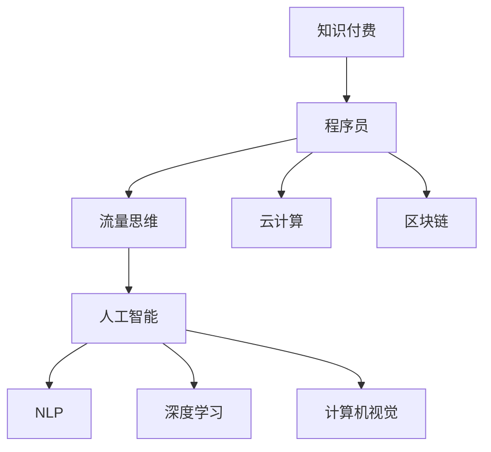

                 

# 知识付费：程序员的流量思维

> 关键词：知识付费,程序员,流量思维,人工智能,自然语言处理(NLP),深度学习,计算机视觉,云计算,区块链

## 1. 背景介绍

在互联网技术的飞速发展的今天，信息爆炸式增长，人们对于获取知识的途径也发生了巨大的变化。传统的书籍、报纸等逐渐被数字媒体所取代，而知识付费成为了一种新的趋势。然而，对于程序员而言，流量思维更是必不可少。流量是互联网公司生命力的源泉，程序员不仅要懂技术，更要懂如何吸引流量，如何让产品被更多人使用，如何通过用户数据进行优化和迭代。

## 2. 核心概念与联系

### 2.1 核心概念概述

为更好地理解程序员的流量思维，我们首先需要明确几个核心概念：

- **知识付费**：指通过付费方式获取高质量知识和服务的商业模式，如付费文章、在线课程、一对一咨询等。

- **程序员**：指编写、维护和优化计算机软件的人员，负责软件产品的开发、测试和维护。

- **流量思维**：指通过各种手段吸引、转化用户流量，提高产品曝光度和活跃度，实现商业价值的思维模式。

- **人工智能**：指模拟人类智能行为的技术，通过机器学习、深度学习等算法，使机器具备自主决策和分析能力。

- **自然语言处理(NLP)**：指使计算机能够理解和处理人类语言的学科，广泛应用于聊天机器人、文本分类、情感分析等。

- **深度学习**：指通过神经网络模拟人脑处理信息的能力，在计算机视觉、语音识别等领域有广泛应用。

- **计算机视觉**：指使计算机能够理解和处理图像和视频的技术，如人脸识别、图像识别等。

- **云计算**：指通过网络提供计算资源和服务的模式，实现资源的按需分配和弹性扩展。

- **区块链**：指一种去中心化的分布式数据库技术，通过加密算法保障数据安全，具有不可篡改、透明等特点。

这些核心概念之间的联系如下Mermaid流程图：



这个流程图展示了我们如何通过知识付费这一商业模式，将流量思维与程序员的职业紧密结合，同时通过人工智能、自然语言处理、深度学习、计算机视觉、云计算和区块链等技术，不断提升产品和服务的质量，吸引更多用户。

## 3. 核心算法原理 & 具体操作步骤
### 3.1 算法原理概述

程序员的流量思维主要是通过数据驱动的方式，不断优化产品功能和用户体验，实现用户增长和转化。具体而言，包括以下几个关键步骤：

1. **数据分析**：通过收集用户行为数据，分析用户需求和偏好。
2. **用户画像**：构建用户画像，帮助产品团队精准定位用户群体。
3. **产品迭代**：根据用户反馈和数据反馈，迭代优化产品功能。
4. **流量获取**：通过SEO、SEM、社交媒体、内容营销等方式，获取目标用户流量。
5. **流量转化**：设计合适的转化路径，提升用户留存和付费转化率。

这些步骤中，数据分析和用户画像尤其重要，因为它们是整个流量思维的基础。数据分析帮助我们理解用户行为，而用户画像则帮助我们定义产品目标用户，确保产品功能的针对性和用户体验的优化。

### 3.2 算法步骤详解

**Step 1: 数据收集与处理**

数据是程序员流量思维的核心。首先需要选择合适的数据源，包括用户行为数据、市场调研数据、公开数据等。然后对数据进行清洗、整合和预处理，使其符合后续分析的需求。例如，可以使用Python的Pandas库进行数据清洗和预处理。

```python
import pandas as pd

# 读取数据
data = pd.read_csv('data.csv')

# 清洗数据
data = data.dropna()

# 数据转换
data['time'] = pd.to_datetime(data['time'])
```

**Step 2: 数据分析与用户画像**

接下来，我们需要进行数据分析，并构建用户画像。数据分析可以使用Python的NumPy、SciPy、Matplotlib等库，进行统计分析和可视化。用户画像则可以使用Cluser等工具进行聚类和标签化。

```python
import numpy as np
import matplotlib.pyplot as plt

# 数据分析
mean_age = np.mean(data['age'])
plt.bar(data['gender'], data['age'])
plt.xlabel('Gender')
plt.ylabel('Age')

# 用户画像
from sklearn.cluster import KMeans
kmeans = KMeans(n_clusters=3)
kmeans.fit(data[['age', 'income']])
labels = kmeans.predict(data[['age', 'income']])
data['cluster'] = labels
```

**Step 3: 产品迭代与流量优化**

在用户画像的基础上，我们需要进行产品迭代和流量优化。产品迭代可以使用敏捷开发方法，快速迭代和优化产品功能。流量优化则需要设计合适的流量获取和转化策略，例如SEO优化、社交媒体推广、内容营销等。

**Step 4: 流量获取与转化**

最后，我们需要将流量获取与转化策略实施到实际应用中。使用Google Analytics等工具，实时监控流量数据和转化效果，不断优化和调整策略。

```python
from googleanalytics import GoogleAnalytics

# 获取流量数据
ga = GoogleAnalytics('ga-id')
ga.get_flow_data()

# 分析流量转化
ga.analyze_conversion_rates()
```

### 3.3 算法优缺点

程序员的流量思维具有以下优点：

- **数据驱动**：通过数据驱动，可以快速识别用户需求和优化产品功能。
- **快速迭代**：敏捷开发方法，可以快速迭代和优化产品，提高产品竞争力。
- **精准定位**：用户画像帮助产品团队精准定位用户群体，提升产品效果。
- **持续优化**：实时监控流量数据和转化效果，持续优化流量获取和转化策略。

但同时，也存在以下缺点：

- **数据隐私**：需要收集和处理大量用户数据，可能涉及用户隐私和数据安全问题。
- **资源消耗**：数据收集、分析和处理需要大量计算资源，可能带来成本压力。
- **市场竞争**：互联网公司之间竞争激烈，需要不断创新和优化，才能保持竞争优势。
- **技术门槛**：需要掌握数据分析、用户画像、产品迭代等技术，技术门槛较高。

### 3.4 算法应用领域

程序员的流量思维可以应用于各种互联网产品和服务中，例如：

- **社交网络**：通过分析用户行为和社交关系，优化用户互动和推荐算法，提升用户活跃度和留存率。
- **电商网站**：通过分析用户购买行为和产品属性，优化商品推荐和搜索算法，提高转化率和销售额。
- **在线教育**：通过分析用户学习行为和课程内容，优化课程推荐和个性化学习路径，提升用户体验和完成率。
- **金融科技**：通过分析用户交易行为和金融数据，优化投资策略和风险管理，提高金融服务的安全性和效率。
- **健康科技**：通过分析用户健康数据和行为，优化健康监测和个性化健康建议，提升用户健康水平。

这些应用领域都需要程序员通过流量思维，不断优化产品功能和用户体验，提升产品的竞争力和用户满意度。

## 4. 数学模型和公式 & 详细讲解 & 举例说明
### 4.1 数学模型构建

基于程序员流量思维的核心步骤，我们可以构建以下数学模型：

- **用户行为数据模型**：
  - 输入：用户行为数据
  - 输出：用户需求和偏好
  - 模型：统计分析和聚类算法

- **用户画像模型**：
  - 输入：用户行为数据
  - 输出：用户画像
  - 模型：特征提取和聚类算法

- **产品迭代模型**：
  - 输入：用户画像和产品反馈
  - 输出：产品迭代方案
  - 模型：优化算法和敏捷开发方法

- **流量获取模型**：
  - 输入：市场数据和流量策略
  - 输出：流量获取效果
  - 模型：SEO优化算法和内容营销策略

- **流量转化模型**：
  - 输入：流量数据和转化策略
  - 输出：转化效果
  - 模型：转化率优化算法和A/B测试

### 4.2 公式推导过程

以用户画像模型为例，假设我们收集了用户的年龄、收入、性别等数据，可以构建如下数学模型：

1. **特征提取**：
   - 年龄：$A$
   - 收入：$I$
   - 性别：$G$
   - 标签：$C$
   - 模型：$C = f(A, I, G)$

2. **聚类算法**：
   - 输入：特征向量
   - 输出：聚类标签
   - 模型：$C = kmeans(A, I, G)$

其中，$f$和$kmeans$为具体的算法模型。例如，可以使用K-means算法对用户数据进行聚类：

```python
from sklearn.cluster import KMeans

# 特征提取
features = data[['age', 'income', 'gender']]

# 聚类算法
kmeans = KMeans(n_clusters=3)
labels = kmeans.fit_predict(features)
```

### 4.3 案例分析与讲解

我们以社交网络平台为例，分析程序员的流量思维如何应用于实际场景。

1. **数据收集与处理**：
   - 数据源：用户行为数据、社交互动数据、公开数据等。
   - 数据清洗：去除重复、异常数据，处理缺失值。
   - 数据预处理：数据转换、归一化。

2. **数据分析与用户画像**：
   - 分析用户行为：用户活跃度、互动频率、关注兴趣等。
   - 构建用户画像：根据用户行为和互动数据，生成用户画像标签。

3. **产品迭代与流量优化**：
   - 迭代优化产品：根据用户反馈和数据分析，优化推荐算法、内容分发等。
   - 流量优化策略：SEO优化、社交媒体推广、内容营销等。

4. **流量获取与转化**：
   - 获取流量：通过社交媒体广告、内容营销等方式，获取目标用户。
   - 流量转化：设计合适的转化路径，提升用户留存和付费转化率。

以Facebook为例，Facebook通过数据分析和用户画像，优化推荐算法和内容分发，吸引用户流量并提高用户活跃度。同时，通过广告投放和内容营销，进一步扩大用户基础，提升商业价值。

## 5. 项目实践：代码实例和详细解释说明
### 5.1 开发环境搭建

在项目实践中，我们需要搭建开发环境，安装必要的库和工具。以下是Python开发环境搭建步骤：

1. 安装Anaconda：从官网下载并安装Anaconda，用于创建独立的Python环境。

2. 创建并激活虚拟环境：
```bash
conda create -n pyenv python=3.8 
conda activate pyenv
```

3. 安装Python库：
```bash
pip install numpy pandas matplotlib seaborn scikit-learn statsmodels jupyter notebook
```

4. 安装第三方库：
```bash
pip install tensorflow scikit-image requests
```

### 5.2 源代码详细实现

我们以社交网络推荐算法为例，给出使用TensorFlow进行推荐算法的Python代码实现。

首先，定义推荐算法的模型：

```python
import tensorflow as tf
from tensorflow.keras.layers import Input, Dense, Embedding, Dot, BatchNormalization

# 定义模型
def build_model(input_dim):
    inputs = Input(shape=(input_dim,))
    x = Embedding(input_dim, 128)(inputs)
    x = BatchNormalization()(x)
    x = Dot(axes=(2, 2))([x, x])
    x = Dense(128, activation='relu')(x)
    outputs = Dense(1, activation='sigmoid')(x)
    return tf.keras.Model(inputs, outputs)
```

然后，定义数据集和优化器：

```python
# 定义数据集
train_data = pd.read_csv('train_data.csv')
test_data = pd.read_csv('test_data.csv')

# 数据预处理
train_features = train_data[['user_id', 'item_id']]
train_labels = train_data['rating']

test_features = test_data[['user_id', 'item_id']]

# 定义优化器
optimizer = tf.keras.optimizers.Adam(lr=0.001)
```

最后，定义训练和评估函数：

```python
# 定义训练函数
def train(model, data, epochs):
    model.compile(loss='binary_crossentropy', optimizer=optimizer, metrics=['accuracy'])
    model.fit(data, epochs=epochs)

# 定义评估函数
def evaluate(model, data):
    model.evaluate(data)
```

### 5.3 代码解读与分析

让我们再详细解读一下关键代码的实现细节：

**build_model函数**：
- 定义了推荐算法的模型结构，包括输入层、嵌入层、归一化层、点乘层、全连接层和输出层。
- 嵌入层和归一化层使用Embedding和BatchNormalization，用于处理输入的高维稀疏特征。
- 点乘层和全连接层使用Dot和Dense，用于构建用户-物品相似度，并进行非线性变换。
- 输出层使用Sigmoid激活函数，用于生成二分类预测结果。

**train函数**：
- 编译模型，定义损失函数、优化器和评价指标。
- 使用训练数据集进行模型训练，设置训练轮数。

**evaluate函数**：
- 使用测试数据集进行模型评估，输出准确率等评价指标。

在实际应用中，我们可以根据具体场景，对推荐算法进行优化和改进，如引入用户画像、考虑冷启动问题等。同时，还可以引入自然语言处理技术，提高推荐系统的自然语言理解和生成能力。

## 6. 实际应用场景
### 6.1 社交网络推荐

社交网络推荐系统是程序员流量思维的主要应用场景之一。通过分析用户行为和社交关系，优化推荐算法，提升用户活跃度和留存率。例如，通过用户画像和社交关系，推荐用户可能感兴趣的内容和用户，提升用户互动和参与度。

### 6.2 电商网站推荐

电商网站推荐系统也是程序员流量思维的重要应用领域。通过分析用户购买行为和产品属性，优化商品推荐和搜索算法，提高转化率和销售额。例如，通过用户画像和行为分析，推荐相关产品，提升用户购买意愿和满意度。

### 6.3 在线教育推荐

在线教育推荐系统同样需要程序员流量思维的支持。通过分析用户学习行为和课程内容，优化课程推荐和个性化学习路径，提升用户体验和完成率。例如，根据用户的学习进度和兴趣，推荐适合的学习资源和课程，提高学习效率和效果。

### 6.4 未来应用展望

未来，程序员的流量思维将在更多领域得到应用，为传统行业带来变革性影响。

在智慧医疗领域，基于流量思维的医疗推荐系统，可以提升医疗服务的智能化水平，辅助医生诊疗，加速新药开发进程。

在智能教育领域，流量思维可应用于作业批改、学情分析、知识推荐等方面，因材施教，促进教育公平，提高教学质量。

在智慧城市治理中，流量思维可应用于城市事件监测、舆情分析、应急指挥等环节，提高城市管理的自动化和智能化水平，构建更安全、高效的未来城市。

此外，在企业生产、社会治理、文娱传媒等众多领域，基于流量思维的人工智能应用也将不断涌现，为经济社会发展注入新的动力。

## 7. 工具和资源推荐
### 7.1 学习资源推荐

为了帮助程序员掌握流量思维的理论基础和实践技巧，这里推荐一些优质的学习资源：

1. 《流量思维：程序员必读》：深入讲解程序员流量思维的核心概念、方法论和案例分析。

2. 《深度学习实战》：由Google工程师撰写的深度学习实践指南，涵盖推荐系统、NLP等前沿话题。

3. Coursera《机器学习》课程：斯坦福大学教授Andrew Ng开设的经典课程，涵盖机器学习算法和应用。

4. Udacity《深度学习专项》课程：Udacity推出的深度学习专项课程，从基础到高级全面覆盖深度学习知识。

5. 《自然语言处理综述》：介绍NLP领域的经典算法和技术，提供丰富的代码实例和数据集。

通过对这些资源的学习实践，相信你一定能够快速掌握程序员流量思维的精髓，并用于解决实际的NLP问题。

### 7.2 开发工具推荐

高效的开发离不开优秀的工具支持。以下是几款用于程序员流量思维开发的常用工具：

1. Python：Python是一种简洁、易学的编程语言，适合进行数据分析、机器学习等任务。

2. Jupyter Notebook：一个交互式的开发环境，支持代码编写、数据可视化和结果展示。

3. TensorFlow：由Google主导开发的深度学习框架，支持多种模型和算法，适用于复杂计算任务。

4. PyTorch：由Facebook开发的深度学习框架，适合快速原型设计和研究。

5. Flask：一个轻量级的Web框架，适合构建小型应用程序和API接口。

6. Django：一个全功能的Web框架，适合构建大型应用程序和数据驱动的应用程序。

合理利用这些工具，可以显著提升程序员流量思维的开发效率，加快创新迭代的步伐。

### 7.3 相关论文推荐

程序员流量思维的研究源于学界的持续研究。以下是几篇奠基性的相关论文，推荐阅读：

1. Click-Through and Conversion Rate Prediction with Deep Neural Networks（点击率和转化率预测）：提出了基于深度神经网络的点击率和转化率预测模型，提升广告效果。

2. Collaborative Filtering for Implicit Feedback Datasets（隐式反馈数据集上的协同过滤）：提出了基于协同过滤的推荐系统，提升用户推荐效果。

3. Deep Neural Networks for Language Understanding（深度神经网络理解语言）：提出了基于深度神经网络的自然语言处理模型，提升语言理解和生成能力。

4. Scalable Learning of Multilingual embeddings with Quasi-Parallel Training（基于近似并行训练的跨语言嵌入学习）：提出了基于近似并行训练的跨语言嵌入学习方法，提升跨语言NLP效果。

这些论文代表了大语言模型微调技术的发展脉络。通过学习这些前沿成果，可以帮助程序员把握学科前进方向，激发更多的创新灵感。

## 8. 总结：未来发展趋势与挑战
### 8.1 总结

本文对程序员的流量思维进行了全面系统的介绍。首先阐述了流量思维的重要性和核心概念，明确了流量思维在产品开发和用户体验中的关键作用。其次，从原理到实践，详细讲解了流量思维的核心步骤和关键技术，给出了流量思维任务开发的完整代码实例。同时，本文还广泛探讨了流量思维在社交网络、电商、教育等诸多领域的应用前景，展示了程序员流量思维的巨大潜力。

通过本文的系统梳理，可以看到，程序员的流量思维已经成为互联网产品开发的重要范式，极大地提升了产品的竞争力和用户体验。未来，伴随流量思维和人工智能技术的不断演进，相信程序员流量思维必将在更多领域大放异彩，深刻影响人类的生产生活方式。

### 8.2 未来发展趋势

展望未来，程序员流量思维将呈现以下几个发展趋势：

1. **数据驱动**：流量思维将更加依赖于大数据和数据驱动决策，通过数据挖掘和用户画像，提升产品效果。

2. **个性化推荐**：推荐系统将更加智能化和个性化，通过自然语言处理和深度学习技术，提升用户满意度和转化率。

3. **流量自动化**：自动化流量获取和转化策略，通过算法和工具实现流量优化，降低人工成本。

4. **跨领域应用**：流量思维将不断扩展到更多领域，如医疗、金融、健康等，提升不同行业的智能化水平。

5. **人机协同**：流量思维将结合AI技术，实现人机协同，提升用户互动和参与度。

6. **安全性保障**：流量思维将加强数据安全保护，确保用户隐私和数据安全。

以上趋势凸显了程序员流量思维的广阔前景。这些方向的探索发展，必将进一步提升产品的性能和用户体验，推动互联网产业的快速迭代和创新。

### 8.3 面临的挑战

尽管程序员流量思维已经取得了瞩目成就，但在迈向更加智能化、普适化应用的过程中，它仍面临着诸多挑战：

1. **数据隐私**：流量思维需要大量用户数据，可能涉及用户隐私和数据安全问题。如何保护用户隐私，保障数据安全，将是重要的研究方向。

2. **技术门槛**：流量思维涉及多种技术和算法，技术门槛较高。如何简化技术和算法，降低开发门槛，将是亟待解决的课题。

3. **用户接受度**：流量思维需要用户接受和配合，可能存在用户使用习惯和习惯的变化问题。如何提升用户体验，增强用户粘性，将是重要的研究课题。

4. **跨平台问题**：不同平台和设备的用户行为和需求存在差异，如何统一用户体验，实现跨平台一致性，将是重要的研究方向。

5. **资源消耗**：流量思维涉及大量计算和存储资源，可能带来成本压力。如何优化资源消耗，降低运营成本，将是重要的研究课题。

6. **算法复杂度**：流量思维涉及复杂算法和模型，可能存在算法收敛速度和效果的问题。如何简化算法，提高模型效率，将是重要的研究课题。

正视流量思维面临的这些挑战，积极应对并寻求突破，将使程序员流量思维成为未来产品开发的重要驱动力。相信随着学界和产业界的共同努力，这些挑战终将一一被克服，程序员流量思维必将在构建智能产品和服务中扮演越来越重要的角色。

### 8.4 研究展望

面对程序员流量思维所面临的种种挑战，未来的研究需要在以下几个方面寻求新的突破：

1. **数据隐私保护**：研究如何保护用户隐私和数据安全，确保用户数据不被滥用。

2. **技术简化**：研究如何简化技术和算法，降低开发门槛，提升产品开发效率。

3. **用户行为分析**：研究如何分析用户行为和需求，提高推荐效果和用户满意度。

4. **跨平台适配**：研究如何实现跨平台一致性，提升用户体验和产品竞争力。

5. **资源优化**：研究如何优化资源消耗，降低运营成本，提升产品效益。

6. **算法改进**：研究如何改进算法和模型，提高效率和效果，提升产品性能。

这些研究方向将引领程序员流量思维技术迈向更高的台阶，为构建安全、可靠、可解释、可控的智能产品和服务铺平道路。面向未来，程序员流量思维还需要与其他人工智能技术进行更深入的融合，如知识表示、因果推理、强化学习等，多路径协同发力，共同推动自然语言理解和智能交互系统的进步。只有勇于创新、敢于突破，才能不断拓展流量思维的边界，让智能技术更好地造福人类社会。

## 9. 附录：常见问题与解答
**Q1：程序员流量思维如何影响用户行为？**

A: 程序员流量思维通过对用户行为的深入分析和建模，能够帮助产品团队精准定位用户群体，优化产品功能和用户体验，从而影响用户行为。例如，通过推荐系统推荐用户感兴趣的内容和商品，提高用户参与度和满意度。

**Q2：程序员流量思维是否适用于所有产品？**

A: 程序员流量思维适用于大多数互联网产品，特别是在数据驱动和用户体验方面有较高要求的产品。但对于一些特殊领域的产品，如医疗、金融等，需要结合特定领域的数据和需求进行优化。

**Q3：流量思维如何平衡个性化推荐和用户隐私？**

A: 流量思维可以通过匿名化处理和隐私保护技术，平衡个性化推荐和用户隐私。例如，采用差分隐私技术，在保护用户隐私的同时，实现个性化推荐。

**Q4：流量思维如何优化流量获取和转化策略？**

A: 流量思维可以通过数据分析和A/B测试，优化流量获取和转化策略。例如，通过SEO优化和社交媒体推广，获取高质量流量；通过转化路径设计和个性化推荐，提高用户转化率和留存率。

**Q5：流量思维如何应对技术复杂度？**

A: 流量思维可以通过简化算法和优化资源消耗，应对技术复杂度。例如，采用轻量级模型和高效算法，提升模型效率和计算速度；采用分布式计算和云服务，降低计算和存储成本。

这些问题的解答有助于程序员更好地理解流量思维的原理和应用，同时为实际产品开发和优化提供指导。总之，程序员的流量思维已经成为互联网产品开发的重要范式，其核心在于通过数据驱动和用户体验优化，提升产品竞争力和用户满意度。面向未来，流量思维将不断演进和优化，为构建智能产品和服务提供新的动力。

