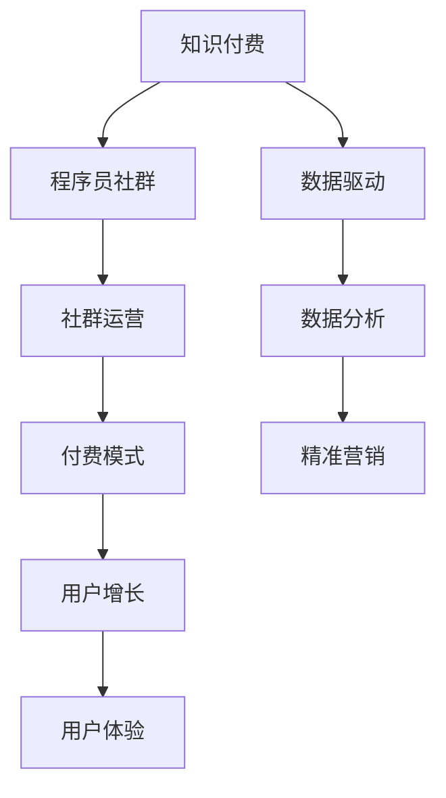

                 

# 知识付费：程序员的社群运营指导

> 关键词：知识付费, 程序员, 社群运营, 数据驱动, 用户增长, 用户体验

## 1. 背景介绍

### 1.1 问题由来
在数字化时代，知识付费作为一种新兴的商业模式，以其高效、便利、专业等特性，受到越来越多人群的青睐。其中，程序员群体在知识付费领域具有重要的地位。他们在软件开发、技术架构、项目管理、创业投资等方面有着丰富的知识和经验，是知识付费的重要供给方。

### 1.2 问题核心关键点
程序员社群运营的核心在于构建一个高效、互动、专业的平台，通过内容付费和知识传播，实现技术交流和职业发展。这其中，如何建立有效的付费机制、如何提升用户粘性、如何优化用户体验、如何提高用户转化率等，是社群运营面临的主要问题。

### 1.3 问题研究意义
本文聚焦于程序员社群运营中的知识付费模式，旨在提供一套系统化、实战性的运营指导，帮助社群管理者提升运营效率，吸引和留存更多优质用户，推动社群的健康发展，最终实现技术和知识的价值最大化。

## 2. 核心概念与联系

### 2.1 核心概念概述

为更好地理解知识付费模式下程序员社群运营的思路和方法，本节将介绍几个密切相关的核心概念：

- **知识付费**：基于知识内容的付费服务模式，用户通过付费获取特定知识和技能。
- **社群运营**：通过构建社群组织和平台，实现用户间的互动和知识共享。
- **程序员社群**：由技术爱好者和专业人士组成，以技术分享和交流为目的的线上线下聚集地。
- **付费模式**：包括单次付费、订阅服务、课程包、定制服务等多种形式，满足不同用户的需求。
- **用户增长**：通过有效的市场推广和运营手段，吸引新用户加入社群，扩大用户基数。
- **用户体验**：用户在使用产品或服务过程中获得的主观感受，直接影响用户粘性和留存率。

这些核心概念之间的逻辑关系可以通过以下Mermaid流程图来展示：



这个流程图展示出知识付费、程序员社群、社群运营、付费模式、用户增长、用户体验以及数据驱动之间的相互关系。通过这些概念，我们可以更好地理解知识付费下程序员社群运营的复杂性。

## 3. 核心算法原理 & 具体操作步骤

### 3.1 算法原理概述

知识付费模式下的程序员社群运营，本质上是一个基于用户行为和反馈的数据驱动优化过程。其核心思想是：通过对用户行为数据的分析，识别出用户的需求和偏好，进而优化社群运营策略，提升用户满意度和转化率。

形式化地，假设有一个程序员社群，其中用户总数为 $N$，每个用户对内容的需求程度可以用向量 $x \in \mathbb{R}^n$ 来表示，其中 $x_i=1$ 表示用户对第 $i$ 个内容感兴趣，$x_i=0$ 表示不感兴趣。社群的目标是最大化用户满意度和转化率，即最大化目标函数：

$$
\max_{x} \sum_{i=1}^n x_i f_i
$$

其中 $f_i$ 为第 $i$ 个内容的付费值。通过优化算法求解上述目标函数，即可找到最优的用户行为向量 $x^*$，从而确定最佳的付费内容组合。

### 3.2 算法步骤详解

知识付费模式下程序员社群运营的具体操作步骤可以分为以下几个步骤：

**Step 1: 数据收集与分析**
- 收集用户行为数据，包括访问时长、内容偏好、付费行为等。
- 使用数据挖掘和统计分析技术，提取用户需求和行为模式，如高频访问内容、热门课程等。

**Step 2: 内容推荐与优化**
- 基于用户行为数据，使用推荐算法（如协同过滤、内容匹配）为每个用户推荐最感兴趣的内容。
- 定期对推荐算法进行调整，提高推荐准确度，增加用户粘性。
- 持续优化内容质量，提高课程包、讲座等的专业性和实用性。

**Step 3: 付费模式设计**
- 设计多种付费模式，如单次付费、订阅服务、课程包等，满足不同用户的需求。
- 根据用户行为数据，动态调整付费内容的价格和营销策略，提升用户转化率。
- 引入激励机制，如会员特权、积分系统等，提升用户活跃度和忠诚度。

**Step 4: 用户增长与留存**
- 利用社交媒体、技术论坛、邮件营销等手段，吸引更多潜在用户加入社群。
- 通过内容营销、用户评价、社区活动等方式，提升用户满意度和口碑传播效应。
- 针对不同用户群体，设计针对性的运营策略，提升新用户的留存率。

**Step 5: 用户体验优化**
- 收集用户反馈，使用A/B测试等手段，不断优化产品界面和功能。
- 提供多平台支持，如网站、移动应用、微信小程序等，方便用户随时随地访问。
- 引入智能客服、在线咨询等功能，提升用户使用体验和满意度。

通过上述步骤，可以逐步构建一个高效、互动、专业的程序员社群运营体系，最大化知识付费平台的价值。

### 3.3 算法优缺点

知识付费模式下程序员社群运营具有以下优点：
1. 提升用户粘性：通过个性化推荐和精准营销，用户能够快速找到感兴趣的内容，提高使用频率和粘性。
2. 优化内容质量：数据分析和内容优化机制，可以不断提高课程和讲座的专业性和实用性，满足用户需求。
3. 提高转化率：多样化的付费模式和动态定价策略，可以更好地吸引和留住用户，提升转化率。
4. 增强社群活力：通过互动和分享机制，提升用户参与度和社区氛围，增强社群凝聚力。

同时，该方法也存在一定的局限性：
1. 数据隐私问题：用户行为数据的收集和分析可能涉及用户隐私，需要严格遵守法律法规。
2. 内容生产成本高：高质量内容的制作需要投入大量人力物力，成本较高。
3. 用户支付意愿低：部分用户可能对付费内容缺乏支付意愿，影响平台收入。
4. 运营复杂度高：需要综合考虑内容、用户、市场等多方面因素，运营难度较大。

尽管存在这些局限性，但就目前而言，知识付费模式下的程序员社群运营仍是大数据和人工智能应用的重要范式。未来相关研究的重点在于如何进一步降低运营成本，提高用户转化率，同时兼顾用户隐私和内容质量。

### 3.4 算法应用领域

知识付费模式下的程序员社群运营，已经在技术分享、职业发展、知识创业等多个领域得到了广泛的应用，具体包括：

- **技术分享**：程序员之间通过课程、讲座、博客等形式分享技术经验和心得，构建知识传播网络。
- **职业发展**：用户可以通过订阅专家课程、参加线下技术沙龙等方式，提升职业素养和技术水平。
- **知识创业**：社群管理者通过收费内容、在线课程等形式，转化知识为商业价值，实现商业变现。
- **开源社区**：开源项目的开发者通过付费社区、技术问答等方式，获取社区支持和资源，推动项目发展。
- **教育培训**：教育机构通过技术课程、线上培训等形式，提升学员技术水平，增强职业竞争力。

除了上述这些经典应用外，知识付费模式还在更多场景中得到创新性应用，如技术直播、在线咨询、项目合作等，为程序员社群带来新的发展机会。

## 4. 数学模型和公式 & 详细讲解 & 举例说明

### 4.1 数学模型构建

本节将使用数学语言对知识付费模式下程序员社群运营的优化过程进行更加严格的刻画。

记用户总数为 $N$，每个用户对内容的需求程度用向量 $x \in \mathbb{R}^n$ 表示，其中 $x_i=1$ 表示用户对第 $i$ 个内容感兴趣，$x_i=0$ 表示不感兴趣。假设内容总数为 $m$，每个内容的付费值为 $c_i$，则用户总付费收入为：

$$
\text{Total Revenue} = \sum_{i=1}^n \sum_{j=1}^m x_{ij} c_j
$$

其中 $x_{ij}=1$ 表示用户对内容 $j$ 进行了付费，$x_{ij}=0$ 表示未付费。社群的目标是最大化用户满意度和总付费收入，即最大化目标函数：

$$
\max_{x} \sum_{i=1}^n x_i \sum_{j=1}^m c_j f_{ij}
$$

其中 $f_{ij}$ 为第 $i$ 个用户对内容 $j$ 的满意度，可以根据用户行为数据和评价反馈计算得到。

### 4.2 公式推导过程

以下我们以二分类问题为例，推导推荐系统用户满意度的计算公式。

假设每个用户对内容的满意度可以通过一个评分矩阵 $F \in \mathbb{R}^{N \times m}$ 来表示，其中 $F_{ij}$ 表示用户 $i$ 对内容 $j$ 的满意度。假设用户对内容的付费决策基于满意度，即用户 $i$ 对内容 $j$ 付费的概率为 $p_{ij}=F_{ij}/ \sum_{k=1}^m F_{ik}$。

用户在内容 $j$ 上的总付费收入为：

$$
\text{Total Revenue}_{ij} = c_j p_{ij}
$$

社群的总付费收入为：

$$
\text{Total Revenue} = \sum_{i=1}^n \sum_{j=1}^m c_j p_{ij}
$$

将 $p_{ij}$ 代入目标函数，得：

$$
\max_{x} \sum_{i=1}^n x_i \sum_{j=1}^m c_j F_{ij}
$$

根据链式法则，目标函数对用户需求向量 $x$ 的梯度为：

$$
\frac{\partial \text{Total Revenue}}{\partial x_i} = \sum_{j=1}^m c_j F_{ij}
$$

在得到梯度后，即可使用梯度下降等优化算法，最小化目标函数，求解用户需求向量 $x$，从而确定最佳的内容推荐组合。

### 4.3 案例分析与讲解

我们以一个实际案例来说明上述理论的实际应用。假设有两个内容 $j_1$ 和 $j_2$，每个用户对内容的满意度分别为 $F_{i1}$ 和 $F_{i2}$。如果用户对内容 $j_1$ 付费的概率为 $p_{i1}=0.5$，对内容 $j_2$ 付费的概率为 $p_{i2}=0.3$，内容 $j_1$ 和 $j_2$ 的付费分别为 $c_1=10$ 和 $c_2=5$，则用户 $i$ 对内容的总付费收入为：

$$
\text{Total Revenue}_{i} = 10 \times 0.5 + 5 \times 0.3 = 8.5
$$

社群的总付费收入为：

$$
\text{Total Revenue} = \sum_{i=1}^n \times 8.5
$$

目标函数对用户需求向量 $x$ 的梯度为：

$$
\frac{\partial \text{Total Revenue}}{\partial x_i} = 10 \times F_{i1} + 5 \times F_{i2}
$$

通过优化算法求解上述目标函数，可以得到最优的用户需求向量 $x^*$，从而确定最佳的内容推荐组合，最大化社群总付费收入。

## 5. 项目实践：代码实例和详细解释说明

### 5.1 开发环境搭建

在进行知识付费模式下的程序员社群运营实践前，我们需要准备好开发环境。以下是使用Python进行Flask开发的环境配置流程：

1. 安装Anaconda：从官网下载并安装Anaconda，用于创建独立的Python环境。

2. 创建并激活虚拟环境：
```bash
conda create -n pythonsvr python=3.8 
conda activate pythonsvr
```

3. 安装Flask：
```bash
pip install flask
```

4. 安装Flask-RESTful：
```bash
pip install flask-restful
```

5. 安装Flask-SQLAlchemy：
```bash
pip install flask-sqlalchemy
```

6. 安装Flask-Mail：
```bash
pip install flask-mail
```

完成上述步骤后，即可在`pythonsvr`环境中开始项目实践。

### 5.2 源代码详细实现

下面我们将通过一个简单的Flask应用来演示知识付费模式下程序员社群运营的实现。

首先，我们需要定义一个用户模型和内容模型，并建立关联表：

```python
from flask_sqlalchemy import SQLAlchemy

app = Flask(__name__)
app.config['SQLALCHEMY_DATABASE_URI'] = 'sqlite:///data.db'
db = SQLAlchemy(app)

class User(db.Model):
    id = db.Column(db.Integer, primary_key=True)
    name = db.Column(db.String(50), unique=True)
    email = db.Column(db.String(120), unique=True)
    password = db.Column(db.String(60))

class Content(db.Model):
    id = db.Column(db.Integer, primary_key=True)
    name = db.Column(db.String(50))
    description = db.Column(db.String(100))
    price = db.Column(db.Float)
    user_id = db.Column(db.Integer, db.ForeignKey('user.id'))
    user = db.relationship('User', backref='contents')
```

然后，定义Flask路由和API接口：

```python
from flask import request, jsonify
from flask_restful import Resource, Api

api = Api(app)

class UserLogin(Resource):
    def post(self):
        data = request.json
        email = data.get('email')
        password = data.get('password')
        user = User.query.filter_by(email=email).first()
        if user and user.password == password:
            token = 'mytoken'
            return jsonify({'token': token}), 200
        else:
            return jsonify({'message': 'Invalid credentials'}), 401

class UserContent(Resource):
    def get(self, user_id):
        user = User.query.get(user_id)
        if user:
            contents = Content.query.filter_by(user_id=user.id).all()
            return jsonify([{'id': content.id, 'name': content.name, 'price': content.price} for content in contents]), 200
        else:
            return jsonify({'message': 'User not found'}), 404

api.add_resource(UserLogin, '/login')
api.add_resource(UserContent, '/users/<int:user_id>/content')
```

最后，启动Flask应用：

```python
if __name__ == '__main__':
    app.run(debug=True)
```

以上就是使用Flask实现知识付费模式下程序员社群运营的基本代码。可以看到，Flask提供了丰富的API接口，可以方便地实现用户注册、登录、内容查看等功能。

### 5.3 代码解读与分析

让我们再详细解读一下关键代码的实现细节：

**User类和Content类**：
- 定义了用户和内容的模型，并建立了关联表，便于查询和数据管理。
- 用户模型包括id、姓名、邮箱和密码等字段，内容模型包括id、名称、描述、价格和用户等字段。

**Flask路由和API接口**：
- 使用Flask-RESTful扩展定义了两个API接口，一个用于用户登录，另一个用于查询用户的内容。
- 用户登录接口使用post方法接收邮箱和密码，验证后返回一个token，用于后续的API调用。
- 用户内容查询接口使用get方法接收用户id，查询该用户购买的内容，并返回内容列表。

**Flask应用启动**：
- 使用Flask的run方法启动应用，并开启debug模式，方便调试。

可以看到，使用Flask开发知识付费模式下的程序员社群运营应用，代码实现相对简单，但功能全面，能够满足基本的需求。

## 6. 实际应用场景

### 6.1 技术分享平台

知识付费模式下的程序员社群运营，可以在技术分享平台上大展拳脚。传统技术分享平台往往存在内容质量参差不齐、用户粘性不足等问题。通过知识付费模式，平台可以筛选出高质量的内容，提高用户满意度和付费意愿。

例如，Stack Overflow、GitHub等平台，已经通过订阅服务和高级功能，实现了一定的知识付费模式，吸引了大量开发者加入。通过社区运营，平台可以组织技术沙龙、开源项目协作等活动，增强用户互动和社区凝聚力。

### 6.2 职业发展平台

知识付费模式下的程序员社群运营，可以为职业发展平台提供新的增长点。传统职业发展平台往往难以提供专业的技术培训和职业指导，用户付费意愿较低。通过知识付费模式，平台可以引入更多专业讲师和实战经验，提升课程的专业性和实用性。

例如，Udacity、Coursera等平台，通过高质量的课程和专家指导，实现了快速用户增长和品牌价值提升。通过社区运营，平台可以建立学员群，促进学员间的交流和合作，提高学习效果。

### 6.3 知识创业平台

知识付费模式下的程序员社群运营，还可以拓展到知识创业领域。传统知识创业平台往往面临内容生产和运营成本高、用户转化率低等问题。通过知识付费模式，平台可以筛选优质内容，提高用户转化率和收入。

例如，ThoughtWorks、Slack等平台，通过内容营销和社区运营，实现了商业变现和用户留存。通过社区运营，平台可以引入更多的创业项目和专家资源，推动项目发展。

### 6.4 开源社区平台

知识付费模式下的程序员社群运营，在开源社区平台也有着广泛的应用。传统开源社区平台往往难以维持社区活跃度和开发者参与度。通过知识付费模式，平台可以引入更多社区支持和资源，提高开发者参与度和社区凝聚力。

例如，Github、GitLab等平台，通过付费订阅和开源项目资助等形式，实现了社区的持续发展和繁荣。通过社区运营，平台可以组织技术会议、代码审查等活动，促进社区交流和合作。

## 7. 工具和资源推荐

### 7.1 学习资源推荐

为了帮助开发者系统掌握知识付费模式下的程序员社群运营的理论基础和实践技巧，这里推荐一些优质的学习资源：

1. **《数据驱动的产品运营》系列博文**：由产品经理和数据专家撰写，深入浅出地介绍了数据驱动的运营策略和方法，适用于知识付费平台的运营实践。

2. **《数据驱动的产品分析》书籍**：系统介绍了数据分析和A/B测试等方法，帮助产品经理通过数据优化产品运营，提高用户转化率。

3. **《用户增长黑客》课程**：由增长黑客领军人物Raj Amrute撰写，介绍了用户增长的全流程方法论，包括市场推广、用户留存等环节。

4. **《Google数据驱动的产品运营》书籍**：系统介绍了Google的产品运营方法和案例，涵盖用户行为分析、个性化推荐等内容。

5. **《数据科学实战》系列视频**：由数据科学家和产品专家主讲，涵盖了数据科学在产品运营中的实际应用，包括数据可视化、模型构建等。

通过对这些资源的学习实践，相信你一定能够快速掌握知识付费模式下的程序员社群运营的精髓，并用于解决实际的运营问题。

### 7.2 开发工具推荐

高效的开发离不开优秀的工具支持。以下是几款用于知识付费平台开发的常用工具：

1. **Flask**：轻量级Web框架，易于上手，灵活高效，适用于快速迭代的产品开发。

2. **Django**：全栈Web框架，功能强大，社区活跃，适用于大型项目开发。

3. **SQLAlchemy**：高级ORM框架，支持多种数据库，提供了强大的查询和管理功能。

4. **Flask-Mail**：邮件模块，支持邮件发送和接收，方便产品功能扩展。

5. **Flask-WTF**：表单模块，支持表单验证和数据绑定，提高产品安全性。

6. **Flask-RESTful**：RESTful API开发框架，支持API接口设计和管理。

7. **Jupyter Notebook**：交互式数据科学开发环境，支持Python、R等多种语言，适合数据探索和模型测试。

合理利用这些工具，可以显著提升知识付费平台开发的效率，加快创新迭代的步伐。

### 7.3 相关论文推荐

知识付费模式下的程序员社群运营，源于学界的持续研究。以下是几篇奠基性的相关论文，推荐阅读：

1. **《数据驱动的产品运营》论文**：介绍了数据驱动的运营策略和方法，适用于知识付费平台的运营实践。

2. **《用户增长的科学》论文**：系统介绍了用户增长的全流程方法论，包括市场推广、用户留存等环节。

3. **《数据驱动的产品分析》论文**：系统介绍了数据分析和A/B测试等方法，帮助产品经理通过数据优化产品运营，提高用户转化率。

4. **《知识付费平台的用户行为分析》论文**：通过实证研究，分析了知识付费平台的用户行为和付费动机，提出了优化建议。

5. **《基于知识图谱的内容推荐系统》论文**：介绍了知识图谱在内容推荐中的应用，提高了推荐系统的准确性和可解释性。

这些论文代表了大数据和人工智能在产品运营中的前沿研究，通过学习这些前沿成果，可以帮助研究者把握学科前进方向，激发更多的创新灵感。

## 8. 总结：未来发展趋势与挑战

### 8.1 总结

本文对知识付费模式下的程序员社群运营进行了全面系统的介绍。首先阐述了知识付费模式对程序员社群运营的重要性，明确了数据驱动的运营策略和方法，系统介绍了知识付费模式下的社群运营核心概念和关键问题。其次，从原理到实践，详细讲解了知识付费模式下的社群运营方法，提供了完整的代码实例和详细解释。同时，本文还探讨了知识付费模式在技术分享、职业发展、知识创业等多个领域的应用前景，展示了知识付费模式的巨大潜力。最后，本文精选了知识付费模式下的社群运营各类学习资源，力求为读者提供全方位的技术指引。

通过本文的系统梳理，可以看到，知识付费模式下的程序员社群运营是一个基于用户行为和反馈的数据驱动优化过程，通过个性化推荐和精准营销，最大化用户满意度和总付费收入。这一过程不仅适用于程序员社群，也适用于各类知识付费平台。未来，伴随大数据和人工智能技术的不断进步，知识付费模式下的社群运营将进入新的发展阶段，成为推动知识经济的重要手段。

### 8.2 未来发展趋势

展望未来，知识付费模式下的程序员社群运营将呈现以下几个发展趋势：

1. **数据智能分析**：通过引入机器学习和深度学习技术，提升用户行为分析和内容推荐的精准度，实现更加个性化的用户服务。

2. **多渠道运营**：除了网站和移动应用，还将拓展到社交媒体、视频平台等多渠道，提高用户覆盖面和粘性。

3. **社区自治化**：通过智能算法和社区规则，实现用户自我管理，增强社区自治性和参与度。

4. **内容生态化**：引入更多开源项目、开源课程等，构建完整的知识生态系统，提升平台价值。

5. **国际化发展**：扩展到全球市场，引入多元文化和语言内容，提升平台的国际影响力。

6. **AI赋能**：通过AI技术，实现自动化运营和智能化决策，提高运营效率和用户体验。

以上趋势凸显了知识付费模式下的程序员社群运营的广阔前景。这些方向的探索发展，必将进一步提升知识付费平台的运营效率，推动知识经济的健康发展。

### 8.3 面临的挑战

尽管知识付费模式下的程序员社群运营已经取得了显著成就，但在迈向更加智能化、普适化应用的过程中，它仍面临诸多挑战：

1. **内容质量参差不齐**：部分开发者可能缺乏系统化知识，提供的课程和讲座质量不高，影响用户满意度。

2. **用户行为复杂**：用户行为数据多样，难以精准分析和预测，需要引入更多的算法和工具。

3. **社区运营成本高**：社区运营需要持续投入人力和物力，成本较高，需要不断优化运营策略。

4. **用户体验不足**：产品界面和功能设计不够友好，难以满足用户期望，影响用户留存率。

5. **市场竞争激烈**：知识付费平台众多，市场竞争激烈，需要不断创新和优化，才能保持竞争力。

6. **法律法规风险**：用户数据隐私保护和内容版权问题，需要严格遵守法律法规，避免法律风险。

这些挑战需要开发者和运营者不断探索和改进，才能实现知识付费模式下的程序员社群运营的可持续发展。

### 8.4 研究展望

面对知识付费模式下的程序员社群运营所面临的种种挑战，未来的研究需要在以下几个方面寻求新的突破：

1. **内容质量提升**：引入更多专业讲师和实战经验，提升课程的专业性和实用性。

2. **用户行为分析**：通过引入机器学习和深度学习技术，提升用户行为分析和内容推荐的精准度。

3. **社区运营优化**：引入更多社区支持和资源，促进社区交流和合作，提升社区自治性和参与度。

4. **多渠道运营**：拓展到社交媒体、视频平台等多渠道，提高用户覆盖面和粘性。

5. **AI赋能**：通过AI技术，实现自动化运营和智能化决策，提高运营效率和用户体验。

6. **国际化发展**：扩展到全球市场，引入多元文化和语言内容，提升平台的国际影响力。

这些研究方向的探索，必将引领知识付费模式下的程序员社群运营进入新的发展阶段，为知识经济带来更多的机遇和挑战。

## 9. 附录：常见问题与解答

**Q1：知识付费模式如何筛选高质量内容？**

A: 知识付费平台可以通过用户评价、专家认证等方式，筛选高质量的内容。同时，引入内容推荐算法，根据用户行为数据，推荐用户感兴趣的内容，提高内容的曝光度和认可度。

**Q2：知识付费模式如何提升用户粘性？**

A: 知识付费平台可以通过个性化推荐、专属服务、社区互动等方式，提升用户粘性。定期推送高质量内容，举办线上线下活动，增强用户参与感和归属感。

**Q3：知识付费模式如何降低运营成本？**

A: 知识付费平台可以通过优化产品界面和功能，提高用户使用体验，减少客服和运营成本。引入智能算法和自动化运营手段，提高运营效率，降低人力和物力投入。

**Q4：知识付费模式如何应对市场竞争？**

A: 知识付费平台需要不断创新和优化，引入更多优质内容和功能，提高平台差异化竞争力。通过社区运营和品牌推广，提升用户口碑和市场影响力。

**Q5：知识付费模式如何保护用户隐私？**

A: 知识付费平台需要严格遵守法律法规，保护用户数据隐私。通过匿名化和数据脱敏等手段，确保用户数据安全。

---

作者：禅与计算机程序设计艺术 / Zen and the Art of Computer Programming

