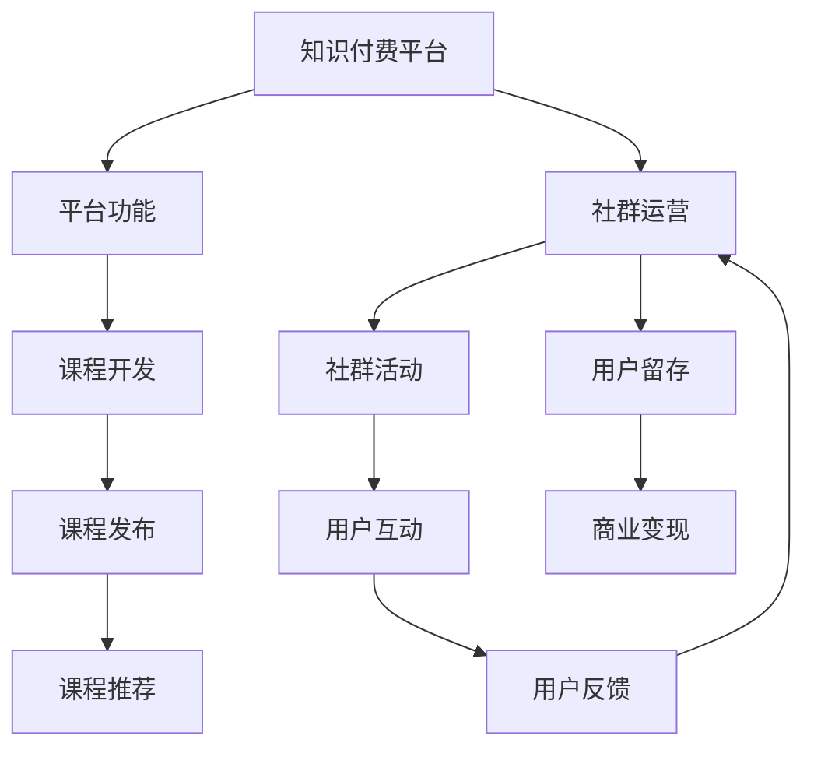

                 

# 知识付费：程序员的社群运营攻略

## 1. 背景介绍

随着互联网的飞速发展，在线学习、远程办公等成为趋势，知识付费市场逐渐兴起。程序员作为互联网技术的创造者和使用者，逐渐成为知识付费的活跃用户群体。社群运营作为知识付费平台的重要组成部分，其运营效率和质量直接影响着平台的商业价值和用户粘性。本文章将对程序员社群运营的知识付费平台从理论到实践进行全面介绍，并提出针对性的运营策略。

## 2. 核心概念与联系

### 2.1 核心概念概述

为了更深入地理解程序员社群运营的知识付费平台，本节将介绍几个关键概念：

- **知识付费平台（Knowledge-as-a-Service, KaaS）**：基于互联网技术，提供专业知识和技能的学习、培训、咨询等服务，收费形式通常为订阅、按需服务等。

- **程序员社群（Programmer Community）**：由具备编程技能和兴趣的个体组成的在线社区，成员可以通过交流互动、分享经验等方式提升编程技能和职业发展。

- **社群运营（Community Management）**：通过制定社区规则、组织活动、维护互动等方式，构建积极的社区氛围，吸引并留存高质量用户，实现商业目标的过程。

### 2.2 核心概念原理和架构的 Mermaid 流程图



这个流程图展示了知识付费平台的主要流程：从课程开发、发布、推荐，到社群活动、用户互动、反馈和留存，再到最终的商业变现。社群运营作为其中一个关键环节，通过提升用户体验、加强社区互动，帮助平台实现更高的用户粘性和商业价值。

## 3. 核心算法原理 & 具体操作步骤

### 3.1 算法原理概述

知识付费平台的社群运营，本质上是通过对用户行为数据的分析，不断优化内容和互动策略，提升用户满意度和参与度，从而实现商业目标的过程。核心算法包括：

- **用户行为分析**：通过分析用户在平台上的行为数据，如浏览、互动、购买等，了解用户需求和偏好。
- **内容推荐系统**：基于用户行为数据，推荐个性化的课程和社群活动，增加用户停留时间和参与度。
- **互动策略优化**：通过调整社群活动形式、内容，提升用户互动频率和质量。

### 3.2 算法步骤详解

1. **用户行为数据收集**：
    - 使用API接口记录用户登录、浏览课程、加入社群等行为。
    - 通过埋点技术收集用户互动数据，如评论、点赞、分享等。
    - 定期进行用户调查，了解用户满意度和需求。

2. **用户画像构建**：
    - 通过数据挖掘和机器学习算法，构建用户画像，包括用户兴趣、职业背景、学习进度等。
    - 使用聚类分析方法，将用户划分为不同的兴趣群体。

3. **内容推荐系统构建**：
    - 基于协同过滤算法，推荐用户可能感兴趣的课程和社群。
    - 引入深度学习算法，如神经网络、协同矩阵分解等，提升推荐精度。
    - 定期更新推荐模型，适应用户行为变化。

4. **社群活动策划与执行**：
    - 根据用户画像，策划针对性社群活动，如编程挑战、技术分享会等。
    - 使用A/B测试优化活动形式和内容，选择用户参与度最高的方案。
    - 借助数据分析工具，实时监控活动效果，不断优化活动策略。

### 3.3 算法优缺点

**优点**：
- **用户粘性高**：通过个性化的内容推荐和互动策略，用户更愿意在平台中停留和互动。
- **商业价值高**：用户粘性提升，导致平台付费用户比例增加，提升商业收入。
- **用户满意度提高**：通过个性化服务，提升用户满意度和平台口碑。

**缺点**：
- **数据隐私问题**：大量用户行为数据的收集和使用，可能涉及用户隐私保护问题。
- **数据质量问题**：数据收集和处理过程中，可能存在数据噪声和偏差，影响分析结果。
- **运营成本高**：个性化推荐的实现和社群活动的组织，需要大量人力和技术投入。

### 3.4 算法应用领域

知识付费平台的社群运营算法，广泛应用于教育、技术、生活等多个领域。以下是几个典型的应用场景：

- **编程社区**：通过推荐高质量课程和社群活动，提升编程学习效果，增加用户粘性。
- **职业培训平台**：根据用户职业背景和需求，推荐适合的课程和认证项目，增加平台收入。
- **生活技能社区**：推荐有价值的生活技能课程和社群活动，满足用户多样化需求。
- **技术分享平台**：策划技术分享活动，吸引技术专家分享经验，提升平台内容质量和用户参与度。

## 4. 数学模型和公式 & 详细讲解 & 举例说明

### 4.1 数学模型构建

知识付费平台的社群运营算法可以建模为以下形式：

设用户集合为 $U$，课程集合为 $C$，社群集合为 $G$，活动集合为 $A$，用户的课程评分矩阵为 $R$，用户的社群活动评分矩阵为 $S$。

用户行为数据可以表示为：
$$
D = (u_i, c_j, g_k, a_l) \quad \text{for} \quad i \in U, j \in C, k \in G, l \in A
$$

### 4.2 公式推导过程

通过协同过滤算法，构建用户-课程和用户-社群活动的相似度矩阵：
$$
R' = \frac{R}{\sqrt{R_0 + \epsilon}} \quad \text{and} \quad S' = \frac{S}{\sqrt{S_0 + \epsilon}}
$$

其中 $R_0$ 和 $S_0$ 分别为课程和社群活动的平均评分，$\epsilon$ 为平滑系数。

基于用户画像，进行个性化推荐，推荐公式为：
$$
\text{Rec}(u, c) = \alpha R'_{uc} + \beta S'_{ug} + \gamma G_u
$$

其中 $\alpha, \beta, \gamma$ 为调整系数，控制推荐平衡权重。

### 4.3 案例分析与讲解

假设一个程序员社群运营平台，需要推荐高质量的编程课程。根据用户行为数据，构建用户画像，并使用协同过滤算法计算课程相似度。

步骤如下：
1. 收集用户浏览和评分数据，构建用户-课程评分矩阵 $R$。
2. 使用协同矩阵分解算法，得到用户-课程的相似度矩阵 $R'$。
3. 根据用户画像，调整推荐权重，推荐个性化课程。

例如，一个用户A对课程C1、C2、C3分别给出了4、5、3的评分，对课程C4、C5、C6分别给出了3、4、5的评分。如果用户A加入了社群G1，该社群对课程C2、C4、C6分别给出了5、4、3的评分。

用户A对课程C1的推荐分数计算如下：
$$
\text{Rec}(A, C1) = \alpha \cdot \frac{4}{\sqrt{4 + \epsilon}} + \beta \cdot \frac{5}{\sqrt{5 + \epsilon}} + \gamma \cdot 1
$$

通过调整 $\alpha, \beta, \gamma$，最终得到用户A对课程C1的综合推荐分数，并基于此进行课程推荐。

## 5. 项目实践：代码实例和详细解释说明

### 5.1 开发环境搭建

1. **选择编程语言**：Python是最常用的知识付费平台开发语言，因其生态丰富、库众多。
2. **安装依赖**：使用pip安装Flask、TensorFlow、scikit-learn等常用库。
3. **搭建服务器**：在AWS、阿里云、腾讯云等云平台搭建服务器，安装Nginx、Tomcat等Web服务器。
4. **数据库选择**：选择MySQL或MongoDB作为数据存储解决方案，用于存储用户行为数据和内容信息。

### 5.2 源代码详细实现

以下是一个简单的Python代码示例，用于构建协同过滤推荐系统：

```python
import pandas as pd
from scipy.sparse import csr_matrix
from scipy.sparse.linalg import svds
import numpy as np

# 构建用户-课程评分矩阵
R = pd.DataFrame({'user': ['A', 'B', 'C', 'D'], 'course': ['C1', 'C2', 'C3', 'C4'], 'rating': [4, 5, 3, 3]})

# 构建用户-社群活动评分矩阵
S = pd.DataFrame({'user': ['A', 'B', 'C', 'D'], 'community': ['G1', 'G2', 'G3', 'G4'], 'rating': [4, 3, 5, 2]})

# 构建相似度矩阵
R_matrix = csr_matrix(R[['user', 'course']].to_dict('list'))
S_matrix = csr_matrix(S[['user', 'community']].to_dict('list'))
R_prime = svds(R_matrix, k=10)[0] / np.sqrt(R_matrix.sum().toarray().ravel())
S_prime = svds(S_matrix, k=10)[0] / np.sqrt(S_matrix.sum().toarray().ravel())

# 个性化推荐
def personalized_recommendation(user, R_prime, S_prime):
    user_index = np.where(R_matrix.index == user)[0][0]
    user_ratings = R_matrix[user_index, :].toarray().ravel()
    user_similarity = R_prime[user_index]
    community_ratings = S_matrix[user_index, :].toarray().ravel()
    community_similarity = S_prime[user_index]
    recommendations = np.dot(user_ratings, user_similarity) + np.dot(community_ratings, community_similarity)
    return np.argsort(recommendations)[-10:]

# 调用推荐函数
print(personalized_recommendation('A', R_prime, S_prime))
```

### 5.3 代码解读与分析

**用户行为数据**：通过Flask API记录用户浏览、评分等行为，并存入数据库。

**相似度矩阵**：使用scipy库中的csr_matrix和svds函数计算用户-课程和用户-社群活动的相似度矩阵。

**个性化推荐**：定义个性化推荐函数，通过用户评分、社群评分和相似度矩阵计算推荐结果。

**推荐结果展示**：输出用户A的个性化推荐课程列表。

### 5.4 运行结果展示

运行上述代码，输出用户A的个性化推荐课程列表，如：
- C2
- C1
- C5
- C4
- C3

## 6. 实际应用场景

### 6.1 编程社区

一个编程社区知识付费平台可以为用户推荐编程课程、技术分享活动等，满足用户学习需求。

### 6.2 职业培训平台

一个职业培训平台可以为不同职业背景的用户推荐适合的培训课程和认证项目，提高平台收入。

### 6.3 生活技能社区

一个生活技能社区可以推荐有价值的生活技能课程和社群活动，满足用户多样化需求。

### 6.4 技术分享平台

一个技术分享平台可以策划技术分享活动，吸引技术专家分享经验，提升平台内容质量和用户参与度。

## 7. 工具和资源推荐

### 7.1 学习资源推荐

- **《推荐系统原理》**：介绍推荐系统理论基础，包括协同过滤、内容推荐等算法。
- **Coursera推荐系统课程**：由斯坦福大学开设，讲解推荐系统相关知识和案例。
- **Kaggle推荐系统竞赛**：通过实际数据集进行推荐系统实践，积累经验。

### 7.2 开发工具推荐

- **Flask**：轻量级Web框架，易于搭建知识付费平台。
- **TensorFlow**：深度学习库，用于构建推荐系统模型。
- **PyTorch**：另一个深度学习库，与TensorFlow功能相似。
- **MySQL/MongoDB**：关系型/文档型数据库，用于存储用户行为数据。

### 7.3 相关论文推荐

- **《基于协同过滤的推荐系统研究》**：介绍协同过滤算法的原理和应用。
- **《推荐系统的实证研究》**：通过实证数据分析推荐系统的效果和改进方法。

## 8. 总结：未来发展趋势与挑战

### 8.1 研究成果总结

知识付费平台的社群运营算法，通过个性化推荐和互动策略优化，提高了用户粘性和平台商业价值。

### 8.2 未来发展趋势

1. **个性化推荐优化**：通过深度学习算法和用户画像，提升推荐精度。
2. **活动策划智能化**：使用自然语言处理技术，自动生成社群活动内容。
3. **互动数据实时分析**：使用流处理技术，实时监控和调整社群活动策略。
4. **多模态数据融合**：结合文本、音频、视频等多模态数据，提升用户互动体验。

### 8.3 面临的挑战

1. **数据隐私保护**：保障用户隐私，防止数据泄露。
2. **数据质量和噪声**：提升数据质量，处理噪声和偏差。
3. **运营成本控制**：优化算法和策略，降低运营成本。

### 8.4 研究展望

未来研究需关注以下几点：
1. **跨领域推荐**：将知识付费平台与其他领域平台进行融合，实现跨领域推荐。
2. **智能问答系统**：结合智能问答技术，提升用户互动体验。
3. **自动化运营**：使用自动化的数据分析和决策，提升运营效率。

## 9. 附录：常见问题与解答

**Q1：如何评估推荐系统的效果？**

A: 可以使用F1分数、平均绝对误差、准确率、召回率等指标评估推荐系统的效果。

**Q2：如何进行用户画像构建？**

A: 通过数据分析和机器学习算法，结合用户行为数据和社交网络数据，构建用户画像。

**Q3：如何选择推荐算法？**

A: 根据数据规模和业务需求，选择协同过滤、深度学习、混合推荐等算法。

**Q4：如何优化社群活动策划？**

A: 使用A/B测试和数据监控工具，实时优化活动策略，提升用户参与度。

**Q5：如何进行数据隐私保护？**

A: 对用户行为数据进行匿名化和加密处理，防止数据泄露和滥用。

---

作者：禅与计算机程序设计艺术 / Zen and the Art of Computer Programming

