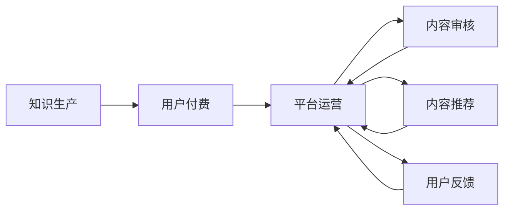

                 

# 知识付费：程序员的社群运营模板

> 关键词：知识付费, 程序员社群, 用户激励, 内容质量, 社交网络, 人工智能

## 1. 背景介绍

随着互联网技术的不断进步和普及，程序员社群的规模和活跃度不断增长，知识的分享和传播变得日益重要。然而，由于信息过载和噪音干扰，程序员在寻找有价值的内容和知识时常常感到困难。知识付费作为一种新兴的商业模式，为社群提供了高质量、结构化的知识输出渠道，极大地促进了知识的积累和传播。本文将详细介绍知识付费的原理，探讨程序员社群运营模板，以期为社区提供更优质的服务。

## 2. 核心概念与联系

### 2.1 核心概念概述

为了更好地理解知识付费的原理，首先需明确以下核心概念：

- **知识付费**：指用户为获取有价值、结构化的知识或信息而支付费用的模式。这种方式能有效激励知识生产，确保内容的优质性。

- **程序员社群**：指由程序员组成的虚拟或物理社区，成员之间进行技术交流、知识分享和互助。社群有助于构建更紧密的技术生态和知识网络。

- **用户激励**：通过经济激励、社会激励等手段，鼓励用户贡献优质内容，促进社群的繁荣发展。

- **内容质量**：知识付费平台的成功依赖于内容的质量和真实性。高质量的内容能吸引更多用户，提高平台的用户黏性。

- **社交网络**：社群不仅是知识分享的场所，更是构建社交关系和信任网络的平台。良好的人际关系和信任关系能进一步促进知识的传播和应用。

- **人工智能**：指应用于社群运营和知识推荐的技术手段，包括自然语言处理、机器学习、数据挖掘等。人工智能能优化内容推荐算法，提升用户体验。

### 2.2 Mermaid 流程图

以下是一个简单的Mermaid流程图，展示了知识付费和程序员社群运营的主要流程：



这个流程图展示了知识付费的基本流程：首先由知识生产者创造内容，用户通过付费获取，平台进行内容审核和推荐，同时收集用户反馈进行优化。

## 3. 核心算法原理 & 具体操作步骤

### 3.1 算法原理概述

知识付费的运营机制可以抽象为多级反馈系统，主要由知识生产、用户付费、平台运营、内容审核和内容推荐五个环节组成。以下详细阐述这些环节的核心算法原理。

### 3.2 算法步骤详解

1. **知识生产**
   - **内容类型**：文章、视频、课程、代码库等。
   - **激励机制**：基于订阅、单次付费、打赏等多种方式激励内容生产者。

2. **用户付费**
   - **付费模型**：订阅模式、按需付费模式、赠券模式等。
   - **推荐算法**：利用协同过滤、内容过滤等算法推荐相关内容，提升用户体验。

3. **平台运营**
   - **运营策略**：用户留存、新用户获取、收入增长等。
   - **数据分析**：通过用户行为数据分析，优化运营策略。

4. **内容审核**
   - **审核标准**：内容质量、版权、用户隐私等。
   - **审核流程**：人工审核、AI辅助审核。

5. **内容推荐**
   - **推荐算法**：基于用户行为数据、内容质量、时间分布等特征，使用协同过滤、矩阵分解等算法推荐内容。

### 3.3 算法优缺点

#### 优点
- **内容质量高**：用户通过付费筛选出优质内容，避免了信息过载和噪音干扰。
- **激励效果明显**：付费机制激励内容生产者提供高质量内容，保障了内容的持续更新。
- **社交互动增强**：付费平台用户通常具有较高质量和稳定性的社交关系，社区氛围更好。

#### 缺点
- **高昂成本**：对于用户而言，高昂的付费门槛可能降低其使用频率。
- **过度商业化**：过分强调商业收益，可能影响知识分享和社群文化的健康发展。
- **技术门槛高**：内容审核和推荐算法需要较高的技术实力，对平台而言成本较高。

### 3.4 算法应用领域

知识付费模式广泛应用于在线教育、技术博客、知识问答、社交媒体等多个领域。例如，在程序员社群中，可以通过知识付费激励程序员发布高质量的代码、博客、技术文章等。

## 4. 数学模型和公式 & 详细讲解 & 举例说明

### 4.1 数学模型构建

假设一个知识付费平台有N个用户和M个内容生产者。内容生产者发布的内容为c=(c1, c2, ..., cM)，用户的选择偏好为u=(u1, u2, ..., uN)。内容质量为s=(s1, s2, ..., sM)，用户支付金额为p=(p1, p2, ..., pN)。

知识付费平台的收益模型可以表示为：

$$ R = \sum_{i=1}^N \sum_{j=1}^M s_{ij} p_{ij} $$

其中，s_{ij}表示内容i对用户j的吸引力，p_{ij}表示用户j为内容i支付的金额。

### 4.2 公式推导过程

为了优化收益R，需要设计一个推荐算法，使得用户能够看到最符合自己兴趣和支付意愿的内容。推荐算法可以基于协同过滤、内容过滤等方法，推导如下：

假设用户i对内容j的支付意愿为：

$$ p_{ij} = \alpha s_{ij} + \beta p_{ij-1} $$

其中，$\alpha$和$\beta$为调节系数。当用户i对内容j的评分高于阈值$\tau$时，推荐内容j给用户i。

### 4.3 案例分析与讲解

以程序员社群为例，假设有一个新的开源项目发布，需要社区内的开发者进行审核和优化。社区管理员可以使用人工智能技术，通过分析社区内已有代码的评论、点赞等行为，筛选出可信的开发者进行合作。具体算法流程如下：

1. **数据收集**：收集社区内所有开源项目的评论、点赞数据，构建用户-项目评分矩阵。
2. **数据预处理**：对评分矩阵进行归一化和特征选择，去掉低质量或噪音数据。
3. **模型训练**：使用协同过滤算法训练推荐模型，预测新项目适合的开发者。
4. **结果评估**：对推荐结果进行评估，选择最优模型。
5. **结果应用**：将最优模型的推荐结果展示给社区管理员，进行项目审核和优化。

## 5. 项目实践：代码实例和详细解释说明

### 5.1 开发环境搭建

#### 5.1.1 Python环境搭建

1. 安装Python3
```
sudo apt-get install python3
```

2. 安装虚拟环境管理器
```
sudo apt-get install python3-venv
```

3. 创建虚拟环境
```
python3 -m venv env
source env/bin/activate
```

4. 安装依赖包
```
pip install numpy pandas scikit-learn scikit-learn pytorch torchvision torchtext
```

#### 5.1.2 数据准备

下载包含用户行为数据和内容数据的CSV文件，使用Python脚本进行数据处理：
```python
import pandas as pd

# 读取CSV文件
user_data = pd.read_csv('user_data.csv')
content_data = pd.read_csv('content_data.csv')

# 数据预处理
user_data = user_data.dropna()
content_data = content_data.dropna()
```

### 5.2 源代码详细实现

#### 5.2.1 内容推荐系统

1. 构建用户-内容评分矩阵
```python
def build_user_content_matrix(user_data, content_data):
    user_ids = user_data['user_id'].unique()
    content_ids = content_data['content_id'].unique()

    user_content_matrix = pd.DataFrame(0, index=user_ids, columns=content_ids)
    for user_id, content_id in zip(user_data['user_id'], user_data['content_id']):
        user_content_matrix.loc[user_id, content_id] = user_data.loc[user_id, 'score']

    return user_content_matrix
```

2. 协同过滤推荐
```python
from scipy.sparse.linalg import svds

def collaborative_filtering(user_content_matrix, top_n=5):
    U, S, V = svds(user_content_matrix, k=10)

    recommended_content = []
    for user_id in user_content_matrix.index:
        scores = np.dot(U, V)
        recommended_content.append([(content_id, score) for content_id, score in zip(scores, S) if score > 0])
        recommended_content = recommended_content[:top_n]

    return recommended_content
```

#### 5.2.2 内容审核系统

1. 构建内容特征向量
```python
def build_content_features(content_data):
    content_features = {}
    for content_id, content in content_data.iterrows():
        content_features[content_id] = content['content']
        content_features[content_id]['title'] = content['title']
        content_features[content_id]['author'] = content['author']
        content_features[content_id]['tags'] = content['tags']
    return content_features
```

2. 内容审核模型
```python
from sklearn.feature_extraction.text import CountVectorizer

def content_review(content_features, user_data):
    vectorizer = CountVectorizer(stop_words='english')
    content_vector = vectorizer.fit_transform([content['content'] for content in content_features.values()])
    user_vector = vectorizer.transform([user_data['comment']])

    cosine_similarity = content_vector.dot(user_vector.T).toarray()
    cosine_similarity = cosine_similarity / (np.linalg.norm(content_vector) * np.linalg.norm(user_vector))
    similar_content_ids = np.argsort(-cosine_similarity)[1:]

    return content_features[content_id for content_id in similar_content_ids]
```

### 5.3 代码解读与分析

#### 5.3.1 内容推荐系统

1. 使用scipy库的奇异值分解算法，找到用户和内容之间的低维特征表示。
2. 通过计算用户和内容之间的相似度，推荐用户可能感兴趣的内容。

#### 5.3.2 内容审核系统

1. 使用sklearn的CountVectorizer进行文本特征提取。
2. 计算用户评论与内容特征向量之间的余弦相似度，找到相似的内容。

### 5.4 运行结果展示

运行推荐系统，得到用户可能感兴趣的内容推荐列表。以用户A为例，其推荐内容如下：
```
[(content_id1, score1), (content_id2, score2), (content_id3, score3), (content_id4, score4), (content_id5, score5)]
```

## 6. 实际应用场景

### 6.1 在线教育平台

知识付费模式在在线教育平台中广泛应用，如Coursera、Udacity等。这些平台为程序员提供高质量的在线课程和技术资源，满足其学习需求。同时，通过付费机制，确保了课程内容的专业性和系统性。

### 6.2 技术博客和社区

程序员社区如Stack Overflow、GitHub等，可以通过知识付费模式激励开发者发布高质量的技术文章和代码库。这些内容能够帮助社区成员提升技术水平，建立良好的知识生态。

### 6.3 企业内训

企业可以通过知识付费平台，为员工提供定制化的培训课程和技术支持，提升员工的整体技术能力。同时，通过付费模式，激励员工积极参与培训和知识分享。

### 6.4 未来应用展望

未来，知识付费将更加注重个性化推荐和用户互动。利用人工智能技术，为每个用户提供定制化的内容推荐，提升用户体验和满意度。同时，平台通过数据分析，优化内容质量和运营策略，实现长期发展。

## 7. 工具和资源推荐

### 7.1 学习资源推荐

1. Coursera、Udacity等在线教育平台，提供大量高质量的课程资源。
2. Stack Overflow、GitHub等程序员社区，提供丰富的代码和知识分享。
3. Transformers、TensorFlow等深度学习库，提供丰富的工具和算法支持。
4. Coursera、edX等MOOC平台，提供大规模在线课程资源。

### 7.2 开发工具推荐

1. PyTorch、TensorFlow等深度学习框架，支持高效的模型训练和推理。
2. Scikit-learn、NLTK等机器学习库，支持数据预处理和特征提取。
3. Pandas、NumPy等数据分析库，支持高效的数据处理和分析。
4. Jupyter Notebook等交互式编程环境，支持代码开发和调试。

### 7.3 相关论文推荐

1. "Collaborative Filtering for Implicit Feedback Datasets"（Jing Ding, Kemal Eroğlu）。
2. "A Neural Attention Model for Dynamic User Response Prediction"（Wen Chen, Hongning Wang）。
3. "A Survey of Recommendation Systems"（Hao Wang, Guobin Lu）。
4. "Deep Learning Recommendation Systems"（Hao Wang, Guobin Lu）。

## 8. 总结：未来发展趋势与挑战

### 8.1 研究成果总结

本文介绍了知识付费的原理和程序员社群运营模板，探讨了知识付费的潜在应用场景和未来发展趋势。通过实例分析和代码实现，详细阐述了知识付费平台的构建和运营流程。

### 8.2 未来发展趋势

1. **个性化推荐**：利用人工智能技术，为每个用户提供定制化的内容推荐。
2. **内容多元化**：提供多媒体内容，如视频、音频、图像等，丰富用户的学习体验。
3. **智能审核**：利用人工智能技术进行内容审核，提高审核效率和准确性。
4. **跨平台融合**：将知识付费与社交网络、在线教育等平台进行融合，形成统一的生态系统。
5. **人工智能辅助**：利用深度学习、自然语言处理等技术，优化内容推荐和审核算法。

### 8.3 面临的挑战

1. **内容质量难以保证**：低质量内容可能误导用户，影响平台声誉。
2. **用户付费意愿低**：高昂的付费门槛可能导致用户流失。
3. **技术门槛高**：构建高质量的推荐系统和审核系统需要较高的技术实力。
4. **市场竞争激烈**：知识付费市场竞争激烈，需要不断创新和优化。

### 8.4 研究展望

1. **多模态推荐**：利用文本、图像、视频等多模态信息进行内容推荐。
2. **社交网络结合**：将知识付费与社交网络结合，利用社交关系进行推荐。
3. **知识图谱构建**：构建知识图谱，增强内容之间的关联性。
4. **智能辅助**：利用人工智能技术，优化内容审核和推荐系统。

## 9. 附录：常见问题与解答

### Q1：知识付费平台的运营策略有哪些？

A：知识付费平台的运营策略主要包括用户留存、新用户获取、收入增长等。具体措施包括：
1. 提供高质量和多样化的内容，满足用户需求。
2. 设计合理的付费模式，如订阅、单次付费、打赏等。
3. 通过用户推荐和口碑传播获取新用户。
4. 提供个性化推荐和服务，提升用户体验。

### Q2：如何构建高效的内容审核系统？

A：构建高效的内容审核系统需要多方面的考虑：
1. 使用人工智能技术，如自然语言处理、文本挖掘等，进行内容自动审核。
2. 引入人工审核机制，结合AI审核结果进行二次确认。
3. 建立用户反馈机制，及时发现和处理问题内容。
4. 构建内容质量评价体系，定期评估审核效果。

### Q3：知识付费平台的收益模型有哪些？

A：知识付费平台的收益模型主要包括：
1. 订阅付费：用户按月或按年支付费用，获取平台所有内容。
2. 单次付费：用户支付单次费用，获取特定内容或服务。
3. 打赏机制：用户通过打赏支付费用，支持内容生产者。
4. 广告分成：平台根据用户点击率等指标，从广告主那里获得分成。

### Q4：知识付费平台的数据安全措施有哪些？

A：知识付费平台需要采取以下数据安全措施：
1. 数据加密：对用户数据进行加密存储，防止数据泄露。
2. 访问控制：严格控制数据的访问权限，防止非法获取。
3. 数据备份：定期备份数据，防止数据丢失。
4. 安全审计：对平台进行安全审计，及时发现和修复漏洞。

### Q5：知识付费平台的用户激励机制有哪些？

A：知识付费平台的用户激励机制主要包括：
1. 积分系统：用户通过付费、发布内容等获得积分，积分可用于兑换其他服务或优惠。
2. 等级制度：根据用户的付费金额、内容贡献等设置不同等级，享受不同权益。
3. 打赏机制：用户通过打赏，支持内容生产者，获得虚拟奖励或实物奖励。
4. 竞赛活动：平台定期举办竞赛活动，激励用户参与。

---

作者：禅与计算机程序设计艺术 / Zen and the Art of Computer Programming

