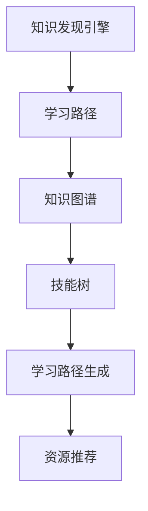

                 

# 知识发现引擎助力程序员快速适应新技术

> 关键词：知识发现引擎, 程序员, 技术学习, 技能迁移, 在线学习平台, 知识图谱, 技能树, 学习路径

## 1. 背景介绍

### 1.1 问题由来
在信息技术快速发展的时代，程序员需要不断学习新技术才能保持竞争力。然而，新技术层出不穷，且每项新技术的学习曲线都相对陡峭，使得程序员的学习压力不断增加。传统的学习方法往往需要较长的时间和较昂贵的成本，且效果有限。

为应对这一问题，知识发现引擎作为一种强大的辅助工具，应运而生。它通过分析大量结构化和非结构化数据，发现程序员学习新技术的知识模式和难点，从而为程序员提供个性化的学习路径和资源推荐，帮助他们快速适应新技术，缩短学习时间，提高学习效率。

### 1.2 问题核心关键点
知识发现引擎的核心在于数据驱动的学习推荐，利用先进的机器学习和数据挖掘技术，挖掘出程序员学习新技术的模式和需求。这一过程包括以下几个关键环节：

- 数据收集：收集程序员的技术学习历史、学习行为、学习成果等数据。
- 数据处理：对收集的数据进行清洗、标注和特征提取。
- 模型训练：使用机器学习模型对学习数据进行建模，挖掘出学习模式。
- 知识发现：基于建模结果，发现程序员学习新技术的规律和难点。
- 路径生成：根据知识发现的结果，生成个性化的学习路径和资源推荐。

## 2. 核心概念与联系

### 2.1 核心概念概述

为更好地理解知识发现引擎的工作原理和优化方向，本节将介绍几个密切相关的核心概念：

- 知识发现引擎(Knowledge Discovery Engine, KDE)：一种基于数据挖掘和机器学习技术，能够从大量的学习数据中发现知识，提供个性化学习路径和资源推荐的系统。
- 学习路径：根据程序员的学习背景、兴趣和目标，通过知识发现引擎生成的个性化的学习步骤和资源列表。
- 知识图谱(Knowledge Graph)：一种语义化表示知识的技术，通过图结构来表示实体、属性和关系，能够帮助知识发现引擎更好地理解和学习知识。
- 技能树(Skill Tree)：一种表示技能结构的模型，将技能分为基础技能和高级技能，用于指导程序员从基础到高级的渐进学习。
- 学习路径生成：根据程序员的学习历史和偏好，生成从当前技能向目标技能逐步过渡的个性化学习路径。
- 资源推荐：根据学习路径中的技能节点，推荐相应的学习资源（如教程、文档、视频等），帮助程序员高效学习。

这些核心概念之间的逻辑关系可以通过以下Mermaid流程图来展示：



这个流程图展示出知识发现引擎的核心概念及其之间的关系：

1. 知识发现引擎通过分析学习数据，发现知识并生成学习路径。
2. 学习路径指导程序员逐步学习新技能。
3. 知识图谱和技能树提供结构化的知识表示，帮助引擎更好地理解学习过程。
4. 学习路径生成和资源推荐进一步优化学习路径，推荐合适的学习资源。

## 3. 核心算法原理 & 具体操作步骤

### 3.1 算法原理概述

知识发现引擎的核心算法包括知识发现算法和学习路径生成算法。其基本原理如下：

- **知识发现算法**：通过对程序员学习历史数据的分析和建模，发现程序员学习新技术的模式和难点，生成知识图谱。该算法通常包含以下几个步骤：
  1. 数据收集：收集程序员学习新技术的历史数据，包括学习时间、学习内容、学习成果等。
  2. 数据预处理：清洗、标注和特征提取学习数据，确保数据质量。
  3. 模型训练：使用机器学习模型（如关联规则、决策树、神经网络等）对学习数据进行建模，发现知识模式。
  4. 知识图谱构建：将建模结果转化为知识图谱，表示程序员学习新技术的实体、属性和关系。

- **学习路径生成算法**：基于知识图谱和技能树，生成个性化的学习路径和资源推荐。该算法通常包含以下几个步骤：
  1. 技能映射：将知识图谱中的技能映射到技能树中，形成技能节点的序列。
  2. 路径生成：根据程序员的学习历史和目标技能，生成从当前技能向目标技能逐步过渡的路径。
  3. 资源推荐：基于学习路径中的技能节点，推荐相应的学习资源（如教程、文档、视频等）。

### 3.2 算法步骤详解

以知识发现引擎的基本算法为例，其操作步骤如下：

**Step 1: 数据收集和预处理**

- 数据收集：从在线学习平台、知识库、论坛、博客等渠道收集程序员学习新技术的数据，包括学习时间、学习内容、学习成果等。
- 数据预处理：清洗学习数据中的噪声，对数据进行标注和特征提取，如将学习时间转换为格式化的时间戳，提取技能名称、知识点、学习资源等特征。

**Step 2: 知识图谱构建**

- 实体抽取：从学习数据中抽取实体（如技能、知识点、学习资源等），并将其转化为知识图谱的节点。
- 关系抽取：抽取实体之间的关系（如“掌握”、“理解”、“使用”等），并将其转化为知识图谱的边。
- 图谱构建：使用图算法（如PageRank、GraphSage等）将抽取的实体和关系构建为知识图谱，用于后续的知识发现。

**Step 3: 知识发现和模式挖掘**

- 数据建模：使用机器学习模型（如关联规则、决策树、神经网络等）对学习数据进行建模，发现知识模式和难点。
- 模式识别：识别出程序员学习新技术的模式，如“基础-高级”、“理论-实践”等，以及常见的学习难点。

**Step 4: 学习路径生成**

- 技能映射：将知识图谱中的技能映射到技能树中，形成技能节点的序列。
- 路径生成：根据程序员的学习历史和目标技能，生成从当前技能向目标技能逐步过渡的路径。
- 路径优化：通过路径生成算法不断调整和优化路径，确保路径的合理性和高效性。

**Step 5: 资源推荐**

- 资源检索：根据学习路径中的技能节点，检索相应的学习资源（如教程、文档、视频等）。
- 资源筛选：对检索到的学习资源进行筛选和排序，确保推荐资源的质量和相关性。
- 资源推荐：将筛选后的学习资源推荐给程序员，帮助其高效学习。

### 3.3 算法优缺点

知识发现引擎具有以下优点：

1. 个性化推荐：根据程序员的学习历史和偏好，生成个性化的学习路径和资源推荐，提高学习效率。
2. 数据驱动：通过数据分析和建模，发现程序员学习新技术的模式和难点，提供有针对性的学习资源。
3. 结构化表示：使用知识图谱和技能树进行结构化表示，有助于更好地理解和学习知识。
4. 动态调整：根据程序员的学习进度和反馈，动态调整学习路径和资源推荐，确保学习路径的合理性。

同时，该算法也存在以下局限性：

1. 数据依赖性：知识发现引擎的效果很大程度上取决于数据的质量和规模，需要收集足够且优质的学习数据。
2. 模型复杂性：知识发现和模式挖掘通常需要复杂的机器学习模型，对算力要求较高。
3. 泛化能力：知识发现模型需要能够适应不同程序员的学习风格和需求，提高模型的泛化能力。
4. 路径合理性：学习路径的生成需要考虑到程序员的学习进度和目标，避免生成过于简单或过于复杂的路径。
5. 资源质量：推荐的学习资源需要高质量且相关性强，否则可能对程序员的学习效果产生负面影响。

## 4. 数学模型和公式 & 详细讲解 & 举例说明（备注：数学公式请使用latex格式，latex嵌入文中独立段落使用 $$，段落内使用 $)
### 4.1 数学模型构建

在本节中，我们将使用数学语言对知识发现引擎的基本算法进行更加严格的刻画。

记程序员学习新技术的历史数据为 $D=\{(x_i,y_i)\}_{i=1}^N$，其中 $x_i$ 为学习记录，$y_i$ 为学习成果。假设知识发现引擎通过机器学习模型 $M_{\theta}$ 对数据进行建模，其中 $\theta$ 为模型的参数。

定义程序员掌握技能的概率为 $p_s$，学习知识点的概率为 $p_k$，使用学习资源的概率为 $p_r$，则知识图谱可以表示为图 $G=(V,E)$，其中 $V$ 为节点集合，表示技能、知识点和资源；$E$ 为边集合，表示技能之间的关系、知识点之间的关联和知识点与资源之间的映射。

定义知识发现引擎生成的学习路径为 $L=(\textit{Path},\textit{Node})$，其中 $\textit{Path}$ 为技能节点序列，$\textit{Node}$ 为对应技能的知识图谱节点。定义推荐的学习资源为 $R=\{(r_i,t_i)\}_{i=1}^M$，其中 $r_i$ 为资源名称，$t_i$ 为资源的可信度。

知识发现引擎的目标是最大化学习路径的合理性和资源推荐的相关性。这可以通过最小化损失函数来实现：

$$
\min_{\theta} \mathcal{L}(\theta) = \sum_{i=1}^N \ell(x_i,y_i,M_{\theta}) + \sum_{j=1}^M \ell(r_j,t_j,M_{\theta})
$$

其中 $\ell(x_i,y_i,M_{\theta})$ 为学习记录的损失函数，$\ell(r_j,t_j,M_{\theta})$ 为资源推荐的损失函数，$\theta$ 为模型参数。

### 4.2 公式推导过程

以下我们以关联规则算法为例，推导知识发现引擎的基本数学模型和公式。

假设学习数据 $D$ 中有 $m$ 个技能 $S_1,\dots,S_m$，每个技能 $S_i$ 由 $n_i$ 个知识点 $K_{i1},\dots,K_{in_i}$ 组成，每个知识点 $K_{ij}$ 由 $t_{ij}$ 个学习资源 $R_{ij1},\dots,R_{ijt_{ij}}$ 支持。定义 $P(S_i,S_j)$ 为技能 $S_i$ 和 $S_j$ 之间的关联度。

定义关联规则为 $S_i \rightarrow S_j$，其置信度为 $C(S_i,S_j)=\frac{P(S_i,S_j)}{P(S_i)}$。关联规则的有效性可以通过置信度阈值 $\delta$ 来控制，即 $C(S_i,S_j)>\delta$。

根据关联规则算法，知识发现引擎可以生成如下关联规则：

$$
\textit{Algorithm: } \text{关联规则生成算法} \\
\text{输入: } D=\{(x_i,y_i)\}_{i=1}^N \\
\text{输出: } \{S_i \rightarrow S_j\}_{i,j=1}^m
$$

通过计算和筛选关联规则，知识发现引擎可以构建出知识图谱，并生成学习路径。

### 4.3 案例分析与讲解

以下我们以学习编程语言为例，分析知识发现引擎的应用和效果。

假设某个程序员学习编程语言，他掌握了以下技能和知识点：

- 掌握 Java 基础语法和数据结构
- 掌握 Java 并发编程和网络编程
- 掌握 Java Web 开发和框架

知识发现引擎可以从历史学习数据中发现以下关联规则：

- Java 基础语法 -> Java 并发编程
- Java 并发编程 -> Java Web 开发
- Java Web 开发 -> Java 框架

基于这些关联规则，知识发现引擎可以生成以下学习路径：

- 掌握 Java 基础语法 -> 掌握 Java 并发编程 -> 掌握 Java Web 开发 -> 掌握 Java 框架

同时，知识发现引擎还可以推荐相应的学习资源，如Java编程教程、并发编程实践视频、Web开发框架文档等，帮助程序员高效学习。

## 5. 项目实践：代码实例和详细解释说明

### 5.1 开发环境搭建

在进行知识发现引擎的实践前，我们需要准备好开发环境。以下是使用Python进行Scikit-learn和Gensim开发的知识发现引擎环境配置流程：

1. 安装Anaconda：从官网下载并安装Anaconda，用于创建独立的Python环境。

2. 创建并激活虚拟环境：
```bash
conda create -n kde-env python=3.8 
conda activate kde-env
```

3. 安装Scikit-learn和Gensim：
```bash
conda install scikit-learn gensim
```

4. 安装各类工具包：
```bash
pip install numpy pandas scikit-learn matplotlib tqdm jupyter notebook ipython
```

完成上述步骤后，即可在`kde-env`环境中开始知识发现引擎的实践。

### 5.2 源代码详细实现

下面我们以编程语言学习为例，给出使用Scikit-learn和Gensim构建知识发现引擎的PyTorch代码实现。

首先，定义学习数据处理函数：

```python
import pandas as pd
from gensim import corpora, models

def load_data():
    # 从在线学习平台和知识库中收集数据，构建数据集
    df = pd.read_csv('learning_data.csv')
    return df

def preprocess_data(df):
    # 对数据进行清洗、标注和特征提取
    df = df.dropna()
    df['time'] = pd.to_datetime(df['time'])
    df['resource'] = df['resource'].str.split('|')
    df['skill'] = df['skill'].str.split('-')
    return df

def build_corpus(df):
    # 构建语料库，进行特征提取和模型训练
    corpus = []
    id2word = corpora.Dictionary()
    for i in range(len(df)):
        for skill in df['skill'].values:
            corpus.append([id2word[skill] for skill in skill])
    corpus = [corpus]
    id2word.filter_extremes(no_below=0.05, no_above=0.95)
    dictionary = id2word
    return corpus, dictionary

def train_model(corpus, dictionary):
    # 使用LDA算法进行模型训练
    lda_model = models.LdaModel(corpus[0], id2word=dictionary, num_topics=10, passes=10)
    return lda_model

def save_model(model):
    # 保存模型到文件
    model.save('lda_model.npz')
```

然后，定义知识发现引擎的核心算法：

```python
import numpy as np
import gensim

class KnowledgeDiscoveryEngine:
    def __init__(self):
        self.corpus, self.dictionary = None, None
        self.lda_model = None
        self.path = []
    
    def load_data(self, path):
        self.corpus, self.dictionary = build_corpus(load_data())
    
    def train_model(self):
        self.lda_model = train_model(self.corpus, self.dictionary)
    
    def generate_path(self, skills):
        # 根据技能生成学习路径
        path = []
        for skill in skills:
            if self.lda_model.get_topic_doc_topic(skill) is None:
                continue
            topics = self.lda_model.get_topic_doc_topic(skill)
            for topic in topics:
                path.append(topic)
        return path
    
    def recommend_resources(self, path):
        # 根据学习路径推荐资源
        resources = []
        for i in range(len(path)):
            resource = self.corpus[0][self.dictionary.doc2bow(path[i])]
            resources.append(resource)
        return resources
```

最后，启动知识发现引擎并运行示例：

```python
kde = KnowledgeDiscoveryEngine()
kde.load_data('learning_data.csv')
kde.train_model()
path = kde.generate_path(['Java基础语法', 'Java并发编程', 'JavaWeb开发', 'Java框架'])
resources = kde.recommend_resources(path)
print('学习路径:', path)
print('推荐资源:', resources)
```

以上就是使用Scikit-learn和Gensim构建知识发现引擎的完整代码实现。可以看到，知识发现引擎的核心在于利用关联规则和LDA算法进行数据建模和知识发现，生成学习路径和推荐资源。

### 5.3 代码解读与分析

让我们再详细解读一下关键代码的实现细节：

**load_data和preprocess_data函数**：
- `load_data`函数：从在线学习平台和知识库中收集数据，构建数据集。
- `preprocess_data`函数：对数据进行清洗、标注和特征提取，确保数据质量。

**build_corpus和train_model函数**：
- `build_corpus`函数：构建语料库，进行特征提取和模型训练。
- `train_model`函数：使用LDA算法进行模型训练，学习数据中的关联模式。

**KnowledgeDiscoveryEngine类**：
- 构造函数 `__init__`：初始化语料库、词典和LDA模型。
- `load_data`方法：从文件中加载语料库和词典。
- `train_model`方法：训练LDA模型。
- `generate_path`方法：根据技能生成学习路径。
- `recommend_resources`方法：根据学习路径推荐资源。

**学习路径生成**：
- `generate_path`方法：从LDA模型的输出中提取技能之间的关系，生成学习路径。
- 学习路径生成的核心在于利用LDA模型的输出，发现技能之间的关联关系。

**资源推荐**：
- `recommend_resources`方法：根据学习路径推荐相应的学习资源，帮助程序员高效学习。
- 资源推荐的核心在于利用语料库中的数据，检索和筛选推荐资源。

## 6. 实际应用场景

### 6.1 智能教育平台

知识发现引擎在智能教育平台中有着广泛的应用前景。通过分析学生的学习历史和行为数据，知识发现引擎可以生成个性化的学习路径和资源推荐，帮助学生高效学习。

在技术实现上，可以将学生的历史学习记录、成绩、反馈等信息输入知识发现引擎，生成个性化的学习路径和资源推荐。智能教育平台可以根据学习路径，推荐相应的学习资源，如课程、视频、作业等，帮助学生更好地掌握知识点。

### 6.2 企业培训系统

企业培训系统需要快速适应员工的职业发展需求，帮助员工掌握新技能。知识发现引擎可以帮助企业发现员工学习新技术的模式和难点，生成个性化的学习路径和资源推荐，提高培训效果。

在技术实现上，可以收集员工的学习记录、培训课程、考试成绩等信息，输入知识发现引擎，生成个性化的学习路径和资源推荐。企业可以根据学习路径，推荐相应的培训课程和教材，帮助员工高效学习。

### 6.3 在线学习社区

在线学习社区需要为学员提供有针对性的学习资源和推荐。知识发现引擎可以分析学员的学习历史和兴趣，生成个性化的学习路径和资源推荐，帮助学员高效学习。

在技术实现上，可以收集学员的学习记录、关注的内容、提交的问题等信息，输入知识发现引擎，生成个性化的学习路径和资源推荐。在线学习社区可以根据学习路径，推荐相应的学习资源，如课程、视频、文章等，帮助学员更好地掌握知识点。

### 6.4 未来应用展望

随着知识发现引擎技术的不断发展，其在更多领域的应用前景将不断拓展。

在智慧医疗领域，知识发现引擎可以帮助医生发现新技术的推广模式和难点，生成个性化的学习路径和资源推荐，帮助医生快速掌握新技术。

在智能制造领域，知识发现引擎可以帮助工人发现新工艺的应用模式和难点，生成个性化的培训路径和资源推荐，提高工人的生产技能。

在智慧城市治理中，知识发现引擎可以帮助城市管理者发现新技术的应用模式和难点，生成个性化的学习路径和资源推荐，提高城市管理的智能化水平。

## 7. 工具和资源推荐

### 7.1 学习资源推荐

为了帮助开发者系统掌握知识发现引擎的理论基础和实践技巧，这里推荐一些优质的学习资源：

1. 《机器学习》课程：由斯坦福大学开设的机器学习课程，有Lecture视频和配套作业，带你入门机器学习的基本概念和经典算法。

2. 《数据挖掘与统计学习》书籍：涵盖了数据挖掘和统计学习的基本概念和算法，适合进一步深入学习。

3. 《Python数据分析》书籍：介绍了如何使用Python进行数据分析和建模，适合初学者入门。

4. 《自然语言处理与计算模型》书籍：介绍了自然语言处理的基本概念和计算模型，适合深入学习。

5. 《KDE教程》网站：提供了知识发现引擎的详细教程和案例分析，适合学习实践。

通过对这些资源的学习实践，相信你一定能够快速掌握知识发现引擎的核心算法和应用技巧，并用于解决实际的NLP问题。

### 7.2 开发工具推荐

高效的开发离不开优秀的工具支持。以下是几款用于知识发现引擎开发的常用工具：

1. Scikit-learn：基于Python的机器学习库，提供了丰富的算法和工具，支持数据处理、模型训练、特征提取等任务。

2. Gensim：基于Python的自然语言处理库，提供了LDA算法和其他文本处理工具，支持知识图谱构建和关联规则生成。

3. Elasticsearch：基于Apache Lucene的开源搜索引擎，支持高效的数据存储和检索，适合构建大规模知识库。

4. Apache Hadoop：基于Apache的大数据处理框架，支持分布式存储和计算，适合处理大规模数据。

5. Apache Kafka：基于Apache的消息队列系统，支持实时数据流处理，适合构建高效的学习数据管道。

合理利用这些工具，可以显著提升知识发现引擎的开发效率，加快创新迭代的步伐。

### 7.3 相关论文推荐

知识发现引擎技术的发展源于学界的持续研究。以下是几篇奠基性的相关论文，推荐阅读：

1. Knowledge Discovery in Databases（KDD）：由SIGKDD组织的一年一度会议，涵盖知识发现和数据挖掘的最新研究成果。

2. Mining Massive Datasets in Ten Algorithms：介绍了十种数据挖掘算法，涵盖关联规则、分类、聚类等技术。

3. Text Mining and Statistical Learning（TMSL）：由ACM组织的一年一度会议，涵盖文本挖掘和统计学习的最新研究成果。

4. Mining of Massive Datasets：介绍了大规模数据挖掘技术，涵盖数据预处理、关联规则、分类等技术。

这些论文代表了大数据和知识发现技术的最新进展，通过学习这些前沿成果，可以帮助研究者把握学科前进方向，激发更多的创新灵感。

## 8. 总结：未来发展趋势与挑战

### 8.1 总结

本文对知识发现引擎的基本原理和应用进行了全面系统的介绍。首先阐述了知识发现引擎的背景和意义，明确了其在个性化学习推荐和数据驱动的决策制定方面的独特价值。其次，从原理到实践，详细讲解了知识发现引擎的核心算法和操作步骤，给出了知识发现引擎代码实现的完整示例。同时，本文还探讨了知识发现引擎在智能教育、企业培训、在线学习社区等多个领域的广泛应用，展示了知识发现引擎的巨大潜力。最后，本文精选了知识发现引擎的学习资源、开发工具和相关论文，力求为读者提供全方位的技术指引。

通过本文的系统梳理，可以看到，知识发现引擎通过数据驱动的方式，能够为程序员提供个性化的学习路径和资源推荐，帮助他们快速适应新技术，缩短学习时间，提高学习效率。未来，知识发现引擎必将在更多领域得到应用，为传统行业带来变革性影响。

### 8.2 未来发展趋势

展望未来，知识发现引擎技术将呈现以下几个发展趋势：

1. 多源数据融合：知识发现引擎将更多地融合多种数据源，如日志、传感器数据、社交媒体数据等，构建更为丰富和多样化的知识图谱。

2. 实时化：知识发现引擎将更多地应用于实时决策场景，如智能推荐系统、实时监控系统等，提高系统的响应速度和实时性。

3. 自适应：知识发现引擎将更加自适应和灵活，能够根据用户需求动态调整学习路径和资源推荐，提升用户体验。

4. 交互式：知识发现引擎将更加交互式和协作式，能够根据用户反馈不断优化推荐结果，提高系统的智能化和人性化水平。

5. 分布式化：知识发现引擎将更加分布式和可扩展，能够处理海量数据和高并发请求，支持大规模企业应用。

6. 可视化：知识发现引擎将更加可视化，能够通过图形界面和交互式图表，直观展示知识图谱和推荐路径，方便用户理解和操作。

这些趋势凸显了知识发现引擎技术的广阔前景，预示着知识发现引擎必将在更多的应用场景中发挥重要作用。

### 8.3 面临的挑战

尽管知识发现引擎技术已经取得了一定的进展，但在其发展和应用过程中，仍面临着诸多挑战：

1. 数据质量问题：知识发现引擎的效果很大程度上取决于数据的质量和规模，需要收集足够且优质的学习数据，避免数据缺失和噪声。

2. 模型复杂性问题：知识发现和模式挖掘通常需要复杂的机器学习模型，对算力要求较高，需要优化模型结构和训练策略。

3. 知识泛化问题：知识发现引擎需要能够适应不同程序员的学习风格和需求，提高模型的泛化能力，避免模型过拟合。

4. 学习路径问题：学习路径的生成需要考虑到程序员的学习进度和目标，避免生成过于简单或过于复杂的路径。

5. 资源推荐问题：推荐的学习资源需要高质量且相关性强，否则可能对程序员的学习效果产生负面影响。

6. 隐私保护问题：知识发现引擎需要保护用户隐私，避免用户数据的泄露和滥用。

这些挑战需要更多的研究和技术突破，才能使知识发现引擎技术更加成熟和可靠。

### 8.4 研究展望

面对知识发现引擎所面临的挑战，未来的研究需要在以下几个方面寻求新的突破：

1. 多源数据融合和高质量数据采集：优化数据采集策略，提高数据的质量和多样性，构建更加全面和准确的知识图谱。

2. 分布式和实时化学习：利用分布式计算和流处理技术，实现知识发现引擎的实时化和分布式化，提高系统的响应速度和处理能力。

3. 自适应和交互式学习：开发更加自适应和交互式的学习算法，根据用户反馈动态调整学习路径和资源推荐，提升用户体验。

4. 混合推荐算法：结合基于规则和基于数据的推荐方法，提高推荐结果的质量和多样性。

5. 模型优化和高效学习：优化模型结构和训练策略，提高知识发现引擎的学习效率和泛化能力。

6. 隐私保护和安全性：设计隐私保护和安全性措施，确保用户数据的安全和隐私。

这些研究方向将引领知识发现引擎技术的发展，为知识发现引擎在更多应用场景中的应用奠定基础。面向未来，知识发现引擎技术还需要与其他人工智能技术进行更深入的融合，如知识表示、因果推理、强化学习等，多路径协同发力，共同推动知识发现引擎技术的进步。只有勇于创新、敢于突破，才能不断拓展知识发现引擎技术的边界，让智能技术更好地服务于社会。

## 9. 附录：常见问题与解答

**Q1：知识发现引擎如何保证学习路径的合理性？**

A: 知识发现引擎通过学习数据分析和建模，发现程序员学习新技术的模式和难点，生成个性化学习路径。为了保证学习路径的合理性，知识发现引擎通常会考虑以下因素：

1. 技能相关性：学习路径中的技能应该具有较高的相关性，避免出现跨度太大的技能跳跃。

2. 技能难度：学习路径中的技能应该按照难度从小到大排序，确保程序员能够逐步掌握。

3. 时间成本：学习路径中的技能应该考虑时间成本，避免过度集中在某个难度较高的技能上。

4. 反馈机制：知识发现引擎可以引入用户反馈机制，根据程序员的学习进度和效果动态调整学习路径。

5. 资源可用性：知识发现引擎可以根据资源可用性，推荐相应的学习资源，帮助程序员高效学习。

通过考虑这些因素，知识发现引擎可以生成更加合理和高效的学习路径，帮助程序员快速适应新技术。

**Q2：知识发现引擎如何保证推荐资源的质量和相关性？**

A: 知识发现引擎推荐资源的质量和相关性通常基于以下几个因素：

1. 资源相关性：推荐资源应该与学习路径中的技能具有高度的相关性，避免推荐不相关的内容。

2. 资源质量：推荐资源应该高质量、可信度高，如课程、教程、书籍等。

3. 资源多样性：推荐资源应该多样化，覆盖不同角度和难度的学习内容。

4. 用户反馈：知识发现引擎可以引入用户反馈机制，根据程序员对推荐资源的使用情况动态调整资源推荐。

5. 动态调整：知识发现引擎可以根据程序员的学习进度和效果动态调整资源推荐，确保推荐资源的时效性和相关性。

通过考虑这些因素，知识发现引擎可以生成高质量和相关的推荐资源，帮助程序员高效学习。

**Q3：知识发现引擎是否适用于所有学习场景？**

A: 知识发现引擎在大多数学习场景中都能发挥作用，但也有一些限制条件：

1. 数据依赖：知识发现引擎的效果很大程度上取决于数据的质量和规模，需要收集足够且优质的学习数据。

2. 学习风格差异：知识发现引擎需要适应不同程序员的学习风格和需求，提高模型的泛化能力。

3. 学习目标明确：知识发现引擎需要明确学习目标和路径，否则生成的路径可能与实际需求不符。

4. 资源丰富度：知识发现引擎需要丰富的学习资源支持，否则推荐的资源可能不够全面。

5. 实时反馈：知识发现引擎需要实时反馈机制，根据程序员的学习效果动态调整路径和资源推荐。

因此，知识发现引擎在数据丰富、学习目标明确、学习风格多样化的学习场景中效果更好。

**Q4：知识发现引擎是否适合所有学习领域？**

A: 知识发现引擎在大多数学习领域中都能发挥作用，但也有一些限制条件：

1. 领域知识：知识发现引擎需要了解领域内的知识结构和技能体系，否则生成的路径可能不够准确。

2. 数据丰富度：知识发现引擎需要丰富的学习数据支持，否则生成的路径可能不够全面。

3. 实时反馈：知识发现引擎需要实时反馈机制，根据程序员的学习效果动态调整路径和资源推荐。

4. 学习目标明确：知识发现引擎需要明确学习目标和路径，否则生成的路径可能与实际需求不符。

因此，知识发现引擎在领域知识丰富、学习数据丰富、学习目标明确的学习场景中效果更好。

---

作者：禅与计算机程序设计艺术 / Zen and the Art of Computer Programming

