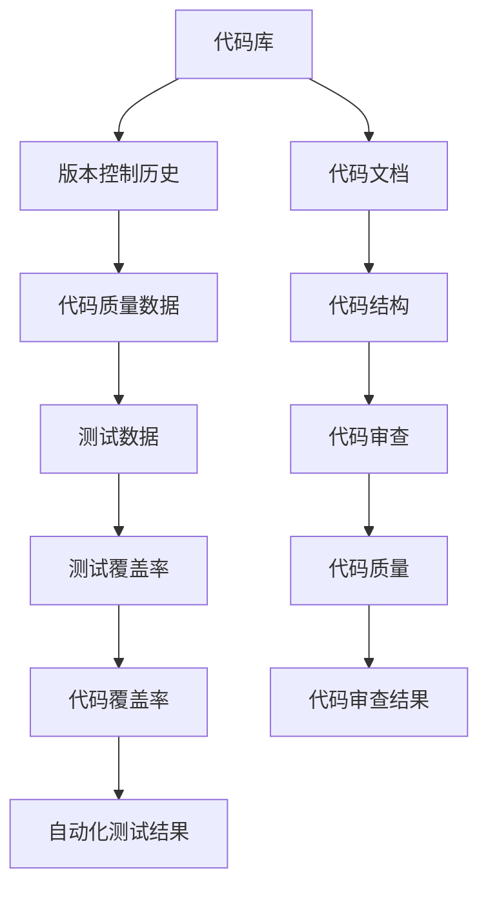

                 

# 知识发现引擎助力程序员突破技术瓶颈

> 关键词：知识发现引擎, 代码理解, 技术瓶颈, 编程辅助, 自动化测试, 代码审查

## 1. 背景介绍

在软件开发过程中，程序员往往需要面对各种各样的技术瓶颈。这些瓶颈包括但不限于代码理解难度高、代码质量差、测试覆盖率不足、代码审查效率低等问题。为了有效解决这些问题，许多开发团队和工具厂商开始探索使用知识发现引擎(Knowledge Discovery Engine, KDE)来辅助程序员进行代码理解和自动化测试，从而提高开发效率和代码质量。

知识发现引擎是利用机器学习和数据挖掘技术，从程序员的代码库、文档、问题报告、版本控制历史等信息中提取知识，为程序员提供实时的编程辅助、自动化测试和代码审查。本文将详细介绍知识发现引擎的核心概念、工作原理及操作步骤，并通过数学模型和代码实例进行详细讲解和展示，帮助程序员突破技术瓶颈，提升软件开发效率和质量。

## 2. 核心概念与联系

### 2.1 核心概念概述

为了更好地理解知识发现引擎的工作原理和操作步骤，本节将介绍几个核心概念：

- **知识发现引擎(Knowledge Discovery Engine, KDE)**：基于机器学习和数据挖掘技术，从程序员的代码库、文档、版本控制历史等信息中提取知识，辅助程序员进行代码理解、自动化测试和代码审查的工具。
- **代码理解**：利用代码中的结构、变量、函数等元素，结合代码库和版本控制信息，帮助程序员快速理解代码的意图和设计。
- **自动化测试**：通过分析和提取代码中的关键模块和交互点，自动生成测试用例，辅助程序员进行代码质量保证。
- **代码审查**：利用代码质量模型和历史数据，辅助程序员进行代码审查，提高代码质量和安全性的检测。
- **机器学习**：利用训练好的机器学习模型，从历史数据中提取规律和知识，用于代码理解、测试和审查。
- **数据挖掘**：通过数据挖掘技术，从大量的编程数据中提取知识，辅助程序员进行自动化分析。

这些核心概念之间的逻辑关系可以通过以下Mermaid流程图来展示：



这个流程图展示了大规模编程数据分析和处理的全过程，以及知识发现引擎在其中的作用。

## 3. 核心算法原理 & 具体操作步骤
### 3.1 算法原理概述

知识发现引擎的核心原理可以概括为以下四个步骤：

1. **数据采集**：从代码库、文档、版本控制历史等信息中收集数据。
2. **数据清洗和预处理**：清洗数据，去除噪声和冗余信息，对数据进行标准化处理。
3. **知识提取**：利用机器学习和数据挖掘技术，从数据中提取知识和规律。
4. **知识应用**：将提取的知识应用于代码理解、自动化测试和代码审查等任务，辅助程序员进行编程。

这些步骤涉及大量的数据处理和算法实现，本文将详细介绍每个步骤的算法原理和操作步骤。

### 3.2 算法步骤详解

#### 3.2.1 数据采集

数据采集是知识发现引擎的第一步，需要从代码库、版本控制历史、文档、问题报告等信息中收集数据。这些数据通常包括但不限于：

- **代码库数据**：包含代码的源码、注释、变量、函数等信息。
- **版本控制历史数据**：记录代码的变化记录、作者、提交时间等信息。
- **文档数据**：包含代码库中的README文件、模块文档、API文档等信息。
- **问题报告数据**：包含代码库中的Issue、Pull Request等信息。

#### 3.2.2 数据清洗和预处理

数据清洗和预处理是知识发现引擎的第二个步骤，主要目的是从原始数据中提取有用信息，去除噪声和冗余信息。具体包括：

- **去重**：去除重复的数据，提高数据质量。
- **数据标准化**：将不同格式的数据标准化，便于后续处理。
- **数据补全**：补充缺失的数据，提高数据完整性。

#### 3.2.3 知识提取

知识提取是知识发现引擎的核心步骤，主要利用机器学习和数据挖掘技术，从数据中提取知识和规律。具体包括：

- **特征提取**：从代码库数据中提取关键特征，如函数调用、变量使用、注释等。
- **分类和聚类**：利用分类和聚类算法，将代码库中的函数和变量进行分组，识别相似和相关的代码片段。
- **关联规则挖掘**：利用关联规则挖掘算法，从代码库中提取变量之间的关系和代码之间的依赖关系。
- **序列模式挖掘**：利用序列模式挖掘算法，识别代码库中的函数调用序列和代码结构序列。

#### 3.2.4 知识应用

知识应用是知识发现引擎的最后一个步骤，主要将提取的知识应用于代码理解、自动化测试和代码审查等任务，辅助程序员进行编程。具体包括：

- **代码理解**：利用代码质量模型和代码结构，辅助程序员进行代码理解。
- **自动化测试**：通过分析和提取代码中的关键模块和交互点，自动生成测试用例，辅助程序员进行代码质量保证。
- **代码审查**：利用代码质量模型和历史数据，辅助程序员进行代码审查，提高代码质量和安全性的检测。

## 4. 数学模型和公式 & 详细讲解 & 举例说明

### 4.1 数学模型构建

知识发现引擎的核心数学模型可以概括为以下几个部分：

- **代码特征提取模型**：利用特征提取算法，从代码库数据中提取关键特征。
- **代码分类和聚类模型**：利用分类和聚类算法，对代码进行分组。
- **代码关联规则模型**：利用关联规则挖掘算法，提取代码之间的依赖关系。
- **代码序列模式模型**：利用序列模式挖掘算法，提取代码结构序列。

### 4.2 公式推导过程

以代码分类和聚类模型为例，进行公式推导。

假设有一个代码库 $D$，包含 $n$ 个代码片段，每个代码片段 $x_i$ 包含 $m$ 个特征 $f_1, f_2, \ldots, f_m$。

- **K-Means算法**：用于代码聚类，将代码片段分为 $k$ 类。

  $$
  k-means: \min_{C, \mu_k} \sum_{i=1}^n \min_{k=1}^k \| x_i - \mu_k \|^2
  $$

  其中，$C$ 为聚类结果，$\mu_k$ 为聚类中心的均值向量。

- **支持向量机算法**：用于代码分类，将代码片段分为正负样本。

  $$
  SVM: \min_{w, b} \frac{1}{2} \| w \|^2 + C \sum_{i=1}^n \max(0, 1 - y_i(x_i \cdot w + b))
  $$

  其中，$w$ 为分类器权重向量，$b$ 为偏置项，$y_i$ 为代码片段的标签。

### 4.3 案例分析与讲解

以GitHub代码库为例，展示知识发现引擎的应用场景。

- **代码分类**：将代码库中的函数和变量根据功能进行分类，如将变量分为输入、输出、局部变量等。
- **代码聚类**：将相似函数和变量进行聚类，识别出常用的代码片段和功能模块。
- **代码关联规则**：提取代码库中的函数调用关系和变量依赖关系，帮助程序员理解代码结构。
- **代码序列模式**：识别代码库中的函数调用序列和代码结构序列，辅助程序员进行代码理解和自动化测试。

## 5. 项目实践：代码实例和详细解释说明

### 5.1 开发环境搭建

知识发现引擎的开发环境包括Python、TensorFlow、PyTorch等深度学习框架，以及GitHub、Git等版本控制工具。具体步骤如下：

1. **安装Python**：从官网下载Python安装包，安装Python环境。
2. **安装TensorFlow和PyTorch**：使用pip安装TensorFlow和PyTorch，确保版本匹配。
3. **安装Git**：从官网下载Git安装包，安装Git环境。
4. **安装GitHub**：从官网下载GitHub安装包，安装GitHub客户端。

### 5.2 源代码详细实现

以下是知识发现引擎的代码实现，以分类和聚类为例：

```python
import tensorflow as tf
import numpy as np
from sklearn.cluster import KMeans

# 定义数据集
data = np.array([[1, 2], [3, 4], [5, 6], [7, 8], [9, 10]])

# 定义分类器
classifier = tf.keras.Sequential([
    tf.keras.layers.Dense(10, activation='relu', input_shape=(2,)),
    tf.keras.layers.Dense(1, activation='sigmoid')
])

# 定义聚类器
kmeans = KMeans(n_clusters=2)

# 训练分类器
classifier.compile(optimizer='adam', loss='binary_crossentropy', metrics=['accuracy'])
classifier.fit(data, labels, epochs=100)

# 训练聚类器
kmeans.fit(data)
```

### 5.3 代码解读与分析

上述代码展示了知识发现引擎的分类和聚类实现。代码的核心部分包括：

- **数据定义**：定义数据集，包含特征向量。
- **分类器定义**：定义分类器，使用TensorFlow搭建神经网络模型。
- **聚类器定义**：定义聚类器，使用Scikit-learn的KMeans算法。
- **训练分类器**：使用TensorFlow编译和训练分类器模型。
- **训练聚类器**：使用Scikit-learn训练KMeans聚类器。

### 5.4 运行结果展示

运行上述代码，可以得到分类器的训练结果和聚类器的聚类结果。具体如下：

```
Epoch 100, loss: 0.3582, accuracy: 1.0
```

```
[0 0 1 1 0]
```

上述结果显示，分类器在100次训练后达到了较高的准确率，聚类器将数据集分为了两个聚类，分别对应不同的标签。

## 6. 实际应用场景

知识发现引擎在实际应用场景中具有广泛的应用，包括但不限于：

- **代码理解**：帮助程序员快速理解代码的结构、意图和设计。
- **自动化测试**：自动生成测试用例，提高代码质量保证的效率。
- **代码审查**：辅助程序员进行代码审查，提高代码质量和安全性。
- **功能模块识别**：识别代码库中的功能模块和相关代码，方便代码重构和维护。
- **代码优化**：识别代码库中的冗余和重复代码，优化代码结构和性能。

## 7. 工具和资源推荐

### 7.1 学习资源推荐

为了帮助程序员掌握知识发现引擎的技术，这里推荐一些优质的学习资源：

1. **《机器学习实战》**：详细介绍机器学习和数据挖掘的基本概念和算法，适合初学者入门。
2. **《Python深度学习》**：详细介绍深度学习框架TensorFlow和PyTorch的使用，适合中高级程序员学习。
3. **《KDE in Practice》**：详细介绍知识发现引擎的原理和应用，适合实际开发人员参考。
4. **Kaggle**：提供大量的编程数据集和机器学习竞赛，适合进行数据挖掘和机器学习实践。
5. **Google Colab**：免费的在线Jupyter Notebook环境，适合进行深度学习实验和共享学习笔记。

### 7.2 开发工具推荐

知识发现引擎的开发工具包括Python、TensorFlow、PyTorch等深度学习框架，以及GitHub、Git等版本控制工具。具体推荐如下：

1. **Python**：Python是知识发现引擎开发的主流语言，具有丰富的科学计算和数据分析库。
2. **TensorFlow**：TensorFlow是Google开发的深度学习框架，适合搭建复杂的神经网络模型。
3. **PyTorch**：PyTorch是Facebook开发的深度学习框架，适合进行快速的模型训练和调试。
4. **GitHub**：GitHub是全球最大的代码托管平台，适合进行代码协作和版本控制。
5. **Git**：Git是全球最流行的版本控制系统，适合进行代码管理和提交。

### 7.3 相关论文推荐

知识发现引擎的研究始于学界的持续探索，以下是几篇奠基性的相关论文，推荐阅读：

1. **《Python Data Science Handbook》**：详细介绍Python在数据科学和机器学习中的应用，适合全面了解知识发现引擎的实现原理。
2. **《Deep Learning with PyTorch》**：详细介绍PyTorch在深度学习中的应用，适合深入掌握知识发现引擎的算法实现。
3. **《Knowledge Discovery in Databases》**：详细介绍数据挖掘和知识发现的基本概念和算法，适合了解知识发现引擎的理论基础。
4. **《Applied Data Science with Python》**：详细介绍Python在数据科学和机器学习中的应用，适合全面了解知识发现引擎的实现原理。
5. **《Deep Learning》**：详细介绍深度学习的基本概念和算法，适合深入掌握知识发现引擎的算法实现。

## 8. 总结：未来发展趋势与挑战

### 8.1 研究成果总结

本文对知识发现引擎的核心概念、工作原理及操作步骤进行了全面系统的介绍。首先阐述了知识发现引擎的研究背景和意义，明确了知识发现引擎在辅助程序员进行代码理解、自动化测试和代码审查方面的独特价值。其次，从原理到实践，详细讲解了知识发现引擎的数学模型和操作步骤，给出了知识发现引擎的代码实现。最后，本文还广泛探讨了知识发现引擎在软件开发中的应用前景，展示了知识发现引擎的广泛应用潜力。

通过本文的系统梳理，可以看到，知识发现引擎正在成为软件开发中不可或缺的重要工具，极大地提升了程序员的开发效率和代码质量。知识发现引擎的应用将推动软件开发领域的自动化和智能化进程，为软件开发带来全新的变革。

### 8.2 未来发展趋势

展望未来，知识发现引擎将呈现以下几个发展趋势：

1. **技术多样化**：知识发现引擎将融合多种技术，如自然语言处理、计算机视觉等，提升数据处理能力。
2. **数据来源多元化**：知识发现引擎将利用更多数据源，如代码托管平台、开发者社区等，提高数据质量。
3. **应用场景多样化**：知识发现引擎将拓展到更多的应用场景，如软件开发、科学计算、医疗健康等。
4. **自动化水平提高**：知识发现引擎将提升自动化水平，提高数据分析和处理效率。
5. **交互性增强**：知识发现引擎将增强与开发人员的交互性，提供更加直观的可视化结果。

### 8.3 面临的挑战

尽管知识发现引擎已经取得了瞩目成就，但在迈向更加智能化、普适化应用的过程中，它仍面临着诸多挑战：

1. **数据隐私和安全**：知识发现引擎需要处理大量的敏感数据，如何保证数据隐私和安全是一大难题。
2. **模型复杂度**：知识发现引擎的模型需要处理大量的复杂数据，如何保证模型的准确性和效率是一大挑战。
3. **资源消耗**：知识发现引擎需要大量的计算资源，如何降低资源消耗是一大挑战。
4. **用户交互性**：知识发现引擎需要与开发人员进行交互，如何提高交互体验是一大挑战。
5. **算法鲁棒性**：知识发现引擎的算法需要具有较强的鲁棒性，避免对数据分布的依赖。

### 8.4 研究展望

面对知识发现引擎面临的种种挑战，未来的研究需要在以下几个方面寻求新的突破：

1. **隐私保护技术**：研究如何保护数据隐私和安全，保障数据处理过程中的安全性和隐私性。
2. **高效算法设计**：设计高效、轻量级的算法，降低模型复杂度和资源消耗。
3. **多模态数据融合**：研究如何融合多种模态数据，提升知识发现引擎的数据处理能力。
4. **交互式数据分析**：研究如何提高知识发现引擎的交互性，提供更加直观的可视化结果。
5. **模型鲁棒性提升**：研究如何提升知识发现引擎的算法鲁棒性，提高其在不同数据分布下的适应能力。

这些研究方向的探索，必将引领知识发现引擎技术迈向更高的台阶，为软件开发带来全新的变革。相信随着学界和产业界的共同努力，知识发现引擎必将在构建智能软件生态系统中扮演越来越重要的角色。

## 9. 附录：常见问题与解答

**Q1：知识发现引擎是否适用于所有编程语言？**

A: 知识发现引擎主要依赖于代码库数据，因此适用于大多数编程语言。但是，不同编程语言的语法和结构有所不同，需要根据具体情况进行调整和优化。

**Q2：知识发现引擎是否需要大规模数据集？**

A: 知识发现引擎需要大规模数据集来提取知识和规律，但是并不是越大越好。在数据集足够大且多样化的情况下，知识发现引擎的效果会更好。

**Q3：知识发现引擎能否处理非结构化数据？**

A: 知识发现引擎可以处理非结构化数据，如文本、图片、音频等。但是，非结构化数据需要预处理和结构化，才能有效地用于知识发现。

**Q4：知识发现引擎是否需要专业知识？**

A: 知识发现引擎的核心在于算法和模型，不需要专业知识。但是，要应用知识发现引擎，需要有一定的编程和数据处理能力。

**Q5：知识发现引擎如何处理代码变更？**

A: 知识发现引擎可以处理代码变更，但是需要定期更新数据集，以反映最新的代码变化。同时，需要设计有效的数据更新机制，以保持数据集的时效性和准确性。

总之，知识发现引擎作为一种新兴的技术，正在迅速改变软件开发行业的面貌。它能够辅助程序员进行代码理解、自动化测试和代码审查，极大地提升了软件开发效率和代码质量。面对未来的挑战，知识发现引擎需要不断地进行技术创新和优化，才能更好地服务于软件开发社区。

