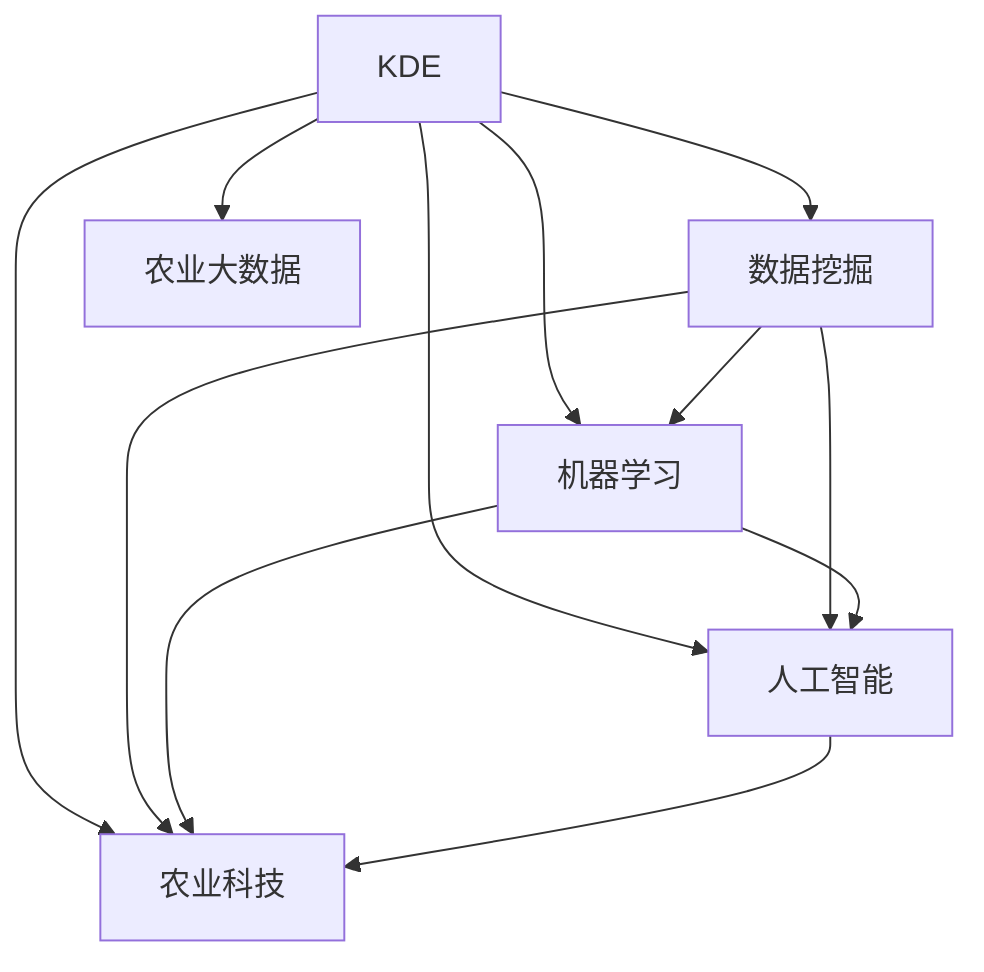

                 

# 知识发现引擎在农业科技中的应用

## 1. 背景介绍

### 1.1 问题由来

农业科技是推动农业现代化、提高农业生产效率和资源利用率的关键力量。然而，农业生产过程中存在诸多问题，如病虫害、气象条件、土壤肥力、农作物品种选择等。这些问题通常涉及大量数据和复杂的多变量关系，单纯依靠经验和直觉难以有效解决。

近年来，随着人工智能（AI）和大数据技术的发展，知识发现引擎（Knowledge Discovery Engine, KDE）应运而生。KDE能够从海量数据中挖掘出有价值的知识和模式，辅助农业科技决策，提升农业生产效率和资源利用率。

### 1.2 问题核心关键点

KDE的核心在于通过数据挖掘和机器学习技术，从大量农业数据中提取出有意义的知识模式。这些知识模式通常包括但不限于：

- 病虫害预测与防治：通过分析历史病虫害数据和气象数据，预测未来病虫害发生的概率，并提出相应的防治策略。
- 作物生长模拟：利用传感器数据和气象数据，模拟作物生长过程，辅助作物种植管理和品种选择。
- 土壤肥力监测：通过土壤数据、气象数据和作物生长数据，预测土壤肥力变化，指导施肥管理。
- 农业机械自动化：通过图像识别和机器学习技术，实现农业机械的自动导航、精准作业。

KDE在农业科技中的应用，能够有效降低农业生产成本，提升农业科技水平，具有广泛的应用前景。

## 2. 核心概念与联系

### 2.1 核心概念概述

为更好地理解KDE在农业科技中的应用，本节将介绍几个关键概念：

- **知识发现引擎(KDE)**：通过数据挖掘和机器学习技术，从大量数据中提取有价值的知识和模式。KDE的核心在于构建模型，从数据中发现隐藏的规律和关联。

- **数据挖掘(Data Mining)**：从大规模数据集中提取有用知识和模式的过程，通常包括分类、聚类、关联规则、时间序列预测等。

- **机器学习(Machine Learning)**：使用数据驱动的方法，训练模型以识别数据中的模式和规律，并用于预测和决策。

- **人工智能(AI)**：利用数据、算法和计算能力，实现机器的自主学习和推理，进而完成特定任务。

- **农业科技(Agricultural Technology)**：应用先进技术改进传统农业生产方式，提高生产效率和资源利用率。

- **农业大数据(Agricultural Big Data)**：与农业生产相关的海量数据，包括气象数据、土壤数据、作物生长数据、传感器数据等。

这些核心概念之间的逻辑关系可以通过以下Mermaid流程图来展示：



这个流程图展示了KDE与其他核心概念之间的联系：KDE利用数据挖掘和机器学习技术，从农业大数据中提取知识和模式，辅助农业科技决策，推动农业现代化进程。

## 3. 核心算法原理 & 具体操作步骤

### 3.1 算法原理概述

KDE的算法原理主要包括以下几个步骤：

1. **数据收集与预处理**：收集农业生产相关的海量数据，进行数据清洗、归一化、缺失值处理等预处理操作。
2. **特征工程**：从原始数据中提取有用的特征，构建特征向量。
3. **模型训练**：选择合适的机器学习模型，如决策树、随机森林、神经网络等，对数据进行训练，构建KDE模型。
4. **知识发现**：利用训练好的KDE模型，从数据中挖掘出有价值的知识和模式。
5. **应用决策**：将KDE模型应用于农业科技决策，辅助实现自动化、精准化生产。

KDE的核心在于通过机器学习技术，从复杂数据中提取有用的知识模式，这些模式通常具有较强的预测能力和解释能力。

### 3.2 算法步骤详解

**Step 1: 数据收集与预处理**

KDE的第一步是收集农业生产相关的海量数据。这些数据通常包括：

- 气象数据：如温度、湿度、降雨量、风速等。
- 土壤数据：如土壤类型、pH值、有机质含量等。
- 作物生长数据：如作物高度、叶面积、产量等。
- 传感器数据：如土壤湿度传感器、气象站数据等。

收集到的数据可能存在缺失值、异常值等问题，需要进行预处理操作。常用的预处理步骤包括：

- 数据清洗：删除无效数据、处理缺失值。
- 归一化：将数据缩放到标准范围内，避免不同特征之间量纲的影响。
- 特征选择：从原始数据中提取有用的特征，构建特征向量。

**Step 2: 特征工程**

特征工程是构建KDE模型的关键步骤。常用的特征工程方法包括：

- 特征提取：从原始数据中提取有用的特征，如作物生长特征、气象特征、土壤特征等。
- 特征变换：对原始数据进行变换，如对数变换、指数变换等，提升模型的拟合能力。
- 特征降维：使用PCA、LDA等方法，减少特征维度，降低计算复杂度。

特征工程的目标是构建高质量的特征向量，提高模型的泛化能力和预测精度。

**Step 3: 模型训练**

在特征工程完成后，选择适当的机器学习模型进行训练。常用的模型包括：

- 决策树（Decision Tree）：基于树形结构，通过特征选择和分裂，实现分类和预测。
- 随机森林（Random Forest）：基于决策树的集成方法，通过随机特征选择，提升模型泛化能力。
- 神经网络（Neural Network）：利用多层神经网络，提取复杂特征，实现高精度预测。

训练模型时，需要选择合适的超参数，如学习率、正则化系数、迭代次数等。常用的超参数优化方法包括网格搜索、随机搜索、贝叶斯优化等。

**Step 4: 知识发现**

在模型训练完成后，利用训练好的KDE模型，从数据中挖掘出有价值的知识和模式。常用的知识发现方法包括：

- 聚类分析（Clustering）：通过划分数据点，发现数据中的自然分组。
- 关联规则（Association Rule）：发现数据中的频繁项集和关联规则，如购物篮分析。
- 分类预测（Classification）：对数据进行分类，预测未知数据的类别。
- 时间序列预测（Time Series Prediction）：对时间序列数据进行预测，如病虫害预测、作物生长预测等。

**Step 5: 应用决策**

最后，将KDE模型应用于农业科技决策，辅助实现自动化、精准化生产。例如：

- 病虫害预测：根据气象数据和历史病虫害数据，预测未来病虫害发生的概率，并提出防治策略。
- 作物生长模拟：利用传感器数据和气象数据，模拟作物生长过程，辅助作物种植管理和品种选择。
- 土壤肥力监测：通过土壤数据、气象数据和作物生长数据，预测土壤肥力变化，指导施肥管理。
- 农业机械自动化：通过图像识别和机器学习技术，实现农业机械的自动导航、精准作业。

## 4. 数学模型和公式 & 详细讲解 & 举例说明

### 4.1 数学模型构建

KDE的数学模型构建主要涉及以下几个步骤：

1. **特征向量构建**：将原始数据转换为特征向量，如将气象数据转换为向量形式。
2. **模型参数优化**：利用最小化损失函数的方式，优化模型参数，如利用梯度下降算法。
3. **模型评估**：评估模型的性能，如使用交叉验证、AUC等指标。

以分类模型为例，常见的数学模型包括决策树、随机森林、神经网络等。

**决策树模型**：决策树的数学模型为：

$$
T = \left\{
\begin{aligned}
& \text{Leaf} & \text{if} \, \text{all features have been processed}, \\
& \text{Internal Node} = \text{best feature} \times \text{threshold} & \text{if} \, \text{not all features processed}, \\
\end{aligned}
\right.
$$

其中，特征选择和阈值计算是决策树的核心。

**随机森林模型**：随机森林的数学模型为：

$$
T = \left\{
\begin{aligned}
& \text{Leaf} & \text{if} \, \text{all trees have been processed}, \\
& \text{Internal Node} = \text{best feature} \times \text{threshold} & \text{if} \, \text{not all trees processed}, \\
\end{aligned}
\right.
$$

其中，随机特征选择和集成学习是随机森林的核心。

**神经网络模型**：神经网络模型的数学模型为：

$$
y = \sigma\left(\sum_{i=1}^{n} w_i x_i + b\right)
$$

其中，$w$ 为权重，$x$ 为输入，$\sigma$ 为激活函数。

### 4.2 公式推导过程

以决策树模型为例，推导其训练和预测过程。

假设样本数据为 $(x_1, y_1), (x_2, y_2), ..., (x_n, y_n)$，其中 $y \in \{0, 1\}$。决策树的目标是通过划分数据集，使同类别样本尽可能集中在同一子树中。

训练过程包括以下步骤：

1. 计算每个特征 $x_i$ 的信息增益（Information Gain）：

$$
IG(x_i) = -\sum_{y} p(y) \log p(y|x_i)
$$

其中，$p(y)$ 为类别概率，$p(y|x_i)$ 为条件概率。

2. 选择信息增益最大的特征 $x_i$ 作为划分节点，计算阈值 $t$：

$$
t = \text{median}(x_i)
$$

3. 递归划分数据集，直到满足停止条件（如叶节点中样本类别分布稳定）。

预测过程包括以下步骤：

1. 将待预测样本 $x_0$ 从根节点开始，按照划分条件向下遍历。
2. 到达叶节点后，返回叶节点的预测类别。

### 4.3 案例分析与讲解

以农业病虫害预测为例，分析如何使用KDE进行预测和防治。

**数据收集与预处理**：收集历史病虫害数据和气象数据，进行数据清洗、归一化等预处理操作。

**特征工程**：从原始数据中提取有用的特征，如温度、湿度、降雨量等，构建特征向量。

**模型训练**：选择决策树模型，利用历史数据进行训练，构建KDE模型。

**知识发现**：利用训练好的KDE模型，从数据中挖掘出病虫害发生的规律和模式。

**应用决策**：根据挖掘出的知识，预测未来病虫害发生的概率，并提出防治策略。例如，在温度高、湿度大的条件下，预测病虫害高发，提出施肥、灌溉等防治措施。

## 5. 项目实践：代码实例和详细解释说明

### 5.1 开发环境搭建

在进行KDE实践前，我们需要准备好开发环境。以下是使用Python进行Scikit-learn开发的环境配置流程：

1. 安装Anaconda：从官网下载并安装Anaconda，用于创建独立的Python环境。

2. 创建并激活虚拟环境：
```bash
conda create -n sklearn-env python=3.8 
conda activate sklearn-env
```

3. 安装Scikit-learn：
```bash
conda install scikit-learn
```

4. 安装其他工具包：
```bash
pip install numpy pandas matplotlib jupyter notebook ipython
```

完成上述步骤后，即可在`sklearn-env`环境中开始KDE实践。

### 5.2 源代码详细实现

下面我们以农业病虫害预测为例，给出使用Scikit-learn进行KDE的PyTorch代码实现。

首先，定义特征选择函数：

```python
from sklearn.feature_selection import SelectKBest, chi2
from sklearn.preprocessing import StandardScaler

def feature_selection(X, y):
    # 特征选择
    selector = SelectKBest(chi2, k=10)
    X_selected = selector.fit_transform(X, y)
    # 归一化
    scaler = StandardScaler()
    X_selected = scaler.fit_transform(X_selected)
    return X_selected
```

然后，定义训练和评估函数：

```python
from sklearn.ensemble import RandomForestClassifier
from sklearn.metrics import accuracy_score

def train_model(X, y, n_estimators=100):
    # 训练随机森林模型
    model = RandomForestClassifier(n_estimators=n_estimators)
    model.fit(X, y)
    # 预测并评估
    y_pred = model.predict(X)
    accuracy = accuracy_score(y, y_pred)
    return model, accuracy

# 数据集划分
from sklearn.model_selection import train_test_split
X_train, X_test, y_train, y_test = train_test_split(X, y, test_size=0.2, random_state=42)
```

最后，启动训练流程并在测试集上评估：

```python
# 特征选择
X_train_selected, X_test_selected = feature_selection(X_train, y_train), feature_selection(X_test, y_test)
# 模型训练
model, accuracy = train_model(X_train_selected, y_train)
# 测试集评估
accuracy_test = accuracy_score(y_test, model.predict(X_test_selected))
print(f"训练集准确率: {accuracy:.2f}%, 测试集准确率: {accuracy_test:.2f}%")
```

以上就是使用Scikit-learn对随机森林模型进行农业病虫害预测的完整代码实现。可以看到，通过Scikit-learn，我们可以很方便地进行特征选择、模型训练和评估，快速构建KDE模型。

### 5.3 代码解读与分析

让我们再详细解读一下关键代码的实现细节：

**feature_selection函数**：
- 使用`SelectKBest`函数进行特征选择，选择与目标变量最相关的10个特征。
- 使用`StandardScaler`函数对特征进行归一化，避免不同特征之间量纲的影响。

**train_model函数**：
- 使用`RandomForestClassifier`函数训练随机森林模型。
- 使用`accuracy_score`函数评估模型准确率。

**数据集划分**：
- 使用`train_test_split`函数将数据集划分为训练集和测试集，保留20%的数据作为测试集。

**训练流程**：
- 特征选择后的数据集输入`train_model`函数，进行模型训练。
- 输出模型和训练集准确率。
- 测试集评估模型的性能，输出测试集准确率。

## 6. 实际应用场景

### 6.1 智能灌溉系统

智能灌溉系统能够根据土壤湿度和气象数据，自动控制灌溉，减少水资源浪费，提高灌溉效率。通过KDE，智能灌溉系统可以实时监测土壤湿度，并预测未来的降雨和气温变化，提前进行灌溉决策。

在技术实现上，可以收集历史灌溉数据、土壤湿度数据和气象数据，构建KDE模型，预测未来土壤湿度和气象条件，辅助灌溉决策。微调后的模型能够根据实时监测数据，动态调整灌溉计划，实现水资源的合理利用。

### 6.2 智能施肥系统

智能施肥系统能够根据土壤肥力、气象条件和作物生长数据，自动推荐施肥方案，减少化肥使用，提高作物产量和质量。通过KDE，智能施肥系统可以分析历史施肥数据和作物生长数据，挖掘出最优的施肥模式和方案。

在技术实现上，可以收集历史施肥数据、土壤肥力数据和作物生长数据，构建KDE模型，挖掘出最优的施肥模式和方案。微调后的模型能够根据实时监测数据，动态调整施肥方案，实现科学施肥。

### 6.3 智能病虫害防治

智能病虫害防治系统能够根据历史病虫害数据和气象数据，预测未来病虫害发生的概率，并提出防治策略，减少农药使用，提高病虫害防治效果。通过KDE，智能病虫害防治系统可以实时监测病虫害发生情况，并预测未来的病虫害趋势。

在技术实现上，可以收集历史病虫害数据、气象数据和作物生长数据，构建KDE模型，预测未来病虫害发生的概率。微调后的模型能够根据实时监测数据，动态调整防治策略，实现精准防治。

### 6.4 未来应用展望

随着KDE技术的发展，其应用领域将更加广泛。未来，KDE将可能在以下几个方面得到进一步应用：

1. **精准农业**：利用KDE，实现农业生产的精准管理，如精准灌溉、精准施肥、精准防治等。通过实时监测和预测，实现资源的最优分配和利用。
2. **农业机械自动化**：利用图像识别和机器学习技术，实现农业机械的自动导航、精准作业。通过KDE，优化机械作业路径和参数，提高作业效率和质量。
3. **农业数据分析**：利用KDE，分析农业生产中的各种数据，挖掘出有价值的知识和模式，辅助农业生产决策。
4. **农业智能决策支持系统**：利用KDE，构建智能决策支持系统，实现农业生产的自动化和智能化管理。通过KDE，优化决策过程，提高决策效率和效果。

KDE在农业科技中的应用，将极大地提升农业生产的智能化水平，推动农业现代化的进程。未来，随着KDE技术的进一步发展和应用，农业生产将变得更加精准、高效和可持续。

## 7. 工具和资源推荐

### 7.1 学习资源推荐

为了帮助开发者系统掌握KDE的理论基础和实践技巧，这里推荐一些优质的学习资源：

1. 《机器学习实战》系列博文：由KDE专家撰写，深入浅出地介绍了KDE的基本概念和实际应用，适合初学者入门。
2. Coursera《机器学习》课程：由斯坦福大学开设的机器学习课程，内容全面，适合进一步学习。
3. 《Python数据科学手册》书籍：详细介绍了Python在数据科学中的应用，包括特征工程、模型训练等。
4. Scikit-learn官方文档：提供了丰富的机器学习模型和算法，适合实战学习。
5. Kaggle平台：提供大量农业科技相关的数据集和竞赛，适合实战练习。

通过对这些资源的学习实践，相信你一定能够快速掌握KDE的精髓，并用于解决实际的农业科技问题。

### 7.2 开发工具推荐

高效的开发离不开优秀的工具支持。以下是几款用于KDE开发的常用工具：

1. Python：基于Python的开源语言，语言简洁，易学易用，适合进行数据处理和机器学习开发。
2. Scikit-learn：开源机器学习库，提供了丰富的机器学习模型和算法，适合进行特征工程和模型训练。
3. Pandas：开源数据分析库，适合进行数据清洗、数据处理和特征工程。
4. Matplotlib：开源绘图库，适合进行数据可视化。
5. Jupyter Notebook：开源笔记本环境，支持交互式编程，适合进行数据分析和模型训练。

合理利用这些工具，可以显著提升KDE的开发效率，加快创新迭代的步伐。

### 7.3 相关论文推荐

KDE的研究源于学界的持续研究。以下是几篇奠基性的相关论文，推荐阅读：

1. "An Introduction to Statistical Learning"（《统计学习导论》）：介绍了机器学习的基本概念和算法，适合入门学习。
2. "The Elements of Statistical Learning"（《统计学习要素》）：深入介绍了统计学习的理论基础和算法，适合进阶学习。
3. "Pattern Recognition and Machine Learning"（《模式识别与机器学习》）：介绍了机器学习的经典算法和实际应用，适合系统学习。
4. "Data Mining: Concepts and Techniques"（《数据挖掘概念与技术》）：介绍了数据挖掘的基本概念和算法，适合系统学习。
5. "Knowledge Discovery in Databases: Algorithms, Tools, and Techniques"（《知识发现与数据库》）：介绍了知识发现的基本概念和算法，适合系统学习。

这些论文代表了大数据和机器学习的研究进展，通过学习这些前沿成果，可以帮助研究者把握学科前进方向，激发更多的创新灵感。

## 8. 总结：未来发展趋势与挑战

### 8.1 总结

本文对KDE在农业科技中的应用进行了全面系统的介绍。首先阐述了KDE的研究背景和意义，明确了KDE在农业科技决策中的独特价值。其次，从原理到实践，详细讲解了KDE的数学原理和关键步骤，给出了KDE任务开发的完整代码实例。同时，本文还广泛探讨了KDE技术在智能灌溉、智能施肥、智能病虫害防治等多个农业科技领域的应用前景，展示了KDE技术的巨大潜力。此外，本文精选了KDE技术的各类学习资源，力求为读者提供全方位的技术指引。

通过本文的系统梳理，可以看到，KDE在农业科技中的应用具有广泛的应用前景，能够有效提升农业生产的智能化水平，推动农业现代化进程。未来，随着KDE技术的进一步发展和应用，农业生产将变得更加精准、高效和可持续。

### 8.2 未来发展趋势

展望未来，KDE技术将呈现以下几个发展趋势：

1. **数据驱动的农业决策**：KDE技术能够从海量农业数据中挖掘出有价值的知识和模式，辅助农业生产决策，推动农业现代化。
2. **智能化农业机械**：KDE技术结合图像识别和机器学习技术，实现农业机械的自动导航、精准作业，提升农业机械的自动化水平。
3. **精准农业管理**：KDE技术结合传感器数据、气象数据和作物生长数据，实现农业生产的精准管理，提高资源利用效率。
4. **农业数据分析**：KDE技术结合大数据技术，分析农业生产中的各种数据，挖掘出有价值的知识和模式，辅助农业生产决策。
5. **智能决策支持系统**：KDE技术结合智能决策技术，构建智能决策支持系统，实现农业生产的自动化和智能化管理。

这些趋势凸显了KDE技术在农业科技中的广泛应用前景，将推动农业生产方式的变革，提升农业生产效率和资源利用率。

### 8.3 面临的挑战

尽管KDE技术已经取得了显著成果，但在迈向更加智能化、普适化应用的过程中，它仍面临着诸多挑战：

1. **数据质量问题**：农业生产数据通常存在缺失、异常和噪声，如何提高数据质量，获得准确、完整的农业数据，将是KDE应用的重要挑战。
2. **模型可解释性**：KDE模型的复杂性较高，如何提高模型的可解释性，使决策过程透明化，将是一大难题。
3. **计算资源需求**：KDE模型通常需要大量的计算资源，如何优化计算过程，减少计算时间，提高计算效率，将是未来的研究方向。
4. **跨领域融合**：KDE技术需要与其他技术，如传感器技术、物联网技术、大数据技术等进行深度融合，实现跨领域应用。
5. **数据隐私和安全**：农业生产数据通常涉及隐私和敏感信息，如何保护数据隐私和安全，将是KDE应用的重要问题。

### 8.4 研究展望

面对KDE技术面临的挑战，未来的研究需要在以下几个方面寻求新的突破：

1. **数据清洗与预处理**：开发更高效的数据清洗与预处理算法，提高数据质量，减少数据噪声和异常值。
2. **模型优化**：开发更高效的模型训练算法，提高模型性能，减少计算资源消耗。
3. **可解释性研究**：研究如何提高KDE模型的可解释性，使决策过程透明化，增强模型的可信度。
4. **跨领域融合**：研究如何与其他技术进行深度融合，实现跨领域应用，推动农业科技的全面发展。
5. **数据隐私和安全**：研究如何保护农业生产数据的隐私和安全，构建安全的农业科技应用环境。

这些研究方向的探索，将引领KDE技术迈向更高的台阶，为农业科技的发展提供新的动力。面向未来，KDE技术需要与其他技术进行更深入的融合，共同推动农业科技的全面进步。

## 9. 附录：常见问题与解答

**Q1：KDE的特征工程如何进行？**

A: 特征工程是KDE模型的关键步骤，包括以下步骤：

1. **数据收集**：收集农业生产相关的数据，如气象数据、土壤数据、作物生长数据等。
2. **数据清洗**：删除无效数据、处理缺失值。
3. **特征选择**：从原始数据中提取有用的特征，如温度、湿度、降雨量等。
4. **特征变换**：对原始数据进行变换，如对数变换、指数变换等，提升模型的拟合能力。
5. **特征降维**：使用PCA、LDA等方法，减少特征维度，降低计算复杂度。

**Q2：KDE的模型训练有哪些常用的算法？**

A: KDE的模型训练常用的算法包括：

1. 决策树（Decision Tree）：基于树形结构，通过特征选择和分裂，实现分类和预测。
2. 随机森林（Random Forest）：基于决策树的集成方法，通过随机特征选择，提升模型泛化能力。
3 神经网络（Neural Network）：利用多层神经网络，提取复杂特征，实现高精度预测。
4 支持向量机（Support Vector Machine）：通过构建超平面，实现分类和回归预测。

**Q3：KDE的应用场景有哪些？**

A: KDE的应用场景广泛，包括以下几个方面：

1. 智能灌溉系统：根据土壤湿度和气象数据，自动控制灌溉，减少水资源浪费，提高灌溉效率。
2. 智能施肥系统：根据土壤肥力、气象条件和作物生长数据，自动推荐施肥方案，减少化肥使用，提高作物产量和质量。
3. 智能病虫害防治：根据历史病虫害数据和气象数据，预测未来病虫害发生的概率，并提出防治策略。
4. 精准农业管理：利用KDE，实现农业生产的精准管理，如精准灌溉、精准施肥、精准防治等。
5. 农业机械自动化：利用图像识别和机器学习技术，实现农业机械的自动导航、精准作业。

**Q4：KDE的计算资源需求有哪些？**

A: KDE的计算资源需求主要包括以下几个方面：

1. 数据存储：KDE模型需要大量的数据存储，通常需要使用高性能存储设备，如Hadoop、Spark等。
2. 数据处理：KDE模型需要进行大量的数据处理操作，通常需要使用高性能计算设备，如GPU、TPU等。
3 模型训练：KDE模型需要大量的计算资源进行模型训练，通常需要使用高性能计算集群，如MapReduce、Spark等。

**Q5：KDE的算法实现有哪些常用的工具库？**

A: KDE的算法实现常用的工具库包括：

1. Scikit-learn：开源机器学习库，提供了丰富的机器学习模型和算法，适合进行特征工程和模型训练。
2. TensorFlow：由Google主导开发的深度学习框架，适合进行大规模模型训练和推理。
3. PyTorch：基于Python的开源深度学习框架，适合进行特征工程和模型训练。

这些工具库能够极大地提升KDE的开发效率，加快创新迭代的步伐。

---

作者：禅与计算机程序设计艺术 / Zen and the Art of Computer Programming

