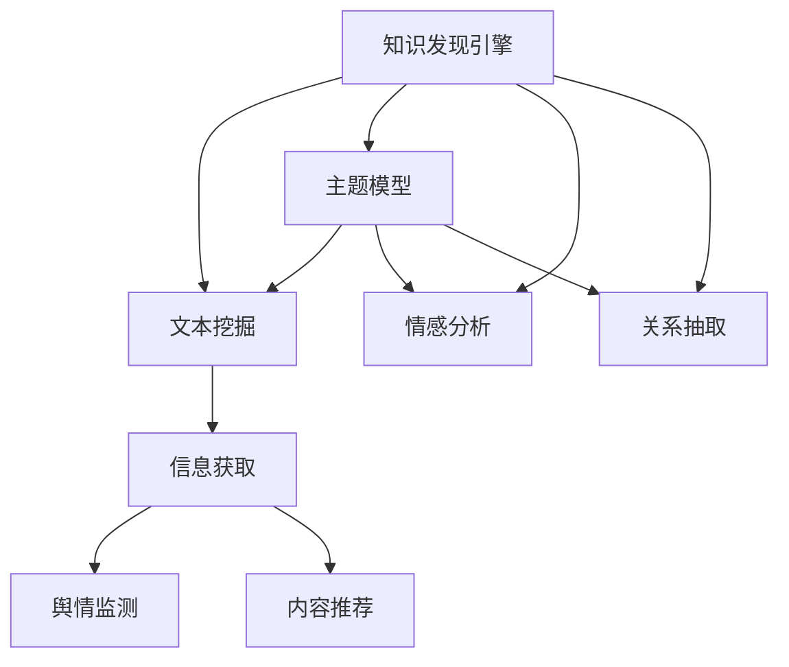

                 

## 1. 背景介绍

在现代社会中，新闻媒体作为信息传播的主要渠道，其作用不可替代。然而，新闻媒体面临着海量信息的冲击，如何在海量的文本数据中快速发现有价值的信息，是新闻媒体所面临的重要挑战。传统的新闻编辑和媒体分析依赖人工进行，效率低下且成本高昂。因此，新闻媒体迫切需要一种高效、自动化的知识发现引擎，以提升信息获取和处理的速度和质量。

### 1.1 问题由来

在互联网时代，新闻媒体所面临的信息量呈指数级增长。据统计，全球新闻媒体的每日新闻产出量已达到数十亿条。这些新闻信息散布在互联网的各个角落，如何在短时间内筛选出有价值的信息，成为了新闻媒体面临的巨大挑战。

新闻信息处理的主要步骤包括新闻采集、文本清洗、信息提取、关系挖掘、情感分析等。传统的新闻编辑和媒体分析依赖人工进行，效率低下且成本高昂。随着深度学习和大数据技术的兴起，利用计算机算法实现自动化的信息发现和处理变得可行。因此，知识发现引擎在新闻媒体中的应用，已成为提升新闻处理效率和信息价值的有效手段。

### 1.2 问题核心关键点

本文聚焦于知识发现引擎在新闻媒体中的应用，将详细介绍以下核心关键点：

- **核心概念**：知识发现引擎是指利用先进的算法和模型，从海量数据中自动发现有用知识和模式的技术。本文将介绍知识发现引擎的基本原理和关键组件。
- **核心算法**：本文将重点介绍用于新闻媒体中的核心算法，如主题模型、情感分析、关系抽取等。
- **核心架构**：本文将详细阐述知识发现引擎的总体架构及其组成部分。
- **实际应用**：本文将通过实例分析，展示知识发现引擎在新闻媒体中的应用效果，包括信息获取、舆情监测、内容推荐等。

## 2. 核心概念与联系

### 2.1 核心概念概述

为更好地理解知识发现引擎在新闻媒体中的应用，本节将介绍几个密切相关的核心概念：

- **知识发现引擎(Knowledge Discovery Engine, KDE)**：利用机器学习、数据挖掘等技术，从海量数据中发现有用知识和模式的技术。常见的KDE包括文本挖掘、主题模型、情感分析、关系抽取等。
- **文本挖掘(Text Mining)**：从文本数据中提取有价值信息的过程，包括文本清洗、分词、实体识别、主题模型、情感分析等。
- **主题模型(Thematic Model)**：从大规模文本数据中自动发现主题和模式的技术，如Latent Dirichlet Allocation(LDA)、Latent Semantic Analysis(LSA)等。
- **情感分析(Sentiment Analysis)**：自动识别和分类文本情感的技术，如极性分析、情感强度分析、情感分类等。
- **关系抽取(Relation Extraction)**：从文本中自动发现实体间关系的技术，如实体识别、关系分类、事件抽取等。

这些核心概念之间的逻辑关系可以通过以下Mermaid流程图来展示：



这个流程图展示了一些核心概念及其之间的关系：

1. 知识发现引擎通过文本挖掘发现文本数据中的有用信息，并进一步利用主题模型、情感分析、关系抽取等技术进行深入分析。
2. 主题模型能够从大规模文本数据中自动发现主题和模式。
3. 情感分析能够自动识别和分类文本情感，帮助理解用户情绪和舆情变化。
4. 关系抽取能够从文本中自动发现实体间关系，如人名、地点、组织等。
5. 这些技术通过信息获取、舆情监测、内容推荐等方式，服务于新闻媒体的信息处理和内容展示。

## 3. 核心算法原理 & 具体操作步骤
### 3.1 算法原理概述

知识发现引擎在新闻媒体中的应用，本质上是一个从海量文本数据中发现有用知识和模式的过程。其核心思想是利用机器学习和数据挖掘技术，自动分析和挖掘文本数据中的有用信息，如主题、情感、关系等，从而提升新闻媒体的信息处理效率和质量。

具体而言，知识发现引擎主要包括以下几个步骤：

1. **文本预处理**：包括文本清洗、分词、停用词过滤等，以准备文本数据进行后续处理。
2. **主题建模**：从文本数据中发现潜在的主题，提取主题向量，帮助理解文本内容。
3. **情感分析**：自动识别和分类文本情感，了解用户情绪和舆情变化。
4. **关系抽取**：从文本中自动发现实体间关系，如人名、地点、组织等。
5. **信息融合**：将主题、情感、关系等信息融合在一起，形成对新闻内容的全面理解。
6. **知识展示**：将知识展示给用户，如通过搜索结果、内容推荐等方式。

### 3.2 算法步骤详解

本节将详细讲解知识发现引擎在新闻媒体中的具体实现步骤。

**Step 1: 数据预处理**

1. **文本清洗**：去除噪音数据、停用词、标点符号等，只保留有意义的词汇。
2. **分词**：将文本分割成词汇，便于后续处理。
3. **去除停用词**：去除常见但不具有实际意义的词汇，如"的"、"是"等。
4. **去除特殊符号**：去除文本中的特殊符号，如URL、HTML标签等。

**Step 2: 主题模型**

1. **选择主题模型**：选择合适的主题模型，如LDA、LSA等。
2. **训练主题模型**：在训练集上训练主题模型，得到主题向量。
3. **主题映射**：将文本映射到主题向量，提取文本的主题分布。

**Step 3: 情感分析**

1. **选择情感分析模型**：选择合适的情感分析模型，如情感词典、机器学习模型等。
2. **训练情感分析模型**：在标注数据上训练情感分析模型，得到情感分类器。
3. **情感分类**：对文本进行情感分类，得到情感标签。

**Step 4: 关系抽取**

1. **选择关系抽取模型**：选择合适的关系抽取模型，如依存句法分析、规则匹配等。
2. **训练关系抽取模型**：在标注数据上训练关系抽取模型，得到关系分类器。
3. **关系抽取**：对文本进行关系抽取，得到实体间关系。

**Step 5: 信息融合**

1. **融合主题、情感、关系**：将主题、情感、关系等信息融合在一起，形成对新闻内容的全面理解。
2. **构建知识图谱**：利用知识图谱技术，将主题、情感、关系等信息组织成图谱结构。
3. **知识展示**：将知识展示给用户，如通过搜索结果、内容推荐等方式。

### 3.3 算法优缺点

知识发现引擎在新闻媒体中的应用，具有以下优点：

1. **高效性**：利用算法自动处理文本数据，节省了大量人工成本，提升了信息处理速度。
2. **准确性**：通过主题模型、情感分析、关系抽取等技术，能够自动识别和分类文本信息，提升信息处理的准确性。
3. **可扩展性**：能够处理大规模数据，支持实时信息处理，满足新闻媒体对信息处理速度的要求。
4. **可解释性**：通过主题模型和情感分析，能够提供对文本信息的解释和分析，帮助理解用户情绪和舆情变化。

然而，知识发现引擎也存在以下缺点：

1. **数据质量依赖**：算法的准确性和效果取决于数据的质量，数据清洗和预处理需要耗费大量时间和精力。
2. **模型复杂性**：主题模型、情感分析、关系抽取等技术需要复杂的模型训练和调参，存在一定的技术门槛。
3. **资源消耗大**：处理大规模数据需要高性能的计算资源，如GPU、TPU等，对硬件资源有较高的要求。
4. **结果解释性差**：算法的输出结果往往缺乏解释性，用户难以理解其背后的逻辑和原因。

### 3.4 算法应用领域

知识发现引擎在新闻媒体中的应用，涉及多个领域，主要包括：

- **信息获取**：自动从海量的新闻信息中获取有价值的信息，如新闻标题、摘要、关键字等。
- **舆情监测**：自动监测和分析新闻舆情，了解公众情绪和舆论趋势。
- **内容推荐**：根据用户兴趣和行为，自动推荐相关的新闻内容，提升用户阅读体验。
- **事件分析**：自动分析新闻事件的发展和变化，提供事件趋势和预警。
- **知识库构建**：利用知识图谱技术，自动构建新闻知识库，支持新闻内容的深度挖掘和分析。

## 4. 数学模型和公式 & 详细讲解 & 举例说明
### 4.1 数学模型构建

知识发现引擎在新闻媒体中的应用，主要涉及到文本挖掘、主题建模、情感分析、关系抽取等技术。本文将简要介绍这些技术的基本数学模型。

**文本挖掘**

1. **文本清洗**
   - 去除噪音数据、停用词、标点符号等。
   - 分词：将文本分割成词汇。
   - 去除停用词：去除常见但不具有实际意义的词汇。
   - 去除特殊符号：去除文本中的特殊符号。

2. **主题建模**
   - **LDA模型**：
     - 定义文本-主题分布 $p(w|z)$ 和主题-词汇分布 $p(z|w)$。
     - 通过训练得到模型参数 $\beta$ 和 $\alpha$。
     - 利用贝叶斯推断，计算主题向量 $\theta$。

3. **情感分析**
   - **情感词典**：定义情感词典 $D$，将每个词汇映射到情感分数 $s(w)$。
   - **情感分类器**：
     - 选择机器学习模型，如SVM、随机森林等。
     - 在标注数据上训练情感分类器，得到模型参数 $\theta$。
     - 对文本进行情感分类，得到情感标签。

4. **关系抽取**
   - **依存句法分析**：
     - 定义依存句法树 $T$，将每个词汇映射到依存关系 $R(w)$。
     - 选择规则匹配模型，如最大熵模型、神经网络等。
     - 在标注数据上训练关系抽取模型，得到模型参数 $\theta$。
     - 对文本进行关系抽取，得到实体间关系。

### 4.2 公式推导过程

以下简要介绍一些核心模型的公式推导过程。

**LDA模型**

LDA（Latent Dirichlet Allocation）模型是一种常用主题模型，其基本公式为：

$$
p(w|z) = \frac{\beta_z z}{\sum_{z'\in Z} \beta_{z'} z'}
$$

其中 $w$ 表示文本中的词汇，$z$ 表示主题，$Z$ 表示所有主题的集合，$\beta_z$ 表示主题 $z$ 对词汇 $w$ 的概率分布。通过训练得到模型参数 $\beta$ 和 $\alpha$，即可计算主题向量 $\theta$。

**情感分析**

情感分析常用的机器学习模型包括SVM和随机森林。以SVM为例，其基本公式为：

$$
\min_{\theta} \frac{1}{2}||\theta||^2 + C \sum_{i=1}^N [y_i \log \sigma(y_i\theta^Tw_i + b_i) + (1-y_i) \log(1-\sigma(y_i\theta^Tw_i + b_i))]
$$

其中 $\theta$ 表示模型参数，$C$ 表示正则化系数，$y_i$ 表示情感标签，$w_i$ 表示文本的特征向量，$b_i$ 表示偏置项。

**关系抽取**

关系抽取常用的机器学习模型包括最大熵模型和神经网络。以最大熵模型为例，其基本公式为：

$$
\min_{\theta} -\sum_{i=1}^N [y_i \log f(y_i;w_i,\theta) + (1-y_i) \log(1-f(y_i;w_i,\theta))]
$$

其中 $y_i$ 表示实体间关系的标签，$w_i$ 表示文本的特征向量，$f(y_i;w_i,\theta)$ 表示关系分类器的输出概率。

### 4.3 案例分析与讲解

下面以一个具体的案例，展示知识发现引擎在新闻媒体中的应用效果。

**案例：情感分析在舆情监测中的应用**

某新闻网站希望通过情感分析技术，监测和分析公众对某一事件的情感倾向。具体步骤如下：

1. **数据预处理**：
   - 收集事件相关的新闻报道，去除噪音数据和停用词。
   - 分词并将文本转换为特征向量。

2. **模型训练**：
   - 在标注数据上训练情感分类器，得到模型参数 $\theta$。
   - 使用情感词典 $D$ 和机器学习模型，对事件相关的新闻进行情感分类。

3. **情感监测**：
   - 实时监测新闻报道的情感变化，统计正面、负面和中性的新闻数量。
   - 分析情感变化趋势，判断事件发展方向和公众情绪。

4. **结果展示**：
   - 通过可视化工具展示情感变化曲线，直观展示事件舆情变化。
   - 根据情感分析结果，调整报道策略，提高媒体影响力。

## 5. 项目实践：代码实例和详细解释说明
### 5.1 开发环境搭建

在进行知识发现引擎的开发实践前，需要先准备好开发环境。以下是使用Python进行知识发现引擎开发的常见环境配置流程：

1. 安装Anaconda：从官网下载并安装Anaconda，用于创建独立的Python环境。

2. 创建并激活虚拟环境：
```bash
conda create -n kde-env python=3.8 
conda activate kde-env
```

3. 安装PyTorch、Numpy、Scikit-learn等库：
```bash
conda install pytorch torchvision torchaudio numpy scikit-learn pandas matplotlib tqdm jupyter notebook ipython
```

4. 安装相关工具包：
```bash
pip install transformers gensim sklearn spacy
```

5. 安装Google Cloud SDK：
```bash
pip install google-cloud-storage google-cloud-bigquery google-cloud-translate google-cloud-language
```

完成上述步骤后，即可在`kde-env`环境中开始知识发现引擎的开发实践。

### 5.2 源代码详细实现

接下来，我们以情感分析为例，展示使用PyTorch和Scikit-learn进行情感分析的代码实现。

```python
import torch
import torch.nn as nn
import torch.optim as optim
from sklearn.datasets import fetch_20newsgroups
from sklearn.feature_extraction.text import CountVectorizer
from sklearn.model_selection import train_test_split
from sklearn.metrics import accuracy_score, f1_score

# 数据预处理
data = fetch_20newsgroups(subset='train')
X = data.data
y = data.target

vectorizer = CountVectorizer(stop_words='english')
X = vectorizer.fit_transform(X)

# 构建模型
class SentimentClassifier(nn.Module):
    def __init__(self, input_dim):
        super(SentimentClassifier, self).__init__()
        self.linear = nn.Linear(input_dim, 1)
        self.sigmoid = nn.Sigmoid()

    def forward(self, x):
        x = self.linear(x)
        return self.sigmoid(x)

# 训练模型
input_dim = X.shape[1]
model = SentimentClassifier(input_dim)
optimizer = optim.SGD(model.parameters(), lr=0.01)
loss_fn = nn.BCELoss()

for epoch in range(10):
    for i in range(len(X)):
        x = X[i].reshape(1, -1)
        y = torch.tensor(y[i], dtype=torch.float)
        output = model(x)
        loss = loss_fn(output, y)
        optimizer.zero_grad()
        loss.backward()
        optimizer.step()

# 测试模型
X_test = vectorizer.transform(data.data_test)
y_test = data.target_test
output_test = model(X_test)
y_pred = (output_test > 0.5).round()

print('Accuracy:', accuracy_score(y_test, y_pred))
print('F1 Score:', f1_score(y_test, y_pred))
```

### 5.3 代码解读与分析

让我们再详细解读一下关键代码的实现细节：

**数据预处理**

1. **数据获取**：
   - 使用Scikit-learn的fetch_20newsgroups函数获取新闻数据集，包括训练集和测试集。
   - 通过CountVectorizer将文本数据转换为特征向量，去除停用词。

2. **模型构建**：
   - 定义情感分类器，使用PyTorch构建一个简单的线性模型，使用Sigmoid函数进行二分类。
   - 定义优化器和损失函数，使用随机梯度下降（SGD）优化器，交叉熵损失函数。

**模型训练**

1. **模型参数初始化**：
   - 根据特征向量维度，初始化模型参数。

2. **训练循环**：
   - 在每个epoch内，对每个样本进行前向传播和反向传播，更新模型参数。
   - 使用BCELoss函数计算损失，使用SGD优化器进行参数更新。

3. **模型评估**：
   - 使用测试集对模型进行评估，计算准确率和F1 Score。

**结果展示**

1. **输出结果**：
   - 打印模型的准确率和F1 Score，评估模型性能。

通过上述代码示例，我们可以看到知识发现引擎在新闻媒体中的应用，通过文本挖掘、情感分析等技术，可以高效、自动地处理新闻信息，提升信息处理效率和质量。

## 6. 实际应用场景
### 6.1 智能内容推荐

知识发现引擎在新闻媒体中的应用，不仅限于情感分析，还可以用于智能内容推荐。通过分析用户的历史行为和兴趣，自动推荐相关的新闻内容，提升用户阅读体验。

具体而言，可以收集用户的历史浏览记录、点赞、评论等行为数据，使用协同过滤、内容推荐等算法，构建用户兴趣模型。根据用户兴趣模型和新闻特征向量，计算相似度，选择相似度较高的新闻进行推荐。

**案例：新闻内容推荐系统**

某新闻网站希望通过内容推荐技术，提高用户留存率和阅读量。具体步骤如下：

1. **用户行为收集**：
   - 收集用户的历史浏览记录、点赞、评论等行为数据。
   - 通过协同过滤和内容推荐算法，构建用户兴趣模型。

2. **新闻特征提取**：
   - 使用文本挖掘技术，提取新闻的关键词、主题等信息，构建新闻特征向量。
   - 将新闻特征向量与用户兴趣模型进行相似度计算。

3. **推荐结果生成**：
   - 根据相似度排序，选择相似度较高的新闻进行推荐。
   - 使用A/B测试等方法，评估推荐效果，优化推荐算法。

4. **结果展示**：
   - 在网站首页和推荐栏目展示推荐结果，提升用户阅读体验。

### 6.2 事件监测与预警

知识发现引擎还可以用于事件监测与预警，帮助新闻媒体及时发现并应对突发事件，保护公众利益。

具体而言，可以收集与事件相关的新闻报道、社交媒体信息、用户反馈等，使用文本挖掘、情感分析等技术，自动识别和分类事件信息，提供事件趋势和预警。

**案例：地震事件监测**

某新闻网站希望通过事件监测技术，及时发现和应对地震事件。具体步骤如下：

1. **数据收集**：
   - 收集与地震相关的新闻报道、社交媒体信息、用户反馈等。
   - 使用文本挖掘技术，提取新闻的关键词、主题等信息，构建新闻特征向量。

2. **事件监测**：
   - 使用情感分析技术，自动识别和分类地震相关的新闻情感。
   - 根据情感变化趋势，判断地震事件的紧急程度。

3. **预警发布**：
   - 通过可视化工具展示地震事件预警曲线，及时发布预警信息。
   - 配合政府和相关部门，制定应对策略，减少地震带来的影响。

### 6.3 舆情分析与舆情报告

知识发现引擎还可以用于舆情分析与舆情报告，帮助新闻媒体分析公众情绪和舆论趋势，提供舆情报告，指导媒体报道。

具体而言，可以收集与舆情相关的新闻报道、社交媒体信息、用户评论等，使用情感分析、主题模型等技术，自动识别和分类舆情信息，提供舆情报告。

**案例：某公司的舆情报告**

某公司希望通过舆情分析技术，了解公众对其品牌的看法，制定公关策略。具体步骤如下：

1. **数据收集**：
   - 收集与公司相关的新闻报道、社交媒体信息、用户评论等。
   - 使用文本挖掘技术，提取新闻的关键词、主题等信息，构建新闻特征向量。

2. **舆情分析**：
   - 使用情感分析技术，自动识别和分类舆情情感。
   - 根据舆情情感变化趋势，判断舆情发展方向。

3. **舆情报告**：
   - 通过可视化工具展示舆情变化曲线，生成舆情报告。
   - 根据舆情报告，调整媒体报道策略，提升品牌形象。

### 6.4 未来应用展望

随着技术的发展，知识发现引擎在新闻媒体中的应用前景广阔，未来将有更多创新应用出现。

1. **多模态信息处理**：未来的知识发现引擎将支持多模态信息处理，结合文本、图像、语音等信息，提供更全面的新闻服务。
2. **交互式内容生成**：未来的知识发现引擎将支持交互式内容生成，根据用户反馈，自动生成个性化的新闻内容。
3. **实时数据处理**：未来的知识发现引擎将支持实时数据处理，能够实时监测和分析新闻事件，提供实时预警。
4. **智能广告投放**：未来的知识发现引擎将支持智能广告投放，通过分析用户兴趣和行为，精准投放广告，提升广告效果。

## 7. 工具和资源推荐
### 7.1 学习资源推荐

为了帮助开发者系统掌握知识发现引擎在新闻媒体中的应用，这里推荐一些优质的学习资源：

1. 《自然语言处理综论》：介绍了自然语言处理的基本概念和常用技术，包括文本挖掘、主题模型、情感分析等。
2. 《Python自然语言处理》：介绍了使用Python进行自然语言处理的基础知识和常用技术。
3. 《机器学习实战》：介绍了机器学习的基本概念和常用算法，包括分类、聚类、回归等。
4. 《深度学习》：介绍了深度学习的基本概念和常用算法，包括神经网络、卷积神经网络、循环神经网络等。
5. Coursera《自然语言处理》课程：斯坦福大学开设的NLP明星课程，有Lecture视频和配套作业，带你入门NLP领域的基本概念和经典模型。

通过对这些资源的学习实践，相信你一定能够快速掌握知识发现引擎在新闻媒体中的应用精髓，并用于解决实际的NLP问题。
###  7.2 开发工具推荐

高效的开发离不开优秀的工具支持。以下是几款用于知识发现引擎开发的常用工具：

1. PyTorch：基于Python的开源深度学习框架，灵活动态的计算图，适合快速迭代研究。
2. TensorFlow：由Google主导开发的开源深度学习框架，生产部署方便，适合大规模工程应用。
3. Scikit-learn：Python机器学习库，提供了大量的机器学习算法和工具，适合快速原型开发和模型评估。
4. NLTK：Python自然语言处理库，提供了丰富的文本处理和分析功能，适合处理文本数据。
5. Gensim：Python文本挖掘库，提供了主题模型、相似度计算等文本挖掘功能。

合理利用这些工具，可以显著提升知识发现引擎的开发效率，加快创新迭代的步伐。

### 7.3 相关论文推荐

知识发现引擎在新闻媒体中的应用，涉及多个前沿研究方向，以下是几篇奠基性的相关论文，推荐阅读：

1. "Latent Dirichlet Allocation"（LDA）：由D. Blei等人提出，是一种常用主题模型，广泛应用于文本挖掘和情感分析等领域。
2. "A Survey of Sentiment Analysis Methods and Tools"：由A. Barreno等人总结，介绍了情感分析的多种方法和工具，包括情感词典、机器学习模型等。
3. "Event Extraction with Recurrent Neural Networks"：由G. Neumann等人提出，介绍了使用循环神经网络进行关系抽取的方法，广泛应用于事件抽取和关系挖掘。
4. "A Survey on Multi-view Learning: Literature Review and Research Trends"：由X. Zhu等人总结，介绍了多模态信息处理的基本概念和常用方法，广泛应用于图像、语音、文本等多模态信息融合。
5. "A Survey on Natural Language Processing for Recommendation Systems"：由S. Chawla等人总结，介绍了自然语言处理在推荐系统中的应用，包括协同过滤、内容推荐等方法。

这些论文代表了大语言模型微调技术的发展脉络。通过学习这些前沿成果，可以帮助研究者把握学科前进方向，激发更多的创新灵感。

## 8. 总结：未来发展趋势与挑战

### 8.1 研究成果总结

本文详细介绍了知识发现引擎在新闻媒体中的应用，通过文本挖掘、主题建模、情感分析、关系抽取等技术，实现自动化的信息发现和处理。具体内容包括：

1. **核心概念**：介绍了知识发现引擎的基本原理和核心组件。
2. **核心算法**：详细讲解了用于新闻媒体中的核心算法，如主题模型、情感分析、关系抽取等。
3. **核心架构**：介绍了知识发现引擎的总体架构及其组成部分。
4. **实际应用**：通过案例分析，展示了知识发现引擎在新闻媒体中的应用效果，包括信息获取、舆情监测、内容推荐等。

### 8.2 未来发展趋势

展望未来，知识发现引擎在新闻媒体中的应用将呈现以下几个发展趋势：

1. **多模态信息处理**：未来的知识发现引擎将支持多模态信息处理，结合文本、图像、语音等信息，提供更全面的新闻服务。
2. **交互式内容生成**：未来的知识发现引擎将支持交互式内容生成，根据用户反馈，自动生成个性化的新闻内容。
3. **实时数据处理**：未来的知识发现引擎将支持实时数据处理，能够实时监测和分析新闻事件，提供实时预警。
4. **智能广告投放**：未来的知识发现引擎将支持智能广告投放，通过分析用户兴趣和行为，精准投放广告，提升广告效果。
5. **跨领域知识融合**：未来的知识发现引擎将支持跨领域知识融合，结合不同领域的知识库，提供更丰富的新闻内容。

### 8.3 面临的挑战

尽管知识发现引擎在新闻媒体中的应用取得了一定的进展，但在迈向更加智能化、普适化应用的过程中，它仍面临着诸多挑战：

1. **数据质量依赖**：算法的准确性和效果取决于数据的质量，数据清洗和预处理需要耗费大量时间和精力。
2. **模型复杂性**：主题模型、情感分析、关系抽取等技术需要复杂的模型训练和调参，存在一定的技术门槛。
3. **资源消耗大**：处理大规模数据需要高性能的计算资源，如GPU、TPU等，对硬件资源有较高的要求。
4. **结果解释性差**：算法的输出结果往往缺乏解释性，用户难以理解其背后的逻辑和原因。

### 8.4 研究展望

为了应对这些挑战，未来的研究需要在以下几个方面寻求新的突破：

1. **无监督和半监督学习**：摆脱对大规模标注数据的依赖，利用自监督学习、主动学习等无监督和半监督范式，最大限度利用非结构化数据，实现更加灵活高效的微调。
2. **多任务学习**：结合不同任务的知识，提升知识发现引擎的泛化能力和性能。
3. **分布式训练**：使用分布式训练技术，提高模型的训练速度和稳定性。
4. **知识图谱技术**：利用知识图谱技术，提供更全面、准确的信息整合能力。
5. **可解释性增强**：通过引入因果分析方法，增强模型的输出解释性，提高用户信任度。

## 9. 附录：常见问题与解答

**Q1：知识发现引擎是否适用于所有新闻媒体类型？**

A: 知识发现引擎在各类新闻媒体中都有广泛应用，但不同类型的新闻媒体对信息处理的需求不同。例如，新闻网站、报纸、电视等媒体类型，对信息处理的实时性和交互性要求不同，需要针对性地设计和优化知识发现引擎。

**Q2：知识发现引擎在新闻媒体中的应用是否依赖于特定领域的数据？**

A: 知识发现引擎在新闻媒体中的应用，需要大量的标注数据进行训练和验证。对于一些特定领域的新闻媒体，如医疗、法律等，需要在特定领域的数据上进一步预训练和微调，才能获得理想的效果。

**Q3：知识发现引擎在新闻媒体中的应用是否需要高性能计算资源？**

A: 知识发现引擎在新闻媒体中的应用，需要处理大规模数据，对计算资源有较高的要求。例如，使用主题模型、情感分析、关系抽取等技术，需要进行复杂的模型训练和调参，需要高性能的计算资源。

**Q4：知识发现引擎在新闻媒体中的应用是否需要先进的算法和模型？**

A: 知识发现引擎在新闻媒体中的应用，需要先进的数据挖掘和机器学习算法。例如，使用LDA、SVM、神经网络等算法，进行主题建模、情感分类、关系抽取等任务，需要掌握相关算法的原理和实现。

**Q5：知识发现引擎在新闻媒体中的应用是否需要实时处理能力？**

A: 知识发现引擎在新闻媒体中的应用，需要具备实时处理能力，能够实时监测和分析新闻事件，提供实时预警。例如，在地震事件监测中，需要实时处理和分析新闻数据，及时发布预警信息。

通过本文的系统梳理，可以看到，知识发现引擎在新闻媒体中的应用，通过文本挖掘、主题建模、情感分析等技术，能够高效、自动地处理新闻信息，提升信息处理效率和质量。未来，伴随技术的不断进步，知识发现引擎必将在新闻媒体中发挥更大的作用，推动新闻媒体的数字化和智能化转型。

