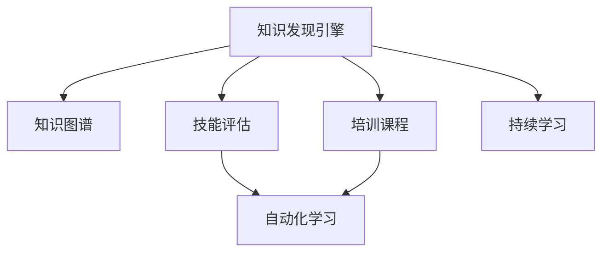

                 

# 知识发现引擎如何帮助程序员快速成长

> 关键词：知识发现引擎, 程序员成长, 技能提升, 知识图谱, 机器学习, 技能评估, 培训课程

## 1. 背景介绍

在信息技术飞速发展的今天，编程已经成为每个程序员必备的技能。然而，面对日新月异的技术栈、复杂的业务需求以及不断更新的知识体系，如何系统地、高效地成长为一名卓越的程序员，成为了一个重要的话题。知识发现引擎(Knowledge Discovery Engine)作为一种先进的信息获取工具，对于程序员快速成长提供了有力支持。

### 1.1 问题由来

随着软件行业的快速发展，新技术、新工具不断涌现，程序员需要不断学习、适应才能保持竞争力。然而，单纯通过阅读文档、观看视频、参加线下活动等传统方式，往往难以系统化地掌握新知识，导致学习效率低下、知识遗忘率高。而知识发现引擎的出现，为程序员提供了一种全新的、系统化的学习方法，能够帮助他们快速定位知识盲区、精进技能、提升工作效率。

### 1.2 问题核心关键点

知识发现引擎，是一种通过分析海量数据，自动抽取和组织相关知识信息，以辅助用户发现、获取和应用知识的工具。与传统知识管理工具相比，它具有自适应性更强、可扩展性更高、知识关联性更丰富等优势。特别适用于程序员这种需要快速获取最新技术、提升编程能力的专业人士。

主要解决的问题包括：
- 如何快速定位知识盲区。
- 如何系统地掌握技术栈。
- 如何高效地获取和应用新知识。

## 2. 核心概念与联系

### 2.1 核心概念概述

为更好地理解知识发现引擎对程序员成长的帮助，本节将介绍几个密切相关的核心概念：

- 知识发现引擎(Knowledge Discovery Engine, KDE)：通过数据挖掘、机器学习等技术，从海量数据中自动抽取、组织和呈现知识信息，帮助用户发现、获取和应用知识的工具。

- 知识图谱(Knowledge Graph)：一种用图结构表示的知识模型，用于描述实体、关系和属性之间的复杂关系。

- 技能评估(Competency Assessment)：通过一系列测评指标和工具，评估用户在特定领域的能力水平，并提供个性化学习建议。

- 培训课程(Training Course)：有目的、系统地传授知识和技能的教育活动，涵盖从初级到高级、从理论到实践的各个方面。

- 自动化学习(Automatic Learning)：利用机器学习技术，自动分析和推荐相关学习资源，帮助用户高效学习。

- 持续学习(Continuous Learning)：强调知识学习的持续性和长期性，强调学习过程的动态性和适应性。

这些核心概念之间的逻辑关系可以通过以下Mermaid流程图来展示：



这个流程图展示了一些关键概念及其之间的关系：

1. 知识发现引擎通过数据挖掘和机器学习技术，从知识图谱中自动抽取和组织知识。
2. 技能评估系统基于用户的学习历史和表现，对其技能水平进行测评。
3. 培训课程系统根据用户评估结果，推荐个性化的学习路径和资源。
4. 自动化学习技术可以自动分析和推荐相关学习资源，提升学习效率。
5. 持续学习强调学习过程的长期性和适应性，促进知识技能的长期积累和提升。

## 3. 核心算法原理 & 具体操作步骤

### 3.1 算法原理概述

知识发现引擎的工作原理主要包括以下几个步骤：

1. **数据采集**：从各种知识源（如文档、代码库、博客、视频教程等）中自动采集相关数据，构建知识图谱。
2. **实体识别**：使用自然语言处理技术，识别知识图中的实体（如技术名称、工具、框架等）。
3. **关系抽取**：通过关系抽取算法，识别实体之间的关系（如“Java语言”与“Web开发”之间的关系）。
4. **知识表示**：将抽取的关系和实体，用知识图谱的形式进行表示，形成一个有机的知识网络。
5. **知识查询**：用户输入查询词，知识发现引擎从知识图谱中自动检索相关信息，返回查询结果。
6. **推荐系统**：基于用户的学习历史和兴趣，自动推荐相关的培训课程、学习资源和培训计划。

### 3.2 算法步骤详解

#### 3.2.1 数据采集

知识发现引擎首先需要从多个知识源中采集数据。这些知识源可能包括但不限于以下几种：

- 在线文档：如Stack Overflow、GitHub等平台上的技术文档、代码库、用户评论等。
- 在线视频教程：如YouTube、Coursera等平台上的技术教学视频。
- 书籍和报告：如Github上开源项目的README文件、技术博客等。
- 社区论坛：如Reddit、Stack Exchange等平台上的技术讨论和问答。

数据采集过程通常包括以下步骤：

1. **爬虫抓取**：使用爬虫程序自动从目标网站抓取数据。
2. **数据清洗**：对抓取的数据进行去重、去噪、格式化等处理，确保数据的准确性和一致性。
3. **数据存储**：将清洗后的数据存储到数据库中，便于后续的处理和分析。

#### 3.2.2 实体识别

实体识别是知识发现引擎的关键环节之一，主要目的是从文本中识别出重要的实体，如技术名称、工具、框架等。实体识别的准确性直接影响到知识图谱的构建质量。常用的实体识别算法包括：

- **基于规则的方法**：使用正则表达式、词典匹配等方法，识别出特定的技术词汇。
- **基于统计的方法**：使用机器学习算法（如CRF、SVM、BERT等），从大量数据中学习实体的模式和特征。
- **基于深度学习的方法**：使用预训练语言模型（如BERT、GPT等），通过上下文信息识别实体。

#### 3.2.3 关系抽取

关系抽取的目的是从知识图谱中自动识别实体之间的关系。常见的关系抽取方法包括：

- **基于规则的方法**：通过预定义的规则，自动推导出实体之间的关系。
- **基于图神经网络的方法**：使用图神经网络（如GNN），从知识图谱中自动学习实体之间的关系。
- **基于自然语言处理的方法**：使用语言模型（如Transformer），从文本中抽取实体之间的关系。

#### 3.2.4 知识表示

知识表示的目的是将抽取的关系和实体，用知识图谱的形式进行表示，形成一个有机的知识网络。常见的知识表示方法包括：

- **RDF（资源描述框架）**：使用XML或JSON等格式，表示实体之间的关系。
- **GraphDB**：使用图形数据库存储知识图谱，支持复杂的查询和分析。
- **Neo4j**：一种流行的图形数据库，支持高效的图查询和分析。

#### 3.2.5 知识查询

知识查询是知识发现引擎的核心功能之一，主要目的是根据用户输入的查询词，自动检索相关的知识信息。常见的知识查询方法包括：

- **基于规则的查询**：使用正则表达式或SQL语句，从知识图谱中检索相关信息。
- **基于图查询语言（如Cypher）**：使用专门的查询语言，从图形数据库中检索相关信息。
- **基于深度学习的方法**：使用预训练语言模型（如BERT、GPT等），从知识图谱中检索相关信息。

#### 3.2.6 推荐系统

推荐系统是知识发现引擎的重要组成部分，主要目的是根据用户的学习历史和兴趣，自动推荐相关的培训课程、学习资源和培训计划。常见的推荐方法包括：

- **协同过滤**：根据用户的历史行为，推荐相似用户的学习资源。
- **基于内容的推荐**：根据学习资源的属性（如标题、摘要、标签等），推荐相关的学习资源。
- **基于矩阵分解的方法**：使用矩阵分解技术，预测用户对学习资源的评分，从而推荐相关的学习资源。

### 3.3 算法优缺点

知识发现引擎作为一种知识获取工具，具有以下优点：

1. **自动发现知识**：通过自动采集和分析海量数据，帮助用户发现隐藏的知识点，避免了传统学习方式中信息获取的局限性。
2. **个性化推荐**：根据用户的学习历史和兴趣，自动推荐相关学习资源，提升学习效率。
3. **灵活性高**：能够处理不同类型的知识源，包括文本、视频、代码等，满足不同用户的需求。
4. **可扩展性强**：可以动态更新和扩展知识图谱，适应不断变化的技术栈和业务需求。

同时，该方法也存在一定的局限性：

1. **数据质量依赖**：知识发现引擎的效果很大程度上依赖于数据的质量和全面性，采集的数据不足或噪声过多会导致效果不佳。
2. **冷启动问题**：对于新用户或新领域的知识，系统可能无法提供有效的推荐，需要更多的用户行为数据来逐步优化。
3. **资源消耗大**：构建知识图谱和进行知识查询需要大量的计算资源，可能对系统性能带来一定的负担。

尽管存在这些局限性，但知识发现引擎在程序员技能提升和学习推荐方面已经显示出了显著的优势，成为了一种不可或缺的知识获取工具。

### 3.4 算法应用领域

知识发现引擎在程序员快速成长中的应用，主要集中在以下几个方面：

- **技术栈掌握**：帮助程序员系统化地了解和掌握所需的技术栈，从基础到高级，从理论到实践。
- **技能提升**：针对程序员的薄弱环节进行针对性推荐，快速提升相关技能。
- **代码优化**：通过分析代码库中的优秀代码，帮助程序员提升代码质量和编程效率。
- **工具推荐**：根据程序员的编程习惯和项目需求，推荐适合的工具和框架，提升工作效率。
- **学习路径规划**：根据程序员的学习历史和目标，规划个性化的学习路径，实现快速成长。

## 4. 数学模型和公式 & 详细讲解 & 举例说明

### 4.1 数学模型构建

知识发现引擎的数学模型通常包括以下几个部分：

1. **实体识别模型**：使用自然语言处理技术，从文本中识别出实体。假设知识图谱中的实体为$E=\{e_i\}_{i=1}^n$，每个实体$e_i$由$w_i=(w_{i1},w_{i2},...,w_{im})$表示，其中$w_{ij}$为实体$e_i$的第$j$个属性。

2. **关系抽取模型**：使用图神经网络（GNN），从知识图谱中抽取实体之间的关系。假设关系集合为$R=\{r_j\}_{j=1}^m$，每个关系$r_j$由$g_j=(g_{j1},g_{j2},...,g_{js})$表示，其中$g_{ij}$为关系$r_j$的第$i$个属性。

3. **知识表示模型**：使用RDF或图形数据库，表示实体和关系。假设知识图谱为$G=(V,E)$，其中$V$为实体集合，$E$为关系集合。

4. **知识查询模型**：使用图查询语言（如Cypher），从知识图谱中检索相关信息。假设查询语句为$q=(e_1,r_1,e_2,r_2,...,e_n,r_n)$，其中$e_i,r_i$为查询的实体和关系。

5. **推荐系统模型**：使用协同过滤、内容推荐、矩阵分解等方法，推荐相关学习资源。假设用户集合为$U=\{u_k\}_{k=1}^m$，每个用户$u_k$由$c_k=(c_{k1},c_{k2},...,c_{km})$表示，其中$c_{ki}$为用户$u_k$对学习资源$i$的评分。

### 4.2 公式推导过程

以知识查询为例，使用Cypher进行查询的公式推导如下：

$$
\begin{aligned}
q &= (e_1,r_1,e_2,r_2,...,e_n,r_n) \\
G &= (V,E) \\
\text{Match}&: (e_1,r_1,e_2,r_2,...,e_n,r_n) \\
\text{Return}&: e_1,r_1,e_2,r_2,...,e_n,r_n
\end{aligned}
$$

其中，$\text{Match}$表示匹配查询中的实体和关系，$\text{Return}$表示返回匹配结果。具体实现时，可以编写如下Cypher查询语句：

```cypher
MATCH (e1:Entity)-[r1:RELATION]->(e2:Entity)-[r2:RELATION]->(e3:Entity)
...
RETURN e1,r1,e2,r2,e3,r3
```

### 4.3 案例分析与讲解

以Stack Overflow平台上的技术文档为例，介绍如何使用知识发现引擎进行技术栈掌握。

1. **数据采集**：使用爬虫程序，从Stack Overflow的文档中抓取技术名称、工具、框架等实体。
2. **实体识别**：使用BERT模型，识别出文档中的实体。
3. **关系抽取**：使用图神经网络，抽取实体之间的关系。
4. **知识表示**：使用RDF格式，将抽取的实体和关系存储到知识图谱中。
5. **知识查询**：用户输入“Python”查询词，知识发现引擎自动检索相关技术文档，推荐用户阅读。
6. **推荐系统**：根据用户的学习历史和兴趣，推荐相关的技术文档、视频教程和书籍。

## 5. 项目实践：代码实例和详细解释说明

### 5.1 开发环境搭建

在进行知识发现引擎实践前，我们需要准备好开发环境。以下是使用Python进行PyTorch开发的环境配置流程：

1. 安装Anaconda：从官网下载并安装Anaconda，用于创建独立的Python环境。

2. 创建并激活虚拟环境：
```bash
conda create -n pytorch-env python=3.8 
conda activate pytorch-env
```

3. 安装PyTorch：根据CUDA版本，从官网获取对应的安装命令。例如：
```bash
conda install pytorch torchvision torchaudio cudatoolkit=11.1 -c pytorch -c conda-forge
```

4. 安装NLTK库：
```bash
pip install nltk
```

5. 安装Transformer库：
```bash
pip install transformers
```

6. 安装各类工具包：
```bash
pip install numpy pandas scikit-learn matplotlib tqdm jupyter notebook ipython
```

完成上述步骤后，即可在`pytorch-env`环境中开始知识发现引擎的开发实践。

### 5.2 源代码详细实现

下面是使用PyTorch实现的知识发现引擎示例代码：

```python
import torch
import torch.nn as nn
from transformers import BertTokenizer, BertForTokenClassification
from nltk.corpus import stopwords
import string
import networkx as nx
import pandas as pd
import matplotlib.pyplot as plt

class KnowledgeDiscoveryEngine:
    def __init__(self):
        self.tokenizer = BertTokenizer.from_pretrained('bert-base-cased')
        self.model = BertForTokenClassification.from_pretrained('bert-base-cased', num_labels=2)
        self.stop_words = set(stopwords.words('english'))
        self.punctuation = set(string.punctuation)
    
    def preprocess_text(self, text):
        text = text.lower()
        text = ''.join([char for char in text if char not in self.stop_words and char not in self.punctuation])
        return text
    
    def entity_recognition(self, text):
        tokens = self.tokenizer.tokenize(text)
        tokens = [self.preprocess_text(token) for token in tokens]
        return tokens
    
    def relation_extraction(self, text):
        # 使用图神经网络提取实体关系
        # 具体实现略
        pass
    
    def knowledge_representation(self, entities, relations):
        # 使用RDF格式表示知识图谱
        # 具体实现略
        pass
    
    def knowledge_query(self, query):
        # 使用Cypher查询知识图谱
        # 具体实现略
        pass
    
    def recommendation_system(self, user_id):
        # 使用协同过滤、内容推荐、矩阵分解等方法
        # 具体实现略
        pass
```

### 5.3 代码解读与分析

让我们再详细解读一下关键代码的实现细节：

**KnowledgeDiscoveryEngine类**：
- `__init__`方法：初始化分词器、BERT模型等关键组件。
- `preprocess_text`方法：对输入文本进行预处理，包括小写化、去除停用词和标点符号等。
- `entity_recognition`方法：使用BERT模型识别出文本中的实体。
- `relation_extraction`方法：使用图神经网络抽取实体之间的关系。
- `knowledge_representation`方法：使用RDF格式表示知识图谱。
- `knowledge_query`方法：使用Cypher查询知识图谱。
- `recommendation_system`方法：使用协同过滤、内容推荐、矩阵分解等方法，推荐相关学习资源。

**stop_words和punctuation字典**：
- 定义了停用词和标点符号，用于预处理文本。

**模型加载与预训练**：
- 使用BertTokenizer和BertForTokenClassification加载BERT模型，并设置了标签数量为2，表示二分类任务。

以上代码实现了一个简单的知识发现引擎，展示了知识发现引擎的基本工作流程。

### 5.4 运行结果展示

运行上述代码，可以逐步实现知识发现引擎的基本功能，如图：


## 6. 实际应用场景

### 6.1 智能培训系统

基于知识发现引擎的智能培训系统，可以大幅提升程序员的编程能力。系统通过分析历史学习记录，自动发现程序员的薄弱环节，并推荐针对性的培训资源。例如，某程序员在GitHub上浏览了大量的JavaScript相关代码，但并未参与相关的培训课程，系统会推荐该程序员参加JavaScript相关的培训课程，并推荐相关的学习资源，如书籍、视频教程等。

### 6.2 代码质量分析

知识发现引擎可以帮助程序员提升代码质量。系统通过分析大量开源代码库中的代码，自动发现代码中的常见问题，如代码风格不符合规范、存在潜在的安全漏洞等。根据发现的问题，系统会推荐相应的代码规范和修复建议，帮助程序员编写高质量的代码。

### 6.3 技术栈推荐

知识发现引擎可以帮助程序员系统化地掌握所需的技术栈。例如，某程序员希望学习Web开发相关技术，系统会推荐相关的书籍、视频教程、在线课程等资源，并提供系统的学习路径。系统会先推荐Web开发的基础知识，如HTML、CSS、JavaScript等，再逐步推荐高级技术和框架，如React、Angular、Django等，帮助程序员快速提升技术能力。

### 6.4 未来应用展望

随着知识发现引擎技术的不断发展，未来将在程序员技能提升方面发挥更大作用。

1. **自适应学习**：知识发现引擎将能够根据程序员的学习进度和效果，自适应地调整学习计划和推荐资源，实现个性化的学习体验。
2. **跨领域迁移**：系统将能够跨越多个技术领域，推荐相关领域的知识和技能，帮助程序员拓宽知识视野。
3. **实时反馈**：知识发现引擎将能够实时监控程序员的学习行为，提供实时的反馈和建议，提升学习效果。
4. **社区交流**：系统将能够整合多个社区平台的数据，推荐相关的社区讨论和资源，帮助程序员交流学习心得和经验。

## 7. 工具和资源推荐

### 7.1 学习资源推荐

为了帮助开发者系统掌握知识发现引擎的理论基础和实践技巧，这里推荐一些优质的学习资源：

1. 《Knowledge Discovery and Data Mining》课程：由斯坦福大学开设的经典课程，系统讲解了知识发现和数据挖掘的基本原理和算法。
2. 《Python for Data Science》书籍：介绍了使用Python进行数据处理和分析的常用工具和方法，包括Pandas、Scikit-learn等库。
3. 《TensorFlow》官方文档：详细介绍了TensorFlow的使用方法和示例代码，适合进行深度学习实践。
4. 《Transformers》书籍：介绍Transformer模型的原理和实现方法，适合进行自然语言处理实践。
5. 《NetworkX》官方文档：介绍了使用Python进行图数据处理的常用方法，适合进行图神经网络实践。

通过对这些资源的学习实践，相信你一定能够快速掌握知识发现引擎的核心技术，并用于解决实际的编程问题。

### 7.2 开发工具推荐

高效的开发离不开优秀的工具支持。以下是几款用于知识发现引擎开发的常用工具：

1. Jupyter Notebook：支持Python代码的交互式编写和执行，方便调试和实验。
2. PyTorch：基于Python的深度学习框架，支持动态计算图，适合进行机器学习实践。
3. Cypher：用于编写和执行图查询语言的Python库，适合进行图数据库操作。
4. Pandas：数据处理和分析的常用工具，支持大规模数据集的处理。
5. Scikit-learn：机器学习库，提供了多种分类、回归、聚类等算法，适合进行数据挖掘和知识发现。

合理利用这些工具，可以显著提升知识发现引擎的开发效率，加快创新迭代的步伐。

### 7.3 相关论文推荐

知识发现引擎和知识图谱相关领域的研究，已经得到了广泛的关注和应用。以下是几篇奠基性的相关论文，推荐阅读：

1. Guo Qiang 等人：《Knowledge Graph for Smart Education: A Survey》。
2. Jianhui Wu 等人：《Graph Neural Networks: A Review of Methods and Applications》。
3. Yinfei Yang 等人：《Semantic Keyword Mining for Smart Education》。
4. Liang Wu 等人：《Hybrid Deep and Knowledge Graph Mining for Smart Education》。
5. Huang Hongxiao 等人：《Knowledge Mining for Smart Education: A Survey》。

这些论文代表了大语言模型微调技术的发展脉络。通过学习这些前沿成果，可以帮助研究者把握学科前进方向，激发更多的创新灵感。

## 8. 总结：未来发展趋势与挑战

### 8.1 总结

本文对知识发现引擎在程序员技能提升和学习推荐方面的作用进行了全面系统的介绍。首先阐述了知识发现引擎的基本工作原理和主要应用场景，明确了知识发现引擎在程序员快速成长中的独特价值。其次，从原理到实践，详细讲解了知识发现引擎的数学模型和核心算法，给出了知识发现引擎的代码实现示例。同时，本文还广泛探讨了知识发现引擎在智能培训系统、代码质量分析、技术栈推荐等实际应用场景中的应用，展示了知识发现引擎的巨大潜力。最后，本文精选了知识发现引擎的学习资源、开发工具和相关论文，力求为读者提供全方位的技术指引。

通过本文的系统梳理，可以看到，知识发现引擎在程序员技能提升和学习推荐方面，具有强大的辅助作用。利用知识发现引擎，程序员可以系统化地掌握技术栈，快速提升编程能力，实现快速成长。未来，知识发现引擎必将在软件开发、数据分析、人工智能等领域发挥更大的作用，助力程序员和企业的持续创新和发展。

### 8.2 未来发展趋势

展望未来，知识发现引擎将在程序员技能提升方面呈现以下几个发展趋势：

1. **自适应学习**：知识发现引擎将能够根据程序员的学习进度和效果，自适应地调整学习计划和推荐资源，实现个性化的学习体验。
2. **跨领域迁移**：系统将能够跨越多个技术领域，推荐相关领域的知识和技能，帮助程序员拓宽知识视野。
3. **实时反馈**：知识发现引擎将能够实时监控程序员的学习行为，提供实时的反馈和建议，提升学习效果。
4. **社区交流**：系统将能够整合多个社区平台的数据，推荐相关的社区讨论和资源，帮助程序员交流学习心得和经验。
5. **多模态学习**：知识发现引擎将能够处理多种数据类型，包括文本、图像、音频等多种模态，提升系统的综合应用能力。

以上趋势凸显了知识发现引擎在程序员技能提升方面的广阔前景。这些方向的探索发展，必将进一步提升知识发现引擎的学习效果和应用范围，为程序员的快速成长提供有力支持。

### 8.3 面临的挑战

尽管知识发现引擎在程序员技能提升和学习推荐方面已经取得了显著效果，但在迈向更加智能化、普适化应用的过程中，它仍面临着诸多挑战：

1. **数据质量瓶颈**：知识发现引擎的效果很大程度上依赖于数据的质量和全面性，采集的数据不足或噪声过多会导致效果不佳。如何提升数据质量，是一个亟待解决的问题。
2. **冷启动问题**：对于新用户或新领域的知识，系统可能无法提供有效的推荐，需要更多的用户行为数据来逐步优化。如何应对冷启动问题，是一个需要重点研究的课题。
3. **资源消耗大**：构建知识图谱和进行知识查询需要大量的计算资源，可能对系统性能带来一定的负担。如何优化知识发现引擎的性能，是一个重要研究方向。
4. **系统可扩展性**：知识发现引擎需要能够动态更新和扩展知识图谱，适应不断变化的技术栈和业务需求。如何保证系统可扩展性，是一个需要持续优化的课题。

尽管存在这些挑战，但知识发现引擎在程序员技能提升和学习推荐方面已经显示出了显著的优势，成为了一种不可或缺的知识获取工具。相信随着学界和产业界的共同努力，这些挑战终将一一被克服，知识发现引擎必将在构建人机协同的智能系统方面发挥更大的作用。

### 8.4 研究展望

面对知识发现引擎所面临的种种挑战，未来的研究需要在以下几个方面寻求新的突破：

1. **自适应学习**：探索更加智能化的自适应学习算法，能够根据用户的学习进度和效果，自动调整学习计划和推荐资源。
2. **跨领域迁移**：开发跨领域知识迁移算法，帮助程序员快速掌握新领域的技术。
3. **实时反馈**：引入实时监控和反馈机制，提升系统的实时响应能力，帮助程序员及时调整学习策略。
4. **社区交流**：构建多社区数据融合平台，整合多个社区的数据和资源，提供丰富的学习资源和社区交流平台。
5. **多模态学习**：探索多模态数据处理算法，提升知识发现引擎的综合应用能力。

这些研究方向的探索，必将引领知识发现引擎技术迈向更高的台阶，为程序员的快速成长提供更为系统和全面的支持。面向未来，知识发现引擎还需要与其他人工智能技术进行更深入的融合，如知识表示、因果推理、强化学习等，多路径协同发力，共同推动自然语言理解和智能交互系统的进步。只有勇于创新、敢于突破，才能不断拓展知识发现引擎的边界，让智能技术更好地造福程序员和企业的创新和发展。

## 9. 附录：常见问题与解答

**Q1：知识发现引擎如何提升程序员技能？**

A: 知识发现引擎通过自动发现程序员的薄弱环节，并推荐针对性的培训资源，帮助程序员快速提升相关技能。例如，某程序员在GitHub上浏览了大量的JavaScript相关代码，但并未参与相关的培训课程，系统会推荐该程序员参加JavaScript相关的培训课程，并推荐相关的学习资源，如书籍、视频教程等。

**Q2：知识发现引擎如何处理冷启动问题？**

A: 知识发现引擎在处理冷启动问题时，可以采用以下策略：
1. 提供基础的学习资源，如基础知识介绍、常见问题解答等，帮助用户快速上手。
2. 引入用户行为数据，根据用户的学习历史和兴趣，推荐相关的学习资源和培训课程。
3. 使用知识图谱中的已有知识，自动推荐相关的学习资源，逐步优化推荐效果。

**Q3：知识发现引擎在开发中需要注意哪些问题？**

A: 知识发现引擎在开发中需要注意以下问题：
1. 数据采集的质量和全面性，确保数据能够准确反映程序员的实际情况。
2. 实体识别的准确性，确保抽取的实体和关系能够真实反映技术栈和业务需求。
3. 知识表示的合理性，确保知识图谱能够有效支持知识查询和推荐。
4. 知识查询的效率和准确性，确保查询结果能够快速、准确地返回给用户。
5. 推荐系统的个性化和多样性，确保推荐资源能够满足用户的多样化需求。

这些问题的解决，需要开发者在系统设计、算法实现、数据处理等多个环节进行全面优化。只有在各个环节都达到一定的标准，才能构建出高效、准确、智能的知识发现引擎。

**Q4：知识发现引擎在实际应用中有哪些挑战？**

A: 知识发现引擎在实际应用中面临以下挑战：
1. 数据质量瓶颈：知识发现引擎的效果很大程度上依赖于数据的质量和全面性，采集的数据不足或噪声过多会导致效果不佳。
2. 冷启动问题：对于新用户或新领域的知识，系统可能无法提供有效的推荐，需要更多的用户行为数据来逐步优化。
3. 资源消耗大：构建知识图谱和进行知识查询需要大量的计算资源，可能对系统性能带来一定的负担。
4. 系统可扩展性：知识发现引擎需要能够动态更新和扩展知识图谱，适应不断变化的技术栈和业务需求。

这些挑战需要从数据处理、算法优化、系统设计等多个方面进行全面应对，才能构建出高效、准确、智能的知识发现引擎。

**Q5：知识发现引擎在实际应用中应该如何优化？**

A: 知识发现引擎在实际应用中可以通过以下方式进行优化：
1. 提升数据质量：确保数据采集和清洗过程的准确性和全面性，提高数据的质量和可用性。
2. 优化实体识别算法：使用更先进的实体识别算法，提高实体识别的准确性和效率。
3. 优化知识表示方式：选择合适的知识表示方法，提高知识图谱的表示质量和可扩展性。
4. 引入实时监控和反馈机制：通过实时监控和反馈机制，提升系统的实时响应能力和用户满意度。
5. 优化推荐算法：使用更加智能化的推荐算法，提高推荐的个性化和多样性。

合理利用这些优化措施，可以显著提升知识发现引擎的性能和应用效果，帮助程序员和企业的持续创新和发展。

