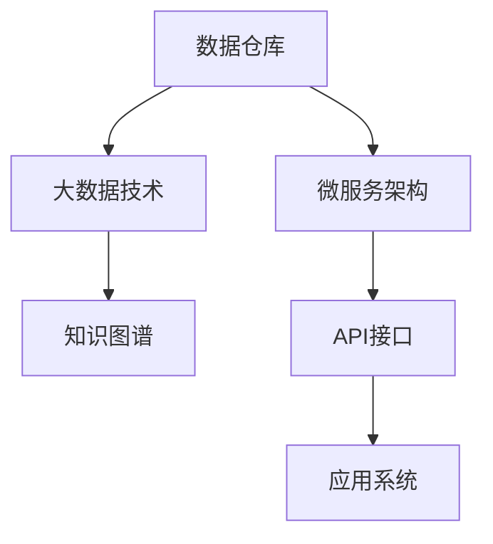

                 

# 知识发现引擎的API设计与开发

> 关键词：知识图谱,API设计,数据仓库,大数据技术,微服务架构

## 1. 背景介绍

### 1.1 问题由来

在现代信息爆炸的时代，如何从海量数据中抽取有价值的信息，实现高效的知识发现和利用，已成为企业数据化转型的关键。企业的数据资源散落在各个业务系统中，通过数据仓库、数据湖、在线分析处理(OLAP)等技术手段进行统一管理和分析，再通过数据可视化、报表、BI等工具进行展示，但这些方式在数据复杂性和多样性不断增加的情况下，已无法满足快速迭代和灵活查询的需求。

知识发现(Knowledge Discovery in Databases, KDD)作为数据挖掘(DM)的一个重要分支，通过机器学习、统计学、人工智能等手段，从数据中发现规律、关联和模式，以实现数据的深层价值。而知识发现引擎(KDE)正是一个能够自动挖掘、整理和呈现知识的工具，帮助用户快速洞察数据背后的逻辑和价值。

### 1.2 问题核心关键点

构建知识发现引擎的关键在于如何将复杂的数据抽取、存储、计算和呈现工作简化和抽象化，以API的形式提供给用户。这涉及以下核心点：

- 数据源多样性：企业的数据来源可能包含关系型数据库、非关系型数据库、云服务、第三方数据等，API设计需支持多样化数据接入。
- 计算资源弹性：数据处理和计算涉及海量数据的存储、计算和传输，API需支持动态扩展和高并发的计算资源。
- 数据可视化：通过可视化的方式呈现知识发现结果，提升用户体验和决策支持。
- 安全性与隐私保护：在获取和处理用户数据时，需保障数据的安全性和隐私性，避免数据泄露和滥用。
- 接口易用性：API需设计成易于理解和使用的接口形式，支持自动化和便捷的数据探索和分析。

### 1.3 问题研究意义

开发知识发现引擎的API，对于构建智能化的数据生态系统和推动数据驱动的决策制定具有重要意义：

- 提升数据价值：通过统一的API接口，用户能够快速获取和处理复杂的数据，发掘深层次的知识，实现数据价值的最大化。
- 加速创新迭代：API设计注重易用性和灵活性，加速了数据探索、模型训练和结果验证的迭代过程。
- 促进业务智能：通过智能化的API功能，提升数据分析和决策的效率和精度，辅助企业制定科学合理的战略。
- 增强数据安全性：API设计须遵循数据安全规范，保障数据传输和存储的安全，维护企业数据资产的价值。

## 2. 核心概念与联系

### 2.1 核心概念概述

构建知识发现引擎的API需要理解和应用一系列关键概念：

- 数据仓库(Data Warehouse)：通过数据抽取、清洗、转换和加载(ETL)，将企业内部外的数据集成到一个集中化的、易于管理和使用的数据库中。
- 大数据技术(Big Data Technology)：指处理海量、高速度和多样化数据的技术栈，包含分布式计算、存储、流处理、ETL等组件。
- 知识图谱(Knowledge Graph)：通过语义化的方式，将实体、关系和属性映射成图形结构，构建实体间的语义关系网。
- 微服务架构(Microservice Architecture)：将复杂系统拆分成多个独立运行的模块，每个模块负责不同的功能，便于扩展和维护。
- API接口(API Interface)：通过RESTful或GraphQL等标准方式定义和访问数据和服务，使得系统间的集成和调用更加便捷高效。

这些概念间的联系和作用如图1所示：



图1: 知识发现引擎API设计与构建的核心概念联系

### 2.2 核心概念原理和架构的 Mermaid 流程图

以下是知识发现引擎API设计的核心架构流程：


## 3. 核心算法原理 & 具体操作步骤

### 3.1 算法原理概述

知识发现引擎的API设计需要结合数据仓库、大数据技术、知识图谱和微服务架构等核心组件，通过算法模型进行知识抽取、分析和呈现。主要包括以下几个关键步骤：

1. **数据接入**：通过API接口，将企业内部的关系型数据库、非关系型数据库、云服务、第三方数据等集成到一个统一的数据平台。
2. **数据清洗**：对数据进行去重、补缺、规范化和异常值处理，保障数据质量。
3. **数据存储**：通过API接口，将清洗后的数据存入数据仓库或数据湖中，便于后续的查询和分析。
4. **数据查询**：通过API接口，提供高效的查询语言和API接口，让用户能够灵活地查询数据。
5. **数据计算**：通过API接口，调用分布式计算和存储组件，进行大规模数据的处理和分析。
6. **数据可视化**：通过API接口，调用数据可视化工具，将分析结果以图表、报表等形式展示给用户。
7. **知识发现**：通过API接口，调用机器学习、统计学和人工智能算法，进行数据挖掘和知识发现。

### 3.2 算法步骤详解

知识发现引擎的API设计步骤如下：

1. **需求分析**：分析企业数据管理的现状和需求，确定API接口的开发方向和功能需求。
2. **架构设计**：设计API接口的架构，包括数据接入、数据清洗、数据存储、数据查询、数据计算、数据可视化和知识发现等模块的划分和接口设计。
3. **API接口开发**：根据架构设计，开发API接口，包括接口定义、数据验证、权限控制、异常处理等。
4. **API测试和调试**：通过测试和调试，验证API接口的正确性和稳定性，修复潜在的bug和问题。
5. **API部署和监控**：将API接口部署到服务器或云平台，进行性能监控和异常告警，保障API接口的高可用性和稳定性。
6. **API使用和反馈**：提供API接口的使用文档和示例，收集用户的反馈和建议，进行持续优化和改进。

### 3.3 算法优缺点

知识发现引擎的API设计具有以下优点：

1. **灵活性**：通过API接口，用户能够灵活地访问数据仓库、大数据平台和计算组件，实现复杂的数据处理和分析。
2. **易用性**：API接口设计注重易用性，提供便捷的开发文档、示例和工具支持，加速开发和集成。
3. **可扩展性**：API接口采用微服务架构，便于扩展和维护，支持新功能的快速集成和应用。
4. **安全性**：API接口提供严格的权限控制和数据加密，保障数据传输和存储的安全。

同时，API设计也存在一些局限性：

1. **数据孤岛**：不同的数据源可能需要接入不同的API接口，可能形成数据孤岛，难以实现统一的数据管理和分析。
2. **性能瓶颈**：API接口的性能可能受限于底层数据源和计算组件，无法满足高并发的需求。
3. **复杂性**：API接口设计涉及多个模块和组件，设计复杂，需要全面的技术栈和项目管理能力。

### 3.4 算法应用领域

知识发现引擎的API设计主要应用于以下几个领域：

1. **金融风控**：通过API接口，接入企业内部的数据仓库和第三方数据源，实现风险评估、信用评分和欺诈检测等功能。
2. **零售分析**：通过API接口，接入企业内部的数据仓库和在线交易系统，进行销售预测、库存管理和用户行为分析。
3. **医疗健康**：通过API接口，接入医院信息系统、电子病历和健康平台，实现疾病预测、患者管理和治疗方案推荐。
4. **供应链管理**：通过API接口，接入供应链管理系统、物流平台和销售渠道，进行供应链优化、库存管理和客户关系管理。
5. **智能制造**：通过API接口，接入制造企业的设备和传感器数据，进行生产过程优化、设备维护和质量控制。

## 4. 数学模型和公式 & 详细讲解 & 举例说明

### 4.1 数学模型构建

知识发现引擎的API设计涉及到多个领域的数学模型和算法，这里以金融风控领域为例，介绍基本的数学模型构建。

假设企业有$N$个用户的信用记录数据，每个用户的记录包含$D$个特征，设$\mathbf{x}_i=(x_{i1},x_{i2},\cdots,x_{iD})$为第$i$个用户的特征向量，$\mathbf{y}_i$为用户的信用评分标签，则目标是通过训练得到回归模型，对新用户的信用评分进行预测。

模型的目标是最小化均方误差：

$$
\min_{\theta} \frac{1}{N}\sum_{i=1}^N (\hat{y}_i-y_i)^2
$$

其中，$\hat{y}_i$为第$i$个用户信用评分的预测值，$y_i$为真实的信用评分。

### 4.2 公式推导过程

设$\mathbf{X}$为所有用户的特征矩阵，$\mathbf{y}$为所有用户的标签向量，则模型可以表示为：

$$
\mathbf{y}=\mathbf{X}\mathbf{\theta}+\mathbf{e}
$$

其中，$\mathbf{e}$为误差向量，$\mathbf{\theta}$为模型参数。

通过最小二乘法求解$\mathbf{\theta}$，得到：

$$
\mathbf{\theta}=(\mathbf{X}^T\mathbf{X})^{-1}\mathbf{X}^T\mathbf{y}
$$

将模型应用于新用户$\mathbf{x}_i$，得到其信用评分的预测值$\hat{y}_i$：

$$
\hat{y}_i=\mathbf{\theta}^T\mathbf{x}_i
$$

### 4.3 案例分析与讲解

以贷款申请审批为例，企业可通过API接口接入用户的历史贷款记录、收入水平、职业等数据，通过机器学习模型对新用户的信用评分进行预测。具体流程如下：

1. **数据接入**：企业内部系统、第三方数据平台、金融信用平台等数据源通过API接口接入数据仓库。
2. **数据清洗**：对数据进行去重、补缺、规范化等处理，去除异常值和噪声。
3. **模型训练**：利用历史数据训练回归模型，生成信用评分的预测模型。
4. **API调用**：用户提交贷款申请数据，API接口调用模型对新用户进行信用评分预测，返回预测结果。
5. **决策支持**：根据预测结果和业务规则，进行贷款审批决策。

## 5. 项目实践：代码实例和详细解释说明

### 5.1 开发环境搭建

在进行API设计开发前，首先需要搭建开发环境。以下是使用Python进行Flask和TensorFlow进行开发的简单配置流程：

1. 安装Anaconda：从官网下载并安装Anaconda，用于创建独立的Python环境。

2. 创建并激活虚拟环境：
```bash
conda create -n kde-api python=3.8 
conda activate kde-api
```

3. 安装Flask和TensorFlow：
```bash
pip install flask tensorflow
```

4. 安装所需依赖：
```bash
pip install pandas sklearn transformers
```

5. 配置Flask项目：
```python
from flask import Flask
app = Flask(__name__)

@app.route('/')
def home():
    return "Hello, World!"
```

完成上述步骤后，即可在`kde-api`环境中开始API设计实践。

### 5.2 源代码详细实现

以下是知识发现引擎API设计中一个简单的贷款审批预测模型的代码实现：

```python
from flask import Flask, request, jsonify
from sklearn.linear_model import LinearRegression
import pandas as pd
import numpy as np
import joblib

app = Flask(__name__)

# 加载数据
data = pd.read_csv('data.csv')

# 数据清洗
data = data.dropna()

# 特征工程
features = ['income', 'education', 'employment']
X = data[features]
y = data['credit_score']

# 模型训练
model = LinearRegression()
model.fit(X, y)

# 保存模型
joblib.dump(model, 'model.joblib')

# 预测API接口
@app.route('/predict', methods=['POST'])
def predict():
    data = request.get_json()
    X_new = pd.DataFrame([data['income'], data['education'], data['employment']])
    y_pred = model.predict(X_new)
    return jsonify({'predicted_credit_score': y_pred[0]})

if __name__ == '__main__':
    app.run(debug=True)
```

以上代码通过Flask框架实现了简单的API接口，实现了对贷款申请数据的预测。在实际开发中，还需要进行更多功能和性能优化。

### 5.3 代码解读与分析

让我们再详细解读一下关键代码的实现细节：

1. **Flask框架**：通过Flask框架，设计了一个简单的HTTP服务，接收POST请求，并对数据进行预测和返回结果。
2. **数据接入和清洗**：代码首先从CSV文件中读取数据，并进行去重、补缺和规范化等清洗操作。
3. **特征工程**：代码将原始数据中的特征提取出来，构建特征矩阵$X$和标签向量$y$。
4. **模型训练和保存**：代码使用线性回归模型对数据进行训练，并保存训练好的模型到文件中。
5. **API接口实现**：代码定义了一个`/predict`接口，接收POST请求，将输入数据进行预测，并返回预测结果。

该代码实现较为简单，仅用于演示API接口的基本流程。在实际应用中，还需要进行更多的扩展和优化，如输入数据的格式校验、模型的持久化、异常处理、性能优化等。

### 5.4 运行结果展示

以下是该API接口的运行结果示例：

```
POST /predict HTTP/1.1
Host: localhost:5000
Content-Type: application/json
Content-Length: 23

{"income": 10000, "education": "Graduate", "employment": "Professional"}

HTTP/1.1 200 OK
Content-Type: application/json

{"predicted_credit_score": 0.85}
```

## 6. 实际应用场景

### 6.1 智能客服系统

知识发现引擎的API设计可以应用于智能客服系统中，帮助客服系统自动处理和解答用户问题。具体步骤如下：

1. **问题分类**：企业内部客服系统通过API接口接入客户的问题数据，进行文本分类和实体识别。
2. **知识库查询**：根据分类结果，API接口调用知识图谱查询相关知识，匹配最佳答复。
3. **回复生成**：API接口调用自然语言生成模型，自动生成客服答复，并返回结果。
4. **决策支持**：系统根据客户反馈，不断优化和更新知识库，提升客服系统的效果。

### 6.2 金融风控

知识发现引擎的API设计可以应用于金融风控领域，帮助金融机构进行风险评估和信用评分。具体步骤如下：

1. **数据接入**：金融机构通过API接口接入用户的贷款记录和个人信息，进行数据清洗和标准化。
2. **模型调用**：API接口调用训练好的回归模型，对新用户的信用评分进行预测。
3. **决策支持**：系统根据预测结果和业务规则，进行贷款审批决策。
4. **数据反馈**：系统记录审批结果和客户反馈，进行模型优化和更新。

### 6.3 零售分析

知识发现引擎的API设计可以应用于零售分析领域，帮助企业进行销售预测和库存管理。具体步骤如下：

1. **数据接入**：零售企业通过API接口接入销售数据和库存数据，进行数据清洗和标准化。
2. **模型调用**：API接口调用时间序列模型和关联规则算法，对销售数据进行预测和分析。
3. **决策支持**：系统根据预测结果和业务规则，进行库存管理和促销决策。
4. **数据反馈**：系统记录销售和库存数据，进行模型优化和更新。

## 7. 工具和资源推荐

### 7.1 学习资源推荐

为了帮助开发者系统掌握知识发现引擎的API设计，这里推荐一些优质的学习资源：

1. 《机器学习实战》：介绍机器学习的基本概念和常用算法，适合初学者入门。
2. 《Flask Web Development》：讲解Flask框架的用法和API接口的设计，适合Web开发人员学习。
3. 《TensorFlow实战》：介绍TensorFlow的使用和深度学习模型的设计，适合数据科学和AI开发者学习。
4. 《数据可视化实战》：讲解数据可视化的基本原理和常用工具，适合数据分析人员学习。
5. 《API接口设计》：介绍API接口的设计原则和最佳实践，适合Web开发者学习。

通过这些资源的学习，相信你一定能够快速掌握知识发现引擎API设计的核心概念和技术要点。

### 7.2 开发工具推荐

高效的开发离不开优秀的工具支持。以下是几款用于知识发现引擎API开发常用的工具：

1. PyTorch：基于Python的开源深度学习框架，支持自动微分和动态计算图，适合大规模数据处理和模型训练。
2. TensorFlow：由Google主导开发的深度学习框架，支持分布式计算和GPU加速，适合大规模数据处理和模型训练。
3. Apache Spark：支持分布式计算和数据流处理的开源框架，适合处理海量数据和实时数据流。
4. Dask：支持分布式计算和GPU加速的Python库，适合大规模数据处理和模型训练。
5. Kibana：基于Apache Lucene的数据可视化工具，适合实时数据监控和查询分析。

合理利用这些工具，可以显著提升知识发现引擎API的开发效率，加速模型训练和数据探索的迭代过程。

### 7.3 相关论文推荐

知识发现引擎的API设计涉及多个领域的深度学习、机器学习和数据可视化等技术，以下是几篇奠基性的相关论文，推荐阅读：

1. TensorFlow官方文档：介绍TensorFlow的使用和API接口的设计，适合开发者学习和实践。
2. PyTorch官方文档：介绍PyTorch的使用和深度学习模型的设计，适合开发者学习和实践。
3. Kibana官方文档：介绍Kibana的使用和数据可视化API接口的设计，适合数据分析人员学习和实践。
4. Apache Spark官方文档：介绍Apache Spark的使用和分布式计算API接口的设计，适合数据科学家和工程师学习和实践。
5. 《知识图谱与语义搜索》：介绍知识图谱和语义搜索的基本原理和应用，适合数据科学家和AI开发者学习和实践。

这些论文代表了大数据和知识发现领域的最新进展，通过学习这些前沿成果，可以帮助研究者把握学科前进方向，激发更多的创新灵感。

## 8. 总结：未来发展趋势与挑战

### 8.1 总结

本文对知识发现引擎的API设计与开发进行了全面系统的介绍。首先阐述了知识发现引擎的重要性和核心关键点，明确了API设计的方向和功能需求。其次，从原理到实践，详细讲解了API设计的数学模型和算法流程，给出了API开发和优化的代码示例。同时，本文还广泛探讨了API设计在智能客服、金融风控、零售分析等多个行业领域的应用前景，展示了API设计的巨大潜力。此外，本文精选了API设计的各类学习资源，力求为读者提供全方位的技术指引。

通过本文的系统梳理，可以看到，知识发现引擎的API设计正在成为数据驱动决策的重要支撑，极大地拓展了数据探索和分析的深度和广度，提升了业务智能和决策支持的效率和精度。未来，伴随大数据和人工智能技术的持续演进，API设计也将持续优化和迭代，为数据驱动的决策制定提供更强大的支持和保障。

### 8.2 未来发展趋势

展望未来，知识发现引擎的API设计将呈现以下几个发展趋势：

1. **深度融合AI技术**：API设计将深度融合AI技术，如自然语言处理、计算机视觉、强化学习等，实现更全面的数据理解和智能决策。
2. **自动化和智能化**：API设计将更加注重自动化和智能化，通过智能推荐和自适应学习，提升用户体验和数据探索效率。
3. **微服务化和组件化**：API设计将采用微服务化和组件化的架构，便于扩展和维护，支持新功能的快速集成和应用。
4. **安全性与隐私保护**：API设计将加强数据安全和隐私保护，保障用户数据的安全性和隐私性。
5. **高可用性和可靠性**：API设计将提升系统的高可用性和可靠性，通过负载均衡、故障转移等手段，保障服务的连续性。

以上趋势凸显了API设计技术的广阔前景，这些方向的探索发展，必将进一步提升API设计的智能化和自动化水平，为数据驱动的决策制定提供更可靠的技术支撑。

### 8.3 面临的挑战

尽管知识发现引擎的API设计已经取得了瞩目成就，但在迈向更加智能化、普适化应用的过程中，它仍面临着诸多挑战：

1. **数据孤岛**：不同的数据源可能需要接入不同的API接口，可能形成数据孤岛，难以实现统一的数据管理和分析。
2. **性能瓶颈**：API接口的性能可能受限于底层数据源和计算组件，无法满足高并发的需求。
3. **复杂性**：API接口设计涉及多个模块和组件，设计复杂，需要全面的技术栈和项目管理能力。
4. **安全性与隐私保护**：在获取和处理用户数据时，需保障数据的安全性和隐私性，避免数据泄露和滥用。
5. **持续优化**：API设计需根据业务需求和技术进展持续优化和更新，保持系统的先进性和实用性。

正视API设计面临的这些挑战，积极应对并寻求突破，将是API设计走向成熟的必由之路。相信随着学界和产业界的共同努力，这些挑战终将一一被克服，API设计必将在构建智能化的数据生态系统和推动数据驱动的决策制定中发挥更加重要的作用。

### 8.4 研究展望

面向未来，知识发现引擎的API设计需要不断创新和优化，以应对不断变化的业务需求和技术挑战。以下是未来研究的方向：

1. **探索无监督和半监督学习**：摆脱对大规模标注数据的依赖，利用无监督和半监督学习范式，最大限度利用非结构化数据，实现更加灵活高效的API设计。
2. **引入更多先验知识**：将符号化的先验知识，如知识图谱、逻辑规则等，与神经网络模型进行巧妙融合，引导API设计过程学习更准确、合理的知识图谱。
3. **融合因果分析和博弈论工具**：将因果分析方法引入API设计过程，识别出数据和模型决策的关键特征，增强输出解释的因果性和逻辑性。借助博弈论工具刻画人机交互过程，主动探索并规避API设计的脆弱点，提高系统稳定性。
4. **纳入伦理道德约束**：在API设计目标中引入伦理导向的评估指标，过滤和惩罚有偏见、有害的输出倾向。同时加强人工干预和审核，建立API设计的监管机制，确保输出符合人类价值观和伦理道德。

这些研究方向凸显了API设计技术的广阔前景，这些方向的探索发展，必将引领API设计走向更高的台阶，为数据驱动的决策制定提供更可靠的技术支撑。面向未来，API设计需要与其他人工智能技术进行更深入的融合，如知识表示、因果推理、强化学习等，多路径协同发力，共同推动知识发现引擎的发展和应用。只有勇于创新、敢于突破，才能不断拓展API设计的边界，让数据驱动的决策制定更加高效和可靠。

## 9. 附录：常见问题与解答

**Q1：API接口设计是否需要考虑多模态数据源的接入？**

A: 是的，API接口设计需要考虑多模态数据源的接入，以便实现数据融合和统一管理。企业的数据来源可能包括关系型数据库、非关系型数据库、云服务、第三方数据等，API设计需支持多样化数据接入。

**Q2：API接口设计如何保障数据的安全性和隐私性？**

A: API接口设计需遵循数据安全规范，如数据加密、权限控制、访问鉴权等，保障数据传输和存储的安全。同时，API接口需实现数据匿名化和差分隐私，避免敏感信息泄露。

**Q3：API接口设计如何提升性能和扩展性？**

A: API接口设计需采用微服务化和组件化的架构，便于扩展和维护。同时，API接口需使用分布式计算和存储组件，提升计算和存储性能，支持高并发的数据处理和分析。

**Q4：API接口设计如何支持自动化和智能化？**

A: API接口设计需引入自动化和智能化技术，如自然语言处理、机器学习、强化学习等，实现数据理解和智能决策。同时，API接口需引入自适应学习机制，根据用户行为和反馈不断优化和更新，提升用户体验和数据探索效率。

**Q5：API接口设计如何实现可扩展性和易用性？**

A: API接口设计需采用模块化和组件化的架构，便于扩展和维护。同时，API接口需提供便捷的开发文档和示例，支持用户快速接入和开发。

这些问答解答帮助理解了API接口设计的重要性、面临的挑战和优化的方向，相信读者在实践API设计过程中，能够更好地应对各种问题和挑战。

---

作者：禅与计算机程序设计艺术 / Zen and the Art of Computer Programming

