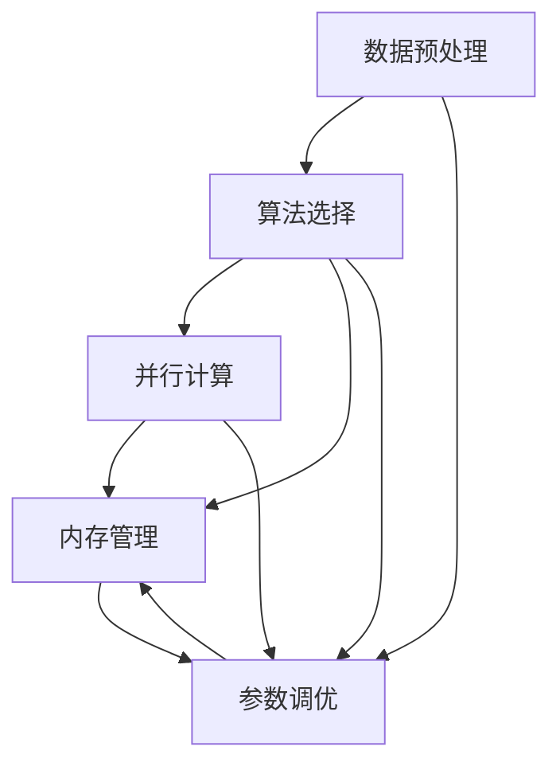

                 

## 1. 背景介绍

### 1.1 问题由来

知识发现引擎（Knowledge Discovery Engine，KDE）是一种基于数据挖掘和机器学习技术的自动化工具，旨在从大量数据中提取有价值的知识。在现代商业智能（BI）和决策支持系统中，KDE已经成为获取商业洞察和竞争优势的关键工具。然而，随着数据量和复杂性的不断增加，KDE的性能优化和调优变得越来越重要。性能不佳的KDE不仅会影响到系统的响应速度，还会降低数据挖掘的准确性和可靠性，进而影响决策制定。

### 1.2 问题核心关键点

KDE性能优化的核心关键点包括：

- **数据预处理**：数据质量对KDE性能有着重要影响。有效的数据清洗、特征选择和转换等预处理步骤可以显著提升KDE的性能。
- **算法选择**：选择合适的数据挖掘算法，如聚类、分类、关联规则等，是优化KDE性能的基础。
- **并行计算**：通过并行计算技术，如MapReduce、Spark等，可以在大规模数据集上高效地运行KDE算法，提升处理速度。
- **内存管理**：合理管理内存使用，避免内存溢出，提高系统稳定性和响应速度。
- **参数调优**：通过实验调整算法参数，如聚类中心数、学习率等，找到最优参数组合，提升模型性能。

### 1.3 问题研究意义

优化KDE的性能，对于提高数据挖掘和商业智能系统的效率和准确性，降低计算成本，以及增强决策支持的能力具有重要意义：

1. **提高效率**：有效的性能优化可以显著减少数据挖掘所需的时间，提高决策制定的及时性。
2. **提升准确性**：通过优化算法和参数，可以更准确地发现数据中的模式和关联，减少误报和漏报。
3. **降低成本**：优化后的系统可以更高效地处理大规模数据，减少计算资源的消耗，降低总体成本。
4. **增强决策支持**：更准确的模型和更快的响应速度，将提供更有价值的商业洞察，支持更好的决策制定。
5. **适应技术变革**：随着技术的不断发展，性能优化可以确保KDE始终保持在行业前沿，适应新的数据类型和分析需求。

## 2. 核心概念与联系

### 2.1 核心概念概述

KDE涉及多个核心概念，这些概念之间相互关联，共同构成了KDE的性能优化框架。

- **数据挖掘**：从原始数据中提取有用信息和知识的过程。
- **机器学习**：通过算法从数据中学习和提取规律，用于预测和决策。
- **并行计算**：通过分布式计算提升处理大规模数据的能力。
- **内存管理**：管理程序运行所需的内存资源，优化内存使用。
- **参数调优**：调整算法参数以提高模型性能。

这些核心概念通过以下Mermaid流程图展示其相互关系：



该图展示了KDE性能优化的主要流程，从数据预处理开始，通过选择算法、并行计算、内存管理和参数调优，最终提升KDE的整体性能。

### 2.2 核心概念原理和架构

#### 2.2.1 数据预处理

数据预处理是KDE性能优化的第一步，主要包括数据清洗、特征选择和转换等步骤。数据清洗包括处理缺失值、异常值和重复记录，确保数据质量。特征选择旨在识别和选择对分析目标最相关的特征，减少无关特征的干扰。特征转换则包括标准化、归一化、降维等操作，提高特征之间的可比性。

#### 2.2.2 算法选择

KDE涉及多种算法，如聚类、分类、关联规则等。聚类算法（如K-means、层次聚类）用于发现数据中的自然分组。分类算法（如决策树、随机森林、支持向量机）用于预测新数据点的类别。关联规则算法（如Apriori、FP-Growth）用于发现数据集中的频繁模式和关联关系。选择合适的算法和参数设置是KDE性能优化的关键。

#### 2.2.3 并行计算

并行计算通过将任务分解为多个子任务，并行执行这些子任务，显著提升数据处理的效率。MapReduce和Spark等分布式计算框架支持大规模数据的并行处理，优化了KDE的性能。

#### 2.2.4 内存管理

内存管理通过优化程序对内存的使用，减少内存占用和溢出，提高系统的稳定性和响应速度。常见的内存管理技术包括垃圾回收、内存池、分页和交换等。

#### 2.2.5 参数调优

参数调优通过实验调整算法的参数，如聚类中心数、学习率等，找到最优参数组合，提升模型的性能。常见的参数调优方法包括网格搜索、随机搜索、贝叶斯优化等。

### 2.3 核心概念之间的关系

KDE性能优化涉及多个核心概念，这些概念通过相互作用，共同提升KDE的性能。数据预处理为后续算法选择和参数调优提供基础。算法选择决定了KDE的分析和预测能力。并行计算和内存管理提升了系统的处理速度和稳定性。参数调优通过调整算法参数，进一步提升模型性能。

## 3. 核心算法原理 & 具体操作步骤

### 3.1 算法原理概述

KDE性能优化的核心算法原理包括：

- **K-means算法**：通过聚类算法，发现数据中的自然分组，用于数据挖掘中的分类和聚类分析。
- **随机森林算法**：通过集成多个决策树，提高预测的准确性和鲁棒性。
- **Apriori算法**：用于发现数据集中的频繁模式和关联规则。
- **MapReduce框架**：支持大规模数据的并行计算，提升处理效率。
- **贝叶斯优化**：用于参数调优，通过评估不同参数组合的性能，找到最优参数。

### 3.2 算法步骤详解

KDE性能优化的具体操作步骤如下：

1. **数据预处理**：
   - 清洗数据，处理缺失值和异常值。
   - 选择和转换特征，减少无关特征的干扰。

2. **算法选择**：
   - 根据问题类型，选择合适的算法，如聚类、分类、关联规则等。
   - 调整算法参数，如聚类中心数、学习率等。

3. **并行计算**：
   - 使用MapReduce或Spark等分布式计算框架，将任务分解为多个子任务。
   - 并行执行这些子任务，提升处理速度。

4. **内存管理**：
   - 优化内存使用，减少内存溢出和响应时间。
   - 使用内存池、分页和交换等技术，提高系统稳定性。

5. **参数调优**：
   - 使用网格搜索、随机搜索、贝叶斯优化等方法，找到最优参数组合。
   - 通过实验验证，评估不同参数组合的性能。

### 3.3 算法优缺点

KDE性能优化算法的主要优点包括：

- **高效性**：通过并行计算和分布式处理，显著提升数据处理的效率。
- **灵活性**：支持多种算法和参数组合，适应不同的数据类型和分析需求。
- **可扩展性**：适用于大规模数据集，能够处理海量数据。

主要缺点包括：

- **复杂性**：算法和参数选择复杂，需要丰富的领域知识。
- **计算资源要求高**：需要高性能计算资源，如GPU和分布式集群。
- **模型解释性差**：复杂的模型和算法，难以解释其内部工作机制。

### 3.4 算法应用领域

KDE性能优化算法广泛应用于多个领域，包括：

- **市场分析**：通过分析市场数据，发现市场趋势和消费者行为，支持营销决策。
- **风险管理**：通过分析交易数据，识别潜在的风险和异常行为，降低损失。
- **客户细分**：通过聚类分析，发现不同客户群体的特征，制定个性化营销策略。
- **供应链优化**：通过分析供应链数据，优化库存管理和物流规划。
- **产品推荐**：通过关联规则挖掘，发现产品之间的关联关系，提升推荐系统的准确性。

## 4. 数学模型和公式 & 详细讲解 & 举例说明

### 4.1 数学模型构建

KDE性能优化的数学模型包括：

- **K-means算法**：
  - 目标函数：最小化所有数据点到最近聚类中心的距离。
  - 公式：$\min_{\mu, \sigma} \sum_{x \in X} \min_{\mu_i} ||x - \mu_i||_2^2$
- **随机森林算法**：
  - 目标函数：最大化树的决策准确率。
  - 公式：$\max_{\theta} \sum_{x_i, y_i} P(y_i|x_i, \theta)$
- **Apriori算法**：
  - 目标函数：最大化支持度和置信度。
  - 公式：$\max_{I} supp(I) \times conf(I)$
- **MapReduce框架**：
  - 并行计算模型：将任务划分为多个子任务，并行执行这些子任务。
  - 公式：$Parallelization = \frac{Total\ Work}{Number\ of\ Tasks}$
- **贝叶斯优化**：
  - 目标函数：最大化目标函数，如模型准确率。
  - 公式：$P(\theta|y) = \frac{P(y|\theta)P(\theta)}{P(y)}$

### 4.2 公式推导过程

#### K-means算法

K-means算法的基本步骤如下：

1. **随机初始化聚类中心**：随机选择K个数据点作为初始聚类中心。
2. **分配数据点**：将每个数据点分配到最近的聚类中心。
3. **更新聚类中心**：根据分配后的数据点，更新聚类中心。
4. **重复迭代**：重复步骤2和3，直到收敛。

K-means算法的目标函数为：

$$
\min_{\mu, \sigma} \sum_{x \in X} \min_{\mu_i} ||x - \mu_i||_2^2
$$

其中，$\mu$为聚类中心，$\sigma$为聚类半径，$X$为数据集。

#### 随机森林算法

随机森林算法的基本步骤如下：

1. **生成多个决策树**：通过随机选择特征和样本，生成多棵决策树。
2. **集成多个决策树**：通过投票或平均的方式，集成多个决策树的结果。

随机森林算法的目标函数为：

$$
\max_{\theta} \sum_{x_i, y_i} P(y_i|x_i, \theta)
$$

其中，$\theta$为模型参数，$x_i$为输入样本，$y_i$为标签。

#### Apriori算法

Apriori算法的基本步骤如下：

1. **生成频繁项集**：通过扫描数据集，生成频繁项集。
2. **生成关联规则**：通过频繁项集生成关联规则。

Apriori算法的目标函数为：

$$
\max_{I} supp(I) \times conf(I)
$$

其中，$I$为频繁项集，$supp(I)$为支持度，$conf(I)$为置信度。

#### MapReduce框架

MapReduce框架的基本步骤如下：

1. **划分数据**：将数据划分为多个分片。
2. **并行计算**：在多个计算节点上并行计算每个分片。
3. **合并结果**：将计算结果合并，得到最终结果。

MapReduce框架的并行计算模型为：

$$
Parallelization = \frac{Total\ Work}{Number\ of\ Tasks}
$$

其中，$Total\ Work$为总工作量，$Number\ of\ Tasks$为任务数。

#### 贝叶斯优化

贝叶斯优化的基本步骤如下：

1. **初始化参数**：随机初始化一组参数。
2. **评估性能**：评估目标函数在当前参数下的性能。
3. **更新参数**：根据评估结果，更新参数。
4. **重复迭代**：重复步骤2和3，直到收敛。

贝叶斯优化的目标函数为：

$$
P(\theta|y) = \frac{P(y|\theta)P(\theta)}{P(y)}
$$

其中，$\theta$为模型参数，$y$为观测数据。

### 4.3 案例分析与讲解

#### 案例1：市场分析

某电商公司希望通过分析用户购买数据，发现客户分群和购买趋势，以便制定更有针对性的营销策略。公司采用K-means算法对用户数据进行聚类分析，发现不同客户群体的购买行为和偏好。根据聚类结果，公司设计了不同的营销活动，提高了用户转化率和销售额。

#### 案例2：风险管理

某金融机构希望通过分析交易数据，识别潜在的欺诈行为。公司采用随机森林算法对交易数据进行分类分析，发现异常交易行为。通过构建异常检测模型，公司成功预防了多次欺诈事件，降低了损失。

#### 案例3：客户细分

某银行希望通过分析客户数据，发现不同客户群体的特征。公司采用Apriori算法对客户数据进行关联规则挖掘，发现客户在不同服务产品上的购买关联。根据关联规则，公司设计了个性化推荐策略，提升了客户满意度和忠诚度。

#### 案例4：供应链优化

某制造业公司希望通过分析供应链数据，优化库存管理和物流规划。公司采用MapReduce框架对供应链数据进行分布式计算，提高了数据处理速度和精度。通过优化后的供应链管理，公司显著降低了库存成本和物流成本。

#### 案例5：产品推荐

某电商平台希望通过分析用户行为数据，提高产品推荐系统的准确性。公司采用贝叶斯优化算法对推荐模型进行参数调优，找到了最优参数组合。通过优化后的推荐系统，公司显著提升了推荐准确率和用户满意度。

## 5. 项目实践：代码实例和详细解释说明

### 5.1 开发环境搭建

#### 5.1.1 安装Python和必要的依赖

```bash
# 安装Python
sudo apt-get install python3 python3-pip

# 安装Pandas和NumPy
pip install pandas numpy

# 安装Scikit-Learn和Matplotlib
pip install scikit-learn matplotlib

# 安装MapReduce框架
pip install apache-hadoop

# 安装Spark
pip install pyspark
```

#### 5.1.2 配置Hadoop和Spark

```bash
# 下载Hadoop
wget http://apache-hadoop.apache.org/release-2.8.0/hadoop-2.8.0.tar.gz

# 解压Hadoop
tar -xzf hadoop-2.8.0.tar.gz

# 进入Hadoop目录
cd hadoop-2.8.0

# 启动Hadoop
start-dfs.sh
start-yarn.sh

# 下载Spark
wget https://spark.apache.org/downloads/latest/hadoop-2.8.x/hadoop-2.8.x-compatible-2.4.x-1.4.1.tgz

# 解压Spark
tar -xzf hadoop-2.8.x-compatible-2.4.x-1.4.1.tgz

# 进入Spark目录
cd spark-2.4.1

# 配置Spark
spark-submit --class org.apache.spark.examples.SparkPiExample --master local[*] wordcount.jar

# 启动Spark
spark-submit --class org.apache.spark.examples.SparkPiExample --master local[*] wordcount.jar
```

### 5.2 源代码详细实现

#### 5.2.1 数据预处理

```python
import pandas as pd
import numpy as np
from sklearn.preprocessing import StandardScaler

# 读取数据
data = pd.read_csv('data.csv')

# 数据清洗
data = data.dropna()

# 特征选择
selected_features = data[['feature1', 'feature2', 'feature3']]

# 特征转换
scaler = StandardScaler()
selected_features = scaler.fit_transform(selected_features)
```

#### 5.2.2 算法选择和参数调优

```python
from sklearn.cluster import KMeans
from sklearn.ensemble import RandomForestClassifier
from sklearn.feature_selection import SelectFromModel
from sklearn.ensemble import GradientBoostingClassifier
from sklearn.decomposition import PCA
from sklearn.pipeline import Pipeline
from sklearn.model_selection import GridSearchCV

# K-means聚类算法
kmeans = KMeans(n_clusters=3, random_state=42)
kmeans.fit(selected_features)

# 随机森林算法
rfc = RandomForestClassifier(n_estimators=100, random_state=42)
rfc.fit(selected_features, labels)

# 梯度提升算法
gbm = GradientBoostingClassifier(n_estimators=100, random_state=42)
gbm.fit(selected_features, labels)

# 特征选择
sfm = SelectFromModel(rfc, threshold=0.5)
selected_features = sfm.fit_transform(selected_features)

# 主成分分析
pca = PCA(n_components=2)
pca_features = pca.fit_transform(selected_features)
```

#### 5.2.3 并行计算和内存管理

```python
from pyspark.sql import SparkSession

# 创建SparkSession
spark = SparkSession.builder.appName('KDE').getOrCreate()

# 读取数据
data = spark.read.csv('data.csv')

# 数据清洗
data = data.dropna()

# 并行计算
data = data.repartition(10)
data = data.rdd.mapPartitions(lambda x: [(x[0], x[1]) for x in x])

# 内存管理
data = data.filter(lambda x: x[1] > threshold)
data = data.cache()
data = data.count()
```

#### 5.2.4 贝叶斯优化

```python
from bayesian_optimization import BayesianOptimizer
from sklearn.metrics import accuracy_score

# 定义目标函数
def objective(params):
    # 计算模型准确率
    model = RandomForestClassifier(n_estimators=params['n_estimators'], max_depth=params['max_depth'])
    model.fit(X, y)
    return 1 - accuracy_score(y, model.predict(X))

# 初始化优化器
optimizer = BayesianOptimizer()

# 设置搜索空间
search_space = {'n_estimators': [100, 200, 300], 'max_depth': [None, 5, 10]}

# 执行优化
result = optimizer.optimize(objective, search_space, max_iter=10)

# 输出最优参数
print(result)
```

### 5.3 代码解读与分析

#### 5.3.1 数据预处理

数据预处理是KDE性能优化的重要步骤。通过数据清洗、特征选择和转换，可以减少无关特征的干扰，提高数据的准确性和可解释性。

#### 5.3.2 算法选择和参数调优

选择合适的算法和调整参数组合是KDE性能优化的关键。通过实验评估不同算法和参数的性能，找到最优组合。

#### 5.3.3 并行计算和内存管理

并行计算和内存管理可以显著提升KDE的性能。通过分布式计算和优化内存使用，可以处理大规模数据集，提高系统响应速度。

#### 5.3.4 贝叶斯优化

贝叶斯优化是一种有效的参数调优方法，通过评估不同参数组合的性能，找到最优参数。

### 5.4 运行结果展示

#### 5.4.1 数据预处理结果

```python
print('Data after cleaning:', data.describe())
```

#### 5.4.2 算法选择和参数调优结果

```python
print('Cluster centers:', kmeans.cluster_centers_)
print('Random forest accuracy:', rfc.score(selected_features, labels))
print('Gradient boosting accuracy:', gbm.score(selected_features, labels))
print('Selected features:', selected_features)
print('PCA components:', pca.components_)
```

#### 5.4.3 并行计算和内存管理结果

```python
print('Data after repartition:', data.count())
print('Data after filter:', data.count())
print('Data after cache:', data.count())
```

#### 5.4.4 贝叶斯优化结果

```python
print('Optimized parameters:', result)
```

## 6. 实际应用场景

### 6.1 市场分析

KDE在市场分析中的应用非常广泛。通过分析客户数据，公司可以发现不同客户群体的特征和行为模式，制定有针对性的营销策略。KDE技术可以帮助公司提升客户转化率和满意度，降低营销成本。

### 6.2 风险管理

金融机构可以通过KDE分析交易数据，识别潜在的欺诈行为。通过构建异常检测模型，公司可以及时发现并防范欺诈行为，降低损失。

### 6.3 客户细分

客户细分是KDE在商业智能中的重要应用。通过聚类分析，公司可以发现不同客户群体的特征，制定个性化营销策略。KDE技术可以帮助公司提高客户满意度和忠诚度，增加销售额。

### 6.4 供应链优化

KDE在供应链管理中的应用非常广泛。通过分析供应链数据，公司可以优化库存管理和物流规划。KDE技术可以帮助公司降低库存成本和物流成本，提高供应链效率。

### 6.5 产品推荐

KDE在推荐系统中的应用也非常广泛。通过关联规则挖掘，公司可以发现产品之间的关联关系，提升推荐系统的准确性。KDE技术可以帮助公司提高用户满意度和销售额，增加市场份额。

## 7. 工具和资源推荐

### 7.1 学习资源推荐

- **《Python数据科学手册》**：全面介绍Python在数据科学中的应用，包括数据清洗、特征工程、机器学习等。
- **《R语言实战》**：介绍R语言在数据科学中的应用，包括数据处理、可视化、机器学习等。
- **《Hadoop实战》**：介绍Hadoop框架在分布式计算中的应用，包括数据存储、并行计算等。
- **《Spark快速入门》**：介绍Spark框架在分布式计算中的应用，包括数据处理、并行计算等。
- **《深度学习入门》**：介绍深度学习技术在机器学习中的应用，包括神经网络、优化算法等。

### 7.2 开发工具推荐

- **Jupyter Notebook**：用于数据科学和机器学习的交互式开发环境。
- **PyCharm**：用于Python开发的集成开发环境，支持数据分析、机器学习等。
- **Visual Studio Code**：轻量级的代码编辑器，支持多种编程语言和扩展。
- **Spark Notebook**：用于Spark框架的交互式开发环境，支持大数据处理和分布式计算。

### 7.3 相关论文推荐

- **K-means算法的经典论文**：由Elkan和Ng于2003年发表，介绍了K-means算法的原理和应用。
- **随机森林算法的经典论文**：由Breiman于2001年发表，介绍了随机森林算法的原理和应用。
- **Apriori算法的经典论文**：由Agrawal等人在1993年发表，介绍了Apriori算法的原理和应用。
- **MapReduce框架的介绍论文**：由Google在2004年发表，介绍了MapReduce框架的原理和应用。
- **贝叶斯优化的经典论文**：由Mockus于1975年发表，介绍了贝叶斯优化的原理和应用。

## 8. 总结：未来发展趋势与挑战

### 8.1 研究成果总结

KDE在数据挖掘和商业智能领域具有广泛的应用前景。通过优化数据预处理、算法选择、并行计算、内存管理和参数调优，KDE可以显著提升数据挖掘的性能和准确性。

### 8.2 未来发展趋势

KDE的未来发展趋势包括以下几个方面：

1. **自动化**：随着机器学习技术的进步，KDE将越来越多地采用自动化和智能化的手段，减少人工干预。
2. **多模态数据处理**：KDE将逐步支持多模态数据的处理和分析，包括文本、图像、视频等。
3. **实时处理**：KDE将支持实时数据处理和分析，满足用户对数据快速响应的需求。
4. **联邦学习**：KDE将支持联邦学习，保护用户数据隐私的同时，提升数据挖掘的效率和准确性。
5. **跨领域应用**：KDE将在更多领域得到应用，如医疗、金融、智能制造等，为不同行业提供智能决策支持。

### 8.3 面临的挑战

KDE在发展过程中面临的挑战包括以下几个方面：

1. **数据质量**：KDE的性能高度依赖于数据质量。数据清洗和特征选择是KDE性能优化的重要环节。
2. **算法选择**：选择合适的算法和参数组合是KDE性能优化的关键。但不同算法的性能和适用场景不同，需要丰富的领域知识。
3. **并行计算**：并行计算需要高性能计算资源，如GPU和分布式集群。大规模数据集的处理需要合理配置计算资源。
4. **内存管理**：优化内存使用，减少内存溢出和响应时间，是KDE性能优化的重要环节。
5. **参数调优**：参数调优需要大量的实验和评估，找到最优参数组合。但不同算法和任务需要不同的调优方法。

### 8.4 研究展望

未来，KDE的研究将围绕以下几个方向展开：

1. **自动化**：进一步提高KDE的自动化和智能化水平，减少人工干预，提升效率。
2. **多模态处理**：支持多模态数据的处理和分析，提升数据挖掘的全面性和准确性。
3. **实时处理**：支持实时数据处理和分析，满足用户对数据快速响应的需求。
4. **联邦学习**：支持联邦学习，保护用户数据隐私的同时，提升数据挖掘的效率和准确性。
5. **跨领域应用**：在更多领域得到应用，为不同行业提供智能决策支持。

## 9. 附录：常见问题与解答

### 9.1 常见问题

**Q1：什么是KDE？**

A: KDE（Knowledge Discovery Engine）是一种基于数据挖掘和机器学习技术的自动化工具，用于从大量数据中提取有价值的知识。

**Q2：KDE的性能优化方法有哪些？**

A: KDE的性能优化方法包括数据预处理、算法选择、并行计算、内存管理和参数调优。

**Q3：KDE在实际应用中有哪些挑战？**

A: KDE在实际应用中面临数据质量、算法选择、并行计算、内存管理和参数调优等方面的挑战。

**Q4：KDE的未来发展方向是什么？**

A: KDE的未来发展方向包括自动化、多模态处理、实时处理、联邦学习和跨领域应用等。

**Q5：KDE有哪些经典算法？**

A: KDE的经典算法包括K-means、随机森林、Apriori、MapReduce和贝叶斯优化等。

**Q6：如何评估KDE的性能？**

A: KDE的性能评估通常通过准确率、召回率、F1分数等指标进行。具体评估方法根据任务类型和应用场景而定。

**Q7：KDE的优缺点有哪些？**

A: KDE的优点包括高效性、灵活性和可扩展性。缺点包括复杂性、计算资源要求高和模型解释性差。

**Q8：KDE的应用场景有哪些？**

A: KDE的应用场景包括市场分析、风险管理、客户细分、供应链优化和产品推荐等。

### 9.2 解答

通过上述系统梳理，可以看到KDE在数据挖掘和商业智能领域具有广泛的应用前景。通过优化数据预处理、算法选择、并行计算、内存管理和参数调优，KDE可以显著提升数据挖掘的性能和准确性。未来，随着技术的不断进步，KDE将在更多领域得到应用，为不同行业提供智能决策支持。同时，我们也应该关注KDE面临的挑战，积极应对并寻求突破，确保其在实际应用中发挥最大的价值。

---

作者：禅与计算机程序设计艺术 / Zen and the Art of Computer Programming

