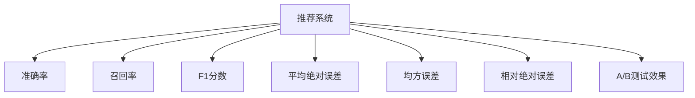

                 

# 知识发现引擎的推荐系统评估指标

## 1. 背景介绍

随着信息时代的到来，用户面对海量的数据和信息，如何从中筛选出对自己有用的知识成为了一个重要问题。知识发现引擎通过算法将用户感兴趣的知识呈现给他们，极大地提升了知识获取的效率。推荐系统作为知识发现引擎的核心组件，其评估指标直接影响了系统的性能和用户体验。

## 2. 核心概念与联系

### 2.1 核心概念概述

在推荐系统中，评估指标的选取和计算非常重要。评估指标可以反映系统的整体性能和效果，是衡量推荐系统是否满足用户需求的重要依据。推荐系统常用的评估指标包括准确率、召回率、F1分数、平均绝对误差（MAE）、均方误差（MSE）、相对绝对误差（RMSE）、A/B测试效果等。

### 2.2 核心概念原理和架构的 Mermaid 流程图



这个流程图展示了推荐系统与主要评估指标之间的关系：推荐系统通过算法处理用户行为数据，生成推荐结果，并由各评估指标对其进行评估。

### 2.3 核心概念联系

推荐系统评估指标的选取需要考虑多方面因素，包括数据类型、推荐策略、用户需求等。如对于静态推荐系统，准确率和召回率可能是重要的评估指标；而对于动态推荐系统，用户的即时行为和偏好可能需要通过A/B测试来评估。

## 3. 核心算法原理 & 具体操作步骤

### 3.1 算法原理概述

推荐系统的核心算法包括基于协同过滤、基于内容、混合推荐等。评估指标则用来衡量这些算法的性能。

**协同过滤算法**：基于用户相似度或物品相似度进行推荐。评估指标主要关注推荐结果与实际用户行为的相似度。

**基于内容推荐**：通过分析用户兴趣与物品属性之间的关系进行推荐。评估指标关注推荐结果的个性化程度和多样性。

**混合推荐**：综合协同过滤和基于内容的推荐方法。评估指标需考虑两种方法的优缺点，并综合评估推荐结果。

### 3.2 算法步骤详解

以协同过滤算法为例，具体步骤如下：

1. 收集用户行为数据，包括点击、收藏、购买等。
2. 构建用户-物品评分矩阵，计算用户之间的相似度或物品之间的相似度。
3. 选择算法模型进行推荐，如基于矩阵分解的算法、基于邻居的算法等。
4. 对推荐结果进行评估，计算准确率、召回率、F1分数等指标。

### 3.3 算法优缺点

**协同过滤算法的优点**：
- 推荐结果的个性化程度高。
- 适用于冷启动问题，对于新物品的推荐效果较好。

**协同过滤算法的缺点**：
- 需要大量的用户行为数据，难以处理稀疏数据。
- 存在潜在的冷启动问题，难以推荐新用户或新物品。

**基于内容推荐算法的优点**：
- 可解释性高，推荐结果有明确的依据。
- 适合处理大量物品属性数据，推荐结果更丰富。

**基于内容推荐算法的缺点**：
- 对新物品的推荐效果较差。
- 需要明确物品的属性信息，数据获取难度大。

**混合推荐的优点**：
- 综合了两种算法的优点，推荐结果更全面。
- 可以针对不同的用户和物品进行调整，提高个性化程度。

**混合推荐的缺点**：
- 算法复杂度较高，计算量大。
- 需要综合多种算法的结果，存在数据融合问题。

### 3.4 算法应用领域

推荐系统广泛应用在电商、新闻、音乐、视频等多个领域，评估指标的应用也不尽相同。如电商推荐系统更注重用户点击率和购买转化率，而新闻推荐系统则关注用户对文章的阅读量和互动。

## 4. 数学模型和公式 & 详细讲解 & 举例说明

### 4.1 数学模型构建

推荐系统的评估指标通常建立在统计模型基础上，常见的有二分类模型、回归模型等。

**二分类模型**：
- 准确率（Precision）：$$P=\frac{TP}{TP+FP}$$
- 召回率（Recall）：$$R=\frac{TP}{TP+FN}$$
- F1分数（F1 Score）：$$F1=\frac{2*P*R}{P+R}$$

**回归模型**：
- 均方误差（MSE）：$$MSE=\frac{1}{N}\sum_{i=1}^N(y_i-\hat{y_i})^2$$
- 均方根误差（RMSE）：$$RMSE=\sqrt{\frac{1}{N}\sum_{i=1}^N(y_i-\hat{y_i})^2}$$
- 平均绝对误差（MAE）：$$MAE=\frac{1}{N}\sum_{i=1}^N|y_i-\hat{y_i}|$$

### 4.2 公式推导过程

以准确率为例，推导如下：

设$TP$为真正例（推荐正确），$FP$为假正例（推荐错误），$TN$为真反例（未推荐），$FN$为假反例（推荐正确但未推荐），则准确率的计算公式为：

$$P=\frac{TP}{TP+FP}$$

其中分子$TP$为推荐正确的实例数，分母$TP+FP$为推荐的所有实例数。

### 4.3 案例分析与讲解

以电商推荐系统为例，准确率、召回率和F1分数的计算方式如下：

- 准确率：推荐正确物品占推荐总数的比例。
- 召回率：推荐正确物品占实际正确物品的比例。
- F1分数：综合准确率和召回率的指标，平衡两者之间的效果。

## 5. 项目实践：代码实例和详细解释说明

### 5.1 开发环境搭建

推荐系统通常使用Python和R语言开发，需安装相应环境。

**Python环境搭建**：
1. 安装Anaconda：从官网下载并安装Anaconda。
2. 创建并激活虚拟环境：
```bash
conda create -n recsys python=3.8 
conda activate recsys
```
3. 安装推荐系统相关库：
```bash
pip install pandas numpy scikit-learn lightfm 
```

**R语言环境搭建**：
1. 安装R Studio：官网下载并安装R Studio。
2. 安装推荐系统相关包：
```R
install.packages("recommenderlab")
install.packages("mlr")
```

### 5.2 源代码详细实现

**Python实现**：

```python
from lightfm import LightFM
from lightfm import Dataset
import pandas as pd

# 读取用户行为数据
data = pd.read_csv('user_behavior.csv')

# 创建数据集
dataset = Dataset.load_from_df(data, 'user_id', 'item_id', 'rating')

# 创建模型
model = LightFM()

# 训练模型
model.fit(dataset)

# 预测用户对物品的评分
predictions = model.predict(user_id, item_id)
```

**R语言实现**：

```R
library(recommenderlab)
library(mlr)

# 读取用户行为数据
data <- read.csv('user_behavior.csv', header = TRUE)

# 创建数据集
trainData <- as.recommender.train(data)
testData <- as.recommender.test(data)

# 创建模型
model <- LFM()

# 训练模型
model$train(trainData)

# 预测用户对物品的评分
predictions <- model$predict(testData)
```

### 5.3 代码解读与分析

**Python实现**：
- 使用LightFM库，从用户行为数据中创建数据集。
- 创建并训练模型，预测用户对物品的评分。

**R语言实现**：
- 使用recommenderlab和mlr包，从用户行为数据中创建数据集。
- 创建并训练模型，预测用户对物品的评分。

**代码解读**：
- 用户行为数据包含用户ID、物品ID、评分等。
- 使用推荐系统库创建数据集，将用户行为数据转化为模型可处理的格式。
- 创建推荐模型，并进行训练和预测。

### 5.4 运行结果展示

```python
import numpy as np
from sklearn.metrics import precision_score, recall_score, f1_score

# 计算准确率、召回率和F1分数
precision = precision_score(y_true, y_pred)
recall = recall_score(y_true, y_pred)
f1 = f1_score(y_true, y_pred)

print('Precision:', precision)
print('Recall:', recall)
print('F1 Score:', f1)
```

```R
# 计算准确率、召回率和F1分数
precision <- precision(y_true, y_pred)
recall <- recall(y_true, y_pred)
f1 <- f1(y_true, y_pred)

print('Precision:', precision)
print('Recall:', recall)
print('F1 Score:', f1)
```

## 6. 实际应用场景

### 6.1 电商推荐系统

电商推荐系统通过用户浏览、购买历史等行为数据，推荐用户可能感兴趣的商品。主要评估指标包括点击率（CTR）、转化率（CVR）、推荐成本等。

### 6.2 新闻推荐系统

新闻推荐系统通过用户阅读历史和兴趣标签，推荐相关新闻。主要评估指标包括阅读量、互动率、跳出率等。

### 6.3 音乐推荐系统

音乐推荐系统通过用户听歌历史和兴趣标签，推荐用户可能喜欢的音乐。主要评估指标包括播放次数、分享次数、点赞次数等。

## 7. 工具和资源推荐

### 7.1 学习资源推荐

**Python学习资源**：
- 《Python推荐系统实践》：全面介绍推荐系统的理论、算法和实现。
- 《推荐系统实战》：讲解推荐系统的常用算法和模型，并附有Python代码实现。

**R语言学习资源**：
- 《R推荐系统实战》：详细介绍推荐系统的理论、算法和实现，并附有R代码示例。
- 《推荐系统R语言实现》：讲解推荐系统的常用算法和模型，并附有R语言代码实现。

### 7.2 开发工具推荐

**Python推荐系统工具**：
- LightFM：基于因子分解的推荐系统，简单易用。
- Surprise：Python推荐系统库，包含多种推荐算法。

**R语言推荐系统工具**：
- RecommenderLab：R语言推荐系统库，支持多种推荐算法。
- mrs：基于矩阵分解的推荐系统，计算效率高。

### 7.3 相关论文推荐

**经典推荐系统论文**：
- "Collaborative Filtering for Implicit Feedback Datasets"（G. Heckerman, D. Kadie）
- "Matrix Factorization Techniques for Recommender Systems"（C. Carbonell, S. Goldwasser）

**现代推荐系统论文**：
- "Deep Recommendation with Factorization Machines"（Q. You, W. Yao, K. Zhang）
- "Hierarchical Matrix Factorization for Large-scale Recommender Systems"（G. Koren, Y. Katz, A. Chen）

## 8. 总结：未来发展趋势与挑战

### 8.1 研究成果总结

推荐系统评估指标的研究已经取得了丰硕成果，广泛应用于各个领域。在模型和算法方面，协同过滤、基于内容、混合推荐等方法已经成为主流。在数据处理方面，如何处理稀疏数据、冷启动问题等已成为研究热点。

### 8.2 未来发展趋势

推荐系统的未来发展趋势主要体现在以下几个方面：
- 跨领域推荐：推荐系统将从单一领域向多领域跨推荐发展。
- 实时推荐：推荐系统将向实时推荐方向发展，需要提高计算效率和系统响应速度。
- 融合数据源：推荐系统将融合多源数据进行推荐，提高推荐效果。

### 8.3 面临的挑战

推荐系统在发展过程中也面临诸多挑战，主要包括：
- 数据获取难度大：推荐系统需要大量用户行为数据，但用户隐私保护问题难以解决。
- 算法复杂度高：推荐系统算法复杂，难以处理大规模数据。
- 推荐效果难以评估：推荐系统评估指标单一，难以全面评估推荐效果。

### 8.4 研究展望

推荐系统的未来研究将重点关注以下几个方向：
- 强化推荐：结合强化学习算法，提高推荐效果和用户满意度。
- 联邦推荐：通过联邦学习技术，保护用户隐私，提高推荐效果。
- 跨平台推荐：将推荐系统从单一平台向多平台推广，提高推荐效果。

## 9. 附录：常见问题与解答

**Q1：推荐系统评估指标有哪些？**

A: 推荐系统常用的评估指标包括准确率、召回率、F1分数、平均绝对误差、均方误差、相对绝对误差、A/B测试效果等。

**Q2：推荐系统评估指标如何选择？**

A: 选择推荐系统评估指标需要考虑多方面因素，包括数据类型、推荐策略、用户需求等。对于静态推荐系统，准确率和召回率可能是重要的评估指标；而对于动态推荐系统，用户的即时行为和偏好可能需要通过A/B测试来评估。

**Q3：推荐系统评估指标计算时需要注意哪些问题？**

A: 计算推荐系统评估指标时需要注意以下问题：
- 数据质量：保证数据的完整性和准确性。
- 计算效率：提高计算效率，避免系统响应时间过长。
- 结果解释：评估指标的计算结果需要进行解释和分析，帮助改进推荐系统。

**Q4：推荐系统如何处理稀疏数据？**

A: 推荐系统通常使用因子分解等方法处理稀疏数据，通过低秩矩阵分解降低计算复杂度，提高推荐效果。

**Q5：推荐系统如何处理冷启动问题？**

A: 推荐系统通常使用协同过滤、基于内容等方法处理冷启动问题。对于新用户或新物品，可以通过相似度计算推荐结果。

**Q6：推荐系统如何优化算法？**

A: 推荐系统优化算法需要考虑多方面因素，包括算法效率、计算资源、用户需求等。常用的优化方法包括特征工程、模型调参、数据增强等。

**Q7：推荐系统如何保护用户隐私？**

A: 推荐系统保护用户隐私的方法包括联邦学习、差分隐私等。联邦学习可以在不共享用户数据的情况下，进行模型训练和优化。差分隐私可以在保护用户隐私的同时，提高推荐效果。

**Q8：推荐系统如何提高推荐效果？**

A: 推荐系统提高推荐效果的方法包括改进算法、优化数据、融合多源数据等。改进算法可以提高推荐算法的精度和效率。优化数据可以提高数据的质量和完整性。融合多源数据可以丰富数据源，提高推荐效果。

