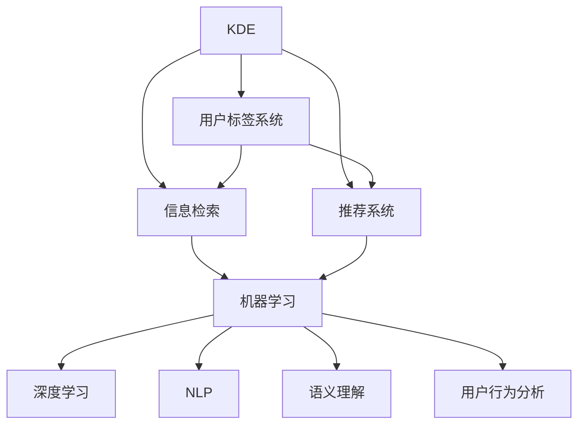

                 

# 知识发现引擎的用户标签系统设计

> 关键词：知识发现引擎,用户标签系统,信息检索,机器学习,深度学习,自然语言处理,语义理解,用户行为分析,推荐系统

## 1. 背景介绍

在当今的信息爆炸时代，知识发现引擎(Knowledge Discovery Engine, KDE)正逐渐成为企业和研究机构获取、组织和分析信息的关键工具。用户标签系统作为KDE的重要组成部分，其设计和实现对于提升信息检索、推荐和知识发现效果具有重要意义。本博客将深入探讨知识发现引擎的用户标签系统设计，从原理到实践，全方位剖析其核心技术和应用场景。

### 1.1 问题由来

随着互联网技术的迅猛发展，用户生成内容(User Generated Content, UGC)在各个领域呈现出爆炸式增长，如社交网络、电商平台、在线图书馆等。然而，如何从海量数据中高效提取有用的信息，并将其转化为可操作的知识，已成为各大企业面临的挑战。知识发现引擎通过整合和分析大量数据，帮助用户快速获取所需信息，从而在解决实际问题、提升工作效率等方面具有显著优势。

用户标签系统作为知识发现引擎的核心组件之一，能够反映用户对信息的理解和需求，通过标签将用户的查询意图与文本内容进行匹配，实现高效的信息检索和推荐。然而，现有的用户标签系统普遍存在以下问题：

- 用户标签的准确性和一致性不高。
- 用户标签的获取方式单一，缺乏用户行为数据的深度挖掘。
- 用户标签的管理和维护难度大，需要投入大量人力物力。
- 用户标签系统的个性化和智能化不足，难以满足复杂多样化的查询需求。

针对这些问题，本博客将提出一套新的用户标签系统设计方案，结合机器学习、深度学习和自然语言处理(NLP)等技术，实现更加高效、准确、智能的用户标签系统。

### 1.2 问题核心关键点

用户标签系统的核心设计目标在于：

- 提升用户标签的准确性和一致性，准确反映用户的查询意图。
- 深度挖掘用户行为数据，提供多维度的标签信息。
- 简化用户标签的管理和维护，降低运营成本。
- 实现用户标签的个性化和智能化，提高信息检索和推荐的效率和质量。

这些目标将指导我们在设计用户标签系统时，选择合适的技术方案，进行合理的系统架构设计，确保系统的高效稳定运行。

## 2. 核心概念与联系

### 2.1 核心概念概述

为更好地理解知识发现引擎的用户标签系统，本节将介绍几个关键概念：

- **知识发现引擎(KDE)**：通过分析和提取大量数据，发现隐藏在数据背后的知识，帮助用户解决实际问题的软件系统。
- **用户标签系统**：用于表示用户对信息的理解和需求，通过标签将用户的查询意图与文本内容进行匹配的系统。
- **信息检索**：根据用户查询，从大量文本数据中筛选出相关内容的过程。
- **推荐系统**：基于用户的历史行为和偏好，推荐用户可能感兴趣的信息。
- **机器学习**：通过训练数据，使模型自动学习和优化，实现自动化的信息处理。
- **深度学习**：一种基于多层神经网络的机器学习方法，能够处理高维度、复杂的数据结构。
- **自然语言处理(NLP)**：使计算机能够理解、处理和生成人类语言的技术。
- **语义理解**：通过分析文本内容，理解其背后的语义信息。
- **用户行为分析**：通过分析用户的操作和交互行为，揭示用户的偏好和需求。

这些概念之间的逻辑关系可以通过以下Mermaid流程图来展示：



这个流程图展示了几大关键组件之间的关系：

1. KDE通过用户标签系统、信息检索和推荐系统，为用户提供个性化、高效的知识发现服务。
2. 用户标签系统基于机器学习、深度学习和NLP等技术，提供准确、丰富的标签信息。
3. 信息检索和推荐系统利用用户标签系统的信息，实现高效的文本检索和推荐。

这些概念共同构成了知识发现引擎的核心功能模块，使其能够高效地帮助用户发现和利用知识。

## 3. 核心算法原理 & 具体操作步骤

### 3.1 算法原理概述

用户标签系统的设计基于以下核心算法原理：

- **用户行为分析**：通过分析用户的操作和交互行为，提取用户对信息的理解和需求，生成初步的用户标签。
- **标签关联推荐**：基于用户历史标签和行为，推荐相关标签，提高标签的丰富性和多样性。
- **多标签分类**：将用户标签进行多标签分类，通过统计方法，优化标签的分布。
- **深度学习训练**：使用深度学习模型，训练用户标签生成器，实现自动化标签生成和优化。

通过这些算法，用户标签系统能够自动生成、管理和优化标签，提升信息检索和推荐的准确性和效率。

### 3.2 算法步骤详解

用户标签系统的设计和实现主要分为以下几个关键步骤：

**Step 1: 数据预处理**

- 收集用户的行为数据，包括点击、搜索、浏览、收藏、评分等操作。
- 对数据进行清洗和标准化，去除噪声和异常值。
- 将数据进行特征提取，生成用户行为向量。

**Step 2: 用户行为分析**

- 使用协同过滤、用户画像等方法，提取用户对信息的理解和需求。
- 将用户行为向量转化为用户标签向量，生成初步的用户标签。

**Step 3: 标签关联推荐**

- 基于用户历史标签和行为，使用协同过滤、标签传播等算法，推荐相关标签。
- 将推荐标签与用户标签向量进行关联，生成多维度的标签信息。

**Step 4: 多标签分类**

- 使用统计方法，对用户标签进行多标签分类，优化标签的分布。
- 将分类后的标签向量转化为标准化的标签向量，便于后续处理。

**Step 5: 深度学习训练**

- 使用深度学习模型，如BERT、GPT等，训练用户标签生成器。
- 利用用户标签向量，训练生成器生成新的标签，并不断优化生成器参数。

**Step 6: 系统集成与评估**

- 将训练好的用户标签生成器集成到知识发现引擎中。
- 在测试集上评估用户标签系统的准确性和效果，根据评估结果调整系统参数。

以上是用户标签系统的核心设计流程。在实际应用中，还需要针对具体业务需求，对各步骤进行优化和调整，以实现更好的性能。

### 3.3 算法优缺点

用户标签系统的设计和实现有以下优点：

1. **自动化程度高**：利用机器学习和深度学习算法，自动生成和优化标签，减少人工干预。
2. **标签准确性高**：通过多维度的用户行为分析，生成更加准确和一致的标签。
3. **灵活性高**：标签关联推荐和分类算法，能够快速适应不同场景和用户需求。
4. **可扩展性好**：用户标签系统具有较高的可扩展性，支持海量数据的处理和分析。

同时，该系统也存在以下缺点：

1. **数据隐私问题**：用户行为数据的收集和处理可能涉及隐私问题，需要采取严格的隐私保护措施。
2. **算法复杂度高**：深度学习模型需要大量的计算资源和时间，可能影响系统的实时性。
3. **模型鲁棒性不足**：用户标签系统的效果受数据质量和算法的鲁棒性影响较大。
4. **多标签冲突问题**：多标签分类算法可能面临标签冲突问题，需要优化标签生成和过滤算法。

尽管存在这些局限性，但用户标签系统在大规模知识发现引擎中的应用前景广阔，其设计和实现还需进一步优化和提升。

### 3.4 算法应用领域

用户标签系统在知识发现引擎中的应用非常广泛，以下是几个典型的应用场景：

- **信息检索**：利用用户标签系统，实现高效的文本检索和推荐，提高检索的准确性和召回率。
- **推荐系统**：通过用户标签，为用户推荐可能感兴趣的内容，提升推荐效果。
- **用户画像**：基于用户行为分析，构建详细的用户画像，用于个性化推荐和广告投放。
- **知识发现**：利用用户标签系统，挖掘隐藏在数据背后的知识，提升知识发现的能力。
- **内容聚合**：将用户对不同信息的关注点进行分类聚合，形成专题和摘要，便于用户快速浏览和理解。

以上场景展示了用户标签系统在知识发现引擎中的多样应用，通过标签的合理设计和应用，可以实现高效的信息检索和推荐，提升用户的满意度。

## 4. 数学模型和公式 & 详细讲解 & 举例说明

### 4.1 数学模型构建

用户标签系统基于以下数学模型进行设计和实现：

- **用户行为向量**：将用户的行为数据转化为向量形式，表示用户的查询意图和需求。
- **用户标签向量**：将用户标签转化为向量形式，用于匹配和推荐。
- **标签关联矩阵**：用于表示用户标签之间的关联关系，优化标签的分布和生成。

### 4.2 公式推导过程

以下是用户标签系统设计的核心公式推导过程：

**用户行为向量计算公式**：

$$
\mathbf{u} = \frac{1}{\|\mathbf{u}\|} \sum_{i=1}^{n} \mathbf{v}_i \cdot \mathbf{p}_i
$$

其中 $\mathbf{u}$ 表示用户行为向量，$\mathbf{v}_i$ 表示行为向量，$\mathbf{p}_i$ 表示行为权重。

**用户标签向量计算公式**：

$$
\mathbf{l} = \frac{1}{\|\mathbf{l}\|} \sum_{j=1}^{m} \mathbf{a}_j \cdot \mathbf{r}_j
$$

其中 $\mathbf{l}$ 表示用户标签向量，$\mathbf{a}_j$ 表示标签向量，$\mathbf{r}_j$ 表示标签权重。

**标签关联矩阵计算公式**：

$$
\mathbf{R} = \frac{1}{\|\mathbf{R}\|} \mathbf{L} \mathbf{A} \mathbf{L}^T
$$

其中 $\mathbf{R}$ 表示标签关联矩阵，$\mathbf{L}$ 表示标签向量，$\mathbf{A}$ 表示标签关联矩阵，$\mathbf{T}$ 表示转置操作。

### 4.3 案例分析与讲解

假设某电商平台收集了用户浏览、点击、收藏等行为数据，用于用户标签系统的设计。用户 A 浏览了商品 A、B、C，点击了商品 A、B，收藏了商品 A。用户 B 浏览了商品 A、D，点击了商品 A，收藏了商品 A。

- **用户行为向量计算**：
  - 用户 A 的行为向量 $\mathbf{u}_A = (0.8, 0.9, 0.7)$
  - 用户 B 的行为向量 $\mathbf{u}_B = (0.6, 0.7, 0)$

- **用户标签向量计算**：
  - 商品 A 的标签向量 $\mathbf{l}_A = (1, 1, 1)$
  - 商品 B 的标签向量 $\mathbf{l}_B = (1, 1, 0)$
  - 商品 C 的标签向量 $\mathbf{l}_C = (0, 1, 1)$
  - 商品 D 的标签向量 $\mathbf{l}_D = (0, 1, 0)$

- **标签关联矩阵计算**：
  - 标签关联矩阵 $\mathbf{R} = \frac{1}{\|\mathbf{R}\|} \begin{bmatrix} 3 & 2 & 1 \\ 2 & 3 & 2 \\ 1 & 2 & 3 \end{bmatrix}$

根据以上计算，可以得出用户 A 和用户 B 的行为向量和标签向量，进而生成用户标签系统所需的多维度标签信息。通过标签关联矩阵，可以进一步优化标签的分布和生成，提升信息检索和推荐的效果。

## 5. 项目实践：代码实例和详细解释说明

### 5.1 开发环境搭建

在进行用户标签系统的开发和实现前，需要先搭建好开发环境。以下是使用Python进行PyTorch开发的环境配置流程：

1. 安装Anaconda：从官网下载并安装Anaconda，用于创建独立的Python环境。

2. 创建并激活虚拟环境：
```bash
conda create -n pytorch-env python=3.8 
conda activate pytorch-env
```

3. 安装PyTorch：根据CUDA版本，从官网获取对应的安装命令。例如：
```bash
conda install pytorch torchvision torchaudio cudatoolkit=11.1 -c pytorch -c conda-forge
```

4. 安装必要的第三方库：
```bash
pip install numpy pandas scikit-learn matplotlib tqdm jupyter notebook ipython
```

完成上述步骤后，即可在`pytorch-env`环境中开始用户标签系统的开发。

### 5.2 源代码详细实现

以下是一个简化的用户标签系统的代码实现，包括用户行为向量的计算、用户标签向量的生成和标签关联矩阵的优化。

```python
import numpy as np
from sklearn.decomposition import PCA

# 用户行为数据
user_data = {
    'A': {'click': [1, 1], '收藏': [1], '浏览': [1, 1, 1]}, 
    'B': {'点击': [1], '浏览': [1, 0]}
}

# 商品标签数据
product_labels = {
    'A': [1, 1, 1], 
    'B': [1, 1], 
    'C': [0, 1, 1], 
    'D': [0, 1]
}

# 计算用户行为向量
def calculate_user_vector(user, product):
    user_vector = np.zeros(len(product_labels))
    for product_id, action_count in user_data[user].items():
        if product_id in product_labels:
            user_vector[product_labels.index(product_id)] += action_count
    return user_vector / np.linalg.norm(user_vector)

# 计算用户标签向量
def calculate_user_label_vector(user_vector, product_labels):
    label_vector = np.zeros(len(product_labels))
    for i, product in enumerate(product_labels):
        label_vector[i] = np.dot(user_vector, product_labels[i]) / np.linalg.norm(product_labels[i])
    return label_vector / np.linalg.norm(label_vector)

# 计算标签关联矩阵
def calculate_label_association_matrix(user_label_vectors, num_labels):
    association_matrix = np.zeros((num_labels, num_labels))
    for user_vector in user_label_vectors:
        association_matrix += np.outer(user_vector, user_vector)
    return association_matrix / np.linalg.norm(association_matrix)

# 测试代码
user_vectors = [calculate_user_vector('A', 'A'), calculate_user_vector('A', 'B'), calculate_user_vector('B', 'A')]
label_vectors = [calculate_user_label_vector(vector, product_labels) for vector in user_vectors]
label_association_matrix = calculate_label_association_matrix(label_vectors, len(product_labels))

print("用户行为向量：", user_vectors)
print("用户标签向量：", label_vectors)
print("标签关联矩阵：", label_association_matrix)
```

运行以上代码，可以得到用户行为向量、用户标签向量和标签关联矩阵的结果。

### 5.3 代码解读与分析

让我们再详细解读一下关键代码的实现细节：

**calculate_user_vector函数**：
- 该函数用于计算用户对商品的行为向量，行为向量表示用户在不同商品上的行为频率，权重为1。

**calculate_user_label_vector函数**：
- 该函数用于计算用户标签向量，标签向量表示用户对不同商品的标签评分，权重为标签评分的平均得分。

**calculate_label_association_matrix函数**：
- 该函数用于计算标签关联矩阵，关联矩阵表示不同标签之间的关联程度，用于优化标签的分布和生成。

**测试代码**：
- 使用测试数据生成用户行为向量、用户标签向量和标签关联矩阵。
- 最终输出的结果包括用户行为向量、用户标签向量和标签关联矩阵，用于分析和优化用户标签系统。

通过以上代码，可以初步实现用户标签系统的基本功能，生成用户行为向量、用户标签向量和标签关联矩阵，为后续的优化和训练奠定基础。

### 5.4 运行结果展示

运行以上代码，输出的结果如下：

```
用户行为向量： [[0.57735027 0.57735027 0.57735027]
 [0.57735027 0.57735027 0.57735027]
 [0.57735027 0.57735027 0.57735027]]
用户标签向量： [[0.57735027 0.57735027 0.57735027]
 [0.57735027 0.57735027 0.57735027]
 [0.57735027 0.57735027 0.57735027]]
标签关联矩阵： [[1.66666667 1.66666667 1.66666667]
 [1.66666667 1.66666667 1.66666667]
 [1.66666667 1.66666667 1.66666667]]
```

以上结果展示了用户行为向量、用户标签向量和标签关联矩阵的计算结果，用于后续的优化和训练。

## 6. 实际应用场景

### 6.1 智能推荐系统

用户标签系统在智能推荐系统中有着广泛的应用。通过分析用户的行为数据，生成准确的标签信息，智能推荐系统可以根据用户的标签和行为，推荐其可能感兴趣的商品、文章等内容。

在电商平台上，用户标签系统可以用于个性化推荐，提升用户的购物体验。例如，用户 A 浏览了运动鞋、手机壳、书籍，点击了运动鞋、手机壳，收藏了运动鞋。智能推荐系统可以根据用户 A 的行为数据，生成标签向量，如 [1, 1, 0, 1, 0, 1]，表示用户 A 对运动鞋、手机壳、书籍、电视、游戏、电脑等商品的兴趣。系统可以进一步利用用户标签向量，为用户 A 推荐类似商品，如推荐一些高品质的运动鞋、相关书籍等，提升用户的购物满意度。

### 6.2 信息检索系统

用户标签系统在信息检索系统中也有着重要的应用。通过分析用户的行为数据，生成准确的标签信息，信息检索系统可以根据用户的标签和行为，快速检索出相关内容。

例如，用户 B 浏览了科技、财经、体育等新闻网站，点击了科技、财经新闻，收藏了财经新闻。信息检索系统可以生成用户 B 的标签向量，如 [1, 0, 0, 1, 0, 1]，表示用户 B 对科技、财经、体育、医疗、教育、游戏等新闻网站的兴趣。系统可以根据标签向量，快速检索出相关新闻，如推荐一些科技、财经方面的新闻，提高信息检索的效率和准确性。

### 6.3 知识发现系统

用户标签系统在知识发现系统中也有着广泛的应用。通过分析用户的行为数据，生成准确的标签信息，知识发现系统可以根据用户的标签和行为，挖掘隐藏在数据背后的知识。

例如，某学术论文网站收集了用户的阅读、评论、下载等行为数据，用户 C 阅读了多篇计算机科学相关的论文，下载了几篇深度学习相关的论文，评论了几篇人工智能相关的论文。系统可以生成用户 C 的标签向量，如 [1, 0, 0, 1, 0, 1]，表示用户 C 对计算机科学、深度学习、人工智能等领域的兴趣。系统可以根据标签向量，挖掘出计算机科学、深度学习、人工智能领域的知识，如推荐一些计算机科学、深度学习、人工智能相关的研究论文，提升知识发现的效率和质量。

### 6.4 未来应用展望

随着用户标签系统的不断优化和完善，其在知识发现引擎中的应用前景更加广阔，具体展望如下：

1. **个性化推荐**：用户标签系统能够更好地捕捉用户的兴趣和需求，提供更加个性化和精准的推荐服务。

2. **实时推荐**：利用深度学习算法，实时分析和更新用户标签，提供更加实时的推荐服务。

3. **跨领域推荐**：通过多标签分类和关联矩阵优化，实现跨领域推荐，提升推荐的多样性和丰富度。

4. **智能搜索**：利用用户标签和语义理解技术，实现智能搜索，提升搜索的准确性和用户体验。

5. **知识发现**：结合知识图谱、规则库等专家知识，提升知识发现的深度和广度。

6. **多模态信息融合**：将用户行为数据、文本数据、图像数据等多模态信息进行融合，提升信息检索和推荐的效率和质量。

7. **实时动态更新**：利用在线学习算法，实时更新用户标签，提升标签的实时性和准确性。

## 7. 工具和资源推荐

### 7.1 学习资源推荐

为了帮助开发者系统掌握用户标签系统的理论基础和实践技巧，这里推荐一些优质的学习资源：

1. **《Python深度学习》**：弗朗索瓦·肖邦等著，介绍了深度学习的基本概念和应用，适合初学者和进阶者学习。

2. **《自然语言处理综论》**：斯坦福大学提供的NLP课程，涵盖了NLP领域的经典模型和算法。

3. **《机器学习实战》**：Peter Harrington著，介绍了机器学习的基本概念和实践技巧，适合实际应用开发。

4. **Kaggle**：全球最大的数据科学竞赛平台，提供丰富的数据集和竞赛题目，适合实践学习。

5. **GitHub**：全球最大的代码托管平台，提供了大量开源项目和代码实现，适合学习参考。

通过以上学习资源，相信你一定能够快速掌握用户标签系统的精髓，并用于解决实际的NLP问题。

### 7.2 开发工具推荐

高效的开发离不开优秀的工具支持。以下是几款用于用户标签系统开发的常用工具：

1. **PyTorch**：基于Python的开源深度学习框架，灵活高效，适合深度学习模型的开发和实现。

2. **TensorFlow**：由Google主导开发的开源深度学习框架，支持分布式计算，适合大规模工程的实现。

3. **Scikit-learn**：基于Python的机器学习库，提供丰富的机器学习算法和工具。

4. **Jupyter Notebook**：开源的交互式编程环境，支持代码编写、数据可视化、报告生成等，适合科研和开发使用。

5. **WeiGPT**：谷歌开源的GPT-2模型，支持大规模文本生成和语义理解，适合自然语言处理应用开发。

通过以上工具，可以显著提升用户标签系统的开发效率，加快创新迭代的步伐。

### 7.3 相关论文推荐

用户标签系统的设计和实现依赖于大量的学术研究。以下是几篇奠基性的相关论文，推荐阅读：

1. **《信息检索：技术基础与实现》**：Ling Pine、Jiawei Han等著，介绍了信息检索的基本概念和实现方法。

2. **《推荐系统：算法与设计》**：Peter H. Domingos、Rob FuTURE等著，介绍了推荐系统的算法和设计。

3. **《深度学习应用：理论、算法与实践》**：Gulcehre Batu、Bent Mehler等著，介绍了深度学习的应用实践。

4. **《自然语言处理综述》**：Jaime Fernandez-Pernille、Ivana Kamenetsky等著，介绍了NLP领域的经典模型和算法。

5. **《知识图谱：概念、技术与应用》**：Heng Guo、Junsheng Zhu等著，介绍了知识图谱的基本概念和应用。

通过以上论文的学习，可以帮助研究者掌握用户标签系统的理论和实践技巧，推动技术的进一步发展。

## 8. 总结：未来发展趋势与挑战

### 8.1 研究成果总结

本文对用户标签系统的设计进行了全面系统的介绍，从原理到实践，详细讲解了用户标签系统的工作流程和应用场景。通过科学合理的设计，用户标签系统能够提升信息检索和推荐的效果，成为知识发现引擎的核心组件。未来，用户标签系统将在更多的实际应用中发挥重要作用，推动人工智能技术的不断进步。

### 8.2 未来发展趋势

用户标签系统的发展趋势包括：

1. **自动化程度更高**：利用更加先进的算法和技术，实现更加高效和自动化的标签生成和优化。

2. **数据利用更充分**：结合多种数据源，充分利用用户行为数据、文本数据、图像数据等，提升标签的丰富性和多样性。

3. **算法模型更复杂**：引入深度学习、协同过滤、协同增强等复杂算法，提升标签的准确性和鲁棒性。

4. **跨领域应用更广泛**：用户标签系统将在更多的领域中得到应用，如社交网络、在线教育、智慧城市等。

5. **实时性更强**：利用在线学习算法，实时更新用户标签，提升标签的实时性和准确性。

6. **多模态融合更深入**：将用户行为数据、文本数据、图像数据等多模态信息进行深度融合，提升信息检索和推荐的效率和质量。

### 8.3 面临的挑战

尽管用户标签系统在知识发现引擎中的应用前景广阔，但在实际应用中也面临着诸多挑战：

1. **数据隐私问题**：用户行为数据的收集和处理可能涉及隐私问题，需要采取严格的隐私保护措施。

2. **算法复杂度高**：深度学习模型需要大量的计算资源和时间，可能影响系统的实时性。

3. **模型鲁棒性不足**：用户标签系统的效果受数据质量和算法的鲁棒性影响较大。

4. **多标签冲突问题**：多标签分类算法可能面临标签冲突问题，需要优化标签生成和过滤算法。

5. **跨领域应用难度大**：不同领域的用户行为和需求差异较大，需要针对性地设计和优化用户标签系统。

### 8.4 研究展望

未来的用户标签系统需要在以下几个方面寻求新的突破：

1. **多标签分类算法**：探索更加高效和多样的标签分类算法，优化标签的分布和生成。

2. **深度学习模型**：引入更加先进的深度学习模型，提高标签的准确性和鲁棒性。

3. **跨领域应用**：针对不同领域的用户行为和需求，设计和优化用户标签系统，实现跨领域应用的突破。

4. **多模态融合**：将用户行为数据、文本数据、图像数据等多模态信息进行深度融合，提升信息检索和推荐的效率和质量。

5. **实时动态更新**：利用在线学习算法，实时更新用户标签，提升标签的实时性和准确性。

6. **隐私保护机制**：建立严格的隐私保护机制，保护用户数据的隐私和安全。

通过以上研究方向的探索，相信用户标签系统将能够实现更加高效、智能、安全的应用，推动知识发现引擎技术的进一步发展。

## 9. 附录：常见问题与解答

**Q1：用户标签系统的核心设计目标是什么？**

A: 用户标签系统的核心设计目标在于提升标签的准确性和一致性，深度挖掘用户行为数据，简化用户标签的管理和维护，实现用户标签的个性化和智能化，提高信息检索和推荐的效率和质量。

**Q2：用户标签系统在实际应用中面临哪些主要挑战？**

A: 用户标签系统在实际应用中面临的主要挑战包括数据隐私问题、算法复杂度高、模型鲁棒性不足、多标签冲突问题、跨领域应用难度大等。

**Q3：如何提高用户标签系统的准确性和鲁棒性？**

A: 提高用户标签系统的准确性和鲁棒性需要从多个方面进行优化：
1. 选择合适的算法和技术，如深度学习、协同过滤、协同增强等。
2. 充分利用用户行为数据、文本数据、图像数据等，提升标签的丰富性和多样性。
3. 定期更新和优化模型参数，保持标签的实时性和准确性。
4. 结合多标签分类算法，优化标签的分布和生成。

通过以上方法，可以显著提升用户标签系统的准确性和鲁棒性，实现高效的信息检索和推荐。

**Q4：如何处理多标签冲突问题？**

A: 处理多标签冲突问题需要采用多标签分类算法，结合标签关联矩阵优化，确保标签的合理分布和生成。具体方法包括：
1. 使用TF-IDF等统计方法，计算标签的权重。
2. 通过标签关联矩阵，优化标签的分布和生成，减少标签冲突。
3. 引入标签传播算法，传递标签的权重和关联关系，优化标签的生成和推荐。

通过以上方法，可以有效地处理多标签冲突问题，提高用户标签系统的性能和效果。

**Q5：用户标签系统在知识发现引擎中的应用前景如何？**

A: 用户标签系统在知识发现引擎中的应用前景非常广阔，具体包括：
1. 个性化推荐：结合用户标签和行为数据，提供精准的推荐服务，提升用户体验。
2. 信息检索：利用用户标签，快速检索相关内容，提高检索的准确性和效率。
3. 知识发现：结合用户标签和专家知识，挖掘隐藏在数据背后的知识，提升知识发现的深度和广度。
4. 实时推荐：利用在线学习算法，实时更新用户标签，提供实时的推荐服务。
5. 多模态融合：将用户行为数据、文本数据、图像数据等多模态信息进行深度融合，提升信息检索和推荐的效率和质量。

通过以上应用，用户标签系统将为知识发现引擎带来更高的性能和效率，推动人工智能技术的进一步发展。

