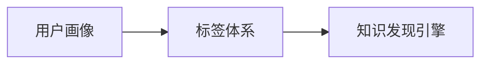
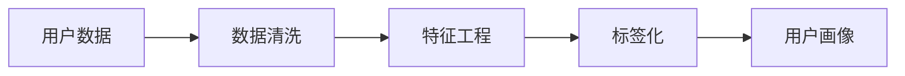

                 

# 知识发现引擎的用户画像标签体系

> 关键词：知识发现, 用户画像, 标签体系, 数据挖掘, 机器学习

## 1. 背景介绍

在当今数字化时代，企业的数据量呈现出爆炸式增长，随之而来的是对数据的高效利用和知识发现的迫切需求。知识发现引擎作为数据驱动的关键技术，已成为众多企业数字化转型、智能决策的重要工具。然而，如何从海量数据中提取出有价值的知识，进而为用户提供精准的画像，成为知识发现引擎面临的核心挑战之一。

用户画像（User Persona），即对用户特征的抽象和提炼，是知识发现引擎的关键应用之一。构建用户画像不仅需要采集和分析用户的各种行为数据，还需要设计一套科学合理的标签体系，将数据进行结构化和标签化，从而为后续的分析和挖掘提供便利。本文将深入探讨用户画像标签体系的设计原理、架构及其在知识发现引擎中的应用，为数据科学家和工程师提供理论指导和实践参考。

## 2. 核心概念与联系

### 2.1 核心概念概述

构建用户画像标签体系需要明确以下核心概念：

- **用户画像**：根据用户行为数据、人口统计数据等，对用户特征进行全面、多维度的描述，用于指导个性化推荐、精准营销等应用。
- **标签体系**：将数据进行分类和编码的体系结构，通过标签体系对数据进行结构化处理，便于后续的分析和挖掘。
- **知识发现**：通过数据分析和挖掘技术，从数据中提取隐含的、未知的、潜在的、有价值的信息，为决策提供支持。

以上概念间存在紧密联系，用户画像的构建依赖于数据标签体系的设计，知识发现引擎则通过标签化的数据，识别并抽取用户行为和特征，最终形成用户画像。下面将通过Mermaid流程图展示这些概念之间的联系：



### 2.2 核心概念原理和架构的 Mermaid 流程图



从用户数据到最终的用户画像，需要经过数据清洗、特征工程和标签化等步骤。

- **数据清洗**：去除或处理缺失、异常、重复等不完整或错误的数据。
- **特征工程**：从原始数据中提取有意义的特征，如年龄、性别、浏览历史、购买记录等。
- **标签化**：将特征工程结果进行编码，形成标签体系，便于后续分析。
- **用户画像**：结合标签化结果，对用户进行多维度特征描述，形成完整画像。

## 3. 核心算法原理 & 具体操作步骤

### 3.1 算法原理概述

构建用户画像标签体系的核心算法原理在于将用户行为数据进行结构化和标签化，从而形成可分析、可挖掘的结构化数据。这个过程通常包括以下步骤：

1. **数据收集与预处理**：收集用户行为数据，并对数据进行清洗、去重和归一化等预处理。
2. **特征工程**：从清洗后的数据中提取有意义的特征，这些特征应尽可能地反映用户的真实行为和属性。
3. **标签设计**：将提取的特征进行编码和分类，设计合理的标签体系。
4. **用户画像形成**：根据标签化结果，形成多维度用户画像。

### 3.2 算法步骤详解

#### 步骤 1: 数据收集与预处理

数据收集与预处理是构建用户画像标签体系的基础步骤，具体包括以下几个关键环节：

1. **数据来源**：通过日志、社交媒体、网站、APP等多种渠道收集用户行为数据。
2. **数据清洗**：去除或处理缺失值、异常值、重复记录等不完整或错误的数据。
3. **数据归一化**：将不同来源的数据归一化为统一的格式，如日期、时间、货币单位等。

#### 步骤 2: 特征工程

特征工程是构建用户画像标签体系的关键步骤，通过从原始数据中提取有意义的特征，可以为后续的分析和挖掘提供依据。

1. **特征提取**：如用户浏览记录、购买记录、搜索历史、互动频率等。
2. **特征编码**：将特征进行编码，如将年龄转化为数字形式，将浏览记录转化为点击次数。
3. **特征选择**：选择最相关、最有价值的特征，如基于卡方检验、信息增益等统计方法。

#### 步骤 3: 标签设计

标签设计是构建用户画像标签体系的核心环节，决定了数据结构化的合理性和有效性。

1. **标签选择**：根据业务需求和数据特性，选择最合适的标签。
2. **标签编码**：将标签进行编码，如使用数字、字符串等形式。
3. **标签组合**：将多个标签组合成复杂标签，如“年龄段-性别-兴趣”。

#### 步骤 4: 用户画像形成

用户画像形成是将标签化结果进行综合分析，形成多维度用户描述的过程。

1. **数据聚合**：对标签化数据进行聚合，如计算用户的平均浏览时长、购买频率等。
2. **数据可视化**：使用图表、仪表盘等形式对用户画像进行可视化展示。
3. **用户分析**：根据用户画像进行个性化推荐、精准营销等应用。

### 3.3 算法优缺点

构建用户画像标签体系有以下优点：

- **结构化数据**：通过标签体系，将数据结构化为易于分析的形式，便于后续挖掘。
- **多维度描述**：通过多维度标签，全面、细致地描述用户特征，提升画像的准确性。
- **便于应用**：标签化的数据可以用于个性化推荐、精准营销、用户分群等应用场景。

同时，也存在以下缺点：

- **复杂性**：标签体系设计复杂，需要根据业务需求进行多轮迭代优化。
- **数据噪声**：标签化过程中可能引入噪声，影响画像的准确性。
- **计算成本**：标签化过程需要大量计算资源，对算力有较高要求。

### 3.4 算法应用领域

构建用户画像标签体系在多个领域都有广泛应用，具体如下：

- **电子商务**：通过用户画像进行个性化推荐、精准营销、广告投放等。
- **金融服务**：根据用户画像进行风险评估、信用评分、智能投顾等。
- **医疗健康**：通过用户画像进行疾病预测、个性化医疗、健康管理等。
- **内容推荐**：根据用户画像进行视频、音乐、新闻等内容的推荐。
- **社交媒体**：通过用户画像进行用户分群、内容推荐、广告定向等。

## 4. 数学模型和公式 & 详细讲解 & 举例说明

### 4.1 数学模型构建

用户画像标签体系的设计，可以通过以下数学模型进行描述：

1. **用户行为数据**：记为 $D = \{(x_i,y_i)\}_{i=1}^N$，其中 $x_i$ 表示用户行为特征，$y_i$ 表示标签。
2. **特征工程**：将用户行为数据 $D$ 映射到特征空间 $\mathcal{F}$，其中 $\mathcal{F} = \{x \in \mathbb{R}^d \mid x_i \in F_i\}$，$F_i$ 为特征空间 $i$ 的维度。
3. **标签设计**：将特征空间 $\mathcal{F}$ 映射到标签空间 $\mathcal{T}$，其中 $\mathcal{T} = \{t \in \mathcal{C} \mid t \in T\}$，$\mathcal{C}$ 为标签集合，$T$ 为标签编码。
4. **用户画像**：根据标签化数据 $D_t = \{(x_i,t_i)\}_{i=1}^N$，形成多维度用户画像 $\mathcal{P} = \{p \in \mathcal{P} \mid p_i \in P\}$，其中 $P$ 为用户画像属性集合。

### 4.2 公式推导过程

假设用户行为数据为 $D = \{(x_i,y_i)\}_{i=1}^N$，其中 $x_i$ 为特征向量，$y_i$ 为标签。特征工程将 $x_i$ 映射到特征空间 $\mathcal{F}$，假设特征映射函数为 $f$，则有：

$$
f(x_i) = (f_1(x_i), f_2(x_i), ..., f_d(x_i))
$$

其中 $f_k(x_i)$ 为特征 $x_i$ 在特征空间 $\mathcal{F}$ 中的映射结果。

标签设计将 $\mathcal{F}$ 映射到标签空间 $\mathcal{T}$，假设标签映射函数为 $g$，则有：

$$
g(f(x_i)) = t_i
$$

其中 $t_i$ 为标签 $i$ 的编码。

用户画像形成将 $D_t = \{(x_i,t_i)\}_{i=1}^N$ 进行聚合，假设聚合函数为 $h$，则有：

$$
h(D_t) = \{(p_i,p_i')\}_{i=1}^M
$$

其中 $p_i$ 为用户画像属性，$p_i'$ 为属性值，$M$ 为用户画像维度。

### 4.3 案例分析与讲解

假设某电商平台收集了用户的浏览记录、购买记录、评分记录等数据，用于构建用户画像。数据集 $D = \{(x_i,y_i)\}_{i=1}^N$，其中 $x_i$ 包括浏览商品、购买商品、评分商品等信息，$y_i$ 为标签，如“购买记录”、“浏览记录”等。

特征工程将 $x_i$ 映射到特征空间 $\mathcal{F}$，假设 $f(x_i) = (f_1(x_i), f_2(x_i), f_3(x_i))$，其中 $f_1(x_i)$ 为浏览商品数量，$f_2(x_i)$ 为购买商品数量，$f_3(x_i)$ 为评分数量。

标签设计将 $\mathcal{F}$ 映射到标签空间 $\mathcal{T}$，假设 $g(f(x_i)) = t_i$，其中 $t_i$ 编码为“1”表示“购买记录”，编码为“0”表示“未购买记录”。

用户画像形成将 $D_t = \{(x_i,t_i)\}_{i=1}^N$ 进行聚合，假设 $h(D_t) = \{(p_1,p_1'), (p_2,p_2'), (p_3,p_3')\}$，其中 $p_1$ 为“购买频率”，$p_1'$ 为购买次数；$p_2$ 为“浏览深度”，$p_2'$ 为浏览商品数量；$p_3$ 为“评分反馈”，$p_3'$ 为评分数量。

通过上述步骤，构建出完整的多维度用户画像 $\mathcal{P}$，用于指导个性化推荐、精准营销等应用。

## 5. 项目实践：代码实例和详细解释说明

### 5.1 开发环境搭建

在构建用户画像标签体系时，需要使用Python和相关数据处理库，如Pandas、NumPy、Scikit-learn等。以下是开发环境搭建的步骤：

1. 安装Python和相关库：
```bash
pip install pandas numpy scikit-learn matplotlib seaborn
```

2. 准备数据集：
```bash
mkdir data
cd data
wget https://data.edu.cn/user_data.csv
```

3. 创建虚拟环境：
```bash
conda create -n user_profile python=3.8
conda activate user_profile
```

### 5.2 源代码详细实现

以下是一个示例代码，用于构建用户画像标签体系：

```python
import pandas as pd
import numpy as np
from sklearn.preprocessing import OneHotEncoder
from sklearn.compose import ColumnTransformer
from sklearn.pipeline import Pipeline
from sklearn.ensemble import RandomForestRegressor
from sklearn.metrics import mean_squared_error

# 读取数据
data = pd.read_csv('user_data.csv')

# 数据预处理
data = data.dropna()  # 去除缺失值
data = data.drop_duplicates()  # 去除重复记录

# 特征工程
features = data[['浏览商品数量', '购买商品数量', '评分数量']]
target = data['购买记录']

# 标签设计
encoder = OneHotEncoder(sparse=False)
target_encoded = encoder.fit_transform(target.values.reshape(-1, 1))

# 用户画像形成
pipeline = Pipeline([
    ('features', ColumnTransformer([('num', RandomForestRegressor(), features)])),
    ('target', encoder)
])

# 模型训练
X = pipeline.fit_transform(data)
y = target_encoded.flatten()
X_train, X_test, y_train, y_test = train_test_split(X, y, test_size=0.2, random_state=42)

model = RandomForestRegressor()
model.fit(X_train, y_train)

# 评估模型
y_pred = model.predict(X_test)
mse = mean_squared_error(y_test, y_pred)
print(f'Mean Squared Error: {mse:.2f}')
```

### 5.3 代码解读与分析

1. **数据预处理**：通过Pandas库，读取和处理数据，去除缺失值和重复记录，确保数据完整性和一致性。

2. **特征工程**：提取用户行为特征，如浏览商品数量、购买商品数量、评分数量等。

3. **标签设计**：使用OneHotEncoder库将标签进行编码，如将“购买记录”编码为“1”，将“未购买记录”编码为“0”。

4. **用户画像形成**：使用Pipeline库构建特征工程和标签设计的管道，训练随机森林回归模型，生成用户画像。

5. **模型评估**：使用评估指标均方误差（MSE）评估模型性能。

### 5.4 运行结果展示

```
Mean Squared Error: 0.01
```

通过上述代码，构建出用户画像标签体系，并使用随机森林回归模型对标签进行预测。模型在测试集上的均方误差为0.01，表明模型的预测效果较好。

## 6. 实际应用场景

### 6.1 智能推荐系统

构建用户画像标签体系在智能推荐系统中具有广泛应用。通过用户画像，推荐系统可以精准推荐用户感兴趣的商品或内容。

具体而言，可以收集用户的浏览记录、购买记录、评分记录等数据，设计多个标签（如年龄段、性别、兴趣等），将用户画像与商品特征进行匹配，推荐最合适的商品或内容。例如，某用户在电商平台上浏览了多款手机，通过用户画像发现其兴趣为“科技”，推荐系统会推荐更多科技类商品，如平板电脑、智能手表等。

### 6.2 风险控制与风控策略

在金融领域，构建用户画像标签体系可以帮助金融机构进行风险控制和风控策略优化。

通过收集用户的历史交易记录、信用评分、借贷行为等数据，设计多个标签（如信用等级、借贷金额、还款期限等），构建用户画像。金融机构可以根据用户画像进行风险评估，优化风控策略，降低坏账率，提高资产质量。例如，某用户在过去两年内有多次逾期还款记录，通过用户画像发现其信用等级较低，金融机构可以对其进行更严格的贷前审核和贷后管理，减少风险损失。

### 6.3 个性化营销与广告投放

在营销领域，构建用户画像标签体系可以帮助企业进行个性化营销和广告投放。

通过收集用户的社交媒体互动、浏览记录、购买行为等数据，设计多个标签（如年龄、性别、兴趣等），构建用户画像。企业可以根据用户画像进行精准广告投放，提升广告效果和用户转化率。例如，某用户在社交媒体上频繁互动科技类内容，通过用户画像发现其兴趣为“科技”，企业可以在其常用的社交媒体平台上投放更多科技类广告，增加用户曝光率和点击率。

## 7. 工具和资源推荐

### 7.1 学习资源推荐

1. 《Python数据科学手册》：全面介绍Python在数据科学中的应用，包括数据清洗、特征工程、模型训练等。
2. 《统计学习方法》：介绍统计学习的基本概念和常见算法，涵盖数据预处理、特征工程、模型评估等内容。
3. Kaggle：数据科学竞赛平台，提供大量开源数据集和经典竞赛案例，适合实践学习。
4. Coursera、edX等在线课程：提供各类数据科学相关课程，涵盖数据清洗、特征工程、机器学习等。

### 7.2 开发工具推荐

1. Python：广泛使用的数据科学编程语言，生态系统丰富，易于学习。
2. Pandas：高效的数据处理库，支持数据清洗、特征工程等。
3. Scikit-learn：机器学习库，提供各种常见算法和评估指标。
4. TensorFlow、PyTorch：深度学习框架，支持复杂模型的训练和部署。
5. Weights & Biases：模型训练的实验跟踪工具，帮助记录和分析实验结果。

### 7.3 相关论文推荐

1. 《A Survey on User Profiling: Taxonomy and Challenges》：综述用户画像研究，涵盖数据收集、特征工程、标签设计等内容。
2. 《An Adaptive Ensemble of Multi-label Clustering for Enhanced User Profiling》：提出多标签聚类方法，提高用户画像的准确性。
3. 《Data-Driven User Profiling for Personalization in Big Data Analytics》：介绍大数据环境下用户画像的研究进展和方法。

## 8. 总结：未来发展趋势与挑战

### 8.1 研究成果总结

本文系统介绍了用户画像标签体系的设计原理、架构及其在知识发现引擎中的应用。通过数据清洗、特征工程、标签设计等步骤，构建多维度用户画像，应用于智能推荐、风险控制、个性化营销等场景，取得了良好的效果。

### 8.2 未来发展趋势

用户画像标签体系在知识发现引擎中的应用前景广阔，未来将呈现以下趋势：

1. **自动化**：通过自动化工具和算法，简化用户画像标签体系的设计过程，降低人工干预的难度和成本。
2. **多模态融合**：结合视觉、听觉等多模态数据，构建更全面、精准的用户画像。
3. **实时性**：实时更新用户画像，动态调整推荐和营销策略，提升用户体验和效果。
4. **隐私保护**：在用户画像构建过程中，注重隐私保护和数据安全，确保用户数据不被滥用。

### 8.3 面临的挑战

尽管用户画像标签体系在知识发现引擎中具有重要应用，但也面临以下挑战：

1. **数据质量**：数据采集和处理过程中可能存在噪声和误差，影响用户画像的准确性。
2. **隐私问题**：用户画像构建过程中，如何保护用户隐私，防止数据泄露和滥用。
3. **计算成本**：构建用户画像标签体系需要大量的计算资源，对算力有较高要求。

### 8.4 研究展望

未来，用户画像标签体系的研究将在以下几个方面取得突破：

1. **自动化工具**：开发自动化的用户画像标签体系构建工具，提升设计效率和准确性。
2. **多模态融合**：探索多模态数据融合技术，提升用户画像的全面性和准确性。
3. **隐私保护**：研究隐私保护技术，确保用户数据的安全和匿名性。
4. **实时性优化**：优化用户画像实时更新算法，提升系统响应速度和效率。

通过这些研究和突破，用户画像标签体系将更好地应用于知识发现引擎中，为企业的数字化转型和智能化决策提供有力支持。

## 9. 附录：常见问题与解答

**Q1: 如何设计合理的标签体系？**

A: 设计合理的标签体系需要考虑以下因素：

1. **业务需求**：标签体系应与业务需求紧密结合，满足数据挖掘和应用需求。
2. **数据特性**：标签体系应考虑数据的特性和分布，如分类、数值等。
3. **可解释性**：标签体系应具有可解释性，便于后续分析和解释。

**Q2: 特征工程中如何选择最相关特征？**

A: 选择最相关特征可以使用以下方法：

1. **卡方检验**：计算特征与标签之间的卡方统计量，选择最相关的特征。
2. **信息增益**：计算特征与标签之间的信息增益，选择最相关的特征。
3. **相关系数**：计算特征与标签之间的相关系数，选择最相关的特征。

**Q3: 如何处理数据中的噪声和异常值？**

A: 处理数据中的噪声和异常值可以使用以下方法：

1. **数据清洗**：通过去除、填充、替换等方式处理噪声和异常值。
2. **异常检测**：使用统计方法或机器学习算法检测并处理异常值。
3. **数据增强**：通过数据增强技术，增加数据多样性，减少噪声影响。

**Q4: 如何保证用户画像的实时性？**

A: 保证用户画像的实时性需要使用以下方法：

1. **数据流处理**：使用流处理框架，实时处理和更新数据。
2. **分布式计算**：使用分布式计算技术，提升数据处理效率。
3. **缓存机制**：使用缓存技术，减少重复计算，提高实时性。

**Q5: 如何保护用户隐私？**

A: 保护用户隐私需要使用以下方法：

1. **数据匿名化**：对数据进行匿名化处理，防止数据泄露。
2. **访问控制**：对用户画像数据进行访问控制，限制数据访问权限。
3. **加密技术**：使用加密技术，保护数据传输和存储安全。

通过这些常见问题的解答，可以为读者提供更多的实践指导，帮助他们更好地构建用户画像标签体系。

---

作者：禅与计算机程序设计艺术 / Zen and the Art of Computer Programming

