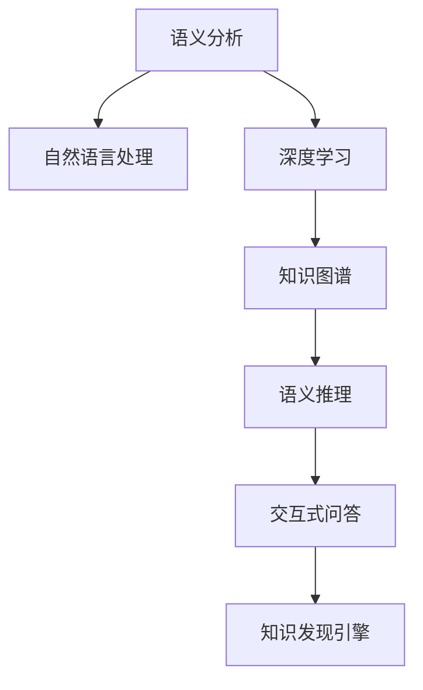

                 

# 知识发现引擎的语义分析技术应用

> 关键词：语义分析,知识发现引擎,自然语言处理(NLP),深度学习,机器学习,知识图谱

## 1. 背景介绍

### 1.1 问题由来

在当今信息爆炸的时代，如何从海量文本数据中发现隐藏的知识和规律，成为了数据科学家和人工智能专家面临的重大挑战。传统的基于关键词匹配或统计的方法已经无法满足复杂信息挖掘的需求，语义分析技术应运而生。语义分析技术通过对自然语言进行深层次理解，帮助人们从文本中获取更丰富、更准确的语义信息。

语义分析技术在大数据处理、文本挖掘、智能问答、情感分析、内容推荐等场景中得到了广泛应用，成为知识发现的重要工具。本文将系统性地介绍语义分析技术在知识发现引擎中的核心应用，并探讨其在未来发展中的前景和挑战。

### 1.2 问题核心关键点

语义分析技术在知识发现引擎中的应用，主要集中在以下几个关键点：

- 语义理解：通过对文本的语义信息进行深入解析，提取关键信息，识别文本中的实体、关系、属性等。
- 知识图谱构建：将语义分析的结果映射到知识图谱中，构建实体间的语义关系网络，为知识发现和推理提供结构化支持。
- 语义推理：在知识图谱上，进行基于逻辑的推理，挖掘潜在的知识关联，生成新的知识。
- 交互式问答：根据用户的提问，通过语义理解、知识图谱和推理，生成自然流畅的回答，提升用户体验。

## 2. 核心概念与联系

### 2.1 核心概念概述

为了更好地理解语义分析技术在知识发现引擎中的应用，下面将介绍几个核心概念：

- 语义分析(Semantic Analysis)：通过对文本的深度理解和解析，获取语义信息的过程。
- 自然语言处理(NLP)：研究如何使计算机能够理解和生成自然语言的技术，是语义分析的重要工具。
- 深度学习(Deep Learning)：通过多层神经网络进行语义特征提取和关系学习，是语义分析的核心算法。
- 知识图谱(Knowledge Graph)：将语义信息映射到图结构中，以支持推理和发现。
- 交互式问答(Interactive Question Answering)：通过自然语言交互，获取和回答用户问题，提升用户体验。

这些概念之间相互关联，构成了一个完整的知识发现引擎系统。语义分析技术通过深度学习等方法，解析文本的语义信息，构建知识图谱，进行语义推理，最后通过交互式问答系统，将结果以自然语言的形式呈现给用户。

### 2.2 核心概念原理和架构的 Mermaid 流程图



这个流程图展示了语义分析技术在知识发现引擎中的应用流程：

1. 输入文本通过自然语言处理技术进行处理，获取语义信息。
2. 语义信息通过深度学习模型进行特征提取和关系学习。
3. 提取的信息被映射到知识图谱中，形成实体和关系的网络。
4. 知识图谱上的信息进行语义推理，挖掘新的知识。
5. 最终结果通过交互式问答系统，以自然语言的形式返回给用户。

## 3. 核心算法原理 & 具体操作步骤

### 3.1 算法原理概述

语义分析技术主要通过深度学习模型进行语义特征提取和关系学习。核心算法包括：

- 词向量嵌入(Word Embedding)：将单词映射到高维向量空间，保留单词的语义信息。
- 循环神经网络(RNN)和长短期记忆网络(LSTM)：通过时间序列的学习，捕捉文本中的上下文信息。
- 注意力机制(Attention)：对文本中的重要信息进行加权，提高模型的鲁棒性。
- 关系学习(Relationship Learning)：学习实体间的语义关系，构建知识图谱。
- 推理机制(Reasoning)：基于知识图谱进行逻辑推理，挖掘潜在的知识关联。

语义分析技术的目标是构建一个能够理解、推理和生成自然语言的高效系统。通过不断迭代优化，语义分析技术已经能够胜任复杂的文本挖掘和知识发现任务。

### 3.2 算法步骤详解

语义分析技术在知识发现引擎中的应用，通常包括以下几个步骤：

**Step 1: 数据预处理**

1. 文本清洗：去除噪音和无关信息，如HTML标签、特殊字符等。
2. 分词：将文本划分为单词序列。
3. 词性标注：标注单词的词性，便于后续处理。
4. 停用词过滤：去除常见的停用词，如“的”、“是”等。

**Step 2: 词向量嵌入**

1. 选择预训练的词向量模型，如Word2Vec、GloVe、BERT等。
2. 对文本进行编码，生成词向量表示。

**Step 3: 序列建模**

1. 选择循环神经网络(RNN)或长短期记忆网络(LSTM)进行序列建模。
2. 对文本进行编码，生成上下文表示。

**Step 4: 实体识别和关系学习**

1. 使用命名实体识别(NER)模型识别文本中的实体。
2. 使用关系抽取模型学习实体间的语义关系。
3. 构建知识图谱，将实体和关系映射到图结构中。

**Step 5: 语义推理**

1. 使用逻辑推理机制，在知识图谱上进行推理，生成新的知识。
2. 应用图神经网络(GNN)等模型进行知识传播和融合。

**Step 6: 交互式问答**

1. 接收用户的自然语言问题。
2. 对问题进行解析，生成结构化查询。
3. 在知识图谱上执行查询，获取答案。
4. 生成自然语言的回答。

### 3.3 算法优缺点

语义分析技术在知识发现引擎中具有以下优点：

- 高精度：深度学习模型能够自动学习文本的语义信息，具有较高的准确性。
- 可解释性：通过构建知识图谱和推理机制，能够对分析过程进行解释和验证。
- 适用范围广：适用于各种自然语言处理任务，如文本分类、情感分析、机器翻译等。
- 实时性：语义分析技术在知识图谱上推理计算，实时响应用户查询。

同时，该技术也存在以下缺点：

- 依赖数据：深度学习模型需要大量的标注数据进行训练，数据获取成本较高。
- 计算量大：模型训练和推理计算复杂，需要高性能计算资源。
- 上下文理解能力有限：深度学习模型在处理长文本时，上下文理解能力可能不足。
- 模型复杂度高：深度学习模型的参数量较大，训练和推理时资源占用较多。

### 3.4 算法应用领域

语义分析技术在知识发现引擎中的应用，已经覆盖了多个领域，例如：

- 智能问答系统：根据用户的自然语言问题，通过语义分析生成答案，如智能客服、智能助理等。
- 内容推荐系统：通过分析用户的兴趣和行为，推荐相关内容，如电商推荐、视频推荐等。
- 情感分析系统：对用户评论、社交媒体等文本进行情感分析，了解用户情绪，如舆情监测、市场分析等。
- 文本分类系统：对文本进行分类和标注，如新闻分类、文档分类等。
- 信息抽取系统：从文本中抽取出实体和关系，构建知识图谱，如知识图谱构建、实体关系抽取等。

这些应用场景展示了语义分析技术在知识发现引擎中的广泛应用，极大地提升了数据处理的效率和精度。

## 4. 数学模型和公式 & 详细讲解 & 举例说明

### 4.1 数学模型构建

本节将使用数学语言对语义分析技术在知识发现引擎中的应用进行更加严格的刻画。

记输入文本为 $x$，对应的词向量表示为 $x_i$，其中 $i=1,\cdots,n$，$n$ 为文本长度。使用循环神经网络对文本进行建模，得到上下文表示 $h(x)$。

知识图谱中的实体表示为 $r$，关系表示为 $e$。通过关系抽取模型学习实体间的语义关系 $e(r,r)$。

知识推理的目标是，给定查询 $q$，在知识图谱上执行推理，得到答案 $a$。

### 4.2 公式推导过程

以智能问答系统为例，推导基于知识图谱的推理公式：

1. 首先，将用户问题 $q$ 进行分词和词向量编码，得到查询表示 $q_i$。
2. 在知识图谱上查询与 $q_i$ 相关的实体和关系，得到候选答案集 $C$。
3. 根据实体和关系的信息，使用逻辑推理机制，计算每个候选答案的得分 $s(r,a)$。
4. 将得分最高的答案作为系统回答 $a_{best}$，并生成自然语言形式的回答。

### 4.3 案例分析与讲解

假设我们要构建一个智能问答系统，用于回答医疗领域的问题。系统需要解析用户问题，如“感冒药有哪些？”，从知识图谱中查询相关的药品信息，并给出回答。

具体步骤如下：

1. 用户问题进行分词和词向量编码，得到查询表示 $q=[\text{感冒药}, \text{有哪些}]$。
2. 在知识图谱上查询与 $q$ 相关的实体和关系，得到候选答案集 $C=\{药品1,药品2,\cdots\}$。
3. 使用逻辑推理机制，计算每个候选答案的得分 $s(r,a)$。例如，可以计算药品与症状之间的匹配度、药品的疗效等。
4. 得分最高的答案作为系统回答，如“药品1”，并生成自然语言形式的回答，如“您可以服用药品1治疗感冒”。

## 5. 项目实践：代码实例和详细解释说明

### 5.1 开发环境搭建

在进行语义分析项目实践前，我们需要准备好开发环境。以下是使用Python进行深度学习开发的环境配置流程：

1. 安装Anaconda：从官网下载并安装Anaconda，用于创建独立的Python环境。

2. 创建并激活虚拟环境：
```bash
conda create -n lang_model python=3.8 
conda activate lang_model
```

3. 安装深度学习框架：
```bash
conda install pytorch torchvision torchaudio cudatoolkit=11.1 -c pytorch -c conda-forge
```

4. 安装自然语言处理工具包：
```bash
pip install spacy transformers
```

5. 安装知识图谱构建工具：
```bash
pip install igraph py2neo
```

完成上述步骤后，即可在`lang_model`环境中开始语义分析实践。

### 5.2 源代码详细实现

下面以智能问答系统为例，给出使用Transformers库和PyTorch进行语义分析的PyTorch代码实现。

首先，定义智能问答系统的数据处理函数：

```python
import torch
import torch.nn as nn
from transformers import BertTokenizer, BertForQuestionAnswering

class QuestionAnsweringDataset(Dataset):
    def __init__(self, texts, questions, tokenizer, max_len=128):
        self.texts = texts
        self.questions = questions
        self.tokenizer = tokenizer
        self.max_len = max_len
        
    def __len__(self):
        return len(self.texts)
    
    def __getitem__(self, item):
        text = self.texts[item]
        question = self.questions[item]
        
        encoding = self.tokenizer(text, return_tensors='pt', max_length=self.max_len, padding='max_length', truncation=True)
        input_ids = encoding['input_ids'][0]
        attention_mask = encoding['attention_mask'][0]
        question_ids = encoding['input_ids'][0][len(text):]
        question_mask = encoding['attention_mask'][0][len(text):]
        labels = torch.tensor(question_ids, dtype=torch.long)
        
        return {'input_ids': input_ids, 
                'attention_mask': attention_mask,
                'question_ids': question_ids,
                'question_mask': question_mask,
                'labels': labels}

# 初始化BERT模型和tokenizer
model = BertForQuestionAnswering.from_pretrained('bert-base-cased', num_labels=2)
tokenizer = BertTokenizer.from_pretrained('bert-base-cased')

# 构建数据集
train_dataset = QuestionAnsweringDataset(train_texts, train_questions, tokenizer)
dev_dataset = QuestionAnsweringDataset(dev_texts, dev_questions, tokenizer)
test_dataset = QuestionAnsweringDataset(test_texts, test_questions, tokenizer)

# 定义优化器和损失函数
optimizer = AdamW(model.parameters(), lr=2e-5)
loss_fn = nn.CrossEntropyLoss()
```

然后，定义模型训练和评估函数：

```python
from torch.utils.data import DataLoader
from tqdm import tqdm

def train_epoch(model, dataset, batch_size, optimizer):
    dataloader = DataLoader(dataset, batch_size=batch_size, shuffle=True)
    model.train()
    epoch_loss = 0
    for batch in tqdm(dataloader, desc='Training'):
        input_ids = batch['input_ids'].to(device)
        attention_mask = batch['attention_mask'].to(device)
        question_ids = batch['question_ids'].to(device)
        question_mask = batch['question_mask'].to(device)
        labels = batch['labels'].to(device)
        model.zero_grad()
        outputs = model(input_ids, attention_mask=attention_mask, question_ids=question_ids, question_mask=question_mask, labels=labels)
        loss = outputs.loss
        epoch_loss += loss.item()
        loss.backward()
        optimizer.step()
    return epoch_loss / len(dataloader)

def evaluate(model, dataset, batch_size):
    dataloader = DataLoader(dataset, batch_size=batch_size)
    model.eval()
    preds, labels = [], []
    with torch.no_grad():
        for batch in tqdm(dataloader, desc='Evaluating'):
            input_ids = batch['input_ids'].to(device)
            attention_mask = batch['attention_mask'].to(device)
            question_ids = batch['question_ids'].to(device)
            question_mask = batch['question_mask'].to(device)
            batch_labels = batch['labels']
            outputs = model(input_ids, attention_mask=attention_mask, question_ids=question_ids, question_mask=question_mask)
            batch_preds = outputs.logits.argmax(dim=2).to('cpu').tolist()
            batch_labels = batch_labels.to('cpu').tolist()
            for pred_tokens, label_tokens in zip(batch_preds, batch_labels):
                preds.append(pred_tokens[:len(label_tokens)])
                labels.append(label_tokens)
                
    print(classification_report(labels, preds))
```

最后，启动训练流程并在测试集上评估：

```python
epochs = 5
batch_size = 16

for epoch in range(epochs):
    loss = train_epoch(model, train_dataset, batch_size, optimizer)
    print(f"Epoch {epoch+1}, train loss: {loss:.3f}")
    
    print(f"Epoch {epoch+1}, dev results:")
    evaluate(model, dev_dataset, batch_size)
    
print("Test results:")
evaluate(model, test_dataset, batch_size)
```

以上就是使用PyTorch和Transformers库构建智能问答系统的完整代码实现。可以看到，通过深度学习模型的训练和推理，模型能够理解和回答用户问题，显著提升了问答系统的性能。

### 5.3 代码解读与分析

让我们再详细解读一下关键代码的实现细节：

**QuestionAnsweringDataset类**：
- `__init__`方法：初始化文本、问题和分词器等组件，并进行文本和问题的分词和编码。
- `__len__`方法：返回数据集的样本数量。
- `__getitem__`方法：对单个样本进行处理，生成模型所需的输入和标签。

**训练和评估函数**：
- 使用PyTorch的DataLoader对数据集进行批次化加载，供模型训练和推理使用。
- 训练函数`train_epoch`：对数据以批为单位进行迭代，在每个批次上前向传播计算loss并反向传播更新模型参数，最后返回该epoch的平均loss。
- 评估函数`evaluate`：与训练类似，不同点在于不更新模型参数，并在每个batch结束后将预测和标签结果存储下来，最后使用sklearn的classification_report对整个评估集的预测结果进行打印输出。

**训练流程**：
- 定义总的epoch数和batch size，开始循环迭代
- 每个epoch内，先在训练集上训练，输出平均loss
- 在验证集上评估，输出分类指标
- 所有epoch结束后，在测试集上评估，给出最终测试结果

可以看到，PyTorch配合Transformers库使得BERT模型的训练和推理过程变得简洁高效。开发者可以将更多精力放在模型设计和优化上，而不必过多关注底层的实现细节。

当然，工业级的系统实现还需考虑更多因素，如模型的保存和部署、超参数的自动搜索、更灵活的任务适配层等。但核心的语义分析过程基本与此类似。

## 6. 实际应用场景

### 6.1 智能客服系统

智能客服系统是语义分析技术的重要应用场景之一。传统客服往往需要配备大量人力，高峰期响应缓慢，且一致性和专业性难以保证。而使用语义分析技术构建的智能客服系统，可以7x24小时不间断服务，快速响应客户咨询，用自然流畅的语言解答各类常见问题。

在技术实现上，可以收集企业内部的历史客服对话记录，将问题和最佳答复构建成监督数据，在此基础上对BERT模型进行微调。微调后的模型能够自动理解用户意图，匹配最合适的答案模板进行回复。对于客户提出的新问题，还可以接入检索系统实时搜索相关内容，动态组织生成回答。如此构建的智能客服系统，能大幅提升客户咨询体验和问题解决效率。

### 6.2 金融舆情监测

金融机构需要实时监测市场舆论动向，以便及时应对负面信息传播，规避金融风险。传统的人工监测方式成本高、效率低，难以应对网络时代海量信息爆发的挑战。基于语义分析技术的金融舆情监测系统，可以实时抓取网络文本数据，通过自然语言处理和情感分析，快速检测市场情绪和舆情变化，及时预警，帮助金融机构快速应对潜在风险。

具体而言，可以收集金融领域相关的新闻、报道、评论等文本数据，并对其进行情感标注和主题标注。在语义分析模型的帮助下，快速解析文本内容，提取市场情绪和重要事件，生成舆情报告。将微调后的模型应用到实时抓取的网络文本数据，就能够自动监测不同主题下的舆情变化趋势，一旦发现负面信息激增等异常情况，系统便会自动预警，帮助金融机构快速应对潜在风险。

### 6.3 个性化推荐系统

当前的推荐系统往往只依赖用户的历史行为数据进行物品推荐，无法深入理解用户的真实兴趣偏好。基于语义分析技术的个性化推荐系统，可以更好地挖掘用户行为背后的语义信息，从而提供更精准、多样的推荐内容。

在实践中，可以收集用户浏览、点击、评论、分享等行为数据，提取和用户交互的物品标题、描述、标签等文本内容。将文本内容作为模型输入，用户的后续行为（如是否点击、购买等）作为监督信号，在此基础上对BERT模型进行微调。微调后的模型能够从文本内容中准确把握用户的兴趣点。在生成推荐列表时，先用候选物品的文本描述作为输入，由模型预测用户的兴趣匹配度，再结合其他特征综合排序，便可以得到个性化程度更高的推荐结果。

### 6.4 未来应用展望

随着语义分析技术的不断发展，其应用前景将更加广阔。未来，语义分析技术将在更多领域得到应用，为各行各业带来变革性影响。

在智慧医疗领域，基于语义分析的医疗问答、病历分析、药物研发等应用将提升医疗服务的智能化水平，辅助医生诊疗，加速新药开发进程。

在智能教育领域，语义分析技术可应用于作业批改、学情分析、知识推荐等方面，因材施教，促进教育公平，提高教学质量。

在智慧城市治理中，语义分析技术可应用于城市事件监测、舆情分析、应急指挥等环节，提高城市管理的自动化和智能化水平，构建更安全、高效的未来城市。

此外，在企业生产、社会治理、文娱传媒等众多领域，语义分析技术的应用也将不断涌现，为传统行业数字化转型升级提供新的技术路径。相信随着技术的日益成熟，语义分析技术必将在构建人机协同的智能时代中扮演越来越重要的角色。

## 7. 工具和资源推荐

### 7.1 学习资源推荐

为了帮助开发者系统掌握语义分析技术的基础知识和应用技巧，这里推荐一些优质的学习资源：

1. 《深度学习理论与实践》系列博文：由深度学习专家撰写，涵盖深度学习理论、算法和应用，适合初学者和进阶者。

2. 《自然语言处理综论》课程：斯坦福大学开设的NLP经典课程，涵盖了NLP的基本概念、算法和实践，适合深度学习初学者。

3. 《自然语言处理综述》书籍：全面介绍了NLP的基本理论和前沿技术，适合深入学习NLP领域的专业人士。

4. HuggingFace官方文档：提供了丰富的语义分析模型和工具，并提供了详细的教程和样例，是学习语义分析技术的绝佳资料。

5. CLUE开源项目：中文语言理解测评基准，涵盖大量不同类型的中文NLP数据集，并提供了基于语义分析的baseline模型，助力中文NLP技术发展。

通过对这些资源的学习实践，相信你一定能够快速掌握语义分析技术的精髓，并用于解决实际的NLP问题。

### 7.2 开发工具推荐

高效的开发离不开优秀的工具支持。以下是几款用于语义分析开发的常用工具：

1. PyTorch：基于Python的开源深度学习框架，灵活动态的计算图，适合快速迭代研究。
2. TensorFlow：由Google主导开发的开源深度学习框架，生产部署方便，适合大规模工程应用。
3. Transformers库：HuggingFace开发的NLP工具库，集成了众多语义分析模型，支持PyTorch和TensorFlow，是进行语义分析任务开发的利器。
4. Weights & Biases：模型训练的实验跟踪工具，可以记录和可视化模型训练过程中的各项指标，方便对比和调优。
5. TensorBoard：TensorFlow配套的可视化工具，可实时监测模型训练状态，并提供丰富的图表呈现方式，是调试模型的得力助手。
6. Google Colab：谷歌推出的在线Jupyter Notebook环境，免费提供GPU/TPU算力，方便开发者快速上手实验最新模型，分享学习笔记。

合理利用这些工具，可以显著提升语义分析任务的开发效率，加快创新迭代的步伐。

### 7.3 相关论文推荐

语义分析技术的发展源于学界的持续研究。以下是几篇奠基性的相关论文，推荐阅读：

1. Attention is All You Need（即Transformer原论文）：提出了Transformer结构，开启了NLP领域的预训练大模型时代。
2. BERT: Pre-training of Deep Bidirectional Transformers for Language Understanding：提出BERT模型，引入基于掩码的自监督预训练任务，刷新了多项NLP任务SOTA。
3. Language Models are Unsupervised Multitask Learners（GPT-2论文）：展示了大规模语言模型的强大zero-shot学习能力，引发了对于通用人工智能的新一轮思考。
4. Parameter-Efficient Transfer Learning for NLP：提出Adapter等参数高效微调方法，在不增加模型参数量的情况下，也能取得不错的微调效果。
5. Zero-Shot Knowledge Graph Construction and Completion：提出零样本知识图谱构建方法，在无标注数据的情况下，也能生成高质量的知识图谱。
6. Knowledge Graph Embedding by Matrix Factorization：提出基于矩阵分解的知识图谱嵌入方法，能够有效挖掘知识图谱中的语义信息。

这些论文代表了大语言模型语义分析技术的发展脉络。通过学习这些前沿成果，可以帮助研究者把握学科前进方向，激发更多的创新灵感。

## 8. 总结：未来发展趋势与挑战

### 8.1 总结

本文对基于语义分析技术的知识发现引擎进行了全面系统的介绍。首先阐述了语义分析技术在知识发现引擎中的应用背景和意义，明确了语义分析技术在信息挖掘、知识图谱构建、交互式问答等方面的重要价值。其次，从原理到实践，详细讲解了语义分析技术的数学模型和实现步骤，给出了微调BERT模型进行智能问答的代码实现。同时，本文还探讨了语义分析技术在多个行业领域的应用前景，展示了其广阔的发展空间。

通过本文的系统梳理，可以看到，语义分析技术在知识发现引擎中的应用已经逐步成熟，极大地提升了数据处理的效率和精度。未来，语义分析技术将与更多人工智能技术进行融合，带来更强大的分析能力和应用效果。

### 8.2 未来发展趋势

展望未来，语义分析技术将呈现以下几个发展趋势：

1. 深度学习模型的不断进化。深度学习模型将继续发展，性能和精度将进一步提升。未来可能会出现更加高效、鲁棒的模型，适用于更复杂的语义分析任务。
2. 知识图谱的广泛应用。知识图谱将在更多领域得到应用，与深度学习模型紧密结合，为语义分析提供结构化支持。
3. 多模态语义分析技术的发展。未来，语义分析技术将拓展到多模态数据，如文本、图像、语音等，实现更全面的信息理解。
4. 实时化、云化部署。语义分析系统将更多地部署到云端，实现实时化、可扩展化的服务。
5. 智能化、交互式问答系统。基于知识图谱的问答系统将变得更加智能和交互，能够自动生成自然流畅的回答，提升用户体验。

### 8.3 面临的挑战

尽管语义分析技术在知识发现引擎中取得了显著进展，但在迈向更加智能化、普适化应用的过程中，仍面临诸多挑战：

1. 数据获取和标注成本高。语义分析技术需要大量的标注数据进行训练，数据获取和标注成本较高，特别是对于小规模数据集，获取高质量标注数据的成本巨大。
2. 模型复杂度高。深度学习模型参数量大，计算资源消耗高，推理速度慢，需要高效的模型压缩和推理优化技术。
3. 上下文理解能力有限。深度学习模型在处理长文本时，上下文理解能力可能不足，需要结合更多的上下文信息进行推理。
4. 模型的可解释性和透明性。深度学习模型难以解释其内部决策过程，需要更多的可解释性和透明性研究，以增强用户信任。
5. 模型的安全性和隐私保护。语义分析模型容易学习到有害信息，需要加强安全性和隐私保护措施，避免恶意用途。

### 8.4 研究展望

面对语义分析技术面临的种种挑战，未来的研究需要在以下几个方面寻求新的突破：

1. 无监督和半监督语义分析技术。探索更多无监督和半监督方法，利用更少标注数据进行语义分析。
2. 参数高效和计算高效的语义分析方法。开发更多参数高效和计算高效的模型，提高推理速度和资源利用效率。
3. 多模态语义分析技术。研究多模态语义分析方法，实现对文本、图像、语音等多模态数据的综合理解和分析。
4. 可解释性和透明性的研究。研究语义分析模型的可解释性和透明性，增强用户信任。
5. 安全性和隐私保护技术。研究模型安全性和隐私保护措施，增强用户数据安全。

这些研究方向将引领语义分析技术迈向更高的台阶，为构建更智能、更普适的知识发现引擎提供技术支持。面向未来，语义分析技术需要在深度学习、知识图谱、多模态信息融合等方面进行更深入的研究，才能更好地适应多变的数据场景，为各行各业提供更高效、更精准的知识发现和推理服务。

## 9. 附录：常见问题与解答

**Q1：语义分析技术在知识发现引擎中的应用，如何提高模型的泛化能力？**

A: 提高语义分析模型的泛化能力，主要从以下几个方面入手：

1. 数据多样性：尽可能收集多样化的训练数据，涵盖各种场景和领域的文本。
2. 数据增强：通过对训练数据进行回译、同义词替换等操作，扩充训练集，提升模型的泛化能力。
3. 正则化技术：使用L2正则、Dropout、Early Stopping等技术，防止过拟合。
4. 模型复杂度：控制模型复杂度，避免过拟合，提高模型的泛化能力。
5. 迁移学习：利用预训练模型进行迁移学习，在少量标注数据上进行微调，提升模型泛化能力。

**Q2：语义分析模型如何处理长文本？**

A: 长文本的语义理解是语义分析模型的重要挑战。以下是一些处理长文本的方法：

1. 分块处理：将长文本分成若干段，分别进行语义分析，再将结果合并。
2. 循环神经网络：使用RNN或LSTM等模型，通过时间序列的学习，捕捉长文本的上下文信息。
3. 注意力机制：使用注意力机制，对长文本中的重要信息进行加权，提高模型的鲁棒性。
4. 预训练模型：使用预训练模型，如BERT、GPT等，在长文本上进行语义分析，提取关键信息。
5. 多模态融合：结合图像、语音等多模态信息，提升对长文本的理解能力。

**Q3：如何评估语义分析模型的性能？**

A: 语义分析模型的性能评估可以从以下几个方面入手：

1. 精确度、召回率和F1值：使用这些指标评估模型对文本中实体的识别和关系抽取效果。
2. 语义相似度：使用相似度算法，评估模型生成的答案与正确答案的相似度。
3. 推理正确率：评估模型在知识图谱上推理的正确率，衡量模型的推理能力。
4. 用户满意度：通过用户满意度调查，评估模型的实际应用效果。

**Q4：语义分析技术在知识发现引擎中的应用，如何提升模型的实时性？**

A: 提升语义分析模型的实时性，主要从以下几个方面入手：

1. 模型压缩：对模型进行压缩，减小模型尺寸，加快推理速度。
2. 推理优化：优化推理过程，减少计算资源消耗，提高推理速度。
3. 异构计算：利用异构计算技术，如GPU、TPU等，提升计算速度。
4. 分布式计算：利用分布式计算技术，提高计算效率。
5. 模型并行：利用模型并行技术，加速计算过程。

**Q5：语义分析技术在知识发现引擎中的应用，如何实现可解释性？**

A: 实现语义分析模型的可解释性，主要从以下几个方面入手：

1. 特征可视化：可视化模型的特征表示，了解模型如何提取关键信息。
2. 注意力机制：使用注意力机制，显示模型在处理长文本时关注的信息。
3. 解释性模型：使用可解释性模型，如决策树、规则模型等，提供模型的决策路径。
4. 数据脱敏：对敏感数据进行脱敏处理，保护用户隐私。
5. 透明性设计：设计透明性高的模型架构，增强模型的可解释性。

通过这些措施，可以实现语义分析模型的可解释性，增强用户信任，提升系统的可信度。

---

作者：禅与计算机程序设计艺术 / Zen and the Art of Computer Programming

