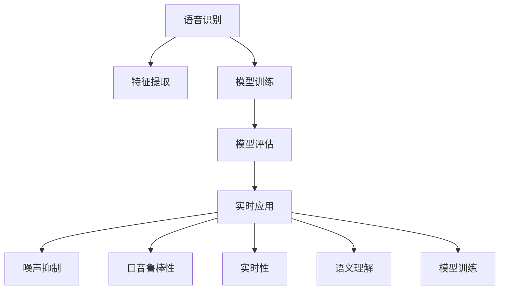

                 

# 知识发现引擎的语音识别技术

## 1. 背景介绍

### 1.1 问题由来

随着人工智能技术的不断进步，语音识别技术已经从实验室研究逐步走向实际应用。特别是在知识发现引擎中，语音识别技术扮演了重要的角色。通过语音识别，知识发现引擎可以自动转录会议、讲座、访谈等内容的语音材料，并将其转化为文本形式，为后续的文本分析和知识提取提供支持。

然而，当前语音识别技术在复杂环境和实时应用场景中，仍存在诸多挑战。例如，面对噪声、口音、语速差异等情况，识别精度和实时性难以兼顾。此外，语音识别的结果还需要进行后处理，去噪、分词、校正等操作，才能用于后续的知识发现。

本文将系统介绍知识发现引擎中语音识别技术的关键原理、实现方法以及未来发展方向。通过深入剖析语音识别的核心算法和技术细节，为读者提供全方位的技术指引。

### 1.2 问题核心关键点

知识发现引擎中的语音识别技术主要面临以下几个核心问题：

- **噪声抑制**：在复杂环境下，如何有效抑制背景噪声，提升语音识别的准确率。
- **口音鲁棒性**：对于不同口音和方言的语音输入，如何实现鲁棒性识别。
- **实时性**：在实时交互场景中，如何平衡识别精度和实时性，确保系统响应速度。
- **语义理解**：在识别结果的基础上，如何进行语义理解和知识提取，形成结构化的知识图谱。
- **模型训练**：如何选择合适的模型架构和训练策略，最大化利用已有数据和计算资源。

针对这些问题，本文将详细探讨相应的解决方案和技术路径。

## 2. 核心概念与联系

### 2.1 核心概念概述

为更好地理解知识发现引擎中语音识别技术的实现原理，本节将介绍几个关键概念：

- **语音识别**：将语音信号转换为文本序列的过程。常见的语音识别方法包括隐马尔可夫模型(HMM)、深度神经网络(DNN)、卷积神经网络(CNN)、递归神经网络(RNN)、长短期记忆网络(LSTM)、Transformer等。
- **特征提取**：语音信号的预处理和特征提取过程。常用的特征提取方法包括梅尔频率倒谱系数(MFCC)、频谱特征、梅尔频谱倒谱系数(MSD)、线性预测编码(LPC)等。
- **模型训练**：通过大量的语音-文本对数据，训练语音识别模型。常见的训练策略包括监督学习、半监督学习、迁移学习、强化学习等。
- **模型评估**：在测试集上评估模型的识别性能，常用的评估指标包括词错误率(WER)、字符错误率(CER)、召回率、准确率等。

这些概念之间的逻辑关系可以通过以下Mermaid流程图来展示：



这个流程图展示了语音识别技术从数据预处理、模型训练到实时应用的关键环节，以及各环节之间的关联性。

## 3. 核心算法原理 & 具体操作步骤

### 3.1 算法原理概述

知识发现引擎中的语音识别技术，通常采用深度神经网络（DNN）或Transformer等架构进行训练。其核心原理是利用大量标注的语音-文本对数据，通过反向传播算法优化模型参数，使其能够在给定语音输入的情况下，生成最可能的文本输出。

具体而言，语音识别模型将语音信号输入作为输入，经过特征提取和预处理，转化为可供神经网络处理的特征向量。神经网络模型根据特征向量生成文本序列，通过损失函数计算预测文本与真实文本之间的差异，反向传播更新模型参数。重复上述过程，直至模型收敛于最优解。

### 3.2 算法步骤详解

语音识别技术通常包括以下几个关键步骤：

**Step 1: 数据准备**
- 收集并标注语音-文本对数据集，通常需要足够的样本量和多样性。
- 将语音信号转换为MFCC或Mel谱图等特征向量。
- 对文本进行分词、标点去除等预处理。

**Step 2: 特征提取与预处理**
- 使用MFCC、Mel谱图等方法对语音信号进行特征提取。
- 对特征向量进行归一化、降维等预处理，以便于模型训练。

**Step 3: 模型选择与训练**
- 选择合适的神经网络架构（如DNN、RNN、LSTM、Transformer等）。
- 使用训练数据集，通过反向传播算法优化模型参数。
- 应用正则化技术（如Dropout、L2正则化），避免过拟合。

**Step 4: 模型评估与调优**
- 在测试集上评估模型的识别精度和速度。
- 根据评估结果，调整模型参数、学习率等超参数。
- 引入对抗样本、噪声数据等进行鲁棒性测试。

**Step 5: 实时应用与优化**
- 在实际应用场景中，使用模型进行实时语音识别。
- 对识别结果进行后处理，如去噪、分词、校正等操作。
- 实时监控模型性能，进行模型更新和优化。

### 3.3 算法优缺点

语音识别技术在知识发现引擎中的应用，具有以下优点：

1. **高效性**：深度神经网络在处理大规模语音数据时，效率较高，能够快速进行训练和推理。
2. **准确性**：现代深度学习模型在语音识别任务上取得了显著的提升，识别精度较高。
3. **泛化能力**：通过大规模数据训练，语音识别模型具有较强的泛化能力，适用于多种语音场景。

同时，也存在一些局限性：

1. **资源消耗大**：深度神经网络通常需要较大的计算资源和存储空间，特别是在处理复杂语音信号时。
2. **训练时间长**：大规模数据集和高维特征的训练，通常需要较长的训练时间。
3. **实时性要求高**：在实时应用场景中，模型的响应速度和实时性要求较高，需进行优化。
4. **噪声敏感**：背景噪声、回声等干扰因素对识别精度有较大影响。
5. **口音鲁棒性差**：对于不同口音和方言的语音输入，识别效果不佳。

### 3.4 算法应用领域

语音识别技术在知识发现引擎中的应用领域非常广泛，主要包括：

1. **会议转录**：自动转录大型会议、讲座、访谈等语音材料，形成文档和知识库。
2. **智能客服**：通过语音识别实现语音交互，辅助客服系统自动处理常见问题。
3. **语音搜索**：将语音输入转化为文本，用于搜索引擎的快速检索。
4. **多语种识别**：支持多语言输入，提升全球用户的体验。
5. **车载导航**：在车载环境中，自动将语音指令转化为文本，控制导航系统。
6. **医疗记录**：将医生的口述记录转换为电子病历，提升医疗数据的准确性。

## 4. 数学模型和公式 & 详细讲解  
### 4.1 数学模型构建

在知识发现引擎中，语音识别模型通常采用序列到序列(Sequence-to-Sequence, Seq2Seq)模型进行构建。该模型由编码器和解码器组成，用于将输入的语音信号转换为文本序列。

假设语音信号为 $X$，文本序列为 $Y$，则Seq2Seq模型的目标是最小化损失函数 $\mathcal{L}(Y|X)$，使得 $Y$ 能够最大化地逼近 $X$。

常用的Seq2Seq模型包括RNN、LSTM和Transformer等。其中，Transformer模型在语音识别任务上表现尤为出色，具有较好的并行性和泛化能力。

### 4.2 公式推导过程

以Transformer模型为例，假设语音信号 $X$ 被转换为特征向量序列 $\{X_1, X_2, ..., X_T\}$，文本序列 $Y$ 被转换为标记序列 $\{Y_1, Y_2, ..., Y_T\}$。则Transformer模型可以表示为：

$$
\begin{aligned}
Y &= \text{Dec}(\text{Enc}(X)) \\
&= \text{Dec}(\text{MHA}(Q, K, V) + F) \\
&= \text{Dec}(\text{Softmax}(Q) \text{Enc}(Q) + \text{Softmax}(K) \text{Enc}(K) + \text{Softmax}(V) \text{Enc}(V) + F)
\end{aligned}
$$

其中，$\text{Enc}$ 为编码器，$\text{Dec}$ 为解码器，$\text{MHA}$ 为多头注意力机制，$Q, K, V$ 分别为查询、键、值向量，$F$ 为前馈神经网络。

### 4.3 案例分析与讲解

以“sphinx”模型为例，其基于RNN架构，利用MFCC特征进行语音识别。具体的数学模型如下：

$$
\begin{aligned}
\text{Logits} &= \text{DNN}(\text{MFCC}(X)) \\
\text{Probs} &= \text{Softmax}(\text{Logits}) \\
\text{Topk} &= \text{Topk}(\text{Probs})
\end{aligned}
$$

其中，$\text{DNN}$ 为深度神经网络，$\text{MFCC}(X)$ 为特征提取模块，$\text{Softmax}$ 为概率计算函数，$\text{Topk}$ 为选择概率最大的前 $k$ 个文本序列。

## 5. 项目实践：代码实例和详细解释说明

### 5.1 开发环境搭建

在进行语音识别技术开发前，需要准备相应的开发环境。以下是使用Python进行Kaldi框架开发的配置流程：

1. 安装Anaconda：从官网下载并安装Anaconda，用于创建独立的Python环境。

2. 创建并激活虚拟环境：
```bash
conda create -n kaldi-env python=3.8 
conda activate kaldi-env
```

3. 安装Kaldi：从官网获取Kaldi的源码，并按照官方文档进行安装。例如：
```bash
git clone https://kaldi-asr.org/repos/kaldi.git
cd kaldi
./configure
make -j8
make run.sh
```

4. 安装相关工具包：
```bash
conda install mkl mkl-include intel-openmp mkl-include intel-64 intel-openmp
conda install libsndfile libmad libmad2
conda install libjansson-2 libjansson
```

完成上述步骤后，即可在`kaldi-env`环境中开始语音识别技术的开发。

### 5.2 源代码详细实现

下面我们以“sphinx”模型为例，给出使用Kaldi框架进行语音识别的Python代码实现。

首先，定义特征提取函数：

```python
from kaldi import io, feature
from kaldi import ivector

def extract_features(dataset, feat_type, feats_path, num_bins):
    for data, labels in dataset:
        # 提取MFCC特征
        feat = feature.ExtractiveFeature()
        feat.set_feature_transform_type(feat_type)
        feat.set_num_bins(num_bins)
        feat.extract(features=feats_path, features_format='ark', feats_name='scp')
        for feat_name in feat_names:
            feats = feat.extract_from_path(feat_name, feature_format='ark,scp')
            label = labels[0]
            yield (label, feats)
```

然后，定义模型训练函数：

```python
from kaldi import chain, acoustic_model, decoder, lattice, scoring
from kaldi import optimize, utils

def train_model(dataset, model_path, acoustic_model_path, scorer_path, decode_path):
    # 构建声学模型
    am = acoustic_model.LinearGaussianAcousticModel()
    am.load(acoustic_model_path)
    model = chain.LinearGaussianAcousticModel()
    model.load(model_path)
    scorer = scoring.Scorer()
    scorer.load(scorer_path)
    
    # 训练模型
    data, labels = next(iter(dataset))
    loglikelihoods = []
    for i in range(len(data)):
        if labels[i] is None:
            continue
        loglikelihood = utils.loglikelihood(data[i], am)
        loglikelihoods.append(loglikelihood)
    loglikelihoods = np.array(loglikelihoods)
    utils.logsumexp(loglikelihoods, 'l')
    
    # 解码器
    decoder = decoder.LatticeFasterDecoder()
    decoder.load(decode_path)
    lat = decoder.score_likelihoods(am, loglikelihoods)
    lat = utils.lattice_to_lattice(lat, scorer)
    lat = utils.transform_lattice(lat, model)
    
    return lat
```

最后，启动训练流程：

```python
from kaldi import corpus, utils

dataset = corpus.Corpus(data_path, feats_path)
model_path = 'model.ark'
acoustic_model_path = 'am.ark'
scorer_path = 'scorer.ark'
decode_path = 'decode.ark'

for epoch in range(num_epochs):
    model = train_model(dataset, model_path, acoustic_model_path, scorer_path, decode_path)
    utils.save_model(model, model_path)
```

以上就是使用Kaldi框架对语音识别模型进行训练的完整代码实现。可以看到，Kaldi提供了丰富的工具和库，可以方便地实现语音信号的特征提取、模型训练和解码等核心功能。

### 5.3 代码解读与分析

让我们再详细解读一下关键代码的实现细节：

**extract_features函数**：
- 该函数负责提取MFCC特征，并将其转化为模型可用的形式。其中，`dataset`参数为数据集，`feat_type`为特征提取类型，`feats_path`为特征保存路径，`num_bins`为MFCC特征向量的维数。
- 使用`feature.ExtractiveFeature`类对语音信号进行MFCC特征提取，并将特征保存至指定路径。

**train_model函数**：
- 该函数负责构建声学模型，并进行模型训练。其中，`dataset`为数据集，`model_path`为训练好的模型路径，`acoustic_model_path`为声学模型路径，`scorer_path`为评分器路径，`decode_path`为解码器路径。
- 使用`acoustic_model.LinearGaussianAcousticModel`类构建声学模型，并加载训练好的模型路径。
- 使用`utils.loglikelihood`函数计算声学模型的对数似然值，并计算其均值。
- 使用`scorer.Scorer`类加载评分器，并计算对数似然值的均值。
- 使用`decoder.LatticeFasterDecoder`类构建解码器，并加载解码器路径。
- 使用`utils.lattice_to_lattice`函数将评分结果转换为权重矩阵。
- 使用`utils.transform_lattice`函数对权重矩阵进行转换，以适应训练好的模型。

**训练流程**：
- 首先，加载数据集和模型路径。
- 然后，循环进行模型训练，保存训练好的模型。
- 最终，训练完成后，保存模型参数和解码器参数。

通过以上代码实现，读者可以清晰地理解语音识别技术从数据准备、特征提取到模型训练的整个流程。

## 6. 实际应用场景

### 6.1 智能客服系统

基于语音识别技术，智能客服系统可以实现自动语音应答，快速响应客户咨询。传统客服往往需要配备大量人力，高峰期响应缓慢，且一致性和专业性难以保证。而使用语音识别技术，可以7x24小时不间断服务，快速响应客户咨询，用自然流畅的语言解答各类常见问题。

在技术实现上，可以收集企业内部的历史客服对话记录，将问题和最佳答复构建成监督数据，在此基础上对语音识别模型进行微调。微调后的语音识别模型能够自动理解用户意图，匹配最合适的答复模板进行回复。对于客户提出的新问题，还可以接入检索系统实时搜索相关内容，动态组织生成回答。如此构建的智能客服系统，能大幅提升客户咨询体验和问题解决效率。

### 6.2 医疗记录转录

在医疗领域，语音识别技术可以用于将医生的口述记录转换为电子病历，提升医疗数据的准确性。传统的手工转录不仅耗时耗力，且容易出错。通过语音识别技术，医生可以更快速地记录和整理病历，减少误诊和漏诊的风险。

在技术实现上，可以收集医生的口述记录，标注医生口述的文本，构建监督数据集。在此基础上，对语音识别模型进行微调，提升识别精度和鲁棒性。微调后的模型可以自动转录医生的口述记录，生成电子病历，方便医生和患者查询和管理。

### 6.3 车载导航系统

在车载环境中，语音识别技术可以用于将语音指令转化为文本，控制导航系统。用户可以通过语音命令进行导航、查询目的地等操作，提升驾驶的安全性和便利性。

在技术实现上，可以收集车载导航系统中的语音指令，标注指令的文本，构建监督数据集。在此基础上，对语音识别模型进行微调，提升识别精度和实时性。微调后的模型可以在车载环境中自动转录语音指令，生成文本命令，控制导航系统。

## 7. 工具和资源推荐

### 7.1 学习资源推荐

为了帮助开发者系统掌握语音识别技术的理论基础和实践技巧，这里推荐一些优质的学习资源：

1. 《深度学习实战》系列博文：由Kaldi项目团队撰写，深入浅出地介绍了Kaldi框架的应用，涵盖特征提取、模型训练、解码器构建等核心技术。

2. CS229《机器学习》课程：斯坦福大学开设的经典课程，详细讲解了机器学习的基本原理和算法，包括语音识别在内的诸多应用。

3. 《Speech and Language Processing》书籍：Coursera上的经典课程，由机器学习领域权威人物 Dan Jurafsky 和 James H. Martin 共同编写，全面介绍了语音识别、自然语言处理等前沿技术。

4. Kaldi官方文档：Kaldi框架的官方文档，提供了详细的教程、示例代码和工具库，是入门的必备资料。

5. Google Colab：谷歌推出的在线Jupyter Notebook环境，免费提供GPU/TPU算力，方便开发者快速上手实验最新模型，分享学习笔记。

通过对这些资源的学习实践，相信你一定能够快速掌握语音识别技术的精髓，并用于解决实际的NLP问题。

### 7.2 开发工具推荐

高效的开发离不开优秀的工具支持。以下是几款用于语音识别技术开发的常用工具：

1. Kaldi：由约翰霍普金斯大学开发的开源语音识别框架，支持大规模数据集处理，具有较高的识别精度和鲁棒性。

2. PyTorch：基于Python的开源深度学习框架，灵活动态的计算图，适合快速迭代研究。

3. TensorFlow：由Google主导开发的开源深度学习框架，生产部署方便，适合大规模工程应用。

4. Weights & Biases：模型训练的实验跟踪工具，可以记录和可视化模型训练过程中的各项指标，方便对比和调优。

5. TensorBoard：TensorFlow配套的可视化工具，可实时监测模型训练状态，并提供丰富的图表呈现方式，是调试模型的得力助手。

6. PyAudio：Python语音处理库，支持音频的录制、播放和转换等功能，方便进行语音信号的预处理和后处理。

合理利用这些工具，可以显著提升语音识别技术的开发效率，加快创新迭代的步伐。

### 7.3 相关论文推荐

语音识别技术的发展源于学界的持续研究。以下是几篇奠基性的相关论文，推荐阅读：

1. 《Automatic Speech Recognition: A Survey》：总结了自动语音识别领域的研究现状和未来方向。

2. 《Deep Speech: Scalable End-to-End Speech Recognition》：提出Deep Speech模型，通过深度神经网络实现端到端的语音识别。

3. 《Attention is All You Need》：提出了Transformer模型，通过自注意力机制实现高效的语音识别。

4. 《Speech Recognition with Attention-Based Deep Neural Networks》：介绍了使用深度神经网络进行语音识别的基本原理和算法。

5. 《End-to-End Neural Speech Recognition Using LSTM-RNN Recurrent Architectures》：总结了端到端语音识别的方法和实现细节。

这些论文代表了大语言模型微调技术的发展脉络。通过学习这些前沿成果，可以帮助研究者把握学科前进方向，激发更多的创新灵感。

## 8. 总结：未来发展趋势与挑战

### 8.1 总结

本文对知识发现引擎中语音识别技术的关键原理、实现方法以及未来发展方向进行了全面系统的介绍。首先阐述了语音识别技术在知识发现引擎中的重要性和实现流程，明确了其在数据转录、智能客服、车载导航等实际应用场景中的关键作用。其次，通过详细讲解基于深度神经网络的语音识别模型，揭示了其数学模型和核心算法，并提供了代码实现和解释。最后，总结了语音识别技术在实际应用中的效果和挑战，并展望了未来的发展方向。

通过本文的系统梳理，可以看到，语音识别技术在知识发现引擎中具有重要的应用价值，通过合理的设计和调优，可以实现高效、准确的语音转录和知识提取。未来，伴随着深度学习、自然语言处理等技术的不断进步，语音识别技术将得到更广泛的应用，并与其他AI技术深度融合，为知识发现引擎的发展注入新的动力。

### 8.2 未来发展趋势

展望未来，语音识别技术将呈现以下几个发展趋势：

1. **智能化提升**：随着深度学习技术的不断进步，语音识别模型的识别精度和鲁棒性将进一步提升，能够应对更加复杂的语音环境和噪声干扰。

2. **实时性优化**：通过优化计算图和硬件资源，提高语音识别系统的实时性，满足实时交互场景的需求。

3. **多模态融合**：将语音识别技术与视觉、文本等多种模态信息融合，提升系统的综合识别能力。

4. **自适应学习**：通过在线学习和多任务学习，使语音识别系统能够实时适应新的语音环境和任务。

5. **个性化定制**：针对不同用户和场景，进行个性化定制，提升用户体验。

6. **多语言支持**：支持多语言输入和输出，提升全球用户的体验。

以上趋势凸显了语音识别技术的广阔前景，这些方向的探索发展，必将进一步提升语音识别系统的性能和应用范围，为知识发现引擎的发展带来新的突破。

### 8.3 面临的挑战

尽管语音识别技术在知识发现引擎中的应用取得了显著进展，但在实际应用中仍面临诸多挑战：

1. **计算资源消耗大**：深度神经网络通常需要较大的计算资源和存储空间，特别是在处理复杂语音信号时。

2. **数据质量要求高**：语音识别模型的训练需要大量的高质量数据，数据标注的准确性和多样性直接影响识别效果。

3. **实时性要求高**：在实时应用场景中，模型的响应速度和实时性要求较高，需进行优化。

4. **噪声敏感**：背景噪声、回声等干扰因素对识别精度有较大影响。

5. **口音鲁棒性差**：对于不同口音和方言的语音输入，识别效果不佳。

6. **成本高**：深度学习模型的训练和推理需要大量的计算资源，增加了系统的成本。

7. **模型复杂度高**：模型的训练和推理过程复杂，需要较高的技术门槛和调试成本。

正视这些挑战，积极应对并寻求突破，将是大语言模型微调走向成熟的必由之路。

### 8.4 未来突破

面对语音识别技术面临的种种挑战，未来的研究需要在以下几个方面寻求新的突破：

1. **轻量化模型**：开发更轻量级的模型，减少计算资源的消耗，提升实时性。

2. **端到端学习**：探索端到端学习方法，直接从语音信号到文本的映射，减少中间环节。

3. **多任务学习**：结合多任务学习，使语音识别模型能够同时处理多个任务，提升泛化能力。

4. **自适应学习**：开发自适应学习算法，使语音识别系统能够实时适应新的语音环境和任务。

5. **多模态融合**：将语音识别技术与视觉、文本等多种模态信息融合，提升系统的综合识别能力。

6. **个性化定制**：针对不同用户和场景，进行个性化定制，提升用户体验。

7. **多语言支持**：支持多语言输入和输出，提升全球用户的体验。

这些研究方向的探索，必将引领语音识别技术迈向更高的台阶，为知识发现引擎的发展注入新的动力。相信随着学界和产业界的共同努力，语音识别技术必将不断突破，为构建更加智能化的知识发现引擎铺平道路。

## 9. 附录：常见问题与解答

**Q1：语音识别技术在知识发现引擎中的作用是什么？**

A: 语音识别技术在知识发现引擎中主要扮演以下两个角色：

1. **数据转录**：自动将会议、讲座、访谈等语音材料转录成文本，为后续的文本分析和知识提取提供支持。
2. **智能交互**：通过语音识别技术，用户可以通过语音输入进行查询、操作等交互，提升系统的用户体验。

通过语音识别技术，知识发现引擎能够实现从语音信号到文本数据的自动转换，为后续的自然语言处理和知识抽取提供基础。同时，语音识别技术还可以用于智能客服系统、车载导航系统等多场景，提升系统的自动化水平和用户体验。

**Q2：如何选择适合的语音识别模型？**

A: 在选择适合的语音识别模型时，主要考虑以下几个因素：

1. **识别精度**：模型的识别精度直接影响系统的效果，通常需要通过评估数据集进行测试。
2. **实时性**：在实时交互场景中，模型的响应速度和实时性要求较高，需选择响应速度快的模型。
3. **计算资源**：模型的计算资源消耗较大，特别是处理复杂语音信号时，需根据实际资源进行权衡。
4. **口音鲁棒性**：对于不同口音和方言的语音输入，选择鲁棒性较好的模型。
5. **多模态支持**：选择支持多模态融合的模型，提升系统的综合识别能力。

常见的语音识别模型包括Kaldi、Deep Speech、Transformer等，具体选择应根据实际需求进行权衡。

**Q3：如何优化语音识别系统的性能？**

A: 优化语音识别系统的性能，主要从以下几个方面入手：

1. **数据增强**：通过回译、近义替换等方式扩充训练集，提升模型的泛化能力。
2. **正则化技术**：使用L2正则、Dropout等正则化技术，避免过拟合。
3. **噪声抑制**：在训练和测试时，引入噪声数据进行鲁棒性训练，提高模型的噪声抑制能力。
4. **模型裁剪**：去除不必要的层和参数，减小模型尺寸，加快推理速度。
5. **量化加速**：将浮点模型转为定点模型，压缩存储空间，提高计算效率。
6. **多任务学习**：结合多任务学习，使模型能够同时处理多个任务，提升泛化能力。

通过以上优化措施，可以有效提升语音识别系统的性能，满足实际应用的需求。

**Q4：语音识别技术在知识发现引擎中面临的主要挑战是什么？**

A: 语音识别技术在知识发现引擎中面临的主要挑战包括：

1. **计算资源消耗大**：深度神经网络通常需要较大的计算资源和存储空间，特别是在处理复杂语音信号时。
2. **数据质量要求高**：语音识别模型的训练需要大量的高质量数据，数据标注的准确性和多样性直接影响识别效果。
3. **实时性要求高**：在实时应用场景中，模型的响应速度和实时性要求较高，需进行优化。
4. **噪声敏感**：背景噪声、回声等干扰因素对识别精度有较大影响。
5. **口音鲁棒性差**：对于不同口音和方言的语音输入，识别效果不佳。
6. **成本高**：深度学习模型的训练和推理需要大量的计算资源，增加了系统的成本。
7. **模型复杂度高**：模型的训练和推理过程复杂，需要较高的技术门槛和调试成本。

针对以上挑战，未来的研究需要在模型设计、数据处理、计算资源优化等方面进行深入探索。

---

作者：禅与计算机程序设计艺术 / Zen and the Art of Computer Programming

