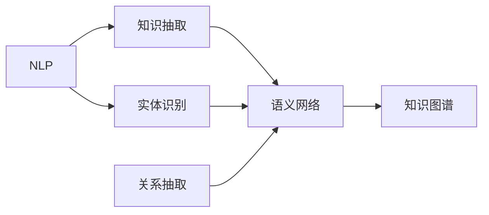

                 

# 知识发现引擎：探索人类知识的本质

> 关键词：知识图谱, 自然语言处理(NLP), 语义网络, 数据挖掘, 深度学习

## 1. 背景介绍

### 1.1 问题由来

随着大数据时代的到来，人类创造的知识量呈指数级增长。从传统的书籍文献到社交媒体、电子文档、在线视频，各类文本数据铺天盖地，让信息获取和知识管理成为一项复杂的工程。传统的文档索引和关键词搜索方法，已难以满足人们对知识快速、精准、系统化获取的需求。知识发现引擎(Knowledge Discovery Engine, KDE)应运而生，以智能化方式从海量文本中挖掘、整合、提取有用信息，帮助用户快速获取所需知识。

### 1.2 问题核心关键点

知识发现引擎的核心思想在于通过对自然语言(Natural Language, NL)文档的分析，自动提取文本中的实体、关系、属性等结构化信息，构建一个语义网络(Semantic Network)，实现知识的自动化标注和索引。这一过程涉及自然语言处理(Natural Language Processing, NLP)、信息抽取(Information Extraction, IE)、实体识别(Entity Recognition, ER)、关系抽取(Relation Extraction, RE)、知识图谱(Knowledge Graph, KG)构建等多个领域的交叉融合。

**关键问题**：

1. **文本表示**：如何将自然语言文本映射为机器可理解的形式。
2. **信息抽取**：如何自动从文本中提取实体、关系等信息。
3. **知识融合**：如何将抽取出的知识结构化、自动化整合进知识图谱中。
4. **知识推理**：如何通过知识图谱进行高效的推理和查询。

### 1.3 问题研究意义

知识发现引擎具有以下重要意义：

1. **知识集成**：集成来自不同源、不同类型的知识，消除信息孤岛，形成统一的知识库。
2. **智能搜索**：通过语义检索，实现更高效、精确的知识查找。
3. **知识创新**：自动发现知识之间的潜在联系，激发新的知识发现。
4. **决策支持**：为决策提供数据支持，提升决策效率和质量。

## 2. 核心概念与联系

### 2.1 核心概念概述

为更好地理解知识发现引擎，我们首先介绍几个核心概念及其相互联系：

- **自然语言处理(NLP)**：通过计算机技术处理、分析、理解自然语言文本，实现信息的自动化提取和处理。NLP是知识发现引擎的关键技术之一。

- **知识图谱(KG)**：以图谱的形式组织实体、关系、属性等知识，提供直观的知识表示和查询接口。KG是知识发现引擎构建的最终目标。

- **语义网络(SN)**：以节点和边的形式，将实体、关系等知识结构化表示。SN是KG的一种实现方式。

- **信息抽取(IE)**：从非结构化文本中提取结构化信息，如实体识别、关系抽取等。IE是构建SN和KG的重要步骤。

- **实体识别(ER)**：从文本中识别出具体的实体，如人名、地名、组织名等。ER是IE的关键子任务。

- **关系抽取(RE)**：从文本中发现实体之间的语义关系，如“张三在李四手下工作”。RE是IE的重要子任务。

### 2.2 核心概念原理和架构的 Mermaid 流程图



这个流程图展示了NLP技术在知识发现引擎中的应用路径：

1. 通过NLP技术将文本转化为语义网络。
2. 在语义网络中，通过实体识别和关系抽取，识别出具体的实体和关系。
3. 最终将语义网络中的结构化知识整合成知识图谱。

## 3. 核心算法原理 & 具体操作步骤

### 3.1 算法原理概述

知识发现引擎的核心算法原理，可以分为以下几个步骤：

1. **文本表示**：将自然语言文本转化为计算机可理解的形式，如词向量、句向量等。
2. **信息抽取**：自动从文本中抽取实体、关系等知识信息。
3. **知识融合**：将抽取出的知识结构化，整合进知识图谱中。
4. **知识推理**：通过知识图谱进行高效的推理和查询。

### 3.2 算法步骤详解

以下是知识发现引擎的核心算法详细步骤：

**Step 1: 文本表示**

- 使用预训练语言模型(如BERT、GPT等)，对文本进行编码。
- 将编码结果转化为向量形式，作为知识抽取的输入。

**Step 2: 信息抽取**

- 使用基于规则或机器学习的抽取方法，识别文本中的实体、关系等。
- 常见的实体识别方法包括基于规则的模式匹配、基于统计的分类器、基于深度学习的实体识别模型等。
- 常见的关系抽取方法包括基于规则的模板匹配、基于统计的分类器、基于深度学习的序列标注模型等。

**Step 3: 知识融合**

- 将抽取出的实体、关系等知识结构化，构建语义网络。
- 常见的语义网络构建方法包括基于规则的实体关系映射、基于统计的关系抽取、基于深度学习的知识图谱嵌入模型等。

**Step 4: 知识推理**

- 使用基于图谱的推理算法，查询知识图谱中的关系和实体。
- 常见的知识推理算法包括基于规则的推理、基于统计的推理、基于深度学习的图神经网络模型等。

### 3.3 算法优缺点

知识发现引擎的优点包括：

- **高效性**：自动化处理海量文本，快速获取知识。
- **准确性**：采用深度学习等先进技术，抽取和推理的准确性高。
- **可扩展性**：支持多源异构数据，可扩展性强。
- **易用性**：提供图形化界面，便于用户使用。

缺点包括：

- **数据依赖**：高度依赖文本数据的质量和结构。
- **模型复杂**：涉及多层次技术，模型复杂度较高。
- **隐私风险**：处理敏感信息时，存在隐私泄露风险。

### 3.4 算法应用领域

知识发现引擎在多个领域得到广泛应用，例如：

- **科学研究**：自动提取科研文献中的实体、关系，构建知识图谱，支持学术研究。
- **医疗健康**：从医疗记录、病历中抽取知识，构建患者健康图谱，辅助临床决策。
- **金融行业**：自动抽取金融新闻、报告中的关键信息，构建金融知识图谱，支持投资分析和风险评估。
- **电子商务**：从商品描述、评论中提取信息，构建产品图谱，支持个性化推荐和搜索。
- **社交媒体**：从社交网络数据中抽取实体关系，构建用户社交图谱，支持社区分析和舆情监测。

## 4. 数学模型和公式 & 详细讲解 & 举例说明

### 4.1 数学模型构建

知识发现引擎的数学模型构建，主要涉及以下三个部分：

- **文本表示模型**：将文本转化为向量形式，常用的模型有Word2Vec、GloVe、BERT等。
- **信息抽取模型**：从文本中抽取实体和关系，常用的模型有CRF、LSTM-CRF、BiLSTM-CRF等。
- **知识图谱嵌入模型**：将抽取出的知识结构化并嵌入到向量空间中，常用的模型有TransE、TransH、RotatE等。

### 4.2 公式推导过程

以Word2Vec模型为例，进行文本表示的推导过程：

$$
w_{i,j} = \sigma(W^Tw_{i-1} + U^TX_i + b)
$$

其中，$w_{i,j}$ 表示第 $i$ 个单词和第 $j$ 个单词的向量相似度。$\sigma$ 为激活函数，$W$ 和 $U$ 为权重矩阵，$b$ 为偏置向量。

### 4.3 案例分析与讲解

**案例一：金融行业知识图谱**

在金融行业，知识发现引擎可以自动抽取金融新闻、报告中的关键信息，构建金融知识图谱。具体流程如下：

1. **文本预处理**：对金融新闻、报告进行分词、清洗等预处理。
2. **实体识别**：使用BERT模型识别出关键实体，如公司、产品、人物等。
3. **关系抽取**：使用BiLSTM-CRF模型抽取实体之间的关系，如“A公司收购B公司”。
4. **知识融合**：将抽取出的实体和关系整合进知识图谱中。
5. **知识推理**：使用图神经网络模型进行知识推理，如查询“A公司与C公司关系如何”。

**案例二：医疗健康知识图谱**

在医疗健康领域，知识发现引擎可以自动抽取电子病历、科研论文中的信息，构建患者健康图谱。具体流程如下：

1. **文本预处理**：对电子病历、科研论文进行分词、清洗等预处理。
2. **实体识别**：使用BERT模型识别出疾病、药物、症状等实体。
3. **关系抽取**：使用BiLSTM-CRF模型抽取实体之间的关系，如“使用药物A治疗疾病B”。
4. **知识融合**：将抽取出的实体和关系整合进知识图谱中。
5. **知识推理**：使用图神经网络模型进行知识推理，如查询“A疾病与C疾病是否相关”。

## 5. 项目实践：代码实例和详细解释说明

### 5.1 开发环境搭建

在进行知识发现引擎开发前，需要先配置好开发环境。以下是在Python环境下搭建知识发现引擎的开发环境的步骤：

1. **安装Python和相关库**：
```bash
pip install tensorflow keras py2neo sklearn spacy
```

2. **配置PyTorch**：
```bash
conda install pytorch torchvision torchaudio
```

3. **配置Transformer**：
```bash
pip install transformers
```

4. **配置Pandas和Numpy**：
```bash
pip install pandas numpy
```

5. **配置其他相关库**：
```bash
pip install matplotlib seaborn networkx plotly
```

### 5.2 源代码详细实现

以下是一个简单的基于Word2Vec模型的知识发现引擎示例代码：

```python
import numpy as np
from gensim.models import Word2Vec

# 构建Word2Vec模型
model = Word2Vec(sentences, size=100, window=5, min_count=5, workers=4)

# 获取单词向量
vector1 = model.wv['spam']
vector2 = model.wv['eggs']

# 计算向量相似度
similarity = np.dot(vector1, vector2) / (np.linalg.norm(vector1) * np.linalg.norm(vector2))
print('Vector similarity:', similarity)
```

### 5.3 代码解读与分析

在上述代码中，我们使用Gensim库构建了一个Word2Vec模型，并计算了两个单词的向量相似度。具体步骤如下：

1. **构建Word2Vec模型**：使用Gensim库构建Word2Vec模型，指定模型维度为100，窗口大小为5，最小单词出现次数为5，并使用4个线程加速训练。
2. **获取单词向量**：使用模型的 `wv` 属性，获取指定单词的向量。
3. **计算向量相似度**：计算两个向量之间的点积，再除以它们的模长，得到向量相似度。

需要注意的是，实际应用中，Word2Vec模型的训练过程需要大量的文本数据，模型训练完成后，可以将其保存为二进制文件，用于后续的推理预测。

## 6. 实际应用场景

### 6.1 科学研究

知识发现引擎在科学研究中的应用非常广泛。例如，科学界可以通过知识发现引擎自动抽取科研文献中的实体、关系，构建知识图谱，支持学术研究。具体应用场景包括：

- **知识管理**：将科研文献中的知识自动标注、整合，形成统一的科研知识库。
- **文献检索**：通过语义检索，快速找到与特定研究领域相关的文献。
- **趋势分析**：自动分析科研趋势，识别研究热点和前沿领域。

### 6.2 医疗健康

在医疗健康领域，知识发现引擎可以自动抽取电子病历、科研论文中的信息，构建患者健康图谱。具体应用场景包括：

- **临床决策支持**：通过知识图谱中的疾病、药物、症状等知识，辅助医生进行诊断和治疗。
- **健康监测**：实时监测患者健康状态，及时发现异常情况。
- **健康预警**：通过知识推理，预警潜在的健康风险。

### 6.3 金融行业

在金融行业，知识发现引擎可以自动抽取金融新闻、报告中的关键信息，构建金融知识图谱。具体应用场景包括：

- **投资分析**：通过知识图谱中的金融实体、关系，辅助分析师进行投资决策。
- **风险评估**：自动分析金融市场风险，提供风险预警。
- **舆情监测**：实时监测金融舆情，评估市场情绪。

### 6.4 电子商务

在电子商务领域，知识发现引擎可以自动抽取商品描述、评论中的信息，构建产品图谱。具体应用场景包括：

- **个性化推荐**：通过知识图谱中的产品实体、关系，进行个性化推荐。
- **商品搜索**：通过语义搜索，快速找到与特定商品相关的信息。
- **用户画像**：通过用户行为数据，构建用户画像，提供更精准的推荐服务。

### 6.5 社交媒体

在社交媒体领域，知识发现引擎可以自动抽取社交网络数据中的信息，构建用户社交图谱。具体应用场景包括：

- **社区分析**：通过用户之间的关系和互动，分析社区结构和用户行为。
- **舆情监测**：实时监测社交媒体舆情，评估用户情绪。
- **事件识别**：自动识别社会热点事件，提供事件分析报告。

## 7. 工具和资源推荐

### 7.1 学习资源推荐

为了帮助开发者系统掌握知识发现引擎的理论基础和实践技巧，这里推荐一些优质的学习资源：

1. **《自然语言处理综述》**：斯坦福大学自然语言处理课程，系统讲解NLP基础理论和前沿技术。
2. **《深度学习入门》**：Deep Learning书籍，讲解深度学习的基本概念和应用场景。
3. **《知识图谱与语义网》**：南洋理工大学图书，讲解知识图谱的理论基础和构建方法。
4. **Kaggle竞赛平台**：提供大量实际数据集和竞赛任务，实战练习知识发现引擎技术。

### 7.2 开发工具推荐

以下是在知识发现引擎开发中常用的开发工具：

1. **Python**：简单易学的编程语言，广泛用于数据科学和机器学习领域。
2. **PyTorch**：开源深度学习框架，支持动态计算图，适合快速迭代开发。
3. **TensorFlow**：谷歌开源的深度学习框架，适合大规模工程应用。
4. **Gensim**：Python库，支持Word2Vec、Doc2Vec等模型训练和推理。
5. **NLTK**：Python库，支持NLP任务的自然语言处理工具。
6. **spaCy**：Python库，支持自然语言处理任务，如命名实体识别、句法分析等。

### 7.3 相关论文推荐

知识发现引擎涉及多个交叉学科，以下几篇论文代表了当前的研究前沿：

1. **《知识图谱构建与应用》**：南洋理工大学图书，讲解知识图谱的构建方法和应用场景。
2. **《基于深度学习的自然语言处理》**：Deep Learning书籍，讲解深度学习在NLP任务中的应用。
3. **《信息抽取与实体识别》**：ACL会议论文，讲解信息抽取和实体识别的最新研究成果。
4. **《知识图谱嵌入模型》**：ICML会议论文，讲解知识图谱嵌入模型的最新进展。

## 8. 总结：未来发展趋势与挑战

### 8.1 总结

本文对知识发现引擎进行了全面系统的介绍，涵盖其核心概念、算法原理和实际应用场景。通过理论讲解和代码示例，展示了知识发现引擎从文本表示到知识推理的全过程，帮助读者深入理解知识发现引擎的工作机制。

### 8.2 未来发展趋势

知识发现引擎的未来发展趋势主要体现在以下几个方面：

1. **自动化程度提升**：未来知识发现引擎将更多地利用自动化技术，减少人工干预，提高处理效率。
2. **跨领域融合**：知识发现引擎将与其他人工智能技术进行更深入的融合，如计算机视觉、语音识别等。
3. **实时性增强**：通过分布式计算和大数据技术，提高知识发现引擎的实时处理能力。
4. **隐私保护加强**：知识发现引擎处理敏感数据时，将更加注重隐私保护和数据安全。
5. **知识表示优化**：开发更加高效的知识表示方法，支持更复杂、多样化的知识形式。

### 8.3 面临的挑战

知识发现引擎在快速发展的同时，也面临诸多挑战：

1. **数据质量问题**：知识发现引擎高度依赖数据质量，低质量数据可能导致错误结果。
2. **模型复杂度**：知识发现引擎涉及多层次技术，模型复杂度较高，需要更多的计算资源。
3. **隐私风险**：知识发现引擎处理敏感数据时，存在隐私泄露的风险。
4. **计算成本**：知识发现引擎处理大规模数据时，需要大量的计算资源，成本较高。

### 8.4 研究展望

面对知识发现引擎所面临的挑战，未来的研究需要在以下几个方面寻求新的突破：

1. **高效数据处理方法**：开发高效的数据预处理和清洗方法，提升数据质量。
2. **模型压缩与优化**：开发更加高效的模型压缩与优化方法，降低计算成本。
3. **隐私保护技术**：研究隐私保护和数据安全技术，保障知识发现引擎的可靠性。
4. **跨领域知识融合**：研究跨领域知识的融合方法，拓展知识发现引擎的应用范围。
5. **自动化知识发现**：开发更加自动化的知识发现方法，减少人工干预。

## 9. 附录：常见问题与解答

**Q1: 知识发现引擎的核心算法包括哪些？**

A: 知识发现引擎的核心算法主要包括以下几个步骤：

1. **文本表示**：将自然语言文本转化为向量形式，如Word2Vec、BERT等。
2. **信息抽取**：从文本中抽取实体和关系，如BiLSTM-CRF等。
3. **知识融合**：将抽取出的实体和关系整合进知识图谱中，如TransE等。
4. **知识推理**：通过知识图谱进行高效的推理和查询，如图神经网络等。

**Q2: 知识发现引擎在实际应用中需要注意哪些问题？**

A: 知识发现引擎在实际应用中需要注意以下问题：

1. **数据质量**：知识发现引擎高度依赖数据质量，低质量数据可能导致错误结果。
2. **模型复杂度**：知识发现引擎涉及多层次技术，模型复杂度较高，需要更多的计算资源。
3. **隐私风险**：知识发现引擎处理敏感数据时，存在隐私泄露的风险。
4. **计算成本**：知识发现引擎处理大规模数据时，需要大量的计算资源，成本较高。

**Q3: 知识发现引擎如何处理大规模数据？**

A: 知识发现引擎处理大规模数据时，需要采用以下方法：

1. **分布式计算**：使用分布式计算框架，如Hadoop、Spark等，将数据分散到多个计算节点进行处理。
2. **数据采样**：采用数据采样方法，减少计算量，提高处理效率。
3. **模型并行**：使用模型并行技术，将模型拆分为多个子模型，并行计算。

**Q4: 知识发现引擎的未来发展方向有哪些？**

A: 知识发现引擎的未来发展方向主要包括以下几个方面：

1. **自动化程度提升**：未来知识发现引擎将更多地利用自动化技术，减少人工干预，提高处理效率。
2. **跨领域融合**：知识发现引擎将与其他人工智能技术进行更深入的融合，如计算机视觉、语音识别等。
3. **实时性增强**：通过分布式计算和大数据技术，提高知识发现引擎的实时处理能力。
4. **隐私保护加强**：知识发现引擎处理敏感数据时，将更加注重隐私保护和数据安全。
5. **知识表示优化**：开发更加高效的知识表示方法，支持更复杂、多样化的知识形式。

**Q5: 知识发现引擎在医疗健康领域有哪些应用场景？**

A: 知识发现引擎在医疗健康领域的应用场景主要包括以下几个方面：

1. **临床决策支持**：通过知识图谱中的疾病、药物、症状等知识，辅助医生进行诊断和治疗。
2. **健康监测**：实时监测患者健康状态，及时发现异常情况。
3. **健康预警**：通过知识推理，预警潜在的健康风险。

---

作者：禅与计算机程序设计艺术 / Zen and the Art of Computer Programming

