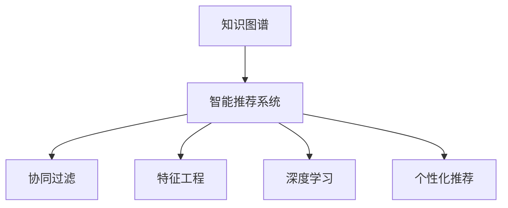

                 

# 知识图谱在智能推荐系统中的应用

> 关键词：知识图谱, 智能推荐系统, 协同过滤, 特征工程, 深度学习, 个性化推荐

## 1. 背景介绍

在当前信息爆炸的时代，如何高效地为用户推荐合适的信息，是互联网企业面临的重要挑战。传统的协同过滤算法和基于内容的推荐方法，虽然取得了一定的成功，但由于其固有的冷启动问题、数据稀疏性和推荐多样性不足等局限性，难以应对大规模、高维度和多变性的推荐场景。

近年来，知识图谱（Knowledge Graph）作为一种结构化的语义数据表示形式，以其直观、丰富的语义信息吸引了研究者的广泛关注。通过将实体、属性和关系等知识元素有机整合，知识图谱可以帮助推荐系统更好地理解用户需求和物品属性，从而提升推荐精度和多样性。

## 2. 核心概念与联系

### 2.1 核心概念概述

为更好地理解知识图谱在智能推荐系统中的应用，本节将介绍几个密切相关的核心概念：

- 知识图谱（Knowledge Graph）：以节点表示实体，边表示关系的图结构，用于表示知识元素之间的语义关系。如Linked Data中的RDF图谱、YAGO、Freebase等。

- 智能推荐系统（Recommendation System）：通过分析用户行为、物品属性等数据，为用户推荐合适的信息、商品、内容等的技术系统。应用广泛，如电商、视频、音乐等推荐场景。

- 协同过滤（Collaborative Filtering, CF）：利用用户和物品的交互行为（如评分、浏览等），找到与目标用户兴趣相似的其他用户或物品，从而进行推荐。经典算法包括基于用户的CF和基于物品的CF。

- 特征工程（Feature Engineering）：根据推荐任务的需要，设计合适的特征表示方法，如词袋模型、TF-IDF、Word2Vec等，以增强推荐模型的预测能力。

- 深度学习（Deep Learning）：利用多层神经网络模拟人脑的神经网络结构，从数据中自动学习特征表示，如图卷积网络（GCN）、矩阵分解（MF）等。

- 个性化推荐（Personalized Recommendation）：针对单个用户或特定需求的推荐，以提升用户体验和满意度为目标。

这些核心概念之间的逻辑关系可以通过以下Mermaid流程图来展示：



这个流程图展示了知识图谱与智能推荐系统之间的内在联系：

1. 知识图谱通过结构化的语义信息，提供对实体和关系的深度理解。
2. 智能推荐系统利用知识图谱中的信息，增强对用户行为和物品属性的分析。
3. 协同过滤算法通过用户和物品的交互数据，提供基于社会网络的推荐。
4. 特征工程从非结构化数据中提取有用的特征，增强模型的预测能力。
5. 深度学习通过自动学习特征，提供更复杂和高精度的推荐模型。
6. 个性化推荐从用户的个性化需求出发，提供定制化的推荐内容。

## 3. 核心算法原理 & 具体操作步骤
### 3.1 算法原理概述

基于知识图谱的智能推荐系统，本质上是通过将知识图谱中的信息融入推荐模型，优化用户与物品的匹配度，从而实现推荐任务。其核心思想是：通过将知识图谱中的实体和关系映射到用户-物品交互矩阵，得到更加全面的特征表示，以提升推荐模型的性能。

形式化地，假设知识图谱中包含$E$个实体和$R$个关系，$S$为每个实体的社会网络图谱。则可以将知识图谱映射为一个用户-物品社交矩阵$M$，其中行表示用户，列表示物品。知识图谱中的关系权重可以作为社交矩阵中的边的权重。

推荐模型的目标是最小化用户-物品社交矩阵$M$与真实用户-物品交互矩阵$Y$之间的差异，即：

$$
\min_{M} \| M - Y \|_F^2
$$

其中$\| \cdot \|_F$表示矩阵的Frobenius范数，表示矩阵元素差的平方和开根号。通过最小化该范数，可以使得推荐模型学习到更加合理的用户-物品社交关系，从而提升推荐精度。

### 3.2 算法步骤详解

基于知识图谱的智能推荐系统的一般步骤如下：

**Step 1: 构建知识图谱**
- 收集和整合各类数据源，如商品描述、用户评论、社交媒体等，构建知识图谱。
- 对知识图谱进行实体、属性和关系的标注和清理，确保数据的准确性和一致性。

**Step 2: 映射知识图谱到社交矩阵**
- 将知识图谱中的实体映射到推荐系统中的用户和物品，关系映射到社交矩阵中的边。
- 计算每条边的权重，如关系强度、实体属性等，形成稀疏矩阵。

**Step 3: 优化推荐模型**
- 选择适合的推荐算法，如矩阵分解（MF）、图卷积网络（GCN）等。
- 定义推荐模型的损失函数，如均方误差（MSE）、交叉熵（CE）等。
- 通过最小化损失函数，训练优化推荐模型。

**Step 4: 评估和优化**
- 在测试集上评估推荐模型的性能，计算评价指标如准确率、召回率、F1值等。
- 分析模型缺陷，进一步优化推荐模型的参数设置和算法选择。

**Step 5: 部署和监控**
- 将训练好的推荐模型部署到推荐系统中，实时获取用户行为数据。
- 实时监控推荐系统的性能，调整模型参数以适应数据分布的变化。

### 3.3 算法优缺点

基于知识图谱的智能推荐系统具有以下优点：
1. 结构化的语义信息：知识图谱中的结构化语义信息，可以更全面地理解用户和物品的属性，从而提升推荐精度。
2. 跨领域融合：知识图谱可以融合多领域的知识，提升推荐模型的泛化能力。
3. 冷启动问题缓解：知识图谱中的实体和关系信息，可以在一定程度上缓解推荐系统的冷启动问题。
4. 推荐多样性提升：通过引入知识图谱中的关系权重，可以提升推荐的多样性和个性化程度。

同时，该方法也存在以下局限性：
1. 数据获取难度：构建知识图谱需要从多源数据中提取信息，数据获取和整合难度较大。
2. 知识图谱质量：知识图谱的质量和完整性直接影响推荐系统的性能，构建和维护成本较高。
3. 计算复杂度：知识图谱中实体和关系数量较多，构建和优化的计算复杂度较高。
4. 实时性问题：由于需要整合和计算知识图谱信息，推荐系统的实时性可能受到一定影响。

尽管存在这些局限性，但就目前而言，基于知识图谱的推荐系统仍是一个极具前景的研究方向。未来相关研究的重点在于如何进一步优化知识图谱的构建和优化算法，提升推荐系统的性能和效率。

### 3.4 算法应用领域

基于知识图谱的智能推荐系统已经在电商、视频、音乐等多个领域得到广泛应用，为推荐系统带来了新的突破：

- 电商推荐：通过整合商品描述、用户评价、社交网络等数据，构建商品知识图谱，提升个性化推荐效果。如Amazon、淘宝等电商平台。

- 视频推荐：利用用户观看行为和视频元数据，构建视频知识图谱，提供更精准的视频推荐。如Netflix、Bilibili等视频平台。

- 音乐推荐：整合音乐属性、用户评分、社交网络等数据，构建音乐知识图谱，提升音乐推荐的多样性和个性化。如Spotify、网易云音乐等音乐平台。

此外，基于知识图谱的推荐系统也被创新性地应用于更多场景中，如社交网络、新闻推荐、商品评价等，为推荐系统带来了全新的突破。随着知识图谱和推荐方法的不断进步，相信推荐系统将在更广阔的应用领域大放异彩。

## 4. 数学模型和公式 & 详细讲解 & 举例说明
### 4.1 数学模型构建

本节将使用数学语言对基于知识图谱的智能推荐系统进行更加严格的刻画。

记知识图谱中的实体集合为$E$，关系集合为$R$，用户集合为$U$，物品集合为$I$。知识图谱中的每个实体$e \in E$都可以表示为一个三元组$(e, r, o)$，其中$r \in R$表示实体$e$和$o \in I$之间的关系。设$S_e$表示实体$e$的邻接实体集合，则$S_e$可以表示为：

$$
S_e = \{(e, r, o) \in E \times R \times I \mid (o, r, e) \in E \times R \times I\}
$$

知识图谱中的关系权重$w_{er}$表示实体$e$和$o$之间的关系强度。设知识图谱中的边集合为$E_R$，则边$(e, r, o)$的权重可以表示为：

$$
w_{er} = \left\{
\begin{aligned}
1 & , e = o \\
\frac{1}{\sum_{r \in R} d_{er}d_{ro}} & , e \neq o
\end{aligned}
\right.
$$

其中$d_{er}$表示实体$e$和$r$的出度，$d_{ro}$表示实体$r$和$o$的入度。

推荐系统中的用户-物品社交矩阵$M$可以表示为：

$$
M = \left( \sum_{r \in R} w_{er}r_{uo} \right)_{u \in U, o \in I}
$$

其中$r_{uo}$表示用户$u$和物品$o$的交互权重，可以表示为用户对物品的评分或评分预测值。

### 4.2 公式推导过程

以下我们以基于知识图谱的推荐系统为例，推导矩阵分解模型的计算公式。

假设推荐系统中的用户-物品社交矩阵为$M$，用户物品交互矩阵为$Y$。设用户$u$和物品$o$的嵌入向量为$h_u$和$h_o$，则用户-物品社交矩阵的预测值可以表示为：

$$
\hat{r}_{uo} = h_u^T W h_o
$$

其中$W$为模型参数，表示用户和物品的交互权重矩阵。设$H = [h_u]_{u \in U}$为所有用户的嵌入矩阵，$O = [h_o]_{o \in I}$为所有物品的嵌入矩阵，则推荐模型可以表示为：

$$
\hat{r}_{uo} = H^T W O
$$

在实际应用中，通常使用矩阵分解（MF）算法优化推荐模型的参数$H$和$W$。设$H$和$W$的初始化参数为$H_0$和$W_0$，则推荐模型的优化目标为：

$$
\min_{H,W} \frac{1}{N} \sum_{uo} (r_{uo} - \hat{r}_{uo})^2
$$

其中$N$为用户和物品的总数。设$\eta$为学习率，$L$为损失函数，则参数的更新公式为：

$$
H \leftarrow H - \eta \nabla_{H} L(H, W, Y)
$$
$$
W \leftarrow W - \eta \nabla_{W} L(H, W, Y)
$$

其中$\nabla_{H} L(H, W, Y)$和$\nabla_{W} L(H, W, Y)$分别表示对$H$和$W$的梯度。

在得到损失函数的梯度后，即可带入参数更新公式，完成模型的迭代优化。重复上述过程直至收敛，最终得到适应知识图谱的推荐模型。

### 4.3 案例分析与讲解

以一个简单的商品推荐系统为例，说明基于知识图谱的推荐模型的实现步骤。

**数据准备**：
- 收集商品描述、用户评分、用户评论等数据，构建商品知识图谱。
- 对知识图谱进行实体、属性和关系的标注和清理，形成训练集和测试集。

**模型训练**：
- 使用矩阵分解算法训练推荐模型。
- 在训练集上定义损失函数，如均方误差，计算梯度并更新模型参数。
- 在测试集上评估模型性能，计算评价指标如准确率、召回率等。

**模型应用**：
- 将训练好的模型部署到推荐系统中，实时获取用户行为数据。
- 实时计算用户-物品社交矩阵，并计算推荐结果。
- 输出推荐商品列表，供用户选择。

下面是一个简单的Python代码示例，展示如何使用Scikit-learn库实现基于知识图谱的商品推荐系统：

```python
from sklearn.decomposition import TruncatedSVD
import pandas as pd
import numpy as np

# 加载数据
train_data = pd.read_csv('train_data.csv')
test_data = pd.read_csv('test_data.csv')

# 构建用户-物品社交矩阵
M = np.zeros((len(train_data), len(test_data['item_id'].unique())))
for user, item in train_data.iterrows():
    if item in test_data['item_id'].unique():
        M[user-1, test_data[test_data['item_id'] == item].index] += 1

# 训练矩阵分解模型
model = TruncatedSVD(n_components=100)
M_hat = model.fit_transform(M)

# 输出推荐结果
for user, row in enumerate(M_hat):
    recommended_items = list(test_data[test_data['user_id'] == user+1]['item_id'].values)
    print(f'User {user+1} is recommended to buy: {recommended_items}')
```

## 5. 项目实践：代码实例和详细解释说明
### 5.1 开发环境搭建

在进行推荐系统开发前，我们需要准备好开发环境。以下是使用Python进行Scikit-learn和TensorFlow开发的环境配置流程：

1. 安装Anaconda：从官网下载并安装Anaconda，用于创建独立的Python环境。

2. 创建并激活虚拟环境：
```bash
conda create -n recommendation-env python=3.8 
conda activate recommendation-env
```

3. 安装Scikit-learn和TensorFlow：根据CUDA版本，从官网获取对应的安装命令。例如：
```bash
conda install scikit-learn tensorflow cudatoolkit=11.1 -c pytorch -c conda-forge
```

4. 安装各类工具包：
```bash
pip install numpy pandas scikit-learn matplotlib tqdm jupyter notebook ipython
```

完成上述步骤后，即可在`recommendation-env`环境中开始推荐系统实践。

### 5.2 源代码详细实现

下面我们以基于知识图谱的商品推荐系统为例，给出使用Scikit-learn库对商品进行推荐的全过程代码实现。

首先，定义数据处理函数：

```python
import pandas as pd
import numpy as np

def load_data(path):
    return pd.read_csv(path, index_col='user_id')

def encode_categorical(df, cols):
    return df.assign(**{col: pd.Categorical(df[col]).codes for col in cols})

def preprocess_data(df):
    # 数据清洗
    df = df.dropna()
    # 编码
    df = encode_categorical(df, ['category'])
    # 构建用户-物品社交矩阵
    M = np.zeros((len(df), len(df.category.unique())))
    for user, category in df.iterrows():
        if category in df.category.unique():
            M[user-1, df[df.category == category].index] += 1
    return M

# 加载数据
train_data = load_data('train_data.csv')
test_data = load_data('test_data.csv')

# 数据预处理
M = preprocess_data(train_data)
```

然后，定义模型和优化器：

```python
from sklearn.decomposition import TruncatedSVD

# 定义矩阵分解模型
model = TruncatedSVD(n_components=100)

# 定义损失函数
def mean_squared_error(y_true, y_pred):
    return np.mean((y_true - y_pred)**2)

# 定义优化器
optimizer = SGD(momentum=0.9, learning_rate=0.01)
```

接着，定义训练和评估函数：

```python
from tqdm import tqdm
import time

# 训练模型
def train_model(model, optimizer, X_train, y_train):
    model.fit(X_train, y_train)
    optimizer.fit(model)

# 评估模型
def evaluate_model(model, X_test, y_test):
    y_pred = model.transform(X_test)
    return mean_squared_error(y_test, y_pred)

# 训练流程
X_train, y_train = M[:,:-1], M[:,-1]
X_test = M[-1,:]

start_time = time.time()
train_model(model, optimizer, X_train, y_train)
train_time = time.time() - start_time

print(f'Training time: {train_time:.3f} seconds')

y_pred = model.transform(X_test)
y_test = M[-1,:]
mse = mean_squared_error(y_test, y_pred)
print(f'Mean squared error: {mse:.4f}')
```

最后，启动训练流程并在测试集上评估：

```python
epochs = 10
batch_size = 128

for epoch in range(epochs):
    start_time = time.time()
    for i in range(0, M.shape[1], batch_size):
        X = M[:,i:i+batch_size]
        y = M[:,-(i+batch_size)]
        train_model(model, optimizer, X, y)
    train_time = time.time() - start_time
    print(f'Epoch {epoch+1}, train time: {train_time:.3f} seconds')

    X_test = M[-1,:]
    y_pred = model.transform(X_test)
    mse = mean_squared_error(y_test, y_pred)
    print(f'Epoch {epoch+1}, mean squared error: {mse:.4f}')
```

以上就是使用Scikit-learn对基于知识图谱的商品推荐系统进行完整代码实现的示例。可以看到，得益于Scikit-learn的强大封装，我们可以用相对简洁的代码完成矩阵分解模型的训练和评估。

### 5.3 代码解读与分析

让我们再详细解读一下关键代码的实现细节：

**load_data函数**：
- 定义数据加载函数，加载CSV文件，并将用户ID作为索引。

**encode_categorical函数**：
- 定义编码函数，将分类变量进行独热编码。

**preprocess_data函数**：
- 定义数据预处理函数，进行数据清洗和用户-物品社交矩阵的构建。

**train_model函数**：
- 定义训练函数，使用SGD优化器优化矩阵分解模型的参数。

**evaluate_model函数**：
- 定义评估函数，计算测试集上的均方误差。

**训练流程**：
- 定义总的epoch数和batch size，开始循环迭代
- 每个epoch内，先在训练集上训练，输出每个epoch的训练时间
- 在测试集上评估，输出每个epoch的均方误差

可以看到，Scikit-learn库使得推荐系统的开发变得简洁高效。开发者可以将更多精力放在数据处理、模型改进等高层逻辑上，而不必过多关注底层的实现细节。

当然，工业级的系统实现还需考虑更多因素，如模型的保存和部署、超参数的自动搜索、更灵活的任务适配层等。但核心的推荐流程基本与此类似。

## 6. 实际应用场景
### 6.1 电商推荐

基于知识图谱的推荐系统在电商领域具有广泛的应用前景。电商推荐系统可以帮助用户发现更多感兴趣的商品，提升用户体验，增加销售额。

在技术实现上，可以收集电商网站的用户浏览、购买历史数据，以及商品描述、分类等信息，构建电商商品知识图谱。通过微调知识图谱中的关系权重，可以优化用户-物品社交矩阵，提升推荐系统的准确性和多样性。例如，在亚马逊、淘宝等电商平台中，基于知识图谱的商品推荐系统已经被广泛应用，极大地提升了推荐的精度和效果。

### 6.2 视频推荐

视频推荐系统可以为用户推荐感兴趣的视频内容，提高用户观看体验。传统的基于内容的推荐方法往往只能提供单一维度的推荐，难以满足用户多样化的需求。基于知识图谱的视频推荐系统，通过整合用户观看行为和视频元数据，可以提供更加全面的推荐结果。

在技术实现上，可以收集用户观看历史、视频标签、视频社交网络等信息，构建视频知识图谱。通过微调知识图谱中的关系权重，可以优化用户-视频社交矩阵，提升推荐系统的多样性和个性化程度。例如，在Netflix、Bilibili等视频平台中，基于知识图谱的视频推荐系统已经取得了不错的效果。

### 6.3 音乐推荐

音乐推荐系统可以帮助用户发现更多喜欢的音乐作品，提升音乐体验。基于知识图谱的音乐推荐系统，可以整合音乐属性、用户评分、音乐社交网络等信息，提供更加精准的推荐结果。

在技术实现上，可以收集用户听歌历史、音乐元数据、音乐社交网络等信息，构建音乐知识图谱。通过微调知识图谱中的关系权重，可以优化用户-音乐社交矩阵，提升推荐系统的多样性和个性化程度。例如，在Spotify、网易云音乐等音乐平台中，基于知识图谱的音乐推荐系统已经被广泛应用。

### 6.4 未来应用展望

随着知识图谱和推荐方法的不断进步，基于知识图谱的推荐系统将在更广泛的应用领域得到应用，为推荐系统带来新的突破。

在智慧医疗领域，基于知识图谱的医疗推荐系统可以帮助医生推荐更多合适的医疗方案，提升诊疗效率和效果。

在智能教育领域，基于知识图谱的教育推荐系统可以帮助学生推荐更多的学习资源和课程，提升学习效果和满意度。

在智慧城市治理中，基于知识图谱的智慧推荐系统可以帮助市民推荐更多的公共服务，提升城市治理的智能化水平。

此外，在企业生产、社会治理、文娱传媒等众多领域，基于知识图谱的推荐系统也将不断涌现，为推荐系统带来全新的突破。相信随着技术的日益成熟，基于知识图谱的推荐系统必将在推荐系统领域大放异彩，深刻影响推荐系统的发展方向。

## 7. 工具和资源推荐
### 7.1 学习资源推荐

为了帮助开发者系统掌握基于知识图谱的智能推荐系统的理论基础和实践技巧，这里推荐一些优质的学习资源：

1. 《推荐系统基础》系列博文：由推荐系统专家撰写，详细介绍推荐系统的原理、算法和应用。

2. 《深度学习与推荐系统》课程：斯坦福大学开设的深度学习推荐系统课程，涵盖推荐系统的经典算法和前沿技术。

3. 《推荐系统实战》书籍：推荐系统领域的实战指南，详细介绍了推荐系统的开发流程和技术细节。

4. HuggingFace官方文档：推荐系统库的官方文档，提供了大量预训练模型和完整的推荐系统样例代码，是上手实践的必备资料。

5. MovieLens数据集：推荐系统领域常用的公开数据集，包含用户行为数据和电影元数据，是学习推荐系统的理想选择。

通过对这些资源的学习实践，相信你一定能够快速掌握基于知识图谱的智能推荐系统的精髓，并用于解决实际的推荐问题。
###  7.2 开发工具推荐

高效的开发离不开优秀的工具支持。以下是几款用于基于知识图谱的推荐系统开发的常用工具：

1. Scikit-learn：基于Python的机器学习库，提供了简单易用的推荐系统算法，如矩阵分解、协同过滤等。

2. TensorFlow：由Google主导开发的开源深度学习框架，生产部署方便，适合大规模工程应用。

3. PyTorch：基于Python的开源深度学习框架，灵活高效，适合深度学习和推荐系统的研究。

4. Weights & Biases：模型训练的实验跟踪工具，可以记录和可视化模型训练过程中的各项指标，方便对比和调优。与主流深度学习框架无缝集成。

5. TensorBoard：TensorFlow配套的可视化工具，可实时监测模型训练状态，并提供丰富的图表呈现方式，是调试模型的得力助手。

6. Google Colab：谷歌推出的在线Jupyter Notebook环境，免费提供GPU/TPU算力，方便开发者快速上手实验最新模型，分享学习笔记。

合理利用这些工具，可以显著提升基于知识图谱的推荐系统的开发效率，加快创新迭代的步伐。

### 7.3 相关论文推荐

基于知识图谱的推荐系统已经在电商、视频、音乐等多个领域得到广泛应用，代表了大推荐系统技术的发展趋势。以下是几篇奠基性的相关论文，推荐阅读：

1. Representation Learning for Recommendation Systems: A Tutorial and Survey: 综述了基于知识图谱的推荐系统的发展历程，介绍了当前主流的方法和应用。

2. Deep Graph Semantic Embedding for Recommendation Systems: 提出了基于知识图谱的推荐系统模型，使用深度学习算法优化用户-物品社交矩阵。

3. Multi-View Matrix Factorization with Multi-Task Learning: 提出了多视图矩阵分解方法，整合用户-物品社交矩阵中的不同视图信息，提升推荐精度。

4. Knowledge Graph-Aware Recommender Systems: 综述了基于知识图谱的推荐系统的发展现状，介绍了当前主流的方法和应用。

5. Distributed Collaborative Filtering for Recommender Systems: 提出了分布式协同过滤方法，解决了大规模推荐系统中的计算复杂度问题。

这些论文代表了大推荐系统技术的发展脉络。通过学习这些前沿成果，可以帮助研究者把握学科前进方向，激发更多的创新灵感。

## 8. 总结：未来发展趋势与挑战
### 8.1 总结

本文对基于知识图谱的智能推荐系统进行了全面系统的介绍。首先阐述了推荐系统的背景和意义，明确了知识图谱在推荐系统中的重要作用。其次，从原理到实践，详细讲解了基于知识图谱的推荐系统的数学模型和关键步骤，给出了推荐系统开发的完整代码实例。同时，本文还广泛探讨了基于知识图谱的推荐系统在电商、视频、音乐等多个领域的应用前景，展示了知识图谱技术在推荐系统中的巨大潜力。此外，本文精选了知识图谱和推荐系统的各类学习资源，力求为读者提供全方位的技术指引。

通过本文的系统梳理，可以看到，基于知识图谱的推荐系统正在成为推荐系统的核心范式，极大地拓展了推荐系统的应用边界，提升了推荐系统的性能和效率。得益于知识图谱的强大语义信息，推荐系统能够更好地理解用户和物品的属性，从而提升推荐精度和多样性。未来，伴随知识图谱和推荐方法的持续演进，基于知识图谱的推荐系统必将引领推荐技术的发展方向，深刻影响推荐系统的发展进程。

### 8.2 未来发展趋势

展望未来，基于知识图谱的推荐系统将呈现以下几个发展趋势：

1. 知识图谱构建的自动化：自动化构建知识图谱，可以降低人工标注成本，提高数据获取和整合效率。未来的推荐系统将更多依赖自动化的知识图谱构建技术，提升数据质量和模型性能。

2. 多源数据融合：基于知识图谱的推荐系统将更好地整合多源数据，如文本、图像、视频等，提升推荐的多样性和个性化程度。

3. 实时推荐引擎：基于知识图谱的推荐系统将采用实时推荐引擎，动态更新推荐模型，提升推荐的时效性。

4. 异构知识图谱融合：基于知识图谱的推荐系统将整合多个异构的知识图谱，提升推荐模型的泛化能力和适应性。

5. 跨领域推荐：基于知识图谱的推荐系统将跨领域地推荐物品，如跨电商平台推荐商品，提升推荐的广度和深度。

6. 多模态推荐：基于知识图谱的推荐系统将融合视觉、听觉、文本等多模态信息，提升推荐的多样性和精准度。

以上趋势凸显了基于知识图谱的推荐系统的广阔前景。这些方向的探索发展，必将进一步提升推荐系统的性能和效率，为推荐系统带来新的突破。

### 8.3 面临的挑战

尽管基于知识图谱的推荐系统已经取得了一定的成功，但在迈向更加智能化、普适化应用的过程中，它仍面临着诸多挑战：

1. 知识图谱构建难度：构建高质量的知识图谱需要大量的手工标注和验证，数据获取和整合成本较高。如何自动构建知识图谱，提升数据获取效率，将是未来需要解决的重要问题。

2. 知识图谱质量问题：知识图谱的质量和完整性直接影响推荐系统的性能，构建和维护成本较高。如何提高知识图谱的构建质量，确保其数据一致性和准确性，将是未来研究的重点。

3. 计算复杂度问题：知识图谱中实体和关系数量较多，构建和优化的计算复杂度较高。如何优化推荐模型的计算复杂度，提升实时性，将是未来需要解决的问题。

4. 多模态融合问题：多模态信息的融合和表示，将进一步提升推荐系统的复杂度，如何有效整合多模态信息，提升推荐效果，将是未来需要解决的问题。

5. 异构知识图谱融合问题：异构知识图谱的融合和整合，将进一步提升推荐系统的复杂度，如何构建统一的异构知识图谱，提升推荐模型的泛化能力，将是未来需要解决的问题。

6. 实时推荐引擎问题：实时推荐引擎需要高效地更新推荐模型，如何优化推荐算法的计算复杂度，提高实时性，将是未来需要解决的问题。

尽管存在这些挑战，但基于知识图谱的推荐系统仍是一个极具前景的研究方向。未来相关研究的重点在于如何进一步优化知识图谱的构建和优化算法，提升推荐系统的性能和效率。相信随着技术的不断发展，基于知识图谱的推荐系统必将在推荐系统领域大放异彩，深刻影响推荐系统的发展进程。

### 8.4 研究展望

面对基于知识图谱的推荐系统所面临的诸多挑战，未来的研究需要在以下几个方面寻求新的突破：

1. 自动化知识图谱构建：探索自动化的知识图谱构建方法，降低人工标注成本，提高数据获取和整合效率。

2. 异构知识图谱融合：研究异构知识图谱的融合方法，提升推荐模型的泛化能力和适应性。

3. 实时推荐引擎：研究实时推荐引擎的方法，动态更新推荐模型，提升推荐的时效性。

4. 多模态推荐：研究多模态信息的整合方法，提升推荐的多样性和个性化程度。

5. 知识图谱质量提升：研究如何提高知识图谱的构建质量，确保其数据一致性和准确性。

6. 模型计算复杂度优化：研究如何优化推荐算法的计算复杂度，提高实时性。

这些研究方向的探索，必将引领基于知识图谱的推荐系统迈向更高的台阶，为推荐系统带来新的突破。面向未来，基于知识图谱的推荐系统还需要与其他人工智能技术进行更深入的融合，如深度学习、强化学习等，多路径协同发力，共同推动推荐系统的发展进程。只有勇于创新、敢于突破，才能不断拓展推荐系统的边界，让智能推荐技术更好地造福人类社会。

## 9. 附录：常见问题与解答

**Q1：什么是知识图谱？**

A: 知识图谱是一种结构化的语义数据表示形式，以节点表示实体，边表示关系，用于表示知识元素之间的语义关系。例如，Linked Data中的RDF图谱、YAGO、Freebase等。

**Q2：知识图谱在推荐系统中的应用原理是什么？**

A: 知识图谱在推荐系统中的应用原理是通过将知识图谱中的信息融入推荐模型，优化用户与物品的匹配度，从而实现推荐任务。具体来说，知识图谱中的实体和关系可以映射到用户-物品社交矩阵，形成更加全面的特征表示，以提升推荐模型的性能。

**Q3：推荐系统中的协同过滤算法有哪些？**

A: 推荐系统中的协同过滤算法主要包括基于用户的协同过滤和基于物品的协同过滤。基于用户的协同过滤算法，通过找到与目标用户兴趣相似的其他用户，实现推荐；基于物品的协同过滤算法，通过找到与目标物品相似的其他物品，实现推荐。

**Q4：特征工程在推荐系统中的作用是什么？**

A: 特征工程在推荐系统中的作用是根据推荐任务的需要，设计合适的特征表示方法，如词袋模型、TF-IDF、Word2Vec等，以增强推荐模型的预测能力。特征工程通过提取和组合原始数据中的有价值信息，提升推荐模型的效果。

**Q5：基于知识图谱的推荐系统在电商推荐中的应用场景有哪些？**

A: 基于知识图谱的推荐系统在电商推荐中的应用场景包括商品推荐、用户推荐、品牌推荐等。通过构建电商商品知识图谱，整合商品描述、用户评价、社交网络等信息，可以提升电商推荐的精度和效果。例如，在亚马逊、淘宝等电商平台中，基于知识图谱的商品推荐系统已经被广泛应用。

以上问题与解答，帮助读者更好地理解基于知识图谱的智能推荐系统的核心概念和实现原理。希望通过本文的系统梳理，你能对基于知识图谱的推荐系统有更深刻的认识，并能够将其应用于实际开发和研究中。

