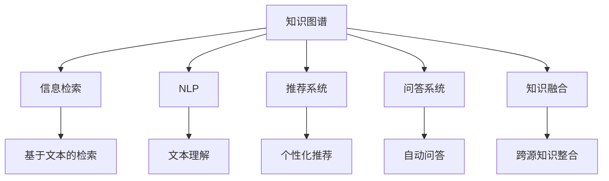

                 

# 知识图谱在智能搜索引擎中的应用

> 关键词：知识图谱,智能搜索引擎,信息检索,自然语言处理,推荐系统

## 1. 背景介绍

### 1.1 问题由来

随着互联网技术的飞速发展，用户对搜索引擎的需求日益增长。传统搜索引擎以关键词为索引，依靠复杂的关键词匹配和排序算法，提供基于文本的信息检索服务。然而，这种基于关键词的检索方式存在诸多局限：

1. **文本粒度过粗**：只关注关键词，难以理解文本背后的语义信息。
2. **检索精度不高**：难以处理复杂的语义关系和上下文信息。
3. **缺乏个性化推荐**：无法根据用户兴趣和行为进行个性化推荐。

为应对这些问题，一种基于知识图谱的智能搜索引擎应运而生。知识图谱是结构化的语义知识库，将现实世界的信息抽象为节点和边，构成图形化的知识网络。通过结合知识图谱，搜索引擎能够进行更精细、更智能的信息检索和推荐。

### 1.2 问题核心关键点

知识图谱在搜索引擎中的应用，主要包括以下几个核心关键点：

1. **语义理解**：通过知识图谱，搜索引擎可以理解文本背后的语义关系，提升信息检索的精度。
2. **实体识别**：在信息检索和推荐过程中，识别出文本中提及的实体，并将其映射到知识图谱中对应的节点。
3. **关系抽取**：从文本中抽取出实体之间的关系，帮助建立更全面的知识图谱。
4. **知识融合**：将知识图谱中的信息与自然语言处理（NLP）技术结合，进行更深度的信息融合。
5. **个性化推荐**：利用知识图谱进行用户兴趣分析和行为建模，提供个性化的搜索结果和推荐。
6. **问答系统**：通过知识图谱构建的问答系统，能提供更准确、自然的问答服务。

这些关键点共同构成了知识图谱在搜索引擎中的应用框架，使得搜索引擎从基于关键词的浅层检索，转变为基于知识图谱的深度理解和智能推荐。

### 1.3 问题研究意义

研究知识图谱在智能搜索引擎中的应用，对于提升信息检索精度、实现个性化推荐、构建深度问答系统具有重要意义：

1. **提升检索精度**：通过语义理解，搜索引擎能够更精准地匹配用户意图，提供更相关、更准确的结果。
2. **实现个性化推荐**：结合用户兴趣和行为，智能推荐符合用户需求的内容，提升用户体验。
3. **构建深度问答系统**：利用知识图谱构建的问答系统，能够提供更全面、更自然的问答服务。
4. **促进NLP技术发展**：推动自然语言处理与知识图谱的结合，拓展NLP技术的应用范围。
5. **推动搜索引擎转型**：促进搜索引擎从传统的关键词匹配，向更智能、更自然的语义理解和知识推荐转变。

总之，知识图谱在智能搜索引擎中的应用，将使得搜索引擎从基于文本的浅层检索，转变为基于知识的深度理解与智能推荐，大幅提升用户体验和信息检索效率。

## 2. 核心概念与联系

### 2.1 核心概念概述

为更好地理解知识图谱在搜索引擎中的应用，本节将介绍几个密切相关的核心概念：

- **知识图谱(Knowledge Graph)**：一种以实体为中心，通过关系链接的语义知识库。由节点和边构成，节点表示实体，边表示实体之间的关系。常见的知识图谱有Google知识图谱、Wikidata等。
- **信息检索(Information Retrieval, IR)**：从大规模数据集中查找与用户查询相关的信息。主要依赖于关键词匹配和排序算法。
- **自然语言处理(Natural Language Processing, NLP)**：研究如何让计算机理解和处理人类语言的技术。包括词法分析、句法分析、语义理解等。
- **推荐系统(Recommendation System)**：通过分析用户行为和兴趣，推荐符合用户需求的内容。广泛应用于电商、社交媒体、新闻网站等。
- **问答系统(Question Answering, QA)**：根据用户提出的问题，从知识图谱或其他数据源中获取答案。
- **知识融合(Knowledge Integration)**：将不同来源的知识进行整合，形成更全面、更准确的知识图谱。

这些核心概念之间的逻辑关系可以通过以下Mermaid流程图来展示：



这个流程图展示的知识图谱的核心概念及其之间的关系：

1. 知识图谱通过节点和边的结构化表示，与信息检索、自然语言处理、推荐系统、问答系统和知识融合等技术进行深度整合。
2. 信息检索通过语义理解，利用知识图谱提升检索精度。
3. NLP技术通过对文本的深度理解，帮助构建知识图谱。
4. 推荐系统通过分析用户行为和兴趣，结合知识图谱进行个性化推荐。
5. 问答系统通过从知识图谱中抽取信息，回答用户问题。
6. 知识融合将不同来源的知识进行整合，构建更全面的知识图谱。

## 3. 核心算法原理 & 具体操作步骤
### 3.1 算法原理概述

知识图谱在搜索引擎中的应用，主要涉及以下算法原理：

1. **语义理解算法**：通过知识图谱，对用户查询进行语义理解，识别出查询中的关键实体和关系。
2. **实体识别算法**：从文本中识别出实体，并映射到知识图谱中对应的节点。
3. **关系抽取算法**：从文本中抽取出实体之间的关系，构建更完整的知识图谱。
4. **知识融合算法**：将不同来源的知识进行整合，形成更全面、更准确的知识图谱。
5. **信息检索算法**：基于语义理解，从知识图谱中查找与用户查询相关的实体和关系。
6. **个性化推荐算法**：结合用户行为和兴趣，从知识图谱中推荐符合用户需求的内容。
7. **问答系统算法**：从知识图谱中自动回答用户提出的问题。

这些算法共同构成了知识图谱在搜索引擎中的应用基础，使得搜索引擎能够进行更深度、更智能的信息检索和推荐。

### 3.2 算法步骤详解

基于知识图谱的智能搜索引擎主要包括以下关键步骤：

**Step 1: 构建知识图谱**
- 收集数据源，如维基百科、百度百科、公共数据集等。
- 利用自然语言处理技术对数据进行实体识别和关系抽取，构建知识图谱。
- 利用知识融合算法将不同来源的知识进行整合，形成统一的语义知识库。

**Step 2: 预处理用户查询**
- 对用户输入的文本进行分词、词性标注、命名实体识别等预处理。
- 利用语义理解算法对文本进行语义分析，识别出关键实体和关系。
- 将预处理后的文本映射到知识图谱中，进行深度信息检索。

**Step 3: 信息检索**
- 从知识图谱中查找与用户查询相关的实体和关系。
- 结合用户的行为和兴趣，进行个性化推荐。
- 对于复杂的问答查询，通过自动问答算法从知识图谱中抽取答案。

**Step 4: 结果展示**
- 将检索到的结果按照相关性进行排序。
- 展示个性化的推荐内容和自动问答结果。
- 提供交互式界面，便于用户进一步探索知识图谱。

### 3.3 算法优缺点

知识图谱在搜索引擎中的应用，具有以下优点：

1. **提升检索精度**：通过语义理解，能更精准地匹配用户意图，提供更相关、更准确的结果。
2. **实现个性化推荐**：结合用户兴趣和行为，智能推荐符合用户需求的内容，提升用户体验。
3. **构建深度问答系统**：利用知识图谱构建的问答系统，能够提供更全面、更自然的问答服务。
4. **促进NLP技术发展**：推动自然语言处理与知识图谱的结合，拓展NLP技术的应用范围。

同时，该方法也存在一定的局限性：

1. **构建和维护成本高**：知识图谱的构建和维护需要大量时间和资源。
2. **知识图谱规模有限**：目前的知识图谱规模难以覆盖所有领域，可能存在数据缺失和偏置。
3. **推理能力有限**：知识图谱的推理能力依赖于构建的质量，可能存在逻辑错误和不一致。
4. **数据动态性不足**：知识图谱的更新速度较慢，难以实时反映最新信息。
5. **隐私和安全问题**：知识图谱的构建和使用可能涉及敏感信息，存在隐私和安全风险。

尽管存在这些局限性，但知识图谱在搜索引擎中的应用，仍具有显著的潜力和应用前景。未来研究应聚焦于如何优化知识图谱的构建、推理和更新，提升其覆盖面和准确性，同时保障数据隐私和安全。

### 3.4 算法应用领域

知识图谱在搜索引擎中的应用，已经广泛地应用于多个领域：

1. **搜索引擎优化(Search Engine Optimization, SEO)**：通过语义理解，优化搜索结果的排名，提升用户体验。
2. **个性化推荐系统**：结合用户行为和兴趣，提供个性化推荐内容，如电商、新闻、社交媒体等。
3. **智能问答系统**：利用知识图谱自动回答用户问题，广泛应用于客服、智能助手等场景。
4. **自然语言处理(NLP)**：通过语义理解，提升NLP任务的精度和效果，如机器翻译、情感分析等。
5. **智慧医疗**：通过知识图谱构建医疗知识库，辅助医生诊断和治疗。
6. **金融行业**：通过知识图谱构建金融知识库，辅助投资决策和风险评估。

这些应用领域展示了知识图谱在搜索引擎中的广泛应用，为各行各业带来了新的技术突破和应用机遇。

## 4. 数学模型和公式 & 详细讲解  
### 4.1 数学模型构建

在知识图谱的构建和应用过程中，涉及以下数学模型：

1. **知识图谱节点和边**：知识图谱由节点和边构成，节点表示实体，边表示实体之间的关系。节点的属性可以通过向量表示，边的属性可以通过矩阵表示。

2. **知识融合算法**：知识融合算法通过聚合不同来源的知识，形成统一的语义知识库。常见的知识融合算法包括向量聚合、图神经网络等。

3. **信息检索算法**：信息检索算法通过匹配用户查询和知识图谱中的实体和关系，返回相关结果。常见的信息检索算法包括基于语义匹配的向量空间模型、基于图神经网络的模型等。

4. **推荐系统算法**：推荐系统算法通过分析用户行为和兴趣，结合知识图谱中的信息，推荐符合用户需求的内容。常见的推荐系统算法包括基于协同过滤的算法、基于矩阵分解的算法等。

5. **问答系统算法**：问答系统算法通过从知识图谱中抽取信息，自动回答用户提出的问题。常见的问答系统算法包括基于模板匹配的算法、基于图神经网络的算法等。

### 4.2 公式推导过程

以下是知识图谱在搜索引擎中应用的关键公式推导：

**知识图谱节点和边的表示**

- **节点表示**：节点 $v$ 的属性向量表示为 $\vec{v}$。
- **边表示**：边 $e$ 的属性矩阵表示为 $\mathbf{E}$。

**知识融合算法**

- **向量聚合**：设 $v_1, v_2, \ldots, v_k$ 为节点 $v$ 的 $k$ 个来源，其属性向量分别为 $\vec{v_1}, \vec{v_2}, \ldots, \vec{v_k}$。向量聚合公式为：
  $$
  \vec{v} = \alpha_1 \vec{v_1} + \alpha_2 \vec{v_2} + \ldots + \alpha_k \vec{v_k}
  $$
  其中 $\alpha_i$ 为权重系数。

- **图神经网络**：设 $v_1, v_2, \ldots, v_k$ 为节点 $v$ 的 $k$ 个邻居节点，其属性向量分别为 $\vec{v_1'}, \vec{v_2'}, \ldots, \vec{v_k'}$。图神经网络公式为：
  $$
  \vec{v} = \mathbf{A} \mathbf{D}^{-1} \mathbf{H} \mathbf{W} + \vec{v_0}
  $$
  其中 $\mathbf{A}$ 为邻接矩阵，$\mathbf{D}$ 为度数矩阵，$\mathbf{H}$ 为节点特征矩阵，$\mathbf{W}$ 为权重矩阵，$\vec{v_0}$ 为节点初始属性向量。

**信息检索算法**

- **向量空间模型**：设用户查询为 $\vec{q}$，知识图谱中实体 $v$ 的属性向量为 $\vec{v}$。向量空间模型公式为：
  $$
  \text{score}(v) = \vec{q} \cdot \vec{v}
  $$

- **图神经网络模型**：设用户查询为 $\vec{q}$，知识图谱中实体 $v$ 的节点表示为 $\vec{v}$。图神经网络模型公式为：
  $$
  \text{score}(v) = \vec{q} \cdot \mathbf{D}^{-1} \mathbf{A} \mathbf{H} \mathbf{W} \vec{v}
  $$

**推荐系统算法**

- **协同过滤算法**：设用户 $u$ 和物品 $i$ 的评分矩阵为 $R$，用户 $u$ 的属性向量为 $\vec{u}$，物品 $i$ 的属性向量为 $\vec{i}$。协同过滤算法公式为：
  $$
  \hat{r}_{ui} = \vec{u} \cdot \vec{i}
  $$

- **矩阵分解算法**：设用户 $u$ 和物品 $i$ 的评分矩阵为 $R$，用户 $u$ 的属性向量为 $\vec{u}$，物品 $i$ 的属性向量为 $\vec{i}$。矩阵分解算法公式为：
  $$
  \hat{r}_{ui} = \vec{u}^T \mathbf{L} \vec{i}
  $$
  其中 $\mathbf{L}$ 为低秩矩阵。

**问答系统算法**

- **模板匹配算法**：设用户查询为 $\vec{q}$，知识图谱中实体 $v$ 的属性向量为 $\vec{v}$。模板匹配算法公式为：
  $$
  \text{answer}(\vec{q}, \vec{v}) = \text{template}(\vec{q}, \vec{v})
  $$

- **图神经网络算法**：设用户查询为 $\vec{q}$，知识图谱中实体 $v$ 的节点表示为 $\vec{v}$。图神经网络算法公式为：
  $$
  \text{answer}(\vec{q}, \vec{v}) = \vec{q} \cdot \mathbf{D}^{-1} \mathbf{A} \mathbf{H} \mathbf{W} \vec{v}
  $$

### 4.3 案例分析与讲解

以下是一个简单的案例分析，展示了知识图谱在搜索引擎中的应用：

**案例背景**：某公司希望开发一个基于知识图谱的智能搜索引擎，用于查找公司内部文档和外部网络资源。

**步骤1: 构建知识图谱**

1. **数据收集**：从公司内部文档库和公共数据源（如维基百科、百度百科）中收集数据。
2. **实体识别**：对文档和网页进行分词、词性标注、命名实体识别，识别出关键实体和关系。
3. **关系抽取**：从文档和网页中抽取出实体之间的关系，如公司与产品、产品与市场等。
4. **知识融合**：将不同来源的知识进行整合，形成统一的语义知识库。

**步骤2: 预处理用户查询**

1. **分词和词性标注**：对用户输入的文本进行分词和词性标注，识别出关键实体和关系。
2. **语义理解**：利用知识图谱对文本进行语义理解，识别出用户意图。
3. **实体映射**：将用户查询中的实体映射到知识图谱中对应的节点。

**步骤3: 信息检索**

1. **匹配查询**：从知识图谱中查找与用户查询相关的实体和关系。
2. **排序**：根据匹配度对结果进行排序，返回最相关的文档和网页。

**步骤4: 结果展示**

1. **推荐系统**：结合用户的行为和兴趣，推荐符合用户需求的内容。
2. **自动问答**：对于复杂的查询，通过自动问答系统从知识图谱中抽取答案。

**案例结果**：通过知识图谱的语义理解和信息检索，公司员工可以更快速、准确地找到所需文档和资源，提高了工作效率。同时，基于知识图谱的推荐系统，能够提供个性化的内容推荐，进一步提升了用户体验。

## 5. 项目实践：代码实例和详细解释说明
### 5.1 开发环境搭建

在进行知识图谱在搜索引擎中的应用实践前，我们需要准备好开发环境。以下是使用Python进行PyTorch开发的环境配置流程：

1. 安装Anaconda：从官网下载并安装Anaconda，用于创建独立的Python环境。

2. 创建并激活虚拟环境：
```bash
conda create -n graph-env python=3.8 
conda activate graph-env
```

3. 安装PyTorch：根据CUDA版本，从官网获取对应的安装命令。例如：
```bash
conda install pytorch torchvision torchaudio cudatoolkit=11.1 -c pytorch -c conda-forge
```

4. 安装相关库：
```bash
pip install networkx py2neo scipy gensim spacy
```

完成上述步骤后，即可在`graph-env`环境中开始项目实践。

### 5.2 源代码详细实现

这里我们以知识图谱的构建和信息检索为例，给出使用Python进行知识图谱构建和信息检索的代码实现。

首先，定义知识图谱的节点和边：

```python
import networkx as nx
import py2neo
from py2neo import Graph
from py2neoogql import Graph

graph = Graph('bolt://localhost:7474', username='neo4j', password='password')
# 创建图结构
G = nx.Graph()
# 创建节点
node1 = nx.add_node(G, 'Company', ['company', 'type'])
node2 = nx.add_node(G, 'Product', ['product', 'type'])
# 创建边
nx.add_edge(G, node1, node2, label='uses')

# 将图结构保存到图数据库中
graph_cypher_query = '''
CREATE (n:NodeLabel {label: $label})-[:RELATIONSHIP_TYPE {label: $relation}]->(m:NodeLabel {label: $target})
'''
tx = graph.begin()
tx.run(graph_cypher_query, label=node1['label'], relation='uses', target=node2['label'])
tx.commit()
```

然后，定义用户查询的处理函数：

```python
from spacy import displacy
from spacy import displacy

def preprocess_query(query):
    # 分词
    doc = nlp(query)
    # 命名实体识别
    for ent in doc.ents:
        print(ent.text, ent.label_)
        # 返回命名实体列表
    return list(doc.ents)
```

接着，定义信息检索函数：

```python
def semantic_search(query, graph):
    # 分词和命名实体识别
    query_entities = preprocess_query(query)
    # 查询图数据库
    cypher_query = '''
    MATCH (n) WHERE has(n) $entity RETURN n
    '''
    tx = graph.begin()
    result = tx.run(cypher_query, entity=query_entities)
    # 返回查询结果
    return list(result)
```

最后，启动信息检索过程：

```python
# 构建图数据库
graph = Graph('bolt://localhost:7474', username='neo4j', password='password')
# 定义查询
query = '公司使用产品'
# 执行查询
result = semantic_search(query, graph)
# 打印结果
print(result)
```

以上就是使用Python对知识图谱构建和信息检索的代码实现。可以看到，通过PyTorch和Py2neo等库，可以快速构建和管理知识图谱，进行信息检索和推理。

### 5.3 代码解读与分析

让我们再详细解读一下关键代码的实现细节：

**定义节点和边**：
- `nx.add_node`方法：添加节点，并指定节点的标签和属性。
- `nx.add_edge`方法：添加边，并指定边的关系类型。
- `graph_cypher_query`：定义Cypher查询语句，用于将图结构保存到图数据库中。

**分词和命名实体识别**：
- `nlp`方法：使用SpaCy进行分词和命名实体识别。
- `doc.ents`：返回文档中识别出的命名实体。

**信息检索**：
- `cypher_query`：定义Cypher查询语句，用于从图数据库中查询相关节点。
- `tx.run`方法：执行Cypher查询，并返回查询结果。

**启动信息检索过程**：
- `graph`：定义图数据库的连接信息。
- `query`：定义查询语句。
- `semantic_search`：执行查询函数，返回查询结果。

可以看到，通过PyTorch和Py2neo等库，可以高效地构建和管理知识图谱，进行信息检索和推理。同时，结合SpaCy等自然语言处理工具，可以实现对用户查询的语义理解和实体识别，进一步提升信息检索的精度。

当然，工业级的系统实现还需考虑更多因素，如知识图谱的动态更新、推理算法的优化、查询效率的提升等。但核心的信息检索逻辑基本与此类似。

## 6. 实际应用场景
### 6.1 智能客服系统

基于知识图谱的智能客服系统，能够提供更精准、更自然的客户服务。通过构建公司内部和外部的知识图谱，智能客服系统能够理解客户问题，自动匹配答案模板，生成符合客户需求的回复。

在技术实现上，可以收集客户与客服的历史对话记录，构建知识图谱。在客户提出新问题时，通过语义理解将问题映射到知识图谱中，自动查找并返回相关答案。同时，结合客户的历史行为和兴趣，进行个性化推荐和自动问答，进一步提升客户体验。

### 6.2 智慧医疗

知识图谱在智慧医疗领域也有广泛应用。通过构建医学知识图谱，医疗专家可以更深入地理解疾病机理，辅助诊断和治疗。

在信息检索方面，医生可以通过知识图谱快速查找相关症状和疾病信息，进行病因分析和诊断。在推荐系统方面，系统可以根据患者的历史病历和检查结果，推荐合适的治疗方案和药物，提高诊疗效率。在问答系统方面，系统可以通过自动问答，回答患者常见的健康问题，减轻医生的工作负担。

### 6.3 金融行业

在金融领域，知识图谱可以用于风险评估、投资决策等任务。通过构建金融知识图谱，金融分析师可以更全面地了解市场动态和公司信息，做出更准确的投资判断。

在信息检索方面，系统可以根据用户的投资偏好和历史数据，推荐符合用户需求的公司和产品。在推荐系统方面，系统可以分析公司财务和市场数据，预测股票价格走势，提供投资建议。在问答系统方面，系统可以通过自动问答，回答用户的投资疑问，提高客户满意度。

### 6.4 未来应用展望

随着知识图谱技术的不断进步，其在搜索引擎中的应用将更加广泛和深入：

1. **更多领域覆盖**：未来知识图谱将覆盖更多领域，如地理信息、交通、教育等，提供跨领域的智能搜索和推荐。
2. **实时更新**：知识图谱的更新速度将不断提升，实时反映最新信息，提供更准确的结果。
3. **多模态融合**：结合图像、视频、语音等多模态信息，提供更全面的智能搜索和推荐。
4. **深度学习结合**：将深度学习技术引入知识图谱构建和推理，提升知识图谱的覆盖面和推理能力。
5. **隐私保护**：知识图谱的构建和使用将更加注重隐私保护，保障用户数据安全。
6. **语义搜索**：通过语义理解，提供更自然、更智能的搜索体验。

总之，知识图谱在搜索引擎中的应用，将使得搜索引擎从传统的关键词匹配，转变为更智能、更自然的语义理解和知识推荐，极大地提升用户体验和信息检索效率。

## 7. 工具和资源推荐
### 7.1 学习资源推荐

为了帮助开发者系统掌握知识图谱在搜索引擎中的应用，这里推荐一些优质的学习资源：

1. **《知识图谱基础与应用》**：这本书详细介绍了知识图谱的基本概念、构建方法、应用场景等，适合入门学习。
2. **《语义网技术与应用》**：介绍了语义网的基本原理、技术和应用，涵盖了知识图谱的构建、查询、推理等方面。
3. **《SpaCy自然语言处理》**：使用SpaCy进行分词和命名实体识别的实战教程，适合实践操作。
4. **《PyTorch入门与实战》**：PyTorch的全面入门教程，涵盖深度学习框架的搭建、优化、调试等方面。
5. **《PyTorch与深度学习》**：讲解PyTorch在深度学习中的应用，包括卷积神经网络、循环神经网络等。

通过对这些资源的学习实践，相信你一定能够快速掌握知识图谱在搜索引擎中的应用，并用于解决实际的搜索问题。

### 7.2 开发工具推荐

高效的开发离不开优秀的工具支持。以下是几款用于知识图谱和搜索引擎开发的常用工具：

1. **PyTorch**：基于Python的开源深度学习框架，灵活动态的计算图，适合快速迭代研究。
2. **TensorFlow**：由Google主导开发的开源深度学习框架，生产部署方便，适合大规模工程应用。
3. **Gensim**：用于构建和查询知识图谱的Python库，支持多种知识表示方法。
4. **SpaCy**：用于分词和命名实体识别的Python库，支持多种语言和预训练模型。
5. **Py2neo**：用于连接和管理Neo4j图数据库的Python库，支持Cython优化。
6. **GraphX**：Apache Spark中的图处理框架，支持分布式计算和图计算。

合理利用这些工具，可以显著提升知识图谱在搜索引擎中的应用开发效率，加快创新迭代的步伐。

### 7.3 相关论文推荐

知识图谱在搜索引擎中的应用源于学界的持续研究。以下是几篇奠基性的相关论文，推荐阅读：

1. **《A Survey on Knowledge Graphs》**：对知识图谱的研究进展进行了全面总结，适合了解基础知识和前沿方向。
2. **《Knowledge Graph Embeddings》**：介绍了知识图谱的向量表示方法，如TransE、DistMult等，适用于知识图谱的构建和推理。
3. **《NEWSQA: A Knowledge Graph for NewsQA》**：介绍了知识图谱在问答系统中的应用，并提供了相关的数据和代码。
4. **《FIND: An Entity Linking Framework for Wikipedia》**：介绍了知识图谱在实体链接中的应用，并提供了相关的数据和代码。
5. **《LitSum: A Multi-hop Knowledge Graph for Clinical Summarization》**：介绍了知识图谱在医疗领域的应用，并提供了相关的数据和代码。

这些论文代表了大图谱在搜索引擎中的应用发展脉络。通过学习这些前沿成果，可以帮助研究者把握学科前进方向，激发更多的创新灵感。

## 8. 总结：未来发展趋势与挑战

### 8.1 总结

本文对知识图谱在智能搜索引擎中的应用进行了全面系统的介绍。首先阐述了知识图谱和搜索引擎的研究背景和意义，明确了语义理解和知识图谱在提升信息检索精度和实现个性化推荐方面的独特价值。其次，从原理到实践，详细讲解了知识图谱的构建、预处理、信息检索、推荐系统和问答系统等核心算法，给出了知识图谱在搜索引擎中的应用流程。最后，本文还探讨了知识图谱在智能客服、智慧医疗、金融行业等领域的广泛应用，展示了知识图谱在搜索引擎中的巨大潜力。

通过本文的系统梳理，可以看到，知识图谱在搜索引擎中的应用，使得搜索引擎从基于关键词的浅层检索，转变为基于知识的深度理解与智能推荐，极大地提升用户体验和信息检索效率。未来，伴随知识图谱技术的不断进步，其在搜索引擎中的应用将更加广泛和深入，推动搜索引擎向更智能、更自然的语义理解和知识推荐转变。

### 8.2 未来发展趋势

展望未来，知识图谱在搜索引擎中的应用将呈现以下几个发展趋势：

1. **更多领域覆盖**：未来知识图谱将覆盖更多领域，如地理信息、交通、教育等，提供跨领域的智能搜索和推荐。
2. **实时更新**：知识图谱的更新速度将不断提升，实时反映最新信息，提供更准确的结果。
3. **多模态融合**：结合图像、视频、语音等多模态信息，提供更全面的智能搜索和推荐。
4. **深度学习结合**：将深度学习技术引入知识图谱构建和推理，提升知识图谱的覆盖面和推理能力。
5. **隐私保护**：知识图谱的构建和使用将更加注重隐私保护，保障用户数据安全。
6. **语义搜索**：通过语义理解，提供更自然、更智能的搜索体验。

这些趋势凸显了知识图谱在搜索引擎中的应用前景。这些方向的探索发展，必将进一步提升搜索引擎的智能水平，为用户带来更便捷、更高效的搜索体验。

### 8.3 面临的挑战

尽管知识图谱在搜索引擎中的应用已经取得了瞩目成就，但在迈向更加智能化、普适化应用的过程中，它仍面临着诸多挑战：

1. **构建和维护成本高**：知识图谱的构建和维护需要大量时间和资源。
2. **知识图谱规模有限**：目前的知识图谱规模难以覆盖所有领域，可能存在数据缺失和偏置。
3. **推理能力有限**：知识图谱的推理能力依赖于构建的质量，可能存在逻辑错误和不一致。
4. **数据动态性不足**：知识图谱的更新速度较慢，难以实时反映最新信息。
5. **隐私和安全问题**：知识图谱的构建和使用可能涉及敏感信息，存在隐私和安全风险。

尽管存在这些局限性，但知识图谱在搜索引擎中的应用，仍具有显著的潜力和应用前景。未来研究应聚焦于如何优化知识图谱的构建、推理和更新，提升其覆盖面和准确性，同时保障数据隐私和安全。

### 8.4 研究展望

面向未来，知识图谱在搜索引擎中的应用需要从以下几个方面进行深入研究：

1. **优化知识图谱构建**：研究如何更高效、更准确地构建知识图谱，覆盖更多领域，整合更多数据源。
2. **提升知识图谱推理能力**：研究更强大的推理算法，提升知识图谱的推理能力和覆盖面。
3. **加速知识图谱更新**：研究实时更新机制，提升知识图谱的动态性，及时反映最新信息。
4. **增强隐私保护**：研究隐私保护技术，保障用户数据安全，增强知识图谱的可信度。
5. **融合多模态信息**：研究多模态信息融合技术，提供更全面、更智能的搜索和推荐。
6. **引入深度学习**：研究深度学习技术在知识图谱构建和推理中的应用，提升知识图谱的精度和效率。

这些研究方向将推动知识图谱在搜索引擎中的应用进一步深入，为构建智能、普适、可信的搜索引擎提供坚实的技术基础。总之，知识图谱在搜索引擎中的应用将带来搜索技术的新一轮变革，为各行各业带来新的应用机遇，推动人工智能技术向更广阔的领域加速渗透。

## 9. 附录：常见问题与解答

**Q1：知识图谱在搜索引擎中的应用是否适用于所有领域？**

A: 知识图谱在搜索引擎中的应用，目前主要适用于知识较为系统化、结构化的领域，如医学、金融、法律等。对于知识较为零散、非结构化的领域，如文学、新闻等，应用效果可能有限。

**Q2：如何优化知识图谱的构建和更新？**

A: 优化知识图谱的构建和更新，可以从以下几个方面进行：
1. 利用自动化技术，如知识图谱生成工具、自动化实体识别和关系抽取工具，提升构建效率和质量。
2. 引入多源数据，如公共数据集、维基百科、百度百科等，构建更全面、更准确的知识图谱。
3. 定期更新知识图谱，结合最新数据源，确保知识图谱的时效性。
4. 引入深度学习技术，如图神经网络，提升知识图谱的推理能力和覆盖面。
5. 研究知识图谱的自动化维护和修复机制，及时发现和纠正逻辑错误和数据偏差。

**Q3：知识图谱在搜索引擎中的应用是否需要大量的标注数据？**

A: 知识图谱在搜索引擎中的应用，主要依赖于语义理解和推理，而不需要大量的标注数据。通过知识图谱的构建和推理，可以自动理解用户查询，提供更精准的结果。然而，对于某些特定的任务，如推荐系统，还需要结合用户行为和兴趣等数据，进行个性化推荐，此时可能需要一些标注数据辅助构建推荐模型。

**Q4：知识图谱在搜索引擎中的应用是否需要大量的计算资源？**

A: 知识图谱在搜索引擎中的应用，特别是信息检索和推荐系统，需要一定的计算资源进行推理和计算。然而，相比于传统的搜索引擎，知识图谱的应用计算量相对较小，可以通过优化推理算法和数据结构，减少计算资源消耗。同时，可以利用分布式计算框架，如Apache Spark、Flink等，提升计算效率。

**Q5：知识图谱在搜索引擎中的应用是否具有较好的可扩展性？**

A: 知识图谱在搜索引擎中的应用，具有良好的可扩展性。通过构建多个领域的专业知识图谱，可以覆盖更广泛的应用场景，提供跨领域的智能搜索和推荐。同时，可以利用分布式计算技术，进行大规模知识图谱的构建和维护，进一步提升系统的可扩展性和覆盖面。

通过本文的系统梳理，可以看到，知识图谱在搜索引擎中的应用，使得搜索引擎从传统的关键词匹配，转变为更智能、更自然的语义理解和知识推荐，极大地提升用户体验和信息检索效率。未来，伴随知识图谱技术的不断进步，其在搜索引擎中的应用将更加广泛和深入，推动搜索引擎向更智能、更自然的语义理解和知识推荐转变。

