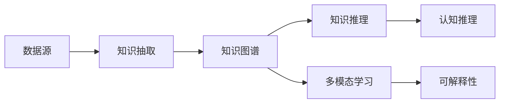

                 

# 知识图谱：知识的高速公路网

> 关键词：知识图谱,图神经网络,知识抽取,知识融合,多模态学习,认知推理,可解释性,领域本体

## 1. 背景介绍

### 1.1 问题由来

随着互联网技术的迅猛发展，海量数据的产生与积累，以及人类知识的爆炸式增长，知识的获取、组织、存储和利用正面临着前所未有的挑战。传统的数据库和搜索技术已无法满足日益复杂的信息需求。人们需要一种全新的技术手段来理解和利用知识，使之能够被机器智能地检索、推理、应用。

知识图谱（Knowledge Graph）作为一种新兴的知识表示与组织方法，正是在这样的背景下应运而生。知识图谱以结构化的知识图形式，将实体、关系和属性整合并结构化，为知识检索、推理、问答等任务提供了强有力的支持。

### 1.2 问题核心关键点

知识图谱由节点（实体）和边（关系）构成，以图的形式表示实体之间的关系和属性。其核心功能包括：
- **知识抽取**：从自然语言文本中识别实体和关系，建立知识图谱。
- **知识融合**：将不同来源的知识图谱进行整合，生成更大规模、更全面的知识图谱。
- **知识推理**：基于知识图谱进行认知推理，解决诸如逻辑悖论、事实判断等问题。
- **多模态学习**：将文本、图像、语音等多种形式的知识进行融合，增强推理能力。
- **可解释性**：赋予机器推理过程可解释性，提升系统的信任度。

知识图谱技术的成功应用，可显著提升信息检索的准确性和效率，推动认知计算与知识管理的发展，使智能系统更加智能化、人性化。

### 1.3 问题研究意义

研究知识图谱技术，对于实现知识自动化处理、推动认知智能技术的演进具有重要意义：
1. 提升信息检索的精度和效率。知识图谱能够基于结构化的知识进行高效的图匹配和推理，快速定位信息。
2. 促进领域本体的构建。知识图谱可以作为领域本体，为各类专业领域的知识管理和应用提供支持。
3. 增强系统推理能力。知识图谱结合认知推理技术，提升系统的逻辑判断和事实推理能力，拓展应用场景。
4. 增强系统可解释性。知识图谱的可视化与语义表示，使得推理过程透明化，提升系统的信任度和接受度。
5. 加速认知计算的发展。知识图谱作为认知计算的基础设施，为自然语言理解、智能问答等任务提供基础支撑。

## 2. 核心概念与联系

### 2.1 核心概念概述

在知识图谱技术中，以下核心概念构成了其完整的知识处理框架：

- **节点(Node)**：知识图谱中的节点代表实体，是知识的基本组成单元。实体可以是人、组织、地点、事件等。
- **边(Edge)**：知识图谱中的边代表实体之间的关系，如父子关系、空间位置关系等。
- **属性(Attribute)**：节点或边可能包含属性，用于进一步描述实体的特征。
- **本体(Ontology)**：知识图谱的逻辑框架，定义了实体和关系的基本结构。
- **图(Graph)**：由节点和边构成的知识图谱，用于表示实体间的复杂关系和属性。
- **嵌入(Embedding)**：将节点和边映射到低维向量空间，方便计算和推理。

这些概念之间的逻辑关系可以通过以下Mermaid流程图来展示：

```mermaid
graph TB
    A[节点(Node)] --> B[边(Edge)]
    B --> C[属性(Attribute)]
    A --> D[本体(Ontology)]
    D --> E[图(Graph)]
    A --> F[嵌入(Embedding)]
```

### 2.2 核心概念原理和架构

知识图谱的构建和应用涉及以下核心步骤：

1. **知识抽取**：从非结构化数据中识别实体和关系，建立知识图谱。常见方法包括基于规则的方法、基于统计的方法和深度学习方法。
2. **知识融合**：将不同来源的知识图谱进行整合并扩充，形成更大规模的知识图谱。
3. **知识推理**：利用图神经网络(Graph Neural Network, GNN)等方法，基于知识图谱进行认知推理，解决逻辑悖论、事实判断等。
4. **多模态学习**：将文本、图像、语音等多种形式的知识进行融合，增强推理能力。
5. **认知推理**：利用认知计算技术，提升系统的逻辑判断和事实推理能力。
6. **可解释性**：通过可解释性技术，使推理过程透明化，提升系统的信任度。

以下是一个简化的知识图谱架构图：



## 3. 核心算法原理 & 具体操作步骤

### 3.1 算法原理概述

知识图谱的构建和推理主要依赖于图神经网络(GNN)技术。GNN是一种基于图结构的神经网络模型，能够捕捉节点和边之间的复杂关系，实现高效的图匹配和推理。

知识图谱的构建过程大致分为以下几个步骤：

1. **实体抽取**：从文本中识别出具体的实体。
2. **关系抽取**：识别实体之间的关系。
3. **属性抽取**：提取实体的属性信息。
4. **图构建**：将抽取出的实体、关系和属性整合成知识图谱。

知识图谱的推理过程主要涉及以下步骤：

1. **嵌入表示**：将知识图谱中的实体和关系嵌入到低维向量空间中。
2. **图匹配**：基于嵌入向量进行图匹配，查找符合条件的关系链。
3. **逻辑推理**：利用逻辑推理规则，基于匹配结果进行推理。

### 3.2 算法步骤详解

知识图谱的构建步骤一般如下：

1. **数据预处理**：清洗并格式化原始数据，去除噪声和冗余信息。
2. **实体识别**：基于规则或机器学习方法，从文本中识别出实体。
3. **关系抽取**：识别实体之间的关系，通常采用基于规则、统计或深度学习的方法。
4. **属性抽取**：提取实体的属性信息，通常通过正则表达式或命名实体识别方法。
5. **图构建**：将识别出的实体、关系和属性整合成知识图谱，构建为邻接矩阵或边列表。

知识图谱的推理过程一般如下：

1. **嵌入表示**：使用GNN模型对实体和关系进行嵌入，得到低维向量表示。
2. **图匹配**：基于嵌入向量进行图匹配，查找符合条件的关系链。
3. **逻辑推理**：利用逻辑推理规则，基于匹配结果进行推理，得到推理结果。

### 3.3 算法优缺点

知识图谱技术具有以下优点：
- 结构化知识表示：知识图谱提供了结构化的知识表示方式，方便知识检索和推理。
- 图神经网络支持：知识图谱结合图神经网络技术，能够高效地处理图结构数据，实现复杂推理。
- 多模态融合：知识图谱支持将多种形式的知识进行融合，提升推理能力。
- 可解释性：知识图谱提供了推理过程的透明性，提升了系统的可信度。

同时，知识图谱也存在以下局限性：
- 数据噪声：知识抽取过程容易受到数据噪声的影响，导致图谱质量下降。
- 计算复杂度高：大规模知识图谱的构建和推理计算复杂度高，需要高性能计算资源。
- 本体依赖：知识图谱依赖于领域本体的质量，本体构建成本高，易出错。
- 推理效率低：知识图谱推理过程复杂，推理效率相对较低。

### 3.4 算法应用领域

知识图谱技术已经在多个领域取得了广泛应用：

- **智能问答系统**：利用知识图谱实现智能问答，提升系统的回答准确率和用户体验。
- **推荐系统**：结合知识图谱，实现个性化推荐，提升推荐效果。
- **自然语言处理(NLP)**：利用知识图谱提高语义理解和知识推理能力。
- **搜索引擎**：利用知识图谱进行知识增强搜索，提升搜索结果的相关性和准确性。
- **医疗领域**：构建医疗知识图谱，辅助医生进行疾病诊断和医疗知识管理。

## 4. 数学模型和公式 & 详细讲解 & 举例说明

### 4.1 数学模型构建

知识图谱的数学模型主要涉及以下几个部分：

1. **节点表示**：将节点表示为低维向量 $\mathbf{v}_i$，$i$ 表示节点编号。
2. **关系表示**：将关系表示为矩阵 $\mathbf{A}$，$i$ 和 $j$ 表示节点编号。
3. **逻辑推理**：基于逻辑规则进行推理，得到推理结果。

### 4.2 公式推导过程

以一个简单的知识图谱为例，其数学模型如下：

设知识图谱中有两个节点 $i$ 和 $j$，它们之间存在一种关系 $r$。则节点 $i$ 和 $j$ 的向量表示分别为 $\mathbf{v}_i$ 和 $\mathbf{v}_j$，关系 $r$ 的矩阵表示为 $\mathbf{A}_{ij}$。

根据知识图谱的嵌入表示，节点之间的相似度可以通过点积计算得到：

$$
\mathbf{v}_i \cdot \mathbf{v}_j = \sum_k v_{ik} v_{jk}
$$

其中 $k$ 表示节点的维度，$v_{ik}$ 和 $v_{jk}$ 分别表示节点 $i$ 和 $j$ 在维度 $k$ 上的值。

### 4.3 案例分析与讲解

以一个简单的医疗知识图谱为例，其逻辑推理过程如下：

1. **节点表示**：将医疗疾病表示为节点，属性如症状、治疗方式等表示为节点属性。
2. **关系表示**：将节点之间的因果关系、包含关系等表示为矩阵 $\mathbf{A}$。
3. **逻辑推理**：基于知识图谱进行逻辑推理，如根据症状判断疾病，根据治疗方式推断效果等。

例如，基于知识图谱进行疾病诊断的过程如下：

1. **输入症状**：患者输入症状节点，如“头痛”。
2. **匹配关系**：查找与“头痛”相关的节点，如“偏头痛”。
3. **推理诊断**：根据“偏头痛”的节点属性（如“治疗方式”），推断出相应的诊断结果（如“使用止疼药”）。

## 5. 项目实践：代码实例和详细解释说明

### 5.1 开发环境搭建

在进行知识图谱项目开发前，我们需要准备好开发环境。以下是使用Python进行PyTorch和GNN开发的环境配置流程：

1. 安装Anaconda：从官网下载并安装Anaconda，用于创建独立的Python环境。

2. 创建并激活虚拟环境：
```bash
conda create -n gnn-env python=3.8 
conda activate gnn-env
```

3. 安装PyTorch：根据CUDA版本，从官网获取对应的安装命令。例如：
```bash
conda install pytorch torchvision torchaudio cudatoolkit=11.1 -c pytorch -c conda-forge
```

4. 安装PyG：PyTorch的图形处理库，用于处理图结构数据。
```bash
pip install pytorch-geometric
```

5. 安装TensorBoard：用于可视化模型训练和推理过程。
```bash
pip install tensorboard
```

完成上述步骤后，即可在`gnn-env`环境中开始GNN微调实践。

### 5.2 源代码详细实现

下面我们以基于知识图谱的智能问答系统为例，给出使用PyTorch和PyG进行GNN微调的PyTorch代码实现。

首先，定义问答系统的知识图谱类：

```python
from pytorch_geometric.nn import GATConv
from torch import nn

class KnowledgeGraph(nn.Module):
    def __init__(self, n_entities, n_relations, n_nodes, n_embedding):
        super(KnowledgeGraph, self).__init__()
        self.gconv = GATConv(n_nodes, n_nodes, heads=1, dropout=0.1)
        self.linear = nn.Linear(n_nodes, n_relations)
        self.embedding = nn.Embedding(n_entities, n_embedding)
        
    def forward(self, x, edge_index):
        x = self.embedding(x)
        x = self.gconv(x, edge_index)
        x = self.linear(x)
        return x
```

然后，定义训练函数和评估函数：

```python
from torch.optim import Adam
from torch.utils.data import DataLoader
import torch.nn.functional as F

def train_epoch(model, dataset, optimizer):
    model.train()
    optimizer.zero_grad()
    x, edge_index = dataset[0]
    x = model(x, edge_index)
    loss = F.mse_loss(x, dataset.y)
    loss.backward()
    optimizer.step()
    return loss.item()

def evaluate(model, dataset):
    model.eval()
    x, edge_index = dataset[0]
    x = model(x, edge_index)
    loss = F.mse_loss(x, dataset.y)
    return loss.item()
```

最后，启动训练流程并在测试集上评估：

```python
epochs = 5
n_entities = 10
n_relations = 5
n_nodes = 50
n_embedding = 100

model = KnowledgeGraph(n_entities, n_relations, n_nodes, n_embedding)
optimizer = Adam(model.parameters(), lr=0.001)

train_dataset = ...
dev_dataset = ...
test_dataset = ...

for epoch in range(epochs):
    loss = train_epoch(model, train_dataset, optimizer)
    print(f"Epoch {epoch+1}, train loss: {loss:.3f}")
    
    print(f"Epoch {epoch+1}, dev results:")
    loss = evaluate(model, dev_dataset)
    print(f"Epoch {epoch+1}, dev loss: {loss:.3f}")
    
print("Test results:")
loss = evaluate(model, test_dataset)
print(f"Test loss: {loss:.3f}")
```

以上就是使用PyTorch和PyG对知识图谱进行智能问答系统微调的完整代码实现。可以看到，得益于PyG库的强大封装，我们可以用相对简洁的代码完成知识图谱的构建和GNN模型的训练。

### 5.3 代码解读与分析

让我们再详细解读一下关键代码的实现细节：

**KnowledgeGraph类**：
- `__init__`方法：初始化知识图谱的GATConv层、线性层和嵌入层。
- `forward`方法：定义前向传播过程，包括节点嵌入表示、图卷积和线性映射。

**train_epoch和evaluate函数**：
- `train_epoch`函数：定义训练过程，包括前向传播、计算损失、反向传播和更新参数。
- `evaluate`函数：定义评估过程，包括前向传播和计算损失。

**训练流程**：
- 定义总的epoch数和相关参数，开始循环迭代
- 每个epoch内，在训练集上训练，输出平均loss
- 在验证集上评估，输出验证集loss
- 所有epoch结束后，在测试集上评估，给出最终测试结果

可以看到，PyG库使得知识图谱的微调过程变得简洁高效。开发者可以将更多精力放在数据处理、模型改进等高层逻辑上，而不必过多关注底层的实现细节。

当然，工业级的系统实现还需考虑更多因素，如模型的保存和部署、超参数的自动搜索、更灵活的任务适配层等。但核心的微调范式基本与此类似。

## 6. 实际应用场景

### 6.1 医疗领域

在医疗领域，知识图谱技术可以用于辅助医生进行疾病诊断和治疗方案推荐。通过构建医疗知识图谱，医生可以更快速、准确地了解患者病情，并提供个性化的治疗建议。例如，基于知识图谱进行症状诊断的过程如下：

1. **输入症状**：患者输入症状节点，如“头痛”。
2. **匹配关系**：查找与“头痛”相关的节点，如“偏头痛”。
3. **推理诊断**：根据“偏头痛”的节点属性（如“治疗方式”），推断出相应的诊断结果（如“使用止疼药”）。

### 6.2 金融领域

在金融领域，知识图谱技术可以用于实时监测市场舆情，识别潜在的风险和机会。通过构建金融知识图谱，系统可以实时分析股票、新闻、评论等数据，预测市场走势和风险。例如，基于知识图谱进行市场预测的过程如下：

1. **输入数据**：输入市场舆情数据，如股票价格、新闻评论等。
2. **匹配关系**：查找与市场数据相关的节点，如“公司财报”、“市场分析”等。
3. **推理预测**：根据匹配节点的属性（如“财务指标”、“专家预测”），推断出市场走势和风险。

### 6.3 电商领域

在电商领域，知识图谱技术可以用于个性化推荐和广告投放。通过构建电商知识图谱，系统可以分析用户行为和商品属性，提供精准的推荐和广告。例如，基于知识图谱进行商品推荐的过程如下：

1. **输入用户行为**：输入用户的浏览、购买历史等行为数据。
2. **匹配关系**：查找与用户行为相关的节点，如“热门商品”、“同类商品”等。
3. **推理推荐**：根据匹配节点的属性（如“商品评分”、“用户评价”），推断出用户的推荐商品。

## 7. 工具和资源推荐

### 7.1 学习资源推荐

为了帮助开发者系统掌握知识图谱的理论基础和实践技巧，这里推荐一些优质的学习资源：

1. **《Graph Neural Networks: A Review of Methods and Applications》**：深度学习领域的经典综述，涵盖了图神经网络的理论和应用。
2. **Stanford CS224S《Graph Neural Networks》课程**：斯坦福大学开设的图神经网络课程，有Lecture视频和配套作业，详细介绍了图神经网络的原理和应用。
3. **《Knowledge Graphs: A Very Short Introduction》**：知识图谱领域的入门书籍，介绍了知识图谱的基本概念和构建方法。
4. **ZhiFuLong**：开源知识图谱构建工具，提供了丰富的预训练模型和示例代码。
5. **TigerGraph**：商业化的图数据库，支持大规模图数据的存储和处理，是构建知识图谱的强大工具。

通过对这些资源的学习实践，相信你一定能够快速掌握知识图谱的精髓，并用于解决实际的图结构问题。

### 7.2 开发工具推荐

高效的开发离不开优秀的工具支持。以下是几款用于知识图谱微调开发的常用工具：

1. PyTorch：基于Python的开源深度学习框架，灵活动态的计算图，适合快速迭代研究。
2. TensorFlow：由Google主导开发的开源深度学习框架，生产部署方便，适合大规模工程应用。
3. PyTorch Geometric：PyTorch的图形处理库，用于处理图结构数据。
4. GraphViz：可视化工具，可以用于展示知识图谱的节点和关系。
5. Jupyter Notebook：交互式编程环境，方便快速迭代和调试代码。

合理利用这些工具，可以显著提升知识图谱微调的开发效率，加快创新迭代的步伐。

### 7.3 相关论文推荐

知识图谱和图神经网络的研究涉及广泛的领域，以下是几篇奠基性的相关论文，推荐阅读：

1. **Knowledge Graph Embeddings**：知识图谱嵌入技术，通过将知识图谱嵌入到低维向量空间中，方便图匹配和推理。
2. **Gated Graph Sequence Neural Networks**：提出GNN的变种模型，提高了图神经网络的推理能力和可解释性。
3. **A Survey on Deep Learning for Multi-Aspect Recommendations**：深度学习在推荐系统中的应用，介绍了多模态学习在推荐系统中的应用。
4. **Knowledge Graph Reasoning and Machine Learning**：知识图谱推理和机器学习的结合，介绍了逻辑推理在知识图谱中的应用。
5. **Knowledge Graphs and Semantic Search**：知识图谱在语义搜索中的应用，介绍了利用知识图谱进行语义检索的过程。

这些论文代表了大语言模型微调技术的发展脉络。通过学习这些前沿成果，可以帮助研究者把握学科前进方向，激发更多的创新灵感。

## 8. 总结：未来发展趋势与挑战

### 8.1 总结

本文对知识图谱技术进行了全面系统的介绍。首先阐述了知识图谱的核心概念和构建方法，明确了知识图谱在知识表示、图神经网络、多模态学习、认知推理等方面的应用价值。其次，从原理到实践，详细讲解了知识图谱的构建和推理过程，给出了知识图谱微调任务开发的完整代码实例。同时，本文还广泛探讨了知识图谱在医疗、金融、电商等领域的实际应用场景，展示了知识图谱技术在各个领域的应用潜力。此外，本文精选了知识图谱技术的各类学习资源，力求为读者提供全方位的技术指引。

通过本文的系统梳理，可以看到，知识图谱技术正在成为人工智能领域的重要范式，极大地拓展了人工智能系统的知识表示和推理能力。其结构化的知识表示方式和高效的图神经网络推理，为各类人工智能应用提供了强有力的支持。未来，伴随知识图谱和图神经网络的不断演进，相信其在人工智能领域将发挥越来越重要的作用，推动认知计算和知识管理的发展。

### 8.2 未来发展趋势

展望未来，知识图谱技术将呈现以下几个发展趋势：

1. **多模态融合**：知识图谱将更多地融入多模态数据，提升系统的推理能力和准确性。
2. **自适应学习**：知识图谱系统将具备自适应学习能力，能够动态更新图谱，适应不断变化的知识环境。
3. **可解释性增强**：知识图谱推理过程将更加透明，提供更强的可解释性，提升系统的可信度。
4. **高效推理**：知识图谱推理算法将进一步优化，提高推理效率和准确性。
5. **跨领域应用**：知识图谱技术将在更多领域得到应用，如医学、金融、物流等，推动各行业智能化转型。
6. **数据融合**：知识图谱系统将更加注重数据融合，将不同来源的知识进行整合，形成更大规模的知识图谱。

这些趋势凸显了知识图谱技术的广阔前景。这些方向的探索发展，必将进一步提升人工智能系统的性能和应用范围，为人类认知智能的进化带来深远影响。

### 8.3 面临的挑战

尽管知识图谱技术已经取得了瞩目成就，但在迈向更加智能化、普适化应用的过程中，它仍面临着诸多挑战：

1. **数据噪声**：知识图谱构建过程中，数据噪声和错误数据可能导致图谱质量下降，影响推理效果。
2. **计算复杂度高**：大规模知识图谱的构建和推理计算复杂度高，需要高性能计算资源。
3. **本体依赖**：知识图谱依赖于领域本体的质量，本体构建成本高，易出错。
4. **推理效率低**：知识图谱推理过程复杂，推理效率相对较低。
5. **可解释性不足**：知识图谱推理过程的透明性不足，推理结果难以解释。

### 8.4 未来突破

面对知识图谱技术所面临的挑战，未来的研究需要在以下几个方面寻求新的突破：

1. **数据清洗**：开发更加高效的数据清洗技术，去除噪声和错误数据，提升知识图谱的质量。
2. **计算优化**：优化知识图谱构建和推理算法，减少计算复杂度，提升推理效率。
3. **本体设计**：设计更加科学合理的领域本体，提高知识图谱的准确性和完整性。
4. **可解释性提升**：提高推理过程的可解释性，使推理结果透明化，提升系统的可信度。
5. **跨领域应用**：拓展知识图谱在更多领域的应用，推动各行业智能化转型。
6. **自动化构建**：开发自动化构建知识图谱的技术，减少人工干预，提高构建效率。

这些研究方向的探索，必将引领知识图谱技术迈向更高的台阶，为构建更加智能、透明、可信的人工智能系统提供坚实的基础。面向未来，知识图谱技术还需要与其他人工智能技术进行更深入的融合，如自然语言处理、深度学习等，多路径协同发力，共同推动人工智能技术的进步。只有勇于创新、敢于突破，才能不断拓展知识图谱技术的边界，让智能技术更好地造福人类社会。

## 9. 附录：常见问题与解答

**Q1：知识图谱是否适用于所有知识表示任务？**

A: 知识图谱适用于大多数结构化知识表示任务，但对于非结构化知识表示，如图数据库、表格数据等，可能需要使用其他技术。

**Q2：知识图谱的推理过程如何优化？**

A: 优化知识图谱推理过程，可以从以下几个方面入手：
1. **算法优化**：改进图神经网络的推理算法，提高推理效率和准确性。
2. **多模态融合**：将文本、图像、语音等多种形式的知识进行融合，提升推理能力。
3. **自适应学习**：开发自适应学习算法，动态更新图谱，适应不断变化的知识环境。
4. **可解释性提升**：提高推理过程的可解释性，使推理结果透明化，提升系统的可信度。

**Q3：知识图谱在实际应用中需要注意哪些问题？**

A: 知识图谱在实际应用中需要注意以下问题：
1. **数据噪声**：知识图谱构建过程中，数据噪声和错误数据可能导致图谱质量下降，影响推理效果。
2. **计算复杂度高**：大规模知识图谱的构建和推理计算复杂度高，需要高性能计算资源。
3. **本体依赖**：知识图谱依赖于领域本体的质量，本体构建成本高，易出错。
4. **推理效率低**：知识图谱推理过程复杂，推理效率相对较低。
5. **可解释性不足**：知识图谱推理过程的透明性不足，推理结果难以解释。

**Q4：知识图谱如何应用于推荐系统？**

A: 知识图谱可以应用于推荐系统，主要流程如下：
1. **输入数据**：输入用户行为和商品属性数据。
2. **构建图谱**：构建用户-商品-属性构成的知识图谱。
3. **图匹配**：基于图谱进行图匹配，查找符合条件的用户和商品节点。
4. **推理推荐**：根据匹配节点的属性（如“商品评分”、“用户评价”），推断出用户的推荐商品。

**Q5：知识图谱在医疗领域的应用场景有哪些？**

A: 知识图谱在医疗领域的应用场景包括：
1. **疾病诊断**：基于知识图谱进行症状诊断，提供个性化的治疗方案。
2. **药物推荐**：基于知识图谱进行药物推荐，提供有效的治疗建议。
3. **医疗知识管理**：利用知识图谱进行医疗知识管理，提高医疗信息检索的准确性。

通过本文的系统梳理，可以看到，知识图谱技术正在成为人工智能领域的重要范式，极大地拓展了人工智能系统的知识表示和推理能力。其结构化的知识表示方式和高效的图神经网络推理，为各类人工智能应用提供了强有力的支持。未来，伴随知识图谱和图神经网络的不断演进，相信其在人工智能领域将发挥越来越重要的作用，推动认知计算和知识管理的发展。

