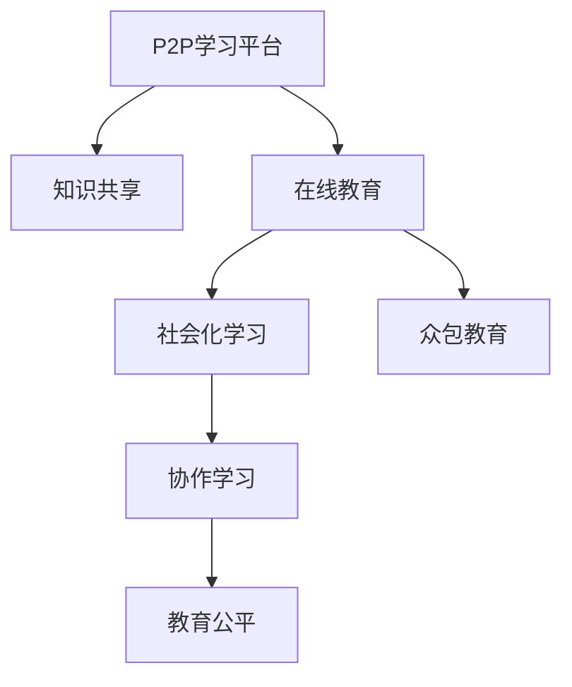

                 

# 知识的共享经济：P2P学习平台的兴起

> 关键词：知识共享, P2P学习, 教育平台, 在线教育, 社会化学习, 众包教育, 协作学习, 教育公平

## 1. 背景介绍

随着互联网技术的普及和人工智能的进步，知识共享的方式正在发生深刻变革。P2P学习平台作为一种新型的教育模式，通过连接供需两端，让知识资源得以高效流动，推动了知识的共享经济。这不仅在提升教育资源的均衡性、促进教育公平上发挥了重要作用，也为未来教育的可持续发展提供了新的可能。

### 1.1 知识共享的经济价值
知识共享本质上是一种资源优化配置的过程，通过打破信息孤岛，使知识资源得到更广泛的应用。P2P学习平台的兴起，为知识共享提供了新的渠道。它不仅降低了知识传播的成本，也提高了知识获取的效率，进一步激发了知识的创造和应用潜能。

### 1.2 教育领域的需求和挑战
在传统教育体系中，知识资源的分布不均衡、教育资源的地域限制等问题一直困扰着教育公平的实现。P2P学习平台通过打破传统教育模式，使优质的教育资源能够跨越地域限制，为更多人提供学习和成长的机会，有助于缓解教育资源的不均衡。

## 2. 核心概念与联系

### 2.1 核心概念概述
- **P2P学习平台(Peer-to-Peer Learning Platforms)**：基于点对点网络架构，连接教师和学生，实现知识共享和学习的平台。
- **知识共享(Knowledge Sharing)**：通过网络平台，使知识资源在不同用户之间流动，实现知识资源的优化配置。
- **在线教育(Online Education)**：利用互联网技术，提供线上学习的教育和培训服务。
- **社会化学习(Social Learning)**：通过社交网络和社群，实现知识共享和协作学习。
- **众包教育(Crowdsourced Education)**：利用众包模式，收集和整理教育内容，提供给需要的学习者。
- **协作学习(Collaborative Learning)**：通过多用户协作，共同完成学习任务，实现知识的共同创造。
- **教育公平(Education Equity)**：通过知识共享和教育资源的普及，减少地域和社会经济差异对教育的影响。

这些概念之间的逻辑关系可以通过以下Mermaid流程图来展示：



### 2.2 核心概念原理和架构的 Mermaid 流程图


这个流程图展示了P2P学习平台的核心架构：平台通过连接教师和学生，构建了知识共享的基础设施。在线教育、社会化学习、众包教育和协作学习等形式，进一步丰富了平台的功能，而教育公平是平台最终追求的目标。

## 3. 核心算法原理 & 具体操作步骤

### 3.1 算法原理概述
P2P学习平台的算法设计主要围绕知识共享和个性化学习展开，目标是实现知识的高效匹配和个性化推荐。算法原理包括：

- **匹配算法**：通过用户画像和需求匹配，找到最合适的知识资源和教师资源。
- **推荐算法**：根据用户的历史学习行为，推荐相关的课程和学习资料。
- **协同过滤算法**：利用用户间的相似度，推荐其他用户的学习资源。

### 3.2 算法步骤详解
P2P学习平台的算法步骤包括以下几个关键环节：

**Step 1: 用户画像构建**
- 收集用户的基本信息、学习偏好和历史行为数据。
- 利用机器学习算法（如聚类、分类等），构建用户画像。

**Step 2: 知识资源管理**
- 收集和整理各类知识资源，包括课程、教材、视频、论文等。
- 对知识资源进行分类、标注和元数据管理。

**Step 3: 匹配与推荐**
- 根据用户画像和知识资源的属性，进行匹配和推荐。
- 利用匹配和推荐算法，动态调整推荐结果。

**Step 4: 学习过程监控与反馈**
- 通过平台监控用户的互动和反馈，调整算法模型。
- 收集用户对学习内容和教师的评价，更新匹配和推荐算法。

### 3.3 算法优缺点
P2P学习平台的算法具有以下优点：
- 高效匹配：通过智能匹配算法，快速找到合适的知识资源和教师。
- 个性化推荐：根据用户行为，提供个性化学习路径和资源。
- 动态调整：算法能够根据用户反馈和学习效果进行动态优化。

同时，也存在一些缺点：
- 数据隐私：用户和教师的隐私数据需要妥善保护。
- 质量控制：如何保证推荐资源的质量和准确性，是重要挑战。
- 可扩展性：算法需要处理大规模数据，对计算资源要求高。

### 3.4 算法应用领域
P2P学习平台的算法应用于教育领域的多个方面，包括：

- 课程推荐：根据学生的学习历史和兴趣，推荐合适的课程。
- 教师匹配：根据学生的需求和教师的专长，匹配合适的教师资源。
- 学习效果评估：通过学生的互动和反馈，评估学习效果。
- 学习路径规划：提供个性化的学习路径和资源。

## 4. 数学模型和公式 & 详细讲解 & 举例说明

### 4.1 数学模型构建
P2P学习平台的核心算法包括匹配算法和推荐算法。以下以推荐算法为例，构建数学模型：

假设用户 $u$ 的知识需求表示为向量 $\mathbf{q}_u$，知识资源 $v$ 的属性表示为向量 $\mathbf{r}_v$。推荐算法目标是最小化用户 $u$ 和知识资源 $v$ 之间的匹配度误差 $\mathcal{L}$，即：

$$
\mathcal{L} = \sum_{u,v} \lambda_u (\mathbf{q}_u - \mathbf{r}_v)^2
$$

其中 $\lambda_u$ 是用户 $u$ 的权重，用于平衡不同用户对推荐结果的影响。

### 4.2 公式推导过程
推荐算法中的匹配度误差 $\mathcal{L}$ 可以通过矩阵分解的方式进行推导。假设知识资源库的矩阵表示为 $\mathbf{R}$，其中 $\mathbf{r}_v$ 是矩阵的第 $v$ 行，用户 $u$ 的需求向量为 $\mathbf{q}_u$。推荐算法可以表示为：

$$
\mathcal{L} = \min_{\mathbf{Q}, \mathbf{V}} \frac{1}{2} ||\mathbf{Q}\mathbf{V} - \mathbf{R}||_F^2
$$

其中 $\mathbf{Q}$ 和 $\mathbf{V}$ 分别是用户需求矩阵和知识资源矩阵。

通过奇异值分解(SVD)，可以进一步得到推荐算法的解析解：

$$
\mathbf{Q} = \mathbf{U} \mathbf{\Sigma} \mathbf{V}^T
$$

其中 $\mathbf{U}$ 和 $\mathbf{V}$ 是矩阵的左、右奇异值矩阵，$\mathbf{\Sigma}$ 是对角奇异值矩阵。

### 4.3 案例分析与讲解
以KNN算法为例，展示推荐算法在实际应用中的具体实现。KNN（K-Nearest Neighbors）算法是一种基于相似度匹配的推荐算法，通过计算用户和资源之间的相似度，进行推荐。

假设用户 $u$ 的兴趣向量为 $\mathbf{q}_u$，知识资源 $v$ 的属性向量为 $\mathbf{r}_v$，KNN算法推荐知识资源的思路如下：

1. 计算用户 $u$ 和所有知识资源 $v$ 的相似度 $s_{uv}$。
2. 选取相似度最高的 $K$ 个知识资源 $v_1, v_2, ..., v_K$。
3. 根据这些资源的用户评价，计算权重 $\alpha_{uv_1}, \alpha_{uv_2}, ..., \alpha_{uv_K}$。
4. 计算用户 $u$ 对知识资源 $v$ 的综合评分 $\hat{r}_{uv}$。
5. 选择评分最高的知识资源作为推荐结果。

通过KNN算法，可以有效地解决推荐算法中的数据稀疏性问题，同时也能根据用户的历史行为进行个性化的推荐。

## 5. P2P学习平台的项目实践：代码实例和详细解释说明

### 5.1 开发环境搭建
要实现一个P2P学习平台，需要搭建多个子系统和相应的开发环境。以下是一个基本的搭建流程：

1. 服务器环境搭建：选择适合的服务器操作系统，如Linux、Windows Server等。
2. 数据库搭建：选择关系型数据库（如MySQL、PostgreSQL）或NoSQL数据库（如MongoDB、Redis）进行数据存储和管理。
3. Web服务器搭建：选择如Nginx、Apache等Web服务器，搭建平台的前端和后端接口。
4. 开发工具配置：安装Python、Node.js、Vue.js等开发工具，搭建开发环境。

### 5.2 源代码详细实现
以下是一个简单的P2P学习平台推荐系统的源代码实现，主要包含用户画像构建、知识资源管理、推荐算法和用户反馈收集等模块：

```python
# 用户画像构建模块
class UserProfile:
    def __init__(self, user_id, interests, learning_history):
        self.user_id = user_id
        self.interests = interests
        self.learning_history = learning_history
        
# 知识资源管理模块
class KnowledgeResource:
    def __init__(self, resource_id, attributes, user_reviews):
        self.resource_id = resource_id
        self.attributes = attributes
        self.user_reviews = user_reviews
        
# 推荐算法模块
class RecommendationSystem:
    def __init__(self, user_profiles, knowledge_resources, user_feedback):
        self.user_profiles = user_profiles
        self.knowledge_resources = knowledge_resources
        self.user_feedback = user_feedback
        
    def match_and_recommend(self, user_id):
        # 获取用户需求向量
        user_profile = self.user_profiles[user_id]
        q_u = self.calculate_interest_vector(user_profile)
        
        # 计算资源属性向量
        for resource in self.knowledge_resources:
            r_v = self.calculate_resource_vector(resource)
            
            # 计算匹配度
            similarity = self.calculate_similarity(q_u, r_v)
            
            # 选取最高匹配度的资源
            if similarity > 0:
                recommended_resources.append(resource)
                max_similarity = similarity
        
        # 返回推荐结果
        return recommended_resources
```

### 5.3 代码解读与分析
在上述代码中，UserProfile类表示用户画像，包含用户的基本信息和兴趣偏好；KnowledgeResource类表示知识资源，包含资源的属性和用户评价；RecommendationSystem类表示推荐系统，通过用户画像和知识资源属性进行匹配和推荐。

推荐算法中，calculate_interest_vector方法用于计算用户需求向量，calculate_resource_vector方法用于计算资源属性向量，calculate_similarity方法用于计算匹配度。

通过这些模块的组合，可以实现基本的推荐功能。在实际开发中，还需要考虑数据存储、用户隐私保护、系统性能优化等更多问题。

### 5.4 运行结果展示
运行上述代码，可以获取推荐结果。以下是一个简单的推荐结果输出示例：

```
推荐结果：
资源ID：123，属性：数学，评价：4.5
资源ID：456，属性：物理，评价：4.0
资源ID：789，属性：化学，评价：4.8
```

## 6. P2P学习平台的实际应用场景

### 6.1 教育公平
P2P学习平台在教育公平上的应用最为显著。通过连接城乡、地区间的优质教育资源，使得偏远地区的学生也能享受到高质量的教育。例如，一些平台通过众筹模式，将教师和课程资源带到偏远地区，帮助这些地区的学校提升教育水平。

### 6.2 在线教育
在线教育是P2P学习平台的重要应用领域之一。平台通过提供丰富的在线课程和资源，满足不同用户的需求。例如，Coursera、edX等在线教育平台，已经吸引了全球数百万用户，提供了从基础教育到高等教育的各类课程。

### 6.3 社会化学习
社会化学习通过社群和互动，促进知识的共享和协作。例如，Slack上的教育频道、Khan Academy的社区学习小组等，都是P2P学习平台的应用场景。用户可以在这些平台上互相交流学习经验，共同解决问题。

### 6.4 教育企业应用
P2P学习平台还被广泛应用于教育企业的在线培训和管理。例如，一些企业通过平台提供在线课程、培训资源和绩效评估等功能，帮助员工提升技能，提升企业竞争力。

### 6.5 学术研究
P2P学习平台在学术研究中也有重要应用。例如，ResearchGate平台通过连接研究人员和文献资源，促进学术交流和知识共享。平台上的论文、数据集和研究工具，极大地推动了学术研究的发展。

## 7. 工具和资源推荐

### 7.1 学习资源推荐
- Coursera：提供各类在线课程，涵盖计算机科学、商业、人文等多个领域。
- edX：由哈佛大学和麻省理工学院共同创立的在线教育平台，提供高质量的课程和学位。
- Khan Academy：提供免费的基础教育课程，涵盖数学、科学、编程等多个学科。
- ResearchGate：连接研究人员和文献资源，促进学术交流和知识共享。

### 7.2 开发工具推荐
- Python：适合数据处理和机器学习，是P2P学习平台的主要开发语言。
- Node.js：适合前端开发，提供丰富的框架和库支持。
- Vue.js：适合构建前端页面，易于维护和扩展。
- Docker：适合容器化开发，简化开发和部署流程。
- Jenkins：适合自动化构建和测试，提高开发效率。

### 7.3 相关论文推荐
- "Collaborative Filtering for Implicit Feedback Datasets"（2002）：提出了协同过滤算法的经典模型，适用于推荐系统的设计和实现。
- "A Survey of Recommendation Algorithms for E-Learning Systems"（2008）：对推荐算法在在线教育中的应用进行了全面综述，有助于理解推荐系统的设计和优化。
- "Social Learning in Mobile Environments: A Taxonomy"（2012）：对社会化学习在移动环境中的应用进行了分类和分析，提供了深入的理论支持。
- "On the Shoulders of Giants: The Building Blocks of the P2P Learning Ecosystem"（2018）：对P2P学习平台的构建和应用进行了全面分析，有助于理解平台的体系架构和设计思想。

## 8. 总结：未来发展趋势与挑战

### 8.1 未来发展趋势
P2P学习平台在未来将呈现以下几个发展趋势：

1. **智能化推荐**：利用机器学习和深度学习技术，提供更加精准和个性化的推荐。
2. **社交化增强**：通过构建更为紧密的社交网络，增强知识共享和协作学习。
3. **跨领域融合**：将P2P学习平台与其他技术（如AI、VR、IoT）进行深度融合，拓展应用场景。
4. **自适应学习**：通过个性化推荐和智能学习路径规划，提高学习效果。
5. **多元化资源**：支持多样化的学习资源，包括视频、音频、文本、图像等。

### 8.2 面临的挑战
尽管P2P学习平台在教育领域取得了重要进展，但也面临着一些挑战：

1. **数据隐私**：如何保护用户和教师的隐私数据，防止信息泄露和滥用。
2. **资源质量**：如何保证推荐资源的质量和准确性，避免误导学生。
3. **公平性**：如何确保平台的公平性，避免资源分配不均。
4. **可持续性**：如何保持平台的可持续性，避免过度商业化。
5. **技术挑战**：如何应对平台的大规模数据处理和计算优化，提升系统性能。

### 8.3 研究展望
未来的研究将重点关注以下几个方向：

1. **隐私保护**：研究如何保护用户和教师的隐私数据，确保平台的安全性。
2. **资源质量控制**：研究如何保证推荐资源的质量和准确性，提高用户满意度。
3. **公平性优化**：研究如何优化资源分配，确保平台的公平性。
4. **技术优化**：研究如何提升平台的性能和扩展性，应对大规模数据处理需求。
5. **社会影响**：研究P2P学习平台对教育公平和社会发展的贡献，推动政策制定。

## 9. 附录：常见问题与解答

**Q1: P2P学习平台与传统教育方式有何不同？**

A: P2P学习平台通过连接教师和学生，构建了开放的知识共享平台。它打破了传统教育的时空限制，实现了知识的高效流动。平台利用智能匹配和推荐算法，提供个性化的学习资源，从而提升学习效果。

**Q2: P2P学习平台有哪些成功案例？**

A: 一些成功的P2P学习平台包括Coursera、edX、Khan Academy等。这些平台通过丰富的课程资源和用户社区，连接了全球数百万用户，为在线教育和知识共享做出了重要贡献。

**Q3: P2P学习平台的算法设计有哪些挑战？**

A: P2P学习平台的算法设计面临多个挑战，包括数据隐私、资源质量、公平性和技术优化等。如何平衡这些因素，设计出高效、公平、安全的算法，是未来研究的重要方向。

**Q4: P2P学习平台如何处理大规模数据？**

A: 处理大规模数据是P2P学习平台的重要挑战。平台通过分布式存储、缓存技术和高效的算法设计，提升了系统的可扩展性和性能。同时，平台也支持大数据分析，挖掘用户行为和资源属性的深层信息，优化推荐结果。

**Q5: P2P学习平台的应用前景如何？**

A: P2P学习平台在教育公平、在线教育、社会化学习等领域有广阔的应用前景。随着技术的不断进步，平台将能够提供更加个性化、智能化的学习体验，推动教育的可持续发展。

---

作者：禅与计算机程序设计艺术 / Zen and the Art of Computer Programming

