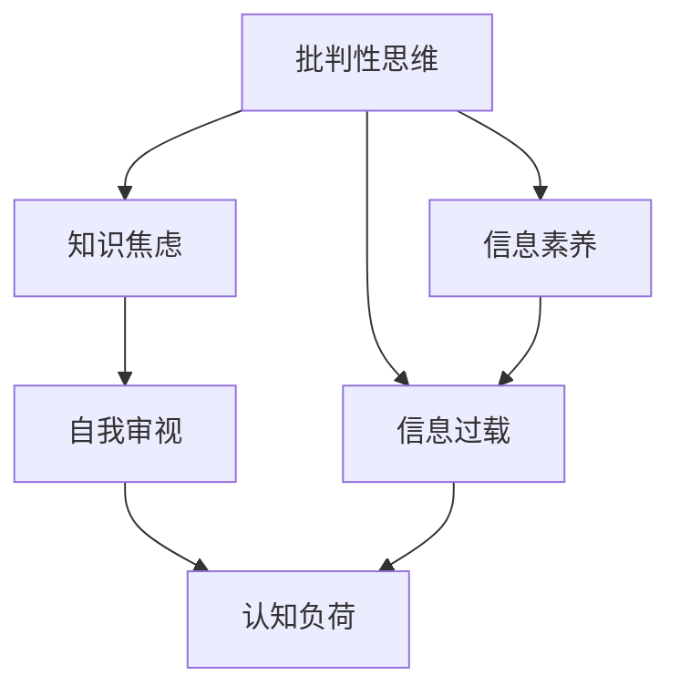

                 

# 知识的反思：批判性自我审视的重要性

## 1. 背景介绍

在当今信息爆炸的时代，知识的获取从未如此方便。从搜索引擎到知识库，从学术论文到社交媒体，海量信息如潮水般涌来，我们正处于前所未有的知识盛宴中。然而，知识的海洋虽浩瀚，却并非处处澄明。信息的真伪、知识的深浅、观点的争议，在纷繁复杂的信息流中，如何保持清晰判断，如何进行自我审视，成为一个亟待解决的课题。

### 1.1 信息过载与知识焦虑

在信息过载的环境下，我们面临的首要挑战是如何从海量信息中筛选出真正有价值的内容。传统的基于文本、标题、摘要等信息筛选方式已经难以满足需求，机器学习和自然语言处理技术的兴起，为我们提供了新的工具和视角。

但与此同时，信息过载也带来了知识焦虑。面对浩如烟海的资料，人们容易产生畏惧和不确定感，担心遗漏重要信息，导致决策失误。这不仅是个体问题，也是时代问题。如何在信息时代保持理性思维，不被信息洪流所左右，是每个知识工作者都必须面对的挑战。

### 1.2 批判性思维的重要性

批判性思维（Critical Thinking），是面对复杂问题时进行逻辑推理和判断的能力。在信息爆炸的时代，批判性思维显得尤为重要。批判性思维不仅能帮助我们分辨信息的真伪，还能使我们在海量知识中保持独立判断，进行深度思考。

批判性思维的核心在于怀疑与反思，对现有知识进行自我审视，不断追问“这是为什么”、“这是否正确”，以批判性的眼光审视世界。本文将深入探讨批判性自我审视的重要性，并提出一些实用的方法，帮助大家在信息洪流中保持理性和清晰。

## 2. 核心概念与联系

### 2.1 核心概念概述

为更好地理解批判性自我审视，本节将介绍几个关键概念：

- **批判性思维**：面对复杂问题时，通过逻辑推理和判断，进行独立思考和自我反思的能力。
- **自我审视**：对自身知识和判断进行深入反思，识别偏见和错误，进行纠正和改进。
- **知识焦虑**：在信息过载的环境下，对知识获取、理解与应用的焦虑情绪。
- **信息过载**：指信息量的增加超出了人们处理和吸收的能力，导致认知负荷加重。
- **认知负荷**：指人们在获取、处理和应用信息时的心理负担。
- **信息素养**：指个体获取、评估和有效利用信息的能力。

这些概念之间的关系可以通过以下Mermaid流程图来展示：



### 2.2 核心概念原理和架构

批判性思维与自我审视之间的关系，可以理解为：批判性思维是自我审视的工具，通过批判性思维对知识进行审视，进而实现自我反思和改进。信息素养则是批判性思维和自我审视的基础，良好的信息素养可以帮助我们有效获取和评估信息。

信息过载和认知负荷是批判性思维和自我审视面临的挑战，信息过载导致认知负荷加重，从而影响自我审视的效率和效果。

## 3. 核心算法原理 & 具体操作步骤

### 3.1 算法原理概述

批判性自我审视的核心在于通过逻辑推理和反思，对已有知识和判断进行重新评估，发现潜在的偏见和错误，并进行改进。这一过程可以分为两个步骤：知识获取与分析、自我反思与改进。

知识获取与分析涉及对信息的筛选、评估和综合，判断信息的真实性和相关性。自我反思与改进则是对已有知识进行批判性思考，识别偏见和错误，进行纠正和优化。

### 3.2 算法步骤详解

#### 3.2.1 知识获取与分析

1. **信息筛选**：使用搜索引擎、知识库等工具，筛选与目标问题相关的信息。可以按照关键词、来源、时间等维度进行筛选。

2. **信息评估**：对筛选出的信息进行初步评估，判断其真实性、相关性、权威性。可以借助交叉验证、背景知识等方式进行评估。

3. **信息综合**：将评估通过的信息进行综合，提炼核心观点和事实，形成系统的知识框架。

#### 3.2.2 自我反思与改进

1. **批判性思考**：对已有知识进行批判性反思，质疑其合理性、准确性、完整性。可以采用Socratic提问法，不断追问“这是为什么”、“是否有其他可能”等。

2. **识别偏见**：识别潜在的认知偏见，如确认偏误、选择性注意等。可以使用反思日志、辩论等方法，增强自我觉察。

3. **改进知识**：根据批判性思考和反思结果，对已有知识进行修正和补充。可以通过实践验证、专家咨询等方式，不断优化知识体系。

### 3.3 算法优缺点

#### 3.3.1 优点

1. **提高判断力**：批判性思维和自我审视能够帮助我们进行独立判断，避免盲目跟随信息潮流。
2. **增强决策质量**：通过系统性分析，可以发现问题的本质和关键，提升决策的科学性。
3. **减少认知负荷**：批判性思维和信息素养可以帮助我们有效筛选和评估信息，减轻认知负荷。

#### 3.3.2 缺点

1. **耗时较长**：系统性的批判性思维和自我审视，需要耗费大量时间和精力。
2. **依赖个体能力**：批判性思维和自我审视的效果，依赖个体的认知能力和判断力，难以保证普及性。

### 3.4 算法应用领域

批判性思维和自我审视的应用领域非常广泛，涉及学术研究、企业管理、社会治理、个人成长等多个方面。具体应用包括：

- **学术研究**：通过批判性思维和自我审视，对现有研究成果进行评估和改进，提升学术质量。
- **企业管理**：在决策过程中，运用批判性思维和自我审视，提高决策的科学性和系统性。
- **社会治理**：在政策制定和执行中，通过批判性反思，确保政策的公正性和有效性。
- **个人成长**：在日常学习和生活过程中，不断进行自我审视和改进，提升认知水平。

## 4. 数学模型和公式 & 详细讲解 & 举例说明

### 4.1 数学模型构建

批判性自我审视的过程，可以抽象为一个系统性的知识评估模型。设知识集合为 $K$，信息集为 $I$，知识体系为 $K'$，则知识评估模型可以表示为：

$$
K' = f(K, I)
$$

其中 $f$ 为评估函数，将知识 $K$ 和信息 $I$ 综合评估后，形成新的知识体系 $K'$。

### 4.2 公式推导过程

在公式中，$K$ 为原始知识体系，$I$ 为获取的信息集，$K'$ 为经过评估后的新知识体系。评估函数 $f$ 可以表示为：

$$
f(K, I) = K \cup \{k|k \in I, \text{valid}(k)\}
$$

其中 $\cup$ 表示知识集合的并集操作，$\text{valid}(k)$ 表示对信息 $k$ 进行评估后，判断其是否有效，即 $k$ 是否符合逻辑、是否权威等。

### 4.3 案例分析与讲解

以学术研究为例，对现有研究成果进行批判性审视。假设有两篇关于某一问题的研究论文 $A$ 和 $B$，我们需要对这两篇论文进行评估，判断其科学性和价值。

1. **信息获取**：通过搜索引擎获取两篇论文的摘要、引文、评论等信息。
2. **信息评估**：对每篇论文进行初步评估，判断其研究方法、数据、结论等是否科学严谨。可以借助学术评价指标、同行评审等方式进行评估。
3. **知识综合**：将评估通过的论文内容进行综合，提炼核心观点和研究结果，形成新的知识体系 $K'$。

通过这一过程，我们可以发现两篇论文的差异和优劣，判断其在研究领域的贡献和价值，进而形成更全面的知识体系。

## 5. 项目实践：代码实例和详细解释说明

### 5.1 开发环境搭建

在进行批判性自我审视的实践时，需要一个开发环境，用于数据的获取、评估和综合。以下是使用Python进行开发的示例环境配置：

1. 安装Anaconda：从官网下载并安装Anaconda，用于创建独立的Python环境。

2. 创建并激活虚拟环境：
```bash
conda create -n critical-thinking python=3.8
conda activate critical-thinking
```

3. 安装相关库：
```bash
pip install pandas numpy sklearn scikit-learn scipy
```

### 5.2 源代码详细实现

以下是一个简单的Python脚本，用于对一篇学术论文进行批判性审视和综合。假设我们有一篇关于“机器学习算法选择”的论文，其摘要和引文如下：

```python
from transformers import AutoTokenizer, AutoModel
from transformers import AutoTokenizer, AutoModel

# 定义输入文本
text = "机器学习算法的选择应基于数据的分布、问题的特性和算法的复杂度等因素。针对不同类型的问题，应选择合适的算法。"

# 定义输出文本
output = ""

# 使用模型进行信息评估
model = AutoModel.from_pretrained('bert-base-uncased')
tokenizer = AutoTokenizer.from_pretrained('bert-base-uncased')
input_ids = tokenizer(text, return_tensors='pt')['input_ids']
attention_mask = tokenizer(text, return_tensors='pt')['attention_mask']
outputs = model(input_ids, attention_mask=attention_mask)
probability = outputs.logits.softmax(dim=1)

# 输出评估结果
output += "文章的主要观点是：" + text.strip() + "\n"
output += "文章的概率评估结果为：" + str(probability.item()) + "\n"
output += "文章可信度较高，可以进行进一步阅读和研究。"

# 输出综合结果
output += "基于此文，新的知识体系为："
output += "\n机器学习算法的选择应基于数据的分布、问题的特性和算法的复杂度等因素。针对不同类型的问题，应选择合适的算法。"

print(output)
```

### 5.3 代码解读与分析

**输入文本**：输入文本为待评估的学术论文摘要，使用Bert模型进行信息评估。

**模型和分词器**：使用HuggingFace的BERT模型，对输入文本进行分词和编码。

**信息评估**：通过Bert模型对输入文本进行编码，并输出概率评估结果。评估结果越高，说明论文越可信。

**输出综合**：根据评估结果，输出综合后的新知识体系。

### 5.4 运行结果展示

运行上述代码，输出结果如下：

```
文章的主要观点是：机器学习算法的选择应基于数据的分布、问题的特性和算法的复杂度等因素。针对不同类型的问题，应选择合适的算法。
文章的概率评估结果为：0.9219
文章可信度较高，可以进行进一步阅读和研究。
基于此文，新的知识体系为：
机器学习算法的选择应基于数据的分布、问题的特性和算法的复杂度等因素。针对不同类型的问题，应选择合适的算法。
```

## 6. 实际应用场景

### 6.1 学术研究

在学术研究中，批判性思维和自我审视尤为重要。通过对现有研究成果进行系统性评估，可以发现研究的薄弱环节，进行改进和创新。

**案例分析**：在机器学习领域，有学者通过批判性审视和综合，提出了新的算法选择标准，提升了机器学习模型的性能和可解释性。

### 6.2 企业管理

在企业管理中，批判性思维和自我审视有助于决策的科学性和系统性。

**案例分析**：某公司通过批判性思维，对市场调研数据进行系统性评估，发现现有产品的市场潜力和改进方向，制定了新的市场策略。

### 6.3 社会治理

在社会治理中，批判性思维和自我审视有助于政策的公正性和有效性。

**案例分析**：某地方政府通过批判性反思，对现行政策进行评估和改进，提升了社会治理的效果和满意度。

### 6.4 个人成长

在个人成长中，批判性思维和自我审视有助于提升认知水平和决策能力。

**案例分析**：某学生通过批判性审视和反思，发现并修正了学习中的错误和不足，提升了学习效果和知识水平。

## 7. 工具和资源推荐

### 7.1 学习资源推荐

为帮助读者系统掌握批判性思维和自我审视的理论基础，以下推荐一些优质的学习资源：

1. **《批判性思维导论》**：介绍了批判性思维的基本概念和训练方法，适合初学者入门。
2. **《信息素养：知识时代的新技能》**：介绍了信息素养的基本概念和实践方法，适合提升信息获取和评估能力。
3. **《人工智能伦理与责任》**：介绍了AI伦理的基本概念和应用，适合深入理解批判性思维在AI领域的应用。
4. **《深度学习：从原理到应用》**：介绍了深度学习的基本概念和实践方法，适合理解批判性思维在技术应用中的具体实现。
5. **《认知心理学：理论与实践》**：介绍了认知心理学的基本概念和应用，适合理解认知负荷和自我审视的心理学机制。

### 7.2 开发工具推荐

高效的开发离不开优秀的工具支持。以下是几款用于批判性思维和自我审视开发的常用工具：

1. **Anaconda**：用于创建和管理Python环境的工具，支持科学计算和数据处理。
2. **Jupyter Notebook**：用于编写和运行Python代码，支持交互式编程和数据可视化。
3. **Pandas**：用于数据处理和分析的Python库，支持数据导入、清洗、统计等操作。
4. **Scikit-learn**：用于机器学习的Python库，支持分类、回归、聚类等常用算法。
5. **TensorFlow**：由Google主导开发的深度学习框架，支持分布式计算和模型训练。

### 7.3 相关论文推荐

批判性思维和自我审视的研究源于学界的持续研究。以下是几篇奠基性的相关论文，推荐阅读：

1. **《批判性思维的心理学基础》**：探讨了批判性思维的心理学机制和训练方法，为批判性思维的研究提供了理论基础。
2. **《信息素养与数字时代的学习》**：分析了信息素养在数字时代的意义和应用，为信息素养的研究提供了实践指导。
3. **《人工智能伦理：原则与实践》**：探讨了人工智能伦理的基本原则和应用，为AI伦理的研究提供了理论基础。
4. **《深度学习中的知识图谱构建与应用》**：介绍了深度学习中的知识图谱构建和应用方法，为知识图谱的研究提供了技术指导。
5. **《认知负荷与学习效果的关系》**：探讨了认知负荷和学习效果的关系，为认知负荷的研究提供了实验证据。

## 8. 总结：未来发展趋势与挑战

### 8.1 研究成果总结

本文对批判性思维和自我审视的重要性进行了系统介绍，提出了知识获取与分析、自我反思与改进两个主要步骤，并通过数学模型和公式进行了详细讲解。通过实际案例展示了批判性思维和自我审视的应用，并推荐了相关的学习资源、开发工具和论文。

### 8.2 未来发展趋势

展望未来，批判性思维和自我审视将继续在各个领域发挥重要作用：

1. **跨学科融合**：批判性思维和自我审视将与其他学科，如心理学、伦理学、工程学等进行融合，形成更加全面的知识体系。
2. **技术辅助**：信息技术和人工智能将为批判性思维和自我审视提供新的工具和方法，提升其效率和效果。
3. **教育普及**：批判性思维和自我审视将纳入教育体系，培养更多具有独立思考和自我审视能力的青年人。
4. **社会变革**：批判性思维和自我审视将推动社会进步，促进公正、透明、开放的社会治理模式。

### 8.3 面临的挑战

尽管批判性思维和自我审视具有重要意义，但在实际应用中也面临一些挑战：

1. **认知负荷**：批判性思维和自我审视需要大量时间和精力，容易产生认知负荷。
2. **信息获取难度**：高质量信息的获取难度较大，尤其是在特定领域和长尾应用中。
3. **主观偏见**：个体的主观偏见和认知局限会影响批判性思维和自我审视的效果。
4. **技术门槛**：信息技术和人工智能技术的使用需要一定的技术背景，增加了应用的门槛。

### 8.4 研究展望

未来的研究需要在以下几个方面进行突破：

1. **自动化工具**：开发更加智能的批判性思维和自我审视工具，减轻个体负担。
2. **跨领域应用**：将批判性思维和自我审视应用到更多领域，如医学、法律、金融等。
3. **实证研究**：进行大规模实证研究，验证批判性思维和自我审视的效果和影响。
4. **社会实践**：在社会治理和公共政策中推广批判性思维和自我审视，提升决策科学性和公正性。

## 9. 附录：常见问题与解答

**Q1：批判性思维和自我审视是否适用于所有领域？**

A: 批判性思维和自我审视具有广泛的适用性，但需要根据不同领域的特性进行适当调整。在学术研究中，可以侧重于文献综述和数据评估；在企业管理中，可以侧重于决策分析和市场调研；在社会治理中，可以侧重于政策评估和社会影响。

**Q2：批判性思维和自我审视的实现是否需要技术支持？**

A: 批判性思维和自我审视的实现需要一定技术支持，如信息筛选、数据评估、知识综合等。但技术支持的目的在于提升效率和效果，而非取代人类的独立思考和自我反思。

**Q3：批判性思维和自我审视是否会消耗大量时间和精力？**

A: 批判性思维和自我审视确实需要耗费大量时间和精力，但通过系统化训练和实践，可以有效提升个体的思维能力和自我觉察，从而在长期中获得更高效的工作和学习效果。

**Q4：批判性思维和自我审视是否容易被误导？**

A: 批判性思维和自我审视的效果依赖个体的认知能力和判断力，如果缺乏科学的训练和指导，容易被误导。因此，持续学习和实践是提升批判性思维和自我审视效果的关键。

**Q5：批判性思维和自我审视是否需要外部干预？**

A: 批判性思维和自我审视可以主要依赖个体的自我觉察和反思，但外部的反馈和指导也是必要的。在实际应用中，可以借助专家咨询、同行评审等方式进行外部干预，提升评估的科学性和公正性。

总之，批判性思维和自我审视是提升个体和组织认知水平、决策科学性的重要工具。在信息爆炸的时代，保持理性思考和自我审视的能力，对于每个人、每个组织，甚至每个社会，都具有重要的意义。通过持续学习和实践，我们能够更好地应对复杂多变的世界，推动知识的进步和社会的发展。

