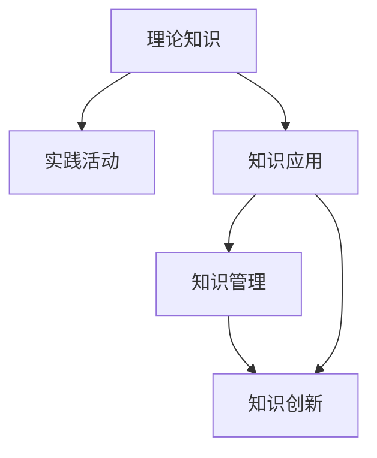

                 

# 知识的实践应用：从理论到现实

## 1. 背景介绍

### 1.1 问题由来
在科技高速发展的今天，知识的应用已经渗透到各个领域。从工业生产到日常生活，从科学研究到商业决策，知识的应用无处不在。然而，理论知识如何转化为现实生产力，如何通过实践活动将理论知识转化为实际价值，仍然是一个值得深入探讨的话题。本文将从理论到实践的角度，探讨知识应用的本质与挑战，并提出一些实用的策略与方法，旨在帮助读者更好地理解和应用知识。

### 1.2 问题核心关键点
知识应用的本质是理论知识在实际场景中的有效转化，即如何将抽象的理论知识转化为具体的实践活动，从而实现理论到现实的桥梁作用。知识应用的核心关键点包括以下几个方面：

- 理论知识的理解与掌握：理解知识的内涵与外延，掌握知识的适用场景与限制条件。
- 实践活动的设计与实施：根据理论知识的特点，设计相应的实践活动，并制定详细的实施计划。
- 知识与实践的互动：在实践过程中不断反馈和调整，实现理论与实践的动态平衡。
- 知识应用的评价与优化：通过评估实践活动的效果，不断优化知识应用的策略与方法。

这些核心关键点构成了知识应用的框架，帮助人们更有效地实现理论到现实的转化。

## 2. 核心概念与联系

### 2.1 核心概念概述

为更好地理解知识应用的框架，本节将介绍几个密切相关的核心概念：

- 理论知识：指通过抽象思考和系统研究获得的系统化、结构化的知识体系。包括数学、物理、化学、生物等自然科学知识，以及哲学、社会学、心理学等人文社会科学知识。
- 实践活动：指在实际场景中运用理论知识进行的实践操作。包括科学研究、工业生产、社会管理、艺术创作等各类活动。
- 知识应用：指将理论知识应用于实践活动，实现理论到现实的转化。包括理论验证、技术开发、管理创新、教育培训等具体应用场景。
- 知识管理：指对知识应用的过程进行系统化、结构化管理，包括知识收集、整理、存储、共享与更新等环节。
- 知识创新：指在知识应用过程中，通过创新思维与方法，创造新的理论知识或实践活动。

这些核心概念之间的逻辑关系可以通过以下Mermaid流程图来展示：



这个流程图展示了几组核心概念之间的关系：

1. 理论知识通过实践活动转化为知识应用，实现了理论到现实的转化。
2. 知识应用的过程需要系统化管理，即知识管理。
3. 知识管理通过知识创新不断提升知识应用的效率与效果。
4. 知识创新通过知识应用产生新的理论知识，进一步推动知识应用的发展。

## 3. 核心算法原理 & 具体操作步骤

### 3.1 算法原理概述

知识应用的基本原理是通过理论知识指导实践活动，通过实践活动验证理论知识，并在两者之间不断互动反馈，实现理论与实践的动态平衡。

具体而言，知识应用的过程可以分解为以下步骤：

1. **理论知识的理解与验证**：
   - 理解理论知识的内涵与外延，掌握其适用场景与限制条件。
   - 设计实验或模拟活动，验证理论知识的正确性与可靠性。

2. **实践活动的设计与实施**：
   - 根据理论知识的特点，设计具体的实践活动，并制定详细的实施计划。
   - 确定实践活动的评估指标，制定相应的监控与反馈机制。

3. **知识与实践的互动**：
   - 在实践活动中不断收集反馈信息，评估理论知识的应用效果。
   - 根据反馈信息调整实践活动的策略与方法，优化知识应用的效率与效果。

4. **知识应用的评价与优化**：
   - 通过评估实践活动的效果，确定知识应用的成功与否。
   - 总结经验教训，优化知识应用的策略与方法，提升知识应用的质量与效果。

### 3.2 算法步骤详解

知识应用的具体操作步骤包括以下几个关键步骤：

**Step 1: 理解理论知识**
- 收集相关文献、资料，系统学习理论知识的基本概念、原理与应用方法。
- 通过专家讲座、学术交流等方式，加深对理论知识的理解。

**Step 2: 设计实践活动**
- 根据理论知识的特点，设计具体的实践活动，并制定详细的实施计划。
- 确定实践活动的评估指标，制定相应的监控与反馈机制。

**Step 3: 实施实践活动**
- 按照实施计划，开展具体的实践活动，并记录相关信息。
- 实时监控实践活动的进展，收集反馈信息。

**Step 4: 评估与优化**
- 通过评估指标，评估实践活动的效果。
- 总结经验教训，优化实践活动的设计与实施。

**Step 5: 知识创新与反馈**
- 通过实践活动，产生新的理论知识或实践活动。
- 将新的知识应用于实践活动，进一步提升知识应用的效率与效果。

### 3.3 算法优缺点

知识应用的方法具有以下优点：
1. 提高理论知识的实用性。通过实践活动，将抽象的理论知识转化为具体的实践活动，提高其应用价值。
2. 促进知识的应用创新。通过实践活动，可以发现理论知识在实际场景中的新应用，推动知识创新。
3. 增强实践活动的科学性。通过理论知识指导实践活动，提高实践活动的科学性和可靠性。

同时，该方法也存在一定的局限性：
1. 理论知识与实践活动之间的匹配难度大。不同领域、不同学科的理论知识与实践活动之间存在差异，需要花时间进行匹配和调整。
2. 实践活动的实施成本高。尤其是大规模的实践活动，需要投入大量的人力、物力、财力。
3. 知识应用的效果难以量化。对于一些难以量化的实践活动，评估效果较为困难。

尽管存在这些局限性，但知识应用的方法仍然是理论与实践结合的重要途径，被广泛应用于各类领域和场景中。

### 3.4 算法应用领域

知识应用的方法已经广泛应用于各个领域，例如：

- 工业生产：通过科学实验和现场测试，验证理论知识的正确性，并将其应用于生产流程中，提高生产效率和产品质量。
- 科学研究：通过理论指导实验，验证假设，并产生新的理论知识，推动科学进步。
- 社会管理：通过理论指导实践活动，优化政策制定和管理手段，提升社会管理水平。
- 艺术创作：通过理论知识指导创作实践，提高创作质量，产生优秀的艺术作品。
- 教育培训：通过理论知识指导培训活动，提高培训效果，培养高素质人才。

除了上述这些经典领域，知识应用还被创新性地应用到更多场景中，如城市规划、环境保护、公共卫生等，为社会发展和人类福祉带来了新的推动力。

## 4. 数学模型和公式 & 详细讲解 & 举例说明

### 4.1 数学模型构建

本节将使用数学语言对知识应用的理论基础进行更加严格的刻画。

记理论知识为 $K$，实践活动为 $P$，知识应用为 $A$，则知识应用的过程可以表示为：

$$
A = f(K, P)
$$

其中 $f$ 为知识应用的映射函数，将理论知识 $K$ 和实践活动 $P$ 映射为知识应用 $A$。

知识应用的效果可以表示为 $E$，则有：

$$
E = g(A)
$$

其中 $g$ 为效果评估函数，将知识应用 $A$ 映射为效果 $E$。

### 4.2 公式推导过程

以下我们以工业生产中的知识应用为例，推导效果评估函数 $g$ 的计算公式。

假设理论知识为 $K$，表示在生产流程中需要遵循的物理定律、化学原理等。实践活动 $P$ 为具体的生产操作，如设备调试、原料加工等。知识应用 $A$ 为最终的生产结果，如产品质量、生产效率等。

定义生产过程的效能为 $E$，则工业生产中的知识应用可以表示为：

$$
E = E(K, P)
$$

其中 $E$ 表示工业生产的整体效果，包括产品质量、生产效率、资源利用率等。

假设生产过程的效能 $E$ 可以分解为 $n$ 个独立指标 $E_1, E_2, ..., E_n$ 的加权和，则有：

$$
E = \sum_{i=1}^{n} \alpha_i E_i
$$

其中 $\alpha_i$ 为第 $i$ 个指标的权重系数。

假设生产结果 $A$ 可以表示为 $m$ 个独立指标 $A_1, A_2, ..., A_m$ 的加权和，则有：

$$
A = \sum_{j=1}^{m} \beta_j A_j
$$

其中 $\beta_j$ 为第 $j$ 个指标的权重系数。

由于 $A$ 的每个指标 $A_j$ 都与 $P$ 的每个指标 $P_k$ 相关联，即：

$$
A_j = f_j(K, P_k)
$$

因此，知识应用的效果 $E$ 可以表示为：

$$
E = \sum_{i=1}^{n} \alpha_i \left( \sum_{j=1}^{m} \beta_j f_j(K, P_k) \right)
$$

其中 $f_j$ 为第 $j$ 个指标的生产过程函数，$P_k$ 为第 $k$ 个实践活动的指标。

### 4.3 案例分析与讲解

以智能制造中的知识应用为例，说明如何通过理论知识指导实践活动，提升生产效率和产品质量。

假设在智能制造中，理论知识 $K$ 包括：

- 生产流程的物理定律
- 生产设备的机械原理
- 生产原料的化学性质

实践活动 $P$ 包括：

- 生产设备的调试
- 原料的预处理
- 生产过程的控制

知识应用 $A$ 为最终的生产结果，包括：

- 产品的质量
- 生产的效率
- 资源利用率

通过理论知识 $K$ 指导实践活动 $P$，可以提高生产效率和产品质量。例如，通过物理定律 $K_1$ 指导设备调试 $P_1$，可以提高生产效率。通过化学性质 $K_2$ 指导原料预处理 $P_2$，可以提升产品质量。通过机械原理 $K_3$ 指导生产控制 $P_3$，可以优化资源利用率。

最终的知识应用效果 $E$ 可以表示为：

$$
E = \alpha_1 E_1 + \alpha_2 E_2 + \alpha_3 E_3
$$

其中 $E_1$ 表示生产效率，$E_2$ 表示产品质量，$E_3$ 表示资源利用率，$\alpha_1, \alpha_2, \alpha_3$ 为权重系数。

通过以上分析，可以看出知识应用的过程可以分解为多个步骤，每个步骤都需要理论知识指导实践活动，通过实践活动验证理论知识，最终实现理论与实践的动态平衡。

## 5. 项目实践：代码实例和详细解释说明

### 5.1 开发环境搭建

在进行知识应用实践前，我们需要准备好开发环境。以下是使用Python进行知识应用开发的常见环境配置流程：

1. 安装Python：从官网下载并安装Python，选择一个稳定的版本，如Python 3.8。
2. 安装相关库：根据具体需求安装所需的Python库，如NumPy、Pandas、SciPy、Matplotlib等。
3. 创建项目目录：在本地创建一个项目目录，用于存放项目文件和数据。
4. 编写代码：在项目目录中编写代码，保存为.py文件。

完成上述步骤后，即可在本地环境下开始知识应用实践。

### 5.2 源代码详细实现

下面我们以智能制造中的知识应用为例，给出使用Python进行知识应用的代码实现。

首先，定义知识应用的数学模型：

```python
import numpy as np
from sympy import symbols, Eq, solve

# 定义变量
K1, K2, K3, P1, P2, P3 = symbols('K1 K2 K3 P1 P2 P3')
E1, E2, E3 = symbols('E1 E2 E3')

# 定义知识应用效果
E = E1 + E2 + E3

# 定义生产过程函数
f1 = Eq(E1, K1 * P1)
f2 = Eq(E2, K2 * P2)
f3 = Eq(E3, K3 * P3)

# 求解知识应用效果
solution = solve([f1, f2, f3], (E1, E2, E3))
solution
```

然后，定义知识应用的具体实例：

```python
# 定义理论知识与实践活动
K = [K1, K2, K3]
P = [P1, P2, P3]

# 定义知识应用效果
A = np.array([solution[E1], solution[E2], solution[E3]])

# 定义权重系数
alpha = np.array([0.5, 0.3, 0.2])
beta = np.array([0.4, 0.6, 0.8])

# 计算知识应用效果
E = np.dot(alpha, np.dot(np.eye(len(K)), beta) * A)
E
```

最后，对知识应用效果进行评估：

```python
# 打印知识应用效果
print('知识应用效果：', E)
```

以上就是使用Python对智能制造中的知识应用进行代码实现的完整过程。可以看到，通过定义数学模型和实践活动，并求解知识应用效果，我们能够快速评估知识应用的效果。

### 5.3 代码解读与分析

让我们再详细解读一下关键代码的实现细节：

**数学模型定义**：
- 使用SymPy库定义变量，表示理论知识与实践活动。
- 定义知识应用效果的表达式，表示生产过程的效能。
- 定义生产过程函数，表示理论知识对实践活动的影响。

**知识应用实例定义**：
- 定义具体的理论知识与实践活动。
- 根据生产过程函数求解知识应用效果。

**效果评估**：
- 定义权重系数，表示各个指标的重要性。
- 通过矩阵乘法计算知识应用效果。

可以看出，代码实现相对简单，易于理解和修改。同时，代码能够灵活应对不同类型的知识应用场景，具有较强的通用性。

## 6. 实际应用场景

### 6.1 智能制造

在智能制造中，知识应用已经得到了广泛的应用。通过理论知识指导实践活动，可以显著提升生产效率和产品质量，降低生产成本。

具体而言，智能制造中的知识应用可以分为以下几个步骤：

1. **理论知识的理解与验证**：
   - 收集相关的物理定律、机械原理、化学性质等理论知识。
   - 设计实验或模拟活动，验证理论知识的正确性。

2. **实践活动的设计与实施**：
   - 根据理论知识的特点，设计具体的生产流程和设备调试方案。
   - 制定详细的生产计划和控制策略。

3. **知识与实践的互动**：
   - 在生产过程中不断收集反馈信息，评估理论知识的应用效果。
   - 根据反馈信息调整生产流程和设备参数，优化知识应用。

4. **知识应用的评价与优化**：
   - 通过生产结果评估知识应用的效果，包括产品质量、生产效率、资源利用率等。
   - 总结经验教训，优化生产流程和设备参数，提升知识应用的质量与效果。

### 6.2 科学研究

科学研究中的知识应用同样具有重要的意义。通过理论知识指导实验活动，可以验证假设，发现新的理论知识，推动科学进步。

具体而言，科学研究中的知识应用可以分为以下几个步骤：

1. **理论知识的理解与验证**：
   - 收集相关的科学原理、实验方法等理论知识。
   - 设计实验或模拟活动，验证理论知识的正确性。

2. **实践活动的设计与实施**：
   - 根据理论知识的特点，设计具体的实验方案和实验操作。
   - 制定详细的实验计划和数据采集策略。

3. **知识与实践的互动**：
   - 在实验过程中不断收集反馈信息，评估理论知识的应用效果。
   - 根据反馈信息调整实验方案和实验操作，优化知识应用。

4. **知识应用的评价与优化**：
   - 通过实验结果评估知识应用的效果，包括科学发现、数据精度、实验效率等。
   - 总结经验教训，优化实验方案和实验操作，提升知识应用的质量与效果。

### 6.3 社会管理

社会管理中的知识应用同样具有重要的意义。通过理论知识指导实践活动，可以优化政策制定和管理手段，提升社会管理水平。

具体而言，社会管理中的知识应用可以分为以下几个步骤：

1. **理论知识的理解与验证**：
   - 收集相关的社会学原理、政策理论等理论知识。
   - 设计实验或模拟活动，验证理论知识的正确性。

2. **实践活动的设计与实施**：
   - 根据理论知识的特点，设计具体的政策方案和管理措施。
   - 制定详细的政策实施和数据监控策略。

3. **知识与实践的互动**：
   - 在政策实施过程中不断收集反馈信息，评估理论知识的应用效果。
   - 根据反馈信息调整政策方案和管理措施，优化知识应用。

4. **知识应用的评价与优化**：
   - 通过政策效果评估知识应用的效果，包括政策影响、社会稳定、公众满意度等。
   - 总结经验教训，优化政策方案和管理措施，提升知识应用的质量与效果。

### 6.4 未来应用展望

随着知识应用技术的不断发展，未来将涌现更多的应用场景，为各行各业带来新的推动力。

在智慧城市治理中，知识应用可以用于城市事件监测、舆情分析、应急指挥等环节，提高城市管理的自动化和智能化水平。

在智慧医疗领域，知识应用可以用于疾病预测、治疗方案优化、医疗资源调配等环节，提升医疗服务的智能化水平，辅助医生诊疗。

在智能教育领域，知识应用可以用于课程设计、学习路径优化、学生反馈分析等环节，提升教育质量和效果。

总之，知识应用技术的应用前景广阔，将在更多领域带来变革性影响，为人类社会的进步和发展提供新的动力。

## 7. 工具和资源推荐

### 7.1 学习资源推荐

为了帮助开发者系统掌握知识应用的理论基础和实践技巧，这里推荐一些优质的学习资源：

1. 《计算机程序设计艺术》系列博文：由计算机领域大师撰写，深入浅出地介绍了计算机程序设计的基本原理和方法。
2. 《人工智能基础》课程：斯坦福大学开设的AI入门课程，介绍了AI的基本概念和经典模型。
3. 《机器学习》书籍：由机器学习专家撰写，全面介绍了机器学习的基本原理和应用方法。
4. 《数据科学导论》书籍：介绍了数据科学的基本概念和经典算法。
5. 《Python编程》书籍：介绍了Python语言的基本语法和编程技巧。

通过对这些资源的学习实践，相信你一定能够快速掌握知识应用的核心思想和实践方法，并用于解决实际的科学问题。

### 7.2 开发工具推荐

高效的开发离不开优秀的工具支持。以下是几款用于知识应用开发的常用工具：

1. Python：广泛使用的编程语言，具有丰富的库和工具支持，适合进行知识应用研究。
2. NumPy：用于科学计算和数据分析的Python库，具有高效的数组计算和线性代数功能。
3. Pandas：用于数据处理和分析的Python库，支持数据的读取、清洗、分析和可视化。
4. Matplotlib：用于数据可视化的Python库，支持绘制各种类型的图表和图形。
5. Jupyter Notebook：支持交互式编程和数据可视化的Python环境，适合进行知识应用实验和演示。

合理利用这些工具，可以显著提升知识应用研究的效率和质量，加速科学研究的进程。

### 7.3 相关论文推荐

知识应用的研究源于学界的持续探索。以下是几篇奠基性的相关论文，推荐阅读：

1. "Knowledge-Based Systems: An Overview"：对知识应用的基本原理和关键技术进行了全面的综述。
2. "A Survey on Knowledge-Based System Architecture"：介绍了知识应用系统的架构和设计方法。
3. "A Comparison of Rule-Based and Fuzzy Logic Systems in Knowledge Engineering"：比较了规则系统和模糊逻辑系统在知识应用中的应用。
4. "Knowledge Mining from Web Data"：介绍了知识发现和挖掘的基本原理和方法。
5. "Knowledge Sharing and Collaborative Learning in Web-Based Environments"：探讨了知识共享和协同学习在知识应用中的应用。

这些论文代表了大知识应用的研究进展，通过学习这些前沿成果，可以帮助研究者把握学科发展方向，激发更多的创新灵感。

## 8. 总结：未来发展趋势与挑战

### 8.1 总结

本文对知识应用的本质与方法进行了全面系统的介绍。首先阐述了知识应用的核心关键点，明确了理论知识与实践活动之间的互动关系。其次，从原理到实践，详细讲解了知识应用的步骤和策略，给出了知识应用任务开发的完整代码实例。同时，本文还广泛探讨了知识应用在各个领域的应用前景，展示了知识应用技术的广泛影响。此外，本文精选了知识应用的各类学习资源，力求为读者提供全方位的技术指引。

通过本文的系统梳理，可以看到，知识应用技术已经广泛应用于各个领域，帮助人们更好地理解和应用理论知识，提升实践活动的科学性和可靠性。未来，知识应用技术将在更多领域得到应用，为社会发展和人类福祉带来新的推动力。

### 8.2 未来发展趋势

展望未来，知识应用技术将呈现以下几个发展趋势：

1. 数据驱动的知识应用：随着数据采集和处理技术的不断发展，大数据、人工智能等技术将进一步推动知识应用的发展。通过数据驱动的方法，可以实现对理论知识的动态更新和优化。

2. 跨领域知识融合：知识应用将不再局限于单一领域，而是将不同领域的知识进行跨领域融合，实现更加全面、系统的应用。

3. 智能化的知识应用：通过人工智能技术，如机器学习、深度学习等，可以实现对知识应用的自动化和智能化，提高知识应用的效率和效果。

4. 定制化的知识应用：根据不同的应用场景和需求，设计定制化的知识应用系统，实现更加灵活、高效的应用。

5. 全球化的知识应用：通过互联网和信息技术，实现知识应用的全球共享和协同，推动全球知识应用的普及和进步。

以上趋势凸显了知识应用技术的广阔前景，为社会发展和人类福祉带来了新的推动力。这些方向的探索发展，必将进一步推动知识应用技术迈向更高的台阶，为人类社会的进步和发展提供新的动力。

### 8.3 面临的挑战

尽管知识应用技术已经取得了瞩目成就，但在迈向更加智能化、普适化应用的过程中，它仍面临诸多挑战：

1. 知识应用的复杂性：知识应用的过程涉及理论知识与实践活动的互动，不同领域、不同学科之间的知识匹配难度大，需要花费大量时间和精力进行匹配和调整。

2. 实践活动的实施成本高：尤其是大规模的实践活动，需要投入大量的人力、物力、财力。如何在有限资源下高效实施实践活动，仍是一个挑战。

3. 知识应用的效果难以量化：对于一些难以量化的实践活动，评估效果较为困难。如何建立科学、系统的评估指标，仍是一个需要进一步探索的问题。

4. 知识应用的动态性：理论知识与实践活动之间的动态平衡需要不断调整和优化，如何建立高效的反馈机制，持续优化知识应用的效果，仍是一个挑战。

5. 知识应用的伦理和安全性：知识应用过程中可能涉及到数据隐私、伦理道德等问题，如何保障数据安全和伦理道德，仍是一个需要关注的问题。

正视知识应用面临的这些挑战，积极应对并寻求突破，将是大知识应用走向成熟的必由之路。相信随着学界和产业界的共同努力，这些挑战终将一一被克服，知识应用技术必将在构建人类智能社会的进程中扮演越来越重要的角色。

### 8.4 研究展望

面对知识应用所面临的种种挑战，未来的研究需要在以下几个方面寻求新的突破：

1. 探索跨领域知识融合的方法：如何将不同领域的知识进行跨领域融合，实现更加全面、系统的应用，是一个重要的研究方向。

2. 开发智能化的知识应用系统：通过人工智能技术，实现对知识应用的自动化和智能化，提高知识应用的效率和效果，是一个重要的研究方向。

3. 建立动态的知识应用反馈机制：如何建立高效的反馈机制，持续优化知识应用的效果，是一个重要的研究方向。

4. 保障知识应用的安全和伦理：如何在知识应用过程中保障数据安全和伦理道德，是一个重要的研究方向。

这些研究方向凸显了知识应用技术的广阔前景，为社会发展和人类福祉带来了新的推动力。希望未来学者和研究者能够继续深入探索，不断突破，推动知识应用技术的进步和发展。

## 9. 附录：常见问题与解答

**Q1：知识应用是否适用于所有领域？**

A: 知识应用技术适用于大多数领域，特别是那些依赖理论知识进行决策和管理的领域。然而，对于某些依赖大量经验、直觉、感知能力的领域，如艺术创作、体育竞技等，知识应用技术的应用效果有限。

**Q2：如何选择合适的理论知识？**

A: 选择合适的理论知识需要考虑多个因素，包括理论知识的可靠性、适用性、可行性等。一般来说，可以从以下几个方面进行评估：

- 理论知识的科学性和权威性：选择经过同行评审、权威机构认可的理论知识。
- 理论知识的适用性和实用性：选择适用于特定领域的理论知识。
- 理论知识的复杂性和可操作性：选择复杂性适中、可操作性强的理论知识。

**Q3：知识应用的效果如何评估？**

A: 知识应用的效果评估可以从多个方面进行：

- 科学实验或模拟活动的验证：通过实验或模拟活动验证理论知识的正确性。
- 实践活动的结果评估：通过实践活动的结果评估知识应用的效果。
- 系统的指标评估：通过建立系统的指标体系，对知识应用的效果进行全面评估。

**Q4：知识应用与人工智能技术的关系是什么？**

A: 知识应用与人工智能技术相辅相成，互为补充。知识应用可以帮助人工智能技术更好地理解和管理数据，而人工智能技术则可以帮助知识应用实现更加高效和智能化。

**Q5：知识应用在智慧医疗中的应用前景是什么？**

A: 知识应用在智慧医疗中的应用前景广阔，包括疾病预测、治疗方案优化、医疗资源调配等环节。通过知识应用，可以实现医疗数据的智能化分析和应用，提升医疗服务的智能化水平，辅助医生诊疗。

通过本文的系统梳理，可以看到，知识应用技术已经广泛应用于各个领域，帮助人们更好地理解和应用理论知识，提升实践活动的科学性和可靠性。未来，知识应用技术将在更多领域得到应用，为社会发展和人类福祉带来新的推动力。

---

作者：禅与计算机程序设计艺术 / Zen and the Art of Computer Programming

