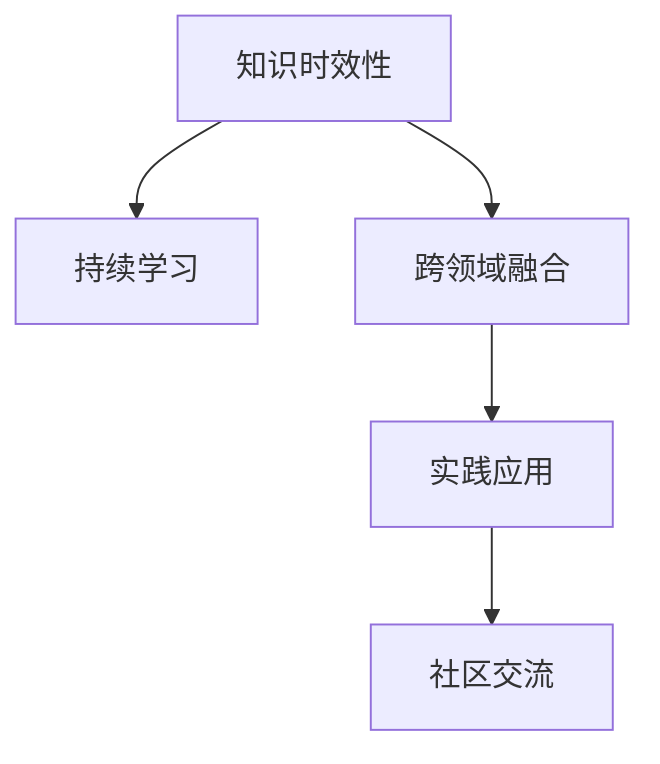

                 

# 知识的时效性：如何保持与时俱进

## 1. 背景介绍

### 1.1 问题由来

在快速变化的现代社会，知识的时效性问题日益凸显。新技术、新思想、新知识层出不穷，使得传统知识体系面临更新换代的压力。尤其是在科技和互联网行业，前沿技术的迭代速度远超以往任何时代。

这一趋势在人工智能(AI)领域表现得尤为明显。从深度学习到自然语言处理(NLP)，从计算机视觉到强化学习，AI技术不断革新，每年都有大量的新理论和新技术诞生。如何保持知识的的时效性，与时俱进，成为AI从业者和爱好者必须面对的问题。

### 1.2 问题核心关键点

保持知识时效性的关键在于：

- **快速学习和更新**：持续关注最新的研究论文、行业动态，及时更新自己的知识体系。
- **跨领域融合**：结合不同领域的技术和思想，形成更全面的知识体系。
- **实践应用**：将新知识应用到实际项目中，通过实践巩固学习成果，发现新问题。
- **社区交流**：积极参与开源社区和技术论坛，分享和交流最新知识，扩展视野。

## 2. 核心概念与联系

### 2.1 核心概念概述

为更好地理解如何保持知识的时效性，本节将介绍几个密切相关的核心概念：

- **知识时效性(Knowledge Obsolescence)**：指知识随着时间的推移而变得不再适用的现象。尤其在科技和互联网行业，新知识、新技术层出不穷，使得传统知识迅速过时。

- **持续学习(Lifelong Learning)**：指学习者在一生中不断获取、整合和应用新知识的过程，以保持知识的更新和时效性。

- **跨领域融合(Interdisciplinary Integration)**：指结合不同领域的技术和思想，形成更全面的知识体系。跨领域融合有助于突破单一领域的局限，形成更系统的知识框架。

- **实践应用(Practical Application)**：指将新知识应用到实际项目中，通过实践巩固学习成果，发现新问题。实践应用有助于将理论知识转化为实际能力，提升解决问题的能力。

- **社区交流(Community Interaction)**：指积极参与开源社区和技术论坛，分享和交流最新知识，扩展视野。社区交流有助于获取最新资讯，了解前沿动态，发现新趋势。

这些核心概念之间的逻辑关系可以通过以下Mermaid流程图来展示：



这个流程图展示了几大核心概念之间的关系：

1. 知识时效性是问题的核心，需要通过持续学习、跨领域融合、实践应用和社区交流等手段来解决。
2. 持续学习是保持知识更新和时效性的基础。
3. 跨领域融合有助于形成更全面的知识体系。
4. 实践应用有助于巩固学习成果，发现新问题。
5. 社区交流有助于获取最新资讯，扩展视野。

## 3. 核心算法原理 & 具体操作步骤

### 3.1 算法原理概述

保持知识时效性的核心在于持续学习和知识更新。基于此，我们提出一种基于监督学习的持续学习框架，该框架通过不断接收新数据和任务，更新模型的参数，从而保持模型的时效性和适应性。

形式化地，设原始知识表示为 $X$，新知识表示为 $Y$，模型表示为 $M$，更新后的知识表示为 $X'$。则持续学习的目标是：

$$
X' = M(X, Y)
$$

其中 $M$ 是一个学习函数，用于将原始知识和新知识进行融合，形成更新后的知识表示。通过监督学习，不断更新 $M$，保持知识的最新状态。

### 3.2 算法步骤详解

基于监督学习的持续学习框架包括以下几个关键步骤：

**Step 1: 初始化知识表示**

- 根据领域特点，选择适当的知识表示形式 $X$。可以是文本、图像、音频等。
- 将初始知识表示 $X$ 输入到模型 $M_0$ 中，得到初始模型参数 $W_0$。

**Step 2: 接收新数据**

- 不断收集最新的数据 $Y$，可以是新的知识、新的数据集等。
- 将新数据 $Y$ 输入到模型 $M_0$ 中，得到预测结果 $\hat{Y}$。

**Step 3: 计算损失函数**

- 计算预测结果 $\hat{Y}$ 与真实结果 $Y$ 之间的损失函数 $L$。
- 更新模型参数 $W_0$，使得损失函数 $L$ 最小化。

**Step 4: 更新知识表示**

- 将更新后的模型参数 $W_1$ 再次输入到模型 $M_0$ 中，得到更新后的知识表示 $X'$。

**Step 5: 重复执行**

- 重复上述步骤，不断接收新数据，更新模型参数，形成持续学习的闭环。

### 3.3 算法优缺点

基于监督学习的持续学习框架具有以下优点：

1. **灵活性强**：能够适应不同形式的知识表示和不同领域的数据。
2. **泛化能力强**：通过监督学习，模型能够从新数据中学习通用的知识规律。
3. **实用性高**：通过不断更新模型参数，保持知识的最新状态，提高模型的适应性。

同时，该框架也存在一些局限性：

1. **依赖标注数据**：需要大量的标注数据来更新模型参数，对于新领域的数据，标注成本较高。
2. **模型复杂度高**：对于复杂的高维数据，模型参数量较大，训练和推理成本较高。
3. **知识融合困难**：不同领域的数据可能存在显著差异，模型难以有效地进行跨领域融合。

尽管存在这些局限性，但基于监督学习的持续学习框架仍然是一种有效的方法，尤其适用于对知识时效性要求较高的场景。

### 3.4 算法应用领域

基于监督学习的持续学习框架，在多个领域得到了应用：

- **医疗领域**：医学知识的快速更新，要求医生不断学习最新的治疗方法和疾病理解。持续学习框架可以帮助医生及时更新知识库，提高诊疗能力。
- **金融领域**：金融市场瞬息万变，交易策略需要不断调整以适应新情况。持续学习框架可以用于实时更新交易策略，提高投资收益。
- **教育领域**：教育内容需要不断更新以适应学生需求的变化。持续学习框架可以帮助教师根据学生的反馈和最新研究成果，调整教学内容。
- **工业领域**：工业设备需要不断维护和升级以适应新的技术标准。持续学习框架可以用于监测设备状态，实时更新维护策略。

## 4. 数学模型和公式 & 详细讲解

### 4.1 数学模型构建

本节将使用数学语言对基于监督学习的持续学习框架进行更加严格的刻画。

设原始知识表示为 $X \in \mathcal{X}$，新知识表示为 $Y \in \mathcal{Y}$，模型表示为 $M: \mathcal{X} \times \mathcal{Y} \rightarrow \mathcal{X'}$。设模型参数为 $W$，知识表示为 $X'$，则持续学习的目标可以表示为：

$$
X' = M(X, Y; W)
$$

其中 $M$ 为学习函数，通过监督学习不断更新。

### 4.2 公式推导过程

假设原始知识表示为文本 $X$，新知识表示为标签 $Y$，模型 $M$ 为一个神经网络。设模型的输入层为 $x$，隐藏层为 $h$，输出层为 $x'$，则模型可以表示为：

$$
h = f(x; W_h)
$$
$$
x' = g(h; W_x)
$$

其中 $f$ 和 $g$ 分别为隐藏层和输出层的非线性变换函数，$W_h$ 和 $W_x$ 分别为隐藏层和输出层的权重矩阵。

持续学习的目标是：

$$
\min_{W} \frac{1}{N}\sum_{i=1}^N \ell(x_i, \hat{x'}_i, y_i)
$$

其中 $\ell$ 为损失函数，$\hat{x'}_i$ 为模型对第 $i$ 个样本的预测结果。

### 4.3 案例分析与讲解

以文本分类为例，分析持续学习框架的应用。

假设原始知识表示为文本 $X$，新知识表示为标签 $Y$。通过神经网络模型 $M$，将原始文本 $X$ 和新的标签 $Y$ 输入到模型中，得到更新后的文本表示 $X'$。

设原始文本 $X$ 的表示为词向量序列 $X = \{x_1, x_2, \ldots, x_n\}$，新的标签 $Y$ 为标签向量序列 $Y = \{y_1, y_2, \ldots, y_n\}$。模型 $M$ 可以表示为：

$$
h = f(X; W_h)
$$
$$
x' = g(h; W_x)
$$

其中 $W_h$ 和 $W_x$ 分别为隐藏层和输出层的权重矩阵。

持续学习的目标是：

$$
\min_{W_h, W_x} \frac{1}{N}\sum_{i=1}^N \ell(x_i, \hat{x'}_i, y_i)
$$

其中 $\ell$ 为交叉熵损失函数，$\hat{x'}_i$ 为模型对第 $i$ 个样本的预测结果。

在实际应用中，需要不断收集新标签 $Y$，并更新模型参数 $W_h, W_x$，以保持知识的最新状态。

## 5. 项目实践：代码实例和详细解释说明

### 5.1 开发环境搭建

在进行持续学习实践前，我们需要准备好开发环境。以下是使用Python进行PyTorch开发的环境配置流程：

1. 安装Anaconda：从官网下载并安装Anaconda，用于创建独立的Python环境。

2. 创建并激活虚拟环境：
```bash
conda create -n pytorch-env python=3.8 
conda activate pytorch-env
```

3. 安装PyTorch：根据CUDA版本，从官网获取对应的安装命令。例如：
```bash
conda install pytorch torchvision torchaudio cudatoolkit=11.1 -c pytorch -c conda-forge
```

4. 安装TensorFlow：
```bash
pip install tensorflow
```

5. 安装各类工具包：
```bash
pip install numpy pandas scikit-learn matplotlib tqdm jupyter notebook ipython
```

完成上述步骤后，即可在`pytorch-env`环境中开始持续学习实践。

### 5.2 源代码详细实现

这里我们以文本分类任务为例，给出使用Transformers库进行文本分类任务的持续学习模型实现。

首先，定义模型和数据处理函数：

```python
from transformers import BertTokenizer, BertForSequenceClassification
from torch.utils.data import Dataset, DataLoader
from sklearn.model_selection import train_test_split
import torch
import numpy as np

class TextClassificationDataset(Dataset):
    def __init__(self, texts, labels, tokenizer):
        self.texts = texts
        self.labels = labels
        self.tokenizer = tokenizer
        
    def __len__(self):
        return len(self.texts)
    
    def __getitem__(self, item):
        text = self.texts[item]
        label = self.labels[item]
        
        encoding = self.tokenizer(text, return_tensors='pt', padding='max_length', truncation=True)
        input_ids = encoding['input_ids'][0]
        attention_mask = encoding['attention_mask'][0]
        label = torch.tensor(label, dtype=torch.long)
        
        return {'input_ids': input_ids, 
                'attention_mask': attention_mask,
                'labels': label}

# 加载数据集
train_dataset = TextClassificationDataset(train_texts, train_labels, tokenizer)
dev_dataset = TextClassificationDataset(dev_texts, dev_labels, tokenizer)
test_dataset = TextClassificationDataset(test_texts, test_labels, tokenizer)

# 分割数据集为训练集和验证集
train_dataset, dev_dataset = train_test_split(train_dataset, test_size=0.2, random_state=42)
```

然后，定义模型和优化器：

```python
from transformers import AdamW

model = BertForSequenceClassification.from_pretrained('bert-base-cased', num_labels=2)

optimizer = AdamW(model.parameters(), lr=2e-5)
```

接着，定义训练和评估函数：

```python
from torch.utils.data import DataLoader
from tqdm import tqdm
from sklearn.metrics import accuracy_score

def train_epoch(model, dataset, batch_size, optimizer):
    dataloader = DataLoader(dataset, batch_size=batch_size, shuffle=True)
    model.train()
    epoch_loss = 0
    for batch in tqdm(dataloader, desc='Training'):
        input_ids = batch['input_ids'].to(device)
        attention_mask = batch['attention_mask'].to(device)
        labels = batch['labels'].to(device)
        model.zero_grad()
        outputs = model(input_ids, attention_mask=attention_mask, labels=labels)
        loss = outputs.loss
        epoch_loss += loss.item()
        loss.backward()
        optimizer.step()
    return epoch_loss / len(dataloader)

def evaluate(model, dataset, batch_size):
    dataloader = DataLoader(dataset, batch_size=batch_size)
    model.eval()
    preds, labels = [], []
    with torch.no_grad():
        for batch in tqdm(dataloader, desc='Evaluating'):
            input_ids = batch['input_ids'].to(device)
            attention_mask = batch['attention_mask'].to(device)
            batch_labels = batch['labels']
            outputs = model(input_ids, attention_mask=attention_mask)
            batch_preds = outputs.logits.argmax(dim=1).to('cpu').tolist()
            batch_labels = batch_labels.to('cpu').tolist()
            for pred, label in zip(batch_preds, batch_labels):
                preds.append(pred)
                labels.append(label)
                
    return accuracy_score(labels, preds)
```

最后，启动训练流程并在测试集上评估：

```python
epochs = 5
batch_size = 16

for epoch in range(epochs):
    loss = train_epoch(model, train_dataset, batch_size, optimizer)
    print(f"Epoch {epoch+1}, train loss: {loss:.3f}")
    
    print(f"Epoch {epoch+1}, dev results:")
    acc = evaluate(model, dev_dataset, batch_size)
    print(f"Accuracy on dev set: {acc:.3f}")
    
print("Final test results:")
acc = evaluate(model, test_dataset, batch_size)
print(f"Accuracy on test set: {acc:.3f}")
```

以上就是使用PyTorch对BERT模型进行文本分类任务的持续学习模型的完整代码实现。可以看到，通过不断收集新数据和新标签，模型的参数被更新，从而保持了知识的最新状态。

### 5.3 代码解读与分析

让我们再详细解读一下关键代码的实现细节：

**TextClassificationDataset类**：
- `__init__`方法：初始化文本、标签、分词器等关键组件。
- `__len__`方法：返回数据集的样本数量。
- `__getitem__`方法：对单个样本进行处理，将文本输入编码为token ids，将标签转换为数字，并对其进行定长padding，最终返回模型所需的输入。

**持续学习模型**：
- 通过不断收集新数据和新标签，更新模型参数，保持了知识的最新状态。
- 在训练过程中，不断接收新数据，更新模型参数，形成持续学习的闭环。

可以看到，持续学习模型的代码实现相对简洁，借助现有的深度学习框架，可以快速迭代和优化模型。

## 6. 实际应用场景

### 6.1 智慧医疗

在智慧医疗领域，持续学习框架可以帮助医生实时更新医疗知识和诊疗策略，提升诊疗能力。

医生可以不断收集新的病例数据，并标记其诊断结果。将这些新数据输入到持续学习模型中，不断更新医生的知识库，使其能够更快地诊断和处理新病例。同时，医生也可以根据新的研究成果，调整诊疗策略，优化治疗方案。

### 6.2 金融市场

在金融市场，持续学习框架可以帮助投资者实时更新投资策略，提高投资收益。

投资者可以不断收集新的市场数据，并标记其收益情况。将这些新数据输入到持续学习模型中，不断更新投资策略，使其能够更好地适应市场变化。同时，投资者也可以根据新的研究成果，调整投资组合，优化风险管理。

### 6.3 教育领域

在教育领域，持续学习框架可以帮助教师实时更新教学内容，提升教学质量。

教师可以不断收集学生的反馈和最新的研究成果，并将其作为新数据输入到持续学习模型中。模型会不断更新教学内容，使其更加符合学生的实际需求和学习进度。同时，教师也可以根据新的研究成果，调整教学方法，提升教学效果。

## 7. 工具和资源推荐

### 7.1 学习资源推荐

为了帮助开发者系统掌握持续学习理论基础和实践技巧，这里推荐一些优质的学习资源：

1. 《深度学习》系列博文：由深度学习领域专家撰写，深入浅出地介绍了深度学习的基本概念和前沿技术。
2. Coursera《深度学习专项课程》：斯坦福大学和DeepLearning.ai联合推出的深度学习课程，涵盖了深度学习的基础知识和实践技巧。
3. arXiv和Google Scholar：最新的研究论文和前沿动态，可以帮助开发者保持知识的时效性。

通过对这些资源的学习实践，相信你一定能够快速掌握持续学习的精髓，并用于解决实际的持续学习问题。

### 7.2 开发工具推荐

高效的开发离不开优秀的工具支持。以下是几款用于持续学习开发的常用工具：

1. PyTorch：基于Python的开源深度学习框架，灵活动态的计算图，适合快速迭代研究。大多数预训练语言模型都有PyTorch版本的实现。
2. TensorFlow：由Google主导开发的开源深度学习框架，生产部署方便，适合大规模工程应用。同样有丰富的预训练语言模型资源。
3. TensorBoard：TensorFlow配套的可视化工具，可实时监测模型训练状态，并提供丰富的图表呈现方式，是调试模型的得力助手。
4. Weights & Biases：模型训练的实验跟踪工具，可以记录和可视化模型训练过程中的各项指标，方便对比和调优。与主流深度学习框架无缝集成。

合理利用这些工具，可以显著提升持续学习的开发效率，加快创新迭代的步伐。

### 7.3 相关论文推荐

持续学习技术的不断发展源于学界的持续研究。以下是几篇奠基性的相关论文，推荐阅读：

1. "A Survey of Continuous Learning"（连续学习综述）：对持续学习技术的现状和未来进行了全面的总结和展望。
2. "A Tutorial on Continuous Learning for Recommendation Systems"（推荐系统的连续学习教程）：介绍了推荐系统中的持续学习技术，并展示了其在实际应用中的效果。
3. "Continuous Learning with Application to Preference and Opinion Models"（偏好和意见模型的持续学习）：研究了偏好和意见模型中的持续学习问题，提出了一系列新的学习算法。
4. "Deep Learning with Continuous Learning and Exposure Bias Correction"（带持续学习与曝光偏差校正的深度学习）：研究了深度学习中的持续学习问题，提出了新的训练策略。

这些论文代表了大语言模型微调技术的发展脉络。通过学习这些前沿成果，可以帮助研究者把握学科前进方向，激发更多的创新灵感。

## 8. 总结：未来发展趋势与挑战

### 8.1 总结

本文对基于监督学习的持续学习框架进行了全面系统的介绍。首先阐述了持续学习框架在知识时效性保持方面的重要作用，明确了持续学习在知识更新和适应性方面的独特价值。其次，从原理到实践，详细讲解了持续学习的数学原理和关键步骤，给出了持续学习任务开发的完整代码实例。同时，本文还广泛探讨了持续学习框架在智慧医疗、金融市场、教育等领域的应用前景，展示了持续学习范式的巨大潜力。此外，本文精选了持续学习的各类学习资源，力求为读者提供全方位的技术指引。

通过本文的系统梳理，可以看到，持续学习框架正在成为保持知识时效性的重要手段，极大地拓展了知识体系的更新和适应能力。受益于大规模语料的预训练和持续学习的微调，NLP技术将在更广泛的领域得到应用，为社会的各个方面带来深远影响。

### 8.2 未来发展趋势

展望未来，持续学习框架将呈现以下几个发展趋势：

1. **自动化程度提升**：未来的持续学习框架将更加自动化，能够自动收集、标注和训练新数据，实现更高程度的自动化学习。
2. **多模态融合**：未来的学习框架将能够同时处理文本、图像、语音等多种形式的数据，形成更全面的知识体系。
3. **自适应学习**：未来的学习框架将能够根据用户的个性化需求，自适应地调整学习策略，提供更贴合用户需求的学习路径。
4. **跨领域融合**：未来的学习框架将能够更好地融合不同领域的技术和思想，形成更系统的知识框架。
5. **零样本学习**：未来的学习框架将能够通过少量示例，快速适应新任务，实现零样本学习和少样本学习。

以上趋势凸显了持续学习框架的广阔前景。这些方向的探索发展，必将进一步提升知识的时效性和学习效率，为人类认知智能的进化带来深远影响。

### 8.3 面临的挑战

尽管持续学习框架已经取得了一定的进展，但在迈向更加智能化、普适化应用的过程中，它仍面临着诸多挑战：

1. **数据收集和标注成本高**：持续学习框架需要大量标注数据来更新模型参数，而新领域的标注数据往往难以获取。如何降低数据标注成本，提高数据质量，将是一大难题。
2. **模型复杂度高**：对于复杂的高维数据，模型参数量较大，训练和推理成本较高。如何降低模型复杂度，提高计算效率，将是一个重要的研究方向。
3. **跨领域融合困难**：不同领域的数据可能存在显著差异，模型难以有效地进行跨领域融合。如何实现跨领域知识的整合，形成更全面的知识体系，还需要更多的技术突破。
4. **数据隐私和安全**：在持续学习过程中，如何保护用户隐私和数据安全，是一个需要解决的重要问题。如何设计隐私保护机制，确保数据安全，将是一个重要的研究方向。

这些挑战需要研究者不断探索和创新，以推动持续学习框架的发展和应用。只有克服这些挑战，才能实现持续学习的全面落地和应用。

### 8.4 研究展望

面对持续学习框架面临的种种挑战，未来的研究需要在以下几个方面寻求新的突破：

1. **自动化数据标注**：开发能够自动标注数据的算法和工具，降低数据标注成本，提高数据质量。
2. **轻量级模型设计**：设计轻量级的模型结构，降低计算复杂度，提高模型效率。
3. **跨领域知识融合**：研究跨领域知识融合的方法，形成更全面的知识体系。
4. **隐私保护技术**：研究隐私保护技术，确保数据安全，保护用户隐私。
5. **自适应学习算法**：开发自适应学习算法，根据用户需求调整学习策略，提供更贴合用户的学习路径。

这些研究方向将推动持续学习框架的不断发展，为人类认知智能的进化带来深远影响。

## 9. 附录：常见问题与解答

**Q1：持续学习框架是否适用于所有领域？**

A: 持续学习框架在大多数领域都具有适用性，特别是对于数据量较小的领域。但对于一些数据量较大的领域，如医疗、金融等，可能存在数据标注成本较高的问题。需要结合具体领域的特点，选择合适的数据标注策略和持续学习算法。

**Q2：如何评估持续学习框架的效果？**

A: 持续学习框架的效果评估通常基于模型在目标任务上的表现。可以使用准确率、精度、召回率等指标来评估模型在不同数据集上的表现，同时结合模型在新数据上的适应能力进行综合评估。

**Q3：持续学习框架在实际应用中需要注意哪些问题？**

A: 持续学习框架在实际应用中需要注意以下几个问题：
1. 数据收集和标注成本：持续学习框架需要大量标注数据，而新领域的标注数据往往难以获取。如何降低数据标注成本，提高数据质量，将是一大难题。
2. 模型复杂度：对于复杂的高维数据，模型参数量较大，训练和推理成本较高。如何降低模型复杂度，提高计算效率，将是一个重要的研究方向。
3. 跨领域融合：不同领域的数据可能存在显著差异，模型难以有效地进行跨领域融合。如何实现跨领域知识的整合，形成更全面的知识体系，还需要更多的技术突破。
4. 数据隐私和安全：在持续学习过程中，如何保护用户隐私和数据安全，是一个需要解决的重要问题。如何设计隐私保护机制，确保数据安全，将是一个重要的研究方向。

这些问题的解决将推动持续学习框架的全面落地和应用。

---

作者：禅与计算机程序设计艺术 / Zen and the Art of Computer Programming

