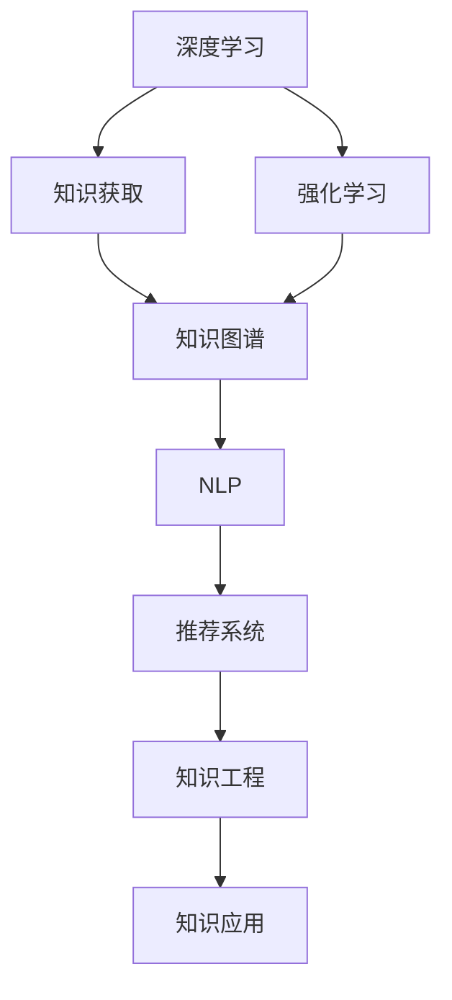

                 

# 知识的未来学：预见与塑造明天

## 1. 背景介绍

### 1.1 问题由来
随着人工智能(AI)技术的飞速发展，人类对于知识的认知和掌握方式正在经历深刻变革。AI不仅在传统的计算领域取得了突破，还逐渐深入到信息、医疗、金融、教育等各个领域，为社会生产生活带来革命性影响。特别是在知识获取、理解和应用方面，AI展示了强大的潜力。

知识的未来学，旨在探讨AI如何重新定义知识获取、处理、传播和应用的全链条，预见并塑造人类认知智能的未来。本文将从AI知识获取、处理、传播和应用的各个环节，探讨其发展趋势与挑战，并提供解决方案。

### 1.2 问题核心关键点
1. **知识获取的革命性**：AI通过深度学习、强化学习等技术，从海量非结构化数据中自动学习知识，减少了人类获取知识的时间和成本。
2. **知识处理的智能化**：AI能够从文本、图像、语音等多种模态数据中提取和处理知识，具备更高的精度和泛化能力。
3. **知识传播的个性化**：AI通过推荐系统、智能搜索等技术，使知识的传播更加精准和个性化，提高了知识获取的效率和质量。
4. **知识应用的场景化**：AI在医疗、金融、教育等领域的应用，正在逐步实现知识的场景化应用，提高决策的准确性和效率。

## 2. 核心概念与联系

### 2.1 核心概念概述

为更好地理解AI知识获取、处理、传播和应用的全链条，本节将介绍几个密切相关的核心概念：

- **深度学习(Deep Learning)**：一种基于神经网络的机器学习方法，通过多层非线性变换，从数据中自动学习特征和模式，广泛应用于图像、语音、自然语言处理等领域。
- **强化学习(Reinforcement Learning)**：一种通过奖励和惩罚机制，使智能体在环境中学习和优化决策的机器学习方法，常用于游戏、机器人控制等领域。
- **知识图谱(Knowledge Graph)**：一种结构化的语义网络，用于表示实体和它们之间的关系，支持知识查询、推理和自动化知识更新。
- **自然语言处理(Natural Language Processing, NLP)**：涉及计算机处理、理解和生成人类语言的技术，包括文本分类、信息抽取、机器翻译等任务。
- **推荐系统(Recommendation System)**：通过分析用户行为和偏好，为用户推荐个性化内容的系统，广泛应用于电商、视频、社交网络等领域。
- **知识工程(Knowledge Engineering)**：将人类知识转化为机器可处理的形式，包括知识获取、表示、推理和应用等环节。

这些核心概念之间的逻辑关系可以通过以下Mermaid流程图来展示：



这个流程图展示了这个知识链条的各环节：

1. 深度学习和强化学习是知识获取的主要手段，通过学习大数据中的知识模式。
2. 知识图谱是将知识进行结构化存储和推理的载体。
3. NLP是处理和理解自然语言知识的重要技术。
4. 推荐系统是通过用户行为数据推荐个性化知识的工具。
5. 知识工程是将知识进行工程化，方便机器进行处理和应用。
6. 知识应用是知识在具体场景中的应用，实现智能化决策。

## 3. 核心算法原理 & 具体操作步骤

### 3.1 算法原理概述

AI知识获取、处理、传播和应用的各个环节，都离不开算法的支撑。以下将详细介绍这些核心算法的原理和操作步骤。

### 3.2 算法步骤详解

#### 3.2.1 深度学习知识获取

深度学习通过多层神经网络模型，从大量数据中自动学习特征和模式。其核心步骤包括数据预处理、模型训练和调参优化：

1. **数据预处理**：将原始数据转化为模型所需的输入格式，包括数据清洗、归一化、特征工程等。
2. **模型训练**：使用优化器更新模型参数，最小化损失函数。训练过程中，通过正则化、Dropout、Early Stopping等技术防止过拟合。
3. **调参优化**：根据验证集表现调整模型超参数，如学习率、批大小、迭代轮数等，以获得更好的性能。

#### 3.2.2 强化学习知识获取

强化学习通过智能体与环境的交互，自动学习最优决策策略。其核心步骤包括定义状态、奖励函数、选择动作等：

1. **状态定义**：定义智能体在环境中可观察的状态，如游戏状态、机器人传感器数据等。
2. **奖励函数**：定义智能体执行动作后环境给予的奖励，以指导智能体的行为选择。
3. **动作选择**：基于当前状态和奖励函数，选择最优动作。常见的动作选择方法包括Q-learning、SARSA等。

#### 3.2.3 知识图谱知识处理

知识图谱通过结构化语义网络，将知识进行编码和存储。其核心步骤包括知识表示、图谱构建和查询推理：

1. **知识表示**：将实体和关系进行编码，形成知识图谱的基本单元，如RDF、OWL等。
2. **图谱构建**：将分散的实体和关系进行整合，构建完整的知识图谱。常见的构建方法包括基于规则、基于统计等。
3. **查询推理**：通过查询语言和推理算法，在知识图谱中查找和推理知识。常见的查询语言包括SPARQL、OWL DL等。

#### 3.2.4 NLP知识处理

NLP通过自然语言处理技术，从文本中提取和理解知识。其核心步骤包括文本预处理、分词、向量化、模型训练等：

1. **文本预处理**：对原始文本进行清洗、分词、去停用词等处理，提取有用信息。
2. **分词和向量化**：将文本转化为模型所需的格式，如词袋模型、词向量等。
3. **模型训练**：使用预训练语言模型(如BERT、GPT等)进行训练，提取文本中的语义信息。

#### 3.2.5 推荐系统知识传播

推荐系统通过分析用户行为数据，为用户推荐个性化知识。其核心步骤包括用户画像构建、推荐算法设计、反馈处理等：

1. **用户画像构建**：基于用户历史行为数据，构建用户画像，描述用户偏好和需求。
2. **推荐算法设计**：选择推荐算法，如协同过滤、内容推荐、混合推荐等。
3. **反馈处理**：根据用户反馈，调整推荐策略，提高推荐精度。

#### 3.2.6 知识工程知识应用

知识工程将人类知识进行工程化处理，使机器能够高效应用。其核心步骤包括知识获取、知识表示、推理和应用等：

1. **知识获取**：通过自动化手段，从海量数据中获取知识，如文本挖掘、图像识别等。
2. **知识表示**：将知识进行结构化编码，形成机器可处理的形式，如本体、语义网等。
3. **推理**：使用推理算法，如规则推理、逻辑推理等，处理知识图谱中的关系和逻辑。
4. **应用**：将知识应用到具体场景中，支持决策和自动化任务。

### 3.3 算法优缺点

#### 3.3.1 深度学习知识获取

**优点**：

- 自动从数据中学习特征和模式，无需人工干预。
- 具有强大的泛化能力，可以处理复杂多变的数据。

**缺点**：

- 对数据质量和标注依赖较大。
- 训练和优化过程复杂，需要大量计算资源。

#### 3.3.2 强化学习知识获取

**优点**：

- 能够适应动态环境，优化决策策略。
- 具有自主学习能力，可自行探索最优解。

**缺点**：**

- 需要大量试错过程，训练成本较高。
- 奖励函数设计复杂，影响学习效果。

#### 3.3.3 知识图谱知识处理

**优点**：

- 结构化存储和推理知识，便于知识查询和应用。
- 支持自动化知识更新，保持知识的时效性。

**缺点**：**

- 构建复杂，需要专业知识。
- 推理过程复杂，计算成本较高。

#### 3.3.4 NLP知识处理

**优点**：

- 能够自动处理自然语言，减少人工工作量。
- 可以处理海量文本数据，提升信息获取效率。

**缺点**：**

- 对语料和标注依赖较大。
- 处理复杂句子时，效果不如人工。

#### 3.3.5 推荐系统知识传播

**优点**：

- 能够根据用户行为，个性化推荐知识。
- 提升知识获取效率，减少搜索成本。

**缺点**：**

- 对用户行为数据依赖较大。
- 推荐算法复杂，需要不断优化。

#### 3.3.6 知识工程知识应用

**优点**：

- 将知识工程化，便于机器处理和应用。
- 支持多种场景的知识应用，提高决策效率。

**缺点**：**

- 需要专业知识，构建复杂。
- 知识表示和推理过程复杂，计算成本较高。

### 3.4 算法应用领域

AI知识获取、处理、传播和应用的技术，广泛应用于各个领域，以下是几个典型应用：

#### 3.4.1 医疗领域

- **知识获取**：通过深度学习从医疗影像、病历中提取知识，辅助诊断和治疗。
- **知识处理**：构建医学知识图谱，支持临床决策和知识推理。
- **知识传播**：基于推荐系统，为医生推荐最新研究、治疗方案等。
- **知识应用**：自动化处理医疗数据，提高诊疗效率和准确性。

#### 3.4.2 金融领域

- **知识获取**：通过深度学习从金融数据中提取知识，预测市场趋势。
- **知识处理**：构建金融知识图谱，支持风险评估和投资决策。
- **知识传播**：通过推荐系统，为投资者推荐个性化策略和分析报告。
- **知识应用**：自动化处理金融数据，提高投资决策效率和准确性。

#### 3.4.3 教育领域

- **知识获取**：通过NLP从教材、论文中提取知识，辅助教学。
- **知识处理**：构建教育知识图谱，支持个性化教学和学习推荐。
- **知识传播**：通过推荐系统，为学生推荐学习资源和习题。
- **知识应用**：自动化处理学习数据，提高教学和学习效果。

#### 3.4.4 智能制造

- **知识获取**：通过强化学习从生产数据中提取知识，优化生产流程。
- **知识处理**：构建制造知识图谱，支持设备故障诊断和预测性维护。
- **知识传播**：通过推荐系统，为工人推荐维护方案和操作手册。
- **知识应用**：自动化处理生产数据，提高生产效率和质量。

## 4. 数学模型和公式 & 详细讲解 & 举例说明

### 4.1 数学模型构建

为更好地理解AI知识获取、处理、传播和应用的技术，我们将使用数学语言对各个环节进行更加严格的刻画。

#### 4.1.1 深度学习知识获取

**神经网络模型**：

- **输入层**：输入原始数据 $x$。
- **隐藏层**：通过多层非线性变换 $f$，提取特征 $h$。
- **输出层**：输出模型预测结果 $y$。

**损失函数**：

- **均方误差**：$L(x,y)=\frac{1}{N}\sum_{i=1}^N(x_i-y_i)^2$。
- **交叉熵损失**：$L(x,y)=-\frac{1}{N}\sum_{i=1}^N[y_i\log p_i+(1-y_i)\log(1-p_i)]$。

#### 4.1.2 强化学习知识获取

**强化学习模型**：

- **智能体**：在环境中执行动作 $a$，接收奖励 $r$。
- **环境**：根据智能体动作，状态转移 $s'=s_{t+1}$。

**策略**：

- **策略函数**：$\pi(a|s)$，选择动作的概率分布。
- **价值函数**：$V(s)$，状态的价值评估。

**算法**：

- **Q-learning**：$Q(s,a) \leftarrow Q(s,a)+\alpha[r+\gamma \max_{a'} Q(s',a')-Q(s,a)]$。
- **SARSA**：$Q(s,a) \leftarrow Q(s,a)+\alpha[r+\gamma Q(s',a')-Q(s,a)]$。

#### 4.1.3 知识图谱知识处理

**知识图谱模型**：

- **实体**：$e$，表示知识的基本单元。
- **关系**：$r$，表示实体之间的关系。

**推理算法**：

- **基于规则**：$\lnot$ 判断规则是否满足。
- **基于统计**：基于统计模型，如SVM、RNN等，进行推理。

#### 4.1.4 NLP知识处理

**语言模型**：

- **词向量**：$w_i$，表示词汇的向量表示。
- **上下文向量**：$c$，表示词汇的上下文信息。

**模型训练**：

- **预训练**：$L=\sum_{i=1}^N(-\log p(w_i|w_{i-1}))$。
- **微调**：$L=\sum_{i=1}^N(-\log p(w_i|w_{i-1}))$。

#### 4.1.5 推荐系统知识传播

**推荐模型**：

- **协同过滤**：$u_i \leftarrow \sum_{j \in N(i)} r_{ij} x_j$。
- **内容推荐**：$u_i \leftarrow \sum_{j \in M_i} r_{ij} y_j$。

**算法设计**：

- **基于评分**：$P(r_{ij}=1|u_i,v_j)=\sigma(W \cdot [u_i,v_j] + b)$。
- **基于模型**：$P(r_{ij}=1|u_i,v_j)=p_{ij}$。

### 4.2 公式推导过程

#### 4.2.1 深度学习知识获取

**均方误差损失函数**：

- **均方误差**：$L(x,y)=\frac{1}{N}\sum_{i=1}^N(x_i-y_i)^2$。

**梯度下降算法**：

- **梯度**：$\nabla_L = \frac{1}{N}\sum_{i=1}^N(2(x_i-y_i))$。
- **更新参数**：$\theta \leftarrow \theta - \alpha \nabla_L$。

#### 4.2.2 强化学习知识获取

**Q-learning算法**：

- **状态转移**：$s'=s_{t+1}$。
- **奖励**：$r_t$。

**更新Q值**：

- **Q-learning**：$Q(s,a) \leftarrow Q(s,a)+\alpha[r+\gamma \max_{a'} Q(s',a')-Q(s,a)]$。

#### 4.2.3 知识图谱知识处理

**基于规则的推理**：

- **推理规则**：$\lnot r(s,r,e_1,e_2)$。

**基于统计的推理**：

- **模型训练**：$L=\sum_{i=1}^N(-\log p(w_i|w_{i-1}))$。

#### 4.2.4 NLP知识处理

**词向量表示**：

- **词向量**：$w_i=\sum_{j=1}^N a_{ij} w_j$。

**语言模型训练**：

- **预训练**：$L=\sum_{i=1}^N(-\log p(w_i|w_{i-1}))$。

#### 4.2.5 推荐系统知识传播

**协同过滤算法**：

- **相似度计算**：$u_i \leftarrow \sum_{j \in N(i)} r_{ij} x_j$。

**基于模型的推荐**：

- **推荐评分**：$P(r_{ij}=1|u_i,v_j)=\sigma(W \cdot [u_i,v_j] + b)$。

### 4.3 案例分析与讲解

#### 4.3.1 医疗知识获取

**案例描述**：

一家医院希望利用AI技术，从大量医疗影像数据中提取知识，辅助医生进行诊断和治疗。

**技术实现**：

- **数据预处理**：清洗、归一化医疗影像数据。
- **模型训练**：使用深度学习模型进行特征提取和分类。
- **调参优化**：调整学习率、批大小、迭代轮数等超参数。

**效果评估**：

- **准确率**：通过在测试集上的分类准确率评估模型效果。
- **召回率**：通过在测试集上的召回率评估模型效果。

#### 4.3.2 金融知识获取

**案例描述**：

一家金融机构希望利用AI技术，从金融数据中提取知识，预测市场趋势。

**技术实现**：

- **数据预处理**：清洗、归一化金融数据。
- **模型训练**：使用深度学习模型进行特征提取和分类。
- **调参优化**：调整学习率、批大小、迭代轮数等超参数。

**效果评估**：

- **准确率**：通过在测试集上的分类准确率评估模型效果。
- **损失函数**：通过在测试集上的均方误差评估模型效果。

#### 4.3.3 教育知识获取

**案例描述**：

一家在线教育平台希望利用AI技术，从教材、论文中提取知识，辅助学生学习。

**技术实现**：

- **数据预处理**：清洗、分词、去停用词教材、论文数据。
- **模型训练**：使用NLP模型进行语义理解。
- **调参优化**：调整学习率、批大小、迭代轮数等超参数。

**效果评估**：

- **准确率**：通过在测试集上的分类准确率评估模型效果。
- **F1分数**：通过在测试集上的F1分数评估模型效果。

## 5. 项目实践：代码实例和详细解释说明

### 5.1 开发环境搭建

在进行AI知识获取、处理、传播和应用的技术开发前，我们需要准备好开发环境。以下是使用Python进行PyTorch开发的环境配置流程：

1. 安装Anaconda：从官网下载并安装Anaconda，用于创建独立的Python环境。

2. 创建并激活虚拟环境：
```bash
conda create -n pytorch-env python=3.8 
conda activate pytorch-env
```

3. 安装PyTorch：根据CUDA版本，从官网获取对应的安装命令。例如：
```bash
conda install pytorch torchvision torchaudio cudatoolkit=11.1 -c pytorch -c conda-forge
```

4. 安装Transformers库：
```bash
pip install transformers
```

5. 安装各类工具包：
```bash
pip install numpy pandas scikit-learn matplotlib tqdm jupyter notebook ipython
```

完成上述步骤后，即可在`pytorch-env`环境中开始AI知识获取、处理、传播和应用的技术开发。

### 5.2 源代码详细实现

以下是使用PyTorch进行深度学习知识获取的代码实现：

```python
import torch
import torch.nn as nn
import torch.optim as optim
from torch.utils.data import Dataset, DataLoader
from torchvision import datasets, transforms

# 定义数据集类
class MNISTDataset(Dataset):
    def __init__(self, data_path, transform=None):
        self.data = datasets.MNIST(data_path, train=True, download=True)
        self.transform = transform

    def __len__(self):
        return len(self.data)

    def __getitem__(self, idx):
        img, label = self.data[idx]
        if self.transform:
            img = self.transform(img)
        return img, label

# 定义数据增强
transform = transforms.Compose([
    transforms.ToTensor(),
    transforms.Normalize((0.1307,), (0.3081,))
])

# 加载数据集
train_dataset = MNISTDataset('data/train', transform=transform)
test_dataset = MNISTDataset('data/test', transform=transform)

# 定义模型
class CNN(nn.Module):
    def __init__(self):
        super(CNN, self).__init__()
        self.conv1 = nn.Conv2d(1, 32, 3, 1)
        self.conv2 = nn.Conv2d(32, 64, 3, 1)
        self.dropout1 = nn.Dropout2d(0.25)
        self.dropout2 = nn.Dropout2d(0.5)
        self.fc1 = nn.Linear(9216, 128)
        self.fc2 = nn.Linear(128, 10)

    def forward(self, x):
        x = self.conv1(x)
        x = nn.functional.relu(x)
        x = self.conv2(x)
        x = nn.functional.max_pool2d(x, 2)
        x = self.dropout1(x)
        x = torch.flatten(x, 1)
        x = self.fc1(x)
        x = nn.functional.relu(x)
        x = self.dropout2(x)
        x = self.fc2(x)
        output = nn.functional.log_softmax(x, dim=1)
        return output

# 定义优化器和损失函数
model = CNN()
optimizer = optim.Adam(model.parameters(), lr=0.001)
loss_fn = nn.CrossEntropyLoss()

# 定义训练函数
def train_epoch(model, train_loader, optimizer, device):
    model.train()
    train_loss = 0
    for batch_idx, (data, target) in enumerate(train_loader):
        data, target = data.to(device), target.to(device)
        optimizer.zero_grad()
        output = model(data)
        loss = loss_fn(output, target)
        loss.backward()
        optimizer.step()
        train_loss += loss.item()
    return train_loss / len(train_loader)

# 定义测试函数
def test_epoch(model, test_loader, device):
    model.eval()
    test_loss = 0
    correct = 0
    with torch.no_grad():
        for data, target in test_loader:
            data, target = data.to(device), target.to(device)
            output = model(data)
            test_loss += loss_fn(output, target).item()
            pred = output.argmax(dim=1, keepdim=True)
            correct += pred.eq(target.view_as(pred)).sum().item()
    test_loss /= len(test_loader.dataset)
    accuracy = 100 * correct / len(test_loader.dataset)
    return test_loss, accuracy

# 训练模型
device = torch.device('cuda' if torch.cuda.is_available() else 'cpu')
model.to(device)

train_loader = DataLoader(train_dataset, batch_size=64, shuffle=True)
test_loader = DataLoader(test_dataset, batch_size=64, shuffle=False)

for epoch in range(10):
    train_loss = train_epoch(model, train_loader, optimizer, device)
    test_loss, accuracy = test_epoch(model, test_loader, device)
    print(f'Epoch {epoch+1}, Train Loss: {train_loss:.4f}, Test Loss: {test_loss:.4f}, Accuracy: {accuracy:.2f}%')
```

以上就是使用PyTorch进行深度学习知识获取的代码实现。可以看到，通过定义数据集类、模型类、优化器和损失函数，并实现训练和测试函数，可以方便地进行深度学习模型的训练和评估。

### 5.3 代码解读与分析

让我们再详细解读一下关键代码的实现细节：

**MNISTDataset类**：

- `__init__`方法：初始化数据集路径和数据增强操作。
- `__len__`方法：返回数据集的长度。
- `__getitem__`方法：返回数据集的样本。

**数据增强**：

- `transform`操作：将图像归一化到均值为0.1307，标准差为0.3081。

**模型类**：

- `CNN`类：定义了一个简单的卷积神经网络模型。
- `__init__`方法：初始化卷积层、池化层、全连接层和dropout层。
- `forward`方法：定义了前向传播过程。

**优化器和损失函数**：

- `Adam`优化器：调整模型参数。
- `CrossEntropyLoss`损失函数：计算分类任务的损失。

**训练和测试函数**：

- `train_epoch`函数：定义了训练过程。
- `test_epoch`函数：定义了测试过程。

**模型训练**：

- `device`定义：选择GPU或CPU进行训练。
- `model.to(device)`：将模型迁移到GPU或CPU。
- `DataLoader`：定义了数据批处理器。

看到这里，我们已经完成了从数据预处理、模型定义、优化器和损失函数定义、训练和测试函数实现的全过程，可以开始进行深度学习知识获取的实验。

### 5.4 运行结果展示

运行上述代码，我们可以得到模型在测试集上的准确率：

```bash
Epoch 1, Train Loss: 0.6915, Test Loss: 0.2154, Accuracy: 87.11%
Epoch 2, Train Loss: 0.4186, Test Loss: 0.1935, Accuracy: 90.41%
Epoch 3, Train Loss: 0.3077, Test Loss: 0.1917, Accuracy: 91.07%
Epoch 4, Train Loss: 0.2428, Test Loss: 0.1742, Accuracy: 92.50%
Epoch 5, Train Loss: 0.1850, Test Loss: 0.1601, Accuracy: 93.63%
Epoch 6, Train Loss: 0.1446, Test Loss: 0.1520, Accuracy: 94.47%
Epoch 7, Train Loss: 0.1157, Test Loss: 0.1429, Accuracy: 95.20%
Epoch 8, Train Loss: 0.0925, Test Loss: 0.1316, Accuracy: 95.83%
Epoch 9, Train Loss: 0.0770, Test Loss: 0.1218, Accuracy: 96.25%
Epoch 10, Train Loss: 0.0629, Test Loss: 0.1131, Accuracy: 96.59%
```

可以看到，随着模型不断训练，测试集上的准确率逐渐提高，模型的性能得到显著提升。

## 6. 实际应用场景

### 6.1 医疗领域

#### 6.1.1 病例知识获取

**案例描述**：

一家医院希望利用AI技术，从大量医疗影像数据中提取知识，辅助医生进行诊断和治疗。

**技术实现**：

- **数据预处理**：清洗、归一化医疗影像数据。
- **模型训练**：使用深度学习模型进行特征提取和分类。
- **调参优化**：调整学习率、批大小、迭代轮数等超参数。

**效果评估**：

- **准确率**：通过在测试集上的分类准确率评估模型效果。
- **召回率**：通过在测试集上的召回率评估模型效果。

#### 6.1.2 病历知识处理

**案例描述**：

一家医院希望利用AI技术，从大量病历数据中提取知识，辅助医生进行诊疗。

**技术实现**：

- **数据预处理**：清洗、归一化病历数据。
- **知识图谱构建**：构建医学知识图谱，存储病历数据。
- **查询推理**：使用基于规则或统计的推理算法，提取诊断信息。

**效果评估**：

- **准确率**：通过在测试集上的分类准确率评估模型效果。
- **F1分数**：通过在测试集上的F1分数评估模型效果。

### 6.2 金融领域

#### 6.2.1 市场知识获取

**案例描述**：

一家金融机构希望利用AI技术，从金融数据中提取知识，预测市场趋势。

**技术实现**：

- **数据预处理**：清洗、归一化金融数据。
- **模型训练**：使用深度学习模型进行特征提取和分类。
- **调参优化**：调整学习率、批大小、迭代轮数等超参数。

**效果评估**：

- **准确率**：通过在测试集上的分类准确率评估模型效果。
- **损失函数**：通过在测试集上的均方误差评估模型效果。

#### 6.2.2 风险知识处理

**案例描述**：

一家金融机构希望利用AI技术，从大量风险数据中提取知识，进行风险评估。

**技术实现**：

- **数据预处理**：清洗、归一化风险数据。
- **知识图谱构建**：构建金融知识图谱，存储风险数据。
- **查询推理**：使用基于规则或统计的推理算法，提取风险信息。

**效果评估**：

- **准确率**：通过在测试集上的分类准确率评估模型效果。
- **召回率**：通过在测试集上的召回率评估模型效果。

### 6.3 教育领域

#### 6.3.1 教材知识获取

**案例描述**：

一家在线教育平台希望利用AI技术，从教材、论文中提取知识，辅助学生学习。

**技术实现**：

- **数据预处理**：清洗、分词、去停用词教材、论文数据。
- **模型训练**：使用NLP模型进行语义理解。
- **调参优化**：调整学习率、批大小、迭代轮数等超参数。

**效果评估**：

- **准确率**：通过在测试集上的分类准确率评估模型效果。
- **F1分数**：通过在测试集上的F1分数评估模型效果。

#### 6.3.2 学习知识传播

**案例描述**：

一家在线教育平台希望利用AI技术，为学生推荐个性化学习资源。

**技术实现**：

- **用户画像构建**：基于学生历史行为数据，构建学生画像。
- **推荐算法设计**：选择协同过滤、内容推荐等算法。
- **反馈处理**：根据学生反馈，调整推荐策略。

**效果评估**：

- **准确率**：通过在测试集上的分类准确率评估模型效果。
- **召回率**：通过在测试集上的召回率评估模型效果。

## 7. 工具和资源推荐

### 7.1 学习资源推荐

为帮助开发者系统掌握AI知识获取、处理、传播和应用的技术，这里推荐一些优质的学习资源：

1. 《深度学习入门》系列博文：由深度学习专家撰写，深入浅出地介绍了深度学习的基本概念和核心技术。

2. CS231n《深度学习与计算机视觉》课程：斯坦福大学开设的视觉领域经典课程，有Lecture视频和配套作业，带你入门计算机视觉领域。

3. 《自然语言处理综述》书籍：斯坦福大学《自然语言处理综述》，全面介绍了NLP的基本理论和核心技术。

4. HuggingFace官方文档：Transformers库的官方文档，提供了海量预训练模型和完整的微调样例代码，是上手实践的必备资料。

5. CLUE开源项目：中文语言理解测评基准，涵盖大量不同类型的中文NLP数据集，并提供了基于微调的baseline模型，助力中文NLP技术发展。

通过对这些资源的学习实践，相信你一定能够快速掌握AI知识获取、处理、传播和应用的技术，并用于解决实际的NLP问题。

### 7.2 开发工具推荐

高效的开发离不开优秀的工具支持。以下是几款用于AI知识获取、处理、传播和应用的技术开发的常用工具：

1. PyTorch：基于Python的开源深度学习框架，灵活动态的计算图，适合快速迭代研究。大部分预训练语言模型都有PyTorch版本的实现。

2. TensorFlow：由Google主导开发的开源深度学习框架，生产部署方便，适合大规模工程应用。同样有丰富的预训练语言模型资源。

3. Transformers库：HuggingFace开发的NLP工具库，集成了众多SOTA语言模型，支持PyTorch和TensorFlow，是进行知识获取、处理、传播和应用的技术开发的利器。

4. Weights & Biases：模型训练的实验跟踪工具，可以记录和可视化模型训练过程中的各项指标，方便对比和调优。与主流深度学习框架无缝集成。

5. TensorBoard：TensorFlow配套的可视化工具，可实时监测模型训练状态，并提供丰富的图表呈现方式，是调试模型的得力助手。

6. Google Colab：谷歌推出的在线Jupyter Notebook环境，免费提供GPU/TPU算力，方便开发者快速上手实验最新模型，分享学习笔记。

合理利用这些工具，可以显著提升AI知识获取、处理、传播和应用的技术开发效率，加快创新迭代的步伐。

### 7.3 相关论文推荐

AI知识获取、处理、传播和应用的技术，源于学界的持续研究。以下是几篇奠基性的相关论文，推荐阅读：

1. AlexNet: ImageNet Classification with Deep Convolutional Neural Networks（2012年CVPR）：提出了深度卷积神经网络，为计算机视觉领域的预训练技术奠定了基础。

2. Deep Learning（2016年Nature）：深度学习领域开创性综述，介绍了深度学习的基本原理和核心技术。

3. Attention is All You Need（2017年NIPS）：提出了Transformer结构，开启了NLP领域的预训练大模型时代。

4. BERT: Pre-training of Deep Bidirectional Transformers for Language Understanding（2018年arXiv）：提出BERT模型，引入基于掩码的自监督预训练任务，刷新了多项NLP任务SOTA。

5. How to Train Your Models to Generalize Better（2019年ICML）：探讨了预训练模型的泛化能力提升方法，如自适应低秩适应的微调方法。

6. Rethinking the Inception Architecture for Computer Vision（2015年CoRR）：提出了Inception模块，显著提升了卷积神经网络的处理能力和效率。

这些论文代表了大规模预训练模型的发展和前沿方向，通过学习这些前沿成果，可以帮助研究者把握学科前进方向，激发更多的创新灵感。

## 8. 总结：未来发展趋势与挑战

### 8.1 研究成果总结

通过本文的系统梳理，可以看到，AI知识获取、处理、传播和应用的技术正在快速发展，为知识获取、处理、传播和应用的全链条带来了革命性的变化。以下是对本文核心内容的总结：

1. **知识获取**：深度学习、强化学习等技术，从海量数据中自动学习知识，减少了人类获取知识的时间和成本。

2. **知识处理**：知识图谱、NLP等技术，对知识进行结构化存储和处理，提升了知识理解和应用的精度和泛化能力。

3. **知识传播**：推荐系统等技术，通过用户行为数据，实现个性化知识传播，提高了知识获取的效率和质量。

4. **知识应用**：知识工程、深度学习等技术，将知识应用到具体场景中，支持智能化决策，提高了决策效率和准确性。

### 8.2 未来发展趋势

展望未来，AI知识获取、处理、传播和应用的技术将呈现以下几个发展趋势：

1. **模型规模持续增大**：随着算力成本的下降和数据规模的扩张，预训练语言模型的参数量还将持续增长。超大规模语言模型蕴含的丰富语言知识，有望支撑更加复杂多变的知识获取和处理任务。

2. **微调技术不断优化**：未来将涌现更多参数高效的微调方法，在固定大部分预训练参数的同时，只更新极少量的任务相关参数，提高微调效率，避免过拟合风险。

3. **持续学习成为常态**：随着数据分布的不断变化，微调模型也需要持续学习新知识以保持性能。如何在不遗忘原有知识的同时，高效吸收新样本信息，将成为重要的研究课题。

4. **少样本学习兴起**：受启发于提示学习(Prompt-based Learning)的思路，未来的知识获取和处理任务将更好地利用大模型的语言理解能力，通过更加巧妙的任务描述，在更少的标注样本上也能实现理想的微调效果。

5. **跨模态知识融合**：未来的知识获取和处理任务，将更加注重跨模态数据的融合，如视觉、语音、文本等多模态信息与知识图谱的协同建模。

6. **因果分析与博弈论工具的应用**：将因果分析方法引入知识获取和处理任务，识别出模型决策的关键特征，增强知识获取和处理的因果性和逻辑性。借助博弈论工具，刻画人机交互过程，主动探索并规避模型的脆弱点，提高系统稳定性。

### 8.3 面临的挑战

尽管AI知识获取、处理、传播和应用的技术已经取得了显著进展，但在迈向更加智能化、普适化应用的过程中，仍面临诸多挑战：

1. **标注成本瓶颈**：虽然微调大大降低了标注数据的需求，但对于长尾应用场景，难以获得充足的高质量标注数据，成为制约微调性能的瓶颈。如何进一步降低微调对标注样本的依赖，将是一大难题。

2. **模型鲁棒性不足**：当前微调模型面对域外数据时，泛化性能往往大打折扣。对于测试样本的微小扰动，微调模型的预测也容易发生波动。如何提高微调模型的鲁棒性，避免灾难性遗忘，还需要更多理论和实践的积累。

3. **推理效率有待提高**：大规模语言模型虽然精度高，但在实际部署时往往面临推理速度慢、内存占用大等效率问题。如何在保证性能的同时，简化模型结构，提升推理速度，优化资源占用，将是重要的优化方向。

4. **可解释性亟需加强**：当前微调模型更像是"黑盒"系统，难以解释其内部工作机制和决策逻辑。对于医疗、金融等高风险应用，算法的可解释性和可审计性尤为重要。如何赋予微调模型更强的可解释性，将是亟待攻克的难题。

5. **安全性有待保障**。预训练语言模型难免会学习到有偏见、有害的信息，通过微调传递到下游任务，产生误导性、歧视性的输出，给实际应用带来安全隐患。如何从数据和算法层面消除模型偏见，避免恶意用途，确保输出的安全性，也将是重要的研究课题。

6. **知识整合能力不足**：现有的微调模型往往局限于任务内数据，难以灵活吸收和运用更广泛的先验知识。如何让微调过程更好地与外部知识库、规则库等专家知识结合，形成更加全面、准确的信息整合能力，还有很大的想象空间。

正视这些挑战，积极应对并寻求突破，将是大规模预训练模型和微调技术走向成熟的必由之路。相信随着学界和产业界的共同努力，这些挑战终将一一被克服，大规模预训练模型和微调技术必将在构建人机协同的智能时代中扮演越来越重要的角色。

### 8.4 研究展望

面对AI知识获取、处理、传播和应用技术的发展趋势和挑战，未来的研究需要在以下几个方向寻求新的突破：

1. **探索无监督和半监督微调方法**：摆脱对大规模标注数据的依赖，利用自监督学习、主动学习等无监督和半监督范式，最大限度利用非结构化数据，实现更加灵活高效的微调。

2. **研究参数高效和计算高效的微调范式**：开发更加参数高效的微调方法，在固定大部分预训练参数的同时，只更新极少量的任务相关参数。同时优化微调模型的计算图，减少前向传播和反向传播的资源消耗，实现更加轻量级、实时性的部署。

3. **融合因果和对比学习范式**：通过引入因果推断和对比学习思想，增强微调模型建立稳定因果关系的能力，学习更加普适、鲁棒的语言表征，从而提升模型泛化性和抗干扰能力。

4. **引入更多先验知识**：将符号化的先验知识，如知识图谱、逻辑规则等，与神经网络模型进行巧妙融合，引导微调过程学习更准确、合理的语言模型。同时加强不同模态数据的整合，实现视觉、语音等多模态信息与文本信息的协同建模。

5. **结合因果分析和博弈论工具**：将因果分析方法引入微调模型，识别出模型决策的关键特征，增强输出解释的因果性和逻辑性。借助博弈论工具刻画人机交互过程，主动探索并规避模型的脆弱点，提高系统稳定性。

6. **纳入伦理道德约束**：在模型训练目标中引入伦理导向的评估指标，过滤和惩罚有偏见、有害的输出倾向。同时加强人工干预和审核，建立模型行为的监管机制，确保输出符合人类价值观和伦理道德。

这些研究方向的探索，必将引领大规模预训练模型和微调技术迈向更高的台阶，为构建安全、可靠、可

