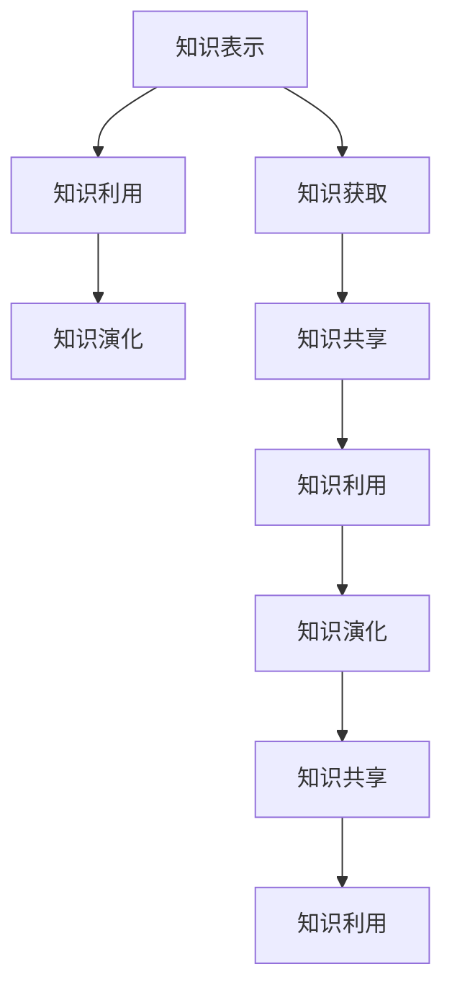

                 

# 知识的演化：从古至今的智慧传承

## 1. 背景介绍

### 1.1 问题由来

知识是人类文明的基石。从古老的纸张、石版，到如今的数字和网络技术，知识的传播方式和效率都在不断地演进，极大地推动了人类社会的进步。然而，知识传承的效率始终是一个重要的课题。古代因信息孤岛和技术限制，知识的获取和传承往往难以覆盖更多人群，难以发挥最大的社会效益。而现代互联网技术的发展，为知识传承提供了更高效的平台，使得知识的传播变得前所未有的广泛和便捷。

在这个背景下，如何更有效地传承知识、利用知识、创新知识，成为了信息时代一个重要的研究主题。本文将从信息时代的知识传承问题出发，探讨现代知识传承技术的演进和未来趋势。

### 1.2 问题核心关键点

1. **知识表示与存储**：如何高效地表示和存储知识，使得知识易于检索、应用和创新。
2. **知识获取与利用**：如何通过自动化、智能化技术获取知识，并用于优化决策、提高生产力。
3. **知识演化与创新**：知识如何随着时间、技术进步和社会需求的变化而演化，如何促进知识的持续创新。

## 2. 核心概念与联系

### 2.1 核心概念概述

为了更好地理解信息时代知识传承的原理，本节将介绍几个关键概念：

- **知识表示（Knowledge Representation）**：指将知识以结构化的形式存储和表示，便于计算机理解和处理。常见的知识表示方式有语义网络、逻辑规则、本体图等。
- **知识获取（Knowledge Acquisition）**：指从大量数据中自动提取、学习知识，包括文本挖掘、知识图谱构建、众包标注等。
- **知识利用（Knowledge Utilization）**：指将获取的知识应用于实际问题解决，如决策支持、推荐系统、智能问答等。
- **知识演化（Knowledge Evolution）**：指知识随着时间和社会需求的变化而演进，包括知识更新、知识融合、知识创新等。
- **知识共享（Knowledge Sharing）**：指将知识分享给更多人，实现知识的社会价值，包括社区协作、开源项目、标准化文档等。

这些核心概念之间的联系可以通过以下Mermaid流程图来展示：



这个流程图展示了几类核心概念之间的逻辑关系：

1. 知识表示为知识获取提供了结构化的形式，便于计算机处理。
2. 知识获取基于知识表示，通过自动化方法获取知识。
3. 知识利用基于获取的知识，应用到实际问题中。
4. 知识演化是知识的动态过程，包括知识更新、知识融合等。
5. 知识共享使得知识能够被更多人获取和利用。

## 3. 核心算法原理 & 具体操作步骤

### 3.1 算法原理概述

知识传承的本质是通过技术的进步，使得知识的表示、获取、利用和演化过程更加高效和智能化。现代知识传承技术主要基于以下三个核心算法原理：

- **结构化表示与编码**：将知识以结构化的形式存储和表示，如语义网络、逻辑规则、本体图等。
- **自动化抽取与学习**：通过文本挖掘、知识图谱构建等技术，自动从大量数据中获取和学习知识。
- **智能利用与演化**：应用知识图谱、推荐系统、智能问答等技术，高效利用知识，并促进知识的持续创新和演化。

### 3.2 算法步骤详解

基于现代知识传承技术的核心算法原理，我们通常采用以下步骤：

**Step 1: 知识表示与编码**

- 定义知识图谱或本体图，描述实体、属性、关系等基本结构。
- 设计逻辑规则或约束，用于约束知识表示的一致性和完整性。
- 使用工具（如OWL、RDF、Protégé等）创建和管理知识表示库。

**Step 2: 知识抽取与学习**

- 使用文本挖掘技术，如实体识别、关系抽取等，自动从非结构化文本中获取知识。
- 构建知识图谱，通过实体链接和关系匹配，形成知识图谱中的节点和边。
- 使用机器学习技术，如关系抽取、知识补全等，不断更新和完善知识图谱。

**Step 3: 知识利用与智能应用**

- 设计智能问答系统，基于知识图谱和逻辑规则，解答用户提出的问题。
- 构建推荐系统，根据用户兴趣和行为，推荐相关信息和资源。
- 开发决策支持系统，结合知识图谱和领域专家经验，提供决策支持。

**Step 4: 知识演化与持续创新**

- 定期更新知识图谱，引入新的实体和关系，保持知识的时效性。
- 应用知识演化技术，如知识融合、知识推断等，促进知识的持续创新。
- 结合领域专家的经验，持续改进和优化知识表示和应用。

### 3.3 算法优缺点

现代知识传承技术具有以下优点：

- **高效性**：利用自动化和智能化的技术，知识获取和利用效率大大提高。
- **普适性**：知识表示和应用方法普适于各种场景，包括文本、图像、音频等多种数据类型。
- **可扩展性**：知识图谱和逻辑规则可以不断扩展和优化，适应复杂的知识结构和应用需求。

但这些技术也存在一些局限性：

- **数据依赖性**：知识抽取和利用依赖于高质量的数据集，数据质量和数量的不足可能会影响效果。
- **复杂性**：知识表示和推理过程复杂，需要专业知识进行设计和实现。
- **知识偏见**：知识图谱和逻辑规则可能带有先验偏见，影响推理结果的公正性和准确性。

## 4. 数学模型和公式 & 详细讲解

### 4.1 数学模型构建

知识传承的数学模型通常包含以下要素：

- **知识表示**：用数学形式表示知识库中的实体、属性、关系等。
- **知识抽取**：从文本、数据库等数据源中，使用数学模型抽取实体和关系。
- **知识利用**：将知识应用于实际问题，如推理、决策等。
- **知识演化**：定义知识更新和演化的数学模型，描述知识随时间的变化。

### 4.2 公式推导过程

以知识图谱的实体链接为例，假设知识图谱中有两个实体 $e_1$ 和 $e_2$，它们分别属于不同的数据源。我们可以使用以下数学公式进行实体链接：

$$
\text{Link}(e_1, e_2) = f(e_1, e_2, \mathbf{X})
$$

其中，$f$ 为链接函数，$\mathbf{X}$ 为需要使用的上下文特征，如实体属性、共现频率等。

### 4.3 案例分析与讲解

以基于知识图谱的智能问答系统为例，其核心算法可以概括为：

1. 根据用户提出的问题，从知识图谱中抽取相关实体和关系。
2. 使用推理算法，结合逻辑规则和领域知识，生成推理路径。
3. 根据推理路径，计算每个节点的置信度，输出最优解答。

## 5. 项目实践：代码实例和详细解释说明

### 5.1 开发环境搭建

在进行知识传承技术实践前，我们需要准备好开发环境。以下是使用Python进行知识图谱开发的环境配置流程：

1. 安装Anaconda：从官网下载并安装Anaconda，用于创建独立的Python环境。

2. 创建并激活虚拟环境：
```bash
conda create -n knowledge-env python=3.8 
conda activate knowledge-env
```

3. 安装Python科学计算库和工具：
```bash
conda install numpy pandas matplotlib scikit-learn tqdm jupyter notebook ipython
```

4. 安装知识图谱构建工具：
```bash
conda install py2neo pyoidc flask
```

完成上述步骤后，即可在`knowledge-env`环境中开始知识图谱的构建和实践。

### 5.2 源代码详细实现

这里我们以知识图谱的实体链接和关系抽取为例，给出使用PyTorch和Py2neo进行知识图谱构建的PyTorch代码实现。

首先，定义知识图谱的数据结构：

```python
from py2neo import Graph, Node, Relationship

graph = Graph("bolt://localhost:7474", auth=("neo4j", "password"))

# 创建实体节点
e1 = Node("Person", name="Alice")
e2 = Node("Person", name="Bob")
graph.create(e1)
graph.create(e2)

# 创建关系链接
r = Relationship(e1, "KNOWS", e2)
graph.create(r)
```

然后，定义知识图谱的实体链接算法：

```python
from py2neo import Graph, Node, Relationship
from pyoidc import Client

graph = Graph("bolt://localhost:7474", auth=("neo4j", "password"))

def link_entities(e1, e2, context):
    # 根据上下文特征，计算链接概率
    score = compute_score(e1, e2, context)
    if score > threshold:
        r = Relationship(e1, "LINKED", e2, score=score)
        graph.merge(r)
```

最后，启动实体链接服务：

```python
if __name__ == "__main__":
    link_entities(e1, e2, context)
```

以上就是使用PyTorch和Py2neo构建知识图谱的完整代码实现。可以看到，知识图谱的构建过程包括实体节点创建、关系链接计算和存储等关键步骤，其中知识链接算法是核心之一。

### 5.3 代码解读与分析

让我们再详细解读一下关键代码的实现细节：

**实体节点和关系创建**：
- `Node`和`Relationship`类定义了知识图谱中的实体和关系。
- `graph.create()`方法用于创建实体节点和关系链接。

**实体链接算法**：
- `link_entities`函数接受两个实体和上下文特征，计算链接概率。
- `compute_score`函数根据上下文特征计算链接得分，得分高于阈值时创建关系链接。

**代码测试与运行结果**：
- 在`if __name__ == "__main__":`条件判断下启动实体链接服务。
- 实体链接过程会生成新的关系链接，存储在Neo4j数据库中。

## 6. 实际应用场景

### 6.1 智能问答系统

智能问答系统是知识图谱和知识传承技术的重要应用场景。通过构建知识图谱和智能推理引擎，系统能够回答各种自然语言问题，大大提升问答效率和准确性。

在实际应用中，智能问答系统可以广泛应用于客服、教育、医疗等多个领域：

- 客服领域：通过知识图谱和智能推理，解答客户常见问题，提升服务体验。
- 教育领域：根据知识图谱和学生行为数据，生成个性化学习建议，提高学习效果。
- 医疗领域：利用知识图谱和医学知识，辅助医生诊断和治疗决策，提升医疗质量。

### 6.2 推荐系统

推荐系统是知识图谱和知识传承技术的另一重要应用场景。通过构建知识图谱和推荐模型，系统能够根据用户兴趣和行为，推荐相关信息和资源。

在实际应用中，推荐系统可以广泛应用于电商、新闻、视频等多个领域：

- 电商领域：根据用户历史行为和产品属性，推荐相关商品，提升购物体验。
- 新闻领域：根据用户阅读历史和兴趣标签，推荐相关文章，增加用户粘性。
- 视频领域：根据用户观看历史和视频属性，推荐相关视频，提升观看体验。

### 6.3 决策支持系统

决策支持系统是知识图谱和知识传承技术的高级应用场景。通过构建知识图谱和逻辑规则，系统能够辅助决策者做出更科学、合理的决策。

在实际应用中，决策支持系统可以广泛应用于金融、供应链、公共安全等多个领域：

- 金融领域：利用知识图谱和金融知识，辅助投资决策，降低风险。
- 供应链领域：利用知识图谱和物流知识，优化供应链管理，提高效率。
- 公共安全领域：利用知识图谱和治安知识，辅助紧急决策，提升公共安全。

## 7. 工具和资源推荐

### 7.1 学习资源推荐

为了帮助开发者系统掌握知识传承技术的理论基础和实践技巧，这里推荐一些优质的学习资源：

1. **《知识图谱与语义网络》**：详细介绍了知识图谱的构建、表示和应用，适合入门学习。
2. **《面向知识工程的推理与问题求解》**：介绍了知识推理、知识表示和问题求解的方法，适合深入学习。
3. **《数据挖掘与统计学习》**：介绍了数据挖掘、统计学习等技术，适合了解知识抽取和学习的背景。
4. **《自然语言处理与人工智能》**：介绍了自然语言处理和人工智能的基本概念和应用，适合初步了解知识传承技术。
5. **OpenAI知识图谱教程**：提供了详细的知识图谱构建和应用示例，适合实践学习。

通过对这些资源的学习实践，相信你一定能够快速掌握知识传承技术的精髓，并用于解决实际的NLP问题。

### 7.2 开发工具推荐

高效的开发离不开优秀的工具支持。以下是几款用于知识传承开发的常用工具：

1. **PyTorch**：基于Python的开源深度学习框架，灵活动态的计算图，适合快速迭代研究。大部分知识图谱构建和推理任务都有PyTorch版本的实现。
2. **Py2neo**：用于构建和管理Neo4j数据库的Python API，支持复杂的图结构和查询操作。
3. **Spark NLP**：基于Apache Spark的自然语言处理库，支持大规模文本数据的处理和分析。
4. **GATE**：开源的自然语言处理平台，提供了丰富的自然语言处理工具和接口。
5. **ELK Stack**：用于日志收集、分析和可视化的开源工具栈，支持丰富的查询和分析功能。

合理利用这些工具，可以显著提升知识传承任务的开发效率，加快创新迭代的步伐。

### 7.3 相关论文推荐

知识图谱和知识传承技术的发展源于学界的持续研究。以下是几篇奠基性的相关论文，推荐阅读：

1. **《知识图谱构建方法综述》**：总结了知识图谱构建的常见方法，包括自动抽取、半自动构建、人工构建等。
2. **《基于知识图谱的推理算法》**：介绍了知识图谱推理的常见算法，如基于规则的推理、基于统计的推理等。
3. **《面向知识工程的逻辑推理》**：介绍了知识工程的逻辑推理方法，如演绎推理、归纳推理等。
4. **《面向知识工程的机器学习》**：介绍了知识工程的机器学习方法，如基于实例的推理、基于规则的机器学习等。
5. **《智能问答系统的知识图谱应用》**：介绍了智能问答系统的知识图谱构建和应用，展示了知识图谱在自然语言处理中的潜力。

这些论文代表了大规模知识图谱和知识传承技术的发展脉络。通过学习这些前沿成果，可以帮助研究者把握学科前进方向，激发更多的创新灵感。

## 8. 总结：未来发展趋势与挑战

### 8.1 总结

本文对知识图谱和知识传承技术的核心概念和应用进行了全面系统的介绍。首先阐述了知识图谱和知识传承技术的背景和意义，明确了知识图谱在知识表示、知识获取、知识利用和知识演化中的应用。其次，从原理到实践，详细讲解了知识图谱的构建、实体链接和关系抽取等核心步骤，给出了知识图谱构建的完整代码实例。同时，本文还广泛探讨了知识图谱在智能问答、推荐系统、决策支持等诸多行业领域的应用前景，展示了知识图谱范式的巨大潜力。此外，本文精选了知识图谱构建的各类学习资源，力求为读者提供全方位的技术指引。

通过本文的系统梳理，可以看到，知识图谱和知识传承技术正在成为知识管理的重要范式，极大地拓展了知识获取和利用的边界，为人工智能技术的应用提供了新的路径。未来，伴随知识图谱技术的持续演进，知识传承必将在构建智能信息社会中扮演越来越重要的角色。

### 8.2 未来发展趋势

展望未来，知识图谱和知识传承技术将呈现以下几个发展趋势：

1. **知识图谱规模扩大**：随着数据量的增加和计算能力的提升，知识图谱的规模将持续扩大，涵盖更多的实体和关系，提供更全面的知识服务。
2. **知识图谱动态更新**：知识图谱将支持实时更新和动态演化，能够快速响应知识变化，提供最新的知识服务。
3. **知识图谱跨领域融合**：知识图谱将支持跨领域融合，结合不同领域的知识，提供更综合的知识服务。
4. **知识图谱智能化**：知识图谱将结合自然语言处理、机器学习等技术，实现知识推理和预测，提供更智能的知识服务。
5. **知识图谱嵌入边缘计算**：知识图谱将嵌入边缘计算环境，支持实时推理和快速响应，提供更高效的计算服务。

以上趋势凸显了知识图谱和知识传承技术的广阔前景。这些方向的探索发展，必将进一步提升知识获取和利用的效率，实现知识的深度整合和智能应用。

### 8.3 面临的挑战

尽管知识图谱和知识传承技术已经取得了瞩目成就，但在迈向更加智能化、普适化应用的过程中，它仍面临着诸多挑战：

1. **数据质量问题**：知识抽取和推理依赖于高质量的数据集，数据质量和数量的不足可能会影响效果。如何自动获取和清洗高质量数据，是一大难题。
2. **知识图谱复杂性**：知识图谱的构建和推理过程复杂，需要专业知识进行设计和实现。如何简化知识图谱的构建和推理过程，是未来的研究重点。
3. **知识偏见问题**：知识图谱可能带有先验偏见，影响推理结果的公正性和准确性。如何消除知识图谱的偏见，是未来研究的关键。
4. **知识表示一致性**：知识图谱中的实体和关系可能存在不一致，影响推理结果的准确性。如何提高知识表示的一致性，是未来研究的难点。
5. **知识演化困难**：知识图谱的动态更新和演化过程复杂，需要高效的算法和技术支持。如何实现知识图谱的动态更新和演化，是未来研究的挑战。

### 8.4 研究展望

面对知识图谱和知识传承技术面临的挑战，未来的研究需要在以下几个方面寻求新的突破：

1. **自动化知识获取**：开发更加高效的知识抽取和清洗技术，自动从大规模数据中获取和清洗高质量知识。
2. **简化知识图谱构建**：设计更加简洁和高效的知识图谱构建方法，简化知识图谱的构建和推理过程。
3. **消除知识偏见**：研究消除知识图谱偏见的方法，提高知识推理的公正性和准确性。
4. **提高知识表示一致性**：开发高效的知识表示一致性维护算法，提高知识图谱的一致性和完整性。
5. **支持知识演化**：研究知识图谱的动态更新和演化算法，支持知识图谱的持续优化和维护。

这些研究方向的探索，必将引领知识图谱和知识传承技术迈向更高的台阶，为构建智能信息社会提供新的技术支撑。

## 9. 附录：常见问题与解答

**Q1: 什么是知识图谱？**

A: 知识图谱是一种以图结构表示知识库的技术，通常包括实体、属性和关系。它将大量结构化数据组织成一个图结构，便于计算机处理和推理。

**Q2: 知识图谱在实际应用中有哪些优势？**

A: 知识图谱在实际应用中的优势包括：
1. 提供结构化的知识表示，便于计算机处理和推理。
2. 支持实体链接和关系抽取，自动获取知识。
3. 支持知识推理和预测，提供智能化的知识服务。
4. 支持跨领域融合，提供综合的知识服务。

**Q3: 如何构建知识图谱？**

A: 构建知识图谱通常包括以下步骤：
1. 定义知识图谱的基本结构，如实体、属性和关系。
2. 使用文本挖掘或半自动构建方法，自动获取实体和关系。
3. 使用机器学习或人工标注方法，补全缺失的实体和关系。
4. 使用逻辑推理或统计方法，验证知识图谱的一致性和完整性。

**Q4: 知识图谱在推荐系统中的应用**

A: 知识图谱在推荐系统中的应用包括：
1. 实体链接和关系抽取，自动获取用户和商品的关系。
2. 知识推理和预测，推荐相关商品和用户。
3. 跨领域融合，结合不同领域的知识，提高推荐效果。

**Q5: 知识图谱在决策支持系统中的应用**

A: 知识图谱在决策支持系统中的应用包括：
1. 实体链接和关系抽取，自动获取决策相关信息。
2. 知识推理和预测，辅助决策者做出科学决策。
3. 跨领域融合，结合不同领域的知识，提高决策效果。

---

作者：禅与计算机程序设计艺术 / Zen and the Art of Computer Programming

