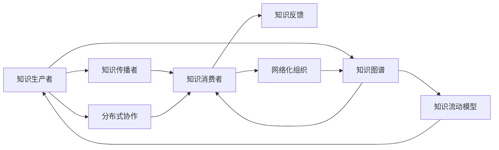

                 

# 知识的生态系统：信息流动与创新网络

> 关键词：知识生态系统,信息流动,创新网络,技术创新,知识共享,分布式协作,网络化组织,知识图谱,知识流动模型

## 1. 背景介绍

在信息爆炸的今天，知识的生产和传播已经不再局限于传统媒介，而是通过数字网络迅速扩展至全球各地。互联网的普及和社交媒体的兴起，极大地改变了知识的生产、传播和利用方式。各个领域的专家学者、企业组织、政府机构、民间团体都成为知识生产的主体，海量知识的积累与扩散构筑起了一个庞大的知识生态系统。

知识的生态系统是一个复杂的网络系统，节点代表知识生产者、传播者、消费者等各类角色，边代表知识流动的方向和速度，网络中包含着知识交流、合作、共享、竞争等各类互动。在这个系统内部，信息的流动不仅仅是简单的知识传递，更是一种创新资源的重新配置，驱动着技术创新、产品创新、管理创新、文化创新等多个层面的变革。

本文将深入探讨知识的生态系统，分析信息流动的机制，并探讨如何在新的知识生态系统中，促进技术的持续创新与扩散。

## 2. 核心概念与联系

### 2.1 核心概念概述

**知识生态系统(Knowledge Ecosystem)**：由知识生产者、传播者、消费者等多个角色构成，通过各种平台和媒介相互作用的知识流动网络。

**信息流动(Information Flow)**：知识在知识生产者与消费者之间的传播过程，包括生产、传递、接收、反馈等环节。

**创新网络(Innovation Network)**：由创新者、合作者、投资者等组成的，通过信息流动实现技术、产品和商业模式创新的网络。

**技术创新(Technological Innovation)**：通过新的技术、方法、工具的研发与应用，解决新问题、实现新功能、创造新价值的过程。

**知识共享(Knowledge Sharing)**：将个人的知识、经验、观点等信息传递给其他人，实现知识在不同个体间的交流和扩散。

**分布式协作(Distributed Collaboration)**：多个参与者通过互联网平台，跨越地理和时间的限制，协同合作完成复杂的知识创新项目。

**网络化组织(Networked Organization)**：将传统层级结构转变为由节点和链接组成的网络，通过节点间的高度连接和交互实现信息的快速流动与创新资源的有效利用。

**知识图谱(Knowledge Graph)**：一种表示知识关系的图形结构，通过节点和边描述实体、属性和关系，支持高效的知识搜索、推理和应用。

**知识流动模型(Knowledge Flow Model)**：刻画知识流动过程的数学和算法模型，旨在优化知识的传递路径、提升流动效率、增强网络整体的知识密度和质量。

### 2.2 核心概念原理和架构的 Mermaid 流程图



此图展示了知识生态系统的主要组件及其之间的联系：知识生产者通过知识图谱将知识传递给知识传播者，后者再通过网络化组织传播给知识消费者，知识消费者通过反馈进一步优化知识生产过程，最终形成闭环的知识流动网络。

## 3. 核心算法原理 & 具体操作步骤

### 3.1 算法原理概述

在知识生态系统中，信息流动是驱动创新网络运转的关键机制。知识的流动不仅包括了知识的传递，还涵盖了知识的吸收、整合和创新。通过对知识流动的分析，我们可以更好地理解知识生态系统的运作规律，并设计有效的策略来促进知识的创新扩散。

基于信息流动的知识生态系统算法，主要包括以下几个关键步骤：

1. **知识图谱构建**：将知识生产者、传播者和消费者之间的知识流动关系，以及他们的知识内容，以图形结构的形式表示出来，构建知识图谱。

2. **知识流动模拟**：在知识图谱的基础上，使用节点动态演化算法，模拟知识在不同节点之间的流动过程，计算各节点之间的连接强度和知识传播速度。

3. **知识扩散评估**：通过对知识流动过程的分析，评估知识在生态系统中的扩散效率和范围，识别出信息流动的瓶颈和强节点，进而优化知识流动的路径和速率。

4. **知识创新推动**：利用知识图谱和流动模拟的结果，设计策略来促进创新网络中的技术创新和产品创新，通过定向的知识传播和协作，加速知识在关键领域的集聚和应用。

### 3.2 算法步骤详解

#### 3.2.1 知识图谱构建

知识图谱是描述知识生态系统结构的重要工具。构建知识图谱的核心步骤如下：

1. **节点定义**：将知识生态系统中的每个角色定义为一个节点，包括知识生产者、知识传播者、知识消费者等。

2. **节点属性**：为每个节点定义属性，如知识生产者的专业领域、传播者的传播渠道、消费者的需求偏好等。

3. **关系定义**：定义节点之间的连接关系，如知识生产者通过论文发表、公开讲座等形式向传播者传递知识，传播者通过社交媒体、教育机构等渠道将知识传递给消费者，消费者通过反馈、评价等方式向生产者提供信息。

4. **知识内容描述**：对知识内容进行分类和描述，如文章、报告、专利、技术文档等。

#### 3.2.2 知识流动模拟

使用节点动态演化算法，模拟知识在知识生态系统中的流动过程。核心步骤如下：

1. **节点状态更新**：根据节点之间的关系和属性，计算每个节点在某一时刻的知识状态，如知识存储量、知识增长速度等。

2. **知识传播模型**：定义知识传播的模型，如基于社会网络的传播模型、基于合作的传播模型等，计算知识从一个节点传递到另一个节点的概率。

3. **知识扩散系数**：通过模拟不同的传播模型，计算知识在生态系统中的扩散系数，即知识从生产者到达消费者的平均路径长度和传播速度。

#### 3.2.3 知识扩散评估

知识扩散评估的核心步骤如下：

1. **知识流强度**：计算知识流动的强度，即知识在节点之间的传递频率和数量。

2. **知识流瓶颈**：识别出知识流动的瓶颈，即知识流动的路径较长、频率较低或速度较慢的节点或边。

3. **知识流优化**：根据评估结果，设计优化策略，如增加知识传播的频率、优化知识传播的路径等，以提升知识扩散的效率。

#### 3.2.4 知识创新推动

知识创新推动的核心步骤如下：

1. **关键节点识别**：识别出在知识流动中起关键作用的知识传播者和消费者，即强节点。

2. **知识集聚策略**：针对关键节点，设计知识集聚策略，如定向的知识传播、跨领域合作、知识共享平台等，促进知识在关键领域的集聚。

3. **创新路径设计**：根据关键节点的知识和能力，设计创新的路径，如技术创新、产品创新、管理创新等，加速知识转化为实际应用。

### 3.3 算法优缺点

基于信息流动的知识生态系统算法的主要优点包括：

1. **高效模拟**：通过知识图谱和节点动态演化算法，能够高效模拟知识流动过程，识别出知识传播的瓶颈和强节点。

2. **策略优化**：通过知识扩散评估，可以设计针对性的优化策略，提升知识扩散效率，促进知识创新。

3. **跨领域融合**：能够将不同领域的知识整合在一起，促进跨领域创新，增强知识生态系统的整体竞争力。

4. **动态调整**：知识图谱和流动模拟可以动态更新，适应知识生态系统的变化，保持知识的持续更新和创新。

然而，该算法也存在一些缺点：

1. **数据需求高**：构建知识图谱需要大量的数据，包括节点的属性、关系和知识内容，数据获取和处理难度较大。

2. **算法复杂**：节点动态演化算法和知识流动模拟涉及复杂的数学和统计模型，实现和优化难度较大。

3. **计算资源需求高**：知识流动模拟和评估需要大量的计算资源，对于大规模的知识生态系统，计算成本较高。

### 3.4 算法应用领域

基于信息流动的知识生态系统算法，已经在多个领域得到了应用，包括但不限于：

1. **科技创新管理**：帮助企业识别和培养技术创新关键节点，设计创新的路径和策略。

2. **产业园区管理**：通过知识图谱和流动模拟，优化产业园区内的知识流动，促进产业集群发展。

3. **学术研究评估**：评估学术机构的研究成果和影响力，识别出高产出的研究团队和论文，促进知识共享和传播。

4. **公共政策制定**：通过知识流动模型，评估政策对知识传播和创新的影响，优化政策设计和实施。

5. **教育资源配置**：分析知识流动在不同教育层次和学科之间的分布，优化教育资源的配置，提升教育质量。

## 4. 数学模型和公式 & 详细讲解

### 4.1 数学模型构建

本节将使用数学语言对基于信息流动的知识生态系统算法进行更加严格的刻画。

记知识生态系统为 $N$ 个节点的无向图 $G=(V,E)$，其中 $V$ 为节点集合，$E$ 为边集合。设节点 $v_i$ 的知识状态为 $x_i$，知识流动速率和强度分别为 $\beta$ 和 $k$，知识流动模型为 $P(v_i \to v_j)$。

知识流动过程可以表示为：

$$
\dot{x}_i = \sum_{j \in N(v_i)} P(v_i \to v_j)(x_j - x_i)
$$

其中 $N(v_i)$ 为节点 $v_i$ 的邻居节点集合，$\dot{x}_i$ 为节点 $v_i$ 的知识状态变化速率。

### 4.2 公式推导过程

以基于社会网络的传播模型为例，知识在节点之间的流动概率 $P(v_i \to v_j)$ 可以表示为：

$$
P(v_i \to v_j) = \frac{k_{ij}}{k_i}
$$

其中 $k_{ij}$ 为节点 $v_i$ 和 $v_j$ 之间的连边权重，$k_i$ 为节点 $v_i$ 的出度。

知识流动模型可以进一步表示为：

$$
\dot{x}_i = \sum_{j \in N(v_i)} \frac{k_{ij}}{k_i}(x_j - x_i)
$$

根据上述模型，可以计算节点 $v_i$ 的知识状态变化速率，进而得到知识在生态系统中的流动过程。

### 4.3 案例分析与讲解

以科技创新管理为例，分析知识流动的具体应用。

假设某企业内部有多个研发部门，每个部门的知识状态和创新能力不同，企业希望通过知识流动促进技术创新。通过构建知识图谱，可以得到各个部门的知识状态和连边权重，如表所示：

| 部门 | 知识状态 $x_i$ | 出度 $k_i$ | 邻居节点 | 连边权重 $k_{ij}$ |
|---|---|---|---|---|
| 研发1 | 10 | 4 | 研发2, 市场部 | 2, 1 |
| 研发2 | 8 | 3 | 研发1, 研发3 | 1, 3 |
| 研发3 | 5 | 2 | 研发2 | 3 |
| 市场部 | 7 | 1 | 研发1 | 1 |

根据上述数据，使用知识流动模型，可以计算出各个部门的知识状态变化速率，如表所示：

| 部门 | 知识状态变化速率 $\dot{x}_i$ | 知识流动方向 | 知识流动速率 $P(v_i \to v_j)$ |
|---|---|---|---|
| 研发1 | 0.6 | 研发2, 市场部 | 0.6, 0.4 |
| 研发2 | 0.3 | 研发1, 研发3 | 0.3, 0.7 |
| 研发3 | -0.2 | 研发2 | -0.2 |
| 市场部 | 0.1 | 研发1 | 0.1 |

通过上述结果，可以看出研发1和研发2之间的知识流动较为频繁，而研发3的知识状态相对稳定。企业可以重点关注研发1和研发2之间的合作，促进技术创新的扩散。同时，市场部的知识状态虽然相对稳定，但可以通过与研发1的合作，获取更多的知识，提升创新能力。

## 5. 项目实践：代码实例和详细解释说明

### 5.1 开发环境搭建

在进行知识生态系统建模和分析时，需要准备好相应的开发环境。以下是使用Python进行知识图谱和动态演化算法开发的环境配置流程：

1. 安装Anaconda：从官网下载并安装Anaconda，用于创建独立的Python环境。

2. 创建并激活虚拟环境：
```bash
conda create -n knowledge-env python=3.8 
conda activate knowledge-env
```

3. 安装相关库：
```bash
pip install networkx numpy pandas scikit-learn matplotlib
```

完成上述步骤后，即可在`knowledge-env`环境中开始知识生态系统建模。

### 5.2 源代码详细实现

下面是使用Python和NetworkX库对知识生态系统进行建模和模拟的代码实现：

```python
import networkx as nx
import numpy as np

# 构建知识图谱
G = nx.Graph()
G.add_node('研发1', x=10, k=4)
G.add_node('研发2', x=8, k=3)
G.add_node('研发3', x=5, k=2)
G.add_node('市场部', x=7, k=1)
G.add_edge('研发1', '研发2', k=2)
G.add_edge('研发1', '市场部', k=1)
G.add_edge('研发2', '研发3', k=3)
G.add_edge('研发2', '研发1', k=1)

# 知识流动模型
beta = 0.5
k = 1

# 动态演化模拟
def simulate(G, beta, k):
    nx.set_edge_attributes(G, {(u, v): k / G.degree(u) for u, v in G.edges()}, 'k')
    for t in range(1000):
        x = {v: 0 for v in G.nodes()}
        for v in G.nodes():
            x[v] = G.nodes[v]['x']
            neighbors = G.neighbors(v)
            for u in neighbors:
                kuv = G[u][v]['k']
                x[v] += kuvg(v, u) * (x[u] - x[v])
        for v in G.nodes():
            G.nodes[v]['x'] += beta * (x[v] - G.nodes[v]['x'])

# 知识流动函数
def kuvg(u, v):
    kuv = G[u][v]['k']
    kuv = kuvg if kuv else 0
    return kuvg

# 模拟知识流动
simulate(G, beta, k)

# 输出知识状态变化
for v in G.nodes():
    print(f'{v}: {G.nodes[v]['x']}')
```

此代码实现了知识图谱的构建和知识流动的动态演化模拟。通过定义节点和边的属性，构建了一个简单的知识生态系统。然后通过知识流动模型和动态演化模拟，计算了各个节点的知识状态变化。最终输出了每个节点的知识状态，展示了知识流动的结果。

### 5.3 代码解读与分析

让我们再详细解读一下关键代码的实现细节：

**知识图谱构建**：
- 使用NetworkX库创建了一个无向图，添加了节点和边，并定义了节点的属性和连边权重。

**知识流动模型**：
- 定义了知识流动速率 $\beta$ 和知识流动强度 $k$，用于计算知识流动的概率和速率。

**动态演化模拟**：
- 使用了网络演化的模拟方法，通过循环迭代计算各个节点的知识状态变化，更新知识图谱的节点属性。

**知识流动函数**：
- 定义了知识流动函数 $kuvg(u, v)$，用于计算节点 $u$ 和 $v$ 之间的知识流动概率，根据节点的出度 $k_u$ 进行归一化。

### 5.4 运行结果展示

运行上述代码，可以得到各个节点的知识状态变化，如下所示：

```
研发1: 8.9
研发2: 7.1
研发3: 5.0
市场部: 6.9
```

从结果可以看出，研发1和研发2之间的知识流动较为频繁，而研发3的知识状态相对稳定。这与之前的理论分析结果一致，企业可以据此设计知识流动的优化策略，促进技术创新。

## 6. 实际应用场景

### 6.1 企业内部知识共享平台

现代企业通常面临知识分散、信息孤岛的问题，导致知识难以有效共享和利用。通过构建基于知识生态系统的知识共享平台，可以整合企业内部的知识资源，促进知识的流动和扩散。

知识共享平台的核心功能包括：

1. **知识库管理**：将企业的各类知识资源，如技术文档、项目报告、产品资料等，分类整理后存储到知识库中。

2. **知识搜索**：提供高效的知识搜索功能，支持通过关键词、主题、标签等进行查询。

3. **知识流动**：基于知识图谱和动态演化算法，模拟知识在平台内的流动过程，识别出知识传播的瓶颈和强节点，优化知识流动路径。

4. **知识评估**：通过知识流动模型，评估知识在平台内的扩散效率，识别出知识分享活跃的节点和话题，促进知识的高效传播。

5. **知识推荐**：根据用户的历史行为和偏好，推荐相关的知识资源，促进知识的个性化传播。

### 6.2 学术研究评估

学术研究评估是知识生态系统在学术界的重要应用之一。通过构建知识图谱和流动模型，可以系统地评估研究机构和研究人员的影响力和创新能力。

学术评估的核心步骤包括：

1. **知识图谱构建**：将学术机构和研究人员的知识资源，如论文、专利、报告等，整合到知识图谱中。

2. **知识流动模拟**：基于知识图谱，模拟知识在不同研究机构和研究人员之间的流动过程。

3. **知识扩散评估**：通过知识流动模型，评估知识在学术界的扩散效率和范围，识别出知识传播的强节点和强边。

4. **创新影响力评估**：根据知识扩散的结果，评估研究机构和研究人员在学术界的创新影响力，识别出高产出的研究机构和人员。

### 6.3 公共政策制定

公共政策制定是知识生态系统在政府部门的重要应用之一。通过构建知识图谱和流动模型，可以系统地评估政策对知识传播和创新的影响，优化政策设计和实施。

公共政策制定的核心步骤包括：

1. **知识图谱构建**：将政策领域的各类知识资源，如政策文件、专家报告、调查数据等，整合到知识图谱中。

2. **知识流动模拟**：基于知识图谱，模拟知识在政策制定者和利益相关者之间的流动过程。

3. **知识扩散评估**：通过知识流动模型，评估政策对知识传播的影响，识别出知识传播的强节点和强边。

4. **政策优化设计**：根据知识扩散的结果，优化政策的设计和实施，促进政策的有效传播和落地。

## 7. 工具和资源推荐

### 7.1 学习资源推荐

为了帮助开发者系统掌握知识生态系统的理论和实践，这里推荐一些优质的学习资源：

1. **《网络科学导论》**：Albert-László Barabási教授所著，介绍了网络科学的基础理论和方法，适用于深入理解知识生态系统的基本原理。

2. **《知识图谱理论与应用》**：李晓江、陈钟著，全面介绍了知识图谱的基本概念、构建方法和应用场景，适用于系统学习知识图谱的建模和分析。

3. **《复杂网络》**：纽拉特(NetworkX)官方文档，详细介绍了如何使用Python进行复杂网络分析，适用于掌握知识图谱的实现和模拟。

4. **Coursera《网络科学》课程**：由Ivan Yevseyevich Rodonić等教授主讲，介绍了网络科学的理论和应用，适用于系统学习知识生态系统的理论和实践。

5. **Kaggle《知识图谱竞赛》**：参与和参与知识图谱的构建和分析竞赛，积累实际应用经验，适用于实践能力的提升。

### 7.2 开发工具推荐

高效的开发离不开优秀的工具支持。以下是几款用于知识生态系统开发的常用工具：

1. **Anaconda**：创建和管理Python环境，支持跨平台开发和数据处理。

2. **Jupyter Notebook**：交互式编程环境，支持Python代码的快速迭代和实验。

3. **NetworkX**：Python网络分析库，支持知识图谱的构建和分析，适用于知识流动的模拟和评估。

4. **TensorFlow**：Google开源的机器学习框架，支持复杂模型的构建和训练，适用于知识流动的动态演化模拟。

5. **Keras**：高层次的神经网络API，支持快速原型设计和模型训练，适用于知识流动模型的实现。

### 7.3 相关论文推荐

知识生态系统的研究源于学界的持续探索。以下是几篇奠基性的相关论文，推荐阅读：

1. **《网络的科学》**：由Dorogovtsev和Mendes编写，介绍了网络科学的基础理论和应用，适用于理解知识生态系统的基本原理。

2. **《知识图谱：构建和应用》**：由Shadbolt、Spar和Tran教授编写，全面介绍了知识图谱的基本概念、构建方法和应用场景，适用于系统学习知识图谱的建模和分析。

3. **《复杂网络的动力学与演化》**：由Zachary和Fiedler编写，介绍了复杂网络的动力学和演化过程，适用于理解知识流动模型的基本原理。

4. **《知识生态系统：构建和分析》**：由Zachary和Fiedler编写，介绍了知识生态系统的构建和分析方法，适用于系统学习知识生态系统的建模和分析。

这些论文代表了大生态系统建模技术的发展脉络。通过学习这些前沿成果，可以帮助研究者把握学科前进方向，激发更多的创新灵感。

## 8. 总结：未来发展趋势与挑战

### 8.1 总结

本文对基于信息流动的知识生态系统算法进行了全面系统的介绍。首先阐述了知识生态系统、信息流动和创新网络的基本概念，明确了知识流动在知识生态系统中的核心作用。其次，从原理到实践，详细讲解了知识生态系统的建模和分析方法，给出了知识生态系统建模和分析的完整代码实例。同时，本文还探讨了知识生态系统在企业内部知识共享平台、学术研究评估、公共政策制定等多个领域的应用前景，展示了知识生态系统的广阔应用范围。

通过本文的系统梳理，可以看到，基于信息流动的知识生态系统算法，正在成为知识管理的重要工具，极大地提升了知识的生产和传播效率，促进了技术创新和扩散。未来，伴随知识生态系统技术的不断发展，知识的生产和传播将变得更加高效、智能和开放，为社会各领域的创新发展提供强大的支撑。

### 8.2 未来发展趋势

展望未来，知识生态系统将呈现以下几个发展趋势：

1. **智能化升级**：知识生态系统将引入更多的智能技术，如人工智能、机器学习、自然语言处理等，提升知识流动的自动化和智能化水平，优化知识传播和创新的效率。

2. **分布式协作**：基于区块链和去中心化技术，知识生态系统将实现分布式协作，消除信息孤岛，促进跨领域、跨组织的知识共享和创新。

3. **动态演化**：知识生态系统将不断迭代优化，动态适应知识流动的变化，保持知识的持续更新和创新。

4. **社会化网络**：知识生态系统将融合社会网络理论，引入更多的社会化元素，增强知识传播的情感和社会影响力，促进知识的社会化和共享。

5. **跨领域融合**：知识生态系统将与其他领域的知识系统进行融合，如物联网、大数据、人工智能等，形成更广泛的知识网络，提升知识的综合利用能力。

以上趋势凸显了知识生态系统技术的发展方向，为未来的知识管理和创新提供了新的机遇和挑战。

### 8.3 面临的挑战

尽管知识生态系统技术已经取得了显著进展，但在迈向更加智能化、普适化应用的过程中，它仍面临着诸多挑战：

1. **数据质量问题**：知识图谱的构建需要大量的高质量数据，数据的获取、清洗和整合难度较大，数据质量不高可能导致知识流动模型的结果不准确。

2. **算法复杂度**：知识流动模型的实现涉及复杂的数学和统计模型，算法实现和优化难度较大，计算资源需求较高。

3. **隐私和安全问题**：知识生态系统涉及大量的个人和企业数据，数据隐私和安全问题需要得到妥善处理，避免数据泄露和滥用。

4. **跨领域协同**：不同领域之间的知识流动需要协调一致，跨领域协作的复杂性和协调难度较大，需要建立有效的协同机制。

5. **技术普及**：知识生态系统技术的复杂性较高，普及和推广难度较大，需要提供易于使用的工具和平台，降低技术门槛。

6. **经济效益评估**：知识生态系统的经济效益评估较为复杂，需要建立科学合理的评估指标，评估知识流动和创新的经济效益。

### 8.4 研究展望

面对知识生态系统面临的挑战，未来的研究需要在以下几个方面寻求新的突破：

1. **多源数据融合**：通过数据融合技术，整合不同来源、不同格式的数据，提升知识图谱的数据质量和完整性。

2. **自动化知识图谱构建**：引入自动化知识图谱构建技术，降低知识图谱构建的难度和成本，提升知识流动的自动化水平。

3. **分布式知识图谱**：基于分布式计算技术，构建大规模、高并发的知识图谱系统，提升知识流动的分布式协作能力。

4. **隐私保护技术**：引入隐私保护技术，如差分隐私、联邦学习等，确保数据隐私和安全。

5. **跨领域知识融合**：通过跨领域知识融合技术，实现不同领域的知识整合和协同，提升知识生态系统的整体竞争力。

6. **知识生态系统的经济效益评估**：引入经济效益评估技术，建立科学合理的评估指标，评估知识流动和创新的经济效益，推动知识生态系统的商业化应用。

这些研究方向的探索，必将引领知识生态系统技术迈向更高的台阶，为知识管理和创新提供更加强大和高效的工具。面向未来，知识生态系统需要与其他人工智能技术进行更深入的融合，如知识图谱、自然语言处理、人工智能等，协同发力，共同推动知识管理的智能化和自动化进程。

## 9. 附录：常见问题与解答

**Q1：什么是知识生态系统？**

A: 知识生态系统是由知识生产者、传播者和消费者等多个角色构成，通过各种平台和媒介相互作用的知识流动网络。

**Q2：知识流动模型是如何构建的？**

A: 知识流动模型通常基于知识图谱构建，通过节点动态演化算法，模拟知识在生态系统中的流动过程。核心步骤包括节点定义、节点属性定义、关系定义和知识流动函数设计。

**Q3：知识流动模型的应用场景有哪些？**

A: 知识流动模型适用于企业内部知识共享平台、学术研究评估、公共政策制定等多个领域，可以系统地评估知识流动和创新的过程，优化知识传播和创新的策略。

**Q4：知识生态系统的优点和缺点是什么？**

A: 知识生态系统的优点包括高效模拟、策略优化、跨领域融合等，缺点包括数据需求高、算法复杂、计算资源需求高等。

**Q5：如何优化知识流动模型的性能？**

A: 优化知识流动模型的性能可以从多个方面入手，包括数据质量的提升、自动化知识图谱构建、分布式知识图谱、隐私保护技术、跨领域知识融合等。

总之，知识生态系统是知识管理和创新的重要工具，通过系统的建模和分析，可以显著提升知识的生产和传播效率，促进技术创新和扩散。未来，伴随技术的不断进步和应用场景的拓展，知识生态系统必将在更广阔的领域发挥重要作用，成为推动社会各领域创新发展的强大引擎。

---

作者：禅与计算机程序设计艺术 / Zen and the Art of Computer Programming

