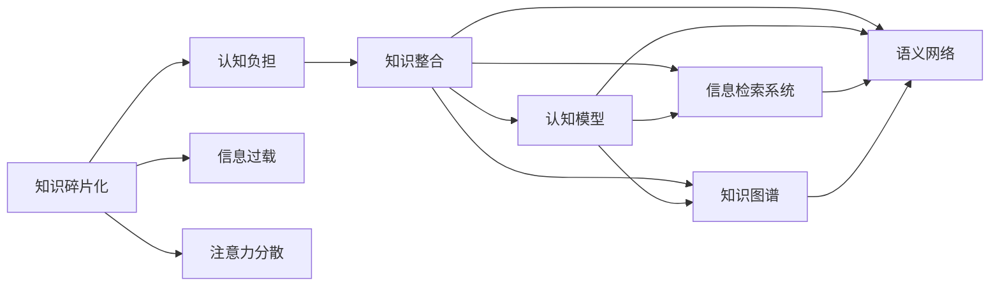

                 

# 知识的碎片化与整合：信息时代的认知难题

## 1. 背景介绍

在信息爆炸的今天，知识的获取与传播变得前所未有的便捷。海量的文本、视频、音频等数据以指数级增长，充斥着我们的信息网络。然而，知识的碎片化现象同样愈发严重。伴随海量知识的涌现，如何有效整合这些碎片化的知识，形成系统化的认知框架，成为信息时代的认知难题。本文将围绕知识碎片化的现象、成因、影响及其整合策略进行探讨，旨在为构建智能知识管理系统提供启示。

## 2. 核心概念与联系

### 2.1 核心概念概述

为更好地理解知识碎片化与整合，需先了解以下关键概念：

- **知识碎片化**：由于知识的庞杂与分散，缺乏系统化整合，使得个体难以全面掌握某一领域的知识。常见表现如信息过载、认知负担、注意力分散等。

- **知识整合**：指将碎片化的知识以系统化、结构化的方式进行组织、串联和综合，形成系统化的认知框架，提升个体对知识的理解和应用能力。

- **认知模型**：指用于描述人类认知过程的模型，如知觉、记忆、思维等，通过形式化描述与计算，探索认知机制与知识表征。

- **信息检索系统**：利用计算机技术与数据库管理，实现快速准确地检索相关信息，支持知识的快速获取与整合。

- **知识图谱**：通过语义关系建模，将知识结构化并存储为图，支持知识推理、发现与自动化查询。

- **语义网络**：以节点表示概念，以边表示语义关系，构建的知识表示形式，用于知识推理和知识整合。

这些概念之间的逻辑关系可以通过以下Mermaid流程图来展示：



这个流程图展示了知识碎片化的现象及其对认知过程的影响，以及知识整合的途径与方法。

## 3. 核心算法原理 & 具体操作步骤

### 3.1 算法原理概述

知识碎片化的整合，本质上是将分散的信息点以逻辑关系进行串联，构建知识图谱。其核心算法包括信息检索算法、知识融合算法和语义关系抽取算法，以实现知识点的关联和重构。

- **信息检索算法**：用于从大量文本中高效检索出相关信息，如布尔查询、向量空间模型、TF-IDF算法等。
- **知识融合算法**：将检索出的信息点进行语义融合，消除冗余，形成结构化知识，如本体映射、知识融合算法等。
- **语义关系抽取算法**：从知识图谱中抽取出概念间的关系，形成完整的语义网络，如基于图模型的关系抽取算法等。

### 3.2 算法步骤详解

1. **信息检索**：
   - 预处理：文本清洗、分词、词性标注、实体识别等。
   - 构建索引：建立倒排索引、文档向量等。
   - 检索：根据用户查询或知识图谱中的概念，检索相关信息。

2. **知识融合**：
   - 实体识别：识别出知识中的实体，如人名、地名、组织名等。
   - 关系抽取：提取实体间的关系，如父子关系、同级关系等。
   - 知识合并：消除重复和冗余信息，形成一致的知识体系。

3. **语义关系抽取**：
   - 构建语义网络：使用图模型将知识点进行结构化存储。
   - 关系抽取：使用基于规则、统计或机器学习的方法，提取概念间的关系。
   - 优化网络：通过调整关系权重、消除噪声等，优化语义网络。

### 3.3 算法优缺点

**知识碎片化整合的优势**：
- **效率提升**：快速检索相关知识，缩短学习和决策时间。
- **知识复用**：知识整合后，易于重复利用，避免重复劳动。
- **系统化理解**：通过结构化知识，提升对复杂问题的系统化理解。

**知识碎片化整合的局限**：
- **数据质量问题**：如果检索到的数据质量不高，整合后的知识体系可能不准确。
- **复杂度增加**：知识点的关联和重构可能导致复杂性增加，难以维护。
- **知识图谱构建困难**：需要大量的领域知识和专家参与，难度大、成本高。

### 3.4 算法应用领域

知识碎片化与整合技术在多个领域都有广泛的应用：

- **学术研究**：用于文献检索、知识管理、数据挖掘等，支持研究者高效获取相关文献和数据。
- **企业知识管理**：构建企业知识库，支持员工知识共享与协作。
- **医疗信息管理**：整合医疗知识，支持医疗决策和临床实践。
- **教育培训**：构建学习资源库，提升教学效果和学生学习效率。
- **电子商务**：支持商品推荐、客户画像构建，提升用户体验和转化率。

## 4. 数学模型和公式 & 详细讲解

### 4.1 数学模型构建

知识碎片化整合的主要数学模型包括：

- **向量空间模型**：以文档-词汇矩阵形式表示知识库，支持基于相似度的检索。
- **本体映射算法**：用于将不同知识源中的信息点进行映射，构建一致的知识体系。
- **图模型**：以图结构表示知识关系，支持语义推理和关系抽取。

### 4.2 公式推导过程

以向量空间模型为例，公式推导如下：

假设知识库中有$m$个文档和$n$个词汇，建立文档-词汇矩阵$D$，其中$D_{i,j}$表示第$i$个文档包含第$j$个词汇的出现次数。向量空间模型定义文档向量$v_i$和词汇向量$w_j$，则：

$$ v_i = \sum_{j=1}^n D_{i,j}w_j $$

其中，$w_j$为词汇向量，可以通过TF-IDF算法计算得到。

### 4.3 案例分析与讲解

**案例一：学术文献检索**
- **问题**：如何从海量的文献库中高效检索出相关文献？
- **方法**：使用向量空间模型，将每篇文献表示为高维向量，计算向量相似度。
- **结果**：检索出与用户兴趣最相似的文献。

**案例二：医疗知识整合**
- **问题**：如何将分散的医学知识整合为一致的知识体系？
- **方法**：使用本体映射算法，将不同来源的医学知识进行映射，消除冗余和冲突。
- **结果**：构建统一的知识图谱，支持医疗决策和知识共享。

## 5. 项目实践：代码实例和详细解释说明

### 5.1 开发环境搭建

进行知识碎片化整合的实践，需要搭建一个支持信息检索、知识融合和语义关系抽取的环境。以下是一个基于Python的简单配置：

1. 安装Python环境
```bash
conda create -n knowledge_extraction python=3.7
conda activate knowledge_extraction
```

2. 安装相关库
```bash
pip install numpy pandas scikit-learn spacy transformers py2neo
```

3. 构建信息检索系统
```python
from sklearn.feature_extraction.text import TfidfVectorizer
from sklearn.metrics.pairwise import cosine_similarity

# 构建文档-词汇矩阵
D = TfidfVectorizer().fit_transform(corpus)
vectors = D.toarray()

# 计算相似度
similarity_matrix = cosine_similarity(vectors)
```

### 5.2 源代码详细实现

**信息检索**：

```python
from sklearn.feature_extraction.text import TfidfVectorizer
from sklearn.metrics.pairwise import cosine_similarity

# 构建文档-词汇矩阵
D = TfidfVectorizer().fit_transform(corpus)
vectors = D.toarray()

# 计算相似度
similarity_matrix = cosine_similarity(vectors)
```

**知识融合**：

```python
from spacy import displacy
from spacy.matcher import Matcher

# 实体识别
doc = nlp(text)
entities = [ent.text for ent in doc.ents]

# 关系抽取
matcher = Matcher(nlp.vocab)
matcher.add("REL", None, lambda ent1, ent2: ent1.text == ent2.text)
matches = matcher(doc)
for match_id, start, end in matches:
    span = doc[start:end]
    if span.text == "医生":
        doc.add_label(span.text)
```

**语义关系抽取**：

```python
from py2neo import Graph

graph = Graph("http://localhost:7474", username="neo4j", password="password")

# 抽取关系
relationships = graph.run(
    "MATCH (a:Patient)-[r]->(b:Doctor) RETURN a, b, r"
)
for relationship in relationships:
    print(relationship)
```

### 5.3 代码解读与分析

**信息检索**：
- 使用TF-IDF算法对文档进行向量化表示，通过计算向量之间的相似度实现检索。

**知识融合**：
- 利用Spacy库进行实体识别和关系抽取，消除冗余和冲突，形成一致的知识体系。

**语义关系抽取**：
- 使用Py2neo与Neo4j图数据库进行语义网络构建和关系抽取，生成完整的知识图谱。

### 5.4 运行结果展示

**信息检索**：
- 检索出与用户查询最相关的文献，支持学术研究。

**知识融合**：
- 将分散的医学知识进行整合，构建统一的知识图谱，支持医疗决策。

**语义关系抽取**：
- 抽取并可视化医疗领域中的关系网络，支持知识发现和应用。

## 6. 实际应用场景

### 6.1 学术研究

学术研究中，通过知识碎片化与整合，可以高效获取相关文献和数据。例如，使用向量空间模型对文献进行检索，快速定位到与研究主题相关的文献。

### 6.2 企业知识管理

企业知识管理中，将分散的知识进行整合，形成统一的知识库，支持员工知识共享和协作。例如，使用本体映射算法将不同部门的知识进行统一，消除冗余和冲突。

### 6.3 医疗信息管理

医疗信息管理中，将分散的医学知识进行整合，构建统一的知识图谱，支持医疗决策和临床实践。例如，使用知识融合算法将不同来源的医学知识进行统一，消除冗余和冲突。

### 6.4 未来应用展望

未来，知识碎片化与整合技术将进一步发展，广泛应用于更多领域：

- **智能客服**：构建智能客服知识库，提升客服响应速度和准确性。
- **个性化推荐**：整合用户行为数据和商品信息，提供个性化的商品推荐。
- **智能家居**：构建智能家居知识库，提升家居控制和用户体验。

## 7. 工具和资源推荐

### 7.1 学习资源推荐

1. **《信息检索原理与技术》**：介绍信息检索的基本原理和技术，包括向量空间模型、TF-IDF算法等。
2. **《知识工程基础》**：讲解知识工程的基本概念和实践方法，包括本体构建、语义网络等。
3. **《Python知识图谱构建与分析》**：详细讲解如何使用Python构建和分析知识图谱。
4. **《深度学习与知识图谱》**：介绍深度学习在知识图谱中的应用，包括实体识别、关系抽取等。

### 7.2 开发工具推荐

1. **Anaconda**：支持Python虚拟环境搭建，方便工具库安装和版本管理。
2. **Spacy**：支持自然语言处理，包括实体识别、关系抽取等。
3. **Scikit-learn**：支持机器学习和数据挖掘，包括向量空间模型、TF-IDF算法等。
4. **Py2neo**：支持Python与Neo4j图数据库交互，支持语义网络构建和关系抽取。

### 7.3 相关论文推荐

1. **《信息检索：理论与技术》**：介绍信息检索的基本原理和技术。
2. **《知识工程：理论与实践》**：讲解知识工程的基本概念和实践方法。
3. **《深度学习在知识图谱中的应用》**：介绍深度学习在知识图谱中的应用。

## 8. 总结：未来发展趋势与挑战

### 8.1 研究成果总结

知识碎片化与整合技术在信息时代具有重要意义，其研究成果包括：

- **信息检索算法**：用于高效检索相关信息，提升知识获取效率。
- **知识融合算法**：用于消除冗余，形成一致的知识体系。
- **语义关系抽取算法**：用于构建语义网络，支持知识推理和发现。

### 8.2 未来发展趋势

未来，知识碎片化与整合技术将呈现以下发展趋势：

- **自动化程度提升**：利用机器学习和深度学习，自动化程度将不断提高。
- **跨领域知识融合**：跨领域的知识整合将成为热点，支持多领域知识的综合应用。
- **知识图谱的普及**：知识图谱的构建和应用将更加广泛，支持复杂知识的系统化表达。
- **实时化知识更新**：知识图谱和知识库的实时更新机制将得到完善，支持动态知识管理。

### 8.3 面临的挑战

知识碎片化与整合技术仍面临诸多挑战：

- **数据质量问题**：需要大量高质量数据，数据质量直接影响整合效果。
- **复杂度增加**：知识点的关联和重构可能导致复杂性增加，难以维护。
- **跨领域知识融合难度**：不同领域的知识表示和理解差异大，难以综合应用。
- **知识图谱构建困难**：需要大量领域知识和专家参与，难度大、成本高。

### 8.4 研究展望

未来，知识碎片化与整合技术需进一步研究：

- **自动化方法**：利用机器学习和深度学习，自动化程度将不断提高。
- **跨领域知识融合**：研究跨领域的知识整合方法，支持多领域知识的综合应用。
- **实时化知识更新**：研究知识图谱和知识库的实时更新机制，支持动态知识管理。
- **知识图谱的普及**：知识图谱的构建和应用将更加广泛，支持复杂知识的系统化表达。

## 9. 附录：常见问题与解答

**Q1: 如何提高信息检索的准确率？**

A: 提高信息检索的准确率，可以从以下方面入手：
- **优化检索模型**：选择适合的检索模型，如向量空间模型、TF-IDF算法等。
- **数据预处理**：对文本进行清洗、分词、实体识别等预处理，提升检索质量。
- **查询优化**：优化查询方式，使用布尔查询、关键词检索等方式，提升检索效果。

**Q2: 知识融合过程中，如何消除冗余和冲突？**

A: 知识融合过程中，消除冗余和冲突的方法包括：
- **实体对齐**：通过实体对齐算法，将不同来源的实体进行映射，消除冗余。
- **关系对齐**：通过关系对齐算法，将不同来源的关系进行合并，消除冲突。
- **一致性检查**：对融合后的知识进行一致性检查，确保数据的一致性和完整性。

**Q3: 如何构建高效的知识图谱？**

A: 构建高效的知识图谱，可以从以下方面入手：
- **选择合适的工具**：使用如Neo4j、ArangoDB等高效图数据库，支持语义网络构建和关系抽取。
- **优化知识表示**：选择适合的知识表示形式，如RDF、OWL等，支持知识推理和发现。
- **自动化工具**：利用自动化工具，如Protege、Graphtools等，提升知识图谱构建效率。

**Q4: 如何处理跨领域知识融合的难点？**

A: 处理跨领域知识融合的难点，可以从以下方面入手：
- **领域本体对齐**：使用领域本体对齐算法，将不同领域的本体进行映射，消除差异。
- **知识桥接**：通过知识桥接技术，将不同领域的知识进行桥接，形成一致的知识体系。
- **专家参与**：邀请领域专家参与知识融合过程，确保知识融合的准确性和适用性。

---

作者：禅与计算机程序设计艺术 / Zen and the Art of Computer Programming

