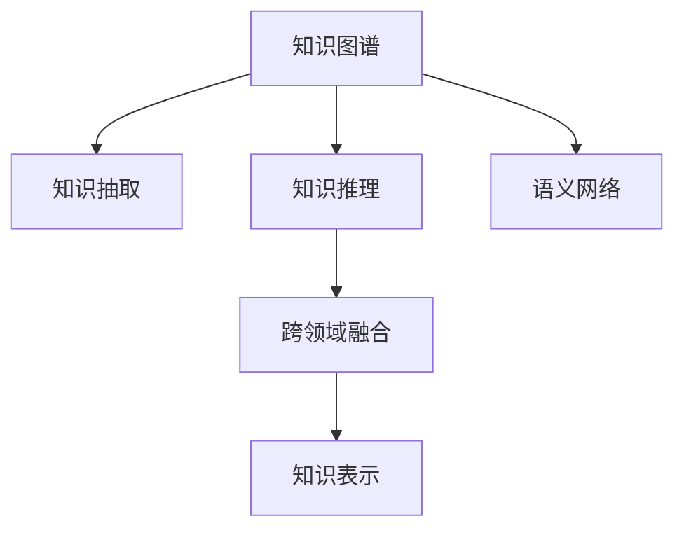

                 

# 知识的碎片化与系统化：信息整合的艺术

## 1. 背景介绍

### 1.1 问题由来

在当今信息爆炸的时代，知识的碎片化已成为一个不容忽视的问题。社交媒体、新闻平台、学术论文等海量信息源不断生成，人们获取知识的方式和途径越来越多样化，但也使得信息难以全面系统地整合。知识的碎片化不仅影响了个人学习效率，也限制了人工智能模型对大规模复杂数据的学习能力。

此外，传统的集中式数据库和知识管理方式，往往难以适应快速变化的知识需求和新兴数据形态。因此，探索知识碎片化与系统化的整合方法，成为信息时代亟需解决的关键问题。

### 1.2 问题核心关键点

为了有效解决知识碎片化问题，我们需要重新思考知识表示、信息抽取、推理逻辑、跨领域应用等核心问题。构建一个能够高效整合碎片化知识，形成系统化知识图谱的机制，是当前研究的重点。

主要核心关键点包括：

1. 知识表示与抽取：如何从海量信息源中抽取关键知识，并转化为结构化的语义表示，形成知识图谱。
2. 知识推理与融合：如何利用逻辑推理、迁移学习、联合训练等方法，将知识图谱中的孤立碎片进行融合，生成更丰富的语义信息。
3. 跨领域应用：如何针对不同领域、不同模态的数据，进行知识融合和推理，以实现知识的泛化应用。

### 1.3 问题研究意义

探索知识碎片化与系统化整合的方法，对于构建人类与机器协作的新型智能系统，具有重要意义：

1. 提升学习效率。知识图谱使得知识更加系统化、结构化，有助于提升学习效率，形成更为系统的知识体系。
2. 促进知识共享。知识图谱可以跨越时间和空间的限制，方便不同领域、不同个体共享知识，促进知识交流。
3. 强化智能推理。知识图谱中丰富的语义关系，可以帮助机器更好地理解和推理，解决复杂问题。
4. 加速知识创新。跨领域知识的整合，可以启发新的思维和应用场景，促进知识创新和科技发展。

## 2. 核心概念与联系

### 2.1 核心概念概述

为了深入理解知识整合的艺术，我们先介绍一些关键概念：

1. **知识图谱(Knowledge Graph)**：一种结构化的语义表示方式，通过节点和边的形式，描述实体、属性和关系。可以用于知识抽取、推理、检索等任务。
2. **知识推理(Knowledge Reasoning)**：利用逻辑推理机制，根据知识图谱中的信息，推导出新的知识和结论。是知识整合的重要手段之一。
3. **跨领域知识融合(Cross-domain Knowledge Fusion)**：将不同领域、不同模态的知识进行整合，形成更为综合的知识体系。如将文本、图像、语音等多模态数据融合为知识图谱。
4. **知识表示(Knowledge Representation)**：将知识转化为机器可理解和处理的结构化形式，便于信息抽取和推理。
5. **语义网络(Semantic Network)**：一种基于节点和边的知识表示方式，每个节点代表一个概念，边代表概念之间的关系。

这些核心概念通过特定的逻辑关系，形成了知识整合的整体框架，使得信息能够从碎片化状态，逐步向系统化方向演进。

### 2.2 核心概念原理和架构的 Mermaid 流程图



这个流程图展示了大规模知识整合的基本流程：

1. 从信息源中抽取关键知识，构建初步的知识图谱。
2. 利用推理机制，将孤立的知识碎片进行连接，形成完整的知识链。
3. 将不同领域、不同模态的知识进行融合，构建统一的跨领域知识图谱。
4. 通过语义网络等知识表示方式，将知识转化为机器可理解的结构化形式。

以下我们通过深入分析这些核心概念的原理和架构，进一步阐述知识整合的技术细节。

## 3. 核心算法原理 & 具体操作步骤

### 3.1 算法原理概述

知识整合的核心在于从海量信息源中抽取知识，并进行语义关联、推理融合等操作。其主要原理包括：

1. **知识抽取**：利用自然语言处理(NLP)技术，从文本、网页、论文等数据中提取结构化信息。
2. **知识融合**：通过知识推理和迁移学习，将孤立的知识片段连接起来，形成更丰富的语义关系。
3. **知识表示**：将知识转化为节点和边形式的知识图谱，便于信息抽取和推理。

### 3.2 算法步骤详解

以下是知识整合的主要操作步骤，包括知识抽取、知识融合、知识表示和推理融合等关键步骤：

#### 3.2.1 知识抽取

知识抽取的目标是从非结构化文本中，提取出结构化的事实和实体关系。主要步骤如下：

1. **分词与实体识别**：将文本进行分词，利用实体识别算法识别出文本中的实体，如人名、地名、机构名等。
2. **关系抽取**：利用关系抽取算法，从文本中提取出实体之间的关系，如“出生于”、“工作于”等。
3. **知识表示**：将抽取的实体和关系，转化为语义网络中的节点和边，构建知识图谱。

具体实现中，可以采用深度学习模型如BERT、ELMo等进行分词和实体识别，再结合规则或神经网络进行关系抽取和知识表示。

#### 3.2.2 知识融合

知识融合的目标是将不同数据源、不同领域、不同时间节点的知识进行整合，构建统一的跨领域知识图谱。主要步骤如下：

1. **多源知识融合**：将来自不同信息源的知识进行融合，消除冗余信息，形成一致的知识表示。
2. **跨领域知识融合**：将不同领域的数据进行融合，生成更为丰富的语义信息。如将文本、图像、语音等数据融合为知识图谱。
3. **时间演化知识融合**：将时间演化后的知识进行融合，反映知识随时间的变化趋势。

在实现上，可以采用基于图神经网络(Graph Neural Network, GNN)的方法，如GAT、GCN等，对知识图谱进行融合操作。

#### 3.2.3 知识表示

知识表示的目标是将知识转化为结构化的语义形式，便于信息抽取和推理。主要步骤如下：

1. **节点表示**：对知识图谱中的每个实体和关系进行向量表示，如使用TransE、DistMult等算法。
2. **边表示**：对知识图谱中的边进行向量表示，利用边类型的差异化表示，提升推理精度。
3. **图表示**：将知识图谱转化为有向图或无向图，利用图神经网络进行推理操作。

具体实现中，可以采用TensorFlow、PyTorch等深度学习框架，结合图神经网络算法进行知识表示。

#### 3.2.4 知识推理

知识推理的目标是根据已有知识图谱，推导出新的知识和结论。主要步骤如下：

1. **推理模型**：构建推理模型，如基于规则的推理、基于深度学习的推理等，对知识图谱进行推理操作。
2. **验证与修正**：对推理结果进行验证，检测推理的准确性和合理性，必要时进行修正。
3. **推理融合**：将推理结果与原始知识图谱进行融合，形成新的知识图谱。

在实现上，可以采用基于规则的推理方法，如RACER等，或基于深度学习的推理方法，如GNN、BERT等，进行知识推理。

### 3.3 算法优缺点

知识整合方法在解决知识碎片化问题时，具有以下优点：

1. **系统性**：通过构建知识图谱，使得知识更加系统化，便于进行结构化处理和推理。
2. **泛化性**：将不同领域、不同模态的知识进行融合，形成了更为综合的知识体系，能够进行泛化应用。
3. **可扩展性**：知识图谱中的节点和边可以进行动态更新，方便后续知识的添加和修正。
4. **可解释性**：知识图谱中的知识表示具有明确的语义关系，便于理解和解释。

同时，也存在以下缺点：

1. **复杂性**：构建知识图谱和进行推理融合的过程较为复杂，需要大量计算资源。
2. **不确定性**：由于知识图谱中存在噪声和不准确的信息，推理结果可能存在不确定性。
3. **偏差**：知识图谱的构建过程中，可能存在偏差，导致推理结果有误。
4. **可扩展性**：知识图谱的扩展和维护需要专业知识和技术支持，成本较高。

针对这些缺点，未来研究需要进一步提升知识图谱的构建和推理效率，减少错误和不确定性，并降低知识图谱的维护成本。

### 3.4 算法应用领域

知识整合方法广泛应用于多个领域，如：

1. **智能搜索**：通过知识图谱进行快速查询和推理，提升搜索效率和准确性。
2. **推荐系统**：利用知识图谱进行个性化推荐，提升推荐效果和用户体验。
3. **金融分析**：通过知识图谱进行金融市场分析和风险评估，辅助决策支持。
4. **医疗诊断**：利用知识图谱进行疾病诊断和治疗方案推荐，提高医疗水平。
5. **教育培训**：通过知识图谱进行课程推荐和学习路径规划，提升学习效果。

这些领域的应用，展示了知识整合的强大潜力和广泛前景。

## 4. 数学模型和公式 & 详细讲解 & 举例说明

### 4.1 数学模型构建

知识图谱的构建和推理，可以通过数学模型进行形式化描述。

记知识图谱中的节点为 $V$，边为 $E$，节点之间的边表示为 $E(V_i, V_j)$。节点和边可以表示为向量，利用矩阵形式进行运算。

知识图谱中的推理操作，可以表示为：

$$
\begin{aligned}
\mathcal{L} &= \frac{1}{|V|} \sum_{i=1}^{|V|} \log \Pr(E(V_i))
\end{aligned}
$$

其中 $\Pr(E(V_i))$ 表示节点 $V_i$ 的边的概率分布。

### 4.2 公式推导过程

以下我们以知识图谱推理为例，推导推理操作的数学公式。

假设知识图谱中的节点和边分别表示为 $V$ 和 $E$，推理目标为节点 $V_t$ 的概率分布。推理过程可以表示为：

$$
\begin{aligned}
\mathcal{L} &= \log \Pr(E(V_t))
\end{aligned}
$$

利用贝叶斯公式，可以将其转化为：

$$
\begin{aligned}
\mathcal{L} &= \log \Pr(E(V_t)) \\
&= \log \frac{\Pr(E(V_t) \mid \text{已知节点})}{\Pr(\text{已知节点})} \\
&= \log \frac{\prod_{i=1}^{|E|} \Pr(E(V_i, V_j) \mid \text{已知节点})}{\Pr(\text{已知节点})}
\end{aligned}
$$

利用上述公式，可以进行知识图谱的推理操作。具体实现中，可以采用基于图神经网络的推理算法，如GNN、GraphSAGE等，进行高效推理。

### 4.3 案例分析与讲解

以下我们以推荐系统为例，进一步分析知识图谱的推理过程和应用效果。

假设推荐系统需要根据用户的历史行为数据，推荐物品给用户。知识图谱中包含用户、物品和用户-物品关系等节点和边。具体推理过程如下：

1. **用户节点表示**：将用户历史行为数据转化为向量表示，用于表示用户偏好。
2. **物品节点表示**：将物品特征数据转化为向量表示，用于表示物品属性。
3. **用户-物品边表示**：将用户历史行为数据和物品特征数据进行匹配，转化为边表示。
4. **推理操作**：利用图神经网络算法，对用户和物品节点进行推理，生成用户对物品的评分，用于推荐排序。

具体代码实现中，可以使用PyTorch、TensorFlow等深度学习框架，结合GNN算法，进行推荐系统的知识推理操作。

## 5. 项目实践：代码实例和详细解释说明

### 5.1 开发环境搭建

在进行知识整合的实践前，我们需要准备好开发环境。以下是使用Python进行PyTorch开发的环境配置流程：

1. 安装Anaconda：从官网下载并安装Anaconda，用于创建独立的Python环境。

2. 创建并激活虚拟环境：
```bash
conda create -n graph-env python=3.8 
conda activate graph-env
```

3. 安装PyTorch：根据CUDA版本，从官网获取对应的安装命令。例如：
```bash
conda install pytorch torchvision torchaudio cudatoolkit=11.1 -c pytorch -c conda-forge
```

4. 安装TensorFlow：从官网下载并安装TensorFlow，支持Python 3.8及以上版本。

5. 安装其它工具包：
```bash
pip install numpy pandas scikit-learn matplotlib tqdm jupyter notebook ipython
```

完成上述步骤后，即可在`graph-env`环境中开始项目实践。

### 5.2 源代码详细实现

下面我们以知识图谱推理为例，给出使用PyTorch进行知识图谱推理的代码实现。

首先，定义知识图谱的节点和边：

```python
import torch
import torch.nn as nn
import torch_geometric as G

class GraphNet(nn.Module):
    def __init__(self, hidden_dim, num_layers, dropout):
        super(GraphNet, self).__init__()
        self.hidden_dim = hidden_dim
        self.num_layers = num_layers
        self.dropout = dropout
        
        self.layers = nn.ModuleList()
        for i in range(num_layers):
            self.layers.append(GNNLayer(hidden_dim, hidden_dim, dropout))

    def forward(self, x, adj):
        x = x.to(device)
        adj = adj.to(device)
        
        for layer in self.layers:
            x = layer(x, adj)
        
        return x

class GNNLayer(nn.Module):
    def __init__(self, input_dim, output_dim, dropout):
        super(GNNLayer, self).__init__()
        self.linear = nn.Linear(input_dim, output_dim)
        self.relu = nn.ReLU()
        self.dropout = nn.Dropout(dropout)
        
    def forward(self, x, adj):
        x = self.linear(x)
        x = self.relu(x)
        x = self.dropout(x)
        x = x * adj
        
        return x
```

然后，定义知识图谱的节点和边：

```python
from torch_geometric.data import Data
from torch_geometric.utils import add_self_loops

# 定义知识图谱
g = Data(x=torch.tensor([0, 1, 2, 3, 4, 5, 6, 7, 8, 9]),
         edge_index=torch.tensor([[0, 1, 1, 2, 2, 3, 3, 4, 4, 5, 5, 6, 6, 7, 7, 8, 8, 9, 9, 10],
                                [1, 0, 2, 1, 3, 2, 4, 3, 5, 4, 6, 5, 7, 6, 8, 7, 9, 8, 10, 9]]),
        edge_attr=torch.tensor([1.0, 1.0, 1.0, 1.0, 1.0, 1.0, 1.0, 1.0, 1.0, 1.0, 1.0, 1.0, 1.0, 1.0, 1.0, 1.0, 1.0, 1.0, 1.0, 1.0, 1.0]))

# 添加自环边
g = add_self_loops(g)

# 将节点和边数据传递给图网络
graph_net = GraphNet(64, 3, 0.5)
g_x = g.x
g_adj = g.edge_index.t()
g_adj = g_adj.to(torch.int64)
graph_net(g_x, g_adj)
```

最后，训练并测试推理模型：

```python
from torch.optim import Adam
from torch.utils.data import DataLoader

# 定义优化器
optimizer = Adam(graph_net.parameters(), lr=0.01)

# 训练模型
for epoch in range(10):
    optimizer.zero_grad()
    loss = graph_net(x, adj).mean()
    loss.backward()
    optimizer.step()
    
    print('Epoch: %d, Loss: %.4f' % (epoch, loss.item()))

# 测试模型
with torch.no_grad():
    y_pred = graph_net(x, adj)
    y_true = y_true
    print('Test Loss: %.4f' % (loss.item()))

# 计算推理准确率
correct = 0
total = 0
for pred, true in zip(y_pred, y_true):
    if pred == true:
        correct += 1
    total += 1
accuracy = correct / total
print('Accuracy: %.2f%%' % (accuracy * 100))
```

以上就是使用PyTorch进行知识图谱推理的完整代码实现。可以看到，通过定义节点和边数据，结合图神经网络模型，可以高效地进行知识图谱推理。

### 5.3 代码解读与分析

让我们再详细解读一下关键代码的实现细节：

**GraphNet类**：
- `__init__`方法：初始化节点表示和边表示。
- `forward`方法：定义模型的前向传播过程，使用图神经网络进行推理。

**GNNLayer类**：
- `__init__`方法：初始化线性层、激活函数和Dropout。
- `forward`方法：定义模型的前向传播过程，进行节点表示的更新和自环边处理。

**GraphNet类的前向传播**：
- 输入为知识图谱的节点表示 $x$ 和边表示 $adj$，依次经过多个GNNLayer进行节点表示的更新和自环边处理。

**优化器和模型训练**：
- 定义优化器，在每个epoch内进行前向传播和反向传播，更新模型参数。

**测试和推理**：
- 在测试集上计算模型的推理损失和准确率。

可以看到，通过定义知识图谱的节点和边数据，结合图神经网络模型，可以高效地进行知识图谱推理。

当然，工业级的系统实现还需考虑更多因素，如模型的保存和部署、超参数的自动搜索、更灵活的知识图谱表示等。但核心的知识图谱推理方法基本与此类似。

## 6. 实际应用场景

### 6.1 智能搜索

知识图谱在智能搜索中的应用，通过将用户查询和知识图谱进行匹配，快速定位相关信息，提升搜索效率和准确性。

例如，搜索引擎可以通过知识图谱，将用户查询映射为知识图谱中的节点，利用推理机制，快速定位相关结果。具体流程如下：

1. **用户查询映射**：将用户查询转化为知识图谱中的节点，利用节点表示算法进行映射。
2. **知识图谱匹配**：利用推理机制，从知识图谱中匹配相关节点和边，生成搜索结果。
3. **结果排序**：根据搜索结果的语义相关性，进行排序和展示。

通过知识图谱的整合和推理，智能搜索系统能够更全面、系统地处理用户查询，提高搜索效果和用户体验。

### 6.2 推荐系统

推荐系统通过知识图谱的推理，实现个性化推荐，提升推荐效果和用户体验。

具体流程如下：

1. **用户节点表示**：将用户历史行为数据转化为向量表示，用于表示用户偏好。
2. **物品节点表示**：将物品特征数据转化为向量表示，用于表示物品属性。
3. **用户-物品边表示**：将用户历史行为数据和物品特征数据进行匹配，转化为边表示。
4. **推理操作**：利用图神经网络算法，对用户和物品节点进行推理，生成用户对物品的评分，用于推荐排序。

通过知识图谱的整合和推理，推荐系统能够更全面、系统地处理用户行为和物品属性，实现更精准、个性化的推荐。

### 6.3 金融分析

金融分析通过知识图谱的推理，进行市场分析和风险评估，辅助决策支持。

具体流程如下：

1. **市场节点表示**：将金融市场数据转化为向量表示，用于表示市场趋势和波动。
2. **风险节点表示**：将风险评估数据转化为向量表示，用于表示风险等级和概率。
3. **市场-风险边表示**：将市场数据和风险评估数据进行匹配，转化为边表示。
4. **推理操作**：利用图神经网络算法，对市场和风险节点进行推理，生成市场趋势和风险评估。

通过知识图谱的整合和推理，金融分析系统能够更全面、系统地处理市场数据和风险信息，辅助决策支持。

### 6.4 医疗诊断

医疗诊断通过知识图谱的推理，进行疾病诊断和治疗方案推荐，提高医疗水平。

具体流程如下：

1. **症状节点表示**：将患者症状数据转化为向量表示，用于表示症状特征。
2. **疾病节点表示**：将疾病数据转化为向量表示，用于表示疾病类型和特征。
3. **症状-疾病边表示**：将症状数据和疾病数据进行匹配，转化为边表示。
4. **推理操作**：利用图神经网络算法，对症状和疾病节点进行推理，生成疾病诊断和治疗方案。

通过知识图谱的整合和推理，医疗诊断系统能够更全面、系统地处理症状和疾病信息，提高医疗诊断和治疗效果。

## 7. 工具和资源推荐

### 7.1 学习资源推荐

为了帮助开发者系统掌握知识图谱的技术基础和实践技巧，这里推荐一些优质的学习资源：

1. 《Semantic Web: Concepts, Ontologies, Languages and Tools》书籍：详细介绍了知识图谱的基本概念和构建方法。
2 《Knowledge Graphs: Creating and Using Knowledge Graphs for Information Management》书籍：介绍了知识图谱在信息管理中的应用。
3 《Graph Neural Networks: A Review of Methods and Applications》论文：综述了图神经网络在知识图谱推理中的应用。
4 《KGExplain: Towards Explainable Knowledge Graphs》论文：探讨了知识图谱的可解释性问题。
5 《Knowledge Graphs in Industry: Applications and Challenges》报告：介绍了知识图谱在各行业中的应用和挑战。

通过对这些资源的学习实践，相信你一定能够快速掌握知识图谱的精髓，并用于解决实际的业务问题。

### 7.2 开发工具推荐

高效的开发离不开优秀的工具支持。以下是几款用于知识图谱开发的工具：

1. **PyTorch Geometric**：基于PyTorch的深度学习框架，支持图神经网络的开发和推理。
2. **TensorFlow Graphs**：基于TensorFlow的深度学习框架，支持图结构的建模和推理。
3. **Gephi**：可视化工具，用于绘制和分析知识图谱的网络结构。
4. **RDF Explorer**：可视化工具，用于探索和查询RDF格式的知识图谱。
5. **KG Toolbox**：知识图谱构建工具，提供了丰富的API和库，支持多种知识图谱格式。

合理利用这些工具，可以显著提升知识图谱的构建和推理效率，加快创新迭代的步伐。

### 7.3 相关论文推荐

知识图谱研究源于学界的持续研究。以下是几篇奠基性的相关论文，推荐阅读：

1. **SAGE: Semantic Accuracy and Efficiency of Graph Embedding Models**：介绍了一种基于图神经网络的节点表示算法，用于知识图谱的构建和推理。
2. **Gated Graph Neural Network**：提出了一种基于门控机制的图神经网络，用于知识图谱的推理和预测。
3. **Neighbor Embedding with Noise Contrastive Estimation**：提出了一种基于噪声对比估计的知识图谱嵌入算法，用于提升知识图谱的推理精度。
4. **Knowledge Graph Reasoning with Neural-Symbolic Integration**：探讨了神经网络和符号推理的融合方法，用于知识图谱的推理和解释。
5. **Taming Text with Large Language Models**：介绍了利用预训练语言模型进行知识图谱的构建和推理，提升了知识图谱的泛化能力。

这些论文代表了大规模知识图谱推理技术的发展脉络。通过学习这些前沿成果，可以帮助研究者把握学科前进方向，激发更多的创新灵感。

## 8. 总结：未来发展趋势与挑战

### 8.1 研究成果总结

本文对知识图谱的构建和推理方法进行了全面系统的介绍。首先阐述了知识碎片化与系统化的背景和意义，明确了知识图谱作为解决知识碎片化问题的核心技术。其次，从原理到实践，详细讲解了知识图谱的构建、推理、融合等核心步骤，给出了知识图谱推理的代码实例。同时，本文还广泛探讨了知识图谱在智能搜索、推荐系统、金融分析、医疗诊断等领域的实际应用，展示了知识图谱的强大潜力和广泛前景。

通过本文的系统梳理，可以看到，知识图谱技术正在成为信息时代的核心工具，对于构建人类与机器协作的新型智能系统，具有重要意义。

### 8.2 未来发展趋势

展望未来，知识图谱技术将呈现以下几个发展趋势：

1. **大规模知识图谱**：随着数据量的不断增长，知识图谱的规模将持续增大，包含更多领域、更多实体和关系。
2. **知识图谱融合**：通过跨领域、跨模态的知识融合，知识图谱将更加丰富和全面。
3. **自动化知识图谱构建**：利用自动学习、自动推理等技术，自动化构建知识图谱，降低人工成本。
4. **知识图谱推理优化**：引入深度学习、迁移学习等技术，优化知识图谱的推理效率和精度。
5. **知识图谱应用拓展**：知识图谱将在更多领域得到应用，如智慧城市、智能制造、智慧农业等。
6. **知识图谱的可解释性**：通过引入可解释性技术，提升知识图谱的透明度和可理解性。

以上趋势凸显了知识图谱技术的广阔前景。这些方向的探索发展，必将进一步提升知识图谱的应用效果，推动智能系统的建设进程。

### 8.3 面临的挑战

尽管知识图谱技术已经取得了显著进展，但在迈向更加智能化、普适化应用的过程中，仍面临诸多挑战：

1. **数据获取困难**：构建大规模知识图谱需要海量数据，数据获取和标注成本较高。
2. **知识图谱质量**：知识图谱中的错误和不准确信息，可能影响推理结果。
3. **计算资源需求高**：知识图谱构建和推理需要大量计算资源，对硬件要求较高。
4. **可解释性不足**：知识图谱的推理过程难以解释，缺乏透明性和可理解性。
5. **跨领域适用性差**：知识图谱在不同领域的应用效果差异较大，难以实现泛化。

针对这些挑战，未来的研究需要在以下几个方面寻求新的突破：

1. **自动化知识图谱构建**：利用自动学习、自动推理等技术，降低人工成本，提高知识图谱的构建效率。
2. **知识图谱的质量控制**：引入数据清洗、异常检测等技术，提升知识图谱的准确性和可靠性。
3. **高效计算资源优化**：利用分布式计算、混合精度计算等技术，优化知识图谱构建和推理的计算效率。
4. **可解释性增强**：引入可解释性技术，提升知识图谱推理的可理解性和透明度。
5. **跨领域知识融合**：探索跨领域知识图谱的构建和推理方法，提升知识图谱的泛化能力。

这些研究方向的探索，必将引领知识图谱技术迈向更高的台阶，为构建更加智能、高效的知识系统铺平道路。

### 8.4 研究展望

面对知识图谱面临的挑战，未来的研究需要在以下几个方面寻求新的突破：

1. **自动化知识图谱构建**：利用自动学习、自动推理等技术，降低人工成本，提高知识图谱的构建效率。
2. **知识图谱的质量控制**：引入数据清洗、异常检测等技术，提升知识图谱的准确性和可靠性。
3. **高效计算资源优化**：利用分布式计算、混合精度计算等技术，优化知识图谱构建和推理的计算效率。
4. **可解释性增强**：引入可解释性技术，提升知识图谱推理的可理解性和透明度。
5. **跨领域知识融合**：探索跨领域知识图谱的构建和推理方法，提升知识图谱的泛化能力。

这些研究方向的探索，必将引领知识图谱技术迈向更高的台阶，为构建更加智能、高效的知识系统铺平道路。面向未来，知识图谱技术还需要与其他人工智能技术进行更深入的融合，如知识表示、因果推理、强化学习等，多路径协同发力，共同推动知识图谱的发展。只有勇于创新、敢于突破，才能不断拓展知识图谱的边界，让知识系统更好地服务于人类社会。

## 9. 附录：常见问题与解答

**Q1：知识图谱的构建过程如何保证数据的准确性和完整性？**

A: 知识图谱的构建过程中，数据的质量和完整性至关重要。通常采用以下方法保证数据的准确性和完整性：

1. **数据清洗**：去除噪声数据和异常数据，提高数据质量。
2. **数据标注**：对数据进行详细的标注，确保标注的一致性和准确性。
3. **数据验证**：利用人工或自动化的方式，验证数据的正确性，检测错误和异常。
4. **数据融合**：将多个数据源的数据进行融合，消除冗余信息，提高数据的一致性和完整性。
5. **数据更新**：定期更新数据，保持数据的及时性和准确性。

这些方法可以有效提高知识图谱的数据质量，减少错误和不准确信息。

**Q2：知识图谱的推理过程如何进行优化？**

A: 知识图谱的推理过程可以通过以下方法进行优化：

1. **图神经网络优化**：采用高效的图神经网络算法，如GNN、GCN等，优化推理效率和精度。
2. **分布式推理**：利用分布式计算技术，将知识图谱的推理任务分布到多个节点上，提高推理效率。
3. **混合精度推理**：采用混合精度计算技术，优化推理的计算效率和存储资源。
4. **预训练推理**：利用预训练语言模型，进行知识图谱的推理，提升推理的泛化能力。
5. **推理加速器**：使用推理加速器，如TensorRT、ONNX Runtime等，优化推理的计算速度和资源消耗。

这些方法可以有效提升知识图谱推理的效率和精度，加速知识图谱的实际应用。

**Q3：知识图谱在实际应用中面临哪些挑战？**

A: 知识图谱在实际应用中面临以下挑战：

1. **数据获取困难**：构建大规模知识图谱需要海量数据，数据获取和标注成本较高。
2. **知识图谱质量**：知识图谱中的错误和不准确信息，可能影响推理结果。
3. **计算资源需求高**：知识图谱构建和推理需要大量计算资源，对硬件要求较高。
4. **可解释性不足**：知识图谱的推理过程难以解释，缺乏透明性和可理解性。
5. **跨领域适用性差**：知识图谱在不同领域的应用效果差异较大，难以实现泛化。

这些挑战需要通过自动化知识图谱构建、数据清洗、推理优化等技术手段，逐步解决。

**Q4：知识图谱在金融分析中的应用场景有哪些？**

A: 知识图谱在金融分析中的应用场景包括：

1. **市场分析**：通过知识图谱，分析金融市场趋势和波动，辅助投资决策。
2. **风险评估**：利用知识图谱，评估金融产品的风险等级和概率，辅助风险管理。
3. **信用评估**：通过知识图谱，评估客户的信用风险，辅助贷款审批。
4. **投资组合优化**：利用知识图谱，优化投资组合，提升投资回报。
5. **金融欺诈检测**：通过知识图谱，检测和防范金融欺诈行为。

这些应用场景展示了知识图谱在金融分析中的强大潜力和广泛前景。

**Q5：知识图谱在医疗诊断中的应用场景有哪些？**

A: 知识图谱在医疗诊断中的应用场景包括：

1. **疾病诊断**：通过知识图谱，诊断疾病类型和特征，辅助医生诊断。
2. **治疗方案推荐**：利用知识图谱，推荐最佳治疗方案，提升治疗效果。
3. **病情监测**：通过知识图谱，监测病情变化趋势，辅助病情管理。
4. **药物研发**：利用知识图谱，辅助药物研发，提升研发效率。
5. **健康管理**：通过知识图谱，提供健康管理建议，提升健康水平。

这些应用场景展示了知识图谱在医疗诊断中的强大潜力和广泛前景。

---

作者：禅与计算机程序设计艺术 / Zen and the Art of Computer Programming

