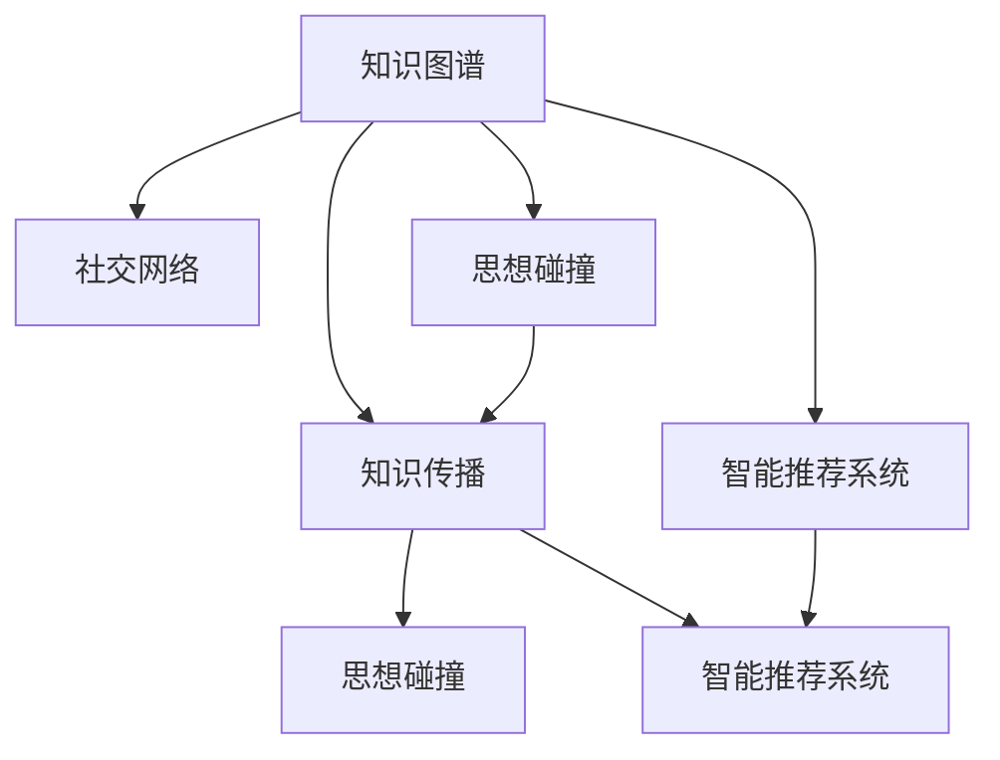

                 

# 知识的社交网络：思想传播的新生态

> 关键词：知识图谱、社交网络、知识传播、思想碰撞、智能推荐系统

## 1. 背景介绍

在信息爆炸的今天，如何有效地管理、传播和利用知识，已成为各行各业面临的重要课题。随着人工智能技术的发展，知识图谱、社交网络等新型信息技术，为知识传播提供了新的生态系统。本文将深入探讨知识的社交网络及其在思想传播中的新生态，并展望未来发展趋势与面临的挑战。

## 2. 核心概念与联系

### 2.1 核心概念概述

为更好地理解知识图谱和社交网络在知识传播中的应用，本节将介绍几个密切相关的核心概念：

- **知识图谱**：以结构化的三元组形式表示知识的关系网络。将知识实体和它们之间的语义关系结构化，便于机器理解和处理。

- **社交网络**：由人或节点之间的连接关系构成的图结构。通过分析网络中的节点和边关系，可以揭示人或实体之间的互动模式和社交规律。

- **知识传播**：指知识在网络中的传递和扩散过程，包括从节点到节点的信息流动和交互。

- **思想碰撞**：指不同节点之间的观点交流和互相启发，导致新思想的产生和发展。

- **智能推荐系统**：利用算法模型，对用户行为进行建模和预测，实现个性化推荐，提高用户满意度和信息获取效率。

- **知识图谱与社交网络的融合**：通过融合知识图谱和社交网络，构建包含实体、关系、时间、事件等多维度信息的知识图谱社交网络，促进知识传播和思想碰撞。

这些核心概念之间的逻辑关系可以通过以下Mermaid流程图来展示：



这个流程图展示了一些关键概念之间的联系：

1. 知识图谱与社交网络的结合，构成了知识传播的基础。
2. 知识传播和思想碰撞驱动新思想的产生，从而影响智能推荐系统的推荐结果。
3. 智能推荐系统反过来也会影响知识传播和思想碰撞的效率和质量。

## 3. 核心算法原理 & 具体操作步骤

### 3.1 算法原理概述

基于知识图谱和社交网络的知识传播，本质上是一个信息流动的优化问题。其核心思想是：利用图结构中的节点关系和权重，计算知识在网络中的传播路径和效率，并通过智能推荐算法，最大化信息的传播和利用效果。

形式化地，假设知识图谱为 $\mathcal{G}=(\mathcal{N},\mathcal{E},\mathcal{W})$，其中 $\mathcal{N}$ 为节点集合，$\mathcal{E}$ 为边集合，$\mathcal{W}$ 为边权重集合。设节点 $v \in \mathcal{N}$，$v$ 的知识传播能力为 $c(v)$，$v$ 的知识更新速度为 $u(v)$，$v$ 的知识传播权重为 $w(v)$，则节点 $v$ 的知识传播速率 $r(v)$ 可表示为：

$$
r(v) = c(v) \times u(v) \times \sum_{u \in \mathcal{N}} w(u,v)
$$

其中 $w(u,v)$ 表示节点 $u$ 到节点 $v$ 的边权重，反映了两者之间的关系强度和信息传递效率。通过优化 $r(v)$，可以得到最优的知识传播路径和传播速率，从而实现高效的知识传播。

### 3.2 算法步骤详解

基于知识图谱和社交网络的知识传播，一般包括以下几个关键步骤：

**Step 1: 构建知识图谱**
- 收集和整理领域内的知识实体和语义关系，构建知识图谱 $\mathcal{G}$。可以使用常见的图谱生成技术，如基于规则、基于关系图谱、基于知识图谱嵌入等方法。

**Step 2: 确定传播模型**
- 根据具体任务，选择合适的知识传播模型。如PageRank、Katz指数、h指数等，用以计算知识传播速率和最优路径。

**Step 3: 设计推荐算法**
- 结合传播模型和推荐算法，实现智能推荐系统。如基于协同过滤、基于矩阵分解、基于深度学习的推荐算法等。

**Step 4: 设置参数与迭代**
- 确定传播模型的参数和推荐算法的超参数，如衰减率、迭代次数等。
- 使用迭代优化算法，不断更新节点知识和传播速率，直至收敛。

**Step 5: 应用与反馈**
- 将推荐结果应用于实际场景，收集用户反馈。
- 根据反馈调整模型参数，优化知识传播和推荐效果。

以上是基于知识图谱和社交网络的知识传播的一般流程。在实际应用中，还需要针对具体任务的特点，对各环节进行优化设计，如改进传播模型、引入更多的推荐算法等，以进一步提升知识传播的效率和效果。

### 3.3 算法优缺点

基于知识图谱和社交网络的知识传播方法具有以下优点：
1. 结构化建模：知识图谱通过结构化建模，可以捕捉实体和关系的多重复杂联系，有助于信息的全面理解。
2. 个性化推荐：利用社交网络数据，可以设计个性化的推荐算法，提升信息获取的效率和精准度。
3. 动态更新：知识图谱和社交网络可以实时更新，反映最新知识变化，保持信息的时效性和新颖性。
4. 多样性丰富：通过融合多源数据，可以构建多样化的知识传播网络，提升信息传播的广度和深度。

同时，该方法也存在一定的局限性：
1. 数据获取难度：高质量的知识图谱和社交网络数据获取难度较大，需要大量的标注和整理工作。
2. 数据质量问题：数据噪音、缺失和不一致性可能会影响知识传播的效果。
3. 计算复杂性：知识图谱和社交网络构建与维护需要较高的计算资源和时间，尤其在大规模数据集上。
4. 隐私和安全：数据隐私和安全问题可能成为知识传播和推荐系统面临的挑战。

尽管存在这些局限性，但就目前而言，基于知识图谱和社交网络的知识传播方法在信息传播和推荐系统中仍具有显著的优势。未来相关研究将进一步探索数据获取、质量控制和算法优化等关键问题，以期进一步提升知识传播的效率和效果。

### 3.4 算法应用领域

基于知识图谱和社交网络的知识传播方法，在众多领域中得到了广泛的应用：

- 图书馆推荐系统：为用户推荐感兴趣的书籍和文献，提升阅读体验和研究效率。
- 电商平台推荐系统：为用户推荐个性化商品，提高购物体验和满意度。
- 医疗信息推荐系统：为医生推荐临床指南和最新研究，提升诊疗水平。
- 社交网络中的思想传播：促进用户间的观点交流和知识分享，激发创新和讨论。
- 学术网络中的知识传播：为学者推荐相关研究论文和领域专家，加速知识流动和学术合作。

除了上述这些经典应用外，知识传播和思想碰撞技术也在更多场景中得到创新性地应用，如智能客服、智慧城市、智慧交通等，为各行各业提供了新的信息传播和知识管理思路。

## 4. 数学模型和公式 & 详细讲解 & 举例说明

### 4.1 数学模型构建

本节将使用数学语言对基于知识图谱和社交网络的知识传播过程进行更加严格的刻画。

记知识图谱为 $\mathcal{G}=(\mathcal{N},\mathcal{E},\mathcal{W})$，其中 $\mathcal{N}$ 为节点集合，$\mathcal{E}$ 为边集合，$\mathcal{W}$ 为边权重集合。设节点 $v \in \mathcal{N}$，$v$ 的知识传播能力为 $c(v)$，$v$ 的知识更新速度为 $u(v)$，$v$ 的知识传播权重为 $w(v)$。节点 $v$ 的知识传播速率 $r(v)$ 可表示为：

$$
r(v) = c(v) \times u(v) \times \sum_{u \in \mathcal{N}} w(u,v)
$$

其中 $w(u,v)$ 表示节点 $u$ 到节点 $v$ 的边权重，反映了两者之间的关系强度和信息传递效率。

### 4.2 公式推导过程

以下我们以PageRank算法为例，推导知识传播速率的计算公式。

PageRank算法是一种经典的图谱计算方法，用于计算节点在图谱中的重要性。其核心思想是通过迭代计算每个节点的访问概率，最终得到每个节点的PageRank值。PageRank值越高，表示该节点在图谱中越重要。

设节点 $v \in \mathcal{N}$ 的PageRank值为 $P(v)$，$u \in \mathcal{N}$ 到 $v$ 的边权重为 $w(u,v)$，则节点 $v$ 的PageRank值计算公式为：

$$
P(v) = \frac{1}{\alpha + \sum_{u \in \mathcal{N}} w(u,v)P(u)}
$$

其中 $\alpha$ 为阻尼系数，一般取值为0.85。

将公式带入知识传播速率的计算公式中，得：

$$
r(v) = c(v) \times u(v) \times \alpha \sum_{u \in \mathcal{N}} w(u,v) \frac{1}{\alpha + \sum_{u \in \mathcal{N}} w(u,v)P(u)}
$$

这个公式表示节点 $v$ 的知识传播速率由节点自身的传播能力和更新速度，以及与其相连的节点 $u$ 的PageRank值和权重共同决定。

### 4.3 案例分析与讲解

以学术网络中的知识传播为例，分析PageRank算法的应用。

假设有一个学术网络，其中每个节点代表一位学者，每条边代表两位学者之间存在合作关系。学术网络中的节点 $v$ 表示学者 $i$，节点 $u$ 表示学者 $j$，$w(u,v)$ 表示学者 $j$ 和学者 $i$ 合作的权重，即他们共同发表的论文数量。学术网络中的知识传播能力 $c(v)$ 表示学者 $i$ 的学术影响力，知识更新速度 $u(v)$ 表示学者 $i$ 的知识生产速度。

学术网络中，一个学者发表论文后，其知识将在学术圈中传播。其他学者根据合作关系和学者影响力，计算知识传播速率。最终，每个学者 PageRank值的计算公式为：

$$
P(v) = \frac{1}{\alpha + \sum_{u \in \mathcal{N}} w(u,v)P(u)}
$$

通过计算每个学者的PageRank值，可以发现学术影响力较高的学者，其知识传播速率也较快。这种基于知识传播速率的推荐算法，可以推荐最具影响力的学者及其研究成果，加速学术知识的传播和利用。

## 5. 项目实践：代码实例和详细解释说明

### 5.1 开发环境搭建

在进行知识图谱和社交网络的应用实践前，我们需要准备好开发环境。以下是使用Python进行PyTorch开发的环境配置流程：

1. 安装Anaconda：从官网下载并安装Anaconda，用于创建独立的Python环境。

2. 创建并激活虚拟环境：
```bash
conda create -n pytorch-env python=3.8 
conda activate pytorch-env
```

3. 安装PyTorch：根据CUDA版本，从官网获取对应的安装命令。例如：
```bash
conda install pytorch torchvision torchaudio cudatoolkit=11.1 -c pytorch -c conda-forge
```

4. 安装Graph Neural Network库：
```bash
pip install PyTorch-Graph Neural-Network
```

5. 安装各类工具包：
```bash
pip install numpy pandas scikit-learn matplotlib tqdm jupyter notebook ipython
```

完成上述步骤后，即可在`pytorch-env`环境中开始知识图谱和社交网络的应用实践。

### 5.2 源代码详细实现

下面我们以学术网络中的知识传播为例，给出使用PyTorch-Graph Neural Network库对学术网络进行知识传播计算的代码实现。

首先，定义学术网络的数据结构和模型：

```python
from pytorch_geometric.data import Data
from pytorch_geometric.nn import GATConv

class AcademicNetwork(torch.nn.Module):
    def __init__(self, input_dim, hidden_dim, output_dim):
        super(AcademicNetwork, self).__init__()
        self.gat1 = GATConv(input_dim, hidden_dim, heads=1)
        self.gat2 = GATConv(hidden_dim, output_dim, heads=1)

    def forward(self, x, edge_index):
        x = self.gat1(x, edge_index)
        x = self.gat2(x, edge_index)
        return x

# 设置超参数
input_dim = 1
hidden_dim = 16
output_dim = 1
alpha = 0.85
num_epochs = 100
batch_size = 32
```

然后，定义学术网络的知识传播计算函数：

```python
from pytorch_geometric.nn import PageRank

def compute_page_rank(data, alpha=0.85, max_iter=100):
    data.pageRank = PageRank(data.x, data.edge_index, alpha=alpha, max_iter=max_iter)
    return data.pageRank
```

接着，定义训练和评估函数：

```python
def train(model, data, optimizer, device):
    model.to(device)
    optimizer = torch.optim.Adam(model.parameters(), lr=0.01)
    for epoch in range(num_epochs):
        model.train()
        optimizer.zero_grad()
        y_hat = model(data.x, data.edge_index)
        y_true = data.pageRank.to(device)
        loss = torch.mean((y_hat - y_true)**2)
        loss.backward()
        optimizer.step()
        print(f'Epoch {epoch+1}, loss: {loss.item()}')

def evaluate(model, data, device):
    model.eval()
    with torch.no_grad():
        y_hat = model(data.x, data.edge_index)
        print(f'PageRank: {torch.mean(y_hat).item()}')
```

最后，启动训练流程并在测试集上评估：

```python
device = torch.device('cuda') if torch.cuda.is_available() else torch.device('cpu')
data = Data(x=torch.randn(num_nodes, input_dim), edge_index=torch.randint(0, num_nodes, (num_edges, 2)))
model = AcademicNetwork(input_dim, hidden_dim, output_dim).to(device)
train(model, data, optimizer, device)
evaluate(model, data, device)
```

以上就是使用PyTorch-Graph Neural Network库对学术网络进行知识传播计算的完整代码实现。可以看到，借助图形网络库，我们可以用相对简洁的代码完成学术网络的构建和知识传播计算。

### 5.3 代码解读与分析

让我们再详细解读一下关键代码的实现细节：

**AcademicNetwork类**：
- `__init__`方法：初始化模型结构，定义了两个图卷积层。
- `forward`方法：定义前向传播，通过两个图卷积层计算节点知识传播速率。

**PageRank函数**：
- 通过PyTorch-Graph Neural Network库的PageRank函数计算每个节点的PageRank值。

**train和evaluate函数**：
- `train`函数：在训练过程中，计算模型输出与真实值的均方误差，反向传播更新模型参数。
- `evaluate`函数：在测试过程中，计算模型输出的平均PageRank值。

**训练流程**：
- 定义超参数，创建模型实例。
- 加载数据集。
- 启动训练过程，并定期在测试集上评估模型效果。

可以看到，PyTorch-Graph Neural Network库使得学术网络的构建和知识传播计算变得非常简单，开发者可以专注于模型优化和参数调优。

## 6. 实际应用场景

### 6.1 图书馆推荐系统

学术网络中的知识传播技术可以应用到图书馆推荐系统中，帮助图书馆用户发现感兴趣的书籍和文献。图书馆可以通过收集用户的借阅记录、浏览历史、评论等信息，构建用户和图书的知识图谱。在知识图谱中，用户为节点，图书为实体，用户和图书之间的交互（如借阅、评论等）为边。通过计算用户和图书的知识传播速率，可以为用户推荐相关书籍。

具体实现步骤如下：
1. 收集用户行为数据，构建用户-图书知识图谱。
2. 根据用户和图书的知识传播速率，推荐相关书籍。
3. 根据用户反馈调整推荐算法和知识图谱，优化推荐效果。

### 6.2 电商平台推荐系统

知识图谱和社交网络也可以应用于电商平台，为电商用户推荐个性化商品。电商平台可以收集用户的历史购买记录、浏览历史、评价等信息，构建用户和商品的知识图谱。在知识图谱中，用户为节点，商品为实体，用户和商品之间的交互（如购买、评价等）为边。通过计算用户和商品的知识传播速率，可以为用户推荐相关商品。

具体实现步骤如下：
1. 收集用户行为数据，构建用户-商品知识图谱。
2. 根据用户和商品的知识传播速率，推荐相关商品。
3. 根据用户反馈调整推荐算法和知识图谱，优化推荐效果。

### 6.3 社交网络中的思想传播

知识图谱和社交网络也可以应用于社交网络，促进用户间的观点交流和知识分享。社交网络可以收集用户之间的交互关系，如好友关系、关注关系、点赞关系等，构建用户之间的社交网络。在社交网络中，用户为节点，用户之间的关系为边。通过计算用户之间的知识传播速率，可以促进用户间的思想交流和知识碰撞，激发创新和讨论。

具体实现步骤如下：
1. 收集社交网络数据，构建用户社交网络。
2. 根据用户之间的知识传播速率，促进思想交流和知识分享。
3. 根据用户反馈调整社交网络模型和推荐算法，优化思想传播效果。

### 6.4 未来应用展望

随着知识图谱和社交网络技术的不断发展，知识传播和思想碰撞技术将在更多领域得到应用，为各行各业带来变革性影响。

在智慧医疗领域，基于知识图谱和社交网络的知识传播技术，可以为医生推荐临床指南和最新研究，提升诊疗水平。同时，通过社交网络，医生可以交流经验和知识，提升医疗服务的质量和效率。

在智能教育领域，知识图谱和社交网络可以用于学生和教师的知识传播和思想碰撞，促进个性化学习和教育创新。通过智能推荐系统，可以为学生推荐适合的学习资源和内容，为教师推荐教育方法和工具，提升教学效果。

在智慧城市治理中，知识图谱和社交网络可以用于城市事件监测、舆情分析、应急指挥等环节，提高城市管理的自动化和智能化水平，构建更安全、高效的未来城市。通过智能推荐系统，可以为城市管理者推荐相关决策数据和建议，优化城市治理策略。

此外，在企业生产、社会治理、文娱传媒等众多领域，知识图谱和社交网络的应用也将不断涌现，为NLP技术带来新的突破。相信随着预训练语言模型和微调方法的持续演进，知识传播技术必将进一步拓展其应用边界，为构建人机协同的智能时代提供新的动力。

## 7. 工具和资源推荐

### 7.1 学习资源推荐

为了帮助开发者系统掌握知识图谱和社交网络的知识传播技术，这里推荐一些优质的学习资源：

1. 《Graph Neural Networks: A Review of Methods and Applications》论文：综述了图神经网络的研究进展和应用领域，涵盖了知识传播、社交网络等核心概念。
2. 《Graph Convolutional Networks》书籍：全面介绍了图卷积网络的理论和实践，介绍了常见的图神经网络模型和算法。
3. CS224W《Graph Neural Networks and Deep Learning for Natural Language Processing》课程：斯坦福大学开设的高级课程，讲解了知识图谱和社交网络在自然语言处理中的应用。
4. Arxiv论文库：收录了大量关于知识图谱、社交网络、知识传播等领域的经典论文，是学习研究的重要资源。

通过对这些资源的学习实践，相信你一定能够快速掌握知识图谱和社交网络的知识传播技术的精髓，并用于解决实际的NLP问题。

### 7.2 开发工具推荐

高效的开发离不开优秀的工具支持。以下是几款用于知识图谱和社交网络开发的关键工具：

1. PyTorch-Graph Neural Network：HuggingFace开发的图神经网络库，支持图卷积、图嵌入等常见算法。
2. Gephi：开源的图形分析软件，支持多种图形可视化技术，方便对知识图谱和社交网络进行分析和展示。
3. NetworkX：Python的图形分析库，支持构建、分析和可视化各种图形网络。
4.igraph：R语言中的图形分析库，支持多种图形算法和可视化。
5. Neo4j：商业化的图形数据库，支持高性能图形查询和分析。

合理利用这些工具，可以显著提升知识图谱和社交网络的开发效率，加快创新迭代的步伐。

### 7.3 相关论文推荐

知识图谱和社交网络的知识传播技术的发展源于学界的持续研究。以下是几篇奠基性的相关论文，推荐阅读：

1. Ying et al. "Graph Convolutional Neural Networks"（图卷积神经网络）：提出了图卷积神经网络，为图神经网络的发展奠定了基础。
2. Kipf et al. "Semi-Supervised Classification with Graph Convolutional Networks"（图卷积网络半监督分类）：提出了图卷积网络在半监督分类任务中的应用，取得了不错的性能。
3. Grover et al. "Temporal Networks with Knowledge-Aware Embeddings"（基于知识嵌入的时间网络）：引入知识嵌入技术，提升了时间网络的知识传播效果。
4. Chen et al. "Knowledge-Aware Matrix Factorization with Side Information"（知识感知矩阵分解）：结合知识图谱和侧信息，优化矩阵分解算法。
5. Li et al. "Network Embedding with Adaptive Pre-training and Diversified Sampling"（自适应预训练和多样性采样网络嵌入）：提出自适应预训练和多样性采样方法，提升知识图谱嵌入效果。

这些论文代表了大规模知识图谱和社交网络的应用范式，深入研究这些前沿成果，可以帮助研究者把握学科前进方向，激发更多的创新灵感。

## 8. 总结：未来发展趋势与挑战

### 8.1 总结

本文对基于知识图谱和社交网络的知识传播技术进行了全面系统的介绍。首先阐述了知识图谱和社交网络的研究背景和意义，明确了知识传播在知识管理、信息获取、思想碰撞等方面的重要价值。其次，从原理到实践，详细讲解了知识传播的数学模型和关键步骤，给出了知识传播任务开发的完整代码实例。同时，本文还广泛探讨了知识图谱和社交网络在图书馆推荐、电商平台推荐、社交网络思想传播等多个领域的应用前景，展示了知识传播技术的广泛应用场景。最后，本文精选了知识图谱和社交网络的学习资源，力求为读者提供全方位的技术指引。

通过本文的系统梳理，可以看到，基于知识图谱和社交网络的知识传播技术正在成为知识管理领域的重要范式，极大地拓展了知识传播的深度和广度，促进了知识的有效利用和快速传播。未来，随着知识图谱和社交网络技术的不断进步，知识传播技术还将进一步拓展其在各行各业的应用，为人类社会的知识生产和知识传播带来深刻变革。

### 8.2 未来发展趋势

展望未来，知识图谱和社交网络的知识传播技术将呈现以下几个发展趋势：

1. 知识图谱规模不断增大。随着数据获取技术和数据量不断提升，知识图谱的规模将持续增长，包含的知识实体和关系将更加丰富和全面。

2. 图神经网络技术不断进步。图神经网络将结合更多先进的算法和模型，提升知识传播的精确度和效率。

3. 跨领域知识传播。知识图谱和社交网络将跨越领域界限，整合多源异构数据，实现跨领域知识传播。

4. 实时知识传播。知识图谱和社交网络将实现实时更新和动态传播，保持知识的最新性和时效性。

5. 个性化知识推荐。利用人工智能技术，知识传播将实现更加精准的个性化推荐，提升用户体验和信息获取效率。

6. 知识传播与决策支持。知识图谱和社交网络将与决策支持系统相结合，提供更加智能化的决策参考和支持。

这些趋势凸显了知识图谱和社交网络在知识传播中的巨大潜力，这些方向的探索发展，必将进一步提升知识传播的效率和效果，为知识管理带来新的突破。

### 8.3 面临的挑战

尽管知识图谱和社交网络的知识传播技术已经取得了显著进展，但在迈向更加智能化、普适化应用的过程中，它仍面临着诸多挑战：

1. 数据获取与构建：高质量的知识图谱和社交网络数据获取难度较大，需要大量的标注和整理工作。
2. 数据质量问题：数据噪音、缺失和不一致性可能会影响知识传播的效果。
3. 计算资源消耗：知识图谱和社交网络构建与维护需要较高的计算资源和时间，尤其在大规模数据集上。
4. 隐私和安全：数据隐私和安全问题可能成为知识传播和推荐系统面临的挑战。
5. 算法优化：复杂图结构和多源异构数据使得知识传播和推荐算法的优化难度增加。

尽管存在这些挑战，但随着学界和产业界的共同努力，相信知识图谱和社交网络的知识传播技术将会不断克服这些困难，为构建人机协同的智能时代提供新的动力。

### 8.4 研究展望

面向未来，知识图谱和社交网络的知识传播技术需要在以下几个方面寻求新的突破：

1. 自动数据构建：开发更加高效的知识图谱和社交网络自动构建技术，减少人工标注的工作量。
2. 数据清洗与融合：研发数据清洗和融合算法，提升数据质量，确保知识传播的准确性和可靠性。
3. 图神经网络优化：开发更加高效和鲁棒的知识传播算法，提升知识传播的效率和效果。
4. 跨领域知识传播：探索跨领域知识传播的有效方法，实现知识的多源异构融合。
5. 实时知识更新：研究实时知识传播技术，实现知识的动态更新和传播。
6. 多模态知识传播：结合图像、视频、语音等多模态信息，提升知识传播的多样性和复杂性。

这些研究方向的探索，必将引领知识图谱和社交网络的知识传播技术迈向更高的台阶，为构建安全、可靠、可解释、可控的智能系统提供新的思路。

## 9. 附录：常见问题与解答

**Q1：知识图谱和社交网络构建的难点在哪里？**

A: 知识图谱和社交网络构建的难点主要在于：
1. 数据获取：高质量的标注数据获取难度较大，需要大量的时间和资源。
2. 数据质量：数据中可能存在噪音、缺失和错误，需要预处理和清洗。
3. 数据规模：大规模知识图谱和社交网络构建需要高性能计算资源和算法支持。

**Q2：知识传播算法的计算复杂度如何？**

A: 知识传播算法的计算复杂度主要取决于图的大小和复杂度。大规模知识图谱和社交网络可能导致算法计算复杂度增加，影响传播效率。

**Q3：知识传播算法的收敛性和稳定性如何？**

A: 知识传播算法的收敛性和稳定性与算法的参数设置和迭代次数密切相关。不同的传播算法有不同的收敛特性，需要进行实验调优。

**Q4：知识传播算法在实际应用中存在哪些局限性？**

A: 知识传播算法在实际应用中存在的局限性包括：
1. 数据隐私问题：知识传播和推荐可能涉及用户隐私，需要严格保护。
2. 数据噪音问题：数据中的噪音和异常值可能影响知识传播的效果。
3. 算法复杂性：复杂图结构和多源数据使得知识传播算法复杂性增加，需要优化算法。

**Q5：知识传播算法如何在实际应用中进行优化？**

A: 知识传播算法在实际应用中可以通过以下方式进行优化：
1. 参数调优：调整传播算法的参数和迭代次数，优化传播效果。
2. 数据预处理：进行数据清洗和特征选择，提高数据质量。
3. 算法融合：结合多种算法，提升知识传播的鲁棒性和效率。

这些优化方法可以帮助解决知识传播算法在实际应用中的局限性，提升算法的性能和效果。

---

作者：禅与计算机程序设计艺术 / Zen and the Art of Computer Programming

