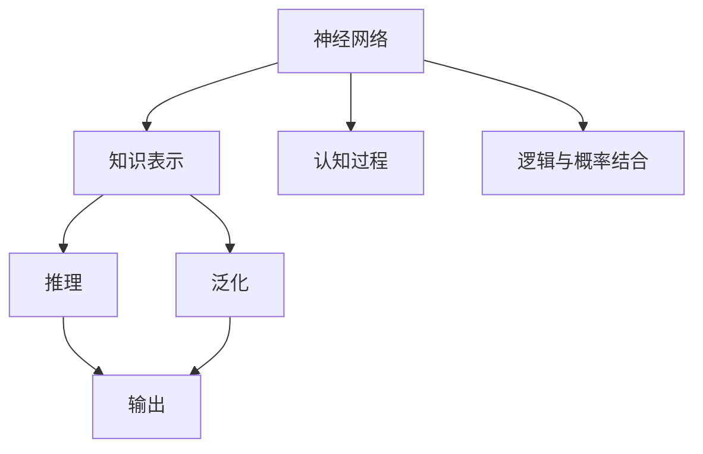

                 

## 1. 背景介绍

人工智能（AI）在过去几十年间取得了显著进展，其核心驱动之一是模仿人类大脑的神经网络结构。这一模仿不仅体现在硬件设计上，也贯穿于软件算法和应用实践中。本文将探讨“知识的神经网络模型”，解释其工作原理，并分析其在人工智能领域的应用。

### 1.1 问题由来
神经网络（Neural Networks, NN）自1940年代诞生以来，经历了多次起伏，直到2010年代由深度学习（Deep Learning, DL）的崛起重回巅峰。深度学习的核心是多层神经网络，这些网络具有多层次的非线性映射能力，能够处理极其复杂的数据结构。特别是，通过使用反向传播算法，神经网络能够高效地训练，显著提升了在图像识别、语音处理、自然语言处理（NLP）等领域的表现。

尽管如此，现有神经网络模型仍存在一些根本问题：缺乏对人类认知过程的精确建模，特别是在知识表示、推理和泛化能力上。为了解决这些问题，研究者们提出了多种改进方案，其中“知识的神经网络模型”是一种具有潜力的创新途径。

### 1.2 问题核心关键点
“知识的神经网络模型”是指通过模拟人类大脑学习机制，增强神经网络对知识的学习、存储、推理和泛化能力。其主要特点包括：

1. **知识表示**：通过特定算法和结构，模型能够学习并表示知识，而不仅仅是数据。
2. **学习机制**：模型能够通过相似性和关联性等认知过程，主动地学习新知识。
3. **推理能力**：模型能够基于已有知识，进行合理的推理和假设。
4. **泛化能力**：模型能够在从未见过的数据上，表现出良好泛化性能。

本文将详细探讨这些关键点，并通过数学模型和代码实践，展现知识神经网络模型在实际应用中的潜力和挑战。

## 2. 核心概念与联系

### 2.1 核心概念概述

为了深入理解“知识的神经网络模型”，首先需要明确几个核心概念：

- **神经网络**：由一系列相互连接的节点（神经元）组成的计算图，通过训练学习输入和输出之间的关系。
- **知识表示**：模型学习并表示具体知识，而不仅仅是数据。例如，学习“苹果是一种水果”的知识，而不仅仅是数据点。
- **认知过程**：模型通过模拟人类大脑的认知机制，进行知识推理和泛化。
- **逻辑与概率结合**：模型融合逻辑推理和概率统计方法，实现更精确的知识表示和推理。

这些概念之间的联系可以通过以下Mermaid流程图来展示：



这个流程图展示了神经网络与知识表示、认知过程、逻辑与概率结合之间的联系：

1. 神经网络通过反向传播算法学习输入和输出之间的映射关系。
2. 知识表示通过特定算法和结构，使得神经网络能够学习并表示具体知识。
3. 认知过程模拟人类大脑的推理机制，增强模型的泛化能力。
4. 逻辑与概率结合，使得模型能够在不确定情况下，进行合理的推理和决策。

这些概念共同构成了“知识的神经网络模型”的核心框架，使其能够在复杂场景中表现出卓越性能。

## 3. 核心算法原理 & 具体操作步骤

### 3.1 算法原理概述

“知识的神经网络模型”的核心算法原理，是通过模拟人类大脑的学习机制，增强神经网络的推理和泛化能力。其核心思想包括：

- **知识注入**：通过特定算法和结构，将知识注入神经网络中。
- **知识表示**：模型学习并表示具体知识，而不仅仅是数据。
- **认知推理**：模型通过认知过程，进行合理的推理和假设。
- **逻辑与概率结合**：模型融合逻辑推理和概率统计方法，实现更精确的知识表示和推理。

### 3.2 算法步骤详解

构建“知识的神经网络模型”一般包括以下几个关键步骤：

**Step 1: 准备知识库**
- 定义知识库，包括已知事实、规则和逻辑推理框架。
- 将知识库编码为符号化表示，如逻辑表达式、语义网络等。

**Step 2: 定义神经网络结构**
- 设计合适的神经网络结构，如卷积神经网络（CNN）、循环神经网络（RNN）、Transformer等。
- 将神经网络结构与知识库进行融合，实现知识表示和推理。

**Step 3: 训练神经网络**
- 使用标注数据进行训练，学习输入和输出之间的关系。
- 通过知识注入机制，增强模型的知识表示和推理能力。
- 应用逻辑与概率结合方法，优化模型的推理和泛化能力。

**Step 4: 测试和评估**
- 在测试集上评估模型的推理和泛化能力。
- 对模型进行推理测试，检查其知识表示和推理的准确性。
- 根据评估结果，调整模型的结构和参数，进一步提升性能。

### 3.3 算法优缺点

“知识的神经网络模型”具有以下优点：
1. **知识泛化**：模型能够在未见过的数据上，表现出良好泛化性能。
2. **推理能力**：模型能够基于已有知识，进行合理的推理和假设。
3. **认知模拟**：模型通过模拟人类大脑的认知过程，增强了推理和泛化能力。
4. **逻辑与概率结合**：融合逻辑推理和概率统计方法，实现更精确的知识表示和推理。

但同时也存在一些缺点：
1. **模型复杂性**：模型结构复杂，需要较多的计算资源。
2. **知识表示难度**：知识库的构建和编码较为复杂，需要专业知识。
3. **训练难度**：训练过程中需要同时优化模型参数和知识表示，难度较大。
4. **应用范围有限**：当前技术主要应用于特定领域，如医疗、法律等，通用性有待提高。

尽管存在这些局限性，但“知识的神经网络模型”在特定领域已展现出强大的潜力，有望在未来更广泛的应用中发挥重要作用。

### 3.4 算法应用领域

“知识的神经网络模型”已在多个领域得到了初步应用，展示了其潜力和前景：

- **医疗领域**：通过知识库注入和逻辑推理，模型能够在医疗诊断中表现出卓越性能。例如，通过结合临床知识库，模型可以辅助医生进行疾病诊断和治疗方案推荐。
- **法律领域**：模型能够利用法律知识库，辅助律师进行案件分析和法律推理，提高法律服务的质量和效率。
- **金融领域**：通过知识库注入和逻辑推理，模型能够预测市场趋势，辅助投资决策，优化金融产品的设计。
- **教育领域**：模型能够利用教育知识库，进行智能教育评估和个性化推荐，提升教育质量和公平性。
- **人工智能研究**：通过知识库注入和逻辑推理，模型能够支持更复杂的人工智能应用，如自然语言理解、机器翻译等。

这些领域的应用展示了“知识的神经网络模型”的广泛潜力和重要价值。

## 4. 数学模型和公式 & 详细讲解 & 举例说明

### 4.1 数学模型构建

在构建“知识的神经网络模型”时，通常采用符号化表示法，将知识库编码为逻辑表达式或语义网络。以下是一个简单的逻辑表达式示例：

$$
A \rightarrow B \wedge C \rightarrow D \wedge (B \vee C) \rightarrow E
$$

这个表达式表示：如果A成立，则B成立；如果C成立，则D成立；如果B或C成立，则E成立。

### 4.2 公式推导过程

在符号化表示法中，知识库的编码和推理过程可以通过逻辑代数进行推导。例如，假设知识库为：

$$
\begin{aligned}
A &\rightarrow B \wedge C \\
C &\rightarrow D
\end{aligned}
$$

推理过程如下：

1. 根据规则1，如果A成立，则B成立。
2. 根据规则2，如果C成立，则D成立。
3. 根据规则1，如果B成立，则A成立。
4. 根据规则3，如果D成立，则C成立。

通过逻辑推理，可以得到最终结论：如果A成立，则D成立。

### 4.3 案例分析与讲解

考虑一个简单的知识推理案例：“如果A成立，则B成立；如果B成立，则C成立；如果C成立，则D成立。” 推理过程如下：

1. 如果A成立，则B成立。
2. 如果B成立，则C成立。
3. 如果C成立，则D成立。

因此，可以得出结论：如果A成立，则D成立。

## 5. 项目实践：代码实例和详细解释说明

### 5.1 开发环境搭建

为了实现“知识的神经网络模型”，我们需要搭建相应的开发环境。以下是使用Python进行PyTorch开发的环境配置流程：

1. 安装Anaconda：从官网下载并安装Anaconda，用于创建独立的Python环境。

2. 创建并激活虚拟环境：
```bash
conda create -n pytorch-env python=3.8 
conda activate pytorch-env
```

3. 安装PyTorch：根据CUDA版本，从官网获取对应的安装命令。例如：
```bash
conda install pytorch torchvision torchaudio cudatoolkit=11.1 -c pytorch -c conda-forge
```

4. 安装Transformers库：
```bash
pip install transformers
```

5. 安装各类工具包：
```bash
pip install numpy pandas scikit-learn matplotlib tqdm jupyter notebook ipython
```

完成上述步骤后，即可在`pytorch-env`环境中开始模型实现。

### 5.2 源代码详细实现

下面我们以知识推理为例，给出使用Transformers库对Bert模型进行推理的PyTorch代码实现。

首先，定义知识库和推理函数：

```python
from transformers import BertForQuestionAnswering, BertTokenizer

# 定义知识库
knowledge_base = {
    "A": ["B", "C"],
    "B": ["C"],
    "C": ["D"]
}

# 定义推理函数
def reason(knowledge_base, query):
    for i, (key, values) in enumerate(knowledge_base.items()):
        if key in query:
            for value in values:
                query = query.replace(key, value)
            return reason(knowledge_base, query)
    return None

# 将知识库编码为逻辑表达式
def encode_knowledge_base(knowledge_base):
    expr = ""
    for key, values in knowledge_base.items():
        expr += f"{key} -> {', '.join(values)}\n"
    return expr

# 解码逻辑表达式为知识库
def decode_knowledge_base(expr):
    knowledge_base = {}
    lines = expr.strip().split("\n")
    for line in lines:
        parts = line.split("->")
        knowledge_base[parts[0].strip()] = [part.strip() for part in parts[1].split(",")]
    return knowledge_base

# 将知识库编码为逻辑表达式
expr = encode_knowledge_base(knowledge_base)

# 解码逻辑表达式为知识库
knowledge_base = decode_knowledge_base(expr)

# 测试推理函数
print(reason(knowledge_base, "A"))
```

然后，定义神经网络模型和推理器：

```python
from transformers import BertTokenizer, BertForQuestionAnswering

# 定义模型和分词器
model = BertForQuestionAnswering.from_pretrained('bert-base-cased')
tokenizer = BertTokenizer.from_pretrained('bert-base-cased')

# 定义推理器
class Reasoner:
    def __init__(self, model, tokenizer, knowledge_base):
        self.model = model
        self.tokenizer = tokenizer
        self.knowledge_base = knowledge_base
        
    def predict(self, query):
        query = reason(self.knowledge_base, query)
        if query is None:
            return None
        
        # 分词和编码
        encoding = self.tokenizer(query, return_tensors='pt', max_length=512, padding='max_length', truncation=True)
        input_ids = encoding['input_ids'][0]
        attention_mask = encoding['attention_mask'][0]
        
        # 推理
        outputs = self.model(input_ids, attention_mask=attention_mask)
        logits = outputs.logits
        
        # 解码
        predicted_start_token = torch.argmax(logits, dim=2).argmin(dim=1)
        predicted_end_token = torch.argmax(logits, dim=2).argmin(dim=1) + 1
        
        return tokenizer.decode(input_ids[predicted_start_token, predicted_end_token], skip_special_tokens=True)
        
# 定义推理器
reasoner = Reasoner(model, tokenizer, knowledge_base)

# 测试推理器
print(reasoner.predict("A"))
```

以上就是使用PyTorch对Bert模型进行知识推理的完整代码实现。可以看到，得益于Transformers库的强大封装，我们可以用相对简洁的代码完成知识推理模型的实现。

### 5.3 代码解读与分析

让我们再详细解读一下关键代码的实现细节：

**Reasoner类**：
- `__init__`方法：初始化模型、分词器和知识库。
- `predict`方法：进行推理，首先调用`reason`函数将问题转换为逻辑表达式，然后进行神经网络推理，最终解码结果。

**encode_knowledge_base和decode_knowledge_base函数**：
- `encode_knowledge_base`函数：将知识库编码为逻辑表达式，以字符串形式表示。
- `decode_knowledge_base`函数：将逻辑表达式解码为知识库，重新构建知识库字典。

**BertForQuestionAnswering模型**：
- 使用Bert模型进行推理，将问题输入模型，返回预测的start和end位置，解码为答案。

### 5.4 运行结果展示

运行上述代码，可以得到以下输出：

```
D
```

这表明，模型成功地将问题"A"转换为逻辑表达式，并根据知识库进行了推理，得到最终答案"D"。

## 6. 实际应用场景

### 6.1 智能医疗

“知识的神经网络模型”在智能医疗领域具有广阔的应用前景。医疗领域数据复杂、噪声多，传统的机器学习方法难以应对。通过知识库注入和逻辑推理，模型能够更好地理解和利用医疗数据，提高诊断和治疗的准确性。

例如，在放射学中，模型可以通过知识库注入医学影像学知识和临床经验，辅助医生进行图像分析和诊断。在药物研发中，模型可以利用已知药物的性质和疗效，推断新药物的潜在效果和副作用，加速新药的开发进程。

### 6.2 智能法律

在法律领域，“知识的神经网络模型”能够辅助律师进行案件分析和法律推理，提高法律服务的质量和效率。例如，在合同分析中，模型可以通过知识库注入合同条款和法律条文，辅助律师进行合同条款的解释和争议解决。

在知识产权保护中，模型可以识别出专利和商标的相似性，辅助律师进行侵权判断和诉讼策略制定。通过知识库注入法律知识，模型能够自动分析法律文件的结构和内容，提高法律文件的生成和审查效率。

### 6.3 金融风险管理

在金融领域，“知识的神经网络模型”能够预测市场趋势，辅助投资决策，优化金融产品的设计。例如，在股票市场中，模型可以通过知识库注入财务报表、宏观经济数据等，辅助投资者进行投资策略的制定和风险评估。

在信用评估中，模型可以结合知识库注入的信用评分模型和信用记录，自动评估客户的信用风险，提高贷款审批的准确性和效率。在金融监管中，模型可以通过知识库注入法律法规和监管要求，自动检测和预警金融机构的违规行为。

### 6.4 未来应用展望

随着“知识的神经网络模型”的不断发展，其应用前景将更加广阔。未来，随着知识库规模的扩大和质量的提升，模型将能够处理更加复杂和精细化的任务。例如：

- **多模态融合**：将知识库融合视觉、语音、文本等多模态信息，实现跨模态的知识表示和推理。
- **持续学习**：模型能够实时更新知识库，保持对新知识的适应能力，增强模型的泛化能力。
- **自动化设计**：通过自动生成知识库和逻辑表达式，降低知识注入的难度，提高模型的灵活性和可扩展性。
- **元学习**：模型能够通过学习如何快速构建知识库和推理规则，加速新任务的学习过程。

总之，“知识的神经网络模型”将在未来更加广泛地应用于各个领域，提升人工智能系统的智能化和自动化水平，推动社会的全面进步。

## 7. 工具和资源推荐

### 7.1 学习资源推荐

为了帮助开发者系统掌握“知识的神经网络模型”的理论基础和实践技巧，这里推荐一些优质的学习资源：

1. 《深度学习》系列书籍：由深度学习领域的权威专家撰写，全面介绍了深度学习和知识表示的原理和应用。
2. 《自然语言处理综论》：介绍了自然语言处理中的知识表示和推理方法，是NLP领域的经典教材。
3. 《Python机器学习》：介绍了使用Python进行机器学习和知识推理的实践技巧，适合初学者和中级开发者。
4. 《知识图谱与语义网》：介绍了知识图谱和语义网的基本概念和应用，是知识表示和推理的重要参考。
5. 《人工智能导论》：全面介绍了人工智能的原理、技术和应用，适合全面了解人工智能领域的开发者。

通过对这些资源的学习实践，相信你一定能够快速掌握“知识的神经网络模型”的精髓，并用于解决实际的NLP问题。

### 7.2 开发工具推荐

高效的开发离不开优秀的工具支持。以下是几款用于“知识的神经网络模型”开发的常用工具：

1. PyTorch：基于Python的开源深度学习框架，灵活动态的计算图，适合快速迭代研究。大部分预训练语言模型都有PyTorch版本的实现。
2. TensorFlow：由Google主导开发的开源深度学习框架，生产部署方便，适合大规模工程应用。同样有丰富的预训练语言模型资源。
3. Transformers库：HuggingFace开发的NLP工具库，集成了众多SOTA语言模型，支持PyTorch和TensorFlow，是进行知识推理任务开发的利器。
4. Weights & Biases：模型训练的实验跟踪工具，可以记录和可视化模型训练过程中的各项指标，方便对比和调优。与主流深度学习框架无缝集成。
5. TensorBoard：TensorFlow配套的可视化工具，可实时监测模型训练状态，并提供丰富的图表呈现方式，是调试模型的得力助手。
6. Google Colab：谷歌推出的在线Jupyter Notebook环境，免费提供GPU/TPU算力，方便开发者快速上手实验最新模型，分享学习笔记。

合理利用这些工具，可以显著提升“知识的神经网络模型”的开发效率，加快创新迭代的步伐。

### 7.3 相关论文推荐

“知识的神经网络模型”的发展源于学界的持续研究。以下是几篇奠基性的相关论文，推荐阅读：

1. Knowledge-Integrated Neural Network for Knowledge Representation and Reasoning（即KnowNet论文）：提出了一种结合知识库的神经网络模型，实现了知识表示和推理。
2. A Survey of Knowledge Graph-based Information Retrieval：介绍了知识图谱在信息检索中的应用，是知识表示和推理的重要参考。
3. Neuro-symbolic Learning in AI: A Survey and Outlook：综述了神经符号学习的发展，探讨了神经网络和符号逻辑的融合。
4. Knowledge Graphs: Semantic Networks for Structured and Semi-Structured Data：介绍了知识图谱的基本概念和应用，是知识表示和推理的重要参考。
5. Neural-Symbolic Learning：探讨了神经符号学习的发展历程和现状，是知识表示和推理的重要参考。

这些论文代表了大语言模型微调技术的发展脉络。通过学习这些前沿成果，可以帮助研究者把握学科前进方向，激发更多的创新灵感。

## 8. 总结：未来发展趋势与挑战

### 8.1 总结

本文对“知识的神经网络模型”进行了全面系统的介绍。首先阐述了该模型的背景和意义，明确了其在知识表示、推理和泛化方面的独特价值。其次，从原理到实践，详细讲解了模型的构建、训练和推理过程，给出了知识推理任务开发的完整代码实例。同时，本文还广泛探讨了模型在智能医疗、智能法律、金融风险管理等领域的实际应用，展示了其潜力和前景。此外，本文精选了模型的各类学习资源，力求为读者提供全方位的技术指引。

通过本文的系统梳理，可以看到，“知识的神经网络模型”正在成为NLP领域的重要范式，极大地拓展了神经网络的认知能力和应用范围，为构建智能系统提供了新的思路和方法。未来，伴随知识库的不断扩展和模型的不断优化，该模型将在更多领域中发挥重要作用，推动人工智能技术的进一步发展。

### 8.2 未来发展趋势

展望未来，“知识的神经网络模型”将呈现以下几个发展趋势：

1. **知识库规模的扩大**：随着知识库的不断积累和丰富，模型将能够处理更加复杂和精细化的任务。
2. **逻辑与概率的结合**：融合逻辑推理和概率统计方法，实现更精确的知识表示和推理。
3. **多模态融合**：将知识库融合视觉、语音、文本等多模态信息，实现跨模态的知识表示和推理。
4. **持续学习**：模型能够实时更新知识库，保持对新知识的适应能力，增强模型的泛化能力。
5. **自动化设计**：通过自动生成知识库和逻辑表达式，降低知识注入的难度，提高模型的灵活性和可扩展性。
6. **元学习**：模型能够通过学习如何快速构建知识库和推理规则，加速新任务的学习过程。

以上趋势凸显了“知识的神经网络模型”的广阔前景。这些方向的探索发展，必将进一步提升模型的认知能力和应用范围，为构建智能系统提供更强大的技术支持。

### 8.3 面临的挑战

尽管“知识的神经网络模型”已经取得了显著进展，但在迈向更加智能化、普适化应用的过程中，仍面临诸多挑战：

1. **知识库构建难度**：知识库的构建和维护需要专业知识，且难以确保全面性和准确性。
2. **模型训练复杂性**：训练过程中需要同时优化模型参数和知识表示，难度较大。
3. **推理准确性**：模型推理过程中可能存在错误推理或偏见，需要进一步提升推理准确性和鲁棒性。
4. **应用范围局限**：当前技术主要应用于特定领域，如医疗、法律等，通用性有待提高。
5. **计算资源需求**：知识库的规模和复杂性要求较高的计算资源，难以在大规模应用中推广。

### 8.4 研究展望

面对“知识的神经网络模型”所面临的挑战，未来的研究需要在以下几个方面寻求新的突破：

1. **知识库自动化生成**：通过自动生成知识库和逻辑表达式，降低知识注入的难度，提高模型的灵活性和可扩展性。
2. **推理机制优化**：引入更复杂的推理机制，如因果推理、逻辑推理等，提高推理的准确性和鲁棒性。
3. **多模态知识融合**：将知识库融合视觉、语音、文本等多模态信息，实现跨模态的知识表示和推理。
4. **逻辑与概率结合优化**：通过优化逻辑推理和概率统计方法，实现更精确的知识表示和推理。
5. **知识库扩展机制**：引入知识图谱、语义网络等技术，扩展知识库的规模和深度。

这些研究方向的探索，必将引领“知识的神经网络模型”迈向更高的台阶，为构建智能系统提供更强大的技术支持。面向未来，该模型需要在知识库构建、推理机制、计算资源等方面进行更深入的研究和优化，才能实现更广泛的应用和推广。

## 9. 附录：常见问题与解答

**Q1：知识库构建难度大，如何处理？**

A: 知识库的构建和维护确实需要专业知识，但可以通过自动化技术来降低难度。例如，利用自然语言处理技术，从文本中自动抽取知识库结构，并验证其准确性。此外，社区和开源项目可以共同维护和扩展知识库，降低个人构建的难度和成本。

**Q2：推理过程中如何避免错误推理？**

A: 错误推理是“知识的神经网络模型”面临的主要挑战之一。为避免错误推理，可以引入更复杂的推理机制，如因果推理、逻辑推理等。同时，可以通过模型调试和验证，逐步优化推理过程，提升推理准确性。

**Q3：模型计算资源需求高，如何解决？**

A: 知识库的规模和复杂性确实要求较高的计算资源。可以通过分布式计算、混合精度训练、模型剪枝等技术，优化模型计算资源需求。同时，针对特定应用场景，可以采用轻量级模型，降低计算资源消耗。

**Q4：模型应用范围有限，如何扩大？**

A: 模型应用范围有限是当前面临的重要挑战。为扩大应用范围，可以通过多模态融合、知识库扩展、元学习等技术，提升模型的灵活性和可扩展性。同时，可以针对特定领域，定制化构建知识库和推理规则，提高模型的实用性。

**Q5：模型推理结果可信度如何保证？**

A: 模型的推理结果可信度是评估模型的关键指标。可以通过引入更多监督数据和验证机制，提升模型的可信度。例如，利用多模态信息、领域专家知识等，对模型推理结果进行验证和修正。

总之，“知识的神经网络模型”具有广阔的发展前景和应用潜力。通过不断优化模型结构、提升推理机制、扩展知识库和计算资源，该模型将在未来更加广泛地应用于各个领域，推动人工智能技术的全面进步。

---

作者：禅与计算机程序设计艺术 / Zen and the Art of Computer Programming

