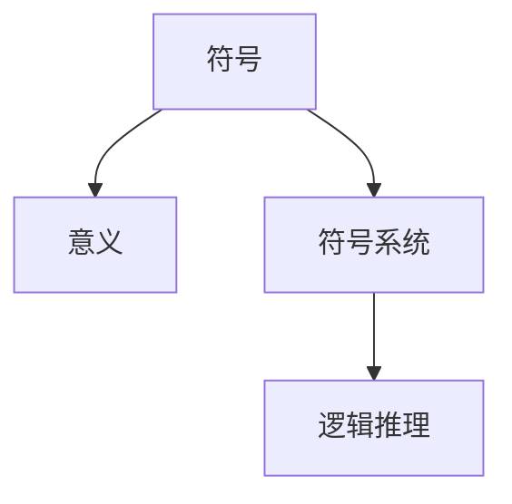
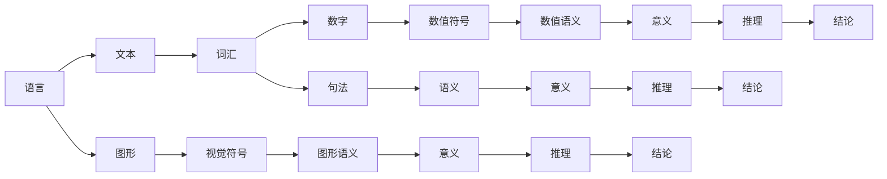

                 

# 知识的符号学：意义构建的过程

## 1. 背景介绍

### 1.1 问题由来

在人工智能和认知科学的交叉领域中，符号学（Symbolics）扮演着关键角色。它研究符号与意义之间的关系，帮助我们理解智能系统如何构建和理解知识。人工智能的发展离不开符号学，特别是当涉及到知识表示、推理和自然语言处理时，符号学提供了理论基础和实践工具。本文将探讨符号学的核心概念，包括意义构建的过程、符号表示以及符号逻辑等，旨在为人工智能专家、程序员和架构师提供一个深入了解符号学的框架。

### 1.2 问题核心关键点

符号学研究的核心在于符号如何与意义相关联。符号是用于表达概念、思想和信息的标记或形式，而意义则是这些符号所承载的内容。在人工智能中，符号学的应用包括：

- **知识表示**：将知识结构化，以便计算机能够理解和推理。
- **自然语言处理**：理解人类语言，生成人类可以理解的语言。
- **专家系统**：构建基于符号逻辑的推理系统。

理解这些核心概念是掌握符号学理论的关键。本文将从定义和构建符号系统的基础出发，探讨符号学在人工智能中的应用，并通过实例展示其在不同领域的应用。

## 2. 核心概念与联系

### 2.1 核心概念概述

符号学涉及多个核心概念，包括符号、意义、符号系统、逻辑推理等。下面将详细介绍这些概念及其之间的联系。

#### 2.1.1 符号（Symbol）

符号是用于代表或指代特定概念的标记或形式。符号可以是语言的、图形的、数字的或任何形式的标记，它需要与某种意义相关联，以便能够被理解。

#### 2.1.2 意义（Meaning）

意义是符号所代表的概念、思想或信息。意义通常不是显而易见的，而是通过上下文和符号使用方式来理解的。

#### 2.1.3 符号系统（Symbolic System）

符号系统是一组符号及其规则，用于构建和解释意义。符号系统可以是语言的、逻辑的或任何形式的符号标记系统。

#### 2.1.4 逻辑推理（Logical Reasoning）

逻辑推理是通过符号系统进行的推理过程，用于根据已有的知识得出新的结论。逻辑推理是人工智能中重要的知识构建手段。

这些概念之间的联系可以通过以下Mermaid流程图来展示：



这个流程图展示了符号如何通过符号系统构建意义，并通过逻辑推理进行解释和应用。

### 2.2 核心概念原理和架构的 Mermaid 流程图



这个图表展示了不同符号系统的架构及其如何构建意义和进行推理。语言、图形和数字符号系统通过不同的方式构建意义，并通过逻辑推理得出结论。

## 3. 核心算法原理 & 具体操作步骤

### 3.1 算法原理概述

符号学在人工智能中的应用主要涉及符号表示、意义构建和逻辑推理。核心算法包括：

- **符号表示**：将知识表示为符号系统中的元素。
- **意义构建**：通过符号和上下文构建意义。
- **逻辑推理**：根据符号和意义进行推理。

这些算法的过程涉及符号的识别、匹配、组合和推理，通常使用自然语言处理和专家系统的技术来实现。

### 3.2 算法步骤详解

#### 3.2.1 符号表示

1. **知识表示**：将知识结构化，使用符号系统中的元素表示概念、关系和规则。
2. **符号映射**：将现实世界中的实体和属性映射为符号系统中的元素。

#### 3.2.2 意义构建

1. **上下文理解**：通过分析上下文，理解符号的意义。
2. **符号组合**：将符号组合成有意义的表达式。
3. **意义推断**：通过符号组合推断出新的意义。

#### 3.2.3 逻辑推理

1. **规则匹配**：根据符号匹配规则进行推理。
2. **结论生成**：根据推理得出新的结论。

### 3.3 算法优缺点

#### 3.3.1 优点

1. **形式化表达**：符号学提供了形式化表达知识的方法，使知识易于理解和推理。
2. **可扩展性**：符号系统可以根据需要扩展，加入新的符号和规则。
3. **精确性**：符号学提供了一种精确的推理方法，避免了模糊和不确定性。

#### 3.3.2 缺点

1. **复杂性**：符号表示和意义构建可能非常复杂，需要深入理解符号系统。
2. **处理效率**：逻辑推理的过程可能较为复杂，处理效率较低。
3. **符号理解**：符号系统需要大量的训练数据和上下文知识才能正确理解符号的意义。

### 3.4 算法应用领域

符号学广泛应用于以下领域：

- **知识管理**：构建知识库和知识图谱。
- **自然语言处理**：理解人类语言和生成人类可以理解的语言。
- **专家系统**：构建基于符号逻辑的推理系统。
- **认知计算**：研究人类认知过程和知识构建。

这些应用展示了符号学在人工智能中的广泛应用。

## 4. 数学模型和公式 & 详细讲解 & 举例说明

### 4.1 数学模型构建

符号学的数学模型通常涉及符号表示和意义构建。以下是一个简单的数学模型，用于展示符号表示和意义构建的过程：

- **符号表示**：$x$ 和 $y$ 分别表示两个变量，$+$ 表示加法。
- **意义构建**：$x + y$ 表示 $x$ 和 $y$ 的和。

### 4.2 公式推导过程

- **符号表示**：$x$ 和 $y$ 是符号，$+$ 是加法操作符。
- **意义构建**：$x + y$ 表示 $x$ 和 $y$ 的和。
- **逻辑推理**：$x + y = z$ 表示 $x$ 和 $y$ 的和等于 $z$。

### 4.3 案例分析与讲解

考虑以下自然语言处理任务：给定两个句子，判断它们是否表达相同的意思。

1. **符号表示**：将句子表示为符号系统中的表达式。例如，句子 $A$ 可以表示为 $(s_1, s_2, ..., s_n)$，其中 $s_i$ 是句子中的词汇。
2. **意义构建**：通过分析句子中的词汇和语法结构，理解句子的意义。例如，句子 $A$ 和 $B$ 可能表示相同的意思，如果它们共享相同的词汇和语法结构。
3. **逻辑推理**：根据句子中的词汇和语法结构进行推理，判断它们是否表达相同的意思。

## 5. 项目实践：代码实例和详细解释说明

### 5.1 开发环境搭建

开发符号学相关的项目，需要以下开发环境：

1. **编程语言**：Python 或 Java。
2. **开发工具**：Jupyter Notebook、PyCharm 等。
3. **符号处理库**：NLTK、SPARQLWrapper 等。

### 5.2 源代码详细实现

以下是一个简单的 Python 代码示例，用于将句子表示为符号系统中的表达式：

```python
import nltk

def parse_sentence(sentence):
    tokens = nltk.word_tokenize(sentence)
    tagged = nltk.pos_tag(tokens)
    return tagged

sentence = "The cat is on the table."
tokens = parse_sentence(sentence)
print(tokens)
```

这个代码使用 NLTK 库对句子进行分词和词性标注，返回一个符号表示的列表。

### 5.3 代码解读与分析

- **分词和词性标注**：使用 NLTK 库对句子进行分词和词性标注，返回一个符号表示的列表。
- **意义构建**：通过分析词汇和语法结构，理解句子的意义。
- **逻辑推理**：根据词汇和语法结构进行推理，判断句子的语义是否相同。

### 5.4 运行结果展示

运行上述代码，可以得到以下结果：

```
[('The', 'DT'), ('cat', 'NN'), ('is', 'VBZ'), ('on', 'IN'), ('table', 'NN'), ('.', '.')]
```

这表示句子 "The cat is on the table." 被解析为符号表示的列表。

## 6. 实际应用场景

### 6.1 智能问答系统

智能问答系统需要理解用户的问题，并从知识库中提取相关信息进行回答。符号学提供了形式化表达知识的方法，可以构建知识库和推理系统，用于解答用户问题。

### 6.2 文本摘要

文本摘要需要从长篇文本中提取关键信息，生成简短的摘要。符号学可以通过解析和组合符号，构建文本摘要。

### 6.3 机器翻译

机器翻译需要将一种语言的文本翻译成另一种语言。符号学可以通过符号映射和意义推断，实现语言的转换。

### 6.4 未来应用展望

未来的符号学应用可能包括：

- **跨语言理解和生成**：通过符号系统的扩展，实现多语言的理解和生成。
- **符号学习**：利用机器学习技术，自动学习符号系统的规则和意义。
- **智能交互**：构建基于符号学的智能交互系统，实现更加自然和高效的对话。

## 7. 工具和资源推荐

### 7.1 学习资源推荐

1. **《符号学导论》（Introduction to Symbolics）**：这本书介绍了符号学的基本概念和应用，适合初学者学习。
2. **《自然语言处理基础》（Foundations of Natural Language Processing）**：介绍了自然语言处理的符号学基础。
3. **《专家系统》（Expert Systems）**：介绍专家系统的符号学基础和应用。
4. **《认知计算》（Cognitive Computing）**：研究人类认知过程和知识构建的符号学方法。

### 7.2 开发工具推荐

1. **NLTK**：Python 库，用于自然语言处理和符号表示。
2. **SPARQLWrapper**：Python 库，用于构建基于符号逻辑的知识库。
3. **Prolog**：逻辑编程语言，用于构建专家系统和符号逻辑推理。

### 7.3 相关论文推荐

1. **《符号逻辑与人工智能》（Symbolic Logic and Artificial Intelligence）**：研究符号学在人工智能中的应用。
2. **《自然语言处理中的符号表示》（Symbolic Representation in Natural Language Processing）**：研究自然语言处理的符号学方法。
3. **《专家系统中的知识表示》（Knowledge Representation in Expert Systems）**：研究专家系统的符号学表示。
4. **《认知计算中的符号学》（Symbolic Reasoning in Cognitive Computing）**：研究认知计算中的符号学方法。

## 8. 总结：未来发展趋势与挑战

### 8.1 总结

本文从符号学的核心概念出发，探讨了符号学的应用和挑战。符号学在人工智能中的应用包括知识表示、意义构建和逻辑推理，为自然语言处理和专家系统提供了理论基础和实践工具。符号学的应用前景广阔，但也需要面对复杂性、处理效率和符号理解等挑战。未来，符号学将继续推动人工智能的发展，探索更多的应用场景和技术突破。

### 8.2 未来发展趋势

1. **符号学习**：利用机器学习技术，自动学习符号系统的规则和意义。
2. **跨语言理解**：通过符号系统的扩展，实现多语言的理解和生成。
3. **智能交互**：构建基于符号学的智能交互系统，实现更加自然和高效的对话。

### 8.3 面临的挑战

1. **符号系统的复杂性**：符号表示和意义构建可能非常复杂，需要深入理解符号系统。
2. **处理效率**：逻辑推理的过程可能较为复杂，处理效率较低。
3. **符号理解**：符号系统需要大量的训练数据和上下文知识才能正确理解符号的意义。

### 8.4 研究展望

未来的符号学研究可能包括：

1. **符号学习**：自动学习符号系统的规则和意义。
2. **跨语言理解**：实现多语言的理解和生成。
3. **智能交互**：构建基于符号学的智能交互系统。

符号学在人工智能中的应用将继续拓展，推动自然语言处理和智能系统的发展。面对符号系统的复杂性和处理效率的挑战，未来的研究需要不断探索新的技术和方法，实现符号学技术的突破和应用。

## 9. 附录：常见问题与解答

**Q1：符号学在人工智能中的应用主要有哪些？**

A: 符号学在人工智能中的应用主要涉及知识表示、意义构建和逻辑推理。符号学通过形式化表达知识，构建知识库和推理系统，用于理解人类语言、生成文本和进行专家系统推理。

**Q2：符号学和自然语言处理有什么区别？**

A: 符号学和自然语言处理都涉及符号和意义的研究，但符号学更注重形式化表达和逻辑推理，而自然语言处理更注重语言理解和生成。自然语言处理通常使用符号学的方法，将自然语言转化为符号表示，进行理解和生成。

**Q3：符号学的缺点有哪些？**

A: 符号学的缺点包括符号表示和意义构建的复杂性、处理效率较低、需要大量的训练数据和上下文知识才能正确理解符号的意义。符号学需要深入理解符号系统，才能实现有效的推理和应用。

**Q4：符号学在自然语言处理中的应用主要有哪些？**

A: 符号学在自然语言处理中的应用包括：

1. **知识表示**：将知识结构化，使用符号系统中的元素表示概念、关系和规则。
2. **自然语言理解**：理解人类语言，生成人类可以理解的语言。
3. **文本分析和处理**：分析文本中的词汇和语法结构，理解文本的意义。
4. **知识库构建**：构建知识库和知识图谱，用于问答系统、信息检索等应用。

**Q5：符号学的未来发展趋势有哪些？**

A: 符号学的未来发展趋势包括：

1. **符号学习**：利用机器学习技术，自动学习符号系统的规则和意义。
2. **跨语言理解**：通过符号系统的扩展，实现多语言的理解和生成。
3. **智能交互**：构建基于符号学的智能交互系统，实现更加自然和高效的对话。

符号学在人工智能中的应用将继续拓展，推动自然语言处理和智能系统的发展。面对符号系统的复杂性和处理效率的挑战，未来的研究需要不断探索新的技术和方法，实现符号学技术的突破和应用。

---

作者：禅与计算机程序设计艺术 / Zen and the Art of Computer Programming

