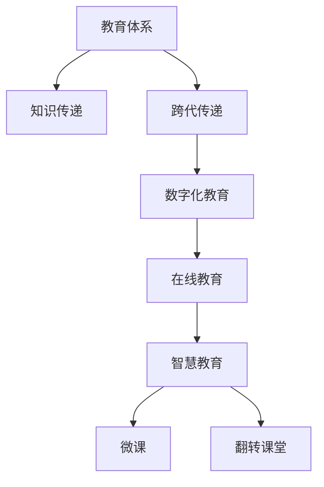

                 

# 知识的跨代传递：教育体系的演进

## 1. 背景介绍

### 1.1 问题由来

在全球范围内，教育体系一直处于不断演进之中。随着信息技术的飞速发展和知识经济的崛起，传统的教育模式面临着巨大挑战。如何有效地传递知识，促进跨代知识传递，提高教育质量，成为了一个亟待解决的问题。

从古至今，知识传递的方式经历了从口传心授、手抄传阅到数字化传播的转变。现代信息技术的兴起，特别是互联网和数字技术的广泛应用，为知识的跨代传递提供了新的可能。本文将从教育体系演进的角度，探讨如何利用现代信息技术，更高效、更深入地实现知识的跨代传递。

### 1.2 问题核心关键点

教育体系的演进离不开以下几个关键点：

1. **知识传递的效率**：如何在有限的时间内，高效地传递更多知识。
2. **知识传递的效果**：如何提高知识的理解和掌握程度，促进学习者的长期记忆和应用能力。
3. **知识的普适性**：如何让不同背景、不同能力的学习者都能够获取知识。
4. **知识的互动性**：如何利用互动技术，增强学习者的参与感和互动性。
5. **知识的个性化**：如何根据学习者的兴趣和特点，提供个性化、差异化的学习内容。
6. **知识的可持续性**：如何构建知识体系，保证知识的长期传承和更新。

这些关键点共同构成了教育体系演进的核心，而信息技术的应用，则为解决这些问题提供了新的手段和方法。

## 2. 核心概念与联系

### 2.1 核心概念概述

为更好地理解教育体系的演进，本节将介绍几个密切相关的核心概念：

- **教育体系**：指为实现教育目标而设计的一系列教育机构、教育内容、教育方法和教育资源的总和。包括学校、课程、教材、教师等要素。
- **知识传递**：指将知识从一代传递到另一代的过程，包括知识获取、知识理解和知识应用三个阶段。
- **跨代传递**：指将知识从上一代传递给下一代的过程，强调知识的长期传承和更新。
- **数字化教育**：指利用信息技术手段，特别是互联网和数字化工具，进行教育资源和知识的传递和应用。
- **在线教育**：指通过网络平台进行知识传递和教学活动的一种形式。
- **智慧教育**：指利用人工智能和大数据技术，实现教育的智能化、个性化和精细化管理。
- **微课(Micro-Course)**：指以某个知识主题为核心，将教学内容分解成小型、独立、易于管理的单元，通过网络平台进行传播和互动。
- **翻转课堂(Flipped Classroom)**：指将传统的课堂讲授和课后作业的模式翻转过来，让学生在课前通过网络平台进行知识预习和理解，课堂上通过互动和实践进行深入学习和讨论。

这些核心概念之间的逻辑关系可以通过以下Mermaid流程图来展示：



这个流程图展示了几大核心概念之间的联系：

1. 教育体系通过知识传递实现知识的长期传承和更新。
2. 数字化教育、在线教育、智慧教育是实现知识传递的主要手段。
3. 微课和翻转课堂是智慧教育的重要组成部分，进一步提升了知识传递的效率和效果。

## 3. 核心算法原理 & 具体操作步骤

### 3.1 算法原理概述

知识的跨代传递，本质上是一个信息处理和知识积累的过程。其核心思想是通过信息技术手段，将知识从上一代高效、准确地传递到下一代，确保知识能够被广泛理解、应用和传承。

形式化地，假设上一代知识为 $K_{\text{上一代}}$，下一代知识为 $K_{\text{下一代}}$，知识传递的过程可以表示为：

$$
K_{\text{下一代}} = f(K_{\text{上一代}}, \text{技术手段}, \text{教育方法})
$$

其中 $f$ 表示知识传递的函数，包括数字化、网络化、互动化等技术手段，以及个性化、差异化的教育方法。

通过上述公式可以看出，知识传递的效果依赖于多个因素，包括技术手段、教育方法、学习者的接受能力等。因此，实现高效的跨代知识传递，需要全面考虑这些因素，并利用现代信息技术进行优化和提升。

### 3.2 算法步骤详解

基于上述原理，知识的跨代传递可以分为以下几个关键步骤：

**Step 1: 准备知识资源**

- 收集和整理上一代的知识资源，包括书籍、文献、视频、音频等。
- 选择合适的数字化工具，如电子书、在线课程、互动平台等。

**Step 2: 设计知识传递路径**

- 根据目标群体的特点，选择合适的知识传递方式，如在线学习、互动教学、微课等。
- 设计知识传递的逻辑框架，包括内容组织、结构安排、互动机制等。

**Step 3: 实现知识传递**

- 利用数字化工具，将知识资源上传至在线平台。
- 设计互动环节，增强学习者的参与感和互动性。

**Step 4: 评估和优化**

- 定期对知识传递效果进行评估，包括学习效果、满意度、知识掌握度等。
- 根据评估结果，不断优化知识传递的内容和方法，提升传递效率和效果。

**Step 5: 持续更新和迭代**

- 定期更新知识资源，加入最新的研究成果和知识更新。
- 利用大数据和人工智能技术，分析学习者的行为数据，提供个性化的学习建议。

### 3.3 算法优缺点

知识传递的数字化、网络化和互动化方法，具有以下优点：

1. **高效性**：通过网络平台进行知识传递，打破了时间和空间的限制，学习者可以随时随地获取知识。
2. **个性化**：利用人工智能和大数据技术，根据学习者的特点和需求，提供个性化的学习内容和方法。
3. **互动性**：通过互动平台，增强学习者的参与感和互动性，提高学习效果。
4. **可扩展性**：数字化和网络化的知识传递方式，可以方便地扩展到全球范围内，服务于更广泛的受众。

同时，这些方法也存在一些缺点：

1. **技术依赖性**：知识传递高度依赖于互联网和数字化工具，技术故障或网络问题可能导致学习中断。
2. **隐私和安全性**：数字化传递方式可能涉及大量的个人信息和数据，需要采取严格的隐私保护和数据安全措施。
3. **学习动力不足**：网络学习需要较强的自律和自我管理能力，部分学习者可能缺乏持续学习的动力。
4. **技术门槛高**：数字化和网络化的学习方式需要一定的技术基础，部分学习者可能存在技术障碍。

尽管存在这些缺点，但总体而言，数字化、网络化和互动化的知识传递方法，是大势所趋，具有广阔的应用前景。

### 3.4 算法应用领域

基于数字化、网络化和互动化的知识传递方法，在多个领域得到了广泛应用，包括但不限于：

1. **在线教育**：如Coursera、edX、Udacity等平台，提供大规模开放在线课程，支持全球范围内学习者的在线学习。
2. **企业培训**：利用在线平台进行员工培训，提供个性化的学习内容和互动环节，提升员工的技能和能力。
3. **远程教育**：在疫情期间，远程教育成为教育体系的重要补充，通过在线平台进行知识传递，保障教育的连续性。
4. **职业认证**：通过在线考试和认证，评估学习者的专业能力和知识掌握程度，提供职业资格认证。
5. **终身学习**：利用网络平台进行终身学习，提供灵活、便捷的学习方式，支持学习者的长期发展。

这些应用领域充分展示了数字化、网络化和互动化知识传递方法的强大潜力，为学习者的知识积累和技能提升提供了新的途径。

## 4. 数学模型和公式 & 详细讲解

### 4.1 数学模型构建

知识的跨代传递过程可以构建如下数学模型：

$$
K_{\text{下一代}} = \sum_{i=1}^n \alpha_i \times f_i(K_{\text{上一代}}, \text{技术手段}, \text{教育方法})
$$

其中 $f_i$ 表示第 $i$ 种知识传递方式，$\alpha_i$ 表示该方式在总知识传递中的权重。

这个模型表示了知识传递的复杂性，需要通过不同的方式和手段，综合考虑技术、教育、学习者等多个因素，才能实现高效的跨代传递。

### 4.2 公式推导过程

假设 $K_{\text{上一代}}$ 包含 $m$ 个知识点，$K_{\text{下一代}}$ 包含 $n$ 个知识点。每个知识点的传递效果可以通过以下公式表示：

$$
\text{传递效果}_i = \beta_i \times \sum_{j=1}^m \gamma_{ij} \times K_{\text{上一代}}_j
$$

其中 $\beta_i$ 表示第 $i$ 种知识传递方式的有效性，$\gamma_{ij}$ 表示第 $j$ 个知识点在第 $i$ 种方式下的传递效率。

将这些公式代入知识传递模型，得：

$$
K_{\text{下一代}} = \sum_{i=1}^n \alpha_i \times \beta_i \times \sum_{j=1}^m \gamma_{ij} \times K_{\text{上一代}}_j
$$

这个公式表明，知识的传递效果由多种因素共同决定，包括知识点的重要性、传递方式的有效性和传递效率。因此，实现高效的跨代传递，需要全面考虑这些因素，并设计合理的传递路径和方式。

### 4.3 案例分析与讲解

以在线教育平台Coursera为例，分析其如何实现高效的知识传递。

Coursera是一个全球性的在线教育平台，提供包括计算机科学、商业管理、数据科学等在内的各类课程。其知识传递过程可以分为以下几个步骤：

1. **课程设计**：Coursera与全球顶尖大学和机构合作，设计高质量的课程内容，涵盖各学科领域的核心知识。
2. **视频和教材上传**：将课程内容以视频和教材的形式上传到平台，供学习者随时获取。
3. **互动环节设计**：在视频和教材中嵌入互动问题、测验和讨论区，增强学习者的参与感和互动性。
4. **评估和反馈**：通过在线测验和作业评估学习者的知识掌握程度，并提供个性化的学习建议和反馈。
5. **持续更新**：定期更新课程内容，加入最新的研究成果和知识更新，保持课程的时效性和前沿性。

通过以上步骤，Coursera实现了高效、个性化的知识传递，促进了跨代知识的高效传承和更新。

## 5. 项目实践：代码实例和详细解释说明

### 5.1 开发环境搭建

在进行知识传递的数字化和网络化实践前，我们需要准备好开发环境。以下是使用Python进行Web应用开发的环境配置流程：

1. 安装Python：从官网下载并安装Python，选择3.8以上版本。
2. 安装Django框架：使用pip命令安装Django框架，创建项目。
3. 安装Web平台所需依赖包：如Flask、SQLAlchemy等。
4. 配置数据库：选择MySQL、PostgreSQL等数据库，进行配置。

完成上述步骤后，即可在Python环境中进行知识传递平台的开发。

### 5.2 源代码详细实现

下面以一个简单的在线学习平台为例，给出其代码实现：

```python
from django.urls import path
from django.shortcuts import render
from .models import Course, Student

def index(request):
    courses = Course.objects.all()
    return render(request, 'index.html', {'courses': courses})

def course_detail(request, course_id):
    course = Course.objects.get(id=course_id)
    students = course.students.all()
    return render(request, 'course_detail.html', {'course': course, 'students': students})

# 学生注册和登录功能
# ...

# 课程上传和发布功能
# ...
```

以上代码展示了如何通过Django框架实现一个简单的在线学习平台。主要包括以下功能：

1. **课程展示**：展示所有课程信息，供学习者选择。
2. **课程详情**：展示单个课程的详细信息，包括课程内容、教师信息、学生反馈等。
3. **学生注册和登录**：实现学生注册和登录功能，跟踪学生学习情况。
4. **课程上传和发布**：教师可以上传课程视频和教材，并发布课程内容。

### 5.3 代码解读与分析

让我们再详细解读一下关键代码的实现细节：

**index函数**：
- 获取所有课程信息，渲染页面并展示。
- 使用Django的model功能，通过 ORM（对象关系映射）获取数据。

**course_detail函数**：
- 获取单个课程信息，并展示该课程的学生反馈。
- 同样使用 ORM 获取数据，通过数据库模型与视图层绑定。

**学生注册和登录功能**：
- 利用Django的认证模块，实现学生注册和登录功能。
- 通过前端页面（如HTML、JavaScript）和后端视图（如views.py）交互，实现用户输入验证和认证功能。

**课程上传和发布功能**：
- 利用Django的上传功能，教师可以上传视频和教材文件。
- 通过数据库模型存储文件信息，并在前端页面展示。
- 教师可以通过后端管理界面发布课程内容，并上传相关资源。

以上代码展示了Django框架的基本用法，通过简单的路由和视图设计，即可实现基本的知识传递功能。开发者可以根据实际需求，进行功能扩展和优化。

## 6. 实际应用场景

### 6.1 智能教育

智能教育是大数据、人工智能和教育技术深度融合的产物，通过数据分析和算法优化，提升教育质量和学习效果。智能教育场景包括：

1. **个性化学习**：根据学习者的兴趣和特点，提供个性化的学习内容和推荐。
2. **智能辅导**：利用人工智能技术，提供智能化的学习辅导和问题解答。
3. **学习分析**：通过大数据分析，评估学习效果，提供个性化的学习建议。

在智能教育中，数字化、网络化和互动化的知识传递方法，可以发挥重要作用。例如，利用智能推荐系统，根据学习者的历史行为数据，提供个性化的课程推荐，提升学习效果。通过智能辅导系统，学习者可以随时获得学习支持，解决学习中的疑难问题。

### 6.2 终身学习

终身学习是现代社会的重要趋势，学习者需要不断更新知识和技能，以适应快速变化的环境。数字化、网络化和互动化的知识传递方法，可以支持终身学习，实现跨代知识的高效传递。

例如，在线学习平台Coursera、edX等，提供了丰富的课程资源，支持学习者随时随地进行学习。通过数字化和网络化的知识传递方式，学习者可以在不同的阶段、不同的环境下，获取新知识，提升自身能力。

### 6.3 企业培训

企业培训是提升员工技能和知识的重要途径。数字化、网络化和互动化的知识传递方法，可以为企业培训提供新的解决方案。

例如，企业可以建立在线培训平台，提供个性化和互动化的培训内容，支持员工的自主学习。通过数据分析和评估，企业可以了解员工的学习情况，提供针对性的培训建议，提升培训效果。

### 6.4 未来应用展望

随着信息技术的发展，知识的跨代传递方式将更加多样化和智能化。未来，我们可以期待以下几个方向：

1. **虚拟现实(VR)和增强现实(AR)**：利用VR和AR技术，提供沉浸式和互动性的学习体验，提升学习效果。
2. **人工智能辅助教学**：通过AI技术，实现智能化的教学和管理，提升教学效率和质量。
3. **跨领域知识整合**：通过知识图谱和大数据技术，实现不同领域知识的整合和融合，形成更加全面的知识体系。
4. **跨代知识共享**：利用社交网络和协作平台，实现不同代际之间的知识共享和交流，促进跨代知识的高效传递。

这些方向展示了知识传递的未来趋势，为学习者的知识积累和技能提升提供了新的途径。

## 7. 工具和资源推荐

### 7.1 学习资源推荐

为了帮助开发者和教育者系统掌握知识的跨代传递技术，这里推荐一些优质的学习资源：

1. **Django官方文档**：提供Django框架的详细教程，帮助开发者快速上手Web应用开发。
2. **Coursera课程**：提供大规模开放在线课程，涵盖各学科领域的核心知识，支持全球范围内学习者的在线学习。
3. **edX平台**：提供高质量的在线课程和专业认证，支持学习者的终身学习和职业发展。
4. **Udacity纳米学位项目**：提供跨学科的在线课程和项目实战，支持学习者的技能提升和职业转型。
5. **Google Coursera联合项目**：利用Google的数据分析技术和工具，提升数据分析和机器学习的学习效果。

通过对这些资源的学习实践，相信你一定能够快速掌握知识传递的关键技术，并用于解决实际的NLP问题。

### 7.2 开发工具推荐

高效的开发离不开优秀的工具支持。以下是几款用于知识传递开发的常用工具：

1. **Django框架**：Python的Web应用框架，提供强大的ORM功能，支持快速开发Web应用。
2. **MySQL数据库**：流行的关系型数据库，支持高效的数据存储和查询。
3. **Flask框架**：Python的轻量级Web应用框架，灵活性高，支持快速开发原型。
4. **SQLAlchemy ORM**：Python的数据库 ORM，支持多数据库兼容，提供便捷的数据操作。
5. **TensorFlow**：Google开发的深度学习框架，支持分布式计算和模型训练。
6. **PyTorch**：Facebook开发的深度学习框架，支持动态计算图和灵活的模型构建。

合理利用这些工具，可以显著提升知识传递任务的开发效率，加快创新迭代的步伐。

### 7.3 相关论文推荐

知识传递的研究源于学界的持续研究。以下是几篇奠基性的相关论文，推荐阅读：

1. **深度学习与教育：智能教育系统的构建**：利用深度学习技术，构建智能教育系统，提升教育质量和效果。
2. **数据驱动的个性化学习**：通过数据分析和机器学习技术，实现个性化学习，提升学习效果。
3. **智能推荐系统的研究进展**：介绍智能推荐系统的最新进展，展示其在大规模数据上的应用效果。
4. **跨代知识共享的机制设计**：研究跨代知识共享的机制和模型，促进知识的跨代传递。
5. **跨领域知识融合的框架**：提出跨领域知识融合的框架和方法，支持不同领域知识的整合和应用。

这些论文代表了大语言模型微调技术的发展脉络。通过学习这些前沿成果，可以帮助研究者把握学科前进方向，激发更多的创新灵感。

## 8. 总结：未来发展趋势与挑战

### 8.1 总结

本文对知识的跨代传递进行了全面系统的介绍。首先阐述了知识传递的效率、效果、普适性、互动性、个性化和可持续性等关键点，明确了知识传递在教育体系演进中的核心地位。其次，从原理到实践，详细讲解了知识传递的数学模型和操作步骤，给出了知识传递任务开发的完整代码实例。同时，本文还广泛探讨了知识传递在智能教育、终身学习、企业培训等多个领域的应用前景，展示了知识传递方法的强大潜力。

通过本文的系统梳理，可以看到，数字化、网络化和互动化的知识传递方法，是大势所趋，具有广阔的应用前景。未来，伴随信息技术的发展和教育体系的演进，知识的跨代传递将迎来新的变革，为学习者的知识积累和技能提升提供新的途径。

### 8.2 未来发展趋势

展望未来，知识的跨代传递将呈现以下几个发展趋势：

1. **技术深度融合**：与大数据、人工智能、物联网等技术深度融合，提升知识传递的效率和效果。
2. **跨代共享和交流**：利用社交网络和协作平台，实现不同代际之间的知识共享和交流，促进跨代知识的高效传递。
3. **终身学习支持**：提供灵活、便捷的学习方式，支持学习者的终身学习和职业发展。
4. **知识图谱整合**：通过知识图谱和大数据技术，实现不同领域知识的整合和融合，形成更加全面的知识体系。
5. **智能辅助教学**：利用人工智能技术，实现智能化的教学和管理，提升教学效率和质量。

这些趋势展示了知识传递的未来方向，为学习者的知识积累和技能提升提供了新的途径。

### 8.3 面临的挑战

尽管知识的跨代传递技术已经取得了一定的进展，但在迈向更加智能化、普适化应用的过程中，仍面临诸多挑战：

1. **技术门槛高**：知识传递方法涉及复杂的算法和工具，对开发者和教育者都有较高的技术要求。
2. **数据隐私和安全**：数字化传递方式涉及大量的个人信息和数据，需要采取严格的隐私保护和数据安全措施。
3. **学习动力不足**：网络学习需要较强的自律和自我管理能力，部分学习者可能缺乏持续学习的动力。
4. **效果评估困难**：知识传递效果难以量化和评估，如何设计合理的评估指标和标准，是重要挑战。
5. **跨代交流障碍**：不同代际之间的语言和认知差异，可能导致知识传递的障碍和误解。

尽管存在这些挑战，但随着技术的发展和社会的进步，相信这些难题终将逐步克服，知识的跨代传递将迎来更加美好的未来。

### 8.4 研究展望

面向未来，知识传递技术需要在以下几个方面寻求新的突破：

1. **跨代交流技术**：开发跨代交流技术，弥合不同代际之间的语言和认知差异，提升跨代知识传递的效果。
2. **个性化学习算法**：利用深度学习和机器学习技术，实现个性化的知识传递和推荐，提升学习效果。
3. **知识图谱技术**：利用知识图谱和大数据技术，实现不同领域知识的整合和应用，形成更加全面的知识体系。
4. **隐私和安全保护**：利用隐私保护技术和数据安全措施，保障知识传递过程中的数据安全和隐私保护。
5. **智能化教育系统**：利用人工智能技术，实现智能化的教育和管理，提升教育质量和学习效果。

这些研究方向将进一步推动知识传递技术的发展，为学习者的知识积累和技能提升提供新的途径。

## 9. 附录：常见问题与解答

**Q1: 知识传递的数字化和网络化方法是否适用于所有教育场景？**

A: 知识传递的数字化和网络化方法在大多数教育场景中都能取得不错的效果，特别是对于远程教育和终身学习等领域。但对于一些需要面对面交流和实践的场景，如实验课、手工课等，数字化传递方式可能存在一定的局限性。因此，需要根据具体教育场景，选择合适的知识传递方式。

**Q2: 如何提高知识传递的互动性？**

A: 提高知识传递的互动性，可以通过以下方法实现：
1. 在课程内容中嵌入互动问题和讨论区，鼓励学习者积极参与。
2. 利用虚拟现实和增强现实技术，提供沉浸式和互动性的学习体验。
3. 利用人工智能技术，提供智能化的学习辅导和问题解答。
4. 利用社交网络和协作平台，促进学习者之间的交流和协作。

**Q3: 如何确保知识传递过程中的数据安全和隐私保护？**

A: 确保知识传递过程中的数据安全和隐私保护，需要采取以下措施：
1. 使用加密技术，对数据进行加密存储和传输，防止数据泄露。
2. 对敏感数据进行匿名化处理，保护用户隐私。
3. 设计合理的访问控制机制，限制数据访问权限。
4. 定期进行数据安全审计，及时发现和修复安全漏洞。

**Q4: 如何设计合理的知识传递效果评估指标？**

A: 设计合理的知识传递效果评估指标，可以从以下几个方面入手：
1. 学习者的知识掌握程度，如考试成绩、作业完成情况等。
2. 学习者的参与度和互动性，如在线互动次数、讨论区活跃度等。
3. 学习者的学习效果，如知识增长率、技能提升程度等。
4. 学习者的满意度，如用户反馈、评价打分等。

通过综合考虑这些指标，可以全面评估知识传递的效果，并及时优化知识传递策略。

**Q5: 如何利用跨代知识共享技术，促进跨代知识的高效传递？**

A: 利用跨代知识共享技术，可以采用以下方法：
1. 建立跨代知识共享平台，提供知识分享和交流的机制。
2. 利用知识图谱和大数据技术，整合不同代际之间的知识，形成知识体系。
3. 设计跨代交流机制，鼓励不同代际之间的知识共享和交流。
4. 利用人工智能技术，自动匹配和推荐合适的跨代知识资源。

通过这些措施，可以充分利用跨代知识共享技术，促进跨代知识的高效传递，提升知识传递的效果和效率。

---

作者：禅与计算机程序设计艺术 / Zen and the Art of Computer Programming

