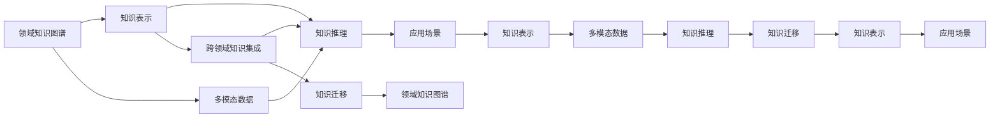

                 

# 知识的跨界整合：创新的催化剂

## 1. 背景介绍

### 1.1 问题由来

在当今信息爆炸的时代，知识无处不在。无论是科学、技术、工程还是艺术，各个领域的知识体系都在飞速发展，不断产生新的理论和应用。然而，这些知识体系之间存在隔阂，彼此难以互通，限制了知识的传播和应用。

在计算机科学领域，跨学科知识整合尤为重要。计算机科学技术的发展，离不开对其他领域知识的借鉴和融合。例如，机器学习算法在自然语言处理、图像识别、推荐系统等领域的成功应用，正是基于对统计学、认知科学、心理学等领域的深刻理解。因此，知识的跨界整合不仅是创新的源泉，更是技术突破的关键。

### 1.2 问题核心关键点

为了实现知识的跨界整合，我们需要关注以下几个关键点：

1. **领域知识的理解**：深入了解特定领域的基本概念、理论和方法，建立对该领域的认知框架。
2. **跨领域数据共享**：构建跨领域的数据共享平台，促进数据流通和协作。
3. **知识表示与转化**：将不同领域的知识表示为统一的格式，便于计算机理解和处理。
4. **多模态知识融合**：利用文本、图像、音频等多模态数据，融合不同领域的信息。
5. **创新应用场景**：将跨界整合的知识应用于新的应用场景，探索创新的解决方案。

通过解决这些问题，我们可以更好地实现知识的跨界整合，推动技术创新和应用发展。

### 1.3 问题研究意义

知识的跨界整合对于技术创新和产业升级具有重要意义：

1. **加速技术发展**：不同领域的知识相互借鉴，可以加速新技术的形成和发展。
2. **提升应用效果**：将多领域的知识整合应用，可以提升技术系统的性能和效果。
3. **促进学科交叉**：跨界整合的知识可以引发新的研究方向和学科交叉，推动学术和产业界的共同进步。
4. **拓展应用场景**：跨界整合的知识可以应用于更多领域，解决实际问题。

总之，知识的跨界整合不仅是一种技术手段，更是一种创新方法，它将为未来技术发展提供强大的动力。

## 2. 核心概念与联系

### 2.1 核心概念概述

为了深入理解知识的跨界整合，我们需要了解以下核心概念：

1. **知识表示 (Knowledge Representation)**：将知识用形式化的方式表达出来，便于计算机理解和处理。常见的知识表示方法包括逻辑表示、框架表示、语义网络等。

2. **多模态数据 (Multi-modal Data)**：包含不同类型信息的数据，如文本、图像、音频等。多模态数据可以提供更全面、丰富的信息，用于知识整合和推理。

3. **领域知识图谱 (Domain Knowledge Graph)**：将某个领域的知识结构化，表示为图谱形式，便于分析和推理。

4. **知识推理 (Knowledge Reasoning)**：利用逻辑规则和推理引擎，从已知知识推导出新的结论。

5. **跨领域知识集成 (Cross-domain Knowledge Integration)**：将不同领域的信息进行整合，建立统一的知识体系。

6. **知识迁移 (Knowledge Transfer)**：将某个领域的方法和技术迁移到另一个领域，提高新领域的技术水平。

这些概念之间相互关联，共同构成了知识的跨界整合的理论基础。

### 2.2 核心概念原理和架构的 Mermaid 流程图



这张流程图展示了知识的跨界整合的关键流程：

1. 首先，构建领域知识图谱，将特定领域的知识结构化。
2. 将知识用形式化的方式表示出来，用于知识推理和推理引擎的输入。
3. 整合多模态数据，丰富知识的信息量。
4. 利用知识推理，从已知知识推导出新的结论。
5. 通过跨领域知识集成，构建统一的知识体系。
6. 利用知识迁移，将某个领域的方法和技术应用于其他领域。
7. 将整合后的知识应用于新的应用场景，解决实际问题。

## 3. 核心算法原理 & 具体操作步骤

### 3.1 算法原理概述

知识的跨界整合算法可以分为以下几步：

1. **领域知识图谱构建**：对特定领域的知识进行结构化，建立领域知识图谱。
2. **知识表示**：将领域知识表示为形式化的数据结构，便于计算机处理。
3. **多模态数据融合**：整合不同类型的数据，丰富知识表示的信息量。
4. **知识推理**：利用逻辑规则和推理引擎，从已知知识推导出新的结论。
5. **跨领域知识集成**：将不同领域的知识进行整合，构建统一的知识体系。
6. **知识迁移**：将某个领域的方法和技术迁移到其他领域。
7. **应用场景优化**：将整合后的知识应用于新的应用场景，解决实际问题。

### 3.2 算法步骤详解

#### 3.2.1 领域知识图谱构建

1. **定义领域术语和关系**：确定领域内的核心术语和关系，如实体、属性、关系等。
2. **知识抽取和标注**：从文本、图像、音频等数据中抽取领域知识，并对其进行标注。
3. **构建知识图谱**：利用图形数据库或知识管理软件，构建领域知识图谱，将知识结构化表示。

#### 3.2.2 知识表示

1. **形式化表示**：将知识表示为形式化的数据结构，如逻辑表示、框架表示、语义网络等。
2. **知识库设计**：设计知识库的存储结构，包括实体、属性、关系等。
3. **知识推理引擎**：开发知识推理引擎，用于从已知知识推导出新的结论。

#### 3.2.3 多模态数据融合

1. **数据预处理**：对不同类型的数据进行预处理，包括数据清洗、格式转换等。
2. **数据融合**：将不同类型的数据进行融合，整合为统一的数据格式。
3. **特征提取**：提取多模态数据的特征，用于知识推理和表示。

#### 3.2.4 知识推理

1. **逻辑规则设计**：设计逻辑规则，用于知识推理。
2. **推理引擎实现**：开发推理引擎，实现从已知知识推导出新的结论。
3. **结果验证**：验证推理结果的正确性，确保推理过程可靠。

#### 3.2.5 跨领域知识集成

1. **知识对齐**：将不同领域的知识对齐，找到共同点。
2. **知识融合**：将不同领域的知识进行融合，构建统一的知识体系。
3. **知识复用**：复用跨领域知识，提高知识应用效果。

#### 3.2.6 知识迁移

1. **技术迁移**：将某个领域的技术和算法迁移到其他领域，提高新领域的技术水平。
2. **方法迁移**：将某个领域的方法和策略迁移到其他领域，解决实际问题。
3. **知识迁移**：将某个领域的知识迁移到其他领域，提升新领域的知识水平。

#### 3.2.7 应用场景优化

1. **需求分析**：分析应用场景的需求，确定需要整合的知识。
2. **知识适配**：将整合后的知识适配到应用场景中，解决实际问题。
3. **效果评估**：评估知识整合的效果，持续优化和改进。

### 3.3 算法优缺点

#### 3.3.1 优点

1. **知识全面性**：多模态数据融合和跨领域知识集成，使得知识表示更加全面。
2. **推理可靠性**：知识推理和逻辑规则设计，提高了推理结果的可靠性。
3. **应用灵活性**：知识迁移和应用场景优化，使得知识可以灵活应用到不同领域。
4. **系统可扩展性**：知识的跨界整合，使得系统具有更强的可扩展性。

#### 3.3.2 缺点

1. **数据复杂性**：多模态数据的融合和处理，增加了数据处理的复杂性。
2. **知识对齐难度**：不同领域知识之间的对齐和融合，需要大量人工参与和经验。
3. **推理难度**：复杂逻辑规则的设计和推理引擎的实现，增加了推理的难度。
4. **知识迁移风险**：知识迁移可能会引入新的问题，需要持续验证和优化。

### 3.4 算法应用领域

知识的跨界整合在多个领域都有广泛应用：

1. **医疗健康**：整合医学知识、影像信息、患者数据等，构建统一的医疗知识图谱，辅助诊疗决策。
2. **金融科技**：整合市场数据、交易记录、财务报表等，构建金融知识图谱，进行风险分析和投资决策。
3. **智能制造**：整合工程设计、生产数据、设备信息等，构建工业知识图谱，优化生产流程和产品质量。
4. **智慧城市**：整合城市数据、交通信息、环境监测等，构建城市知识图谱，提高城市管理水平。
5. **环境保护**：整合环境数据、地理信息、气候数据等，构建环境知识图谱，支持生态保护和环境治理。

## 4. 数学模型和公式 & 详细讲解

### 4.1 数学模型构建

知识的跨界整合可以建模为知识图谱的形式。知识图谱是一个由节点和边组成的图，节点表示实体或属性，边表示实体之间的关系。

### 4.2 公式推导过程

假设领域知识图谱中的节点表示为 $V$，边表示为 $E$，每条边的权重表示为 $W$，则知识图谱的表示可以用以下公式：

$$G=(V,E,W)$$

其中 $V=\{v_1,v_2,...,v_n\}$ 表示节点集合，$E=\{e_1,e_2,...,e_m\}$ 表示边集合，$W=\{w_1,w_2,...,w_m\}$ 表示边权重集合。

在知识推理中，可以使用图数据库进行查询和推理，常用的查询语言包括 SPARQL 和 Cypher。

### 4.3 案例分析与讲解

以智慧城市为例，知识图谱可以表示为城市数据、交通信息、环境监测等，通过查询和推理，可以实现以下功能：

1. **交通流量预测**：整合交通数据，利用时间序列分析和图数据库，预测未来的交通流量。
2. **环境污染预警**：整合环境数据，利用机器学习和推理引擎，预警环境污染事件。
3. **城市应急管理**：整合公共安全数据，利用图数据库和知识推理，实现城市应急管理。

## 5. 项目实践：代码实例和详细解释说明

### 5.1 开发环境搭建

开发环境搭建如下：

1. **Python环境**：安装 Python 3.7 及以上版本，建议使用 Anaconda 或 Miniconda。
2. **知识图谱库**：安装 RDFlib、Neo4j 等知识图谱库。
3. **数据预处理工具**：安装 Pandas、NumPy、Scikit-learn 等数据处理工具。
4. **机器学习库**：安装 Scikit-learn、TensorFlow、PyTorch 等机器学习库。
5. **可视化工具**：安装 Matplotlib、Seaborn 等数据可视化工具。

### 5.2 源代码详细实现

以下是一个简单的知识图谱构建和查询的 Python 代码示例：

```python
from rdf import Graph
from rdf import Node, Literal

# 创建知识图谱
graph = Graph()

# 添加节点和边
graph.add(Node('城市'), 'type', Node('知识图谱'))
graph.add(Node('交通数据'), 'type', Node('知识图谱'))
graph.add(Node('环境数据'), 'type', Node('知识图谱'))

graph.add(Node('城市'), '数据源', Node('交通数据'))
graph.add(Node('城市'), '数据源', Node('环境数据'))

graph.add(Node('交通数据'), '内容', Literal('交通流量数据'))
graph.add(Node('环境数据'), '内容', Literal('空气质量数据'))

# 查询知识图谱
result = graph.find(Node('城市'), '数据源', Node('交通数据'))
for node in result:
    print(node)
```

### 5.3 代码解读与分析

**RDFlib 库**：用于构建和查询知识图谱。

**知识图谱的表示**：使用 Node、Literal 类表示节点和边，利用图数据库进行查询和推理。

**数据预处理**：将不同类型的数据转化为统一的格式，便于知识图谱的构建和查询。

**知识推理**：通过查询和推理，从已知知识推导出新的结论。

## 6. 实际应用场景

### 6.1 智慧医疗

在智慧医疗领域，知识图谱可以整合医学知识、患者数据、影像信息等，支持临床决策和治疗方案制定。

1. **疾病诊断**：整合医学知识图谱和患者数据，进行疾病诊断和治疗方案推荐。
2. **药物研发**：整合药物信息、临床试验数据、基因信息等，加速新药研发进程。
3. **医疗知识管理**：整合医疗知识库和医学论文，构建统一的知识体系，辅助医生学习和研究。

### 6.2 智能制造

在智能制造领域，知识图谱可以整合工程设计、生产数据、设备信息等，优化生产流程和产品质量。

1. **生产过程优化**：整合生产数据和知识图谱，优化生产过程，提高生产效率。
2. **设备维护管理**：整合设备信息和知识图谱，实现设备维护和故障预测。
3. **质量控制**：整合质量数据和知识图谱，实现质量控制和缺陷检测。

### 6.3 智慧城市

在智慧城市领域，知识图谱可以整合城市数据、交通信息、环境监测等，提高城市管理水平。

1. **交通流量预测**：整合交通数据和知识图谱，预测未来的交通流量，优化交通管理。
2. **环境污染预警**：整合环境数据和知识图谱，预警环境污染事件，支持环境治理。
3. **城市应急管理**：整合公共安全数据和知识图谱，实现城市应急管理。

## 7. 工具和资源推荐

### 7.1 学习资源推荐

1. **《知识图谱与语义网络》**：王振堂著，全面介绍知识图谱的基本概念和应用。
2. **《多模态数据融合技术》**：张华平著，介绍多模态数据的预处理、融合和应用。
3. **《知识推理与逻辑编程》**：Wolfram S. von Claessen 著，介绍知识推理的基本原理和应用。
4. **KDD 论文集**：涵盖知识图谱和知识推理的最新研究成果。

### 7.2 开发工具推荐

1. **RDFlib**：用于构建和查询知识图谱。
2. **Neo4j**：图数据库，支持大规模知识图谱的存储和查询。
3. **Python**：用于数据处理和知识图谱构建。
4. **TensorFlow**：用于机器学习模型的构建和训练。
5. **Matplotlib**：用于数据可视化。

### 7.3 相关论文推荐

1. **《知识图谱：一种将知识整合到计算机系统中的方法》**：Larry B. Lesk著，介绍知识图谱的基本概念和应用。
2. **《多模态数据融合：现状与展望》**：Heng Li 著，介绍多模态数据的融合技术。
3. **《基于知识图谱的智能问答系统》**：Huawei Li 著，介绍知识图谱在智能问答系统中的应用。
4. **《知识推理与逻辑编程》**：Wolfram S. von Claessen 著，介绍知识推理的基本原理和应用。

## 8. 总结：未来发展趋势与挑战

### 8.1 研究成果总结

知识的跨界整合已经成为推动技术创新的重要手段。在多个领域，如智慧医疗、智能制造、智慧城市等，通过知识的跨界整合，实现了系统性能的显著提升和应用效果的显著改善。

### 8.2 未来发展趋势

未来的知识跨界整合将呈现以下趋势：

1. **跨领域知识库的构建**：跨领域知识库的构建将更加全面和准确，涵盖更多领域和知识。
2. **知识推理引擎的优化**：知识推理引擎的优化将更加高效和可靠，支持更复杂的推理任务。
3. **多模态数据融合技术的进步**：多模态数据融合技术将更加成熟和高效，支持更多类型的数据融合。
4. **知识迁移方法的发展**：知识迁移方法将更加多样和高效，支持更多领域的应用。

### 8.3 面临的挑战

尽管知识的跨界整合取得了显著进展，但仍面临诸多挑战：

1. **数据多样性**：不同类型的数据具有不同的特性，整合和融合难度较大。
2. **知识对齐**：不同领域的知识具有不同的表示方式，对齐和融合需要大量人工参与。
3. **推理复杂性**：复杂逻辑规则的设计和推理引擎的实现，增加了推理的难度。
4. **知识迁移风险**：知识迁移可能会引入新的问题，需要持续验证和优化。

### 8.4 研究展望

未来的研究需要在以下几个方面寻求新的突破：

1. **自动化知识图谱构建**：通过自动化技术，加速知识图谱的构建过程，提高知识表示的全面性和准确性。
2. **多模态数据融合技术**：开发更高效的多模态数据融合技术，支持更多类型的数据融合和处理。
3. **知识推理引擎的优化**：优化知识推理引擎，提高推理的效率和准确性。
4. **知识迁移方法的改进**：改进知识迁移方法，支持更多领域的应用，提高迁移效果。

## 9. 附录：常见问题与解答

**Q1：如何构建知识图谱？**

A: 构建知识图谱需要定义领域术语和关系，抽取和标注领域知识，构建知识图谱。可以使用 RDFlib、Neo4j 等工具进行构建和查询。

**Q2：多模态数据如何融合？**

A: 多模态数据融合需要预处理不同类型的数据，整合为统一的数据格式，提取多模态数据的特征，进行数据融合和表示。

**Q3：知识推理如何实现？**

A: 知识推理需要设计逻辑规则和推理引擎，利用知识图谱进行查询和推理，得出新的结论。

**Q4：知识跨界整合有哪些实际应用场景？**

A: 知识跨界整合在智慧医疗、智能制造、智慧城市等众多领域都有广泛应用。

**Q5：未来知识跨界整合的发展趋势是什么？**

A: 未来知识跨界整合将更加全面、高效、可靠，涵盖更多领域和知识，支持更复杂的推理和迁移。

---

作者：禅与计算机程序设计艺术 / Zen and the Art of Computer Programming

