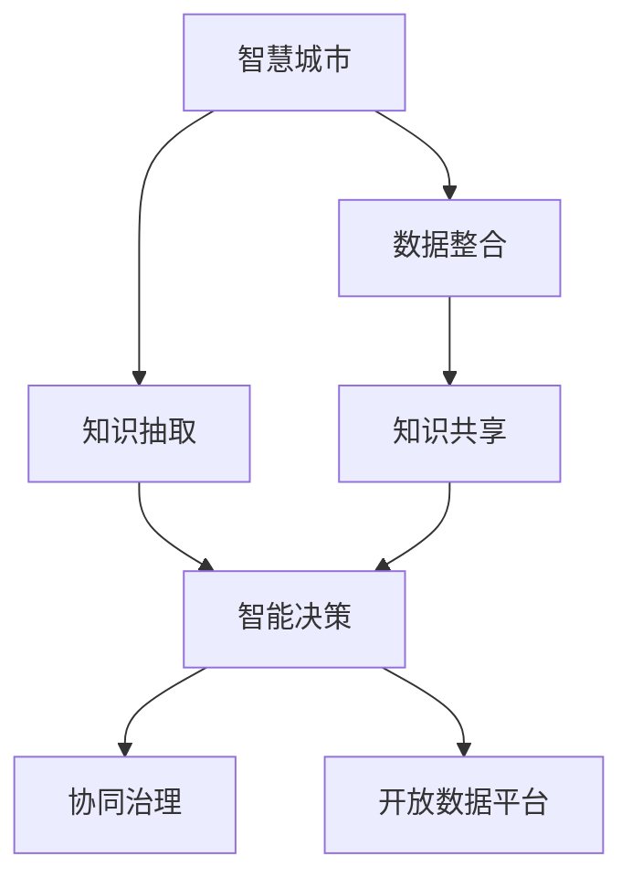

                 

# 知识管理在智慧城市建设中的作用

## 1. 背景介绍

随着信息时代的到来，智慧城市建设成为全球各城市的共同目标。智慧城市不仅涵盖了传统城市管理的数字信息化，更强调数据融合、协同治理、智能决策等方面的创新。在这样的背景下，知识管理在智慧城市建设中扮演了不可或缺的角色。本文将系统探讨知识管理在智慧城市中的作用，从理论到实践，全面展示其深远影响。

### 1.1 问题由来

智慧城市建设的核心在于数据的高效管理和利用，但数据本身不能直接转化为智慧。只有将数据转化为有价值的知识，智慧城市才能真正发挥作用。传统的城市管理依赖于经验积累和人工决策，难以应对快速变化的环境和复杂的系统问题。而知识管理技术的引入，能够提升城市管理的信息化和智能化水平，实现从经验驱动向数据驱动的转变。

### 1.2 问题核心关键点

知识管理的核心是数据与知识的双向转换。通过知识管理，城市管理者可以从海量数据中提取有用的知识，为决策提供支持；同时，通过对已有知识的积累和整理，优化城市管理流程，提升服务质量。

具体来说，知识管理在智慧城市建设中的关键点包括：

1. 数据整合：将来自不同系统、不同部门的数据进行集成，消除信息孤岛。
2. 知识抽取：利用文本挖掘、机器学习等技术，从数据中自动抽取知识，形成结构化信息。
3. 知识共享：通过平台和机制，实现知识在城市各部门间的流通和共享。
4. 智能决策：将知识转化为智能算法，辅助城市管理者做出科学合理的决策。
5. 持续学习：通过数据分析和反馈机制，不断更新和优化知识库。

本文将围绕上述关键点，系统探讨知识管理在智慧城市建设中的作用。

## 2. 核心概念与联系

### 2.1 核心概念概述

智慧城市建设离不开数据的支撑，而知识管理则是提升数据价值的核心手段。本节将介绍几个关键概念：

1. **智慧城市**：基于新一代信息通信技术，整合城市各类数据，实现信息全面感知、资源优化配置、系统协同运行、公众全面参与的新型城市形态。
2. **知识管理**：通过收集、存储、组织、检索、共享、应用知识，提升组织决策效率和创新能力的学科和方法。
3. **数据挖掘**：从原始数据中抽取有用知识和模式的技术，包括分类、聚类、关联规则挖掘等。
4. **智能算法**：通过人工智能技术，如机器学习、深度学习等，实现对知识的自动化分析和应用。
5. **协同治理**：通过多方参与，整合各部门的资源和知识，实现跨部门的协同决策和执行。
6. **开放数据平台**：一个集中、共享的城市数据平台，支持数据的标准化、可视化、分析等。

这些核心概念之间的逻辑关系可以通过以下Mermaid流程图来展示：



这个流程图展示了知识管理在智慧城市建设中的关键流程和组件：

1. 智慧城市建设依赖于数据的整合。
2. 通过数据抽取和智能算法，将数据转化为知识。
3. 共享知识，促进各部门的协同决策。
4. 开放数据平台，支持知识的全生命周期管理。

## 3. 核心算法原理 & 具体操作步骤
### 3.1 算法原理概述

知识管理在智慧城市建设中的基本原理是通过数据挖掘和智能算法，从海量数据中提取和整合知识，转化为可用的智能决策信息。这一过程可以归纳为以下几个步骤：

1. **数据收集**：从城市各类传感器、摄像头、监控系统、社交媒体等渠道获取数据。
2. **数据清洗**：对收集到的数据进行去重、降噪、归一化等预处理。
3. **数据存储**：将清洗后的数据存储在集中化的数据库中，方便后续的分析和应用。
4. **知识抽取**：利用文本挖掘、机器学习等技术，从数据中自动抽取有价值的知识，如事件、趋势、模式等。
5. **知识存储**：将抽取的知识存储在知识库中，便于查询和共享。
6. **知识共享**：通过平台和机制，实现知识在城市各部门间的流通和共享。
7. **智能决策**：将知识转化为智能算法，辅助城市管理者做出科学合理的决策。

### 3.2 算法步骤详解

下面以一个智慧城市中的智能交通管理为例，详细解释知识管理的具体操作步骤：

1. **数据收集**：从交通监控摄像头、传感器、车流量监测设备等处收集实时交通数据，包括车辆位置、速度、流量等信息。

2. **数据清洗**：对采集到的数据进行去重、降噪、异常值处理等操作，确保数据质量。

3. **数据存储**：将清洗后的数据存储在集中化的数据库中，如关系型数据库或NoSQL数据库，方便后续查询和分析。

4. **知识抽取**：利用文本挖掘技术，从交通数据中抽取有用的知识，如交通拥堵情况、事故多发路段、高峰期流量变化等。

5. **知识存储**：将抽取的知识存储在知识库中，如关系型知识库或基于本体的知识库，便于查询和共享。

6. **知识共享**：通过智慧城市开放数据平台，实现交通知识的共享，便于各相关部门调用和使用。

7. **智能决策**：将知识转化为智能算法，如基于规则的推理引擎、深度学习模型等，辅助交通管理部门做出科学合理的决策，如调整交通信号灯、优化交通路线等。

### 3.3 算法优缺点

知识管理在智慧城市建设中具有以下优点：

1. **提升决策效率**：通过知识管理，城市管理者可以更快地获取和利用数据，做出更科学的决策。
2. **优化资源配置**：通过知识抽取和分析，优化资源配置，提高城市运行效率。
3. **促进跨部门协作**：通过知识共享和平台，实现跨部门的协作和协同治理。
4. **提升服务质量**：通过智能决策，提升城市服务的智能化水平，改善居民体验。

同时，知识管理也存在以下局限性：

1. **数据隐私问题**：城市数据涉及居民隐私，如何确保数据安全和隐私保护是一个重要挑战。
2. **技术复杂性**：知识管理涉及数据挖掘、机器学习等复杂技术，需要高水平的技术团队支持。
3. **知识更新**：知识库需要不断更新和维护，确保知识的时效性和准确性。
4. **技术标准**：不同部门、不同系统之间的数据标准不一，整合和共享存在难度。

### 3.4 算法应用领域

知识管理在智慧城市建设中的应用领域广泛，涉及城市管理的各个方面：

1. **交通管理**：通过智能交通系统，实现交通流量的监测、预测和优化。
2. **公共安全**：通过视频监控、社会感知等技术，提升城市公共安全水平。
3. **环境保护**：通过环境监测数据，优化资源配置，提升环境治理效率。
4. **医疗卫生**：通过电子病历、健康数据等，实现医疗资源的优化配置和疾病预测。
5. **教育服务**：通过学习数据，提升教育服务的智能化水平，优化教育资源配置。

## 4. 数学模型和公式 & 详细讲解 & 举例说明

### 4.1 数学模型构建

知识管理涉及多个数学模型的构建，以下以交通流量预测为例，展示数学模型的构建过程。

假设交通流量数据为 $y_i$，影响因素包括天气、节假日、时间等，数学模型可以表示为：

$$
y_i = \alpha + \beta_{\text{weather}} w_{\text{weather},i} + \beta_{\text{holiday}} w_{\text{holiday},i} + \beta_{\text{time}} w_{\text{time},i} + \epsilon_i
$$

其中，$\alpha$ 为截距项，$\beta_{\text{weather}}$、$\beta_{\text{holiday}}$、$\beta_{\text{time}}$ 分别为天气、节假日、时间的系数，$w_{\text{weather},i}$、$w_{\text{holiday},i}$、$w_{\text{time},i}$ 分别为天气、节假日、时间的特征向量，$\epsilon_i$ 为误差项。

### 4.2 公式推导过程

**公式推导**：

1. **线性回归模型**：假设 $y_i$ 与 $x_{i1}$ 到 $x_{in}$ 成线性关系，可表示为 $y_i = \alpha + \sum_{j=1}^{n} \beta_j x_{ij} + \epsilon_i$，其中 $\alpha$ 为截距项，$\beta_j$ 为系数，$x_{ij}$ 为自变量。

2. **最小二乘法**：通过最小化误差平方和 $\sum_{i=1}^{n} (y_i - \hat{y}_i)^2$ 求解系数 $\alpha$ 和 $\beta_j$。

3. **正则化**：为避免过拟合，可引入L2正则项 $\lambda \sum_{j=1}^{n} \beta_j^2$，即 $\hat{\beta}_j = \frac{1}{n\sigma^2} \sum_{i=1}^{n} x_{ij}(y_i - \bar{y}) - \frac{\lambda}{n\sigma^2} \sum_{j=1}^{n} x_{ij}^2$。

4. **模型评估**：通过均方误差 $\frac{1}{n} \sum_{i=1}^{n} (y_i - \hat{y}_i)^2$ 评估模型性能。

**案例分析**：

假设某城市交通流量数据如下：

| 时间 | 天气 | 节假日 | 时间 | 交通流量 |
| --- | --- | --- | --- | --- |
| 6:00 | 晴 | 否 | 周一 | 2000 |
| 8:00 | 晴 | 否 | 周一 | 5000 |
| 10:00 | 晴 | 否 | 周一 | 7000 |
| 12:00 | 晴 | 否 | 周一 | 8000 |
| 14:00 | 晴 | 否 | 周一 | 6000 |
| 16:00 | 晴 | 否 | 周一 | 4000 |
| 18:00 | 晴 | 否 | 周一 | 2000 |
| 6:00 | 晴 | 否 | 周五 | 3000 |
| 8:00 | 晴 | 否 | 周五 | 7000 |
| 10:00 | 晴 | 否 | 周五 | 9000 |
| 12:00 | 晴 | 否 | 周五 | 10000 |
| 14:00 | 晴 | 否 | 周五 | 8000 |
| 16:00 | 晴 | 否 | 周五 | 6000 |
| 18:00 | 晴 | 否 | 周五 | 4000 |

利用上述线性回归模型，可以对交通流量进行预测。首先，将数据标准化，得到标准化后的系数 $\hat{\beta}_j$。然后，利用训练数据 $(x_{ij}, y_i)$ 和测试数据 $(x_{ij}^*, \epsilon_i^*)$，计算预测值 $\hat{y}_i^*$ 并计算误差 $\epsilon_i^*$，最后通过均方误差评估模型性能。

## 5. 项目实践：代码实例和详细解释说明

### 5.1 开发环境搭建

在进行知识管理项目实践前，我们需要准备好开发环境。以下是使用Python进行开发的环境配置流程：

1. 安装Python：根据系统平台，从官网下载并安装Python版本。
2. 安装相关库：
   - 安装Pandas、NumPy、SciPy、Scikit-learn、Matplotlib等数据处理和可视化库。
   - 安装TensorFlow或PyTorch等深度学习库，以便进行机器学习和深度学习任务。
3. 创建虚拟环境：
   - 创建虚拟环境，以避免与其他项目冲突。
   - 激活虚拟环境。

完成上述步骤后，即可在虚拟环境中进行知识管理项目的开发。

### 5.2 源代码详细实现

下面以智慧城市中的交通流量预测为例，给出使用Pandas和Scikit-learn进行知识管理的代码实现。

```python
import pandas as pd
from sklearn.linear_model import LinearRegression
from sklearn.metrics import mean_squared_error

# 读取数据
data = pd.read_csv('traffic_data.csv')

# 数据预处理
X = data[['weather', 'holiday', 'time']]
y = data['traffic_flow']
X_train, X_test, y_train, y_test = train_test_split(X, y, test_size=0.2, random_state=42)

# 建立模型
model = LinearRegression()
model.fit(X_train, y_train)

# 预测并评估
y_pred = model.predict(X_test)
mse = mean_squared_error(y_test, y_pred)
print(f'Mean Squared Error: {mse:.2f}')
```

以上代码展示了从数据预处理、模型训练到预测和评估的完整过程。可以看到，使用Python和Scikit-learn库，可以方便地实现线性回归模型的建立和评估。

### 5.3 代码解读与分析

让我们再详细解读一下关键代码的实现细节：

**数据读取**：使用Pandas库的`read_csv`方法读取数据文件，得到DataFrame对象`data`。

**数据预处理**：通过`train_test_split`方法将数据集划分为训练集和测试集，得到模型训练和预测的数据集。

**模型建立**：使用Scikit-learn库的`LinearRegression`类建立线性回归模型。

**模型训练**：调用`fit`方法，使用训练数据拟合模型。

**模型预测**：使用训练好的模型进行预测，得到测试集上的预测结果。

**模型评估**：使用`mean_squared_error`方法计算均方误差，评估模型性能。

## 6. 实际应用场景

### 6.1 智能交通管理

智能交通管理是智慧城市建设的重要组成部分，通过知识管理，可以实现交通流量的智能预测和优化。

具体来说，可以收集城市交通数据，包括车辆位置、速度、流量等信息。通过数据分析和模型训练，抽取交通流量、交通拥堵等知识，并用于实时监控和决策。例如，当预测到某路段即将发生拥堵时，可以提前调整交通信号灯，优化交通流量。

### 6.2 公共安全监控

智慧城市中的公共安全监控系统，通过视频监控、社会感知等技术，提升城市公共安全水平。

可以收集各类视频数据和公共安全事件信息，通过知识抽取和分析，识别出异常行为和潜在风险。例如，通过图像识别技术，自动识别可疑人员和物品，及时报警。同时，通过知识共享，实现跨部门协作，提升公共安全管理的智能化水平。

### 6.3 环境保护监测

环境保护是智慧城市的重要目标，通过知识管理，可以实现环境数据的智能化监测和管理。

可以收集环境监测数据，包括空气质量、水质、噪音等。通过数据分析和模型训练，抽取环境污染趋势、污染源等信息，用于环境治理和预测。例如，通过机器学习模型，预测空气质量指数变化，提前采取应对措施，保护居民健康。

### 6.4 未来应用展望

随着技术的发展，知识管理在智慧城市中的应用将更加广泛和深入。

1. **多源数据融合**：将城市各系统、各部门的数据进行整合，形成统一的知识库，实现数据的全生命周期管理。
2. **实时决策支持**：利用实时数据流和智能算法，提供实时的决策支持，提升城市治理的灵活性和敏捷性。
3. **跨部门协同**：通过知识共享和平台，实现跨部门、跨系统的协同治理，提高城市管理效率。
4. **智能推荐系统**：结合用户行为数据和知识库，实现智能推荐，提升用户体验和服务质量。
5. **数据分析和可视化**：通过数据分析和可视化技术，直观展示城市运行状态和趋势，支持科学决策。

## 7. 工具和资源推荐

### 7.1 学习资源推荐

为了帮助开发者系统掌握知识管理在智慧城市中的应用，以下是一些优质的学习资源：

1. **《知识管理理论与实践》**：系统介绍知识管理的理论、方法和应用，适合初学者和进阶者。
2. **Coursera《智慧城市与数据科学》课程**：由知名大学教授和实践专家授课，涵盖智慧城市建设中的数据管理、知识抽取、智能决策等内容。
3. **Kaggle数据科学竞赛平台**：通过参与智慧城市相关竞赛，实践数据处理、模型训练、知识抽取等技能。
4. **Google Cloud AI平台**：提供丰富的AI工具和资源，支持知识管理项目开发和部署。

### 7.2 开发工具推荐

以下是几款常用的知识管理项目开发工具：

1. **Python**：功能强大、社区活跃，适合数据处理、机器学习和深度学习任务。
2. **Pandas**：数据处理和分析库，支持数据清洗、数据可视化等。
3. **Scikit-learn**：机器学习库，支持各类算法和模型训练。
4. **TensorFlow**：深度学习库，支持复杂模型的构建和训练。
5. **Jupyter Notebook**：交互式编程环境，支持数据分析和模型训练的可视化展示。

### 7.3 相关论文推荐

知识管理在智慧城市中的应用涉及多个研究方向，以下是几篇奠基性的相关论文，推荐阅读：

1. **《智慧城市的知识管理与数据融合》**：提出基于知识图谱的智慧城市数据融合方法，提高数据质量和可用性。
2. **《智能交通系统中的知识抽取与智能决策》**：研究交通流量预测和智能决策算法，提升交通管理效率。
3. **《智慧城市中的知识共享与协同治理》**：探讨跨部门知识共享和协同治理机制，提高城市管理效率。
4. **《城市公共安全中的知识抽取与智能监控》**：研究视频监控和图像识别技术，提升公共安全管理水平。

## 8. 总结：未来发展趋势与挑战

### 8.1 总结

本文系统探讨了知识管理在智慧城市建设中的作用，从理论到实践，全面展示了其深远影响。知识管理通过数据挖掘和智能算法，从海量数据中提取和整合知识，转化为可用的智能决策信息，是智慧城市建设的重要支撑。

### 8.2 未来发展趋势

展望未来，知识管理在智慧城市中的应用将呈现以下几个发展趋势：

1. **数据融合与互操作**：将城市各系统、各部门的数据进行整合，形成统一的知识库，实现数据的全生命周期管理。
2. **实时决策支持**：利用实时数据流和智能算法，提供实时的决策支持，提升城市治理的灵活性和敏捷性。
3. **跨部门协同**：通过知识共享和平台，实现跨部门、跨系统的协同治理，提高城市管理效率。
4. **智能推荐系统**：结合用户行为数据和知识库，实现智能推荐，提升用户体验和服务质量。
5. **数据分析与可视化**：通过数据分析和可视化技术，直观展示城市运行状态和趋势，支持科学决策。

### 8.3 面临的挑战

尽管知识管理在智慧城市中的应用前景广阔，但在实践中也面临诸多挑战：

1. **数据隐私与安全**：城市数据涉及居民隐私，如何确保数据安全和隐私保护是一个重要挑战。
2. **技术复杂性**：知识管理涉及数据挖掘、机器学习等复杂技术，需要高水平的技术团队支持。
3. **知识更新**：知识库需要不断更新和维护，确保知识的时效性和准确性。
4. **技术标准**：不同部门、不同系统之间的数据标准不一，整合和共享存在难度。

### 8.4 研究展望

未来的研究需要在以下几个方面寻求新的突破：

1. **跨领域知识融合**：将不同领域的知识进行整合，提升智慧城市的综合治理能力。
2. **智能算法创新**：开发更加智能化的算法，提升数据挖掘和知识抽取的精度和效率。
3. **隐私保护技术**：研究隐私保护技术，确保数据安全和隐私保护。
4. **用户参与机制**：通过用户反馈和参与，提升智慧城市管理的透明度和可信度。

这些研究方向将引领知识管理在智慧城市中的应用，为城市管理智能化、智慧化提供更多可能性。

## 9. 附录：常见问题与解答

**Q1：知识管理在智慧城市建设中扮演什么角色？**

A: 知识管理通过数据挖掘和智能算法，从海量数据中提取和整合知识，转化为可用的智能决策信息，是智慧城市建设的重要支撑。

**Q2：知识管理的难点是什么？**

A: 知识管理的难点在于数据隐私保护、技术复杂性、知识更新和技术标准等方面。

**Q3：知识管理在智慧城市中的应用场景有哪些？**

A: 知识管理在智慧城市中的应用场景包括智能交通管理、公共安全监控、环境保护监测等。

**Q4：如何实现跨部门知识共享？**

A: 通过智慧城市开放数据平台，实现跨部门的知识共享，便于各相关部门调用和使用。

**Q5：知识管理未来有哪些发展方向？**

A: 未来知识管理的发展方向包括跨领域知识融合、智能算法创新、隐私保护技术等。

---

作者：禅与计算机程序设计艺术 / Zen and the Art of Computer Programming

