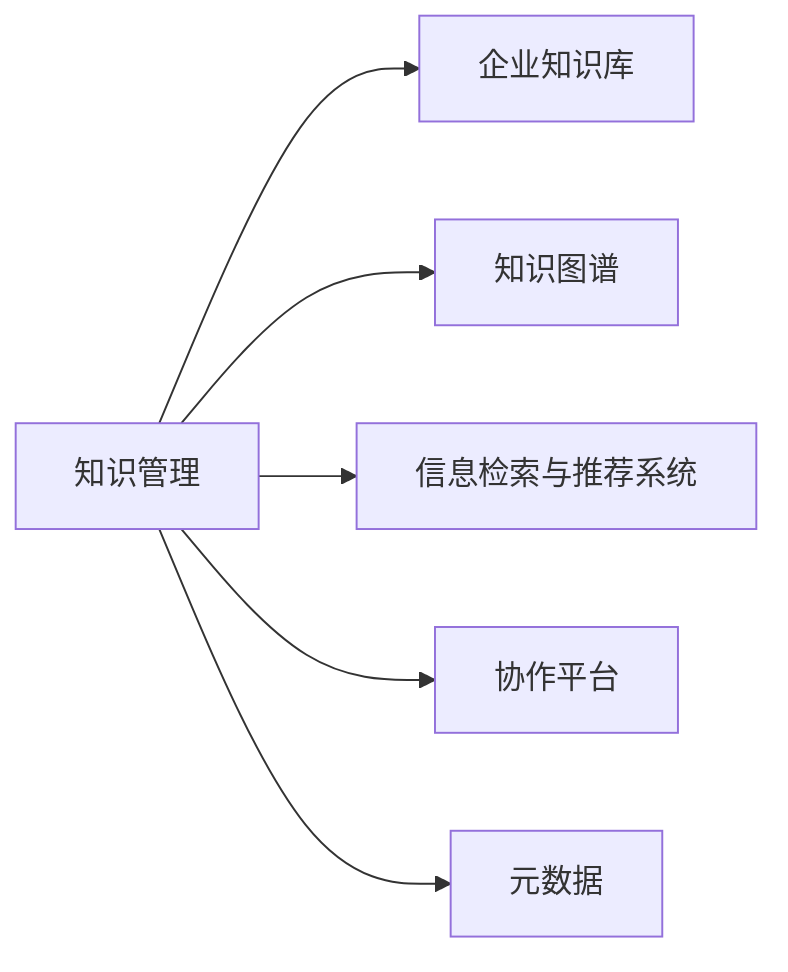

                 

# 知识管理：如何有效利用组织智慧

## 1. 背景介绍

### 1.1 问题由来
随着信息技术的高速发展和全球化进程的加快，知识管理（Knowledge Management, KM）已成为企业发展不可或缺的一环。在知识经济时代，企业不再仅仅是基于资本和劳动力进行竞争，而是越来越多地依赖于对知识资源的管理与利用。如何有效整合和利用组织内部的知识资产，提升员工能力，加速决策制定，成为企业不断探索和创新的重要议题。

知识管理的目标是通过集成企业的内部和外部知识资源，促进知识共享，加速知识的创造、传播和应用，从而提升企业的创新能力、竞争力及整体绩效。然而，在实际操作中，企业往往面临着知识分布不均、知识编码困难、知识孤岛等问题，导致知识管理效果不尽如人意。本文将详细探讨如何通过技术手段有效整合和利用组织智慧，为企业带来竞争优势。

### 1.2 问题核心关键点
本文聚焦于以下几个关键点：
- **知识源的多样性与复杂性**：组织内部知识通常来自多个渠道，包括内部员工的经验、外部的文献、技术文档等。如何高效整合这些知识，形成统一的视图，是知识管理的首要任务。
- **知识编码与共享**：将非结构化知识编码为结构化数据，并进行有效传播和共享，是知识管理的核心挑战。
- **知识应用与转化**：通过智能工具和系统，将知识转化为具体的行动和决策，是知识管理的目标所在。
- **知识迭代与更新**：企业知识库需要不断更新以适应外部环境的变化和内部的动态需求，如何实现知识的持续更新和迭代是关键。
- **知识安全与隐私保护**：在知识管理过程中，需要确保知识的安全性和隐私保护，防止敏感信息泄露。

这些核心问题驱动了本文对知识管理技术及应用的全面探讨，旨在为企业提供实用且可操作的指导。

## 2. 核心概念与联系

### 2.1 核心概念概述

为更好地理解知识管理的全貌，本节将介绍几个核心概念及其相互关系：

- **知识管理(KM)**：通过有组织的方法，识别、获取、整理、存储、共享、使用和更新知识，以实现企业目标的循环过程。
- **企业知识库(Enterprise Knowledge Base)**：存储和检索企业知识的系统平台，通常包含文档、数据、案例、专家信息等。
- **知识图谱(Knowledge Graph)**：将知识以图形结构化的方式存储和呈现，便于查询和推理。
- **信息检索与推荐系统(IR & RS)**：通过算法推荐信息给用户，提高信息查找的效率和准确性。
- **协作平台(Collaboration Platform)**：支持企业员工之间互动、交流和协作的工具，促进知识共享。
- **元数据(Metadata)**：描述数据属性的信息，如数据类型、来源、更新时间等，帮助管理和检索。

这些概念之间的联系可以通过以下Mermaid流程图来展示：



该图展示了知识管理的多维构成：
- 从A到B：通过知识库存储和检索企业知识。
- 从A到C：使用知识图谱构建知识结构，便于查询和推理。
- 从A到D：应用信息检索与推荐系统提高信息检索效率。
- 从A到E：通过协作平台促进知识共享和交流。
- 从A到F：元数据支持知识的结构化和管理。

这些核心概念共同构成了知识管理的核心框架，有助于企业全面整合和利用组织内部的知识资源。

## 3. 核心算法原理 & 具体操作步骤

### 3.1 算法原理概述

知识管理系统的核心在于知识的整合、存储、检索与共享。在技术实现上，通常通过构建知识图谱、设计信息检索与推荐算法、实施协作平台和元数据管理等关键技术手段，实现知识的有效利用。以下详细阐述这些技术的原理与实施步骤。

### 3.2 算法步骤详解

#### 3.2.1 知识图谱构建
**步骤1**：数据收集与清洗
- 从企业内部系统、文档、文档管理系统、ERP系统等处收集知识源数据，如邮件、文档、笔记等。
- 清洗数据，去除重复、无关的信息，保证数据质量。

**步骤2**：数据解析与实体抽取
- 使用NLP技术解析文本，抽取命名实体、关系等关键信息。
- 采用规则或机器学习算法，识别文本中的实体及它们之间的关系。

**步骤3**：构建知识图谱
- 将抽取的实体和关系映射到知识图谱中的节点和边，形成图形结构。
- 使用图数据库存储知识图谱，支持快速查询和推理。

#### 3.2.2 信息检索与推荐算法
**步骤1**：构建索引
- 对知识库中的文本数据进行分词、向量化等预处理。
- 使用倒排索引、向量空间模型等构建索引结构。

**步骤2**：相似性计算
- 采用余弦相似度、Jaccard系数、编辑距离等算法计算文档之间的相似性。
- 引入词嵌入技术，捕捉词汇的语义信息，提升相似性计算的准确性。

**步骤3**：推荐算法
- 基于相似性计算结果，应用KNN、协同过滤、深度学习推荐算法等生成推荐列表。
- 引入用户反馈机制，优化推荐算法，提升用户满意度。

#### 3.2.3 协作平台设计与实施
**步骤1**：平台功能设计
- 设计协作平台的基本功能，如消息沟通、文档共享、项目管理等。
- 引入插件机制，支持第三方应用集成。

**步骤2**：用户界面开发
- 开发直观易用的用户界面，支持PC、移动端访问。
- 采用响应式设计，保证在不同设备上的良好体验。

**步骤3**：数据集成与同步
- 集成企业现有的系统（如ERP、CRM、HR等），实现数据自动同步。
- 使用ETL工具，实现数据导入与导出。

#### 3.2.4 元数据管理
**步骤1**：定义元数据标准
- 定义元数据规范，如数据类型、单位、范围、更新时间等。
- 采用RDF、RDBMS等标准格式存储元数据。

**步骤2**：元数据采集
- 自动采集和标注知识库中的元数据信息。
- 通过人工审核，保证元数据质量。

**步骤3**：元数据查询与更新
- 提供元数据查询接口，支持快速检索和更新。
- 引入版本控制机制，确保元数据的历史追踪。

### 3.3 算法优缺点

知识管理系统的构建涉及多种技术手段，各有其优缺点：

- **知识图谱**
  - **优点**：支持复杂关系的建模与查询，便于知识的推理与发现。
  - **缺点**：构建复杂，对数据质量要求高，存储与查询开销大。
  
- **信息检索与推荐算法**
  - **优点**：高效支持信息检索与推荐，提升用户查找与使用知识的能力。
  - **缺点**：依赖高质量的索引与算法模型，对数据规模要求高。
  
- **协作平台**
  - **优点**：促进知识交流与协作，增强团队凝聚力。
  - **缺点**：需投入大量人力维护，易受企业文化影响。
  
- **元数据管理**
  - **优点**：确保数据的结构化与可管理性，便于检索与更新。
  - **缺点**：管理复杂，需定义标准化元数据规范。

### 3.4 算法应用领域

知识管理技术已在多个行业领域得到了广泛应用：

- **医疗健康**：构建医学知识库，支持医生查询诊断，优化治疗方案。
- **金融服务**：集成市场、财务、风险等数据，辅助决策分析，提升业务效率。
- **教育培训**：建立课程与案例库，促进知识共享，优化教学设计。
- **制造业**：管理工艺、设备、材料等知识，优化生产流程，提升产品质量。
- **公共管理**：整合政策、法规、案例等知识，支持政府决策，提升公共服务水平。
- **研发创新**：集成技术、文献、专利等知识，加速产品开发与创新。

## 4. 数学模型和公式 & 详细讲解 & 举例说明

### 4.1 数学模型构建

知识管理系统的核心数学模型涉及信息检索、推荐、知识推理等多个方面。以下是几个关键模型的构建方法：

- **向量空间模型(VSM)**
  - 定义：将文本表示为向量，基于向量之间的余弦相似度计算文档的相似性。
  - 公式：$$\cos(\theta) = \frac{\vec{u} \cdot \vec{v}}{\lVert \vec{u} \rVert \cdot \lVert \vec{v} \rVert}$$

- **协同过滤算法**
  - 定义：通过用户的历史行为数据，预测用户对未评价项目的评分，推荐相似项目。
  - 公式：$$\hat{r}_{ui} = \frac{\sum_{j \in \mathcal{N}(u)} r_{uj} \cdot p_{ij}}{\sum_{j \in \mathcal{N}(u)} p_{ij}}$$
  
- **深度学习推荐模型**
  - 定义：使用深度神经网络模型，对用户行为和物品属性进行建模，生成推荐结果。
  - 公式：$$\hat{y} = W \cdot \sigma(B \cdot x + C)$$

### 4.2 公式推导过程

以向量空间模型为例，推导文档相似性的计算公式：

假设文本$D_i$和$D_j$的词向量表示分别为$\vec{u}$和$\vec{v}$，则余弦相似度为：

$$\cos(\theta) = \frac{\vec{u} \cdot \vec{v}}{\lVert \vec{u} \rVert \cdot \lVert \vec{v} \rVert} = \frac{\sum_{i} u_i \cdot v_i}{\sqrt{\sum_{i} u_i^2} \cdot \sqrt{\sum_{i} v_i^2}}$$

其中，$u_i$和$v_i$为词向量在$i$维的取值，$\vec{u}$和$\vec{v}$的长度分别为$\lVert \vec{u} \rVert$和$\lVert \vec{v} \rVert$。

### 4.3 案例分析与讲解

以构建医疗知识图谱为例，分析其具体实现过程：

**步骤1**：数据收集与清洗
- 从医院电子病历、科研文献、医学百科等处收集医学数据。
- 清洗数据，去除无关信息，如患者隐私、重复病历等。

**步骤2**：数据解析与实体抽取
- 使用NLP技术解析文本，抽取疾病、药物、症状等实体。
- 识别文本中的关系，如“患”、“用”等，构建实体关系图。

**步骤3**：构建知识图谱
- 将抽取的实体和关系映射到知识图谱中的节点和边。
- 使用图数据库存储知识图谱，如Neo4j、ArangoDB等。

**步骤4**：知识推理与查询
- 定义医学规则和推理逻辑，如疾病传播路径、药物相互作用等。
- 使用图数据库的查询语言（如Cypher），实现复杂的推理与查询。

## 5. 项目实践：代码实例和详细解释说明

### 5.1 开发环境搭建

在进行知识管理系统的开发前，需要准备好开发环境。以下是使用Python进行Elasticsearch、Flask、Django等工具开发的知识管理系统的环境配置流程：

1. 安装Anaconda：从官网下载并安装Anaconda，用于创建独立的Python环境。

2. 创建并激活虚拟环境：
```bash
conda create -n km-env python=3.8 
conda activate km-env
```

3. 安装必要的工具包：
```bash
pip install elasticsearch flask django
```

4. 安装代码生成工具：
```bash
pip install django-rest-framework
```

完成上述步骤后，即可在`km-env`环境中开始知识管理系统的开发。

### 5.2 源代码详细实现

我们以Elasticsearch作为知识库的构建工具，Flask和Django作为协作平台的开发框架，设计一个简单的知识管理系统。

**Elasticsearch配置**

```python
from elasticsearch import Elasticsearch

es = Elasticsearch(['localhost:9200'])
```

**Flask接口设计**

```python
from flask import Flask, jsonify, request

app = Flask(__name__)

@app.route('/knowledge', methods=['GET'])
def get_knowledge():
    query = request.args.get('query')
    results = es.search(index='knowledge', body={
        'query': {
            'match': {'content': query}
        }
    })
    return jsonify(results)

if __name__ == '__main__':
    app.run(debug=True)
```

**Django用户界面**

```python
from django.urls import path
from . import views

urlpatterns = [
    path('knowledge/', views.get_knowledge, name='knowledge'),
]
```

### 5.3 代码解读与分析

以上代码展示了知识管理系统的主要功能模块：

**Elasticsearch配置**
- 使用Python的Elasticsearch模块连接本地Elasticsearch服务器。

**Flask接口设计**
- 设计一个GET请求的路由，用于从Elasticsearch中检索知识。
- 根据用户输入的查询词，构建Elasticsearch的查询体，并返回结果。

**Django用户界面**
- 配置Django的路由，将用户输入的查询词传递给Flask接口。
- 返回Flask接口的JSON响应，展示搜索结果。

可以看到，通过Python的Elasticsearch、Flask、Django等工具，我们可以快速构建一个简单的知识管理系统，实现基本的知识检索功能。

### 5.4 运行结果展示

在上述开发环境中，启动Flask应用，即可访问http://localhost:5000/knowledge/?query=疾病名称，获取与该疾病相关的知识信息。

## 6. 实际应用场景

### 6.1 智慧医疗

智慧医疗领域，知识管理技术可以帮助医生快速查找医学知识、临床指南、病例分析等信息，辅助诊断和治疗。例如，医生可以通过知识图谱查询患者的疾病历程、药物相互作用等信息，制定更合理的治疗方案。

### 6.2 金融风险管理

金融领域，知识管理技术可以集成市场数据、财经报告、专家分析等信息，辅助风险评估和管理。例如，通过知识图谱分析宏观经济趋势和市场风险，实时调整投资策略，避免潜在风险。

### 6.3 企业知识共享

企业知识共享平台，可以通过知识图谱和协作工具，将员工的经验、项目文档、技术文档等知识资源整合起来，促进知识共享和传播。例如，技术团队可以通过知识图谱查询历史项目文档，加速新项目开发。

### 6.4 智能教育

智能教育领域，知识管理技术可以构建课程与案例库，提供个性化学习推荐。例如，智能教育系统可以根据学生的学习进度和兴趣，推荐相关课程和案例，提高学习效果。

### 6.5 公共决策支持

公共管理领域，知识管理技术可以集成政策法规、案例分析、专家咨询等信息，支持政府决策。例如，智能政府系统可以根据政策变化和历史案例，推荐相关法规和政策，辅助政府制定科学决策。

## 7. 工具和资源推荐

### 7.1 学习资源推荐

为了帮助开发者系统掌握知识管理的理论基础和实践技巧，这里推荐一些优质的学习资源：

1. **《知识管理的艺术与科学》**：介绍了知识管理的原理、技术和工具，适合初学者和进阶者。
2. **《Elasticsearch权威指南》**：详细讲解了Elasticsearch的配置、使用和优化技巧，是知识库开发必备资源。
3. **《Flask Web开发实战》**：涵盖Flask的配置、路由、模板等核心内容，适合Flask开发入门。
4. **《Django Web开发实战》**：介绍Django的配置、模板、表单等核心功能，适合Django开发入门。
5. **Coursera《数据科学导论》**：涵盖数据采集、数据清洗、数据可视化等知识管理相关内容，适合系统学习。

通过对这些资源的学习实践，相信你一定能够快速掌握知识管理的精髓，并用于解决实际的业务问题。

### 7.2 开发工具推荐

高效的开发离不开优秀的工具支持。以下是几款用于知识管理开发的常用工具：

1. **Elasticsearch**：高扩展性的分布式搜索和分析引擎，支持大规模数据存储和查询。
2. **Flask**：轻量级的Python Web框架，易于上手和扩展，适合快速开发Web应用。
3. **Django**：功能强大的Python Web框架，支持高效的模型设计和视图处理。
4. **Apache Kafka**：高吞吐量的分布式流处理系统，支持实时数据采集与传输。
5. **Apache Flink**：高性能的流处理框架，支持大规模数据实时计算和分析。
6. **Git**：版本控制系统，支持代码版本管理与协作。
7. **JIRA**：项目管理工具，支持任务分配、进度跟踪等功能。

合理利用这些工具，可以显著提升知识管理系统的开发效率，加速创新迭代的步伐。

### 7.3 相关论文推荐

知识管理技术的发展源于学界的持续研究。以下是几篇奠基性的相关论文，推荐阅读：

1. **《知识管理综述与未来展望》**：总结了知识管理的理论和实践，展望了未来的研究方向。
2. **《Elasticsearch核心技术》**：详细讲解了Elasticsearch的核心原理和技术细节。
3. **《Flask实战》**：介绍了Flask的核心功能和开发技巧，适合Flask开发入门。
4. **《Django实战》**：涵盖Django的核心功能和开发技巧，适合Django开发入门。
5. **《智能数据管理》**：探讨了智能数据管理的方法和技术，适合数据科学领域的研究。

这些论文代表了大数据和知识管理技术的发展脉络，通过学习这些前沿成果，可以帮助研究者把握学科前进方向，激发更多的创新灵感。

## 8. 总结：未来发展趋势与挑战

### 8.1 总结

本文对知识管理技术及其实现方法进行了全面系统的介绍。首先阐述了知识管理的背景与核心问题，明确了知识管理对企业的重要性和必要性。其次，从原理到实践，详细讲解了知识管理的数学模型和操作步骤，给出了知识管理系统的完整代码实例。同时，本文还探讨了知识管理技术在智慧医疗、金融服务、企业知识共享等多个领域的实际应用，展示了知识管理技术的广泛价值。最后，本文精选了知识管理的各类学习资源，力求为读者提供全方位的技术指引。

通过本文的系统梳理，可以看到，知识管理技术已经成为企业信息化建设的重要组成部分，在促进知识共享、加速决策制定、提升创新能力等方面发挥着重要作用。未来，伴随技术的持续演进和应用的不断深入，知识管理技术必将在更多领域发挥出更大的作用，推动企业向智能化、数字化方向迈进。

### 8.2 未来发展趋势

展望未来，知识管理技术将呈现以下几个发展趋势：

1. **知识图谱的普及应用**：知识图谱将成为企业知识管理的标配，支持复杂关系的建模与查询，提升知识推理和应用的能力。
2. **协作平台的智能优化**：通过AI技术，协作平台将更加智能，自动推荐内容，提升知识共享的效率和效果。
3. **元数据管理的自动化**：元数据采集、管理和应用将自动化程度更高，减少人工干预，提升知识管理的可操作性。
4. **跨领域知识融合**：知识管理将更加注重跨领域的知识融合，整合不同模态的知识资源，增强知识的综合性。
5. **实时知识更新**：知识管理将更加注重实时性，通过实时数据流处理技术，实现知识的动态更新和迭代。
6. **知识自动化生成**：通过AI技术，自动生成文档、报告、案例等知识资源，提升知识创造的效率和质量。

这些趋势凸显了知识管理技术的广阔前景，为企业的知识管理和应用提供了新的方向。

### 8.3 面临的挑战

尽管知识管理技术已经取得了长足进展，但在迈向更加智能化、普适化应用的过程中，仍面临诸多挑战：

1. **数据质量的提升**：知识管理依赖于高质量的数据，如何保证数据的完整性、一致性和准确性，是知识管理的首要难题。
2. **跨领域知识的整合**：不同领域的数据格式、结构差异大，如何实现跨领域的知识整合和统一，是一大挑战。
3. **知识获取与传播**：知识获取成本高，知识传播复杂，如何降低知识获取和传播的门槛，需要进一步优化。
4. **知识应用的落地**：知识管理系统的构建和应用需要业务融合，如何实现知识应用与业务目标的对齐，仍需深入研究。
5. **用户采纳与反馈**：知识管理系统需要用户广泛参与，如何激励用户贡献知识和使用系统，并及时获取用户反馈，是系统成功运营的关键。
6. **知识安全和隐私保护**：在知识管理过程中，如何确保知识的安全性和隐私保护，防止敏感信息泄露，是重要的伦理和安全问题。

这些挑战凸显了知识管理技术的复杂性和综合性，需要多学科协作、多方协同，才能有效解决。

### 8.4 研究展望

面对知识管理面临的挑战，未来的研究需要在以下几个方面寻求新的突破：

1. **知识图谱的自动化构建**：通过AI技术，自动构建知识图谱，降低人工干预，提升构建效率和质量。
2. **跨领域知识的整合方法**：研究跨领域的知识整合方法，实现不同领域知识的统一和融合。
3. **知识获取与传播的新手段**：探索新的知识获取和传播手段，降低知识获取成本，提升知识传播效率。
4. **知识应用的业务融合**：深入研究知识应用与业务目标的对齐方法，实现知识应用的最大化。
5. **用户激励与反馈机制**：设计有效的用户激励与反馈机制，促进用户贡献知识和使用系统。
6. **知识安全与隐私保护**：研究知识安全和隐私保护技术，确保知识管理的可信任性和安全性。

这些研究方向的探索，必将引领知识管理技术迈向更高的台阶，为构建知识驱动的智能企业提供新的技术支撑。

## 9. 附录：常见问题与解答

**Q1：知识管理与信息管理有何区别？**

A: 知识管理侧重于知识的整合、共享与应用，强调知识的深度与广度；而信息管理侧重于信息的收集、存储与检索，主要关注信息的完整性和准确性。

**Q2：如何保证知识图谱的质量？**

A: 知识图谱的质量依赖于数据的质量和构建的算法。通过数据清洗、预处理和人工审核，保证数据的完整性和一致性。同时，使用先进的构建算法，如基于规则、基于知识图谱的自动化构建方法，提升构建效率和质量。

**Q3：如何优化知识图谱的查询性能？**

A: 优化知识图谱的查询性能主要通过索引构建、查询优化和分布式计算等手段实现。使用倒排索引、B+树等数据结构，优化查询算法。引入分布式计算技术，提升查询性能。

**Q4：知识图谱对数据格式的要求有哪些？**

A: 知识图谱对数据格式的要求主要包括以下几点：
- 数据格式规范：采用RDF、JSON等标准格式存储数据。
- 数据格式统一：不同来源的数据需要进行格式转换和统一。
- 数据格式转换：使用ETL工具，进行数据的清洗、转换和加载。

**Q5：知识图谱在企业中的应用场景有哪些？**

A: 知识图谱在企业中的应用场景主要包括以下几个方面：
- 知识检索与推荐：支持用户快速检索和推荐知识。
- 知识推理与发现：支持复杂的知识推理与发现。
- 决策支持：辅助企业决策，优化业务流程。
- 产品研发：支持产品设计和开发，提高研发效率。
- 客户服务：支持客户服务，提升客户满意度。

这些应用场景展示了知识图谱在企业知识管理中的广泛应用。

---

作者：禅与计算机程序设计艺术 / Zen and the Art of Computer Programming

