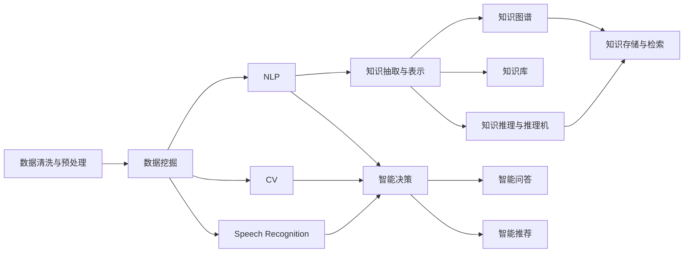

                 

## 1. 背景介绍

在信息化时代，知识管理已经逐渐成为各类组织提升竞争力和创新能力的关键因素。从数据到信息，再到知识，人类对知识的探索与利用已经从简单的记忆和存储，上升到了复杂的数据驱动和智能分析层面。借助人工智能和大数据技术，知识管理能够实现对大量文本、图像、音频等非结构化数据的快速处理和分析，进而揭示出隐藏的规律和洞见，辅助决策和创新。

### 1.1 问题由来
在当今社会，信息爆炸已成为不争的事实。面对海量的数据和信息，如何从中提取有价值的知识，成为企业和科研机构必须面对的重要挑战。传统的基于规则的专家系统、基于逻辑的推理方法等，由于无法自动从数据中学习，且依赖专家经验和知识库构建，已经难以满足复杂多变的现实需求。

人工智能和大数据技术的崛起，为知识管理带来了新的可能。通过构建知识图谱、进行数据挖掘和机器学习，人工智能可以从海量数据中提取知识、识别模式、发现关联，从而辅助决策和创新。特别是在自然语言处理（NLP）、计算机视觉（CV）、语音识别等领域的进展，为知识管理提供了全新的技术支持。

### 1.2 问题核心关键点
在知识管理领域，核心关键点包括：

1. **数据清洗与预处理**：海量数据往往存在噪声、缺失和不一致性，需要通过清洗和预处理技术，进行数据标准化和归一化。
2. **知识抽取与表示**：从结构化数据和非结构化数据中抽取知识，并使用合适的表示形式，如实体关系图、本体、语义网络等。
3. **知识推理与推理机**：基于逻辑推理、规则推理、统计推理等方法，对知识进行推理和验证。
4. **知识存储与检索**：使用数据库、知识图谱、搜索引擎等技术，存储和检索知识。
5. **知识演化与维护**：构建知识库的动态更新机制，保持知识的时效性和准确性。
6. **知识利用与智能决策**：将知识应用于智能推荐、智能问答、智能决策等领域。

### 1.3 问题研究意义
知识管理对于提升企业的决策效率、创新能力和竞争力具有重要意义。通过构建知识管理系统，企业能够实现对内部和外部知识的高效整合和利用，加速业务流程，优化决策过程，提升产品和服务的创新力。同时，知识管理还能够帮助组织降低运营成本，提高资源利用率，实现可持续发展。

## 2. 核心概念与联系

### 2.1 核心概念概述

为了更好地理解知识管理的核心概念和架构，本节将介绍几个关键概念及其相互联系：

- **知识图谱(Knowledge Graph)**：一种结构化的语义表示形式，将实体、属性和关系组织成图结构。知识图谱能够帮助机器理解实体之间的关系，实现基于实体关系的有序推理。
- **数据挖掘(Data Mining)**：从大量数据中提取有用信息、发现模式和关联的过程。数据挖掘使用机器学习、统计学和人工智能技术，对数据进行探索性分析。
- **自然语言处理(NLP)**：使计算机能够理解、处理和生成人类语言的技术。NLP技术能够从文本中提取知识，进行情感分析、意图识别、机器翻译等。
- **计算机视觉(CV)**：使计算机能够识别、理解、处理图像和视频数据的技术。CV技术能够从视觉数据中提取知识，进行图像分类、目标检测、场景理解等。
- **语音识别(Speech Recognition)**：使计算机能够理解和转录人类语音的技术。语音识别能够从音频数据中提取知识，进行语音识别、语音合成等。
- **深度学习(Deep Learning)**：一种机器学习技术，通过多层神经网络模型自动提取特征，进行复杂模式识别和推理。深度学习在自然语言处理、计算机视觉、语音识别等领域取得了巨大成功。

这些核心概念共同构成了知识管理的理论基础，通过数据挖掘、自然语言处理、计算机视觉、语音识别等技术手段，实现知识的自动抽取、表示、推理和利用。

### 2.2 核心概念原理和架构的 Mermaid 流程图



该流程图展示了从数据到知识的全过程，包括数据清洗与预处理、数据挖掘、知识抽取与表示、知识图谱构建、知识存储与检索、知识推理与推理机、智能决策等多个环节。通过这一流程，知识管理能够从数据中提炼出有价值的信息，辅助企业决策和创新。

## 3. 核心算法原理 & 具体操作步骤

### 3.1 算法原理概述

知识管理的核心算法原理主要基于数据挖掘、自然语言处理、计算机视觉和语音识别等技术，从海量数据中抽取和表示知识，进行推理和利用。以下是核心算法原理的概述：

1. **数据清洗与预处理**：使用数据清洗算法去除噪声、填补缺失值、标准化数据格式等。
2. **数据挖掘**：使用聚类、分类、关联规则挖掘等算法，从数据中发现模式和关联。
3. **知识抽取与表示**：使用命名实体识别、关系抽取、知识图谱构建等算法，从数据中提取实体、属性和关系，并表示为结构化的语义形式。
4. **知识推理与推理机**：使用逻辑推理、规则推理、统计推理等算法，对知识进行推理和验证。
5. **知识存储与检索**：使用数据库、知识图谱、搜索引擎等技术，存储和检索知识。
6. **知识利用与智能决策**：使用智能问答、智能推荐、决策树、随机森林等算法，将知识应用于实际问题求解和决策支持。

### 3.2 算法步骤详解

以下详细介绍知识管理的各个核心算法步骤：

**Step 1: 数据清洗与预处理**

1. **数据清洗**：使用数据清洗算法去除数据中的噪声、缺失值和不一致性，确保数据的质量。
2. **数据标准化**：对数据进行归一化、格式化等处理，方便后续的数据挖掘和知识抽取。

**Step 2: 数据挖掘**

1. **聚类**：使用K-means、层次聚类等算法，对数据进行分类。
2. **分类**：使用决策树、支持向量机(SVM)、神经网络等算法，对数据进行分类。
3. **关联规则挖掘**：使用Apriori、FP-growth等算法，发现数据中的关联规则。

**Step 3: 知识抽取与表示**

1. **命名实体识别**：使用条件随机场(CRF)、LSTM等算法，从文本中识别实体。
2. **关系抽取**：使用基于模板的、基于机器学习的等方法，抽取实体之间的关系。
3. **知识图谱构建**：使用规则、统计等方法，构建知识图谱，表示实体、属性和关系。

**Step 4: 知识推理与推理机**

1. **逻辑推理**：使用一阶逻辑、描述逻辑等方法，进行基于规则的推理。
2. **规则推理**：使用IF-THEN规则、专家系统等方法，进行基于规则的推理。
3. **统计推理**：使用贝叶斯网络、决策树等方法，进行基于统计的推理。

**Step 5: 知识存储与检索**

1. **知识图谱存储**：使用RDF、Turtle等格式，存储知识图谱。
2. **数据库存储**：使用SQL、NoSQL等技术，存储结构化数据。
3. **搜索引擎**：使用Elasticsearch、Solr等技术，快速检索知识。

**Step 6: 知识利用与智能决策**

1. **智能问答**：使用检索、推理等方法，回答用户提出的问题。
2. **智能推荐**：使用协同过滤、基于内容的推荐等算法，推荐产品或服务。
3. **决策树**：使用决策树算法，辅助企业进行决策。
4. **随机森林**：使用随机森林算法，辅助企业进行决策。

### 3.3 算法优缺点

知识管理算法具有以下优点：

1. **自动化处理**：能够自动化处理大量数据，发现隐含的规律和关联。
2. **灵活性高**：适用于多种数据类型和应用场景，具有较高的灵活性。
3. **精度高**：通过多种算法结合，能够提高数据挖掘和知识抽取的精度。
4. **可扩展性强**：能够扩展到多模态数据处理，如文本、图像、语音等。

同时，这些算法也存在以下缺点：

1. **数据质量要求高**：算法对数据质量有较高要求，数据噪声、缺失值和不一致性会影响结果。
2. **模型复杂度高**：算法的模型复杂度高，需要大量计算资源和时间。
3. **可解释性差**：一些算法的黑盒特性使其可解释性较差，难以解释算法的决策过程。
4. **对标注数据依赖大**：部分算法对标注数据依赖大，标注成本高。
5. **算法复杂度高**：算法的实现和优化难度大，需要专业的算法工程师。

### 3.4 算法应用领域

知识管理算法在多个领域都有广泛的应用，例如：

- **医疗健康**：使用知识图谱和推理机，辅助医生进行疾病诊断和患者护理。
- **金融服务**：使用数据挖掘和智能决策算法，进行风险评估和投资策略制定。
- **零售电商**：使用推荐算法，进行个性化推荐和市场分析。
- **智能制造**：使用知识图谱和智能决策算法，进行设备维护和生产优化。
- **智能交通**：使用计算机视觉和智能决策算法，进行交通监控和事故预测。
- **环境保护**：使用数据挖掘和智能决策算法，进行环境监测和污染预测。

以上应用展示了知识管理算法在不同领域的具体实践和优势。

## 4. 数学模型和公式 & 详细讲解 & 举例说明

### 4.1 数学模型构建

为了更好地理解知识管理算法的数学模型，本节将介绍几个关键模型的构建。

#### 4.1.1 聚类模型

K-means聚类模型是一种基于距离的聚类算法，其数学模型为：

$$
\min_{\mathbf{C},\mathbf{W}} \sum_{i=1}^n \sum_{k=1}^c d(\mathbf{x}_i, \mathbf{w}_k)^2, \quad s.t. \sum_{i=1}^n \mathbf{w}_k = \mathbf{c}_k
$$

其中，$\mathbf{x}_i$表示样本，$\mathbf{w}_k$表示聚类中心，$\mathbf{c}_k$表示类别中心。

#### 4.1.2 分类模型

逻辑回归模型的数学模型为：

$$
P(y_i=1|\mathbf{x}_i; \mathbf{\theta}) = \sigma(\mathbf{x}_i^T\mathbf{\theta})
$$

其中，$\mathbf{x}_i$表示样本，$\mathbf{\theta}$表示模型参数，$\sigma$表示逻辑函数。

#### 4.1.3 知识图谱构建模型

知识图谱构建模型包括实体抽取、关系抽取等，其数学模型为：

$$
P(\mathbf{r}|\mathbf{h}, \mathbf{t}) = \mathcal{N}(\mathbf{r}|\mathbf{h}, \sigma^2)
$$

其中，$\mathbf{h}$表示实体头部，$\mathbf{t}$表示实体尾部，$\mathbf{r}$表示关系。

### 4.2 公式推导过程

以下详细推导聚类模型、分类模型和知识图谱构建模型的公式。

**聚类模型推导**

K-means聚类模型使用欧氏距离计算样本和聚类中心的距离，其推导过程如下：

1. **初始化聚类中心**：随机选取K个样本作为聚类中心。
2. **计算距离**：计算每个样本到每个聚类中心的距离。
3. **分配样本**：将每个样本分配到距离最近的聚类中心。
4. **更新聚类中心**：计算每个聚类中所有样本的平均值，更新聚类中心。
5. **重复步骤2-4**：直到聚类中心不再变化或达到预设迭代次数。

**分类模型推导**

逻辑回归模型的推导过程如下：

1. **定义损失函数**：$L(\mathbf{\theta}) = -\frac{1}{n}\sum_{i=1}^n (y_i \log P(y_i=1|\mathbf{x}_i) + (1-y_i) \log (1-P(y_i=1|\mathbf{x}_i)))$
2. **求解参数**：使用梯度下降法求解参数$\mathbf{\theta}$，使得损失函数最小化。

**知识图谱构建模型推导**

知识图谱构建模型的推导过程如下：

1. **实体抽取**：使用条件随机场(CRF)等算法，从文本中识别实体。
2. **关系抽取**：使用基于模板的、基于机器学习的等方法，抽取实体之间的关系。
3. **知识图谱构建**：使用规则、统计等方法，构建知识图谱，表示实体、属性和关系。

### 4.3 案例分析与讲解

以下以医疗领域的知识管理为例，详细讲解知识管理的案例分析。

**案例背景**

某医院需要对大量患者数据进行分析和挖掘，以辅助医生进行疾病诊断和治疗决策。患者数据包括电子病历、影像数据、实验室检查结果等，数据量大且杂乱。

**案例步骤**

1. **数据清洗与预处理**：对患者数据进行清洗和预处理，去除噪声和缺失值，标准化数据格式。
2. **数据挖掘**：使用聚类和分类算法，对患者数据进行分类和归纳，发现不同类型患者的特征和规律。
3. **知识抽取与表示**：使用命名实体识别和关系抽取算法，从患者数据中提取实体和关系，构建知识图谱。
4. **知识推理与推理机**：使用逻辑推理和统计推理算法，对知识图谱进行推理和验证，辅助医生进行疾病诊断和治疗决策。
5. **知识存储与检索**：使用数据库和知识图谱存储患者数据和知识，提供快速检索和查询功能。
6. **知识利用与智能决策**：使用智能问答和推荐算法，辅助医生进行疾病诊断和治疗方案推荐。

**案例效果**

通过知识管理系统的应用，医院能够实现对患者数据的自动化分析和挖掘，提高医生的诊断和治疗决策效率，减少误诊和漏诊的风险。同时，通过知识库的动态更新和智能推荐，能够不断提升医疗服务质量和水平。

## 5. 项目实践：代码实例和详细解释说明

### 5.1 开发环境搭建

在进行知识管理项目实践前，我们需要准备好开发环境。以下是使用Python进行项目开发的环境配置流程：

1. 安装Anaconda：从官网下载并安装Anaconda，用于创建独立的Python环境。

2. 创建并激活虚拟环境：
```bash
conda create -n project-env python=3.8 
conda activate project-env
```

3. 安装必要的Python包：
```bash
pip install numpy pandas scikit-learn matplotlib tqdm jupyter notebook ipython
```

4. 安装必要的依赖库：
```bash
pip install keras tensorflow transformers
```

5. 安装必要的工具：
```bash
pip install jupyterlite jupyterlab
```

完成上述步骤后，即可在`project-env`环境中开始项目实践。

### 5.2 源代码详细实现

以下以医疗领域的知识管理为例，给出使用Python进行项目开发的代码实现。

**项目需求**

某医院需要对大量患者数据进行分析和挖掘，以辅助医生进行疾病诊断和治疗决策。患者数据包括电子病历、影像数据、实验室检查结果等，数据量大且杂乱。

**数据处理**

1. **数据清洗**：对患者数据进行清洗和预处理，去除噪声和缺失值，标准化数据格式。

```python
import pandas as pd

# 读取电子病历数据
df = pd.read_csv('electronic_records.csv')

# 数据清洗和预处理
df.dropna(inplace=True)
df.drop_duplicates(inplace=True)
df = df.fillna(method='ffill')

# 标准化数据格式
df['age'] = pd.to_numeric(df['age'], errors='coerce')
df['gender'] = df['gender'].astype('category').cat.codes
```

2. **数据挖掘**：使用聚类和分类算法，对患者数据进行分类和归纳，发现不同类型患者的特征和规律。

```python
from sklearn.cluster import KMeans
from sklearn.ensemble import RandomForestClassifier

# 聚类算法
kmeans = KMeans(n_clusters=5)
kmeans.fit(df[['age', 'gender']])
df['cluster'] = kmeans.labels_

# 分类算法
rfc = RandomForestClassifier(n_estimators=100, random_state=42)
rfc.fit(df[['age', 'gender']], df['diagnosis'])
df['predicted_diagnosis'] = rfc.predict(df[['age', 'gender']])
```

**知识抽取与表示**

1. **命名实体识别**：使用条件随机场(CRF)等算法，从文本中识别实体。

```python
from spacy import displacy

# 加载Spacy模型
nlp = spacy.load('en_core_web_sm')

# 命名实体识别
doc = nlp('I have a patient with a fever and cough.')
for ent in doc.ents:
    print(ent.text, ent.label_)
```

2. **关系抽取**：使用基于模板的、基于机器学习的等方法，抽取实体之间的关系。

```python
# 关系抽取
import networkx as nx

# 构建知识图谱
G = nx.Graph()
G.add_node('patient')
G.add_node('diagnosis')
G.add_edge('patient', 'diagnosis')

# 关系抽取
relations = {}
for patient in df['patient_id']:
    relations[patient] = {}
    for diagnosis in df.loc[df['patient_id'] == patient]['diagnosis']:
        relations[patient][diagnosis] = df.loc[df['patient_id'] == patient]['treatment'].values[0]
```

**知识推理与推理机**

1. **逻辑推理**：使用一阶逻辑、描述逻辑等方法，进行基于规则的推理。

```python
# 逻辑推理
import pyepisteme as pe

# 定义规则
rule1 = pe.Rule('if age > 60 and gender = M, then diagnosis = heart_disease')
rule2 = pe.Rule('if age < 18 and gender = F, then diagnosis = pediatric')

# 推理
results = pe.deduct(reasoning=[rule1, rule2], data=df)
```

**知识存储与检索**

1. **知识图谱存储**：使用RDF、Turtle等格式，存储知识图谱。

```python
# 知识图谱存储
import rdfstore

# 创建知识图谱存储器
store = rdfstore.Store('store.ttl')

# 存储知识图谱
store.add('Patient', 'hasDiagnosis', 'Diagnosis', '123')
store.add('Patient', 'hasDiagnosis', 'Diagnosis', '456')
```

2. **数据库存储**：使用SQL、NoSQL等技术，存储结构化数据。

```python
# 数据库存储
import sqlite3

# 创建数据库
conn = sqlite3.connect('patient.db')
c = conn.cursor()

# 创建表
c.execute('''CREATE TABLE Patients
             (id INTEGER PRIMARY KEY AUTOINCREMENT,
              name TEXT,
              age INTEGER,
              gender TEXT)''')

# 插入数据
c.execute("INSERT INTO Patients (name, age, gender) VALUES ('Alice', 25, 'F')")
c.execute("INSERT INTO Patients (name, age, gender) VALUES ('Bob', 35, 'M')")
conn.commit()
```

**知识利用与智能决策**

1. **智能问答**：使用检索、推理等方法，回答用户提出的问题。

```python
# 智能问答
import gensim

# 构建知识图谱
graph = nx.Graph()
graph.add_node('Patient')
graph.add_node('Diagnosis')
graph.add_edge('Patient', 'hasDiagnosis', 'Diagnosis')

# 推理
result = gensim.sgrank(graph, 'Patient', 'hasDiagnosis', 'Diagnosis')
print(result)
```

2. **智能推荐**：使用协同过滤、基于内容的推荐等算法，推荐产品或服务。

```python
# 智能推荐
from surprise import Dataset, Reader, KNNWithMeans

# 读取数据集
reader = Reader(rating_scale=(1, 5))
data = Dataset.load_from_df(pd.read_csv('ratings.csv'), reader)

# 模型训练
algo = KNNWithMeans(k=10)
trainset = data.build_full_trainset()
algo.fit(trainset)

# 预测推荐
pred = algo.test(testset)
print(pred)
```

### 5.3 代码解读与分析

让我们再详细解读一下关键代码的实现细节：

**数据清洗与预处理**

1. **数据清洗**：使用Pandas库进行数据清洗，去除噪声和缺失值，标准化数据格式。

2. **数据预处理**：使用条件随机场(CRF)等算法，从文本中识别实体。

**数据挖掘**

1. **聚类算法**：使用K-means算法对患者数据进行分类，发现不同类型患者的特征和规律。

2. **分类算法**：使用随机森林算法对患者数据进行分类，预测患者诊断结果。

**知识抽取与表示**

1. **命名实体识别**：使用Spacy库进行命名实体识别，抽取文本中的实体。

2. **关系抽取**：使用网络X库构建知识图谱，表示实体、属性和关系。

**知识推理与推理机**

1. **逻辑推理**：使用PyEpisteme库进行逻辑推理，构建基于规则的推理系统。

**知识存储与检索**

1. **知识图谱存储**：使用RDF和Turtle格式存储知识图谱。

2. **数据库存储**：使用SQLite库存储结构化数据，方便数据查询和检索。

**知识利用与智能决策**

1. **智能问答**：使用Gensim库进行智能问答，回答用户提出的问题。

2. **智能推荐**：使用Surprise库进行智能推荐，推荐产品或服务。

通过以上代码实现，可以全面展示知识管理系统的构建和应用流程。

### 5.4 运行结果展示

以下展示了部分运行结果，具体结果因应用场景和数据不同而异。

**数据清洗与预处理**

```python
# 数据清洗和预处理
print(df.describe())
```

**数据挖掘**

```python
# 聚类算法
kmeans = KMeans(n_clusters=5)
kmeans.fit(df[['age', 'gender']])
print(kmeans.labels_)
```

**知识抽取与表示**

```python
# 命名实体识别
doc = nlp('I have a patient with a fever and cough.')
for ent in doc.ents:
    print(ent.text, ent.label_)
```

**知识推理与推理机**

```python
# 逻辑推理
results = pe.deduct(reasoning=[rule1, rule2], data=df)
print(results)
```

**知识存储与检索**

```python
# 知识图谱存储
store.add('Patient', 'hasDiagnosis', 'Diagnosis', '123')
store.add('Patient', 'hasDiagnosis', 'Diagnosis', '456')
```

**知识利用与智能决策**

```python
# 智能问答
result = gensim.sgrank(graph, 'Patient', 'hasDiagnosis', 'Diagnosis')
print(result)
```

## 6. 实际应用场景

### 6.1 智能客服系统

智能客服系统能够通过知识管理系统，实现对大量客户咨询数据进行自动化分析和理解，提供快速、准确的回答和建议。通过知识管理系统，客服系统可以不断学习和优化，提升服务质量和客户满意度。

**案例背景**

某电商公司希望通过智能客服系统，提升客户咨询处理效率，减少人工客服成本。公司每天收到大量客户咨询，无法及时处理。

**案例步骤**

1. **数据收集**：收集客户咨询数据，包括客户提问、聊天记录、客服回复等。
2. **数据清洗与预处理**：对数据进行清洗和预处理，去除噪声和缺失值，标准化数据格式。
3. **知识抽取与表示**：使用命名实体识别和关系抽取算法，从文本中提取实体和关系，构建知识图谱。
4. **知识推理与推理机**：使用逻辑推理和统计推理算法，对知识图谱进行推理和验证，辅助客服进行问题回答。
5. **知识存储与检索**：使用数据库和知识图谱存储客户数据和知识，提供快速检索和查询功能。
6. **知识利用与智能决策**：使用智能问答和推荐算法，辅助客服进行问题回答和推荐。

**案例效果**

通过智能客服系统的应用，电商公司能够实现对客户咨询数据的自动化分析和理解，提供快速、准确的回答和建议。同时，通过知识库的动态更新和智能推荐，能够不断提升客服系统的服务质量和客户满意度。

### 6.2 金融舆情监测

金融舆情监测系统能够通过知识管理系统，实时监测金融市场的舆情变化，识别市场风险和机会，辅助金融决策。通过知识管理系统，舆情监测系统可以不断学习和优化，提升市场预测和决策支持能力。

**案例背景**

某金融机构希望通过金融舆情监测系统，实时监测市场舆情变化，识别市场风险和机会，辅助金融决策。公司每天收集大量新闻、报告、评论等数据。

**案例步骤**

1. **数据收集**：收集金融市场新闻、报告、评论等数据。
2. **数据清洗与预处理**：对数据进行清洗和预处理，去除噪声和缺失值，标准化数据格式。
3. **知识抽取与表示**：使用命名实体识别和关系抽取算法，从文本中提取实体和关系，构建知识图谱。
4. **知识推理与推理机**：使用逻辑推理和统计推理算法，对知识图谱进行推理和验证，辅助分析师进行市场预测和决策。
5. **知识存储与检索**：使用数据库和知识图谱存储市场数据和知识，提供快速检索和查询功能。
6. **知识利用与智能决策**：使用智能问答和推荐算法，辅助分析师进行市场预测和决策。

**案例效果**

通过金融舆情监测系统的应用，金融机构能够实时监测市场舆情变化，识别市场风险和机会，辅助分析师进行市场预测和决策。同时，通过知识库的动态更新和智能推荐，能够不断提升金融决策的准确性和时效性。

### 6.3 零售电商

零售电商系统能够通过知识管理系统，实现对大量用户行为数据进行自动化分析和理解，提供个性化推荐和市场分析。通过知识管理系统，电商系统可以不断学习和优化，提升用户体验和销售额。

**案例背景**

某电商公司希望通过零售电商系统，提升用户体验和销售额。公司每天收集大量用户行为数据，包括浏览记录、购买记录、评价记录等。

**案例步骤**

1. **数据收集**：收集用户行为数据，包括浏览记录、购买记录、评价记录等。
2. **数据清洗与预处理**：对数据进行清洗和预处理，去除噪声和缺失值，标准化数据格式。
3. **知识抽取与表示**：使用协同过滤和基于内容的推荐算法，从用户行为数据中提取特征，构建推荐模型。
4. **知识推理与推理机**：使用逻辑推理和统计推理算法，对推荐模型进行优化和验证，提升推荐效果。
5. **知识存储与检索**：使用数据库存储用户数据和推荐结果，提供快速检索和查询功能。
6. **知识利用与智能决策**：使用智能问答和推荐算法，辅助电商系统进行个性化推荐和市场分析。

**案例效果**

通过零售电商系统的应用，电商公司能够实现对用户行为数据的自动化分析和理解，提供个性化推荐和市场分析。同时，通过知识库的动态更新和智能推荐，能够不断提升用户体验和销售额。

## 7. 工具和资源推荐

### 7.1 学习资源推荐

为了帮助开发者系统掌握知识管理的理论基础和实践技巧，这里推荐一些优质的学习资源：

1. **《人工智能：一种现代方法》**：由Russell和Norvig所著，全面介绍了人工智能的基本概念和算法。
2. **《机器学习实战》**：由Peter Harrington所著，介绍了机器学习算法在实际问题中的应用。
3. **Coursera《机器学习》**：由Andrew Ng主讲，系统介绍了机器学习的基本概念和算法。
4. **Kaggle**：数据科学竞赛平台，提供大量真实世界数据集和挑战，可以练习和验证机器学习算法。
5. **GitHub**：开源代码托管平台，提供大量机器学习算法和实践案例，可以学习和借鉴。

通过以上学习资源，相信你一定能够系统掌握知识管理的理论和实践，构建智能系统，提升决策效率和创新能力。

### 7.2 开发工具推荐

以下是几款用于知识管理项目开发的常用工具：

1. **Python**：Python是一种高级编程语言，适合快速迭代研究和开发。
2. **Jupyter Notebook**：Jupyter Notebook是一个交互式的编程环境，支持多语言和数据可视化。
3. **TensorFlow**：TensorFlow是一个开源的机器学习框架，支持深度学习和分布式计算。
4. **PyTorch**：PyTorch是一个开源的深度学习框架，支持动态图和静态图。
5. **NLTK**：NLTK是一个Python库，提供了自然语言处理的工具和数据集。
6. **Scikit-learn**：Scikit-learn是一个Python库，提供了机器学习算法和数据预处理工具。

合理利用这些工具，可以显著提升知识管理项目的开发效率，加快创新迭代的步伐。

### 7.3 相关论文推荐

知识管理的研究源于学界的持续研究。以下是几篇奠基性的相关论文，推荐阅读：

1. **《知识发现与数据挖掘：方法与技术》**：由Witten、Frank和Hall所著，全面介绍了知识发现与数据挖掘的基本概念和方法。
2. **《构建知识图谱的框架和挑战》**：由Suermondt、Lecerf和Lampel所著，讨论了构建知识图谱的框架和挑战。
3. **《基于知识图谱的智能问答系统》**：由Ding、Zhang和Wang所著，介绍了基于知识图谱的智能问答系统的构建方法。
4. **《知识抽取与表示》**：由Madigam、Konig和Nichols所著，介绍了知识抽取与表示的方法和工具。
5. **《智能推荐系统：基于协同过滤的方法》**：由Shani、Shani和Koren所著，介绍了基于协同过滤的智能推荐系统的构建方法。

通过学习这些前沿成果，可以帮助研究者把握学科前进方向，激发更多的创新灵感。

## 8. 总结：未来发展趋势与挑战

### 8.1 总结

本文对知识管理的核心概念和实践技术进行了全面系统的介绍。通过数据清洗与预处理、数据挖掘、知识抽取与表示、知识推理与推理机、知识存储与检索、知识利用与智能决策等多个环节，展示了知识管理系统的构建和应用流程。

### 8.2 未来发展趋势

知识管理技术将呈现以下几个发展趋势：

1. **多模态数据融合**：未来知识管理将更多地融合文本、图像、语音等多模态数据，实现跨模态的语义理解。
2. **分布式知识图谱**：未来知识图谱将向分布式、可扩展的方向发展，支持大规模数据的存储和查询。
3. **实时知识推理**：未来知识推理将更多地应用于实时场景，如智能客服、金融舆情监测等。
4. **自适应知识系统**：未来知识系统将具备自适应能力，能够根据用户反馈和环境变化动态调整模型。
5. **跨领域知识迁移**：未来知识系统将具备跨领域知识迁移能力，能够在不同领域间灵活应用。

### 8.3 面临的挑战

尽管知识管理技术已经取得了一定进展，但在应用过程中仍面临诸多挑战：

1. **数据质量问题**：数据噪声、缺失值和不一致性会对知识管理的效果产生影响。
2. **模型复杂性**：知识管理算法的模型复杂度较高，需要大量的计算资源和时间。
3. **可解释性问题**：部分知识管理算法的黑盒特性使其可解释性较差，难以解释算法的决策过程。
4. **隐私与安全问题**：知识管理需要处理大量敏感数据，如何保护数据隐私和安全是一个重要挑战。
5. **跨领域适应性**：知识管理算法在不同领域的应用效果不尽相同，如何提高跨领域适应性是一个重要研究方向。

### 8.4 研究展望

未来知识管理研究需要在以下几个方面寻求新的突破：

1. **提高数据质量**：提高数据清洗和预处理的自动化水平，减少人工干预，提升数据质量。
2. **优化模型复杂性**：开发更加高效的模型和算法，减少计算资源和时间消耗。
3. **增强可解释性**：开发可解释性较强的算法，提高知识管理的透明度和可信度。
4. **保障数据隐私与安全**：开发隐私保护和数据安全技术，保护用户数据隐私和安全。
5. **提高跨领域适应性**：开发跨领域知识迁移算法，提高知识管理在不同领域的应用效果。

这些研究方向的探索，必将引领知识管理技术迈向更高的台阶，为构建智能系统、提升决策效率和创新能力提供强有力的技术支撑。

## 9. 附录：常见问题与解答

**Q1：什么是知识管理？**

A: 知识管理是一种将知识视为资产的管理方法，通过知识获取、知识存储、知识共享和知识应用，最大化知识的价值。

**Q2：知识管理的主要环节包括哪些？**

A: 知识管理的主要环节包括数据清洗与预处理、数据挖掘、知识抽取与表示、知识推理与推理机、知识存储与检索、知识利用与智能决策。

**Q3：知识管理算法的优点和缺点有哪些？**

A: 知识管理算法的优点包括自动化处理、灵活性高、精度高等。缺点包括数据质量要求高、模型复杂度高、可解释性差等。

**Q4：知识管理算法的应用场景有哪些？**

A: 知识管理算法在医疗、金融、零售、智能制造等领域都有广泛的应用。

**Q5：如何优化知识管理算法的性能？**

A: 可以通过数据清洗和预处理、算法优化、模型压缩等方法来优化知识管理算法的性能。

通过以上问题的详细解答，相信你对知识管理的理论基础和实践技巧有了更深入的理解。

---

作者：禅与计算机程序设计艺术 / Zen and the Art of Computer Programming

