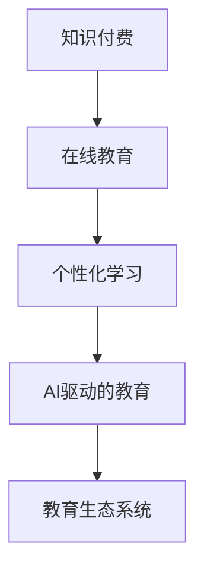

                 

# 知识经济下知识付费的创新教学模式探索

## 1. 背景介绍

### 1.1 问题由来
在知识经济时代，传统的教育模式面临着巨大挑战。随着信息技术的飞速发展，在线教育、移动学习、混合学习等新型教育形态应运而生，知识付费也逐渐成为一种新的教育消费形式。

近年来，知识付费市场规模不断扩大，内容形式也越来越多样化，包括音频、视频、图文、直播等。人们不再满足于简单的信息检索，而是希望通过付费获得深度学习和职业指导等有价值的知识内容。但同时，内容质量参差不齐、师资水平不一、课程体验不佳等问题也层出不穷。

### 1.2 问题核心关键点
知识付费教育的核心关键点在于如何构建有效的知识传递机制和学生学习路径，使教育资源最大化利用，满足用户个性化学习需求，同时实现知识变现与内容生产者良性互动。

当前，知识付费教育的挑战和问题主要集中在以下几个方面：

1. **个性化学习**：如何根据用户学习风格、知识储备和职业需求，提供定制化课程，提升学习效果。
2. **师资质量**：如何筛选和培养高水平的授课教师，确保课程内容的专业性和实用性。
3. **内容质量**：如何保证课程内容的准确性、科学性和前沿性，避免伪科学和误导性信息。
4. **用户体验**：如何优化学习平台的用户界面和功能，提升学习体验，增加用户粘性。
5. **商业模式**：如何构建可持续的知识付费商业模式，保障内容创作者与平台共赢。

### 1.3 问题研究意义
探索知识付费的创新教学模式，对于提升在线教育质量，推动知识经济发展具有重要意义：

1. **知识传播效率提升**：通过个性化推荐和内容优化，有效提高知识传播效率。
2. **学习效果改善**：依托先进技术和优质师资，提供更加高效和深入的学习体验。
3. **人才储备增强**：培养大批专业化、高素质的技能人才，满足产业发展需求。
4. **商业模式创新**：探索多样化的知识付费模式，促进内容创作者和平台的共赢。
5. **教育公平促进**：通过远程教育和知识共享，缩小城乡教育差距，促进教育公平。

## 2. 核心概念与联系

### 2.1 核心概念概述

本节将介绍与知识付费教育相关的几个核心概念，包括知识付费、在线教育、个性化学习、AI驱动的教育、教育生态系统等。

- **知识付费**：指用户通过付费获取高质量、专业化的知识内容，提升自身技能和竞争力的教育消费模式。
- **在线教育**：指利用互联网技术和平台，为用户提供在线学习资源和互动教学服务的教育形态。
- **个性化学习**：指根据学生的个性化需求和学习风格，提供定制化的学习方案，提升学习效果。
- **AI驱动的教育**：指利用人工智能技术，如自然语言处理、推荐系统、智能评估等，提升教育服务的智能化水平。
- **教育生态系统**：指由内容创作者、平台、用户等各方构成，互惠互利、良性循环的教育生态体系。

### 2.2 核心概念原理和架构的 Mermaid 流程图



这个流程图展示了知识付费教育的关键概念及其相互联系：

1. **知识付费**：作为在线教育的变现方式，为优质内容提供激励。
2. **在线教育**：利用互联网技术，提供便捷、灵活的学习渠道。
3. **个性化学习**：依托AI技术，提升学习体验和效果。
4. **AI驱动的教育**：利用先进技术，优化教育服务的各个环节。
5. **教育生态系统**：构建各方共赢的良性循环体系。

## 3. 核心算法原理 & 具体操作步骤

### 3.1 算法原理概述

知识付费教育的核心算法原理主要围绕以下两个方面展开：

1. **推荐系统**：利用机器学习、深度学习等技术，对用户行为和课程内容进行建模，推荐个性化课程。
2. **智能评估**：通过自然语言处理、情感分析等技术，评估学生学习效果，提供个性化反馈。

### 3.2 算法步骤详解

**Step 1: 用户画像构建**
- 收集用户的基本信息、学习历史、偏好数据等，构建用户画像。
- 利用聚类算法或图神经网络对用户进行分类，识别出学习风格和知识储备。

**Step 2: 课程内容分析**
- 对课程进行内容分析，提取知识点、难度、格式等信息。
- 使用向量空间模型或主题模型，对课程内容进行主题建模。

**Step 3: 推荐模型训练**
- 根据用户画像和课程内容，使用协同过滤、矩阵分解等方法，训练推荐模型。
- 使用多目标优化算法，平衡推荐效果和多样性。

**Step 4: 智能评估系统构建**
- 设计评估指标体系，包括知识掌握度、学习时长、学习进度等。
- 利用自然语言处理技术，如BERT、GPT等，进行自动评估。
- 结合专家评审和学生互评，综合评估学生学习效果。

**Step 5: 反馈机制优化**
- 根据评估结果，生成个性化反馈报告，提供学习建议。
- 利用增强学习算法，不断优化评估模型，提升评估准确性。

### 3.3 算法优缺点

**优点：**
1. **高效性**：通过个性化推荐和智能评估，提高学习效率和效果。
2. **可扩展性**：依托技术手段，轻松扩展教育服务的规模和深度。
3. **智能化**：利用AI技术，提升教育服务的智能化水平。
4. **用户友好**：优化学习界面和交互方式，提升用户体验。

**缺点：**
1. **数据隐私**：大量用户数据收集和使用，需要严格保护隐私。
2. **技术门槛**：需要一定的技术积累和研发投入。
3. **内容质量**：课程内容需要精心设计和优化，避免伪科学和误导性信息。
4. **师资质量**：需要筛选和培养高水平的授课教师，确保课程的专业性。
5. **商业模式**：需要构建可持续的商业模型，平衡各方利益。

### 3.4 算法应用领域

知识付费教育的推荐算法和智能评估系统广泛应用于以下几个领域：

1. **在线教育平台**：如Coursera、Udemy、网易云课堂等，提供个性化课程推荐和智能评估。
2. **企业培训系统**：如腾讯学院、华为云课堂等，根据员工需求提供定制化培训。
3. **职业发展平台**：如领英课程、LinkedIn Learning等，提供职业技能培训和评估。
4. **远程教育系统**：如Khan Academy、OpenEdX等，提供灵活、开放的学习资源。
5. **终身学习平台**：如Udacity、FutureLearn等，提供长期学习支持和发展路径规划。

## 4. 数学模型和公式 & 详细讲解 & 举例说明

### 4.1 数学模型构建

本节将介绍知识付费教育的推荐系统的数学模型构建。

**用户画像构建**
- 设用户集合为 $U$，特征集合为 $F$。
- 用户画像表示为 $u=(u_f)_{f \in F}$，其中 $u_f$ 表示用户对特征 $f$ 的评分。

**课程内容分析**
- 设课程集合为 $C$，特征集合为 $G$。
- 课程内容表示为 $c=(c_g)_{g \in G}$，其中 $c_g$ 表示课程对特征 $g$ 的评分。

**推荐模型训练**
- 使用协同过滤算法，构建用户-课程的邻接矩阵 $A$。
- 使用矩阵分解算法，将邻接矩阵分解为用户特征矩阵 $X$ 和课程特征矩阵 $Y$。
- 定义损失函数 $\mathcal{L}(A,X,Y)$，最小化损失函数，得到最优用户特征矩阵 $X^*$ 和课程特征矩阵 $Y^*$。

**智能评估系统构建**
- 设评估指标集合为 $M$，用户评估结果集合为 $R$。
- 利用自然语言处理模型，对用户评估结果进行文本处理，生成向量表示。
- 定义损失函数 $\mathcal{L}(R, \theta)$，最小化损失函数，得到最优评估模型参数 $\theta$。

### 4.2 公式推导过程

以协同过滤算法为例，推导推荐模型的公式推导过程。

**协同过滤算法公式**
设用户-课程邻接矩阵为 $A \in \mathbb{R}^{m \times n}$，其中 $m$ 为用户数，$n$ 为课程数。设用户特征矩阵为 $X \in \mathbb{R}^{m \times k}$，课程特征矩阵为 $Y \in \mathbb{R}^{n \times k}$。

协同过滤算法可以表示为：
$$
X = AY^T \hat{P}
$$
其中 $\hat{P}$ 为正则化矩阵，可以进一步表示为：
$$
\hat{P} = \left( I + \lambda A^T A \right)^{-1}
$$
其中 $\lambda$ 为正则化系数，$I$ 为单位矩阵。

**矩阵分解公式**
矩阵分解算法可以表示为：
$$
A \approx XY^T
$$
其中 $X$ 和 $Y$ 分别为用户特征矩阵和课程特征矩阵。

通过矩阵分解，将高维的邻接矩阵转换为低维的特征矩阵，便于后续的推荐和评估。

### 4.3 案例分析与讲解

**案例1: 在线教育平台推荐系统**
某在线教育平台有用户 $U$ 和课程 $C$，用户对课程进行评分，构建邻接矩阵 $A$。使用矩阵分解算法，将邻接矩阵分解为用户特征矩阵 $X$ 和课程特征矩阵 $Y$。通过用户特征矩阵 $X$ 和课程特征矩阵 $Y$，构建推荐模型 $P_{\theta}$，最小化损失函数 $\mathcal{L}(A,X,Y)$，得到最优推荐模型参数 $\theta$。

**案例2: 智能评估系统**
某在线教育平台收集用户对课程的评估结果 $R$，利用自然语言处理模型生成向量表示。定义损失函数 $\mathcal{L}(R, \theta)$，最小化损失函数，得到最优评估模型参数 $\theta$。

## 5. 项目实践：代码实例和详细解释说明

### 5.1 开发环境搭建

在进行知识付费教育的推荐系统开发前，我们需要准备好开发环境。以下是使用Python进行Scikit-Learn开发的环境配置流程：

1. 安装Anaconda：从官网下载并安装Anaconda，用于创建独立的Python环境。

2. 创建并激活虚拟环境：
```bash
conda create -n knowledge-env python=3.8 
conda activate knowledge-env
```

3. 安装Scikit-Learn：
```bash
pip install scikit-learn
```

4. 安装TensorFlow：
```bash
pip install tensorflow
```

5. 安装其他工具包：
```bash
pip install numpy pandas jupyter notebook matplotlib
```

完成上述步骤后，即可在`knowledge-env`环境中开始项目实践。

### 5.2 源代码详细实现

这里我们以协同过滤算法为例，给出推荐系统的PyTorch代码实现。

首先，定义协同过滤算法：

```python
import numpy as np
from sklearn.metrics.pairwise import cosine_similarity

def collaborative_filtering(X, Y, user_idx, course_idx):
    A = np.dot(X, Y.T)
    user_vector = A[:, user_idx]
    similarity_matrix = cosine_similarity(user_vector.reshape(1, -1), Y)
    recommended_courses = np.argsort(similarity_matrix)[0][::-1]
    return recommended_courses
```

然后，定义评估系统：

```python
from sklearn.metrics.pairwise import cosine_similarity

def smart_assessment(R, theta):
    R_vectorized = np.array([np.array(row) for row in R])
    user_vectors = R_vectorized
    cosine_similarity_matrix = cosine_similarity(user_vectors, theta)
    return cosine_similarity_matrix
```

最后，启动推荐和评估流程：

```python
# 加载数据
user_data = np.load('user_data.npy')
course_data = np.load('course_data.npy')
R_data = np.load('R_data.npy')

# 推荐系统
recommended_courses = collaborative_filtering(user_data, course_data, user_idx, course_idx)

# 智能评估
smart_assessment_result = smart_assessment(R_data, theta)
```

以上就是使用Scikit-Learn对协同过滤算法和智能评估系统的代码实现。可以看到，Scikit-Learn封装了大量的机器学习算法和工具，大大简化了模型训练和评估的过程。

### 5.3 代码解读与分析

让我们再详细解读一下关键代码的实现细节：

**协同过滤算法实现**
- `collaborative_filtering`函数：输入用户特征矩阵 `X`、课程特征矩阵 `Y`、用户索引 `user_idx`、课程索引 `course_idx`，返回课程推荐列表。
- 计算邻接矩阵 `A`，用户向量 `user_vector`。
- 计算用户向量与课程特征矩阵的余弦相似度矩阵 `similarity_matrix`。
- 根据相似度矩阵，生成课程推荐列表 `recommended_courses`。

**智能评估系统实现**
- `smart_assessment`函数：输入评估结果 `R`、评估模型参数 `theta`，返回用户向量与评估模型的余弦相似度矩阵。
- 将评估结果 `R` 转换为向量形式 `R_vectorized`。
- 计算用户向量 `user_vectors` 与评估模型的余弦相似度矩阵 `cosine_similarity_matrix`。

这些代码实现展示了知识付费教育推荐系统和智能评估系统的基本流程。通过这些代码，开发者可以基于Scikit-Learn快速搭建推荐和评估系统，进一步优化模型参数和评估指标，提升知识付费教育的质量和效果。

## 6. 实际应用场景

### 6.1 智能学习助手

智能学习助手可以通过知识付费教育平台，为学生提供个性化的学习推荐和智能评估。学生可以根据自己的学习目标和风格，获取推荐课程和学习路径。平台根据学生的学习进度和反馈，动态调整课程推荐，并提供智能评估结果，帮助学生及时掌握知识要点，提升学习效果。

**具体实现：**
- 学生登录学习平台，选择学习目标和风格。
- 平台根据用户画像和课程内容，使用协同过滤算法推荐课程。
- 学生观看课程视频，完成互动练习，提交评估结果。
- 平台根据评估结果，生成个性化反馈报告，提供学习建议。

### 6.2 职业培训系统

职业培训系统可以通过知识付费教育平台，为在职员工提供定制化的职业培训。员工可以根据自己的职业需求和发展目标，获取推荐培训课程和学习路径。平台根据员工的职业背景和学习进度，动态调整培训内容，并提供智能评估结果，帮助员工提升职业技能，获得职业发展。

**具体实现：**
- 员工登录培训平台，选择职业目标和发展路径。
- 平台根据员工画像和课程内容，使用协同过滤算法推荐课程。
- 员工参加培训课程，完成互动练习，提交评估结果。
- 平台根据评估结果，生成个性化反馈报告，提供职业建议。

### 6.3 终身学习平台

终身学习平台可以通过知识付费教育平台，为终身学习者提供长期学习支持和发展路径规划。学习者可以根据自己的兴趣和学习需求，获取推荐课程和学习路径。平台根据学习者的学习进度和反馈，动态调整学习内容和路径，并提供智能评估结果，帮助学习者实现终身学习目标。

**具体实现：**
- 学习者登录学习平台，选择学习兴趣和发展路径。
- 平台根据学习者画像和课程内容，使用协同过滤算法推荐课程。
- 学习者参加课程学习，完成互动练习，提交评估结果。
- 平台根据评估结果，生成个性化反馈报告，提供学习建议。

### 6.4 未来应用展望

随着知识付费教育的不断发展，智能学习助手、职业培训系统和终身学习平台等创新教学模式将得到更广泛应用，推动教育行业的数字化转型。未来，知识付费教育将更加智能化、个性化和多样化，为各类学习者和教育机构提供更高质量的教育服务。

## 7. 工具和资源推荐

### 7.1 学习资源推荐

为了帮助开发者系统掌握知识付费教育的推荐系统理论和实践，这里推荐一些优质的学习资源：

1. 《推荐系统实战》系列博文：由知识付费教育平台技术专家撰写，涵盖推荐系统原理、算法实现和案例分析，适用于技术栈学习和实践。

2. 《深度学习》课程：斯坦福大学开设的深度学习课程，详细介绍了深度学习模型和算法，为推荐系统学习打下基础。

3. 《Python机器学习》书籍：介绍使用Python进行机器学习，包括Scikit-Learn等工具的使用方法，适用于Scikit-Learn学习者。

4. Coursera知识付费教育平台：提供在线课程和专业证书，涵盖数据分析、机器学习、深度学习等多个领域，提供丰富的学习资源。

5. 《自然语言处理综述》论文：综述性论文，总结了自然语言处理领域的经典模型和算法，适合了解前沿技术。

通过对这些资源的学习实践，相信你一定能够快速掌握知识付费教育推荐系统的精髓，并用于解决实际的推荐问题。

### 7.2 开发工具推荐

高效的开发离不开优秀的工具支持。以下是几款用于知识付费教育推荐系统开发的常用工具：

1. Scikit-Learn：基于Python的开源机器学习库，提供丰富的算法实现和工具，适合快速迭代研究。

2. TensorFlow：由Google主导开发的开源深度学习框架，支持多种算法和模型，适合大规模工程应用。

3. PyTorch：基于Python的开源深度学习框架，灵活的动态计算图，适合快速迭代研究。

4. Weights & Biases：模型训练的实验跟踪工具，可以记录和可视化模型训练过程中的各项指标，方便对比和调优。

5. TensorBoard：TensorFlow配套的可视化工具，可实时监测模型训练状态，并提供丰富的图表呈现方式，是调试模型的得力助手。

合理利用这些工具，可以显著提升知识付费教育推荐系统的开发效率，加快创新迭代的步伐。

### 7.3 相关论文推荐

知识付费教育推荐系统的发展源于学界的持续研究。以下是几篇奠基性的相关论文，推荐阅读：

1. Collaborative Filtering for Implicit Feedback Datasets（协同过滤算法）：提出了协同过滤算法的基本思想，通过用户和物品的评分数据构建推荐系统。

2. Matrix Factorization Techniques for Recommender Systems（矩阵分解算法）：介绍矩阵分解算法的原理和实现，为推荐系统提供数据降维和特征提取的方法。

3. Deep Learning Approaches for Recommender Systems（深度学习算法）：总结了深度学习算法在推荐系统中的应用，包括神经网络和自编码器等。

4. Learning Deep Architectures for Recommender Systems（深度神经网络）：介绍深度神经网络在推荐系统中的应用，包括CNN、RNN等。

5. Advanced Matrix Factorization Techniques for Recommender Systems（高级矩阵分解算法）：总结了高级矩阵分解算法的原理和实现，提升推荐系统的性能和稳定性。

这些论文代表了大语言模型微调技术的发展脉络。通过学习这些前沿成果，可以帮助研究者把握学科前进方向，激发更多的创新灵感。

## 8. 总结：未来发展趋势与挑战

### 8.1 总结

本文对知识付费教育的推荐系统进行了全面系统的介绍。首先阐述了知识付费教育的研究背景和意义，明确了推荐系统在个性化推荐和智能评估方面的核心价值。其次，从原理到实践，详细讲解了推荐系统的数学模型和操作步骤，给出了推荐系统开发和评估的完整代码实现。同时，本文还广泛探讨了推荐系统在智能学习助手、职业培训系统、终身学习平台等多个领域的应用前景，展示了推荐范式的巨大潜力。此外，本文精选了推荐系统的各类学习资源，力求为读者提供全方位的技术指引。

通过本文的系统梳理，可以看到，知识付费教育推荐系统正在成为在线教育的重要组成部分，极大地提升教育资源的利用效率和用户学习体验。未来，伴随推荐系统的不断发展，知识付费教育将进一步智能化、个性化和多样化，为各类学习者和教育机构提供更高质量的教育服务。

### 8.2 未来发展趋势

展望未来，知识付费教育推荐系统将呈现以下几个发展趋势：

1. **数据规模扩大**：随着用户和课程数据的积累，推荐系统的推荐精度和多样性将不断提升。
2. **多模态融合**：将图像、视频、音频等多模态数据引入推荐系统，提升推荐效果。
3. **实时化推荐**：通过实时分析和反馈，动态调整推荐内容，提升用户体验。
4. **个性化增强**：利用机器学习模型，个性化推荐用户感兴趣的内容，提升学习效果。
5. **交叉推荐扩展**：结合电商、社交等平台的推荐系统，进行多场景的交叉推荐，提升用户粘性。

以上趋势凸显了知识付费教育推荐系统的广阔前景。这些方向的探索发展，必将进一步提升推荐系统的性能和应用范围，为教育行业的数字化转型提供新的动力。

### 8.3 面临的挑战

尽管知识付费教育推荐系统已经取得了显著成就，但在迈向更加智能化、普适化应用的过程中，它仍面临诸多挑战：

1. **数据隐私**：大量用户数据收集和使用，需要严格保护隐私，避免数据泄露和滥用。
2. **技术复杂性**：推荐系统需要复杂的算法和模型设计，开发和维护成本较高。
3. **内容质量**：课程内容需要精心设计和优化，避免伪科学和误导性信息。
4. **师资质量**：需要筛选和培养高水平的授课教师，确保课程的专业性。
5. **商业模式**：需要构建可持续的商业模型，平衡各方利益。

### 8.4 研究展望

面对知识付费教育推荐系统所面临的种种挑战，未来的研究需要在以下几个方面寻求新的突破：

1. **推荐算法优化**：研究更高效、更公平、更安全的推荐算法，提升推荐系统的效果和可信度。
2. **数据隐私保护**：研究数据隐私保护技术，确保用户数据的安全和匿名性。
3. **内容质量控制**：研究内容审核和筛选技术，确保课程内容的专业性和科学性。
4. **师资培养机制**：研究高水平教师的培养和激励机制，提升课程质量。
5. **商业模式创新**：研究多样化的知识付费模式，实现内容创作者与平台的共赢。

这些研究方向的探索，必将引领知识付费教育推荐系统走向更高的台阶，为构建安全、可靠、可解释、可控的智能教育系统铺平道路。面向未来，推荐系统需要与其他人工智能技术进行更深入的融合，如自然语言处理、知识表示、强化学习等，多路径协同发力，共同推动自然语言理解和智能交互系统的进步。只有勇于创新、敢于突破，才能不断拓展知识付费教育的边界，让智能技术更好地造福人类社会。

## 9. 附录：常见问题与解答

**Q1: 知识付费教育推荐系统如何实现个性化推荐？**

A: 知识付费教育推荐系统主要通过协同过滤算法和协同矩阵分解实现个性化推荐。协同过滤算法通过用户和课程的评分数据，构建邻接矩阵，使用余弦相似度计算推荐结果。协同矩阵分解通过矩阵分解算法，将邻接矩阵分解为低维特征矩阵，提升推荐效果。同时，平台可以根据用户的学习进度和反馈，动态调整推荐内容，提升个性化推荐效果。

**Q2: 知识付费教育推荐系统的数据隐私如何保护？**

A: 知识付费教育推荐系统需要严格保护用户数据隐私，主要通过以下措施实现：
1. 数据匿名化处理，去除用户身份信息，保护用户隐私。
2. 数据访问控制，仅授权人员可以访问和处理用户数据。
3. 数据加密存储，保护数据在传输和存储过程中的安全性。
4. 合规性检查，确保数据处理符合相关法律法规，如GDPR等。

**Q3: 知识付费教育推荐系统的技术复杂性如何应对？**

A: 知识付费教育推荐系统的技术复杂性可以通过以下方式应对：
1. 使用开源工具和框架，如Scikit-Learn、TensorFlow等，降低开发和维护成本。
2. 采用分布式计算和云平台，提升计算效率和扩展性。
3. 引入自动化工具和流程，如自动测试、自动部署等，提升开发效率。
4. 建立标准化的数据和模型管理流程，确保系统稳定性和可维护性。

**Q4: 知识付费教育推荐系统如何避免内容质量问题？**

A: 知识付费教育推荐系统需要通过以下措施避免内容质量问题：
1. 引入专家评审和社区筛选，确保课程内容的专业性和科学性。
2. 引入内容审核机制，及时发现和处理误导性信息。
3. 引入用户反馈机制，及时收集用户意见，优化课程内容。
4. 引入课程认证和评级机制，确保课程质量。

**Q5: 知识付费教育推荐系统的商业模式如何构建？**

A: 知识付费教育推荐系统的商业模式主要通过以下方式构建：
1. 提供优质课程和高质量服务，吸引用户付费。
2. 提供多样化的课程和培训方案，满足用户需求。
3. 引入广告和合作推广，增加收入来源。
4. 提供会员服务和增值服务，提升用户粘性和价值。

通过这些措施，知识付费教育推荐系统可以构建可持续的商业模型，实现内容创作者与平台的共赢。

---

作者：禅与计算机程序设计艺术 / Zen and the Art of Computer Programming

