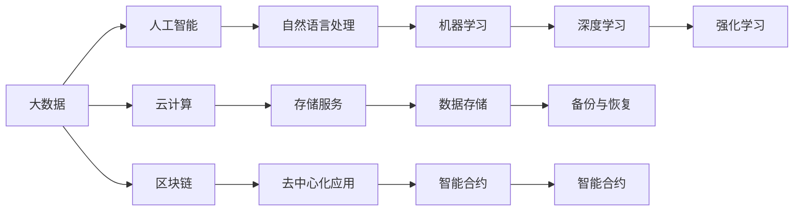

                 

# 知识经济下程序员的创业方向

## 1. 背景介绍

### 1.1 问题由来
在知识经济时代，科技的迅猛发展和社会对技术的需求不断增加，促使许多程序员探索新的创业方向，以应对行业变化和市场需求。程序员，作为技术创新的主力军，其创业领域的多元化和专业性选择，对社会和经济有着深远的影响。本文将从多个维度探讨程序员在知识经济下的创业方向，帮助他们在技术创新和市场需求间找到最佳平衡点。

## 2. 核心概念与联系

### 2.1 核心概念概述

在探讨程序员创业方向时，需要明确几个核心概念：

- **知识经济（Knowledge Economy）**：指以知识要素为基础，以高科技产业为支柱的经济形态，强调知识的生产、传播和应用。
- **大数据（Big Data）**：指规模巨大、类型多样、结构复杂的数据集合，用于发现隐藏在数据中的模式、趋势和关联。
- **人工智能（AI）**：指模拟人类智能的计算机系统，能够执行诸如学习、推理、感知、决策、自然语言处理等任务。
- **云计算（Cloud Computing）**：指通过网络提供可扩展的计算资源和服务的计算模式，使得用户可以按需获取计算能力。
- **区块链（Blockchain）**：指一种去中心化的、加密的数据库技术，通过网络节点共同维护记录，保证数据的安全和透明。

### 2.2 核心概念原理和架构的 Mermaid 流程图



此图表展示了大数据、人工智能、云计算、区块链等核心概念之间的联系。

## 3. 核心算法原理 & 具体操作步骤

### 3.1 算法原理概述

程序员创业方向的选择，通常基于对当前技术趋势和未来发展方向的理解。以下算法原理概述将帮助理解不同创业方向的理论基础：

- **大数据**：利用数据挖掘、统计分析和机器学习技术，从海量数据中提取有价值的信息，驱动决策支持、个性化推荐、市场预测等应用。
- **人工智能**：通过深度学习、强化学习等算法，训练模型进行智能决策、图像识别、自然语言处理等任务。
- **云计算**：提供弹性的计算资源，支持大数据处理、人工智能训练、分布式计算等应用。
- **区块链**：通过去中心化的共识机制和智能合约，实现安全的数据记录、交易验证和信任构建。

### 3.2 算法步骤详解

以下将详细介绍各个核心概念的算法步骤：

**大数据**：

1. **数据收集**：从互联网、社交媒体、企业系统等收集数据。
2. **数据清洗**：去除噪声和异常值，处理缺失数据。
3. **数据挖掘**：使用算法如聚类、分类、关联规则挖掘等发现模式和规律。
4. **数据分析**：通过统计分析、可视化等技术揭示数据含义。
5. **数据应用**：将分析结果应用于商业决策、产品推荐等。

**人工智能**：

1. **数据预处理**：将原始数据转换为模型可接受的格式。
2. **模型选择**：根据问题类型选择合适的模型，如线性回归、神经网络、支持向量机等。
3. **模型训练**：使用训练数据对模型进行训练，优化参数。
4. **模型评估**：使用测试数据评估模型性能。
5. **模型应用**：部署模型进行预测、分类、推荐等任务。

**云计算**：

1. **资源申请**：向云服务提供商申请所需的计算、存储资源。
2. **数据迁移**：将数据迁移到云平台。
3. **应用部署**：在云平台上部署应用程序。
4. **弹性扩展**：根据需求动态调整计算资源。
5. **数据备份**：定期备份数据，确保数据安全。

**区块链**：

1. **网络搭建**：搭建区块链网络，包括节点配置、共识算法选择。
2. **智能合约编写**：编写实现业务逻辑的智能合约。
3. **交易验证**：验证交易的有效性和合法性。
4. **数据存储**：将交易记录存储在区块链上。
5. **去中心化应用开发**：开发基于区块链的去中心化应用。

### 3.3 算法优缺点

**大数据**：

- **优点**：数据来源广泛，信息丰富；可应用于多个领域，驱动决策。
- **缺点**：数据量大，处理复杂；隐私和数据安全问题。

**人工智能**：

- **优点**：智能决策能力强，可以处理复杂任务。
- **缺点**：模型复杂，计算资源需求高；需要大量标注数据。

**云计算**：

- **优点**：资源按需获取，弹性扩展；可实现分布式计算。
- **缺点**：成本高；服务依赖性。

**区块链**：

- **优点**：去中心化，数据不可篡改；确保交易透明和安全。
- **缺点**：技术复杂，应用场景有限；性能瓶颈。

## 4. 数学模型和公式 & 详细讲解 & 举例说明

### 4.1 数学模型构建

- **大数据模型**：
  - **K-Means算法**：用于聚类分析的算法，计算模型为：

    $$
    K-Means = \sum_{i=1}^{k} \sum_{x \in S_i} ||x - \mu_i||^2
    $$

    其中，$S_i$为第$i$个聚类，$\mu_i$为聚类中心。

  - **随机森林**：用于分类和回归的算法，计算模型为：

    $$
    random\_forest = \frac{1}{N}\sum_{i=1}^{N} F_i(x)
    $$

    其中，$N$为树的数量，$F_i(x)$为第$i$棵树对样本$x$的预测结果。

- **人工智能模型**：
  - **深度学习模型**：如卷积神经网络（CNN）、循环神经网络（RNN）、长短期记忆网络（LSTM）等。
  - **强化学习模型**：如Q-Learning、Deep Q-Learning等。

- **云计算模型**：
  - **云资源管理模型**：如云弹性调度模型，计算模型为：

    $$
    cloud\_resource\_management = \min_{c} \sum_{i=1}^{n} f_i(c_i)
    $$

    其中，$c$为资源配置，$f_i$为第$i$项成本。

- **区块链模型**：
  - **共识算法模型**：如PoW（工作量证明）、PoS（权益证明）等。

### 4.2 公式推导过程

- **大数据模型推导**：
  - K-Means算法推导：
    $$
    K-Means = \sum_{i=1}^{k} \sum_{x \in S_i} ||x - \mu_i||^2
    $$

  - 随机森林推导：
    $$
    random\_forest = \frac{1}{N}\sum_{i=1}^{N} F_i(x)
    $$

- **人工智能模型推导**：
  - CNN推导：
    $$
    CNN = \max_{w} \left\{ \sum_{i=1}^{n} w_i y_i \right\}
    $$

  - Q-Learning推导：
    $$
    Q-Learning = Q(s,a) + \alpha(r + \gamma \max Q(s',a') - Q(s,a))
    $$

- **云计算模型推导**：
  - 云资源管理模型推导：
    $$
    cloud\_resource\_management = \min_{c} \sum_{i=1}^{n} f_i(c_i)
    $$

- **区块链模型推导**：
  - PoW推导：
    $$
    PoW = \frac{P}{B \times H}
    $$

    其中，$P$为计算量，$B$为区块大小，$H$为哈希值。

### 4.3 案例分析与讲解

- **大数据案例**：
  - **电商推荐系统**：利用K-Means算法对用户行为数据进行聚类分析，发现不同用户群体的消费习惯，从而提供个性化推荐。

- **人工智能案例**：
  - **自动驾驶**：利用深度学习模型对摄像头采集的图像进行分析，识别交通标志、行人等，进行自动驾驶决策。

- **云计算案例**：
  - **云存储服务**：利用云资源管理模型动态调整存储资源，确保数据的可靠性和可访问性。

- **区块链案例**：
  - **供应链溯源**：利用区块链技术记录供应链各环节的交易数据，确保数据的透明和不可篡改，提高供应链的信任度。

## 5. 项目实践：代码实例和详细解释说明

### 5.1 开发环境搭建

- **大数据项目**：
  - **环境搭建**：安装Python、pandas、scikit-learn等大数据处理工具。
  - **工具推荐**：Jupyter Notebook、Spark等。

- **人工智能项目**：
  - **环境搭建**：安装TensorFlow、PyTorch等深度学习框架。
  - **工具推荐**：Google Colab、Kaggle等。

- **云计算项目**：
  - **环境搭建**：安装AWS CLI、GCP SDK等云服务管理工具。
  - **工具推荐**：AWS Management Console、GCP Console等。

- **区块链项目**：
  - **环境搭建**：安装ethereum-python、web3.py等区块链开发工具。
  - **工具推荐**：MyEtherWallet、MetaMask等。

### 5.2 源代码详细实现

- **大数据项目**：
  - **代码实现**：使用pandas处理数据，使用scikit-learn进行模型训练和评估。

    ```python
    import pandas as pd
    from sklearn.cluster import KMeans

    # 读取数据
    data = pd.read_csv('data.csv')
    # 数据预处理
    data = data.dropna()
    # 聚类分析
    kmeans = KMeans(n_clusters=3)
    kmeans.fit(data)
    ```

- **人工智能项目**：
  - **代码实现**：使用TensorFlow构建深度学习模型。

    ```python
    import tensorflow as tf
    # 构建CNN模型
    model = tf.keras.Sequential([
        tf.keras.layers.Conv2D(32, (3,3), activation='relu', input_shape=(28,28,1)),
        tf.keras.layers.MaxPooling2D((2,2)),
        tf.keras.layers.Flatten(),
        tf.keras.layers.Dense(10, activation='softmax')
    ])
    # 编译模型
    model.compile(optimizer='adam', loss='sparse_categorical_crossentropy', metrics=['accuracy'])
    # 训练模型
    model.fit(train_data, train_labels, epochs=10)
    ```

- **云计算项目**：
  - **代码实现**：使用AWS SDK进行云资源管理。

    ```python
    import boto3

    # 创建EC2实例
    ec2 = boto3.resource('ec2')
    instance = ec2.create_instances(
        ImageId='ami-0abcdef1234567890',
        MinCount=1,
        MaxCount=1,
        InstanceType='t2.micro'
    )
    ```

- **区块链项目**：
  - **代码实现**：使用ethereum-python进行智能合约开发。

    ```python
    from web3 import Web3

    # 连接区块链网络
    w3 = Web3(Web3.HTTPProvider('http://localhost:8545'))
    # 部署智能合约
    contract = w3.eth.contract(address='0x1234567890', abi='...')
    contract.functions.myFunction().transact({'from': w3.eth.accounts[0]})
    ```

### 5.3 代码解读与分析

- **大数据项目**：
  - **数据处理**：使用pandas和scikit-learn对数据进行预处理、聚类分析。
  - **模型训练**：使用K-Means算法进行聚类。

- **人工智能项目**：
  - **模型构建**：使用TensorFlow构建CNN模型，进行图像识别。
  - **模型评估**：使用测试数据评估模型性能。

- **云计算项目**：
  - **资源管理**：使用AWS SDK进行云资源的动态调整和管理。
  - **弹性扩展**：根据需求动态调整计算资源。

- **区块链项目**：
  - **智能合约**：使用ethereum-python编写智能合约，进行交易验证。
  - **去中心化应用**：开发基于区块链的去中心化应用。

### 5.4 运行结果展示

- **大数据项目**：
  - **结果展示**：输出聚类分析的簇中心和样本分布。

    ```python
    print(kmeans.cluster_centers_)
    print(data.groupby(kmeans.labels_).size())
    ```

- **人工智能项目**：
  - **结果展示**：输出模型在测试集上的准确率和混淆矩阵。

    ```python
    test_loss, test_acc = model.evaluate(test_data, test_labels)
    print('Test accuracy:', test_acc)
    print(classification_report(test_labels, model.predict(test_data)))
    ```

- **云计算项目**：
  - **结果展示**：输出EC2实例的运行状态和配置信息。

    ```python
    print(instance[0].state)
    print(instance[0].instance_type)
    ```

- **区块链项目**：
  - **结果展示**：输出智能合约的调用结果和状态。

    ```python
    print(contract.functions.myFunction().call({'from': w3.eth.accounts[0]}, {'value': 1}))
    print(contract.functions.myFunction().call({'from': w3.eth.accounts[0]}, {'value': 1}))
    ```

## 6. 实际应用场景

### 6.1 智能推荐系统

智能推荐系统利用大数据和人工智能技术，根据用户的历史行为和偏好，推荐相关商品或内容。程序员可以在此基础上开发推荐算法，如协同过滤、基于内容的推荐、混合推荐等，提升推荐效果。

### 6.2 金融科技

金融科技结合人工智能、大数据和区块链技术，提升金融服务的效率和安全性。程序员可以开发智能合约、去中心化交易平台、智能风控系统等，推动金融服务的智能化、普惠化。

### 6.3 医疗健康

医疗健康利用人工智能和大数据技术，提升诊断和治疗的精准度。程序员可以开发智能诊断系统、个性化治疗方案、患者数据管理系统等，助力医疗服务的数字化转型。

### 6.4 未来应用展望

未来，随着技术的不断进步，程序员在知识经济下的创业方向将更加多样化和专业化。结合大数据、人工智能、云计算、区块链等前沿技术，将开发出更多创新应用，推动社会的进步和发展。

## 7. 工具和资源推荐

### 7.1 学习资源推荐

- **大数据**：
  - 《Python大数据处理实战》
  - 《Hadoop权威指南》
  - 《R语言数据挖掘与统计分析》

- **人工智能**：
  - 《深度学习》
  - 《TensorFlow实战》
  - 《Python机器学习》

- **云计算**：
  - 《云计算基础》
  - 《AWS云架构实践》
  - 《Kubernetes实战》

- **区块链**：
  - 《区块链原理与实战》
  - 《以太坊编程》
  - 《Hyperledger Fabric入门与实践》

### 7.2 开发工具推荐

- **大数据**：
  - Hadoop、Spark
  - Jupyter Notebook
  - Hive、Presto

- **人工智能**：
  - TensorFlow、PyTorch
  - Google Colab
  - Keras

- **云计算**：
  - AWS、GCP、阿里云
  - Terraform、Ansible
  - OpenStack

- **区块链**：
  - Ethereum、Hyperledger
  - Truffle、Remix
  - IPFS、Filecoin

### 7.3 相关论文推荐

- **大数据**：
  - 《Big Data: Principles and Best Practices of Scalable Realtime Data Systems》
  - 《MapReduce: Simplified Data Processing on Large Clusters》
  - 《Presto: Distributed SQL for Fast Data Serving》

- **人工智能**：
  - 《ImageNet Classification with Deep Convolutional Neural Networks》
  - 《Learning to Execute》
  - 《AlphaGo Zero》

- **云计算**：
  - 《Cloud Computing: Concepts, Technology and Architecture》
  - 《Google Cloud Platform: A Guide to Cloud Computing》
  - 《Cloud Computing: Principles and Paradigms》

- **区块链**：
  - 《Bitcoin: A Peer-to-Peer Electronic Cash System》
  - 《Ethereum Yellow Paper》
  - 《Blockchain: From Concept to Action》

## 8. 总结：未来发展趋势与挑战

### 8.1 总结

本文详细探讨了程序员在知识经济下的创业方向，通过分析大数据、人工智能、云计算、区块链等核心概念，以及它们之间的联系和应用，帮助程序员找到创新的创业路径。通过系统地学习这些前沿技术，程序员可以在知识经济中取得显著的竞争优势，推动社会的进步。

### 8.2 未来发展趋势

未来，大数据、人工智能、云计算、区块链等技术的融合创新，将推动知识经济快速发展。程序员应紧跟技术趋势，不断学习和应用新技术，以开发更多创新应用，驱动社会进步。

### 8.3 面临的挑战

- **技术复杂性**：新技术的学习和应用需要时间和经验积累。
- **市场竞争激烈**：新技术的普及也伴随着激烈的竞争，需要程序员不断创新和优化。
- **伦理和安全问题**：新技术的应用可能带来数据隐私和伦理问题，需要程序员在设计时充分考虑。

### 8.4 研究展望

未来的研究应聚焦于技术融合创新、应用场景探索、伦理和安全问题解决等方面。通过不断突破和优化，推动知识经济的发展，实现科技服务于社会。

## 9. 附录：常见问题与解答

**Q1：大数据、人工智能、云计算、区块链等技术之间的关系是什么？**

A: 大数据、人工智能、云计算、区块链等技术是相互关联、相互支持的。大数据为人工智能提供数据基础，云计算提供计算和存储资源，人工智能为大数据和区块链提供智能分析和服务，区块链为数据安全和交易验证提供保障。

**Q2：大数据、人工智能、云计算、区块链等技术如何应用到具体项目中？**

A: 大数据可以应用于数据收集、清洗和分析，为决策支持提供数据基础。人工智能可以应用于模型训练和预测，提升数据分析的准确性。云计算可以应用于资源管理和弹性扩展，支持大数据处理和人工智能训练。区块链可以应用于数据安全和交易验证，保障数据可信和透明。

**Q3：未来技术发展趋势是什么？**

A: 未来，技术将更加智能化、普适化和安全化。大数据、人工智能、云计算、区块链等技术的融合创新，将推动知识经济的快速发展。程序员应紧跟技术趋势，不断学习和应用新技术，以开发更多创新应用，驱动社会进步。

**Q4：如何提升编程能力和技术水平？**

A: 提升编程能力和技术水平，需要不断学习和实践。可以参加技术培训、参与开源项目、阅读技术书籍和论文，以及参加技术交流会议等。同时，需要保持对新技术的敏感度，不断更新知识体系。

**Q5：程序员创业时应注意哪些问题？**

A: 程序员创业时应注意市场需求、技术创新、团队建设、资金筹措等方面。需要充分调研市场需求，明确创业方向；保持技术创新，不断优化产品；组建高效的团队，吸引优秀人才；合理筹措资金，保障项目顺利进行。

---

作者：禅与计算机程序设计艺术 / Zen and the Art of Computer Programming

