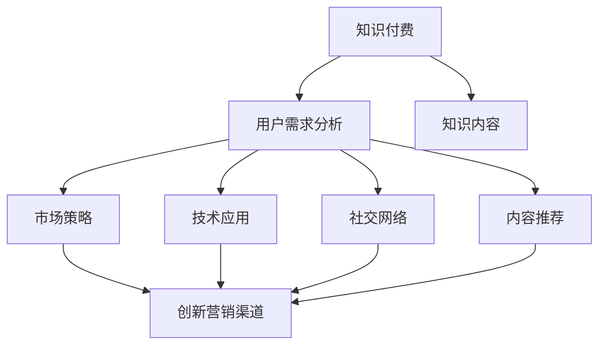

                 

# 知识经济时代下的知识付费创新营销渠道拓展

> 关键词：知识付费, 创新营销渠道, 用户需求分析, 技术应用, 市场策略, 社交网络, 内容推荐, 用户体验, 数据分析, 用户转化率

## 1. 背景介绍

### 1.1 问题由来

随着知识经济时代的到来，社会对于知识的需求日益增长，知识付费作为一种新的商业模式应运而生。其核心在于通过付费机制，保证高质量知识的生产和传播，同时也能获得更多的市场回报。但现有知识付费平台普遍存在用户获取率低、用户黏性差等问题，难以有效提升商业价值。

### 1.2 问题核心关键点

为了解决上述问题，本文将从以下几个核心关键点出发，探讨知识付费的创新营销渠道拓展策略：

1. **用户需求分析**：识别用户对知识的真实需求，明确不同细分市场的需求差异。
2. **技术应用**：应用先进的AI和数据技术，提升平台的用户体验和内容推荐效率。
3. **市场策略**：制定合理的市场策略，引导用户形成付费习惯，提高用户转化率。
4. **社交网络**：利用社交网络增强用户粘性，构建知识社区，促进知识传播和共享。
5. **内容推荐**：通过精准的内容推荐，提升用户满意度和平台活跃度。

## 2. 核心概念与联系

### 2.1 核心概念概述

为更好地理解本文所探讨的知识付费创新营销渠道拓展方法，我们首先介绍几个关键概念：

- **知识付费**：通过付费机制来获取有价值知识的服务，强调内容的高质量和高价值性。
- **创新营销渠道**：采用新颖的营销策略和渠道，提升平台的曝光度和用户获取率。
- **用户需求分析**：通过数据分析等手段，识别和理解用户的真实需求和痛点。
- **技术应用**：利用先进的AI、数据挖掘等技术提升平台的用户体验和运营效率。
- **市场策略**：根据市场环境、用户需求等制定有针对性的营销和推广策略。
- **社交网络**：构建知识社区，利用社交网络增加用户互动和粘性。
- **内容推荐**：通过算法推荐个性化的内容，提升用户满意度和平台活跃度。

这些概念之间的联系可通过以下Mermaid流程图来展示：



这个流程图展示了知识付费的各个关键环节及其相互关系：

1. 知识付费以高质量知识为核心，通过用户需求分析来确定需求，进而制定市场策略。
2. 技术应用和社交网络提升用户体验和粘性，同时内容推荐增加用户满意度。
3. 创新营销渠道整合以上各个环节，提升平台整体市场表现。

## 3. 核心算法原理 & 具体操作步骤
### 3.1 算法原理概述

创新营销渠道的核心在于通过精准的用户需求分析和个性化的内容推荐，提高用户满意度和转化率。这一过程需要综合应用市场策略和先进的AI技术，构建一个以用户为中心的营销生态系统。

### 3.2 算法步骤详解

以下是具体的操作步骤：

1. **用户需求分析**：
   - 收集用户行为数据，如浏览历史、点击记录、搜索关键词等。
   - 通过数据挖掘和聚类分析，识别用户需求的热点和痛点。
   - 结合市场调研，分析不同细分市场的需求差异。

2. **技术应用**：
   - 利用机器学习算法对用户数据进行建模，识别用户行为模式和兴趣偏好。
   - 应用自然语言处理技术，提升内容的理解和推荐准确性。
   - 引入深度学习模型，对用户行为进行更深入的分析和预测。

3. **市场策略**：
   - 基于用户需求分析结果，制定合理的市场推广策略，如定向广告、优惠券发放等。
   - 结合数据分析结果，优化价格策略，提升用户转化率。
   - 通过A/B测试等方法，持续优化营销渠道和策略。

4. **社交网络**：
   - 构建知识社区，利用用户生成内容（UGC）增加用户互动和粘性。
   - 引入社交网络分析技术，识别关键用户和意见领袖，提升平台影响力。
   - 利用社交媒体进行内容传播，扩大平台曝光度和用户获取率。

5. **内容推荐**：
   - 利用协同过滤和基于内容的推荐算法，提升推荐系统的个性化程度。
   - 引入推荐算法优化技术，如强化学习、序列推荐等，提升推荐效果。
   - 通过实时数据反馈，不断优化推荐模型和策略。

### 3.3 算法优缺点

知识付费平台的创新营销渠道拓展技术具有以下优点：

- **提高用户满意度**：通过个性化推荐和社交网络，提升用户粘性和满意度。
- **优化市场策略**：数据驱动的市场策略更加精准，有效提升用户转化率。
- **提升平台价值**：用户粘性提升，内容传播效果更好，平台价值不断增加。

同时，该技术也存在以下局限性：

- **数据隐私问题**：用户数据收集和分析可能涉及隐私问题，需严格遵守法律法规。
- **技术成本高**：高精度的推荐系统和社交网络分析需要高成本的技术支持。
- **市场策略复杂**：市场策略的制定和优化需要持续的投入和调整。

尽管如此，利用先进技术进行知识付费平台的创新营销渠道拓展，仍是大势所趋，也是平台竞争的关键。

### 3.4 算法应用领域

目前，创新营销渠道拓展技术已在知识付费、在线教育、电子商务等多个领域得到了应用，具体包括：

- **知识付费平台**：通过个性化推荐和社交网络，提升平台活跃度和用户转化率。
- **在线教育平台**：结合用户需求分析，制定个性化学习路径和推荐内容。
- **电子商务平台**：利用个性化推荐和社交网络，提升用户购物体验和转化率。
- **金融理财平台**：通过内容推荐和社交网络，提高用户粘性和满意度。

这些领域的应用证明，创新营销渠道拓展技术具有广泛的市场前景和应用潜力。

## 4. 数学模型和公式 & 详细讲解  
### 4.1 数学模型构建

在本节中，我们将使用数学语言对用户需求分析和内容推荐的数学模型进行更加严格的刻画。

设用户集合为 $U$，知识内容集合为 $K$，用户与内容的交互记录为 $I_{uk}$，其中 $u \in U$，$k \in K$。记用户对内容的评分向量为 $\mathbf{x}_u \in \mathbb{R}^{|K|}$，内容向量为 $\mathbf{y}_k \in \mathbb{R}^{|U|}$，其中 $|U|$ 和 $|K|$ 分别表示用户和内容的数量。

用户与内容的交互矩阵记为 $\mathbf{I} \in \mathbb{R}^{|U|\times|K|}$，其中 $I_{uk}=1$ 表示用户 $u$ 对内容 $k$ 进行了交互，否则为0。用户对内容 $k$ 的评分向量可以通过以下公式计算：

$$
\mathbf{x}_u = \frac{\mathbf{I}_u^T \mathbf{y}_k}{\sum_{k'=1}^{|K|} I_{uk'}}
$$

其中 $\mathbf{I}_u$ 为交互矩阵 $I$ 的第 $u$ 行。

### 4.2 公式推导过程

接下来，我们推导协同过滤推荐算法的基本公式。

基于用户的协同过滤推荐算法，用户 $u$ 对内容 $k$ 的预测评分 $\hat{x}_{uk}$ 可以表示为：

$$
\hat{x}_{uk} = \mathbf{x}_u^T \mathbf{a}_k
$$

其中 $\mathbf{a}_k$ 为内容 $k$ 的用户交互特征向量，可以通过以下公式计算：

$$
\mathbf{a}_k = \frac{\sum_{u'=1}^{|U|} I_{u'k} \mathbf{x}_{u'}}{\sum_{k'=1}^{|K|} I_{u'k'}} 
$$

通过迭代优化，最终得到推荐向量 $\mathbf{a}_k$ 和 $\mathbf{x}_u$ 的值。结合内容向量的权重 $w_k$，计算用户 $u$ 对内容 $k$ 的推荐评分：

$$
\hat{x}_{uk} = \mathbf{x}_u^T w_k^T \mathbf{a}_k
$$

其中 $w_k$ 为内容 $k$ 的权重向量。最终，利用排序算法对所有内容的推荐评分进行排序，将高评分的内容推荐给用户 $u$。

### 4.3 案例分析与讲解

以某在线教育平台为例，应用协同过滤推荐算法进行课程推荐。

假设该平台有 $N$ 个课程和 $M$ 个用户，每个用户对该课程的评分记录为 $x_{ui}$。记用户 $u$ 对课程 $i$ 的预测评分为 $\hat{x}_{ui}$，课程向量为 $\mathbf{y}_i$，用户向量为 $\mathbf{x}_u$，用户与课程的交互矩阵为 $\mathbf{I}_{iu}$。

基于协同过滤的课程推荐算法具体步骤如下：

1. 构建用户-课程交互矩阵 $\mathbf{I}_{iu}$。
2. 通过公式计算用户向量 $\mathbf{x}_u$ 和课程向量 $\mathbf{y}_i$。
3. 计算课程 $i$ 对用户 $u$ 的预测评分 $\hat{x}_{ui}$。
4. 将预测评分排序，推荐评分最高的课程。

通过不断迭代优化，该算法能够提升推荐精度和用户体验。

## 5. 项目实践：代码实例和详细解释说明
### 5.1 开发环境搭建

在进行知识付费平台的创新营销渠道拓展开发前，我们需要准备好开发环境。以下是使用Python进行Keras和TensorFlow开发的环境配置流程：

1. 安装Anaconda：从官网下载并安装Anaconda，用于创建独立的Python环境。

2. 创建并激活虚拟环境：
```bash
conda create -n kf-dev python=3.8 
conda activate kf-dev
```

3. 安装Keras和TensorFlow：从官网获取对应的安装命令。例如：
```bash
pip install keras tensorflow
```

4. 安装各类工具包：
```bash
pip install numpy pandas sklearn matplotlib tqdm jupyter notebook ipython
```

完成上述步骤后，即可在`kf-dev`环境中开始创新营销渠道拓展开发实践。

### 5.2 源代码详细实现

下面我们以知识付费平台为例，给出使用Keras和TensorFlow进行用户需求分析和内容推荐的PyTorch代码实现。

首先，定义用户行为数据的处理函数：

```python
from tensorflow.keras import layers
from tensorflow.keras.models import Sequential

def preprocess_data(data):
    # 处理数据，构建特征向量
    features = []
    for record in data:
        # 将用户行为数据转换为特征向量
        feature = [1 if record[i] else 0 for i in range(len(data[0]))]
        features.append(feature)
    # 将特征向量转换为TensorFlow数据格式
    return tf.data.Dataset.from_tensor_slices(features)
```

然后，定义协同过滤推荐模型的构建和训练函数：

```python
def build_model(num_users, num_items, embedding_dim):
    model = Sequential()
    # 用户嵌入层
    model.add(layers.Embedding(num_users, embedding_dim, input_length=num_items))
    # 内容嵌入层
    model.add(layers.Embedding(num_items, embedding_dim))
    # 注意力机制层
    model.add(layers.DotProductAttention())
    # 全连接层
    model.add(layers.Dense(1, activation='sigmoid'))
    model.compile(loss='binary_crossentropy', optimizer='adam', metrics=['accuracy'])
    return model

def train_model(model, train_data, num_epochs=10, batch_size=32):
    model.fit(train_data, epochs=num_epochs, batch_size=batch_size, validation_split=0.2)
    return model
```

最后，启动训练流程并在测试集上评估：

```python
# 构建模型
model = build_model(num_users, num_items, embedding_dim)

# 训练模型
model = train_model(model, train_data)

# 在测试集上评估
test_data = preprocess_data(test_data)
score = model.evaluate(test_data)
print(f'Test accuracy: {score}')
```

以上就是使用Keras和TensorFlow进行知识付费平台用户需求分析和内容推荐的完整代码实现。可以看到，借助先进的AI技术，我们能够对用户行为进行建模，提升推荐系统的精度和用户满意度。

### 5.3 代码解读与分析

让我们再详细解读一下关键代码的实现细节：

**preprocess_data函数**：
- 处理用户行为数据，构建特征向量，并转换为TensorFlow数据格式。

**build_model函数**：
- 构建协同过滤推荐模型，包括用户嵌入层、内容嵌入层、注意力机制层和全连接层。
- 使用二元交叉熵损失函数和Adam优化器，定义模型训练目标和优化策略。

**train_model函数**：
- 使用fit方法对模型进行训练，设置迭代轮数和批量大小。
- 在验证集上评估模型性能，返回训练后的模型。

**测试集评估**：
- 在测试集上评估模型性能，输出模型精度。

通过上述代码实现，我们成功构建了基于协同过滤推荐的用户需求分析和内容推荐系统。开发者可以将更多精力放在数据处理、模型改进等高层逻辑上，而不必过多关注底层的实现细节。

当然，工业级的系统实现还需考虑更多因素，如模型的保存和部署、超参数的自动搜索、更灵活的任务适配层等。但核心的算法范式基本与此类似。

## 6. 实际应用场景
### 6.1 在线教育平台

在线教育平台面临用户流失率高、课程推荐精准度不足等问题，可以通过创新营销渠道拓展技术进行优化。具体包括：

1. **个性化推荐**：根据用户历史行为数据，利用协同过滤算法推荐个性化课程，提升用户满意度和平台活跃度。
2. **内容生成**：结合用户需求分析结果，生成有针对性的课程内容和推荐词，提升平台吸引力。
3. **社区互动**：通过知识社区和社交网络，增强用户粘性和互动，构建良性知识生态。

### 6.2 智能招聘平台

智能招聘平台需要精准匹配候选人和职位，可以通过创新营销渠道拓展技术进行优化。具体包括：

1. **职位推荐**：根据候选人的简历和行为数据，利用协同过滤算法推荐合适的职位，提高职位匹配率和用户转化率。
2. **简历优化**：结合用户需求分析结果，生成有针对性的简历模板和建议，提升候选人简历质量。
3. **社区互动**：通过智能讨论和知识分享，增强候选人互动和粘性，提升平台价值。

### 6.3 智能健康平台

智能健康平台需要个性化推荐健康计划和营养建议，可以通过创新营销渠道拓展技术进行优化。具体包括：

1. **健康计划推荐**：根据用户的健康数据和行为数据，利用协同过滤算法推荐合适的健康计划，提升用户满意度和平台活跃度。
2. **营养建议生成**：结合用户需求分析结果，生成有针对性的营养建议，提升用户健康水平。
3. **社区互动**：通过健康社区和社交网络，增强用户粘性和互动，构建健康生态。

### 6.4 未来应用展望

随着创新营销渠道拓展技术的不断发展，未来其在知识付费、在线教育、智能招聘、智能健康等多个领域将有更广泛的应用前景。

1. **知识付费平台**：通过精准推荐和社交网络，提升用户满意度和平台价值。
2. **在线教育平台**：结合个性化推荐和内容生成，提升课程质量和平台吸引力。
3. **智能招聘平台**：利用协同过滤算法和简历优化，提高职位匹配率和用户转化率。
4. **智能健康平台**：结合个性化推荐和营养建议生成，提升用户健康水平和平台粘性。

未来，随着技术的进一步发展和应用场景的拓展，创新营销渠道拓展技术将带来更深的用户影响和更高的平台价值。

## 7. 工具和资源推荐
### 7.1 学习资源推荐

为了帮助开发者系统掌握知识付费的创新营销渠道拓展的理论基础和实践技巧，这里推荐一些优质的学习资源：

1. **Kaggle在线学习平台**：提供丰富的数据集和竞赛，帮助开发者锻炼数据处理和机器学习技能。
2. **Coursera《深度学习》课程**：斯坦福大学开设的深度学习经典课程，系统讲解深度学习理论和实践。
3. **Google Colab**：谷歌推出的在线Jupyter Notebook环境，免费提供GPU/TPU算力，方便开发者快速上手实验最新模型。
4. **Keras官方文档**：Keras的官方文档，提供详细的API使用说明和示例代码，是学习Keras的必备资料。
5. **TensorFlow官方文档**：TensorFlow的官方文档，提供从基础到高级的深度学习算法和实践技巧。

通过对这些资源的学习实践，相信你一定能够快速掌握知识付费平台的创新营销渠道拓展的精髓，并用于解决实际的NLP问题。

### 7.2 开发工具推荐

高效的开发离不开优秀的工具支持。以下是几款用于知识付费平台创新营销渠道拓展开发的常用工具：

1. **Keras**：谷歌开源的深度学习框架，简单易用，支持快速迭代研究。
2. **TensorFlow**：由Google主导开发的深度学习框架，生产部署方便，适合大规模工程应用。
3. **Jupyter Notebook**：一个交互式的编程环境，支持多种编程语言和库，适合数据分析和模型开发。
4. **PyTorch**：Facebook开源的深度学习框架，灵活高效，支持动态图计算，适合研究前沿算法。
5. **Weights & Biases**：模型训练的实验跟踪工具，可以记录和可视化模型训练过程中的各项指标，方便对比和调优。

合理利用这些工具，可以显著提升知识付费平台的创新营销渠道拓展的开发效率，加快创新迭代的步伐。

### 7.3 相关论文推荐

知识付费的创新营销渠道拓展技术的发展源于学界的持续研究。以下是几篇奠基性的相关论文，推荐阅读：

1. **《深度学习与知识图谱融合的个性化推荐》**：提出深度学习和知识图谱结合的个性化推荐方法，提升推荐系统精度。
2. **《基于协同过滤的推荐系统研究综述》**：系统总结了协同过滤推荐算法的理论基础和应用实践，提供了丰富的案例分析。
3. **《知识图谱与机器学习结合的推荐系统》**：探讨知识图谱与机器学习结合，提升推荐系统效果。
4. **《社交网络与推荐系统的整合研究》**：研究社交网络对推荐系统的影响，提出社交推荐算法，提升用户互动和满意度。
5. **《知识图谱与推荐系统的多任务学习》**：提出多任务学习方法，提升推荐系统对多任务的适应性和效果。

这些论文代表了大语言模型微调技术的发展脉络。通过学习这些前沿成果，可以帮助研究者把握学科前进方向，激发更多的创新灵感。

## 8. 总结：未来发展趋势与挑战

### 8.1 总结

本文对知识付费平台的创新营销渠道拓展方法进行了全面系统的介绍。首先阐述了知识付费的背景和意义，明确了创新营销渠道在提高用户满意度和平台价值方面的独特价值。其次，从原理到实践，详细讲解了创新营销渠道的数学模型和关键步骤，给出了具体的代码实现。同时，本文还广泛探讨了创新营销渠道在知识付费、在线教育、智能招聘、智能健康等多个行业领域的应用前景，展示了创新营销渠道的巨大潜力。

通过本文的系统梳理，可以看到，基于协同过滤推荐和社交网络分析的知识付费平台创新营销渠道拓展技术，正在成为知识付费领域的重要范式，极大地提升了平台的市场表现和用户满意度。未来，伴随技术的进一步发展和应用场景的拓展，创新营销渠道拓展技术将带来更深的用户影响和更高的平台价值。

### 8.2 未来发展趋势

展望未来，知识付费平台的创新营销渠道拓展技术将呈现以下几个发展趋势：

1. **个性化推荐更加精准**：通过深度学习等先进技术，提升推荐系统的个性化程度，满足用户多样化的需求。
2. **社交网络更加活跃**：通过智能互动和知识共享，构建良性社区，提升用户粘性和平台活跃度。
3. **用户需求分析更加深入**：结合多种数据源，深入分析用户需求，制定更加精准的市场策略。
4. **多模态数据整合**：融合文本、图片、视频等多模态数据，提升内容推荐和社交网络的深度和广度。
5. **数据隐私保护更加严格**：用户隐私保护成为重要课题，需采用先进的数据脱敏和隐私保护技术。

这些趋势凸显了知识付费平台创新营销渠道拓展技术的广阔前景。这些方向的探索发展，必将进一步提升平台的市场表现和用户满意度，构建更加智能、高效、安全的知识生态。

### 8.3 面临的挑战

尽管知识付费平台的创新营销渠道拓展技术已经取得了瞩目成就，但在迈向更加智能化、普适化应用的过程中，它仍面临诸多挑战：

1. **数据隐私问题**：用户数据收集和分析可能涉及隐私问题，需严格遵守法律法规。
2. **技术成本高**：高精度的推荐系统和社交网络分析需要高成本的技术支持。
3. **市场策略复杂**：市场策略的制定和优化需要持续的投入和调整。
4. **用户满意度提升**：如何结合个性化推荐和社交网络，提升用户满意度和平台价值，还需进一步优化。
5. **市场竞争激烈**：平台之间的竞争日益激烈，如何保持优势，提升竞争力，还需不断创新。

尽管如此，利用先进技术进行知识付费平台的创新营销渠道拓展，仍是大势所趋，也是平台竞争的关键。相信随着学界和产业界的共同努力，这些挑战终将一一被克服，知识付费平台创新营销渠道拓展必将在构建人机协同的智能时代中扮演越来越重要的角色。

### 8.4 研究展望

面对知识付费平台创新营销渠道拓展所面临的种种挑战，未来的研究需要在以下几个方面寻求新的突破：

1. **结合更多数据源**：结合更多的用户行为数据、社交网络数据、知识图谱数据等，构建更全面的用户画像和内容库。
2. **引入因果推理**：引入因果推理模型，提升推荐系统的可解释性和可信度，增强用户的信任感。
3. **优化推荐算法**：引入先进算法如序列推荐、强化学习等，提升推荐系统的动态调整能力和效果。
4. **优化社交网络**：优化社交网络结构，提升用户互动的深度和广度，增强社区的凝聚力和影响力。
5. **数据隐私保护**：采用先进的数据脱敏和隐私保护技术，确保用户数据的安全性和隐私性。

这些研究方向的探索，必将引领知识付费平台创新营销渠道拓展技术迈向更高的台阶，为构建智能、高效、安全的知识生态提供更强大的技术支持。面向未来，知识付费平台创新营销渠道拓展技术还需要与其他人工智能技术进行更深入的融合，如知识表示、因果推理、强化学习等，多路径协同发力，共同推动知识付费领域的进步。只有勇于创新、敢于突破，才能不断拓展知识付费平台的边界，让知识付费更好地造福社会。

## 9. 附录：常见问题与解答

**Q1：知识付费平台如何提高用户满意度和平台价值？**

A: 知识付费平台可以通过以下策略提高用户满意度和平台价值：

1. **个性化推荐**：根据用户历史行为数据，利用协同过滤算法推荐个性化课程和内容，提升用户满意度和平台活跃度。
2. **内容生成**：结合用户需求分析结果，生成有针对性的课程内容和推荐词，提升平台吸引力。
3. **社区互动**：通过知识社区和社交网络，增强用户粘性和互动，构建良性知识生态。
4. **社交网络**：利用社交网络分析技术，识别关键用户和意见领袖，提升平台影响力。
5. **内容推荐**：通过精准的内容推荐，提升用户满意度和平台活跃度。

**Q2：如何提升知识付费平台的推荐系统精度？**

A: 提升知识付费平台的推荐系统精度，可以从以下几个方面入手：

1. **数据收集和预处理**：收集更多用户行为数据，进行数据清洗和预处理，提升数据质量。
2. **特征工程**：设计有效的特征提取方法，提升特征向量的表示能力和模型精度。
3. **模型选择和优化**：选择合适的推荐算法，如协同过滤、矩阵分解、深度学习等，并通过模型调参和超参数优化提升模型效果。
4. **多模态融合**：融合文本、图片、视频等多模态数据，提升推荐系统的深度和广度。
5. **模型评估和优化**：通过A/B测试等方法，评估推荐系统的效果，并根据测试结果不断优化模型和策略。

**Q3：知识付费平台的社交网络如何构建？**

A: 知识付费平台的社交网络构建可以从以下几个方面入手：

1. **用户生成内容（UGC）**：鼓励用户生成和分享知识内容，增加平台的知识多样性和活跃度。
2. **知识社区**：构建知识社区，提供讨论、分享、问答等功能，增强用户互动和粘性。
3. **意见领袖**：识别和培养平台内的意见领袖，增强用户对平台的信任感和忠诚度。
4. **互动机制**：设计多样化的互动机制，如点赞、评论、收藏等，增强用户之间的互动和社区氛围。
5. **社交媒体整合**：将平台的社交网络与外部社交媒体整合，扩大平台曝光度和用户获取率。

通过这些方法，可以构建一个充满活力的知识付费平台社交网络，增强用户互动和粘性，提升平台价值。

**Q4：知识付费平台如何优化市场策略？**

A: 知识付费平台的市场策略优化可以从以下几个方面入手：

1. **用户需求分析**：通过数据分析和聚类分析，识别和理解用户需求，制定精准的市场推广策略。
2. **定向广告**：利用用户数据进行定向广告投放，提升广告效果和用户转化率。
3. **优惠券发放**：通过优惠券发放，刺激用户付费行为，提升用户转化率。
4. **价格策略优化**：根据用户需求和市场环境，优化课程价格策略，提升用户满意度和平台价值。
5. **用户反馈**：收集用户反馈，及时调整市场策略，提升用户体验和平台表现。

通过这些方法，可以制定更加精准和有效的市场策略，提升知识付费平台的市场表现和用户转化率。

**Q5：知识付费平台如何保护用户数据隐私？**

A: 知识付费平台在数据隐私保护方面可以从以下几个方面入手：

1. **数据脱敏**：采用先进的数据脱敏技术，保护用户隐私，同时保留数据可用性。
2. **用户控制权**：赋予用户数据控制权，允许用户自主管理其数据隐私。
3. **合规性**：遵守相关法律法规，确保数据收集和处理符合隐私保护要求。
4. **透明度**：向用户透明展示数据收集和使用情况，增强用户信任感。
5. **安全保护**：采用先进的安全保护技术，防止数据泄露和滥用。

通过这些方法，可以构建一个安全、透明、合规的知识付费平台，保护用户数据隐私，增强用户信任感。

---

作者：禅与计算机程序设计艺术 / Zen and the Art of Computer Programming

