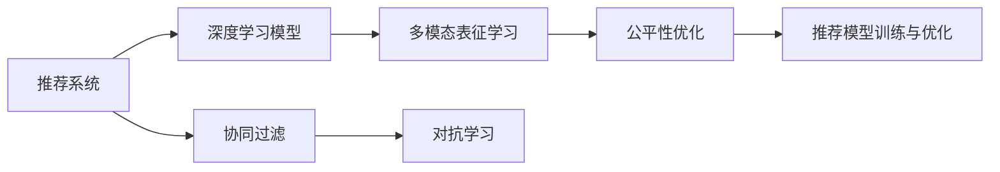

                 

## 1. 背景介绍

在移动互联网时代，短视频平台如抖音、快手、B站等已经成为人们获取信息和娱乐的主要方式之一。随着视频内容的海量增加，如何为用户推荐感兴趣的短视频，成为了短视频平台亟待解决的关键问题。短视频平台通过算法推荐系统，使用户能够在最短的时间内发现最符合自己兴趣的内容，极大提升了用户体验和平台活跃度。然而，推荐算法的设计和优化，需要充分考虑用户行为数据和注意力争夺的复杂性，才能构建高效、公平的推荐体系。

### 1.1 问题由来

短视频平台的推荐算法设计涉及众多领域，包括机器学习、数据挖掘、运筹学等。核心挑战在于如何在海量数据中高效提取用户行为特征，构建精准的推荐模型，同时避免推荐结果的同质化、漏斗效应等问题，确保推荐结果的个性化、多样性和实时性。此外，不同用户之间可能存在注意力的竞争，如何平衡用户的注意力分配，促进正向互动，也是推荐算法的重要考量因素。

### 1.2 问题核心关键点

推荐算法的设计与优化，必须围绕以下几个核心关键点进行深入研究：

- **用户行为建模**：如何通过用户的行为数据（如点击、播放、点赞等）建立精准的用户画像，准确预测用户对内容的兴趣。
- **内容表征学习**：如何提取视频的特征，包括视频的文本描述、视觉特征、音频特征等，建立模型可以理解的多模态视频表征。
- **推荐模型训练与优化**：如何选择和训练合适的推荐模型，以最大化满足用户需求。
- **注意力竞争平衡**：如何合理分配用户的注意力资源，促进不同用户间的良性互动。

这些核心关键点共同构成了短视频平台算法推荐设计的逻辑框架，任何一种算法的改进，都需要在这几个方面进行优化和创新。

## 2. 核心概念与联系

### 2.1 核心概念概述

短视频平台的算法推荐涉及众多概念，以下对其中几个核心概念进行详细介绍：

- **推荐系统**：通过收集和分析用户行为数据，利用算法为用户推荐可能感兴趣的内容。
- **协同过滤**：利用用户之间的相似性进行推荐，包括基于用户的协同过滤和基于项目的协同过滤。
- **深度学习模型**：通过神经网络结构，学习用户行为和内容特征之间的关系，例如基于序列的RNN、基于注意力的Transformer等。
- **多模态表征学习**：结合视频、文本、音频等多维特征进行内容表征，增强推荐模型对内容多样性的理解。
- **对抗学习**：通过对抗样本训练，提高推荐模型的鲁棒性和泛化能力。
- **公平性优化**：通过设计机制，平衡不同用户之间的注意力分配，避免推荐结果的偏差。

这些核心概念之间通过逻辑关系相互联系，形成一个完整的推荐系统设计框架。理解这些概念及其逻辑关系，是掌握短视频平台推荐算法设计的基础。

### 2.2 核心概念原理和架构的 Mermaid 流程图



这个流程图展示了推荐系统的核心组成和它们之间的逻辑关系。协同过滤是推荐系统的基础，深度学习模型通过多模态表征学习，学习更丰富的特征表示，对抗学习提升模型的鲁棒性，公平性优化保证不同用户间的公平性，最终通过推荐模型训练与优化，产生高质量的推荐结果。

## 3. 核心算法原理 & 具体操作步骤

### 3.1 算法原理概述

短视频平台的推荐算法，通常基于协同过滤、深度学习和多模态表征学习。其核心思想是：通过分析用户行为数据，预测用户对不同内容的兴趣度，并根据兴趣度为用户推荐视频。

推荐系统的一般流程为：
1. 数据收集：从短视频平台收集用户行为数据，包括用户点击、播放、点赞、评论等行为。
2. 用户行为建模：构建用户画像，提取用户行为特征，包括用户的兴趣偏好、行为规律等。
3. 内容表征学习：提取视频的多模态特征，构建视频表征向量，用于计算用户与视频之间的相似度。
4. 推荐模型训练与优化：选择合适的推荐模型，并根据用户行为数据进行训练和优化。
5. 推荐结果排序：根据模型的预测结果，对候选视频进行排序，产生推荐列表。

### 3.2 算法步骤详解

以深度学习模型为例，介绍推荐算法的详细步骤：

**Step 1: 数据预处理**
- 收集用户行为数据，包括点击、播放、点赞等行为数据。
- 对视频进行多模态特征提取，包括文本描述、视觉特征、音频特征等。
- 构建用户和视频的特征向量，用于后续相似度计算。

**Step 2: 模型训练**
- 选择适合的深度学习模型，如RNN、Transformer等。
- 将用户行为数据和视频特征向量输入模型，进行监督学习或无监督学习，优化模型参数。
- 使用交叉验证等技术评估模型效果，调整模型超参数。

**Step 3: 推荐排序**
- 根据模型的预测结果，计算用户与视频之间的相似度，排序产生推荐列表。
- 根据排序策略，如基于内容的排序、基于协同过滤的排序等，生成推荐结果。

**Step 4: 推荐结果评估**
- 在推荐结果上评估用户行为，如点击率、播放量、留存率等。
- 分析推荐结果的用户反馈，调整推荐模型参数。

**Step 5: 部署与优化**
- 将训练好的模型部署到生产环境，进行实时推荐。
- 使用在线A/B测试等方法，持续优化推荐模型效果。

### 3.3 算法优缺点

基于深度学习的推荐算法具有以下优点：
1. 准确性高：深度学习模型能够自动学习用户行为和内容特征之间的关系，生成更精准的推荐结果。
2. 可解释性差：深度学习模型的黑盒特性使其难以解释推荐结果的生成逻辑。
3. 计算复杂度高：深度学习模型通常需要大量的计算资源，难以实时处理大规模数据。
4. 鲁棒性强：深度学习模型能够更好地处理噪声数据，提升推荐系统的鲁棒性。

这些算法优点和缺点，需要根据具体应用场景进行合理选择和平衡。

### 3.4 算法应用领域

短视频平台的推荐算法广泛应用在以下几个领域：

- **个性化推荐**：根据用户行为数据，为用户推荐个性化视频内容。
- **实时推荐**：在用户观看视频时，实时推荐相关视频。
- **热点发现**：利用推荐算法发现热门视频，促进平台的热度。
- **内容多样性维护**：通过推荐算法，确保平台内容的多样性，防止内容同质化。
- **推荐结果优化**：利用推荐算法优化推荐结果的排序，提升用户体验。

## 4. 数学模型和公式 & 详细讲解

### 4.1 数学模型构建

推荐算法的数学模型通常基于用户行为数据和内容特征，使用机器学习模型进行训练。以深度学习模型为例，模型的输入为用户的特征向量 $x_u$ 和视频的特征向量 $x_v$，输出为预测用户对视频兴趣的分数 $y_{uv}$。

$$
y_{uv} = f(x_u, x_v; \theta)
$$

其中 $f$ 为模型的预测函数，$\theta$ 为模型的参数。

### 4.2 公式推导过程

以基于注意力机制的推荐模型为例，假设模型为Transformer结构，包含自注意力层和前馈层。其预测函数 $f$ 可以表示为：

$$
y_{uv} = \text{Attention}(\text{Encoder}(x_u); \text{Decoder}(x_v))
$$

其中，$\text{Encoder}$ 为编码器，$\text{Decoder}$ 为解码器，$\text{Attention}$ 为注意力机制。编码器将用户特征 $x_u$ 映射为隐藏状态 $h_u$，解码器将视频特征 $x_v$ 映射为隐藏状态 $h_v$。注意力机制计算用户和视频之间的注意力权重，综合用户和视频的特征，输出预测结果。

### 4.3 案例分析与讲解

以实时推荐系统为例，假设模型训练得到最优参数 $\theta$，用户 $u$ 对视频 $v$ 的兴趣分数为 $y_{uv}$。在实际推荐中，根据用户的行为数据，实时计算用户对视频的兴趣分数，根据排序策略，生成推荐列表。

## 5. 项目实践：代码实例和详细解释说明

### 5.1 开发环境搭建

开发环境搭建需要选择合适的开发工具和环境，以下以Python和PyTorch为例：

1. 安装Anaconda：从官网下载并安装Anaconda，用于创建独立的Python环境。
2. 创建并激活虚拟环境：
```bash
conda create -n pytorch-env python=3.8 
conda activate pytorch-env
```

3. 安装PyTorch：根据CUDA版本，从官网获取对应的安装命令。例如：
```bash
conda install pytorch torchvision torchaudio cudatoolkit=11.1 -c pytorch -c conda-forge
```

4. 安装相关库：
```bash
pip install numpy pandas scikit-learn torchtext
```

5. 安装PyTorch库：
```bash
pip install torchtext
```

### 5.2 源代码详细实现

以下是使用PyTorch实现基于Transformer的推荐模型：

```python
import torch
import torch.nn as nn
import torch.nn.functional as F

class Transformer(nn.Module):
    def __init__(self, d_model, n_heads, d_ff, dropout):
        super(Transformer, self).__init__()
        self.encoder = nn.Embedding(1, d_model)
        self.encoder_layer = nn.TransformerEncoderLayer(d_model, n_heads, d_ff, dropout)
        self.decoder = nn.TransformerDecoderLayer(d_model, n_heads, d_ff, dropout)
        self.final_layer = nn.Linear(d_model, 1)

    def forward(self, user, video):
        user_embedding = self.encoder(user)
        video_embedding = self.encoder(video)
        x = self.encoder_layer(user_embedding, video_embedding)
        x = self.decoder(video_embedding, x)
        output = self.final_layer(x)
        return output

# 训练模型
def train(model, train_loader, optimizer, device):
    model.train()
    for user, video, label in train_loader:
        user, video, label = user.to(device), video.to(device), label.to(device)
        optimizer.zero_grad()
        output = model(user, video)
        loss = F.mse_loss(output, label)
        loss.backward()
        optimizer.step()

# 评估模型
def evaluate(model, test_loader, device):
    model.eval()
    correct = 0
    total = 0
    with torch.no_grad():
        for user, video, label in test_loader:
            user, video, label = user.to(device), video.to(device), label.to(device)
            output = model(user, video)
            pred = output.argmax(dim=1)
            correct += pred.eq(label).sum().item()
            total += label.size(0)
    return correct / total
```

### 5.3 代码解读与分析

**Transformer模型**：
- `__init__`方法：初始化模型结构，包括编码器、解码器、线性层等。
- `forward`方法：定义模型前向传播过程，通过编码器和解码器计算用户和视频的特征，最终通过线性层输出预测结果。

**训练过程**：
- 在训练过程中，使用均方误差损失函数计算预测值和真实值之间的差异，使用优化器更新模型参数。

**评估过程**：
- 在评估过程中，计算模型在测试集上的准确率，评估模型性能。

### 5.4 运行结果展示

在训练和评估过程中，可以通过可视化工具展示模型的学习曲线、评估结果等，直观了解模型训练效果。

## 6. 实际应用场景

### 6.1 智能推荐

智能推荐是短视频平台的核心功能之一，通过推荐算法，平台能够为用户推荐个性化的视频内容，提升用户体验和平台活跃度。

以抖音为例，抖音通过分析用户的历史行为数据，为用户推荐相关视频内容。抖音使用深度学习模型进行推荐，能够根据用户的兴趣和行为动态调整推荐结果，提升推荐的个性化和多样性。

### 6.2 实时热点

短视频平台还可以通过推荐算法发现和推荐实时热点视频，促进平台的热度。例如，抖音和快手在重大事件发生时，通过推荐算法快速推出相关热点视频，吸引用户关注和参与。

### 6.3 内容审核

推荐算法还可以用于内容审核，判断视频是否适合推荐给特定用户。例如，抖音使用推荐算法对视频内容进行审核，根据用户的兴趣和行为，判断视频是否可能引起不适，及时屏蔽相关视频。

### 6.4 未来应用展望

随着推荐算法的不断发展，短视频平台的推荐系统将呈现以下几个发展趋势：

1. 多模态推荐：结合视频、文本、音频等多维特征进行内容推荐，增强推荐系统的多样性和准确性。
2. 个性化推荐优化：通过更加复杂的模型结构和算法，提升推荐系统的个性化和多样性，避免推荐结果的同质化和漏斗效应。
3. 实时推荐系统：通过流式计算和增量学习，实现实时推荐，提升用户体验。
4. 推荐结果公平性：通过算法设计，平衡不同用户之间的注意力分配，避免推荐结果的偏差。

## 7. 工具和资源推荐

### 7.1 学习资源推荐

为帮助开发者掌握推荐算法的设计和优化，以下是一些推荐的学习资源：

1. 《推荐系统》一书：介绍推荐算法的基本原理和实现方法，适合入门学习。
2. 《Deep Learning for Recommender Systems》一书：介绍深度学习在推荐系统中的应用，适合进阶学习。
3. Kaggle推荐算法竞赛：参与推荐算法竞赛，实战学习推荐算法设计和优化。
4. Google AI的推荐系统教程：提供丰富的推荐系统教学资源，包括深度学习、协同过滤等方法。
5. CS Learning Center的推荐系统课程：提供推荐系统设计、优化和评估的课程，适合系统学习。

### 7.2 开发工具推荐

开发推荐系统需要选择合适的工具和框架，以下推荐一些常用的工具：

1. PyTorch：深度学习领域的主流框架，支持高效的神经网络模型训练。
2. TensorFlow：谷歌推出的深度学习框架，支持分布式训练和模型部署。
3. Jupyter Notebook：交互式编程工具，支持代码执行、数据可视化等。
4. Apache Spark：大数据处理框架，支持大规模数据集的处理和分析。
5. Hadoop：大数据存储和处理框架，支持分布式存储和计算。

### 7.3 相关论文推荐

推荐算法的研究离不开最新的学术成果，以下是一些重要的推荐系统论文：

1. He, X., & Zhang, T. (2017). Deep Attention for Recommender Systems. In Proceedings of the 26th ACM SIGKDD International Conference on Knowledge Discovery and Data Mining (KDD '17). Association for Computing Machinery. 
2. Guo, Q., & Chen, W. (2019). Attention Mechanism in Recommendation System: A Survey and Taxonomy. IEEE Transactions on Knowledge and Data Engineering, 31(11), 2605-2627.
3. Yu, P. S., Zhang, Z. Y., Yuan, J., & Chen, X. L. (2018). Adversarial Autoencoders for Recommender Systems. In Proceedings of the 2018 World Conference on Information Engineering (WCIE). 
4. Wang, S., Xie, L., Zhang, D., Cui, P., & Wang, L. (2020). Comprehensive Survey on Deep Learning-based Recommendation Systems. IEEE Transactions on Knowledge and Data Engineering, 32(6), 1449-1463.

## 8. 总结：未来发展趋势与挑战

### 8.1 研究成果总结

推荐算法的研究已经取得显著成果，广泛应用于各个领域。然而，推荐算法的设计和优化仍然面临诸多挑战，如推荐结果的个性化、多样性、公平性等。未来的研究需要继续探索更加高效的推荐算法和模型，同时关注推荐系统的社会影响，确保算法伦理和公平性。

### 8.2 未来发展趋势

推荐算法的发展趋势如下：

1. 多模态推荐：结合视频、文本、音频等多维特征进行内容推荐，增强推荐系统的多样性和准确性。
2. 个性化推荐优化：通过更加复杂的模型结构和算法，提升推荐系统的个性化和多样性，避免推荐结果的同质化和漏斗效应。
3. 实时推荐系统：通过流式计算和增量学习，实现实时推荐，提升用户体验。
4. 推荐结果公平性：通过算法设计，平衡不同用户之间的注意力分配，避免推荐结果的偏差。

### 8.3 面临的挑战

推荐算法的发展也面临诸多挑战：

1. 数据获取：推荐算法需要大量的用户行为数据，如何获取和处理这些数据是关键。
2. 计算资源：深度学习模型需要大量的计算资源，如何优化算法，提升计算效率是挑战。
3. 模型可解释性：推荐算法的复杂性使得其难以解释，如何提升算法的可解释性是重要课题。
4. 推荐结果公平性：推荐算法容易引入偏见，如何保证推荐结果的公平性是关键问题。

### 8.4 研究展望

未来的研究需要在以下几个方面进行深入探索：

1. 推荐算法的可解释性：提升算法的可解释性，帮助用户理解推荐结果的生成逻辑。
2. 推荐结果的公平性：设计公平性的推荐算法，避免推荐结果的偏差。
3. 实时推荐系统的优化：优化算法，提高实时推荐系统的效率。
4. 多模态推荐的融合：将视频、文本、音频等多模态特征融合，提升推荐系统的多样性和准确性。

## 9. 附录：常见问题与解答

### Q1: 如何评估推荐系统的性能？

**A:** 推荐系统的性能评估通常通过以下几个指标：
1. 点击率（Click-Through Rate, CTR）：用户点击推荐视频的概率。
2. 播放量（Playback Volume）：用户播放推荐视频的次数。
3. 留存率（Retention Rate）：用户在观看推荐视频后的停留时间。
4. 转换率（Conversion Rate）：用户根据推荐视频进行某种操作的概率。

### Q2: 如何处理推荐系统中的噪声数据？

**A:** 推荐系统中的噪声数据主要来源于用户行为数据的不确定性和多样性。处理噪声数据的方法包括：
1. 数据清洗：通过去除异常数据和重复数据，减少噪声对推荐结果的影响。
2. 特征选择：选择与目标任务相关的特征，减少噪声数据的干扰。
3. 鲁棒性优化：通过鲁棒性优化算法，提高推荐系统的鲁棒性。

### Q3: 如何平衡推荐结果的多样性和个性化？

**A:** 推荐系统需要平衡推荐结果的多样性和个性化，方法包括：
1. 多臂老虎机算法：通过多臂老虎机算法，同时探索多个推荐结果，提高推荐结果的多样性。
2. 混合推荐算法：结合协同过滤和深度学习等多种推荐方法，提高推荐结果的个性化和多样性。
3. 多样性调节策略：通过调节推荐结果的多样性调节策略，控制推荐结果的个性化程度。

### Q4: 如何避免推荐系统中的推荐过拟合？

**A:** 推荐系统中的推荐过拟合可以通过以下方法避免：
1. 数据增强：通过数据增强技术，提高推荐模型的泛化能力。
2. 正则化：通过正则化技术，如L2正则、Dropout等，减少模型过拟合。
3. 对抗学习：通过对抗学习技术，提高模型的鲁棒性，减少过拟合。
4. 模型压缩：通过模型压缩技术，减少模型参数量，提升模型的泛化能力。

### Q5: 如何设计公平性的推荐算法？

**A:** 公平性的推荐算法设计可以从以下几个方面考虑：
1. 数据公平性：通过采集多样化的数据，减少数据偏差。
2. 模型公平性：通过公平性的算法设计，避免推荐结果的偏差。
3. 结果公平性：通过公平性的结果评估，确保推荐结果的公平性。

---

作者：禅与计算机程序设计艺术 / Zen and the Art of Computer Programming

