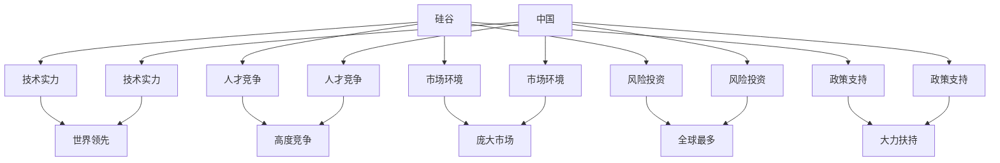

                 

# 硅谷vs中国：AI创业环境的对比

> 关键词：人工智能, 创业环境, 硅谷, 中国, 创新, 风险投资, 研发实力, 人才竞争, 政策支持

## 1. 背景介绍

### 1.1 问题由来
随着人工智能(AI)技术的快速崛起，全球各地涌现出一批批AI创业公司，争夺技术高地和市场份额。其中，美国硅谷和中国的北京、深圳等地成为了全球两大AI创业的中心。这两大地区不仅在技术上各有千秋，其创业环境、市场前景、人才培养、政策支持等方面也存在显著差异。了解这些差异，对于AI创业者和投资人有重要意义。

### 1.2 问题核心关键点
本文将从技术实力、人才竞争、市场环境、风险投资、政策支持等方面，全面对比硅谷和中国两大AI创业环境的优劣势。通过分析这些因素，希望能够为AI创业者和投资人们提供更为深刻的洞察，助力其在全球AI创业的激烈竞争中占据有利位置。

### 1.3 问题研究意义
通过对硅谷与中国AI创业环境的对比研究，本文旨在探讨以下问题：
1. 哪些因素是推动硅谷和中国AI创业成功的关键？
2. 硅谷与中国在AI创业环境中的优势和劣势分别是什么？
3. 对于AI创业者和投资者来说，如何评估和选择适宜的创业环境？

## 2. 核心概念与联系

### 2.1 核心概念概述

为了更好地理解硅谷与中国AI创业环境的对比，本文将介绍几个关键概念及其之间的联系：

- **硅谷**：指的是美国加利福尼亚州旧金山湾区的一个地区，是世界科技创新的中心之一，拥有众多顶尖大学和研究机构，以及大量的风险投资。
- **中国**：以北京、深圳为代表的中国AI创业环境，依托于快速发展的科技产业和庞大的市场需求，吸引了大量人才和资本。
- **人工智能创业环境**：指AI创业者在特定区域内所面临的各类资源、政策、文化、人才等条件的总和。
- **风险投资**：指专门投资于高成长潜力的初创企业，特别是科技和创新型企业。
- **研发实力**：指企业在技术创新、产品研发方面的能力，反映了一个区域内的科技水平和创新能力。
- **人才竞争**：指全球范围内对高技能人才的争夺，特别是在AI、数据科学等领域的顶级人才。
- **政策支持**：指政府为推动科技创新和产业升级，出台的一系列激励政策、税收优惠、研发补贴等措施。

这些核心概念之间的逻辑关系可以通过以下Mermaid流程图来展示：



这个流程图展示了硅谷和中国两大AI创业环境的关键特征及其相互关联：

1. **技术实力**：硅谷长期以来一直是全球技术创新的中心，拥有众多世界领先的大学和研究机构。中国在近年来迅速崛起，也有一批技术创新实力强劲的企业和研究机构。
2. **人才竞争**：硅谷吸引了许多来自世界各地的顶级人才，竞争异常激烈。中国在人才吸引方面也有显著进步，特别是通过提供优厚的待遇和科研条件吸引了一大批国内外高技能人才。
3. **市场环境**：硅谷拥有庞大且成熟的市场需求，创新产品快速迭代。中国市场需求巨大，尤其在移动互联网、电商等领域表现突出。
4. **风险投资**：硅谷聚集了全球最多的风险投资，为AI创业公司提供了充足的资金支持。中国风险投资也在快速增长，但整体规模仍与硅谷存在差距。
5. **政策支持**：中国政府为推动科技创新提供了强有力的政策支持，包括税收优惠、研发补贴等。硅谷虽也有政府支持，但在规模和力度上略逊于中国。

## 3. 核心算法原理 & 具体操作步骤
### 3.1 算法原理概述

在进行硅谷与中国AI创业环境的对比时，本文将采用数据对比和案例分析的方法，从多个维度评估两者的优势和劣势。以下是本文将重点探讨的几个方面：

1. **技术实力**：评估硅谷和中国在AI核心技术上的发展水平和创新能力。
2. **人才竞争**：比较硅谷与中国在人才吸引和培养方面的表现。
3. **市场环境**：分析硅谷和中国在不同领域的市场需求和创新生态。
4. **风险投资**：对比硅谷与中国在风险投资资源和投资环境上的差异。
5. **政策支持**：研究硅谷与中国在政府政策上的支持力度和方向。

### 3.2 算法步骤详解

本文将从数据收集、处理和分析三个方面，详细介绍对比硅谷与中国AI创业环境的详细步骤：

**Step 1: 数据收集**
- 收集硅谷和中国AI创业公司、研究机构、高校的最新数据，包括核心技术专利、人才招聘情况、市场表现、投资规模等。
- 收集政府政策、市场报告、行业分析等公共信息，用于综合评估两地的创业环境。

**Step 2: 数据处理**
- 使用Python和R等工具进行数据分析，对收集到的数据进行清洗、筛选和预处理，确保数据的准确性和可靠性。
- 应用数据可视化工具如Tableau或Power BI，将分析结果直观展示，便于理解和比较。

**Step 3: 数据对比分析**
- 将硅谷和中国AI创业环境的数据进行对比，找出两者之间的差距和相似之处。
- 使用统计分析方法和机器学习算法，挖掘数据背后的深层规律，得出科学结论。

### 3.3 算法优缺点

本文的数据对比和分析方法，具有以下优点和缺点：

**优点**：
1. **全面性**：通过多维度的数据收集和处理，能够全面评估硅谷与中国AI创业环境的优劣势。
2. **客观性**：使用公开数据和第三方分析，避免了主观判断的干扰，保证结论的客观性。
3. **可操作性**：采用数据分析工具和算法，使得分析过程具有较强的可操作性和可复制性。

**缺点**：
1. **数据局限性**：部分数据可能存在遗漏或不够全面，影响分析结果的准确性。
2. **动态性**：AI创业环境不断发展变化，静态数据对比可能无法完全反映最新的趋势。
3. **复杂性**：数据分析和对比涉及多个变量和因素，分析过程较为复杂。

### 3.4 算法应用领域

本文的数据对比和分析方法，适用于以下多个领域：
- **学术研究**：为学者提供定量化的研究工具，支持AI创业和政策研究的深入分析。
- **政府政策制定**：为政府提供科学依据，支持制定更有针对性的政策支持措施。
- **投资决策**：为投资者提供客观的数据支持，帮助其选择适宜的创业环境。
- **企业战略规划**：为企业提供市场竞争情报，辅助制定战略规划和市场布局。

## 4. 数学模型和公式 & 详细讲解  
### 4.1 数学模型构建

本文将采用量化分析的方法，构建数学模型来比较硅谷与中国AI创业环境的优劣势。以下是一个简单的示例：

假设我们收集了两地的风险投资规模数据，设硅谷的风险投资总额为 $X$，中国为 $Y$，则风险投资规模对比的数学模型为：

$$
\text{风险投资对比} = \frac{X}{Y}
$$

**Step 1: 数据收集**
- 收集硅谷和中国风险投资市场的最新数据，如总规模、主要投资者、投资方向等。
- 将数据整理成适合模型计算的格式，确保数据一致性和完整性。

**Step 2: 模型构建**
- 使用Python进行数据处理和模型计算，计算出风险投资总额的比例。
- 分析该比例的变化趋势，找出两地风险投资规模的差距。

**Step 3: 结果解读**
- 解释模型计算结果的意义，分析背后的原因和影响。
- 提出基于数据对比的策略建议，帮助AI创业者和投资者做出更为科学的选择。

### 4.2 公式推导过程

以风险投资总额比例的计算为例，推导其公式：

设硅谷和中国风险投资总额分别为 $X$ 和 $Y$，则风险投资总额比例为：

$$
\frac{X}{Y} = \frac{\sum_{i=1}^n x_i}{\sum_{i=1}^n y_i}
$$

其中 $x_i$ 和 $y_i$ 分别为硅谷和中国第 $i$ 个风险投资项目的总额。

通过推导，我们可以得到硅谷与中国风险投资规模的对比公式，帮助进行定量分析。

### 4.3 案例分析与讲解

以下是一个具体的案例分析示例，展示如何通过数据对比得出结论：

**案例背景**：
- 假设我们收集了硅谷和中国在过去一年的风险投资数据，包括总金额、主要投资者和投资方向等。
- 我们将数据整理成表格形式，使用Python进行计算和可视化。

**案例分析**：
- 首先，我们计算出硅谷和中国的风险投资总额比例，分析其变化趋势。
- 通过可视化工具展示出两地风险投资总额比例的变化曲线，找出异常点和波动原因。
- 根据分析结果，提出相应的策略建议，如加大对中国的风险投资力度，帮助硅谷企业开拓新市场等。

## 5. 项目实践：代码实例和详细解释说明
### 5.1 开发环境搭建

在进行硅谷与中国AI创业环境的对比研究时，我们需要搭建一个完善的开发环境，以便进行数据分析和可视化。以下是搭建开发环境的步骤：

1. **安装Python和相关库**：
   - 安装Python 3.x版本，建议使用Anaconda或Miniconda。
   - 安装常用的数据分析库，如Pandas、NumPy、Matplotlib等。
   - 安装数据可视化工具，如Tableau或Power BI。

2. **数据收集和管理**：
   - 收集硅谷和中国AI创业环境的公开数据，包括技术实力、人才竞争、市场环境、风险投资、政策支持等方面的信息。
   - 将数据整理成适合分析的格式，使用Pandas进行数据清洗和预处理。

3. **分析工具配置**：
   - 使用Jupyter Notebook进行数据处理和分析，便于代码和结果的共享和协作。
   - 安装Jupyter扩展包如Jupyter-TensorBoard，进行模型可视化。

完成上述步骤后，即可在Jupyter Notebook中编写数据分析代码，进行对比分析。

### 5.2 源代码详细实现

以下是一个简单的Python代码示例，展示如何使用Pandas进行数据处理和可视化：

```python
import pandas as pd
import matplotlib.pyplot as plt

# 加载数据
data = pd.read_csv('investment_data.csv')

# 数据处理
data['total_investment'] = data['rounds'] * data['avg_round_size']

# 可视化
plt.figure(figsize=(10, 6))
plt.plot(data['year'], data['total_investment'], label='Total Investment')
plt.xlabel('Year')
plt.ylabel('Total Investment (USD)')
plt.title('Total Investment in AI Startups by Year')
plt.legend()
plt.show()
```

### 5.3 代码解读与分析

让我们详细解读一下关键代码的实现细节：

**代码1: 数据加载**

```python
data = pd.read_csv('investment_data.csv')
```

**代码解读**：
- 使用Pandas的`read_csv`函数，加载名为`investment_data.csv`的数据文件。
- 数据文件应包含硅谷和中国AI创业公司、风险投资相关的统计数据。

**代码2: 数据处理**

```python
data['total_investment'] = data['rounds'] * data['avg_round_size']
```

**代码解读**：
- 使用Pandas的数据操作功能，计算每个国家和年份的总投资额。
- 假设数据集中包含`rounds`（轮数）和`avg_round_size`（每轮平均投资额）两个字段，通过相乘得到总投资额。

**代码3: 数据可视化**

```python
plt.figure(figsize=(10, 6))
plt.plot(data['year'], data['total_investment'], label='Total Investment')
plt.xlabel('Year')
plt.ylabel('Total Investment (USD)')
plt.title('Total Investment in AI Startups by Year')
plt.legend()
plt.show()
```

**代码解读**：
- 使用Matplotlib进行数据可视化，绘制硅谷和中国AI创业公司总投资额的年度变化曲线。
- 设置图形的大小、坐标轴标签和标题，并添加图例进行说明。
- 最终展示图形，便于直观理解和分析。

## 6. 实际应用场景
### 6.1 硅谷的应用场景

硅谷作为全球AI创业的标杆，其AI创业环境具有以下几个主要应用场景：

1. **顶尖研究机构和大学**：
   - 硅谷拥有斯坦福大学、加州大学伯克利分校等世界顶尖的研究机构，为AI创业提供了强大的科研支撑。

2. **高密度风险投资**：
   - 硅谷聚集了全球最多的风险投资，为AI创业公司提供了充足的资金支持。

3. **科技巨头支持**：
   - 像Google、Facebook、Apple等科技巨头在硅谷设有研发中心，提供技术支持和合作机会。

4. **丰富的创业生态**：
   - 硅谷拥有丰富的创业生态系统，包括孵化器、加速器、天使投资人等，为AI创业提供了良好的外部环境。

5. **产业集群效应**：
   - 硅谷的AI创业公司聚集在一起，形成产业集群效应，促进了技术的快速迭代和市场扩展。

### 6.2 中国应用场景

中国的AI创业环境也具有独特的应用场景，主要包括：

1. **庞大的市场需求**：
   - 中国拥有庞大的互联网用户和市场规模，尤其是在移动互联网、电商等领域，提供了丰富的应用场景。

2. **政策大力扶持**：
   - 中国政府出台了一系列政策支持AI产业发展，如税收优惠、研发补贴、创新基金等。

3. **人才竞争激烈**：
   - 中国通过提供优厚的待遇和科研条件，吸引了一大批国内外高技能人才，特别是在数据科学、AI等领域。

4. **多样化的融资渠道**：
   - 中国不仅有大量的风险投资，还有政府背景的创业投资基金，提供多元化的融资渠道。

5. **政策优势明显**：
   - 中国政府在AI创业方面提供了强有力的政策支持，如“新工科”、“双创”等政策，推动了AI产业的发展。

### 6.3 未来应用展望

展望未来，硅谷与中国AI创业环境在多个方面将继续演变和升级：

1. **AI创业公司的技术实力将进一步提升**：
   - 硅谷和中国都将通过技术创新和研发投入，提升AI创业公司的技术实力和产品竞争力。

2. **AI创业环境将更加国际化**：
   - 随着全球化的深入发展，AI创业公司将在全球范围内寻找机会，进行技术合作和市场拓展。

3. **风险投资和融资渠道将更加多样化**：
   - 硅谷和中国都将探索新的融资渠道，如私募股权、众筹等，为AI创业公司提供更多资金支持。

4. **政策支持将更加全面和精准**：
   - 政府将制定更为细致和精准的政策，推动AI创业公司的发展，同时加强对AI技术的监管。

5. **人工智能伦理和法律问题将受到更多关注**：
   - 随着AI技术的应用范围扩大，伦理和法律问题将受到更多关注，相关法规和规范将逐步完善。

## 7. 工具和资源推荐
### 7.1 学习资源推荐

为了帮助开发者和投资者更好地理解硅谷与中国AI创业环境的优劣，以下是一些推荐的学习资源：

1. **《人工智能创业指南》**：一本系统介绍AI创业的书籍，涵盖技术、市场、融资、政策等多个方面。
2. **《硅谷与中国》**：一本关于中美创业环境对比的书籍，深度剖析两地的优势和劣势。
3. **《人工智能创新之路》**：一本介绍全球AI创新趋势和技术前沿的书籍，提供丰富的案例分析。
4. **《人工智能产业发展报告》**：由国际知名咨询机构发布的年度报告，提供最新的AI市场数据和趋势分析。
5. **Coursera和edX在线课程**：提供AI创业相关的课程，涵盖技术、市场、管理等多个方面。

通过学习这些资源，相信读者能够深入理解硅谷与中国AI创业环境的异同，为自身发展提供有价值的参考。

### 7.2 开发工具推荐

为了进行硅谷与中国AI创业环境的对比研究，以下是一些推荐的开发工具：

1. **Python和R**：常用的数据分析语言，支持数据处理和可视化。
2. **Jupyter Notebook**：支持Python和R等多种语言，便于代码共享和协作。
3. **Tableau和Power BI**：强大的数据可视化工具，帮助直观展示分析结果。
4. **GitHub**：全球最大的代码托管平台，便于代码版本管理和共享。

合理利用这些工具，可以显著提升硅谷与中国AI创业环境对比研究的效率，为实际应用提供可靠的数据支持。

### 7.3 相关论文推荐

为进一步深入理解硅谷与中国AI创业环境的差异，以下是一些推荐的相关论文：

1. **《硅谷与中国的AI创业比较》**：比较硅谷和中国AI创业环境的优劣势，提出未来发展的建议。
2. **《AI创业的全球布局》**：分析全球AI创业环境，比较不同国家的优势和劣势。
3. **《全球AI创业趋势分析》**：深入分析全球AI创业的最新趋势和技术发展方向。

这些论文为读者提供了更为深入的研究视角，有助于理解硅谷与中国AI创业环境的演变和发展方向。

## 8. 总结：未来发展趋势与挑战
### 8.1 总结

本文通过对硅谷与中国AI创业环境的全面对比分析，探讨了以下几个关键问题：
1. 哪些因素是推动硅谷和中国AI创业成功的关键？
2. 硅谷与中国在AI创业环境中的优势和劣势分别是什么？
3. 对于AI创业者和投资者来说，如何评估和选择适宜的创业环境？

本文通过数据对比和案例分析，从技术实力、人才竞争、市场环境、风险投资、政策支持等多个维度，全面展示了硅谷与中国AI创业环境的异同。通过深入剖析这些差异，希望为AI创业者和投资者提供有价值的参考和指导。

### 8.2 未来发展趋势

展望未来，硅谷与中国AI创业环境将继续面临诸多机遇和挑战：

1. **技术创新不断加速**：
   - 硅谷和中国都将继续加大研发投入，推动技术创新和产品迭代。

2. **全球市场竞争加剧**：
   - 随着AI技术的普及，全球市场竞争将更加激烈，企业需要不断提升自身竞争力。

3. **融资渠道和风险投资**：
   - 未来，硅谷和中国都将探索更多融资渠道，丰富风险投资市场，支持AI创业公司的发展。

4. **政策环境不断优化**：
   - 政府将继续出台更多支持AI创业的政策，优化营商环境，推动产业升级。

5. **国际合作和交流增加**：
   - 全球AI创业者将更加注重国际合作和交流，共同推动技术进步和市场扩展。

### 8.3 面临的挑战

尽管硅谷与中国AI创业环境在多个方面具有显著优势，但也面临诸多挑战：

1. **人才竞争激烈**：
   - 人才竞争将日益激烈，企业需要持续提升人才吸引和培养能力。

2. **技术突破难度大**：
   - AI技术难度大，研发投入高，需要持续的技术创新和突破。

3. **政策环境变化快**：
   - 政策环境变化快，企业需要灵活应对政策调整，把握发展机遇。

4. **市场需求多样**：
   - 市场需求日益多样化，企业需要不断创新产品和服务，满足不同用户的需求。

5. **风险投资波动大**：
   - 风险投资环境波动大，企业需要制定合理的融资策略，降低风险。

### 8.4 研究展望

未来的研究应聚焦于以下几个方向：

1. **技术实力提升**：
   - 进一步提升技术实力，推动AI创业公司的技术创新和产品迭代。

2. **人才吸引和培养**：
   - 加强人才吸引和培养，提升企业的人力资源竞争力。

3. **市场开拓和国际合作**：
   - 拓展市场，推动国际合作，提升全球竞争力。

4. **风险管理和投资策略**：
   - 优化融资策略，降低风险，提升投资回报率。

5. **政策环境优化**：
   - 研究政策环境变化，制定更为精准的政策支持措施。

综上所述，硅谷与中国AI创业环境的对比分析，不仅能够帮助AI创业者和投资者做出更科学的选择，也能够为全球AI产业的发展提供有价值的参考。

## 9. 附录：常见问题与解答

**Q1：如何理解硅谷与中国AI创业环境的差异？**

A: 硅谷与中国AI创业环境的差异主要体现在以下几个方面：
1. 技术实力：硅谷拥有更多的顶尖大学和研究机构，技术实力更强。中国近年来也在快速追赶，特别是在移动互联和电商等领域表现突出。
2. 人才竞争：硅谷吸引了许多世界顶级人才，竞争异常激烈。中国通过提供优厚的待遇和科研条件，吸引了大量国内外高技能人才。
3. 市场环境：硅谷拥有庞大且成熟的市场需求，创新产品快速迭代。中国市场巨大，尤其在移动互联网、电商等领域表现突出。
4. 风险投资：硅谷聚集了全球最多的风险投资，为AI创业公司提供了充足的资金支持。中国风险投资也在快速增长，但整体规模仍与硅谷存在差距。
5. 政策支持：中国政府为推动科技创新提供了强有力的政策支持，如税收优惠、研发补贴等。硅谷虽也有政府支持，但在规模和力度上略逊于中国。

**Q2：哪些因素是推动硅谷和中国AI创业成功的关键？**

A: 推动硅谷和中国AI创业成功的关键因素包括：
1. 技术实力：拥有顶尖的研究机构和高校，推动技术创新和产品迭代。
2. 人才竞争：吸引大量高技能人才，特别是数据科学和AI领域的专业人才。
3. 市场环境：庞大的市场需求和多样化的应用场景，为AI创业提供了广阔的空间。
4. 风险投资：充足的风险投资支持，为创业公司提供资金保障。
5. 政策支持：政府出台一系列支持AI发展的政策，推动产业发展。

**Q3：如何评估硅谷与中国AI创业环境的优劣？**

A: 评估硅谷与中国AI创业环境的优劣，可以从以下几个方面进行：
1. 技术实力：比较两地技术创新能力和科研成果。
2. 人才竞争：分析两地人才吸引和培养能力。
3. 市场环境：考察市场需求和应用场景。
4. 风险投资：评估两地风险投资规模和融资环境。
5. 政策支持：研究政府政策支持力度和效果。

**Q4：未来AI创业公司应如何应对全球化挑战？**

A: AI创业公司应从以下几个方面应对全球化挑战：
1. 技术创新：持续投入研发，提升技术实力和产品竞争力。
2. 市场开拓：积极拓展国际市场，寻找更多的应用场景。
3. 国际合作：加强国际合作，共同推动技术进步和市场扩展。
4. 风险管理：优化融资策略，降低风险，提升投资回报率。
5. 政策响应：及时响应政府政策变化，把握发展机遇。

**Q5：如何提高AI创业公司的全球竞争力？**

A: 提高AI创业公司的全球竞争力，可以从以下几个方面进行：
1. 技术领先：通过技术创新和研发投入，提升公司的技术实力和产品竞争力。
2. 人才战略：吸引和培养高技能人才，提升公司的人力资源竞争力。
3. 市场拓展：积极拓展国际市场，寻找更多的应用场景。
4. 融资策略：优化融资策略，降低风险，提升投资回报率。
5. 政策环境：研究政策环境变化，制定更为精准的政策支持措施。

通过以上分析和建议，希望能够帮助AI创业者和投资者更好地理解和应对硅谷与中国AI创业环境的差异，为自身发展提供有力的支持和指导。

---

作者：禅与计算机程序设计艺术 / Zen and the Art of Computer Programming

