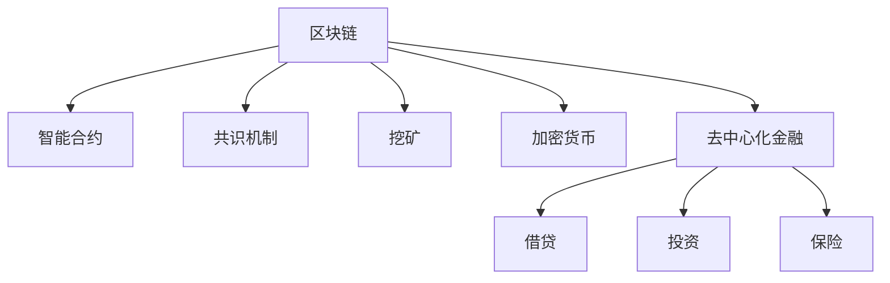

                 

# 硅谷区块链金融创新:去中心化加密货币

## 1. 背景介绍

在过去的几十年里，金融行业一直是科技创新的主战场，无论是传统银行业、证券业还是保险业，都在努力通过新技术实现效率提升和成本降低。然而，现有的金融体系仍然存在诸多问题，如高昂的交易成本、信息不对称、信任问题等。这些问题不仅影响用户体验，还导致金融服务的可达性不平等。

随着互联网和移动设备的普及，消费者对金融服务的需求和期望不断提高，更加快速、便捷、透明的金融解决方案变得尤为重要。在这样的背景下，去中心化加密货币作为一种新的金融创新形式，开始引起全球的广泛关注。

去中心化加密货币（Decentralized Cryptocurrency），又称为区块链金融（Blockchain Finance），是基于区块链技术的金融服务解决方案。它通过去中心化的方式，利用区块链的公开账本、不可篡改性、智能合约等特性，提供一种全新的金融生态系统，以实现高效、透明、安全、低成本的金融交易。

## 2. 核心概念与联系

### 2.1 核心概念概述

为了深入理解去中心化加密货币的原理和应用，我们需要掌握以下核心概念：

- **区块链（Blockchain）**：一种分布式数据库技术，通过去中心化的方式维护一个不可篡改的、公开的账本。每个区块包含一组交易记录，并通过哈希指针链接到前一个区块，形成链式结构。

- **智能合约（Smart Contract）**：一种自动执行的合约，能够在区块链上自动执行合约条款。智能合约通常使用Solidity等编程语言编写，并部署在区块链上。

- **去中心化应用（Decentralized Application, DApp）**：一种在区块链上运行的应用程序，由区块链网络上的节点共同维护，不依赖中心化服务器。

- **共识机制（Consensus Mechanism）**：区块链网络达成一致意见的机制，如PoW（工作量证明）、PoS（权益证明）、DPoS（委托权益证明）等，确保网络节点达成共识。

- **挖矿（Mining）**：在区块链上验证交易、生成新的区块的过程，一般通过计算哈希值来完成。

- **加密货币（Cryptocurrency）**：一种去中心化的数字货币，通过区块链技术来实现安全、透明、去中心化的交易。

- **去中心化金融（DeFi）**：一种基于区块链技术的金融应用，如借贷、投资、保险等，旨在实现去中心化、无中介的金融服务。

这些核心概念之间有着紧密的联系。区块链提供了去中心化的账本和智能合约的运行环境，共识机制保证了系统的安全性，挖矿机制为网络提供动力，加密货币和去中心化金融服务则是具体的应用形式。

### 2.2 核心概念原理和架构的 Mermaid 流程图



## 3. 核心算法原理 & 具体操作步骤

### 3.1 算法原理概述

去中心化加密货币的核心算法原理基于区块链技术，通过去中心化的方式实现交易记录的不可篡改和透明化。具体步骤如下：

1. 每个区块包含一组交易记录，这些交易记录通过哈希指针链接到前一个区块，形成链式结构。
2. 区块链上的每个节点都维护一个完整的账本，任何交易记录都必须经过网络中的多个节点验证，确保其真实性。
3. 共识机制确保网络节点达成一致意见，防止恶意节点篡改账本。
4. 智能合约自动执行交易规则，确保交易的公平性和安全性。
5. 挖矿机制为网络提供动力，激励节点参与验证交易。

### 3.2 算法步骤详解

以下以比特币为例，详细讲解去中心化加密货币的具体操作步骤：

1. **交易记录提交**：用户将交易信息（如发送地址、金额、接收地址等）发送到区块链网络，并附上相应的哈希值。

2. **交易验证**：网络中的节点接收到交易记录后，使用相应的加密算法验证交易记录的真实性。如果交易记录符合区块链规则，节点将其添加到区块链中。

3. **共识达成**：网络中的节点通过共识机制达成一致意见，选择最长的区块链作为主链。区块链上的每一个区块都包含一组交易记录，每个区块都有一个哈希指针指向前一个区块。

4. **挖矿奖励**：参与验证交易的节点将获得一定数量的比特币作为挖矿奖励，激励节点持续参与网络验证。

5. **智能合约执行**：当交易被验证并添加到区块链后，智能合约自动执行交易规则，确保交易的公平性和安全性。

### 3.3 算法优缺点

去中心化加密货币的优点包括：

1. **透明性**：区块链上的交易记录公开透明，任何人都可以查看交易记录，确保交易的公正性和可信度。
2. **安全性**：区块链通过共识机制和挖矿机制，确保交易记录的不可篡改性。
3. **去中心化**：不依赖中心化服务器，降低了中心化系统失败的风险。
4. **高效性**：去中心化加密货币的交易速度较快，交易费用较低。

缺点包括：

1. **性能瓶颈**：大规模交易可能导致区块链网络拥堵，影响交易速度。
2. **能源消耗**：挖矿过程消耗大量能源，对环境造成一定影响。
3. **技术复杂性**：去中心化加密货币的技术门槛较高，普通用户难以理解和使用。
4. **法律法规不完善**：各国对加密货币的法律法规不完善，存在法律风险。

### 3.4 算法应用领域

去中心化加密货币的应用领域非常广泛，以下是几个典型的应用场景：

- **数字支付**：用户可以通过加密货币进行实时支付，无需依赖中心化银行系统。
- **跨境汇款**：去中心化加密货币可以降低跨境汇款的成本和时间。
- **投资理财**：用户可以购买各种加密货币，实现多样化的投资组合。
- **供应链金融**：区块链上的智能合约可以自动执行供应链上的金融协议，确保资金安全和效率。
- **去中心化金融（DeFi）**：基于区块链的去中心化金融应用，如借贷、保险、投资等，提供了更加开放、透明的金融服务。

## 4. 数学模型和公式 & 详细讲解 & 举例说明

### 4.1 数学模型构建

去中心化加密货币的数学模型主要基于区块链和智能合约的运行规则，包括以下几个核心概念：

- **交易记录**：每个交易记录包含发送方、接收方、金额等信息，可以表示为一个向量。
- **哈希函数**：用于生成交易记录的哈希值，确保交易记录的不可篡改性。
- **共识机制**：如PoW、PoS等，用于在网络节点间达成一致意见。
- **挖矿奖励**：激励节点参与验证交易，可以表示为一种激励函数。

### 4.2 公式推导过程

以下以比特币为例，推导其共识机制PoW的核心公式：

1. **哈希函数**：
   $$
   H(h) = SHA256(h)
   $$
   其中 $h$ 为输入的哈希值，$H(h)$ 为输出的哈希值。

2. **挖矿奖励函数**：
   $$
   R(i) = R_0 \times 2^{-d}
   $$
   其中 $i$ 为挖矿难度，$R_0$ 为初始奖励，$d$ 为当前难度值。挖矿难度越大，奖励越小。

3. **共识达成条件**：
   $$
   \text{Consensus} = \max_i H(H(...H(B_{t-1}, T_{t-1}, R_t))
   $$
   其中 $B_{t-1}$ 为上一个区块的哈希值，$T_{t-1}$ 为上一个区块的交易记录，$R_t$ 为当前的挖矿奖励。

### 4.3 案例分析与讲解

以比特币为例，分析其共识机制PoW的运作过程：

1. **挖矿过程**：网络节点通过计算哈希函数生成新区块，并将新区块添加到区块链中。
2. **挖矿奖励分配**：新添加的区块包含当前的挖矿奖励，挖矿节点获得奖励。
3. **挖矿难度调整**：如果新区块被网络接受，挖矿难度降低；否则，挖矿难度增加。

## 5. 项目实践：代码实例和详细解释说明

### 5.1 开发环境搭建

要进行去中心化加密货币的开发，首先需要搭建一个开发环境。以下是一些推荐的步骤：

1. **安装Python**：Python是去中心化加密货币开发的主要编程语言，可以通过Anaconda或Miniconda进行安装。

2. **安装区块链框架**：如Bitcoin Core、Ethereum等，可以通过官网下载并安装。

3. **配置开发环境**：安装相关的开发工具和库，如Git、Docker、GitHub等。

### 5.2 源代码详细实现

以下是一个简单的比特币交易验证示例代码，使用Python实现：

```python
import hashlib

def hash_transaction(tx):
    # 将交易信息转换为字符串
    tx_str = str(tx)
    # 使用SHA256算法计算哈希值
    hash_value = hashlib.sha256(tx_str.encode()).hexdigest()
    return hash_value

# 测试交易验证函数
transaction = {
    "from_address": "A",
    "to_address": "B",
    "amount": 10,
    "timestamp": 1630495932
}
hashed_transaction = hash_transaction(transaction)
print("交易哈希值:", hashed_transaction)
```

### 5.3 代码解读与分析

以上代码实现了简单的比特币交易哈希值的计算，步骤如下：

1. **交易信息转换**：将交易信息转换为字符串。
2. **哈希值计算**：使用SHA256算法计算交易信息的哈希值。
3. **返回哈希值**：返回计算得到的哈希值。

## 6. 实际应用场景

### 6.1 智能合约

智能合约是去中心化加密货币的核心应用之一，可以实现自动执行的交易规则。以贷款为例，智能合约可以自动执行贷款协议，确保贷款的公正性和安全性。

### 6.2 去中心化金融（DeFi）

去中心化金融是利用区块链技术，提供去中心化的金融服务。DeFi应用包括借贷、保险、投资等，提供了更加开放、透明的金融服务。

### 6.3 供应链金融

区块链上的智能合约可以自动执行供应链上的金融协议，确保资金安全和效率。

### 6.4 未来应用展望

未来，去中心化加密货币将在更多领域得到应用，为各行各业带来变革性影响：

- **物联网（IoT）**：区块链和去中心化金融可以为物联网设备提供更加安全、透明的交易和支付解决方案。
- **物流和供应链**：区块链上的智能合约可以优化物流和供应链管理，提高效率和透明度。
- **医疗和健康**：去中心化加密货币可以为患者和医生提供更加便捷、安全的医疗服务。
- **能源和环保**：区块链可以用于能源市场的去中心化交易和分布式能源管理。

## 7. 工具和资源推荐

### 7.1 学习资源推荐

为了帮助开发者系统掌握去中心化加密货币的理论基础和实践技巧，以下是一些优质的学习资源：

1. **《Blockchain Basics》**：一本入门级的区块链书籍，涵盖了区块链的基本概念和技术。
2. **《Ethereum Yellow Paper》**：以太坊的白皮书，详细介绍了以太坊的技术架构和应用场景。
3. **《Smart Contracts on Blockchain》**：一本关于智能合约的书籍，介绍了智能合约的设计和实现。
4. **Coursera《Blockchain Specialization》**：由麻省理工学院教授开设的区块链课程，涵盖区块链技术、应用和创业等多个方面。
5. **Udacity《Blockchain Developer Nanodegree》**：Udacity提供的区块链开发者纳米学位课程，涵盖区块链技术、智能合约和去中心化金融等。

### 7.2 开发工具推荐

要进行去中心化加密货币的开发，需要借助一些专业的开发工具和平台：

1. **Bitcoin Core**：比特币的开源实现，提供了比特币的交易验证和挖矿功能。
2. **Ethereum**：以太坊的开源实现，提供了智能合约和去中心化金融应用。
3. **Truffle**：以太坊的开发框架，提供了智能合约的编写、测试和部署工具。
4. **Ganache**：以太坊的本地测试网络，可以在本地搭建测试环境，测试智能合约。
5. **Ropsten**：以太坊的测试网络，可以进行测试部署和验证。

### 7.3 相关论文推荐

去中心化加密货币的发展源于学界的持续研究。以下是几篇奠基性的相关论文，推荐阅读：

1. **Bitcoin: A Peer-to-Peer Electronic Cash System**：中本聪的比特币白皮书，介绍了比特币的技术原理和应用场景。
2. **Ethereum Yellow Paper**：以太坊的白皮书，详细介绍了以太坊的技术架构和应用场景。
3. **Blockchain Mechanism**：一份关于区块链机制的论文，介绍了区块链的核心算法和共识机制。
4. **Smart Contracts: Logic Contracts in Blockchains**：一份关于智能合约的论文，介绍了智能合约的设计和实现。
5. **Decentralized Finance**：一份关于去中心化金融的论文，介绍了DeFi技术的发展和应用。

## 8. 总结：未来发展趋势与挑战

### 8.1 研究成果总结

去中心化加密货币作为一项新兴技术，已经在金融领域引起了广泛关注。其在透明性、安全性、去中心化等方面的优势，为传统金融体系带来了新的解决方案。

### 8.2 未来发展趋势

未来，去中心化加密货币将呈现以下几个发展趋势：

1. **技术创新**：区块链技术和智能合约技术将不断进步，提升系统的安全性和性能。
2. **应用扩展**：去中心化加密货币将进一步扩展到物联网、物流、医疗等多个领域，实现更加广泛的应用。
3. **法规完善**：各国政府将逐步完善对加密货币的法律法规，促进去中心化加密货币的健康发展。
4. **生态建设**：去中心化加密货币将建立更加完善的技术生态和应用生态，吸引更多的开发者和企业参与。

### 8.3 面临的挑战

尽管去中心化加密货币已经取得了瞩目成就，但在迈向更加智能化、普适化应用的过程中，仍面临诸多挑战：

1. **性能瓶颈**：大规模交易可能导致区块链网络拥堵，影响交易速度。
2. **能源消耗**：挖矿过程消耗大量能源，对环境造成一定影响。
3. **技术复杂性**：去中心化加密货币的技术门槛较高，普通用户难以理解和使用。
4. **法律法规不完善**：各国对加密货币的法律法规不完善，存在法律风险。

### 8.4 研究展望

未来的研究需要在以下几个方面寻求新的突破：

1. **优化共识机制**：开发更高效、更安全的共识机制，如PoS、DPoS等，提升区块链网络的性能。
2. **提升智能合约安全**：增强智能合约的安全性，防止漏洞和攻击。
3. **降低能源消耗**：开发更节能的挖矿算法和共识机制，减少能源消耗。
4. **增强用户体验**：开发更友好的用户界面和交互方式，降低技术门槛，提高用户使用体验。
5. **完善法律法规**：各国政府需要逐步完善对加密货币的法律法规，保障去中心化加密货币的健康发展。

## 9. 附录：常见问题与解答

**Q1：去中心化加密货币是否适用于所有应用场景？**

A: 去中心化加密货币具有去中心化、透明性、安全性等优点，适用于需要高效、透明、去中心化交易的场景。但对于一些对隐私要求特别高的应用，如医疗、金融等，还需考虑隐私保护问题。

**Q2：如何确保去中心化加密货币的安全性？**

A: 去中心化加密货币的安全性主要依赖区块链的共识机制和智能合约。共识机制确保交易记录的不可篡改性，智能合约确保交易的公平性和安全性。同时，还需要定期进行代码审计和安全测试，确保系统的安全性。

**Q3：如何降低去中心化加密货币的能源消耗？**

A: 开发更节能的挖矿算法和共识机制，如PoS、DPoS等，可以有效降低能源消耗。同时，还可以采用分布式存储等技术，降低数据存储的能源消耗。

**Q4：如何提升去中心化加密货币的性能？**

A: 优化共识机制和智能合约，减少交易验证时间。同时，可以采用链下解决方案，如闪电网络等，提高交易速度。

**Q5：如何确保去中心化加密货币的合法性？**

A: 去中心化加密货币的合法性主要依赖法律法规的完善。各国政府需要逐步完善对加密货币的法律法规，确保去中心化加密货币的健康发展。

---

作者：禅与计算机程序设计艺术 / Zen and the Art of Computer Programming

