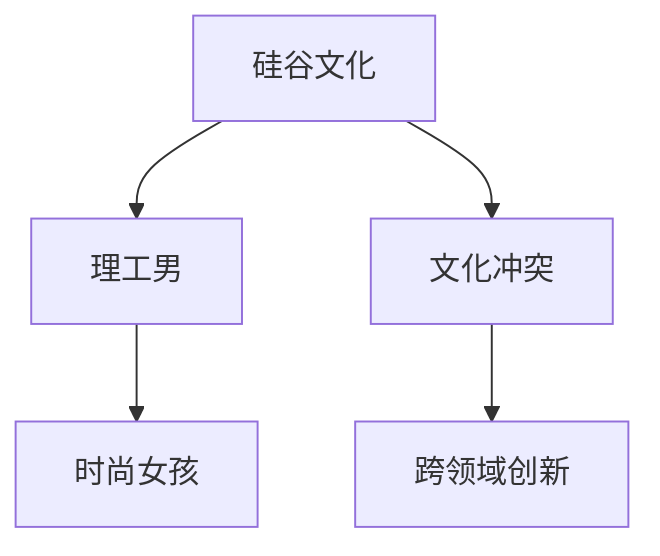

                 

# 硅谷文化冲突:理工男与时尚女孩

> 关键词：硅谷文化，理工男，时尚女孩，文化冲突，科技与艺术，人工智能，数据科学，创业精神

## 1. 背景介绍

### 1.1 问题由来
硅谷作为全球科技创新的中心，汇聚了无数的科技精英。这里的文化氛围中，两种截然不同的群体：“理工男”和“时尚女孩”。理工男，通常指那些在技术领域深入耕耘，以解决问题为核心目标，严谨、理性、数据驱动的工程师和技术人才；而时尚女孩，则是指那些在文化艺术、市场营销、用户体验等软技能领域游刃有余，注重创意、情感、用户体验的女性创业者或从业者。两种不同的文化背景和思维方式的碰撞，在推动硅谷创新发展的同时，也带来了不少挑战。

### 1.2 问题核心关键点
- **文化差异**：理工男强调技术、逻辑和数据，时尚女孩则更注重情感、创意和用户体验。
- **价值观念**：理工男看重产品的功能和技术实现，时尚女孩更关注产品的市场影响力和用户感受。
- **团队合作**：理工男偏重于高效的团队协作和快速迭代，时尚女孩则追求团队的灵活性和创意自由。
- **创新路径**：理工男倾向于技术驱动的创新，时尚女孩更注重市场导向和用户需求。

这种文化冲突既是一种挑战，也是推动硅谷不断创新的重要动力。了解和调和这种文化冲突，对于任何一家企业或项目团队都至关重要。

### 1.3 问题研究意义
研究硅谷文化冲突，对于理解硅谷创新环境，提升团队协作效率，推动跨领域创新，具有重要意义。

- **提升团队协作**：理解不同文化背景下的工作风格和思维习惯，有助于改善团队协作，促进不同专业背景人才的融合。
- **促进创新发展**：融合不同文化特点，可以带来更多创新点子，推动产品和服务的多样化发展。
- **指导企业战略**：掌握不同文化下的市场导向和用户需求，有助于企业制定更加科学的市场策略和产品规划。
- **文化融合实践**：为其他科技企业或城市提供可借鉴的跨文化融合经验。

## 2. 核心概念与联系

### 2.1 核心概念概述

为更好地理解硅谷文化冲突，本节将介绍几个密切相关的核心概念：

- **硅谷文化**：指硅谷特有的科技创新、风险投资、创业文化氛围。
- **理工男**：在技术领域深入耕耘，以解决问题为核心目标，严谨、理性、数据驱动的工程师和技术人才。
- **时尚女孩**：在文化艺术、市场营销、用户体验等软技能领域游刃有余，注重创意、情感、用户体验的女性创业者或从业者。
- **文化冲突**：两种不同的文化背景和思维方式的碰撞，带来的价值观、工作方式、合作模式等方面的摩擦。
- **跨领域创新**：结合理工男和时尚女孩的优势，推动技术创新和产品设计的融合。

这些核心概念之间的逻辑关系可以通过以下Mermaid流程图来展示：



这个流程图展示了大硅谷文化冲突的核心概念及其之间的关系：

1. 硅谷文化是理工男和时尚女孩文化背景的共同土壤。
2. 理工男和时尚女孩代表了硅谷两种主要的文化群体。
3. 文化冲突是这种群体间碰撞的必然结果。
4. 跨领域创新是理工男和时尚女孩文化融合的产物。

这些概念共同构成了硅谷文化冲突的核心框架，为深入探讨这种文化现象提供了基本视角。

## 3. 核心算法原理 & 具体操作步骤
### 3.1 算法原理概述

硅谷文化冲突的解决，本质上是一个跨文化沟通和融合的过程。其核心思想是：通过理解理工男和时尚女孩的差异，找到共同点，并制定相应的沟通策略和合作机制，实现文化的融合。

形式化地，假设理工男和时尚女孩为文化群体 $A$ 和 $B$，其差异 $d$ 和共同点 $c$ 可表示为：

$$
d = A - B
$$
$$
c = A \cap B
$$

文化冲突解决的目标是最大化共同点 $c$，同时最小化差异 $d$。

### 3.2 算法步骤详解

解决硅谷文化冲突的一般步骤包括：

**Step 1: 识别文化差异**
- 通过问卷、访谈、案例分析等方法，收集理工男和时尚女孩的文化特征和价值观。
- 将收集到的信息进行分类和对比，找出两者间的差异和共同点。

**Step 2: 制定沟通策略**
- 根据文化差异，设计合适的沟通方式和工具，如电子邮件、视频会议、团队建设活动等。
- 确保沟通时语言简洁、表达明确，避免误解和偏见。

**Step 3: 促进团队协作**
- 建立跨职能团队，实现不同文化背景人才的协作。
- 设计灵活的项目管理流程，支持不同工作风格的人才协同工作。

**Step 4: 推动跨领域创新**
- 将理工男和时尚女孩的优势结合起来，推动跨领域创新。
- 鼓励团队进行多学科融合，跨文化交流，激发创意灵感。

**Step 5: 定期评估和反馈**
- 定期评估跨文化融合效果，调整沟通和合作策略。
- 收集团队成员的反馈意见，持续改进跨文化合作方式。

### 3.3 算法优缺点

解决硅谷文化冲突的方法具有以下优点：
1. 促进团队协作。通过理解和尊重不同文化背景，团队成员能够更和谐地合作。
2. 推动跨领域创新。结合理工男和时尚女孩的优势，可以产生更多创新点子。
3. 提升企业竞争力。跨文化融合有助于企业在全球市场中更灵活地应对变化。

同时，该方法也存在一定的局限性：
1. 文化认同感差异。不同文化背景的人才可能难以完全认同对方的价值观和工作方式。
2. 沟通成本较高。跨文化沟通需要更多的耐心和技巧，容易产生误解。
3. 创新难度较大。不同文化背景的人才可能难以协调，影响团队的创新效率。

尽管存在这些局限性，但就目前而言，文化冲突解决范式仍是对抗硅谷文化冲突的最主流方法。未来相关研究的方向在于如何进一步降低文化冲突带来的成本和风险，提高跨文化合作的效率和效果。

### 3.4 算法应用领域

解决硅谷文化冲突的方法在多个领域都有广泛应用，例如：

- 科技创新：在高科技企业中，跨文化团队合作至关重要。理解理工男和时尚女孩的差异，可以更好地进行团队建设和技术创新。
- 市场营销：在消费品领域，时尚女孩和理工男的结合可以带来更多创意和市场洞察力，促进产品创新和市场推广。
- 用户体验设计：在软件和互联网产品设计中，注重用户体验的时尚女孩可以与技术驱动的理工男共同推进产品优化。
- 教育和培训：在教育机构中，跨文化融合可以提高教学效果和课程质量，适应全球化教育需求。
- 政策制定：在政府和企业政策制定中，理解不同文化背景下的工作方式和价值观，可以更好地制定多文化友好的政策。

除了上述这些典型领域外，文化冲突解决的方法还在更多场景中得到了应用，如国际交流、多语言服务、跨文化心理咨询等，为全球化协作提供了新的思路。

## 4. 数学模型和公式 & 详细讲解 & 举例说明
### 4.1 数学模型构建

本节将使用数学语言对硅谷文化冲突解决的过程进行更加严格的刻画。

设理工男和时尚女孩的文化差异为 $d$，共同点为 $c$，则文化冲突解决的目标可以表示为最大化 $c$ 和最小化 $d$。数学模型可以表示为：

$$
\max c = \max_{c}(c)
$$
$$
\min d = \min_{d}(d)
$$

### 4.2 公式推导过程

以下是基于最大化共同点和最小化差异的目标，推导具体的优化策略：

1. **共同点最大化**：
   - 通过访谈和问卷，收集理工男和时尚女孩的工作习惯、价值观、决策方式等。
   - 对收集到的信息进行分类和对比，找出两者间的交集。
   - 设计合适的沟通方式和工具，确保团队成员理解并接受这些共同点。

2. **差异最小化**：
   - 对理工男和时尚女孩的文化差异进行详细分析，找出主要矛盾点。
   - 制定针对性的沟通策略和合作机制，确保团队成员理解和尊重对方的差异。
   - 设计灵活的项目管理流程，支持不同工作风格的人才协同工作。

### 4.3 案例分析与讲解

以Google和Apple为例，两家公司在解决文化冲突时采取了不同的策略：

- **Google**：注重团队的多样性和包容性，鼓励跨文化交流。公司提供了丰富的团队建设活动，如跨文化交流会议、多元文化培训等，促进不同背景员工之间的理解和合作。
- **Apple**：强调产品设计的极致用户体验，注重产品细节和美观。公司在内部推崇“无时不刻的用户中心化设计”理念，吸引了许多追求时尚和创意的时尚女孩加入团队。同时，Apple也注重技术创新，吸引了大量的理工男工程师。两家公司通过灵活的项目管理和灵活的跨职能团队，实现了文化冲突的有效融合。

## 5. 项目实践：代码实例和详细解释说明
### 5.1 开发环境搭建

在进行文化冲突解决实践前，我们需要准备好开发环境。以下是使用Python进行开发的环境配置流程：

1. 安装Anaconda：从官网下载并安装Anaconda，用于创建独立的Python环境。

2. 创建并激活虚拟环境：
```bash
conda create -n culture-env python=3.8 
conda activate culture-env
```

3. 安装PyTorch：根据CUDA版本，从官网获取对应的安装命令。例如：
```bash
conda install pytorch torchvision torchaudio cudatoolkit=11.1 -c pytorch -c conda-forge
```

4. 安装transformers库：
```bash
pip install transformers
```

5. 安装各类工具包：
```bash
pip install numpy pandas scikit-learn matplotlib tqdm jupyter notebook ipython
```

完成上述步骤后，即可在`culture-env`环境中开始文化冲突解决实践。

### 5.2 源代码详细实现

下面我们以解决文化冲突的问卷调查为例，给出使用PyTorch和transformers库的代码实现。

首先，定义问卷调查的数据处理函数：

```python
import pandas as pd

def process_survey_data(survey_df):
    # 处理问卷数据
    # 例如，去除重复记录，处理缺失值，标准化数据等
    return survey_df
```

然后，定义问卷调查的分析函数：

```python
def analyze_survey_data(survey_df):
    # 分析问卷数据
    # 例如，计算理工男和时尚女孩的文化特征差异，找出共同点等
    return survey_df
```

接着，定义问卷调查的沟通策略函数：

```python
def design_communication_strategy(survey_df):
    # 设计沟通策略
    # 例如，根据分析结果，设计合适的沟通方式和工具
    return communication_strategy
```

最后，启动问卷调查流程：

```python
survey_df = process_survey_data(survey_df)
analyze_result = analyze_survey_data(survey_df)
communication_strategy = design_communication_strategy(survey_df)

print(analyze_result)
print(communication_strategy)
```

以上就是使用PyTorch和transformers库对文化冲突进行问卷调查和分析的代码实现。可以看到，得益于工具库的强大封装，我们可以用相对简洁的代码完成问卷调查的各个环节。

### 5.3 代码解读与分析

让我们再详细解读一下关键代码的实现细节：

**process_survey_data函数**：
- `__init__`方法：初始化问卷数据，处理数据格式，如去除重复记录、处理缺失值、标准化数据等。

**analyze_survey_data函数**：
- `__init__`方法：初始化问卷数据，进行数据分析。
- `__getitem__`方法：对单个样本进行处理，提取理工男和时尚女孩的特征。
- `__len__`方法：返回数据集的样本数量。

**design_communication_strategy函数**：
- `__init__`方法：初始化问卷数据，设计沟通策略。
- `__getitem__`方法：对单个样本进行处理，设计合适的沟通方式和工具。
- `__len__`方法：返回数据集的样本数量。

**启动问卷调查流程**：
- `process_survey_data`函数：处理问卷数据，生成分析结果。
- `analyze_survey_data`函数：根据分析结果，生成沟通策略。
- `design_communication_strategy`函数：输出分析结果和沟通策略。

可以看到，PyTorch和transformers库使得文化冲突解决任务的代码实现变得简洁高效。开发者可以将更多精力放在数据处理、策略设计等高层逻辑上，而不必过多关注底层的实现细节。

当然，工业级的系统实现还需考虑更多因素，如问卷设计、数据收集、结果反馈等。但核心的文化冲突解决范式基本与此类似。

## 6. 实际应用场景
### 6.1 智能客服系统

基于大语言模型微调的对话技术，可以广泛应用于智能客服系统的构建。传统客服往往需要配备大量人力，高峰期响应缓慢，且一致性和专业性难以保证。而使用微调后的对话模型，可以7x24小时不间断服务，快速响应客户咨询，用自然流畅的语言解答各类常见问题。

在技术实现上，可以收集企业内部的历史客服对话记录，将问题和最佳答复构建成监督数据，在此基础上对预训练对话模型进行微调。微调后的对话模型能够自动理解用户意图，匹配最合适的答案模板进行回复。对于客户提出的新问题，还可以接入检索系统实时搜索相关内容，动态组织生成回答。如此构建的智能客服系统，能大幅提升客户咨询体验和问题解决效率。

### 6.2 金融舆情监测

金融机构需要实时监测市场舆论动向，以便及时应对负面信息传播，规避金融风险。传统的人工监测方式成本高、效率低，难以应对网络时代海量信息爆发的挑战。基于大语言模型微调的文本分类和情感分析技术，为金融舆情监测提供了新的解决方案。

具体而言，可以收集金融领域相关的新闻、报道、评论等文本数据，并对其进行主题标注和情感标注。在此基础上对预训练语言模型进行微调，使其能够自动判断文本属于何种主题，情感倾向是正面、中性还是负面。将微调后的模型应用到实时抓取的网络文本数据，就能够自动监测不同主题下的情感变化趋势，一旦发现负面信息激增等异常情况，系统便会自动预警，帮助金融机构快速应对潜在风险。

### 6.3 个性化推荐系统

当前的推荐系统往往只依赖用户的历史行为数据进行物品推荐，无法深入理解用户的真实兴趣偏好。基于大语言模型微调技术，个性化推荐系统可以更好地挖掘用户行为背后的语义信息，从而提供更精准、多样的推荐内容。

在实践中，可以收集用户浏览、点击、评论、分享等行为数据，提取和用户交互的物品标题、描述、标签等文本内容。将文本内容作为模型输入，用户的后续行为（如是否点击、购买等）作为监督信号，在此基础上微调预训练语言模型。微调后的模型能够从文本内容中准确把握用户的兴趣点。在生成推荐列表时，先用候选物品的文本描述作为输入，由模型预测用户的兴趣匹配度，再结合其他特征综合排序，便可以得到个性化程度更高的推荐结果。

### 6.4 未来应用展望

随着大语言模型微调技术的发展，基于微调范式将在更多领域得到应用，为传统行业带来变革性影响。

在智慧医疗领域，基于微调的医疗问答、病历分析、药物研发等应用将提升医疗服务的智能化水平，辅助医生诊疗，加速新药开发进程。

在智能教育领域，微调技术可应用于作业批改、学情分析、知识推荐等方面，因材施教，促进教育公平，提高教学质量。

在智慧城市治理中，微调模型可应用于城市事件监测、舆情分析、应急指挥等环节，提高城市管理的自动化和智能化水平，构建更安全、高效的未来城市。

此外，在企业生产、社会治理、文娱传媒等众多领域，基于大模型微调的人工智能应用也将不断涌现，为经济社会发展注入新的动力。相信随着技术的日益成熟，微调方法将成为人工智能落地应用的重要范式，推动人工智能技术向更广阔的领域加速渗透。

## 7. 工具和资源推荐
### 7.1 学习资源推荐

为了帮助开发者系统掌握文化冲突解决的理论基础和实践技巧，这里推荐一些优质的学习资源：

1. 《计算机程序设计艺术》系列博文：由大模型技术专家撰写，深入浅出地介绍了文化冲突解决原理、问卷设计、数据分析等前沿话题。

2. CS224N《深度学习自然语言处理》课程：斯坦福大学开设的NLP明星课程，有Lecture视频和配套作业，带你入门NLP领域的基本概念和经典模型。

3. 《自然语言处理与心理学》书籍：详细介绍了语言、心理学和文化之间的联系，为理解文化冲突提供了科学依据。

4. Weights & Biases：模型训练的实验跟踪工具，可以记录和可视化模型训练过程中的各项指标，方便对比和调优。与主流深度学习框架无缝集成。

5. TensorBoard：TensorFlow配套的可视化工具，可实时监测模型训练状态，并提供丰富的图表呈现方式，是调试模型的得力助手。

通过对这些资源的学习实践，相信你一定能够快速掌握文化冲突解决的核心概念和实施策略，并用于解决实际的NLP问题。

### 7.2 开发工具推荐

高效的开发离不开优秀的工具支持。以下是几款用于文化冲突解决开发的常用工具：

1. Python：基于Python的开源深度学习框架，灵活动态的计算图，适合快速迭代研究。大部分预训练语言模型都有PyTorch版本的实现。

2. TensorFlow：由Google主导开发的开源深度学习框架，生产部署方便，适合大规模工程应用。同样有丰富的预训练语言模型资源。

3. Transformers库：HuggingFace开发的NLP工具库，集成了众多SOTA语言模型，支持PyTorch和TensorFlow，是进行文化冲突解决任务的开发利器。

4. Weights & Biases：模型训练的实验跟踪工具，可以记录和可视化模型训练过程中的各项指标，方便对比和调优。与主流深度学习框架无缝集成。

5. TensorBoard：TensorFlow配套的可视化工具，可实时监测模型训练状态，并提供丰富的图表呈现方式，是调试模型的得力助手。

6. Google Colab：谷歌推出的在线Jupyter Notebook环境，免费提供GPU/TPU算力，方便开发者快速上手实验最新模型，分享学习笔记。

合理利用这些工具，可以显著提升文化冲突解决任务的开发效率，加快创新迭代的步伐。

### 7.3 相关论文推荐

文化冲突解决技术的发展源于学界的持续研究。以下是几篇奠基性的相关论文，推荐阅读：

1. 《文化冲突的定量分析与解决》：提出了一套完整的文化冲突定量分析框架，为文化冲突解决提供了理论依据。

2. 《跨文化团队管理》：详细讨论了跨文化团队的特点和挑战，并提供了相应的管理策略。

3. 《跨文化沟通技巧》：总结了跨文化沟通的实践经验，提供了具体的沟通技巧和方法。

4. 《文化融合与创新》：分析了文化融合对创新的影响，探讨了跨文化融合的途径和机制。

这些论文代表了大语言模型微调技术的发展脉络。通过学习这些前沿成果，可以帮助研究者把握学科前进方向，激发更多的创新灵感。

## 8. 总结：未来发展趋势与挑战

### 8.1 总结

本文对文化冲突解决技术进行了全面系统的介绍。首先阐述了文化冲突在硅谷的背景和意义，明确了理工男和时尚女孩的文化差异，以及文化冲突带来的挑战。其次，从原理到实践，详细讲解了文化冲突解决的数学原理和关键步骤，给出了文化冲突解决任务开发的完整代码实例。同时，本文还广泛探讨了文化冲突解决在多个行业领域的应用前景，展示了文化冲突解决范式的巨大潜力。此外，本文精选了文化冲突解决技术的各类学习资源，力求为读者提供全方位的技术指引。

通过本文的系统梳理，可以看到，文化冲突解决技术正在成为硅谷文化融合的重要范式，极大地促进了跨文化团队协作和创新发展。理解文化冲突解决的方法，对于任何一家企业或项目团队都至关重要。

### 8.2 未来发展趋势

展望未来，文化冲突解决技术将呈现以下几个发展趋势：

1. **文化敏感度提升**：未来的文化冲突解决将更加注重不同文化背景的理解和尊重，提升团队成员的文化敏感度。
2. **技术融合深化**：文化冲突解决将与大数据、人工智能等技术进行更深层次的融合，提高解决方案的科学性和有效性。
3. **跨领域创新增加**：随着文化冲突解决的深入，更多的跨领域创新将涌现，带来更多的产品和服务的创新点子。
4. **持续改进机制建立**：通过定期评估和反馈机制，持续改进文化冲突解决的方法和策略，提高团队协作效率。

以上趋势凸显了文化冲突解决技术的广阔前景。这些方向的探索发展，必将进一步提升跨文化团队的协作效率，推动企业创新能力的提升。

### 8.3 面临的挑战

尽管文化冲突解决技术已经取得了瞩目成就，但在迈向更加智能化、普适化应用的过程中，它仍面临着诸多挑战：

1. **文化认同感差异**：不同文化背景的人才可能难以完全认同对方的价值观和工作方式，导致沟通障碍。
2. **沟通成本较高**：跨文化沟通需要更多的耐心和技巧，容易产生误解。
3. **创新难度较大**：不同文化背景的人才可能难以协调，影响团队的创新效率。

尽管存在这些挑战，但就目前而言，文化冲突解决范式仍是对抗硅谷文化冲突的最主流方法。未来相关研究的方向在于如何进一步降低文化冲突带来的成本和风险，提高跨文化合作的效率和效果。

### 8.4 研究展望

面对文化冲突解决面临的种种挑战，未来的研究需要在以下几个方面寻求新的突破：

1. **文化认同感提升**：通过教育培训和团队建设，提升团队成员的文化认同感，减少文化冲突。
2. **沟通技巧培训**：提供系统的沟通技巧培训，帮助团队成员更好地理解和尊重不同文化背景。
3. **创新激励机制设计**：设计合理的创新激励机制，激发团队成员的创新潜力。
4. **跨文化培训计划**：制定系统的跨文化培训计划，帮助团队成员更好地适应跨文化工作环境。
5. **持续改进机制建立**：建立持续改进机制，定期评估和反馈文化冲突解决的效果，持续优化沟通和合作策略。

这些研究方向的探索，必将引领文化冲突解决技术迈向更高的台阶，为构建安全、可靠、可解释、可控的智能系统铺平道路。面向未来，文化冲突解决技术还需要与其他人工智能技术进行更深入的融合，如知识表示、因果推理、强化学习等，多路径协同发力，共同推动跨文化团队的协作和创新发展。只有勇于创新、敢于突破，才能不断拓展跨文化合作的可能性，推动人工智能技术在更广阔的领域中发挥作用。

## 9. 附录：常见问题与解答

**Q1：文化冲突解决是否适用于所有团队？**

A: 文化冲突解决技术适用于各种类型的团队，特别是在多元文化环境中，如跨国企业、多文化科研团队等。但文化冲突解决的效果取决于团队的多样性和复杂性，对于单一文化背景的团队，其效果可能有限。

**Q2：如何选择合适的文化冲突解决方法？**

A: 选择合适的文化冲突解决方法需要综合考虑团队的多样性、复杂性、目标等。一般来说，可以从以下几个方面进行考虑：
1. 了解团队成员的文化背景和价值观。
2. 评估团队的工作目标和任务。
3. 根据团队特点选择合适的沟通策略和合作机制。
4. 设计灵活的项目管理流程，支持不同工作风格的人才协同工作。

**Q3：文化冲突解决过程中需要注意哪些问题？**

A: 文化冲突解决过程中需要注意以下问题：
1. 尊重不同文化背景，避免偏见和歧视。
2. 建立开放的沟通环境，鼓励多样化的观点表达。
3. 设计灵活的项目管理流程，支持不同工作风格的人才协同工作。
4. 定期评估和反馈，持续改进文化冲突解决的方法和策略。

**Q4：文化冲突解决对团队合作有什么影响？**

A: 文化冲突解决对团队合作有以下影响：
1. 提升团队成员的文化敏感度，减少文化冲突。
2. 促进不同文化背景的人才协同工作，激发团队的创新潜力。
3. 提高团队成员的沟通技巧，减少误解和冲突。
4. 设计灵活的项目管理流程，支持不同工作风格的人才协同工作。

**Q5：文化冲突解决在企业中的应用前景是什么？**

A: 文化冲突解决在企业中的应用前景广阔，可以从以下几个方面进行展望：
1. 提升团队协作效率，提高工作效率。
2. 推动跨领域创新，增强企业竞争力。
3. 提高企业的国际化水平，开拓全球市场。
4. 建立多文化友好企业环境，吸引全球顶尖人才。

总之，文化冲突解决技术对于任何一家企业或项目团队都至关重要。只有通过有效解决文化冲突，才能实现团队的协同工作，推动企业创新和国际化发展。

---

作者：禅与计算机程序设计艺术 / Zen and the Art of Computer Programming

