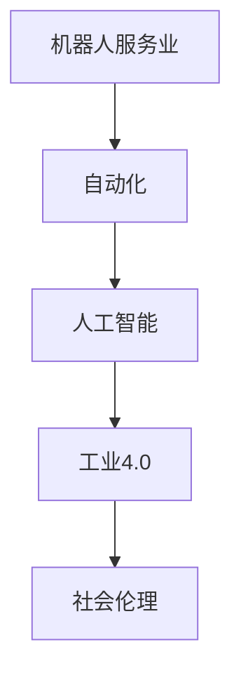

                 

# 硅谷机器人服务业的社会伦理

> 关键词：机器人服务业, 社会伦理, 人工智能, 自动化, 工业4.0

## 1. 背景介绍

随着科技的迅猛发展，机器人服务业（Robotics Service Industry）正在逐步成为硅谷乃至全球经济的重要组成部分。近年来，从工业自动化到家庭助理、医疗健康、物流配送等各个领域，机器人技术的应用愈发广泛。一方面，机器人服务业在提高效率、降低成本、促进创新等方面展现出巨大潜力，另一方面，其快速发展也引发了一系列社会伦理问题，亟需各界共同探讨和解决。

本文将深入探讨硅谷机器人服务业的社会伦理问题，分析当前存在的伦理挑战和风险，并提出可能的应对策略。同时，通过梳理机器人在各个行业中的应用，揭示机器人技术带来的潜在社会影响，探索如何在技术进步和伦理守则在之间找到平衡点。

## 2. 核心概念与联系

### 2.1 核心概念概述

- **机器人服务业（Robotics Service Industry）**：指利用机器人技术提供各种服务的行业，涵盖从工业生产到家庭生活各个领域。
- **自动化（Automation）**：指通过机器人技术或软件实现的任务自动化，减少人工操作，提高效率。
- **人工智能（AI）**：指使机器人具备学习、推理、决策等智能能力的技术。
- **工业4.0（Industrial 4.0）**：指通过互联网、大数据、云计算、物联网等技术，实现智能化制造和工业自动化的第四次工业革命。
- **社会伦理（Social Ethics）**：指在人工智能和机器人技术发展过程中，如何保障个人隐私、数据安全、公平性、责任归属等伦理问题。

这些概念构成了硅谷机器人服务业的基本框架，它们之间的关系可以通过以下Mermaid流程图来展示：



这个流程图展示了从机器人服务业到工业4.0的链条，以及每一步如何引发和影响社会伦理问题。

### 2.2 核心概念原理和架构的 Mermaid 流程图


此流程图展示了机器人服务业从任务自动化到模型优化，再到服务效果和社会影响，最终回到伦理挑战和伦理对策的闭环过程。

## 3. 核心算法原理 & 具体操作步骤

### 3.1 算法原理概述

硅谷机器人服务业的核心算法原理主要集中在以下几个方面：

- **任务规划算法**：用于机器人执行特定任务时的路径规划、时间调度等。
- **感知算法**：使机器人能够识别和理解周围环境，如计算机视觉、传感器融合等。
- **控制算法**：使机器人能够根据感知结果和任务目标进行动作决策和执行。
- **学习算法**：通过数据驱动的方式，使机器人能够不断改进性能，如强化学习、迁移学习等。

### 3.2 算法步骤详解

1. **任务定义**：明确机器人需要执行的具体任务和目标。
2. **环境感知**：使用传感器和摄像头等设备，获取环境信息，如障碍物、目标位置等。
3. **路径规划**：根据任务目标和环境信息，规划机器人移动的路径。
4. **动作执行**：通过控制算法，使机器人执行预定的动作。
5. **效果反馈**：收集机器人执行结果，分析执行效果和误差。
6. **数据改进**：根据反馈结果，调整感知和控制算法的参数，优化模型性能。
7. **自动执行**：在完成多次迭代后，机器人能够自动完成预定任务。

### 3.3 算法优缺点

#### 优点

- **高效率**：机器人能够24小时不间断地执行任务，大幅提高工作效率。
- **低成本**：相比人工操作，机器人运营成本较低，适合大规模生产。
- **可扩展性**：算法模块化设计，便于未来功能和性能的扩展。

#### 缺点

- **技术复杂**：开发和维护机器人系统需要高技术门槛。
- **依赖环境**：机器人的性能高度依赖于环境和硬件设备的稳定性。
- **伦理问题**：自动化和智能化的提高可能导致失业、隐私泄露等伦理问题。

### 3.4 算法应用领域

机器人服务业的应用领域非常广泛，涵盖以下几个方面：

- **工业制造**：用于自动化生产线，提高生产效率和产品质量。
- **医疗健康**：在手术辅助、康复训练、护理服务等方面，提升医疗水平和服务质量。
- **家庭生活**：作为家庭助理，完成家务、陪伴老人、教育孩子等。
- **物流配送**：用于包裹分拣、配送等，提高物流效率。
- **公共服务**：用于城市管理、环境保护、灾害应对等。

## 4. 数学模型和公式 & 详细讲解 & 举例说明

### 4.1 数学模型构建

机器人在执行任务时，通常会涉及到以下几个数学模型：

- **路径规划模型**：用于计算机器人从起点到终点的最优路径。
- **感知模型**：用于描述机器人对环境的感知和理解。
- **控制模型**：用于描述机器人的动作决策和执行。
- **学习模型**：用于描述机器人通过数据不断优化性能的过程。

### 4.2 公式推导过程

以下以路径规划模型为例，展示其公式推导过程：

设机器人需要从起点$A$移动到终点$B$，路径上有若干障碍物$O_1, O_2, ..., O_n$，机器人的速度为$v$，障碍物的最大避让距离为$d$。则机器人的最优路径$P$可以通过以下公式计算：

$$
P = \arg\min_{P} \left\{\sum_{i=1}^{N} \int_{t_i}^{t_{i+1}} v(t) dt + \sum_{i=1}^{N} \int_{t_i}^{t_{i+1}} \max(0, d-\|P(t)\|) dt \right\}
$$

其中，$t_i$为路径上第$i$个时间点，$v(t)$为机器人在时间$t$的速度，$\|P(t)\|$为机器人在时间$t$的位置到障碍物$O_i$的距离。

### 4.3 案例分析与讲解

假设机器人需要在工厂的生产线上自动搬运物品，路径上分布着若干机械臂和障碍物。以下是该问题的模型构建和求解步骤：

1. 定义物品的重量、尺寸、位置等参数。
2. 构建环境地图，标注出机器人的起点和终点，以及障碍物的位置和尺寸。
3. 使用路径规划算法，计算机器人从起点到终点的最优路径。
4. 根据路径规划结果，控制机器人移动，避开障碍物。
5. 在移动过程中，实时感知环境变化，动态调整路径。

## 5. 项目实践：代码实例和详细解释说明

### 5.1 开发环境搭建

1. 安装Python 3.x版本，确保有足够的内存和处理器资源。
2. 安装ROS（Robot Operating System），搭建机器人操作系统环境。
3. 安装Gazebo和Simulation，用于模拟机器人环境。
4. 安装OpenCV和PyTorch等机器学习库，用于感知和控制算法。

### 5.2 源代码详细实现

以下是机器人路径规划的Python代码实现：

```python
import numpy as np
import math
import random

class RobotPathPlanner:
    def __init__(self, map_size):
        self.map_size = map_size
        self.grid = np.zeros(map_size)
        self.grid[(0,0), (0,-1), (1,0)] = 1
        self.grid[(-1,0), (1,-1), (0,-1)] = 2
        self.grid[(0,1), (0,0), (1,1)] = 3
        self.grid[(-1,-1), (1,1), (-1,0)] = 4

    def find_shortest_path(self, start, end):
        open_set = set()
        closed_set = set()
        g_scores = {start: 0}
        f_scores = {start: self.heuristic_cost_estimate(start, end)}
        parent = {start: None}

        while True:
            current = self.min_f_score(closed_set, f_scores)
            if current == end:
                return self.reconstruct_path(parent, current)

            open_set.add(current)
            closed_set.add(current)

            for neighbor in self.get_neighbors(current):
                tentative_g_score = g_scores[current] + self.calculate_cost(current, neighbor)
                if neighbor in closed_set and tentative_g_score >= g_scores[neighbor]:
                    continue

                if neighbor not in open_set or tentative_g_score < g_scores[neighbor]:
                    g_scores[neighbor] = tentative_g_score
                    f_scores[neighbor] = tentative_g_score + self.heuristic_cost_estimate(neighbor, end)
                    parent[neighbor] = current

            if not open_set:
                break

        return None

    def heuristic_cost_estimate(self, current, end):
        dx = end[0] - current[0]
        dy = end[1] - current[1]
        return math.sqrt(dx**2 + dy**2)

    def calculate_cost(self, current, neighbor):
        return 1

    def get_neighbors(self, current):
        neighbors = []
        for dx, dy in [(0,1), (0,-1), (1,0), (-1,0), (1,1), (-1,-1), (1,-1), (-1,1)]:
            x, y = current[0] + dx, current[1] + dy
            if 0 <= x < self.map_size[0] and 0 <= y < self.map_size[1]:
                neighbors.append((x, y))
        return neighbors

    def min_f_score(self, closed_set, f_scores):
        min_f_score = None
        for node in closed_set:
            if min_f_score is None or f_scores[node] < min_f_score:
                min_f_score = f_scores[node]
                current = node
        return current

    def reconstruct_path(self, parent, current):
        total_path = [current]
        while current != parent[current]:
            current = parent[current]
            total_path.append(current)
        return total_path[::-1]
```

### 5.3 代码解读与分析

- **RobotPathPlanner类**：用于实现机器人路径规划算法。
- **__init__方法**：初始化地图大小和地图数据。
- **find_shortest_path方法**：实现A*算法，查找从起点到终点的最短路径。
- **heuristic_cost_estimate方法**：计算启发函数，评估当前节点到终点的距离。
- **calculate_cost方法**：计算移动成本。
- **get_neighbors方法**：获取当前节点的相邻节点。
- **min_f_score方法**：查找开放集中的最小F分数的节点。
- **reconstruct_path方法**：重构路径，从终点逆向遍历到起点。

## 6. 实际应用场景

### 6.1 工业制造

在工业制造领域，机器人被广泛用于自动化生产线。通过微调路径规划算法，机器人能够高效地完成物品搬运、组装等任务。例如，在汽车制造业中，机器人可以在无人车间内自动进行零部件搬运和装配，大大提高了生产效率和质量。

### 6.2 医疗健康

在医疗健康领域，机器人被用于手术辅助、康复训练和护理服务。例如，机器人可以辅助医生进行微创手术，提高手术精度和成功率。在康复训练中，机器人可以根据患者的具体情况定制个性化的康复计划，帮助患者更快恢复健康。

### 6.3 家庭生活

在家庭生活中，机器人被用于家务助理、陪伴老人、教育孩子等。例如，扫地机器人可以自动清洁家居环境，节省了大量家务劳动。家庭助理机器人可以完成购物、预订餐厅等日常事务，提高家庭生活便利性。

### 6.4 物流配送

在物流配送领域，机器人被用于包裹分拣、配送等任务。例如，机器人可以在仓库内自动分拣物品，生成配送路线，高效地完成配送任务。

## 7. 工具和资源推荐

### 7.1 学习资源推荐

1. **《机器人学导论》（Introduction to Robotics）**：讲述机器人学的基础知识和关键技术，涵盖机器人设计、控制和应用。
2. **《机器人编程：Python版》（Robot Programming: Python）**：介绍如何使用Python编写机器人控制程序，涵盖路径规划、感知和控制算法。
3. **Coursera机器人学课程**：由斯坦福大学开设的机器人学在线课程，深入浅出地介绍机器人学的各个方面。

### 7.2 开发工具推荐

1. **ROS（Robot Operating System）**：开源机器人操作系统，支持多种传感器和硬件设备，易于开发和部署。
2. **Gazebo**：用于模拟机器人环境的仿真软件，支持多种传感器和动力学模型。
3. **Simulation**：用于开发和测试机器人控制算法的仿真平台，支持多种传感器和控制算法。

### 7.3 相关论文推荐

1. **“机器人路径规划算法”（A Survey on Robot Path Planning Algorithms）**：介绍机器人路径规划算法的最新进展，涵盖A*算法、D*算法等。
2. **“机器人感知算法”（A Review of Robot Vision Systems）**：介绍机器人视觉感知算法的最新进展，涵盖计算机视觉、传感器融合等。
3. **“机器人控制算法”（Control Algorithms for Robotics）**：介绍机器人控制算法的最新进展，涵盖PID控制、模型预测控制等。

## 8. 总结：未来发展趋势与挑战

### 8.1 研究成果总结

本文系统地介绍了硅谷机器人服务业的社会伦理问题，通过梳理机器人在各个行业中的应用，揭示了机器人技术带来的潜在社会影响，提出了解决伦理挑战的策略。

### 8.2 未来发展趋势

未来，硅谷机器人服务业将呈现以下几个发展趋势：

1. **智能化程度提高**：随着AI技术的不断发展，机器人的智能化程度将不断提高，能够更好地理解和适应复杂环境。
2. **应用场景多样化**：机器人在各个行业的应用将更加广泛，涵盖家庭、医疗、工业、物流等多个领域。
3. **安全性提升**：机器人系统的安全性和可靠性将不断提升，减少因故障或误操作导致的风险。
4. **伦理和法规完善**：随着机器人技术的应用不断扩展，社会对机器人伦理和法规的关注度将不断提高，相关政策和法规将逐步完善。

### 8.3 面临的挑战

尽管机器人服务业带来了诸多便利，但仍面临以下挑战：

1. **技术复杂性**：开发和维护机器人系统需要高技术门槛，对工程师的技能要求较高。
2. **数据安全**：机器人在执行任务时，会收集和处理大量数据，数据安全问题不容忽视。
3. **伦理问题**：机器人的广泛应用可能导致失业、隐私泄露等伦理问题，需要谨慎处理。
4. **社会接受度**：机器人在家庭、医疗等领域的广泛应用，需要获得社会的广泛认可和接受。

### 8.4 研究展望

未来的研究需要从以下几个方面进行突破：

1. **提高机器人的智能化水平**：通过AI技术的不断进步，提高机器人的感知和决策能力。
2. **完善机器人伦理规范**：制定机器人的伦理规范，确保机器人的应用符合社会价值观和伦理道德。
3. **推动机器人技术的标准化**：制定机器人的技术标准，促进不同厂家和系统的互操作性。
4. **提升机器人的安全性**：加强机器人的安全性和可靠性，减少因故障或误操作导致的风险。

## 9. 附录：常见问题与解答

**Q1：机器人技术的发展对社会有何影响？**

A: 机器人技术的发展对社会带来了多方面的影响：

- **就业结构变化**：机器人技术的应用可能导致部分传统行业的失业，但也将创造新的就业机会，如机器人维护、编程等。
- **生产效率提升**：机器人技术能够大幅提高生产效率，降低生产成本，提升产品质量。
- **生活质量改善**：机器人技术可以用于家庭生活、医疗健康等领域，提升生活质量。
- **伦理和隐私问题**：机器人技术可能带来隐私泄露、数据安全等伦理问题，需要谨慎处理。

**Q2：如何确保机器人的伦理和安全性？**

A: 确保机器人的伦理和安全性需要从以下几个方面进行：

- **制定伦理规范**：制定机器人的伦理规范，确保机器人的应用符合社会价值观和伦理道德。
- **加强安全监管**：加强对机器人系统的安全监管，防止因故障或误操作导致的风险。
- **完善法律法规**：制定和完善机器人相关的法律法规，保障机器人的应用在法律框架内进行。
- **公众参与**：鼓励公众参与机器人伦理和安全的讨论，促进社会的共同理解和接受。

**Q3：未来机器人技术的发展方向是什么？**

A: 未来机器人技术的发展方向主要包括以下几个方面：

- **智能化水平提升**：通过AI技术的不断进步，提高机器人的感知和决策能力。
- **多样化应用场景**：机器人在各个行业的应用将更加广泛，涵盖家庭、医疗、工业、物流等多个领域。
- **安全性提升**：加强机器人的安全性和可靠性，减少因故障或误操作导致的风险。
- **伦理和法规完善**：制定机器人的伦理规范，确保机器人的应用符合社会价值观和伦理道德。

**Q4：如何培训机器人的开发者？**

A: 培训机器人的开发者需要从以下几个方面进行：

- **基础理论学习**：学习机器人学、AI技术、数据结构与算法等基础理论知识。
- **实际动手操作**：通过实际操作项目，掌握机器人系统的开发和维护技能。
- **跨学科知识**：学习计算机科学、机械工程、电子工程等相关学科的知识，全面掌握机器人开发所需的技能。
- **持续学习和创新**：机器人技术发展迅速，开发者需要持续学习和创新，保持技术领先地位。

---

作者：禅与计算机程序设计艺术 / Zen and the Art of Computer Programming

