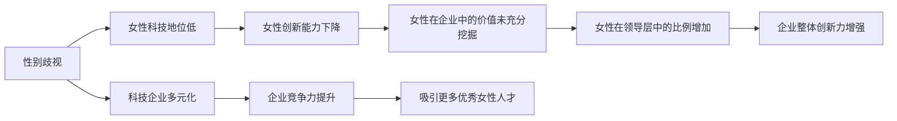

                 

# 硅谷科技女性地位提升:打破性别歧视

> 关键词：性别歧视, 女性科技地位, 科技企业多元化, 女性创新, 领导力培养

## 1. 背景介绍

在快速发展的科技领域，性别平等一直是各界关注的焦点。然而，科技行业中存在的性别不平等现象仍不容忽视。近年来，美国硅谷科技企业因性别歧视问题频遭诟病，业界和社会对此问题高度关注。本文将深入探讨硅谷科技女性的地位提升策略，分析性别歧视现象的成因，并提出打破性别歧视、促进科技企业多元化的实际行动建议。

## 2. 核心概念与联系

### 2.1 核心概念概述

- **性别歧视**：基于性别的差异对待，如工资差距、职位晋升障碍、工作环境不平等等。
- **科技女性地位**：指女性在科技行业中的职业发展、薪酬待遇、工作环境等方面所处的地位。
- **科技企业多元化**：企业员工性别、种族、年龄等多样化，反映企业的包容性和创新力。
- **女性创新**：女性在科技领域内的创造性工作，如研发、产品设计、创业等。
- **领导力培养**：通过培训、指导等方式提升女性在科技企业中的领导能力。

### 2.2 核心概念原理和架构的 Mermaid 流程图



## 3. 核心算法原理 & 具体操作步骤

### 3.1 算法原理概述

打破性别歧视，提升科技女性地位的策略可以归纳为以下几个算法步骤：

1. **识别问题**：通过数据分析和调查，识别和评估当前科技行业中的性别歧视现象。
2. **制定目标**：明确性别平等的具体目标，如提升女性在企业中的职位比例、薪酬平等、工作环境优化等。
3. **实施策略**：根据目标制定具体的行动策略，如多元化招聘、领导力培养计划、反歧视政策等。
4. **监控评估**：持续监控策略实施效果，评估性别歧视现象的变化，调整策略。

### 3.2 算法步骤详解

#### 3.2.1 识别问题

- **数据收集**：通过调查问卷、员工访谈、薪酬数据等手段，收集科技企业中的性别歧视情况。
- **数据分析**：使用统计方法，如描述性统计、回归分析等，识别性别歧视的具体表现和影响。

#### 3.2.2 制定目标

- **SMART原则**：设定具体、可测量、可实现、相关和时限的目标，如“在三年内，将女性管理层比例提高至30%”。
- **利益相关者参与**：与员工、管理层、董事会等各方利益相关者共同制定目标，确保目标的可行性和公正性。

#### 3.2.3 实施策略

- **多元化招聘**：采用无性别偏见招聘流程，确保面试和评估标准公平，避免性别歧视。
- **领导力培养**：为女性员工提供领导力培训和导师计划，提升其在企业中的影响力。
- **反歧视政策**：制定和实施反性别歧视政策，如透明的晋升机制、性骚扰投诉处理流程等。

#### 3.2.4 监控评估

- **定期评估**：通过定期的员工满意度调查、薪酬分析、职位比例统计等方式，评估性别平等的进展。
- **调整策略**：根据评估结果，调整策略，持续改进。

### 3.3 算法优缺点

#### 3.3.1 优点

- **促进多元化**：多元化的工作环境有助于激发创新思维，提升企业竞争力。
- **改善企业文化**：平等的工作环境有助于提高员工满意度和企业形象。
- **增加女性创新**：女性在科技领域的参与度和影响力提升，有助于推动更多创新的出现。

#### 3.3.2 缺点

- **实施难度大**：制定和执行反歧视政策需要企业高层和全体员工的共同努力。
- **成本高**：实施多元化策略可能需要较高的投入，包括培训、政策制定、监控等。
- **短期效果不明显**：改变企业文化和提升女性地位需要较长时间，短期内效果可能不明显。

### 3.4 算法应用领域

- **科技公司**：硅谷及全球的科技公司，包括IT、生物技术、互联网等企业。
- **教育机构**：高校和职业教育机构，提供技术教育和职业培训，帮助更多女性进入科技领域。
- **政府和非营利组织**：政策制定和执行机构，推动社会对科技女性地位提升的重视和支持。

## 4. 数学模型和公式 & 详细讲解

### 4.1 数学模型构建

为了更好地理解和量化性别歧视现象，本文将构建数学模型，使用性别比例、薪酬差距、职位分布等数据来描述和分析问题。

假设某科技企业员工总数为 $N$，其中女性员工数为 $F$，男性员工数为 $M$。设女性和男性平均工资分别为 $\overline{W}_F$ 和 $\overline{W}_M$，则性别薪酬差距可以用以下公式表示：

$$
\text{薪酬差距} = \frac{\overline{W}_F - \overline{W}_M}{\overline{W}_M}
$$

假设企业中女性和男性在管理层、技术岗位等职位中的比例分别为 $P_{\text{管理}}^{F}$ 和 $P_{\text{管理}}^{M}$，在工程师、科学家等岗位中的比例分别为 $P_{\text{技术}}^{F}$ 和 $P_{\text{技术}}^{M}$，则职位比例差距可以用以下公式表示：

$$
\text{职位比例差距} = \frac{P_{\text{管理}}^{F} - P_{\text{管理}}^{M}}{P_{\text{管理}}^{M}} = \frac{P_{\text{技术}}^{F} - P_{\text{技术}}^{M}}{P_{\text{技术}}^{M}}
$$

### 4.2 公式推导过程

#### 4.2.1 薪酬差距公式推导

$$
\text{薪酬差距} = \frac{\overline{W}_F - \overline{W}_M}{\overline{W}_M} = \frac{F \cdot \overline{W}_F + M \cdot \overline{W}_M}{N \cdot \overline{W}_M} - 1
$$

#### 4.2.2 职位比例差距公式推导

$$
\text{职位比例差距} = \frac{P_{\text{管理}}^{F} - P_{\text{管理}}^{M}}{P_{\text{管理}}^{M}} = \frac{F \cdot P_{\text{管理}}^{F} + M \cdot P_{\text{管理}}^{M}}{N \cdot P_{\text{管理}}^{M}} - 1
$$

### 4.3 案例分析与讲解

#### 4.3.1 案例一：谷歌的性别平等实践

谷歌一直以来致力于提升女性在科技领域中的地位。其具体措施包括：

- **多元化招聘**：制定无性别偏见的招聘标准，确保面试流程的公平性。
- **领导力培养**：设立“Google Women Techmakers”项目，提供培训和导师计划，帮助女性员工提升领导能力。
- **反歧视政策**：实施性骚扰投诉机制，确保所有员工的安全和权益。

#### 4.3.2 案例二：IBM的性别平等战略

IBM通过以下措施来提升女性科技地位：

- **设立目标**：在2020年前将女性管理层比例提升至40%。
- **薪酬平等**：定期审计薪酬数据，确保薪酬公平，消除性别薪酬差距。
- **多样性培训**：提供性别平等和多样性培训，提升员工的意识和行动力。

## 5. 项目实践：代码实例和详细解释说明

### 5.1 开发环境搭建

在进行项目实践前，我们需要准备好开发环境。以下是使用Python进行数据分析和可视化环境的配置流程：

1. 安装Anaconda：从官网下载并安装Anaconda，用于创建独立的Python环境。

2. 创建并激活虚拟环境：
```bash
conda create -n myenv python=3.8 
conda activate myenv
```

3. 安装相关库：
```bash
conda install pandas numpy matplotlib seaborn plotly jupyter notebook
```

完成上述步骤后，即可在`myenv`环境中开始项目实践。

### 5.2 源代码详细实现

以下是一个简单的Python代码示例，用于计算和可视化性别薪酬差距和职位比例差距：

```python
import pandas as pd
import matplotlib.pyplot as plt
import seaborn as sns

# 准备数据
data = pd.read_csv('employee_data.csv')

# 计算薪酬差距和职位比例差距
salary_gap = (data['female_avg_salary'] - data['male_avg_salary']) / data['male_avg_salary']
position_gap = (data['female_position_ratio'] - data['male_position_ratio']) / data['male_position_ratio']

# 可视化结果
plt.figure(figsize=(10, 6))
sns.histplot(salary_gap, bins=30, label='薪酬差距')
sns.histplot(position_gap, bins=30, label='职位比例差距')
plt.title('性别薪酬差距和职位比例差距')
plt.xlabel('差距比例')
plt.ylabel('频次')
plt.legend()
plt.show()
```

### 5.3 代码解读与分析

让我们再详细解读一下关键代码的实现细节：

- **数据准备**：通过`pd.read_csv`方法读取CSV格式的数据文件。
- **计算差距**：根据数据，计算薪酬差距和职位比例差距。
- **可视化**：使用`matplotlib`和`seaborn`库，绘制薪酬差距和职位比例差距的直方图，展示其分布情况。

## 6. 实际应用场景

### 6.1 科技企业中的性别歧视

性别歧视在科技企业中主要体现在以下几个方面：

- **薪酬差异**：女性员工的平均薪酬通常低于男性。
- **职位晋升障碍**：女性在晋升和加薪方面面临更多挑战。
- **工作环境**：女性在技术和管理岗位中占比偏低。

### 6.2 教育机构中的性别歧视

教育机构中性别歧视现象同样存在，主要表现如下：

- **课程选择**：STEM（科学、技术、工程和数学）课程中女性比例偏低。
- **职业指导**：教师和学校辅导员在职业指导时存在性别偏见，影响女性的职业选择。
- **评价体系**：评价体系中的标准和期望往往基于男性模型，忽视女性需求。

### 6.3 政府和非营利组织中的性别歧视

政府和非营利组织在推动性别平等方面的主要任务包括：

- **政策制定**：制定和执行性别平等政策，如平等薪酬法、反性别歧视法等。
- **资金支持**：提供资金支持，鼓励和资助性别平等项目和研究。
- **社会教育**：通过媒体和教育平台，提升公众对性别平等的认识和支持。

## 7. 工具和资源推荐

### 7.1 学习资源推荐

为了帮助开发者系统掌握性别平等和多元化技术，这里推荐一些优质的学习资源：

1. **Coursera《性别平等与多元化》课程**：由斯坦福大学教授授课，系统讲解性别平等和多元化管理。
2. **LinkedIn Learning《领导力与多元文化》视频课程**：通过实例演示，教授如何提升领导力和团队多元化。
3. **Harvard Business Review《性别平等和企业绩效》文章**：哈佛商学院的研究报告，分析性别平等与企业绩效的关系。
4. **Glassdoor《性别平等公司排行榜》**：根据员工评价和调查数据，列出全球性别平等公司。
5. **Ted Talk《打破性别平等障碍》演讲**：通过TED Talk等平台，分享真实案例和经验，激励更多企业实施性别平等策略。

通过这些资源的学习实践，相信你一定能够掌握性别平等和多元化的关键技术，并在实际应用中取得良好效果。

### 7.2 开发工具推荐

高效的开发离不开优秀的工具支持。以下是几款用于性别平等和多元化开发的常用工具：

1. **Tableau**：数据可视化工具，用于生成各种图表，帮助分析性别歧视现象。
2. **Jupyter Notebook**：交互式编程环境，便于数据分析和可视化。
3. **GitHub**：代码托管平台，用于共享和协作开发。
4. **Google Colab**：在线Jupyter Notebook环境，免费提供GPU/TPU算力，方便开发者快速实验。
5. **SurveyMonkey**：在线调查工具，用于收集员工和公众对性别平等的意见和建议。

合理利用这些工具，可以显著提升性别平等和多元化研究的开发效率，加快创新迭代的步伐。

### 7.3 相关论文推荐

性别平等和多元化研究领域已经有大量重要成果，以下是几篇奠基性的相关论文，推荐阅读：

1. **《性别平等与企业绩效》（2007, Harvard Business Review）**：分析性别平等与企业绩效的关系，指出多元化有助于提升公司创新力和竞争力。
2. **《打破性别障碍：科技行业的变革之路》（2018, IEEE Spectrum）**：探讨科技行业中性别歧视现象，提出具体策略和建议。
3. **《多样性与创新：科技企业的经验教训》（2019, McKinsey & Company）**：分享全球科技企业的多元化实践，分析其成功案例和失败教训。
4. **《实现性别平等：法律与政策》（2019, Stanford Law Review）**：研究性别平等政策和法律框架，提出改进建议。
5. **《领导力与多元化：成功的关键》（2020, Harvard Business Review）**：分享领导力培养和团队多元化管理的经验和技巧。

这些论文代表了大性别平等和多元化技术的发展脉络。通过学习这些前沿成果，可以帮助研究者把握学科前进方向，激发更多的创新灵感。

## 8. 总结：未来发展趋势与挑战

### 8.1 总结

本文对打破性别歧视、提升科技女性地位的策略进行了全面系统的探讨。首先，系统介绍了性别歧视现象在科技领域中的表现，并明确了提升女性地位的重要性和紧迫性。其次，详细讲解了性别平等的核心概念和具体措施，给出了实际的微调步骤。同时，本文还广泛探讨了性别平等和多元化的实际应用场景，展示了其在科技企业、教育机构和政府等领域的广泛应用前景。最后，本文精选了性别平等和多元化的各类学习资源，力求为读者提供全方位的技术指引。

通过本文的系统梳理，可以看到，打破性别歧视、提升女性地位对于构建公平、包容、创新的科技行业至关重要。未来，随着相关研究的不断深入和实践的不断积累，相信性别平等和多元化技术必将在更多领域得到应用，进一步推动社会的进步和科技的发展。

### 8.2 未来发展趋势

展望未来，性别平等和多元化技术将呈现以下几个发展趋势：

1. **政策支持加强**：各国政府将更加重视性别平等，出台更多支持政策和法规。
2. **企业重视度提升**：越来越多的科技企业将性别平等和多元化作为企业文化的重要组成部分。
3. **技术手段丰富**：利用大数据、人工智能等先进技术，更精准地识别和解决性别歧视问题。
4. **社会公众意识增强**：公众对性别平等的认识和支持将进一步提升，形成更加包容的社会氛围。
5. **全球合作深化**：国际组织和跨国企业将加强合作，共同推动全球性别平等事业的进步。

这些趋势预示着性别平等和多元化技术将在未来更加广泛和深入地应用，为构建更公平、包容的社会提供坚实基础。

### 8.3 面临的挑战

尽管性别平等和多元化技术已经取得了显著进展，但在迈向更加公正、包容的科技行业的道路上，仍面临诸多挑战：

1. **社会文化偏见**：一些社会和文化因素仍对性别平等构成障碍，需要长时间的社会教育和改变。
2. **企业内部阻力**：一些企业的管理层和员工可能对性别平等和多元化持保留态度，需要更多的引导和支持。
3. **资源投入不足**：性别平等和多元化项目需要资金、技术和人力资源的投入，一些中小企业难以负担。
4. **评估和监测难度**：如何科学地评估和监测性别平等的进展，需要建立更加系统化和标准化的评估体系。
5. **长期效果不明**：性别平等和多元化项目的短期效果可能不明显，需要持续投入和监测。

这些挑战需要各方共同努力，持续改进和优化性别平等和多元化的策略，才能最终实现社会的公平和包容。

### 8.4 研究展望

面对性别平等和多元化技术面临的挑战，未来的研究需要在以下几个方面寻求新的突破：

1. **制定科学评估指标**：开发更科学、更系统的评估指标，帮助企业和社会更精准地评估性别平等的进展。
2. **引入多元技术手段**：利用大数据、人工智能等先进技术，提升性别平等和多元化项目的效率和效果。
3. **加强企业内部培训**：开发更加系统化的培训课程，提升企业管理层和员工的性别平等意识。
4. **推动跨行业合作**：加强不同行业之间的合作，共同推动性别平等和多元化技术的普及和应用。
5. **倡导全球共识**：推动国际组织和跨国企业共同倡导性别平等和多元化的全球共识，形成更广泛的社会支持。

这些研究方向的探索，必将引领性别平等和多元化技术迈向更高的台阶，为构建公平、包容、创新的社会提供更强大的技术支持。

## 9. 附录：常见问题与解答

**Q1：性别平等和多元化对企业有什么好处？**

A: 性别平等和多元化对企业的具体好处包括：

- **提升企业创新力**：多元化的团队能够提供更多元的视角和观点，激发创新思维，提升企业竞争力。
- **优化人才结构**：多元化的团队有助于吸引和留住更多优秀人才，提升企业的人才吸引力。
- **改善企业文化**：平等的工作环境有助于提高员工满意度和忠诚度，提升企业形象。
- **降低成本**：多元化的团队能够更好地应对市场变化，提高运营效率，降低成本。

**Q2：如何制定性别平等和多元化的具体措施？**

A: 制定性别平等和多元化的具体措施需要以下步骤：

1. **数据收集和分析**：通过调查问卷、员工访谈等方式，收集企业中的性别歧视现象和多元化现状。
2. **设定具体目标**：根据数据分析结果，设定具体的性别平等和多元化目标，如提升女性员工比例、消除薪酬差距等。
3. **制定实施计划**：制定详细的实施计划，包括招聘、培训、政策制定等各个环节的具体措施。
4. **定期评估和调整**：定期评估措施的实施效果，根据评估结果进行相应的调整和优化。

**Q3：性别平等和多元化需要哪些资源支持？**

A: 性别平等和多元化项目需要以下资源支持：

- **资金支持**：用于培训、项目实施和评估等各个环节。
- **技术支持**：用于数据收集、分析、可视化等技术手段。
- **人力资源**：包括项目经理、培训师、政策制定者等专业人员。
- **社会支持**：包括社会组织、政府政策、公众意识等外部支持。

**Q4：性别平等和多元化对企业内部的影响是什么？**

A: 性别平等和多元化对企业内部的具体影响包括：

- **提升员工满意度**：平等的工作环境能够提升员工的满意度和忠诚度，减少员工流失率。
- **促进团队合作**：多元化的团队能够更好地沟通和协作，提升团队绩效。
- **改善管理水平**：管理层在实施性别平等和多元化策略时，需要更高的决策和执行能力，从而提升整体管理水平。
- **增强企业竞争力**：多元化的团队能够更好地应对市场变化，提升企业竞争力。

通过这些资源的整合和利用，企业可以更好地实现性别平等和多元化，提升整体实力和竞争力。

---

作者：禅与计算机程序设计艺术 / Zen and the Art of Computer Programming

