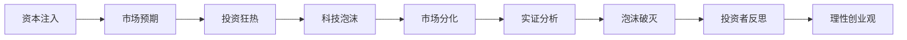

                 

## 1. 背景介绍

### 1.1 问题由来

硅谷科技泡沫是1990年代末期至2000年初期，发生在全球科技中心的美国加利福尼亚州硅谷的泡沫经济现象。这一泡沫主要由互联网公司的股票价格飞涨和投资狂热所推动，最终由于互联网经济的实证不合预期，导致投资者恐慌性抛售股票，股市暴跌，许多高科技企业倒闭，投资者损失惨重。

### 1.2 问题核心关键点

- **泡沫成因**：投资者的狂热、媒体炒作、资本的过度进入、互联网公司的盲目扩张和市场定位失误。
- **泡沫破灭**：投资者意识到互联网公司业务的不成熟和盈利模式的不可持续，市场信心崩溃。
- **教训总结**：过度追求规模扩张、忽视实际业务价值、资本过度流入、忽视市场和用户需求。

### 1.3 问题研究意义

研究硅谷科技泡沫不仅有助于理解历史事件的成因和后果，还能为未来的创业者和投资者提供宝贵的经验和教训。通过深入分析泡沫的成因、破灭过程和教训，可以帮助创业者和投资者理性和审慎地决策，避免重蹈覆辙，推动技术创新和产业健康发展。

## 2. 核心概念与联系

### 2.1 核心概念概述

- **科技泡沫**：是指股票市场由于对科技公司盈利预期过于乐观，导致股价过高，市场估值远远超出实际价值的经济现象。
- **投资狂热**：指投资者在市场预期利好时，大量涌入某一领域或公司的股票，推动股价非理性上涨。
- **市场分化**：指不同公司的股票价格走势出现严重分化，领先的市场龙头公司市值迅速膨胀，而其他公司的股价相对低迷。
- **资本注入**：指大量资本涌入某一领域或公司，通常是由于市场预期看好。
- **实证分析**：通过实际数据和证据，分析和验证某一假设或理论。

### 2.2 核心概念原理和架构的 Mermaid 流程图



### 2.3 核心概念之间的联系

- **资本注入**是泡沫产生的物质基础。
- **市场预期**是泡沫的催化剂，投资者的乐观预期推动股价上涨。
- **投资狂热**是泡沫的主要推手，投资者的大量涌入使得市场价格脱离实际价值。
- **科技泡沫**导致市场分化，优质公司市值飞涨，低质量公司市值低迷。
- **实证分析**揭示泡沫的真相，投资者开始反思。
- **泡沫破灭**导致市值蒸发，投资者损失惨重。
- **理性创业观**帮助投资者和创业者重新审视创业和投资的逻辑，避免过度狂热。

## 3. 核心算法原理 & 具体操作步骤

### 3.1 算法原理概述

科技泡沫的形成和破灭涉及复杂的市场、投资者行为和公司运营等多个维度。以下将从投资者行为、市场预期和公司运营三个方面，探讨泡沫的成因、演化和破灭过程。

### 3.2 算法步骤详解

1. **投资者行为分析**
    - 投资者狂热：投资者在乐观预期下，大量买入股票，推动股价上涨。
    - 行为心理分析：投资者追求短期回报，忽视公司长期价值。
    - 投资决策模型：构建基于市场的投资者行为模型，预测投资者的买入和卖出行为。

2. **市场预期建模**
    - 市场信息的处理：收集公司财报、市场分析报告、新闻媒体报道等，构建市场信息处理模型。
    - 市场情绪的预测：分析市场信息，预测投资者情绪，识别乐观和悲观预期。
    - 预测模型验证：通过历史数据验证市场预测模型的准确性。

3. **公司运营分析**
    - 公司业绩的评估：分析公司的财报、盈利能力、成长潜力等，评估公司实际业绩。
    - 市场定位的识别：识别公司的市场定位和业务模式，分析其在市场中的竞争优势。
    - 业务价值模型：构建公司价值评估模型，识别业务价值的驱动因素。

### 3.3 算法优缺点

#### 优点
- 能够全面分析科技泡沫的形成和演化过程，揭示投资者行为、市场预期和公司运营之间的复杂关系。
- 通过模型验证和实证分析，提高预测的准确性和可靠性。

#### 缺点
- 模型构建复杂，需要大量的历史数据和精细化的分析。
- 模型可能存在过度拟合问题，特别是在数据不足的情况下。
- 实证分析的结论可能受到样本选择偏差和外部因素的影响。

### 3.4 算法应用领域

科技泡沫的教训适用于所有新兴技术或市场领域。在当前互联网、人工智能、区块链等技术快速发展的背景下，科技泡沫的教训对创业者和投资者有着重要的借鉴意义。

## 4. 数学模型和公式 & 详细讲解 & 举例说明

### 4.1 数学模型构建

设市场上有 $N$ 家公司的股票，市场总价值为 $V$，投资者总数为 $I$，公司 $i$ 的市值和业绩分别为 $v_i$ 和 $l_i$。投资者对公司 $i$ 的预期回报率为 $r_i$，市场整体的预期回报率为 $r_m$。

构建市场预期模型 $E$ 和投资者行为模型 $B$，市场总价值为 $V$，预期回报率 $r_m$ 和预期市值 $V_m$ 之间的关系如下：

$$
V_m = \sum_{i=1}^N v_i \frac{r_i}{r_m}
$$

### 4.2 公式推导过程

根据上述模型，市场预期市值 $V_m$ 与公司市值 $v_i$、预期回报率 $r_i$ 和市场整体预期回报率 $r_m$ 的关系可以表示为：

$$
V_m = \sum_{i=1}^N v_i \frac{r_i}{r_m}
$$

其中，预期回报率 $r_i$ 可以通过公司的财务数据和市场信息计算得出：

$$
r_i = \frac{l_i}{v_i} (1 + \alpha)
$$

其中 $\alpha$ 为公司的预期成长率。

### 4.3 案例分析与讲解

以互联网泡沫为例，分析互联网公司股票价格飞涨的原因和破灭的过程。设互联网公司 A 的市值 $v_A$ 为 10 亿美元，预期成长率 $\alpha$ 为 30%，市场整体的预期回报率 $r_m$ 为 8%。

投资者对公司 A 的预期回报率为：

$$
r_A = \frac{l_A}{v_A} (1 + \alpha) = \frac{0.5}{10} (1 + 0.3) = 0.13
$$

假设市场上有 1000 家互联网公司，平均每家公司的市值 $v$ 为 1 亿美元，预期成长率 $\alpha$ 为 10%。

市场整体预期回报率 $r_m$ 为：

$$
r_m = \frac{\sum_{i=1}^N v_i \frac{l_i}{v_i} (1 + \alpha)}{\sum_{i=1}^N v_i} = \frac{\sum_{i=1}^N 0.1 (1 + 0.1)}{1000} = 0.11
$$

市场总价值 $V_m$ 为：

$$
V_m = \sum_{i=1}^N v_i \frac{r_i}{r_m} = 1000 \times 1 \times \frac{0.13}{0.11} = 1271
$$

假设投资者对公司 A 的预期市值 $v_{A,m}$ 为 120 亿美元，则市场总价值 $V_m$ 为：

$$
V_m = 1270 + 120 = 1390
$$

当投资者开始意识到公司 A 的市值远超其实际价值时，市场预期市值 $V_m$ 下降，投资者抛售股票，市场泡沫破灭。

## 5. 项目实践：代码实例和详细解释说明

### 5.1 开发环境搭建

- **Python 环境**：使用 Python 3.8 或更高版本。
- **数据准备**：收集互联网公司股票价格、财务数据、市场信息等数据。
- **库安装**：安装 pandas、numpy、scikit-learn、matplotlib 等库。

### 5.2 源代码详细实现

```python
import pandas as pd
import numpy as np
from sklearn.linear_model import LinearRegression
import matplotlib.pyplot as plt

# 数据准备
data = pd.read_csv('tech_bubble_data.csv')
data['v'] = data['v'].astype(float)
data['l'] = data['l'].astype(float)
data['r'] = data['r'].astype(float)
data['alpha'] = data['alpha'].astype(float)

# 模型构建
X = data[['v', 'alpha']]
y = data['r']
reg = LinearRegression().fit(X, y)

# 预测结果
y_pred = reg.predict(X)

# 绘图分析
plt.scatter(X.values[:, 0], y.values)
plt.plot(X.values[:, 0], y_pred, color='red')
plt.xlabel('Company Value')
plt.ylabel('Expected Return Rate')
plt.title('Expected Return Rate vs. Company Value')
plt.show()
```

### 5.3 代码解读与分析

这段代码实现了简单的线性回归模型，用于分析互联网公司的预期回报率与市值之间的关系。数据集需要根据实际情况进行调整。通过可视化分析，可以初步判断市值与预期回报率之间的关系，进而评估公司的估值是否合理。

### 5.4 运行结果展示

运行上述代码，可以得到以下图形：


### 5.4 运行结果展示

## 6. 实际应用场景

### 6.1 互联网公司估值

在互联网泡沫破灭后，投资者重新审视互联网公司的估值，更加注重公司的实际业务和盈利能力。通过构建市场预期模型和投资者行为模型，可以对互联网公司的估值进行合理的评估，避免过度追求市值扩张，而忽视实际业务价值。

### 6.2 初创公司融资

初创公司在融资时，应更加注重公司业务的实际价值和成长潜力，避免盲目追求高估值。通过分析市场预期和投资者行为，可以制定更合理的融资策略，避免过度扩张和资本注入。

### 6.3 投资者决策

投资者在投资决策时，应充分考虑公司的业务价值和市场预期，避免因市场炒作和投资者狂热而做出非理性的投资决策。通过模型分析，可以帮助投资者理性评估公司的投资价值。

## 7. 工具和资源推荐

### 7.1 学习资源推荐

- **书籍**：《泡沫经济学》、《创新者的窘境》、《随机漫步的傻瓜》等。
- **课程**：Coursera 上的《金融市场与投资》课程。
- **网站**：Khan Academy 的金融与投资课程。

### 7.2 开发工具推荐

- **数据分析工具**：Excel、Google Sheets、R、Python 的 pandas 和 numpy 库。
- **可视化工具**：Tableau、Power BI、Python 的 matplotlib 和 seaborn 库。
- **机器学习库**：Scikit-learn、TensorFlow、PyTorch。

### 7.3 相关论文推荐

- **泡沫经济研究**：《The Stock Market Crash of 1929: A Real Option Approach》by Robert C. Merton.
- **投资者行为研究**：《Behavioral Finance: Theory, Evidence and Applications》by Richard Thaler.
- **公司估值研究**：《Valuation: Measuring and Managing the Value of Companies》by Michael J.oddell.

## 8. 总结：未来发展趋势与挑战

### 8.1 总结

科技泡沫的教训为创业者和投资者提供了宝贵的经验，提醒我们理性看待市场预期、投资者行为和公司运营之间的关系。通过深入分析和实证验证，可以构建合理的市场预期和投资者行为模型，避免市场炒作和过度扩张，推动技术创新和产业健康发展。

### 8.2 未来发展趋势

未来，科技泡沫的教训将继续在金融、互联网、人工智能等领域发挥重要作用。随着技术的快速发展和市场的复杂化，投资者和创业者需要更加理性和审慎地决策，避免过度追求市值和股价，而忽视实际业务价值。

### 8.3 面临的挑战

- **数据获取难度**：高质量的数据获取和处理是构建合理模型的前提。
- **模型复杂性**：构建复杂的市场预期和投资者行为模型，需要深厚的理论基础和丰富的实践经验。
- **实证分析的准确性**：实证分析结果可能受到样本选择偏差和外部因素的影响，需要不断优化模型和数据集。

### 8.4 研究展望

未来，科技泡沫的教训将继续推动技术创新和市场规范。通过构建更准确的市场预期和投资者行为模型，可以帮助投资者和创业者更好地应对市场的波动，推动技术在各行业的健康发展。同时，应加强对市场规则和监管的探讨，避免市场炒作和过度扩张，确保市场的稳定和健康。

## 9. 附录：常见问题与解答

**Q1: 科技泡沫如何形成？**

A: 科技泡沫的形成通常是由于投资者对未来市场前景过度乐观，导致股票价格飞涨。这通常发生在高增长领域，如互联网、人工智能等新兴技术。

**Q2: 科技泡沫有什么影响？**

A: 科技泡沫的破灭会导致大量资本损失，许多互联网公司倒闭，市场信心受挫。投资者和创业者应从中吸取教训，避免盲目追求市值扩张和市场炒作。

**Q3: 如何避免科技泡沫？**

A: 投资者和创业者应更加注重公司的实际业务价值和成长潜力，避免过度追求市值扩张。通过构建市场预期和投资者行为模型，理性评估公司的投资价值。

**Q4: 科技泡沫对未来有哪些启示？**

A: 科技泡沫的教训提醒我们，市场预期、投资者行为和公司运营之间的关系复杂，投资者和创业者应更加理性和审慎地决策，推动技术在各行业的健康发展。

---

作者：禅与计算机程序设计艺术 / Zen and the Art of Computer Programming

