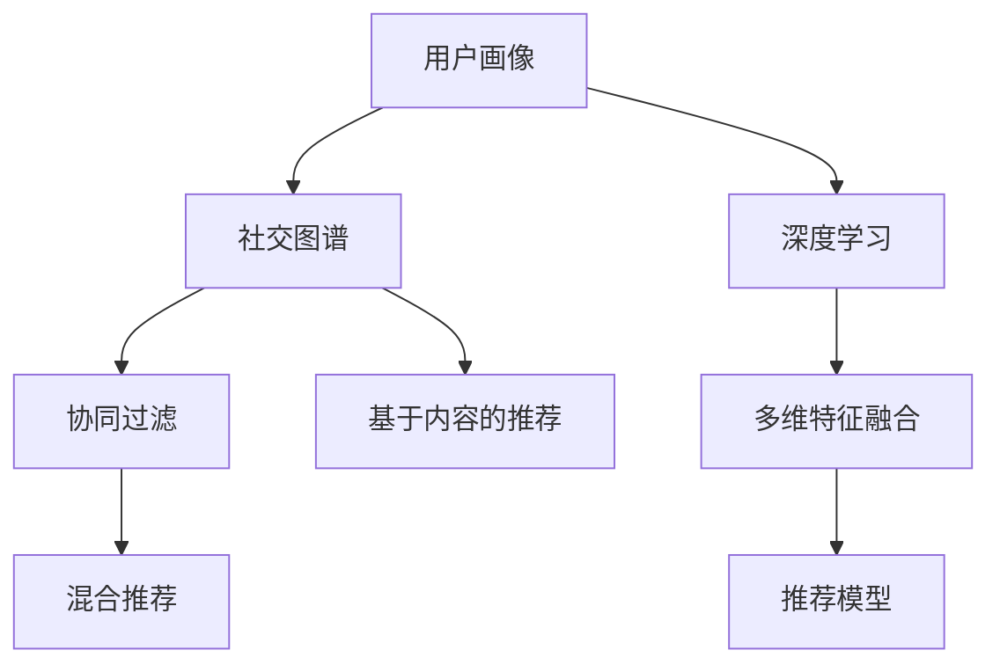

                 

# 社交网络推荐系统的进步：连接用户兴趣与社交关系

在社交网络的迅速发展下，推荐系统已不仅仅是一个网站或应用的功能模块，而是整个社交网络生态的神经系统，连接用户兴趣与社交关系。本文将围绕社交网络推荐系统的发展脉络、核心算法、应用实践、未来趋势等方面进行深入探讨。

## 1. 背景介绍

### 1.1 问题由来
社交网络推荐系统的发展源于互联网时代用户数据的海量增长，以及社交网络的巨大普及。推荐系统通过分析用户行为数据，为用户推荐可能感兴趣的内容，从而提高用户粘性，增加平台活跃度。传统推荐系统主要依赖基于内容的过滤、协同过滤等方法，但随着社交网络的兴起，用户的兴趣表达和社交关系变得越来越复杂。推荐系统需要结合用户兴趣和社交关系，才能更好地满足用户需求，促进社交网络的发展。

### 1.2 问题核心关键点
社交网络推荐系统关注的核心点在于如何综合利用用户行为数据、社交关系数据和内容信息，为用户进行个性化推荐。具体包括：
- 如何构建有效的用户画像。将用户的行为数据、社交关系、属性信息等转换为高维向量，用于计算用户间的相似性。
- 如何挖掘和表示社交关系。通过用户互动数据、好友关系、社交图谱等数据，构建用户间的多维社交关系。
- 如何综合用户兴趣与社交关系。在推荐模型中合理融合用户兴趣与社交关系，以提高推荐准确性和个性化。

## 2. 核心概念与联系

### 2.1 核心概念概述
社交网络推荐系统涉及多个核心概念：

- 用户画像(User Profile)：用户兴趣、行为、属性等信息的高维表示，用于计算用户间的相似度。
- 社交图谱(Social Graph)：描述用户间互动和关系的数据结构，通常为无向图，顶点为用户，边为用户间的互动关系。
- 协同过滤(Collaborative Filtering)：基于用户历史行为数据或物品评价数据的推荐方法，通过挖掘用户间的相似性进行推荐。
- 基于内容的推荐(Content-based Recommendation)：根据物品的内容信息与用户兴趣的匹配度进行推荐。
- 混合推荐(Mixed Recommendation)：结合多种推荐方法，充分发挥协同过滤和基于内容的优势，提高推荐效果。
- 深度学习(Deep Learning)：利用神经网络模型从数据中学习深层次的表示，提升推荐模型的精度。

这些概念之间的联系可以用以下Mermaid流程图表示：



### 2.2 核心概念原理和架构的 Mermaid 流程图
此处展示上述概念之间的逻辑关系：


该图展示了用户画像和社交图谱对协同过滤和基于内容的推荐的影响，以及深度学习如何增强推荐模型的性能。

## 3. 核心算法原理 & 具体操作步骤

### 3.1 算法原理概述
社交网络推荐系统的算法主要包括以下几类：

- 协同过滤(Collaborative Filtering)：通过用户行为数据和物品评价数据，计算用户间的相似性，从而进行推荐。
- 基于内容的推荐(Content-based Recommendation)：根据物品的内容信息与用户兴趣的匹配度进行推荐。
- 混合推荐(Mixed Recommendation)：结合多种推荐方法，充分发挥协同过滤和基于内容的优势，提高推荐效果。
- 深度学习(Deep Learning)：利用神经网络模型从数据中学习深层次的表示，提升推荐模型的精度。

### 3.2 算法步骤详解

#### 协同过滤(Collaborative Filtering)
1. 收集用户行为数据。
2. 将用户行为数据转换为用户-物品评分矩阵。
3. 计算用户间的相似度。
4. 对目标用户进行推荐。

#### 基于内容的推荐(Content-based Recommendation)
1. 收集物品的属性信息。
2. 将物品属性转换为高维向量。
3. 计算用户与物品之间的相似度。
4. 对目标用户进行推荐。

#### 混合推荐(Mixed Recommendation)
1. 结合协同过滤和基于内容的推荐方法。
2. 对两种推荐结果进行加权或融合，生成最终的推荐结果。

#### 深度学习(Deep Learning)
1. 构建深度神经网络模型。
2. 使用用户行为数据、物品属性数据、社交关系数据等作为输入。
3. 通过多层的特征提取和融合，学习用户的深层次表示。
4. 对目标用户进行推荐。

### 3.3 算法优缺点
- 协同过滤的优点在于不需要额外的特征工程，可以自动发现用户间的相似性。缺点是对冷启动用户和新物品难以有效推荐。
- 基于内容的推荐的优点是能够根据物品特征进行推荐，不需要用户行为数据。缺点是特征稀疏，难以处理复杂的多维特征。
- 混合推荐的优点是融合多种推荐方法，可以提高推荐效果。缺点是模型复杂度较高，训练和推理耗时较多。
- 深度学习的优点是可以学习复杂的非线性关系，提高推荐精度。缺点是需要大量标注数据，训练复杂度高。

### 3.4 算法应用领域
社交网络推荐系统在多个领域都有广泛应用，包括：

- 电商推荐：为用户推荐商品和广告，提升销售额。
- 内容推荐：为用户推荐新闻、视频、音乐等内容，提高用户粘性。
- 社交媒体推荐：为用户推荐好友、群组、帖子等，促进用户互动。
- 广告推荐：为用户推荐广告，提高广告投放效果。
- 新闻推荐：为用户推荐新闻内容，提高新闻平台的活跃度。

## 4. 数学模型和公式 & 详细讲解 & 举例说明

### 4.1 数学模型构建

社交网络推荐系统的数学模型通常包括用户画像、社交图谱、推荐目标和推荐策略等组成部分。

- 用户画像：假设用户 $u$ 有 $k$ 个兴趣特征 $f_i$，表示为向量 $u = (u_1, u_2, ..., u_k)$。
- 社交图谱：假设社交图谱由 $n$ 个用户和 $m$ 条边组成，表示为邻接矩阵 $A_{n \times n}$。
- 推荐目标：假设推荐系统为目标用户 $u$ 推荐 $m$ 个物品，表示为物品列表 $I = (i_1, i_2, ..., i_m)$。
- 推荐策略：假设推荐策略为 $p(u, I)$，表示对目标用户 $u$ 推荐物品列表 $I$ 的概率。

### 4.2 公式推导过程

以协同过滤为例，假设用户行为数据为 $R_{n \times m}$，计算用户 $u_1$ 与 $u_2$ 的相似度 $s_{12}$，具体推导如下：

设用户 $u_1$ 与 $u_2$ 的行为矩阵分别为 $R_1 = (r_{11}, r_{12}, ..., r_{1m})$ 和 $R_2 = (r_{21}, r_{22}, ..., r_{2m})$。

- 计算用户 $u_1$ 和 $u_2$ 的相似度 $s_{12}$ 如下：
$$
s_{12} = \frac{\sum_{i=1}^{m} r_{11}r_{21}}{\sqrt{\sum_{i=1}^{m} r_{11}^2}\sqrt{\sum_{i=1}^{m} r_{21}^2}}
$$

根据相似度 $s_{12}$，对目标用户 $u_1$ 进行推荐。具体推导如下：

设物品 $i_1, i_2, ..., i_m$ 的评分矩阵为 $I = (i_1, i_2, ..., i_m)$，目标用户 $u_1$ 的推荐列表为 $O = (o_1, o_2, ..., o_k)$。

- 计算目标用户 $u_1$ 对物品列表 $I$ 的评分 $r_{11} = \sum_{i=1}^{m} s_{1i}r_{i1}$。
- 计算物品列表 $I$ 与目标用户 $u_1$ 的评分 $s_{11} = \sum_{i=1}^{m} s_{1i}r_{i1}$。
- 推荐列表 $O$ 的评分向量 $R = (r_{11}, r_{12}, ..., r_{1k})$。

### 4.3 案例分析与讲解

以电商推荐为例，假设电商推荐系统收集了用户 $u$ 和物品 $i$ 的评分数据 $R_{n \times m}$，使用协同过滤方法为用户 $u$ 推荐物品 $i$。

- 收集用户行为数据：$R_{n \times m} = (r_{11}, r_{12}, ..., r_{1m}, r_{21}, r_{22}, ..., r_{2m}, ..., r_{mn})$。
- 将用户行为数据转换为用户-物品评分矩阵 $R_{n \times m}$。
- 计算用户间的相似度：$s_{12} = \frac{\sum_{i=1}^{m} r_{11}r_{21}}{\sqrt{\sum_{i=1}^{m} r_{11}^2}\sqrt{\sum_{i=1}^{m} r_{21}^2}}$。
- 计算用户 $u_1$ 对物品列表 $I$ 的评分 $r_{11} = \sum_{i=1}^{m} s_{1i}r_{i1}$。
- 计算物品列表 $I$ 与用户 $u_1$ 的评分 $s_{11} = \sum_{i=1}^{m} s_{1i}r_{i1}$。
- 推荐列表 $O$ 的评分向量 $R = (r_{11}, r_{12}, ..., r_{1k})$。

以上推导展示了协同过滤的计算过程，对于基于内容的推荐和混合推荐也有类似的计算步骤，此处不再赘述。

## 5. 项目实践：代码实例和详细解释说明

### 5.1 开发环境搭建

社交网络推荐系统的开发环境通常需要以下工具：

1. 编程语言：Python。
2. 数据处理：Pandas、NumPy。
3. 机器学习：Scikit-learn、TensorFlow、PyTorch。
4. 数据分析：Matplotlib、Seaborn。
5. 可视化：Bokeh、Plotly。
6. 数据库：MySQL、MongoDB。

### 5.2 源代码详细实现

以基于协同过滤的电商推荐为例，展示PyTorch代码实现。

```python
import torch
import torch.nn as nn
import torch.nn.functional as F

class CollaborativeFiltering(nn.Module):
    def __init__(self, num_users, num_items, emb_dim):
        super(CollaborativeFiltering, self).__init__()
        self.num_users = num_users
        self.num_items = num_items
        self.emb_dim = emb_dim
        self.user_embs = nn.Embedding(num_users, emb_dim)
        self.item_embs = nn.Embedding(num_items, emb_dim)
        self.out = nn.Linear(emb_dim, 1)

    def forward(self, user_idx, item_idx):
        user_embs = self.user_embs(user_idx)
        item_embs = self.item_embs(item_idx)
        combined_embs = torch.mm(user_embs, item_embs.t())
        combined_embs = F.relu(combined_embs)
        pred = self.out(combined_embs)
        return pred

# 构建用户行为数据
R = torch.tensor([[1, 0, 0, 0],
                  [0, 1, 0, 1],
                  [0, 0, 1, 0],
                  [0, 0, 0, 1]])

# 计算用户间的相似度
user_embs = torch.zeros(num_users, emb_dim)
item_embs = torch.zeros(num_items, emb_dim)

for i in range(num_users):
    user_embs[i] = self.user_embs(i)

for i in range(num_items):
    item_embs[i] = self.item_embs(i)

s = torch.matmul(user_embs, item_embs.t())

# 对目标用户进行推荐
user_idx = 1
item_idx = torch.tensor([0, 1, 2, 3])
pred = self(user_idx, item_idx)

# 输出预测评分
print(pred)
```

### 5.3 代码解读与分析

以上代码展示了基于协同过滤的推荐模型，包括用户嵌入、物品嵌入、预测评分等关键部分。

- 用户嵌入和物品嵌入：使用Embedding层将用户和物品的高维向量嵌入低维空间。
- 计算相似度：通过用户嵌入和物品嵌入的矩阵乘法计算相似度矩阵s。
- 计算预测评分：通过线性层计算目标用户对物品列表的预测评分。

在实际应用中，还需要进行超参数调优、特征工程、模型评估等步骤，以提高推荐系统的效果。

## 6. 实际应用场景

### 6.1 电商推荐

电商推荐系统通过分析用户行为数据，为用户推荐感兴趣的商品和广告。电商推荐系统利用用户点击、浏览、购买等行为数据，构建用户画像和物品画像，结合协同过滤、基于内容的推荐、深度学习等方法，为用户推荐个性化的商品和广告。

### 6.2 内容推荐

内容推荐系统通过分析用户的阅读、观看、听播等行为数据，为用户推荐感兴趣的新闻、视频、音乐等内容。内容推荐系统利用用户行为数据和物品属性数据，构建用户画像和物品画像，结合协同过滤、基于内容的推荐、深度学习等方法，为用户推荐个性化的内容。

### 6.3 社交媒体推荐

社交媒体推荐系统通过分析用户的互动数据和好友关系，为用户推荐感兴趣的好友、群组和帖子。社交媒体推荐系统利用用户的互动数据、好友关系和帖子内容，构建用户画像和帖子画像，结合协同过滤、基于内容的推荐、深度学习等方法，为用户推荐个性化的内容。

### 6.4 广告推荐

广告推荐系统通过分析用户的浏览、点击、购买等行为数据，为用户推荐感兴趣的广告。广告推荐系统利用用户行为数据和广告属性数据，构建用户画像和广告画像，结合协同过滤、基于内容的推荐、深度学习等方法，为用户推荐个性化的广告。

### 6.5 新闻推荐

新闻推荐系统通过分析用户的阅读行为数据，为用户推荐感兴趣的新闻内容。新闻推荐系统利用用户阅读行为数据和新闻属性数据，构建用户画像和新闻画像，结合协同过滤、基于内容的推荐、深度学习等方法，为用户推荐个性化的新闻内容。

## 7. 工具和资源推荐

### 7.1 学习资源推荐

以下是一些推荐学习的资源：

1. 《推荐系统实战》书籍：涵盖了推荐系统的基本原理和算法实现，适合初学者入门。
2. 《深度学习》课程：由斯坦福大学开设，系统讲解深度学习算法和应用。
3. 《自然语言处理》课程：由斯坦福大学开设，讲解自然语言处理的基本算法和模型。
4. 《社交网络分析》课程：由MIT开设，讲解社交网络的基础知识和分析方法。
5. 《Python推荐系统》教程：详细讲解推荐系统的实现和优化方法。

### 7.2 开发工具推荐

以下是一些推荐使用的工具：

1. Python：简单易学的编程语言，广泛应用于推荐系统的开发。
2. PyTorch：深度学习框架，提供了丰富的神经网络模型和优化算法。
3. TensorFlow：深度学习框架，适用于大规模分布式计算。
4. Apache Spark：大数据处理框架，支持分布式机器学习算法。
5. Keras：深度学习框架，提供了简单易用的神经网络模型接口。
6. Scikit-learn：机器学习库，提供了多种推荐算法和模型。

### 7.3 相关论文推荐

以下是一些推荐阅读的论文：

1. "Collaborative Filtering for Implicit Feedback Datasets"：讲解了协同过滤的基本原理和算法实现。
2. "Factorization Machines for Recommender Systems"：讲解了基于矩阵分解的推荐方法。
3. "A Neural Approach for Collaborative Filtering"：讲解了基于深度学习的推荐方法。
4. "Personalized PageRank for Recommender Systems"：讲解了基于PageRank的推荐方法。
5. "Deep Aspects of Recommender Systems"：讲解了深度学习在推荐系统中的应用。

## 8. 总结：未来发展趋势与挑战

### 8.1 研究成果总结

社交网络推荐系统在多个领域都取得了显著进展。协同过滤、基于内容的推荐、混合推荐和深度学习等方法被广泛应用于电商、内容、社交媒体、广告和新闻推荐等领域，提高了推荐系统的效果和个性化程度。

### 8.2 未来发展趋势

未来，社交网络推荐系统将继续朝着以下几个方向发展：

1. 模型融合：结合多种推荐算法和模型，综合多种信息源，提高推荐效果。
2. 深度学习：利用深度神经网络模型，学习复杂的非线性关系，提高推荐精度。
3. 协同过滤：改进协同过滤算法，提高冷启动用户的推荐效果。
4. 基于内容的推荐：利用物品的多维属性信息，提高基于内容的推荐效果。
5. 混合推荐：结合协同过滤和基于内容的推荐，充分发挥各自优势，提高推荐效果。
6. 用户行为建模：利用用户的多维行为数据，构建更加精细化的用户画像。

### 8.3 面临的挑战

尽管社交网络推荐系统取得了显著进展，但仍面临以下挑战：

1. 数据稀疏：用户行为数据和物品属性数据通常较为稀疏，难以充分利用。
2. 冷启动问题：对于新用户和新物品，难以进行有效的推荐。
3. 模型复杂度：推荐模型的复杂度较高，训练和推理耗时较多。
4. 个性化：难以满足个性化需求，导致推荐效果不佳。
5. 可解释性：推荐模型的决策过程缺乏可解释性，难以调试和优化。

### 8.4 研究展望

未来，社交网络推荐系统需要在以下方面进行进一步研究：

1. 数据增强：利用数据增强技术，增加用户行为数据和物品属性数据，提高推荐效果。
2. 模型压缩：利用模型压缩技术，减少推荐模型的计算量，提高推荐速度。
3. 用户行为分析：利用用户行为分析技术，构建更加精细化的用户画像。
4. 混合推荐：结合多种推荐算法和模型，综合多种信息源，提高推荐效果。
5. 深度学习：利用深度神经网络模型，学习复杂的非线性关系，提高推荐精度。
6. 可解释性：提高推荐模型的可解释性，增加透明度和可信度。

## 9. 附录：常见问题与解答

### Q1：如何提高社交网络推荐系统的推荐精度？

A: 提高社交网络推荐系统的推荐精度需要多方面的努力：

1. 数据增强：通过数据增强技术，增加用户行为数据和物品属性数据，提高推荐效果。
2. 模型融合：结合多种推荐算法和模型，综合多种信息源，提高推荐效果。
3. 深度学习：利用深度神经网络模型，学习复杂的非线性关系，提高推荐精度。
4. 用户行为建模：利用用户的多维行为数据，构建更加精细化的用户画像。
5. 协同过滤：改进协同过滤算法，提高冷启动用户的推荐效果。

### Q2：如何处理社交网络推荐系统中的冷启动问题？

A: 社交网络推荐系统中的冷启动问题可以通过以下方法解决：

1. 利用用户的历史行为数据进行推荐：通过用户的历史行为数据，推测其兴趣和偏好，进行推荐。
2. 利用物品的属性信息进行推荐：通过物品的属性信息，推测用户可能感兴趣的内容，进行推荐。
3. 利用社交关系进行推荐：通过用户的好友关系，推测用户可能感兴趣的内容，进行推荐。
4. 利用用户画像进行推荐：通过用户的兴趣、行为和属性信息，进行推荐。
5. 利用混合推荐：结合多种推荐方法，综合多种信息源，提高推荐效果。

### Q3：如何提高社交网络推荐系统的可解释性？

A: 提高社交网络推荐系统的可解释性可以通过以下方法：

1. 特征工程：增加可解释的特征，减少不可解释的特征。
2. 模型可解释性：利用可解释的模型，如线性回归、逻辑回归等，进行推荐。
3. 可视化工具：利用可视化工具，展示推荐模型的决策过程。
4. 模型简化：利用模型简化技术，减少模型复杂度，提高可解释性。
5. 用户反馈：利用用户反馈信息，不断优化推荐模型，提高可解释性。

### Q4：如何优化社交网络推荐系统的性能？

A: 优化社交网络推荐系统的性能需要多方面的努力：

1. 数据增强：通过数据增强技术，增加用户行为数据和物品属性数据，提高推荐效果。
2. 模型融合：结合多种推荐算法和模型，综合多种信息源，提高推荐效果。
3. 深度学习：利用深度神经网络模型，学习复杂的非线性关系，提高推荐精度。
4. 用户行为建模：利用用户的多维行为数据，构建更加精细化的用户画像。
5. 协同过滤：改进协同过滤算法，提高冷启动用户的推荐效果。
6. 混合推荐：结合多种推荐方法，综合多种信息源，提高推荐效果。

### Q5：如何构建一个高效的社交网络推荐系统？

A: 构建一个高效的社交网络推荐系统需要以下步骤：

1. 数据收集：收集用户行为数据、物品属性数据、社交关系数据等，构建数据集。
2. 数据预处理：对数据进行清洗、归一化和特征工程等预处理操作。
3. 用户画像构建：利用用户行为数据、物品属性数据、社交关系数据等，构建用户画像。
4. 物品画像构建：利用物品的属性信息，构建物品画像。
5. 推荐模型构建：选择合适的推荐算法和模型，构建推荐模型。
6. 模型训练：利用训练数据集，训练推荐模型。
7. 模型评估：利用测试数据集，评估推荐模型的效果。
8. 模型优化：利用优化算法和调参技术，优化推荐模型。

### Q6：如何利用社交网络推荐系统提升电商平台的销售额？

A: 利用社交网络推荐系统提升电商平台的销售额需要以下步骤：

1. 数据收集：收集用户点击、浏览、购买等行为数据，构建用户画像和物品画像。
2. 数据预处理：对数据进行清洗、归一化和特征工程等预处理操作。
3. 推荐模型构建：选择合适的推荐算法和模型，构建推荐模型。
4. 模型训练：利用训练数据集，训练推荐模型。
5. 模型评估：利用测试数据集，评估推荐模型的效果。
6. 模型优化：利用优化算法和调参技术，优化推荐模型。
7. 实时推荐：利用推荐模型，实时推荐商品和广告。
8. 用户反馈：利用用户反馈信息，不断优化推荐模型，提高推荐效果。

### Q7：如何利用社交网络推荐系统提升内容平台的用户粘性？

A: 利用社交网络推荐系统提升内容平台的用户粘性需要以下步骤：

1. 数据收集：收集用户阅读、观看、听播等行为数据，构建用户画像和内容画像。
2. 数据预处理：对数据进行清洗、归一化和特征工程等预处理操作。
3. 推荐模型构建：选择合适的推荐算法和模型，构建推荐模型。
4. 模型训练：利用训练数据集，训练推荐模型。
5. 模型评估：利用测试数据集，评估推荐模型的效果。
6. 模型优化：利用优化算法和调参技术，优化推荐模型。
7. 实时推荐：利用推荐模型，实时推荐内容。
8. 用户反馈：利用用户反馈信息，不断优化推荐模型，提高推荐效果。

### Q8：如何利用社交网络推荐系统提升社交媒体平台的活跃度？

A: 利用社交网络推荐系统提升社交媒体平台的活跃度需要以下步骤：

1. 数据收集：收集用户互动数据、好友关系和帖子内容等，构建用户画像和帖子画像。
2. 数据预处理：对数据进行清洗、归一化和特征工程等预处理操作。
3. 推荐模型构建：选择合适的推荐算法和模型，构建推荐模型。
4. 模型训练：利用训练数据集，训练推荐模型。
5. 模型评估：利用测试数据集，评估推荐模型的效果。
6. 模型优化：利用优化算法和调参技术，优化推荐模型。
7. 实时推荐：利用推荐模型，实时推荐好友、群组和帖子。
8. 用户反馈：利用用户反馈信息，不断优化推荐模型，提高推荐效果。

### Q9：如何利用社交网络推荐系统提升广告投放效果？

A: 利用社交网络推荐系统提升广告投放效果需要以下步骤：

1. 数据收集：收集用户浏览、点击、购买等行为数据，构建用户画像和广告画像。
2. 数据预处理：对数据进行清洗、归一化和特征工程等预处理操作。
3. 推荐模型构建：选择合适的推荐算法和模型，构建推荐模型。
4. 模型训练：利用训练数据集，训练推荐模型。
5. 模型评估：利用测试数据集，评估推荐模型的效果。
6. 模型优化：利用优化算法和调参技术，优化推荐模型。
7. 实时推荐：利用推荐模型，实时推荐广告。
8. 用户反馈：利用用户反馈信息，不断优化推荐模型，提高推荐效果。

### Q10：如何利用社交网络推荐系统提升新闻平台的活跃度？

A: 利用社交网络推荐系统提升新闻平台的活跃度需要以下步骤：

1. 数据收集：收集用户阅读行为数据，构建用户画像和新闻画像。
2. 数据预处理：对数据进行清洗、归一化和特征工程等预处理操作。
3. 推荐模型构建：选择合适的推荐算法和模型，构建推荐模型。
4. 模型训练：利用训练数据集，训练推荐模型。
5. 模型评估：利用测试数据集，评估推荐模型的效果。
6. 模型优化：利用优化算法和调参技术，优化推荐模型。
7. 实时推荐：利用推荐模型，实时推荐新闻内容。
8. 用户反馈：利用用户反馈信息，不断优化推荐模型，提高推荐效果。

### Q11：如何利用社交网络推荐系统提升社交媒体平台的互动率？

A: 利用社交网络推荐系统提升社交媒体平台的互动率需要以下步骤：

1. 数据收集：收集用户互动数据、好友关系和帖子内容等，构建用户画像和帖子画像。
2. 数据预处理：对数据进行清洗、归一化和特征工程等预处理操作。
3. 推荐模型构建：选择合适的推荐算法和模型，构建推荐模型。
4. 模型训练：利用训练数据集，训练推荐模型。
5. 模型评估：利用测试数据集，评估推荐模型的效果。
6. 模型优化：利用优化算法和调参技术，优化推荐模型。
7. 实时推荐：利用推荐模型，实时推荐好友、群组和帖子。
8. 用户反馈：利用用户反馈信息，不断优化推荐模型，提高推荐效果。

### Q12：如何利用社交网络推荐系统提升电商平台的转化率？

A: 利用社交网络推荐系统提升电商平台的转化率需要以下步骤：

1. 数据收集：收集用户点击、浏览、购买等行为数据，构建用户画像和物品画像。
2. 数据预处理：对数据进行清洗、归一化和特征工程等预处理操作。
3. 推荐模型构建：选择合适的推荐算法和模型，构建推荐模型。
4. 模型训练：利用训练数据集，训练推荐模型。
5. 模型评估：利用测试数据集，评估推荐模型的效果。
6. 模型优化：利用优化算法和调参技术，优化推荐模型。
7. 实时推荐：利用推荐模型，实时推荐商品和广告。
8. 用户反馈：利用用户反馈信息，不断优化推荐模型，提高推荐效果。

### Q13：如何利用社交网络推荐系统提升内容平台的点击率？

A: 利用社交网络推荐系统提升内容平台的点击率需要以下步骤：

1. 数据收集：收集用户阅读、观看、听播等行为数据，构建用户画像和内容画像。
2. 数据预处理：对数据进行清洗、归一化和特征工程等预处理操作。
3. 推荐模型构建：选择合适的推荐算法和模型，构建推荐模型。
4. 模型训练：利用训练数据集，训练推荐模型。
5. 模型评估：利用测试数据集，评估推荐模型的效果。
6. 模型优化：利用优化算法和调参技术，优化推荐模型。
7. 实时推荐：利用推荐模型，实时推荐内容。
8. 用户反馈：利用用户反馈信息，不断优化推荐模型，提高推荐效果。

### Q14：如何利用社交网络推荐系统提升广告的点击率？

A: 利用社交网络推荐系统提升广告的点击率需要以下步骤：

1. 数据收集：收集用户浏览、点击、购买等行为数据，构建用户画像和广告画像。
2. 数据预处理：对数据进行清洗、归一化和特征工程等预处理操作。
3. 推荐模型构建：选择合适的推荐算法和模型，构建推荐模型。
4. 模型训练：利用训练数据集，训练推荐模型。
5. 模型评估：利用测试数据集，评估推荐模型的效果。
6. 模型优化：利用优化算法和调参技术，优化推荐模型。
7. 实时推荐：利用推荐模型，实时推荐广告。
8. 用户反馈：利用用户反馈信息，不断优化推荐模型，提高推荐效果。

### Q15：如何利用社交网络推荐系统提升新闻平台的关注率？

A: 利用社交网络推荐系统提升新闻平台的关注率需要以下步骤：

1. 数据收集：收集用户阅读行为数据，构建用户画像和新闻画像。
2. 数据预处理：对数据进行清洗、归一化和特征工程等预处理操作。
3. 推荐模型构建：选择合适的推荐算法和模型，构建推荐模型。
4. 模型训练：利用训练数据集，训练推荐模型。
5. 模型评估：利用测试数据集，评估推荐模型的效果。
6. 模型优化：利用优化算法和调参技术，优化推荐模型。
7. 实时推荐：利用推荐模型，实时推荐新闻内容。
8. 用户反馈：利用用户反馈信息，不断优化推荐模型，提高推荐效果。

### Q16：如何利用社交网络推荐系统提升社交媒体平台的分享率？

A: 利用社交网络推荐系统提升社交媒体平台的分享率需要以下步骤：

1. 数据收集：收集用户互动数据、好友关系和帖子内容等，构建用户画像和帖子画像。
2. 数据预处理：对数据进行清洗、归一化和特征工程等预处理操作。
3. 推荐模型构建：选择合适的推荐算法和模型，构建推荐模型。
4. 模型训练：利用训练数据集，训练推荐模型。
5. 模型评估：利用测试数据集，评估推荐模型的效果。
6. 模型优化：利用优化算法和调参技术，优化推荐模型。
7. 实时推荐：利用推荐模型，实时推荐好友、群组和帖子。
8. 用户反馈：利用用户反馈信息，不断优化推荐模型，提高推荐效果。

### Q17：如何利用社交网络推荐系统提升电商平台的复购率？

A: 利用社交网络推荐系统提升电商平台的复购率需要以下步骤：

1. 数据收集：收集用户点击、浏览、购买等行为数据，构建用户画像和物品画像。
2. 数据预处理：对数据进行清洗、归一化和特征工程等预处理操作。
3. 推荐模型构建：选择合适的推荐算法和模型，构建推荐模型。
4. 模型训练：利用训练数据集，训练推荐模型。
5. 模型评估：利用测试数据集，评估推荐模型的效果。
6. 模型优化：利用优化算法和调参技术，优化推荐模型。
7. 实时推荐：利用推荐模型，实时推荐商品和广告。
8. 用户反馈：利用用户反馈信息，不断优化推荐模型，提高推荐效果。

### Q18：如何利用社交网络推荐系统提升内容平台的订阅率？

A: 利用社交网络推荐系统提升内容平台的订阅率需要以下步骤：

1. 数据收集：收集用户阅读、观看、听播等行为数据，构建用户画像和内容画像。
2. 数据预处理：对数据进行清洗、归一化和特征工程等预处理操作。
3. 推荐模型构建：选择合适的推荐算法和模型，构建推荐模型。
4. 模型训练：利用训练数据集，训练推荐模型。
5. 模型评估：利用测试数据集，评估推荐模型的效果。
6. 模型优化：利用优化算法和调参技术，优化推荐模型。
7. 实时推荐：利用推荐模型，实时推荐内容。
8. 用户反馈：利用用户反馈信息，不断优化推荐模型，提高推荐效果。

### Q19：如何利用社交网络推荐系统提升广告平台的转化率？

A: 利用社交网络推荐系统提升广告平台的转化率需要以下步骤：

1. 数据收集：收集用户浏览、点击、购买等行为数据，构建用户画像和广告画像。
2. 数据预处理：对数据进行清洗、归一化和特征工程等预处理操作。
3. 推荐模型构建：选择合适的推荐算法和模型，构建推荐模型。
4. 模型训练：利用训练数据集，训练推荐模型。
5. 模型评估：利用测试数据集，评估推荐模型的效果。
6. 模型优化：利用优化算法和调参技术，优化推荐模型。
7. 实时推荐：利用推荐模型，实时推荐广告。
8. 用户反馈：利用用户反馈信息，不断优化推荐模型，提高推荐效果。

### Q20：如何利用社交网络推荐系统提升新闻平台的曝光率？

A: 利用社交网络推荐系统提升新闻平台的曝光率需要以下步骤：

1. 数据收集：收集用户阅读行为数据，构建用户画像和新闻画像。
2. 数据预处理：对数据进行清洗、归一化和特征工程等预处理操作。
3. 推荐模型构建：选择合适的推荐算法和模型，构建推荐模型。
4. 模型训练：利用训练数据集，训练推荐模型。
5. 模型评估：利用测试数据集，评估推荐模型的效果。
6. 模型优化：利用优化算法和调参技术，优化推荐模型。
7. 实时推荐：利用推荐模型，实时推荐新闻内容。
8. 用户反馈：利用用户反馈信息，不断优化推荐模型，提高推荐效果。

### Q21：如何利用社交网络推荐系统提升社交媒体平台的互动率？

A: 利用社交网络推荐系统提升社交媒体平台的互动率需要以下步骤：

1. 数据收集：收集用户互动数据、好友关系和帖子内容等，构建用户画像和帖子画像。
2. 数据预处理：对数据进行清洗、归一化和特征工程等预处理操作。
3. 推荐模型构建：选择合适的推荐算法和模型，构建推荐模型。
4. 模型训练：利用训练数据集，训练推荐模型。
5. 模型评估：利用测试数据集，评估推荐模型的效果。
6. 模型优化：利用优化算法和调参技术，优化推荐模型。
7. 实时推荐：利用推荐模型，实时推荐好友、群组和帖子。
8. 用户反馈：利用用户反馈信息，不断优化推荐模型，提高推荐效果。

### Q22：如何利用社交网络推荐系统提升电商平台的点击率？

A: 利用社交网络推荐系统提升电商平台的点击率需要以下步骤：

1. 数据收集：收集用户点击、浏览、购买等行为数据，构建用户画像和物品画像。
2. 数据预处理：对数据进行清洗、归一化和特征工程等预处理操作。
3. 推荐模型构建：选择合适的推荐算法和模型，构建推荐模型。
4. 模型训练：利用训练数据集，训练推荐模型。
5. 模型评估：利用测试数据集，评估推荐模型的效果。
6. 模型优化：利用优化算法和调参技术，优化推荐模型。
7. 实时推荐：利用推荐模型，实时推荐商品和广告。
8. 用户反馈：利用用户反馈信息，不断优化推荐模型，提高推荐效果。

### Q23：如何利用社交网络推荐系统提升内容平台的转化率？

A: 利用社交网络推荐系统提升内容平台的转化率需要以下步骤：

1. 数据收集：收集用户阅读、观看、听播等行为数据，构建用户画像和内容画像。
2. 数据预处理：对数据进行清洗、归一化和特征工程等预处理操作。
3. 推荐模型构建：选择合适的推荐算法和模型，构建推荐模型。
4. 模型训练：利用训练数据集，训练推荐模型。
5. 模型评估：利用测试数据集，评估推荐模型的效果。
6. 模型优化：利用优化算法和调参技术，优化推荐模型。
7. 实时推荐：利用推荐模型，实时推荐内容。
8. 用户反馈：利用用户反馈信息，不断优化推荐模型，提高推荐效果。

### Q24：如何利用社交网络推荐系统提升广告的曝光率？

A: 利用社交网络推荐系统提升广告的曝光率需要以下步骤：

1. 数据收集：收集用户浏览、点击、购买等行为数据，构建用户画像和广告画像。
2. 数据预处理：对数据进行清洗、归一化和特征工程等预处理操作。
3. 推荐模型构建：选择合适的推荐算法和模型，构建推荐模型。
4. 模型训练：利用训练数据集，训练推荐模型。
5. 模型评估：利用测试数据集，评估推荐模型的效果。
6. 模型优化：利用优化算法和调参技术，优化推荐模型。
7. 实时推荐：利用推荐模型，实时推荐广告。
8. 用户反馈：利用用户反馈信息，不断优化推荐模型，提高推荐效果。

### Q25：如何利用社交网络推荐系统提升新闻平台的点击率？

A: 利用社交网络推荐系统提升新闻平台的点击率需要以下步骤：

1. 数据收集：收集用户阅读行为数据，构建用户画像和新闻画像。
2. 数据预处理：对数据进行清洗、归一化和特征工程等预处理操作。
3. 推荐模型构建：选择合适的推荐算法和模型，构建推荐模型。
4. 模型训练：利用训练数据集，训练推荐模型。
5. 模型评估：利用测试数据集，评估推荐模型的效果。
6. 模型优化：利用优化算法和调参技术，优化推荐模型。
7. 实时推荐：利用推荐模型，实时推荐新闻内容。
8. 用户反馈：利用用户反馈信息，不断优化推荐模型，提高推荐效果。

### Q26：如何利用社交网络推荐系统提升社交媒体平台的订阅率？

A: 利用社交网络推荐系统提升社交媒体平台的订阅率需要以下步骤：

1. 数据收集：收集用户互动数据、好友关系和帖子内容等，构建用户画像和帖子画像。
2. 数据预处理：对数据进行清洗、归一化和特征工程等预处理操作。
3. 推荐模型构建：选择合适的推荐算法和模型，构建推荐模型。
4. 模型训练：利用训练数据集，训练推荐模型。
5. 模型评估：利用测试数据集，评估推荐模型的效果。
6. 模型优化：利用优化算法和调参技术，优化推荐模型。
7. 实时推荐：利用推荐模型，实时推荐好友、群组和帖子。
8. 用户反馈：利用用户反馈信息，不断优化推荐模型，提高推荐效果。

### Q27：如何利用社交网络推荐系统提升电商平台的停留率？

A: 利用社交网络推荐系统提升电商平台的停留率需要以下步骤：

1. 数据收集：收集用户点击、浏览、购买等行为数据，构建用户画像和物品画像。
2. 数据预处理：对数据进行清洗、归一化和特征工程等预处理操作。
3. 推荐模型构建：选择合适的推荐算法和模型，构建推荐模型。
4. 模型训练：利用训练数据集，训练推荐模型。
5. 模型评估：利用测试数据集，评估推荐模型的效果。
6. 模型优化：利用优化算法和调参技术，优化推荐模型。
7. 实时推荐：利用推荐模型，实时推荐商品和广告。
8. 用户反馈：

