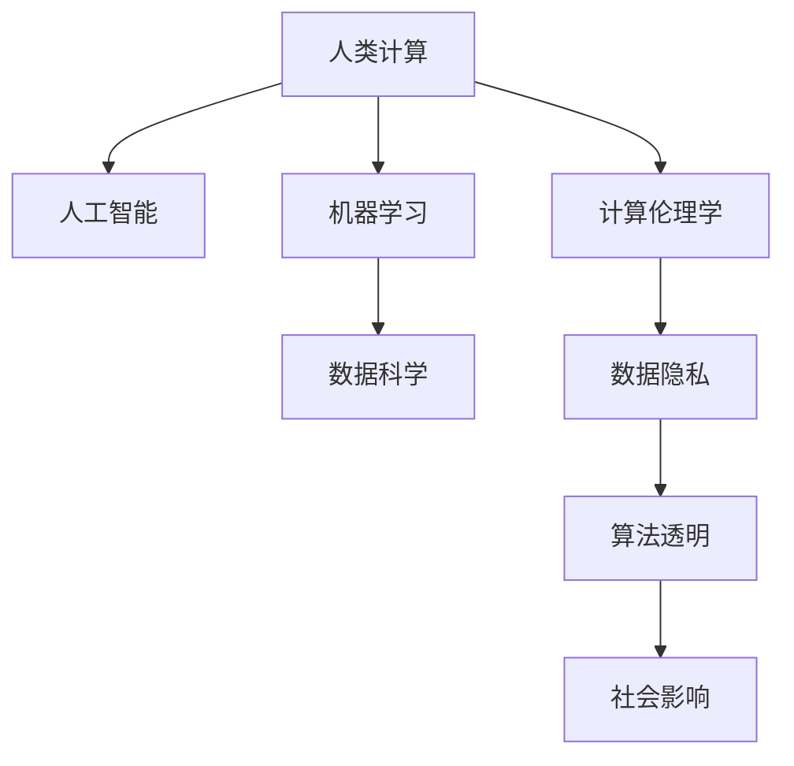

                 

## 1. 背景介绍

### 1.1 问题由来

现代科技的迅猛发展极大地拓展了人类计算的边界，使得人工智能(AI)、机器学习(ML)等前沿技术深刻影响了社会的方方面面。但与此同时，科技的快速迭代也引发了诸多争议，关于技术伦理、隐私保护、就业替代等问题层出不穷。如何在科技进步与人类福祉之间寻找平衡，成为了当今社会必须面对的课题。

本文聚焦于人工智能与人类计算的交汇点，探讨人类计算的独特价值，并试图揭示科技与人文之间的深度联系。

### 1.2 问题核心关键点

本文试图通过以下几个核心问题展开探讨：

1. 人类计算的独特价值何在？
2. 技术与人文的交汇点在哪里？
3. 如何构建科技伦理与社会责任？
4. 人类计算的未来趋势如何？

这些问题不仅关乎技术的发展，更涉及伦理、哲学、文化等多个维度，需要在科技与人文之间寻找平衡。通过深入分析这些问题，我们或许能够找到一条科技发展与人文关怀并重的发展道路。

## 2. 核心概念与联系

### 2.1 核心概念概述

为了更好地理解人类计算的独特价值，本节将介绍几个密切相关的核心概念：

- **人类计算(Human Computing)**：指通过自然语言、符号语言等人类特有的计算方式，实现信息处理和知识发现的计算过程。人类计算强调人类的直觉、创造力和智慧，与机器计算形成互补。

- **人工智能(Artificial Intelligence)**：指通过算法和计算模型，使计算机模拟人类智能行为，如感知、推理、学习、交互等。人工智能的核心在于实现机器与人类智慧的融合。

- **机器学习(Machine Learning)**：指通过数据驱动的方法，使计算机自动学习特征和规律，优化模型性能。机器学习是人工智能的重要组成部分，强调模型自主学习的能力。

- **数据科学(Data Science)**：指通过数据收集、处理、分析等手段，发现数据中的价值和规律，从而指导决策和优化。数据科学强调数据的探索性分析和应用导向。

- **计算伦理学(Computational Ethics)**：指在计算过程中，对数据隐私、算法透明、社会影响等伦理问题进行思考和处理。计算伦理学关注技术的可接受性和社会责任。

这些核心概念之间的逻辑关系可以通过以下Mermaid流程图来展示：



这个流程图展示了几组核心概念之间的关系：

1. 人类计算与人工智能相互融合，共同推动计算的发展。
2. 机器学习和数据科学是实现人工智能的重要手段，也是人类计算的实践方式。
3. 计算伦理学关注人工智能在数据、算法、社会影响等方面的伦理问题，确保技术应用的可接受性和社会责任。

## 3. 核心算法原理 & 具体操作步骤

### 3.1 算法原理概述

人类计算的独特价值在于其独特的计算方式和决策逻辑，与机器计算存在显著差异。以下是人类计算的基本原理：

- **直觉与创造力**：人类通过直觉和创造力进行计算，能够灵活处理复杂、非结构化的数据，捕捉难以量化的情感和意图。
- **语言与符号**：人类计算的核心在于语言和符号，通过自然语言理解和生成，实现信息的交互和传递。
- **文化与社会背景**：人类计算受文化和社会背景的影响，能够理解并反映社会的多样性和复杂性。
- **多模态融合**：人类计算融合视觉、听觉、触觉等多种感知方式，提供更全面的信息理解。

基于以上原理，人类计算能够解决许多机器计算难以处理的复杂问题，如情感分析、道德决策、创意生成等。

### 3.2 算法步骤详解

人类计算的实现主要分为以下几个步骤：

**Step 1: 数据收集与处理**
- 通过问卷、访谈、观察等多种方式，收集人类计算所需的数据。
- 对数据进行预处理，包括清洗、去噪、标注等步骤。

**Step 2: 模型设计**
- 设计适合人类计算的模型，如自然语言处理(NLP)、符号逻辑推理、知识图谱等。
- 选择适合的算法框架和工具，如TensorFlow、PyTorch、NLTK等。

**Step 3: 模型训练与优化**
- 使用标注数据训练模型，并进行交叉验证、调参等步骤优化模型性能。
- 采用正则化技术，如L2正则、Dropout等，避免过拟合。

**Step 4: 模型评估与迭代**
- 对模型进行评估，使用准确率、召回率、F1分数等指标评估模型效果。
- 根据评估结果进行迭代优化，逐步提升模型性能。

**Step 5: 部署与应用**
- 将优化后的模型部署到实际应用系统中，提供服务。
- 收集应用反馈，不断优化模型和算法，实现持续改进。

### 3.3 算法优缺点

人类计算的优点在于其独特性和灵活性，能够处理机器计算难以解决的问题。但同时也存在以下缺点：

- **效率较低**：人类计算依赖人类直觉和创造力，效率相对较低。
- **主观性强**：人类计算受个人经验、文化背景等主观因素影响较大，结果具有一定的主观性。
- **知识局限**：人类计算的知识体系受限于个人经验和背景，难以处理大规模、高复杂度的计算任务。
- **易受干扰**：人类计算易受情绪、环境等因素干扰，结果不稳定。

尽管存在这些局限性，但人类计算在许多领域仍具有不可替代的价值，如艺术创作、道德决策、情感分析等。

### 3.4 算法应用领域

人类计算在多个领域得到了广泛应用，主要包括：

- **创意产业**：如电影、音乐、绘画等，需要人类直觉和创造力的领域，人类计算能够提供更加人性化的创作体验。
- **心理健康**：如心理咨询、情感分析等，需要理解和处理人类情感、心理变化的问题，人类计算能够提供更加精准的分析和干预。
- **伦理决策**：如道德困境、法律咨询等，需要理解人类价值观和社会规范的问题，人类计算能够提供更加符合人类直觉的决策方案。
- **文化研究**：如历史研究、文化分析等，需要理解和处理文化多样性和复杂性的问题，人类计算能够提供更加深入的分析和解读。

这些领域都需要人类计算的参与，以充分利用人类智慧和经验，提升计算的深度和广度。

## 4. 数学模型和公式 & 详细讲解 & 举例说明

### 4.1 数学模型构建

人类计算的核心在于自然语言处理和符号推理，其数学模型可以大致分为两类：

- **自然语言处理模型**：如BERT、GPT等，用于处理文本数据，提取语义特征。
- **符号逻辑推理模型**：如Prolog、Lisp等，用于处理符号逻辑和规则，进行推理和决策。

以自然语言处理为例，我们可以使用BERT模型来构建一个简单的情感分析模型：

$$
\text{情感} = \text{BERT}(\text{文本}) \times \text{预训练权重} + \text{分类器}(\text{语义特征})
$$

其中，$\text{情感}$ 表示文本的情感极性，$\text{BERT}(\text{文本})$ 表示使用BERT模型提取的文本语义特征，$\text{预训练权重}$ 表示预训练模型提供的初始化参数，$\text{分类器}(\text{语义特征})$ 表示基于语义特征进行情感分类的决策模型。

### 4.2 公式推导过程

以情感分析为例，我们可以使用sigmoid函数将BERT模型的输出映射到[0,1]的区间，表示情感极性的概率分布：

$$
\text{情感概率} = \text{sigmoid}(\text{BERT}(\text{文本}))
$$

然后，使用分类器的输出作为最终情感分类的结果：

$$
\text{情感} = \text{argmax}_{i \in [0,1]} \text{情感概率}
$$

其中，$\text{argmax}_{i \in [0,1]}$ 表示在[0,1]区间内选择概率最大的情感极性。

### 4.3 案例分析与讲解

以情感分析为例，我们可以使用一个简单的Python代码来演示BERT模型在情感分析中的应用：

```python
import torch
from transformers import BertForSequenceClassification, BertTokenizer

# 初始化BERT模型和分词器
model = BertForSequenceClassification.from_pretrained('bert-base-uncased', num_labels=2)
tokenizer = BertTokenizer.from_pretrained('bert-base-uncased')

# 定义情感分类器
def predict(text):
    inputs = tokenizer(text, return_tensors='pt')
    outputs = model(**inputs)
    logits = outputs.logits
    probs = torch.softmax(logits, dim=1)
    return '积极' if probs[0][0] > probs[0][1] else '消极'

# 测试模型
print(predict('这是一篇很好的文章。'))
print(predict('这篇文章很差。'))
```

在这个代码中，我们使用BERT模型进行情感分类，通过预训练权重和分类器，实现了对文本情感极性的自动识别。这种技术能够有效应用于智能客服、社交媒体情感分析等场景，帮助企业更好地理解用户情感，提升服务质量。

## 5. 项目实践：代码实例和详细解释说明

### 5.1 开发环境搭建

在进行人类计算的开发实践前，我们需要准备好开发环境。以下是使用Python进行TensorFlow开发的简要环境配置流程：

1. 安装Anaconda：从官网下载并安装Anaconda，用于创建独立的Python环境。
2. 创建并激活虚拟环境：
```bash
conda create -n tf-env python=3.8 
conda activate tf-env
```
3. 安装TensorFlow：根据CUDA版本，从官网获取对应的安装命令。例如：
```bash
conda install tensorflow==2.6.0 -c tensorflow -c conda-forge
```
4. 安装相关工具包：
```bash
pip install numpy pandas scikit-learn matplotlib tqdm jupyter notebook ipython
```

完成上述步骤后，即可在`tf-env`环境中开始人类计算的实践。

### 5.2 源代码详细实现

下面以情感分析为例，给出使用TensorFlow对BERT模型进行情感分析的Python代码实现。

```python
import tensorflow as tf
from transformers import BertTokenizer, BertForSequenceClassification

# 初始化BERT模型和分词器
model = BertForSequenceClassification.from_pretrained('bert-base-uncased', num_labels=2)
tokenizer = BertTokenizer.from_pretrained('bert-base-uncased')

# 定义情感分类器
def predict(text):
    inputs = tokenizer(text, return_tensors='tf')
    outputs = model(**inputs)
    logits = outputs.logits.numpy()
    probs = tf.nn.softmax(logits, axis=-1).numpy()
    return '积极' if probs[0][0] > probs[0][1] else '消极'

# 测试模型
print(predict('这是一篇很好的文章。'))
print(predict('这篇文章很差。'))
```

在这个代码中，我们使用TensorFlow实现了情感分析的逻辑，通过预训练权重和分类器，实现了对文本情感极性的自动识别。这种技术能够有效应用于智能客服、社交媒体情感分析等场景，帮助企业更好地理解用户情感，提升服务质量。

### 5.3 代码解读与分析

让我们再详细解读一下关键代码的实现细节：

**BertTokenizer**：
- 定义了分词器，用于将文本转化为BERT模型所需的token ids。

**BertForSequenceClassification**：
- 定义了BERT模型，用于提取文本的语义特征。

**predict函数**：
- 接收文本输入，使用分词器将其转化为模型所需的格式。
- 通过前向传播计算模型的输出。
- 使用softmax函数将输出映射到概率分布，表示情感极性的概率。
- 根据概率分布选择最终的情感极性，返回结果。

**测试模型**：
- 调用predict函数，对两个文本进行情感分类。

## 6. 实际应用场景

### 6.1 智能客服系统

基于人类计算的智能客服系统，可以广泛应用于各个行业，帮助企业提升客户满意度。传统的客服系统往往需要配备大量人力，高峰期响应缓慢，且无法实现7x24小时不间断服务。而基于人类计算的智能客服系统，可以实时理解客户意图，提供自然流畅的对话体验，迅速解答客户问题，提升服务效率。

在技术实现上，我们可以将客户的问题转化为模型输入，使用预训练模型提取语义特征，并通过分类器进行情感分类和意图识别，生成相应的回答。这种技术能够有效应用于智能客服、在线客服、智能助理等场景，帮助企业更好地理解客户需求，提升服务质量。

### 6.2 心理健康应用

心理健康应用是人类计算的重要领域之一，能够帮助用户识别和应对心理问题，提升心理健康水平。传统的心理健康应用往往依赖专业人士进行心理评估和干预，耗时长且费用高昂。而基于人类计算的心理健康应用，可以通过自然语言处理和情感分析技术，对用户的情感状态进行实时监测和分析，提供个性化的心理建议和干预措施。

在技术实现上，我们可以将用户的自述或对话转化为模型输入，使用情感分析模型和情感分类器，对用户的情感状态进行评估。然后，结合心理评估问卷和专业建议，生成个性化的心理健康报告和干预方案。这种技术能够有效应用于心理健康咨询、在线心理辅导、情绪管理等场景，帮助用户更好地应对心理问题，提升心理健康水平。

### 6.3 伦理决策支持

伦理决策支持系统是基于人类计算的重要应用之一，能够帮助企业进行道德决策和伦理判断。传统的伦理决策往往依赖个人经验和知识积累，容易受到主观因素的影响。而基于人类计算的伦理决策支持系统，可以通过自然语言处理和符号推理技术，对复杂伦理问题进行自动化分析和判断，提供客观、公正的决策建议。

在技术实现上，我们可以将伦理问题转化为模型输入，使用预训练模型提取语义特征，并通过符号逻辑推理模型进行决策。然后，结合伦理专家知识库和案例库，生成决策建议和解决方案。这种技术能够有效应用于企业合规、社会伦理、法律咨询等场景，帮助企业进行公正、透明的伦理决策，提升社会责任感。

### 6.4 未来应用展望

随着人类计算技术的不断发展，未来将会有更多的应用场景涌现出来，为人类的生活、工作和社会治理带来深刻变革：

1. **智能辅助设计**：在艺术设计、建筑设计等领域，人类计算可以帮助设计师进行创意生成和设计优化，提升设计质量和效率。
2. **智能决策支持**：在企业决策、政府治理等领域，人类计算可以帮助进行复杂问题的分析和判断，提供决策支持和解决方案。
3. **智能安全防护**：在网络安全、社会治理等领域，人类计算可以帮助进行风险识别和威胁分析，提升安全防护水平。
4. **智能文化研究**：在历史研究、文化分析等领域，人类计算可以帮助进行数据挖掘和知识发现，提升研究深度和广度。

未来，人类计算的应用场景将更加广泛，将在更多的领域中发挥其独特价值，推动社会的进步和变革。

## 7. 工具和资源推荐

### 7.1 学习资源推荐

为了帮助开发者系统掌握人类计算的理论基础和实践技巧，这里推荐一些优质的学习资源：

1. **《深度学习基础》**：讲解深度学习的基本概念和常用模型，适合初学者入门。
2. **《自然语言处理综述》**：由自然语言处理领域专家撰写，全面介绍NLP技术，涵盖自然语言理解、生成、情感分析等多个方面。
3. **《符号逻辑与计算》**：介绍符号逻辑的基本概念和计算方法，帮助理解人类计算的逻辑基础。
4. **《计算伦理学》**：介绍计算伦理学的基本概念和应用，帮助理解技术与社会的关系。

通过对这些资源的学习实践，相信你一定能够快速掌握人类计算的精髓，并用于解决实际的NLP问题。

### 7.2 开发工具推荐

高效的开发离不开优秀的工具支持。以下是几款用于人类计算开发的常用工具：

1. **TensorFlow**：由Google主导开发的深度学习框架，生产部署方便，适合大规模工程应用。
2. **PyTorch**：基于Python的开源深度学习框架，灵活动态的计算图，适合快速迭代研究。
3. **NLTK**：自然语言处理工具库，提供了丰富的自然语言处理功能和数据集，适合进行自然语言处理任务的开发。
4. **GPT-3**：OpenAI开发的最新大语言模型，具备强大的自然语言处理能力，适合进行自然语言理解和生成。

合理利用这些工具，可以显著提升人类计算的开发效率，加快创新迭代的步伐。

### 7.3 相关论文推荐

人类计算的研究源于学界的持续研究。以下是几篇奠基性的相关论文，推荐阅读：

1. **《人机交互与智能系统》**：探讨人机交互的基本原理和智能系统的设计方法，强调人类智慧与计算技术的结合。
2. **《符号逻辑与人工智能》**：介绍符号逻辑在人工智能中的应用，强调人类智慧与符号计算的结合。
3. **《计算伦理学与道德决策》**：探讨计算伦理学的基本概念和应用，强调技术与社会伦理的关系。

这些论文代表了大语言模型微调技术的发展脉络。通过学习这些前沿成果，可以帮助研究者把握学科前进方向，激发更多的创新灵感。

## 8. 总结：未来发展趋势与挑战

### 8.1 研究成果总结

本文对人类计算的独特价值进行了全面系统的介绍，揭示了科技与人文之间的深度联系。通过深入分析人类计算的原理、应用和挑战，我们发现人类计算在多个领域具有不可替代的价值，能够在处理复杂问题、提升用户体验等方面发挥独特作用。未来，随着计算技术的不断发展，人类计算的应用将更加广泛，将在更多领域中发挥其独特价值。

### 8.2 未来发展趋势

展望未来，人类计算将呈现以下几个发展趋势：

1. **技术与人文的融合**：随着计算技术的不断发展，人类计算将更加注重技术与文化的结合，探索计算伦理和社会责任。
2. **跨学科的融合**：人类计算将与多个学科领域进行交叉融合，如心理学、社会学、哲学等，提升计算的深度和广度。
3. **数据驱动与模型驱动的结合**：人类计算将结合数据驱动和模型驱动的计算方式，充分利用数据与模型的优势，提升计算效果。
4. **多模态融合**：人类计算将融合视觉、听觉、触觉等多种感知方式，提供更全面的信息理解。
5. **智能与直觉的结合**：人类计算将结合智能与直觉的计算方式，提升计算的灵活性和创造力。

以上趋势凸显了人类计算的广阔前景，预示着计算技术与人类智慧的深度结合将带来更多的创新和突破。

### 8.3 面临的挑战

尽管人类计算具有独特价值和广阔前景，但在迈向更加智能化、普适化应用的过程中，它仍面临着诸多挑战：

1. **数据隐私和安全**：人类计算依赖大量的数据输入，数据隐私和安全问题亟待解决。
2. **计算效率和资源消耗**：人类计算需要大量的计算资源，如何提高计算效率，减少资源消耗，是未来的一个重要方向。
3. **算法透明和可解释性**：人类计算的决策过程往往缺乏可解释性，难以进行调试和优化。
4. **文化和社会差异**：人类计算需要理解不同文化和社会背景，如何在全球范围内实现文化适应性，是一个重要的研究方向。
5. **伦理和道德问题**：人类计算涉及伦理和道德问题，如何在技术应用中保证公正、透明，是未来的一个重要课题。

以上挑战需要在技术、伦理、社会等多个层面进行协同解决，才能促进人类计算技术的健康发展。

### 8.4 研究展望

未来，人类计算的研究需要在以下几个方向寻求新的突破：

1. **数据驱动与模型驱动的融合**：结合数据驱动和模型驱动的计算方式，充分利用数据与模型的优势，提升计算效果。
2. **多模态计算的实现**：融合视觉、听觉、触觉等多种感知方式，提供更全面的信息理解。
3. **文化和社会适应性**：在多语言、多文化环境下，提升计算的适应性和普及性。
4. **伦理和道德规范**：制定和完善伦理和道德规范，指导人类计算技术的健康发展。
5. **计算伦理学与社会责任**：探索计算伦理学的基本概念和应用，提升技术应用的可接受性和社会责任。

这些研究方向将推动人类计算技术的不断进步，为社会的进步和变革提供新的动力。

## 9. 附录：常见问题与解答

**Q1：人类计算是否适用于所有领域？**

A: 人类计算具有独特的计算方式和决策逻辑，适用于需要人类智慧和创造力的领域。但对于一些需要快速、准确处理大量数据的任务，如工业自动化、金融分析等，机器计算可能更加高效。

**Q2：如何选择合适的模型和算法？**

A: 选择人类计算模型和算法时，需要考虑任务的具体需求和数据特点。对于情感分析、智能客服等任务，自然语言处理模型可能更为适用；对于符号逻辑推理、伦理决策等任务，符号逻辑推理模型可能更为适用。

**Q3：人类计算与机器计算的结合方式有哪些？**

A: 人类计算与机器计算的结合方式多种多样，如混合计算、增强计算等。混合计算是指在人类智慧和机器计算之间进行协作，实现更高效、更准确的计算；增强计算是指在人类智慧的指导下，机器计算能够更好地理解任务和数据。

**Q4：如何应对人类计算中的数据隐私和安全问题？**

A: 数据隐私和安全问题在人类计算中尤为突出，可以通过数据匿名化、差分隐私等技术进行保护。同时，合理使用数据获取权限，确保数据使用的合法性和透明性，也是重要的防范措施。

**Q5：如何提高人类计算的计算效率？**

A: 提高人类计算的计算效率需要多方面的努力，如优化算法、使用加速器、压缩数据等。同时，结合数据驱动和模型驱动的计算方式，利用大规模数据进行训练和优化，也是提高计算效率的重要方法。

这些问题的答案可以帮助开发者更好地理解人类计算的原理和实践技巧，为应用开发提供指导。

---

作者：禅与计算机程序设计艺术 / Zen and the Art of Computer Programming

