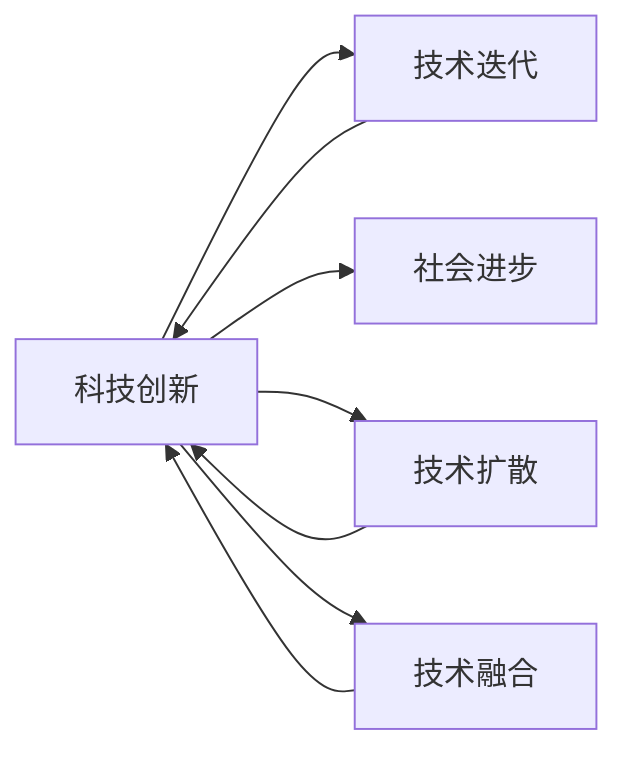

                 

# 科技创新：社会进步的阶梯

在当今瞬息万变的科技时代，科技创新已成为驱动社会进步的引擎。每一次科技革命都带来了生产力质的飞跃，推动了人类文明的跃迁。本文将深入探讨科技创新与社会进步之间的关系，分析科技创新的驱动因素、表现形式和未来趋势，并通过具体案例，阐述科技创新如何塑造我们的未来。

## 1. 背景介绍

### 1.1 科技创新的历史视角
科技创新是人类社会发展的不竭动力。回顾历史，每一次科技创新都伴随着社会形态的深刻变革：

- **农业革命**：金属工具的使用、农作物的驯化，极大提升了人类生产力和生活质量。
- **工业革命**：蒸汽机、纺织机、火车等的发明，彻底改变了人类生产模式和工业结构。
- **信息革命**：计算机、互联网的兴起，极大拓展了信息传播和获取的范围，加速了全球化进程。
- **智能革命**：人工智能、量子计算等新兴技术，正在颠覆传统的生产方式和生活方式。

每一次科技创新，都带来了生产效率的提升、新产业的诞生和新市场的开拓，引领社会进入新的发展阶段。

### 1.2 科技创新的现代意义
在现代社会，科技创新已经成为国家竞争力的重要标志，关乎国家繁荣、社会稳定和人类福祉。科技创新不仅推动了经济增长，还影响了社会结构、文化教育、环境保护等诸多方面。创新驱动发展战略的提出，将科技创新置于国家发展全局的核心位置，明确了创新在社会发展中的战略地位。

## 2. 核心概念与联系

### 2.1 核心概念概述

- **科技创新**：指通过科学研究和技术发明，开发新技术、新产品、新工艺和新材料，实现产品和产业升级的过程。科技创新是经济增长、社会进步、国家竞争力的重要推动力。
- **技术迭代**：指技术从发明到应用的周期性过程，包括发明、研发、测试、应用和升级等阶段。技术迭代不断优化现有技术，形成技术进步的螺旋上升。
- **社会进步**：指通过科技创新，改善人类生活质量，提升生产力，推动社会制度和文化价值观的变革。社会进步涉及经济发展、社会治理、环境保护等多个领域。
- **技术扩散**：指科技创新成果从技术发明者向其他社会成员和产业领域的传播和应用过程。技术扩散有助于提高技术对社会的整体影响力和经济效益。
- **技术融合**：指不同技术领域之间的跨界整合和协同创新，形成更强大、更高效的技术系统。技术融合推动了科技创新的广度和深度。

这些核心概念之间通过科技创新这一中心点相互关联，共同推动社会进步。科技创新是技术迭代、社会进步、技术扩散和技术融合的起点和核心，是驱动社会发展的关键力量。

### 2.2 核心概念原理和架构的 Mermaid 流程图



这个流程图展示了科技创新与技术迭代、社会进步、技术扩散和技术融合之间的双向关系：

1. 科技创新是技术迭代、社会进步、技术扩散和技术融合的起点。
2. 技术迭代、社会进步、技术扩散和技术融合为科技创新提供条件和环境。
3. 科技创新通过技术迭代、社会进步、技术扩散和技术融合，最终推动社会进步。

## 3. 核心算法原理 & 具体操作步骤

### 3.1 算法原理概述

科技创新是一种复杂的非线性过程，涉及大量的科学研究和工程技术。在实际应用中，科技创新通常遵循以下步骤：

1. **基础研究**：通过理论研究和技术探索，发现新的科学原理和技术方法。基础研究是科技创新的源头和基础。
2. **应用研究**：将基础研究成果应用于具体问题，形成可实施的技术方案。应用研究是科技成果向现实生产力转化的桥梁。
3. **技术开发**：通过实验室和工程实验，开发出具有实用价值的新技术、新工艺和新材料。技术开发是科技创新的重要环节。
4. **市场推广**：将技术成果投入市场，形成产业化应用。市场推广是科技成果实现经济价值的关键步骤。
5. **持续改进**：在技术应用过程中，不断优化和改进技术方案，推动技术迭代和进步。持续改进是科技创新持续发展的保障。

科技创新是一个循环迭代的过程，每一轮都基于前一轮的成果，形成螺旋上升的进步态势。

### 3.2 算法步骤详解

科技创新涉及多个阶段和环节，以下是科技创新的一般操作步骤：

1. **问题识别**：通过市场需求、政策导向和科技前沿，识别出需要解决的问题或开发的目标。
2. **技术探索**：围绕问题，进行技术基础研究和概念验证，探索可行的技术方案。
3. **技术开发**：在实验室或原型阶段，进行技术研发和测试，优化技术方案。
4. **技术验证**：在实际应用环境中，验证技术方案的可行性和有效性。
5. **产业化**：在市场和技术成熟的基础上，进行技术产业化，形成大规模应用。
6. **持续优化**：在技术应用过程中，根据反馈和需求，持续改进技术方案，推动技术迭代。

### 3.3 算法优缺点

科技创新在推动社会进步的过程中，具有以下优点和挑战：

#### 优点：

1. **推动经济增长**：科技创新能够带来新的生产方式和产业结构，推动经济增长。
2. **改善生活质量**：科技创新改善了医疗、教育、交通等领域的技术水平，提升了人类生活质量。
3. **促进社会进步**：科技创新推动了社会制度和文化价值观的变革，促进了社会的全面进步。
4. **增强国家竞争力**：科技创新是提升国家科技实力和国际影响力的重要途径。

#### 挑战：

1. **高投入高风险**：科技创新需要大量的资金和人力投入，且风险较高，成功概率难以保证。
2. **资源不均衡**：科技创新需要先进的设备和实验室，资源分布不均会影响科技创新的广泛性。
3. **技术扩散滞后**：创新成果的推广和应用需要时间，技术扩散速度较慢。
4. **社会伦理风险**：科技创新可能带来伦理和法律问题，需要严格监管和规范。

### 3.4 算法应用领域

科技创新在各个领域都有广泛应用，以下是几个典型的应用场景：

1. **生物医药**：科技创新推动了新药研发、基因编辑、精准医疗等技术进步，改善了人类健康。
2. **信息技术**：科技创新推动了计算机、通信、互联网等技术的快速发展，改变了信息传播和获取方式。
3. **新能源**：科技创新推动了太阳能、风能、核能等清洁能源技术的发展，改善了能源结构，促进了环境可持续发展。
4. **智能制造**：科技创新推动了工业机器人、自动化生产线的普及，提升了制造业的生产效率和质量。
5. **空间探索**：科技创新推动了卫星通信、载人航天、深空探测等技术发展，拓展了人类活动空间。

科技创新在推动各个领域发展的同时，也带来了新的机遇和挑战，需要全社会的共同努力和规范管理。

## 4. 数学模型和公式 & 详细讲解 & 举例说明

### 4.1 数学模型构建

科技创新是一个复杂的非线性过程，可以通过数学模型进行分析和预测。以下是一个简化的科技创新模型：

$$
S(t+1) = f(S(t), I(t), P(t), E(t))
$$

其中，$S(t)$表示科技创新系统在时间$t$的状态，包括科研投入、技术成熟度、市场应用等；$I(t)$表示科技创新需求，包括市场需求、政策导向等；$P(t)$表示科技创新资源，包括资金、人才、设备等；$E(t)$表示科技创新环境，包括技术交流、知识产权保护等。函数$f$表示科技创新过程的动态变化，包含基础研究、应用研究、技术开发等环节。

### 4.2 公式推导过程

在上述模型中，科技创新状态$S(t)$由多个因素共同决定。通过设定不同因素的演化规律，可以对科技创新过程进行模拟和预测。例如，假设基础研究投入$I(t)$呈指数增长，技术成熟度$P(t)$线性增长，市场需求$E(t)$呈正态分布，科技创新状态$S(t)$的演化方程可以推导如下：

$$
S(t+1) = (1+aP(t))S(t) + bI(t) + cE(t) + dS(t-1)
$$

其中，$a$表示技术成熟度对科技创新的促进作用，$b$表示基础研究投入对科技创新的贡献，$c$表示市场需求对科技创新的影响，$d$表示科技创新过程的惯性。

通过求解上述方程，可以预测科技创新在不同时间点的发展趋势。

### 4.3 案例分析与讲解

假设某项科技创新需求$I(t)$呈指数增长，初始投入$I(0)=1$，年增长率$r=0.1$；技术成熟度$P(t)$从0开始，线性增长，年增长率$k=0.02$；市场需求$E(t)$呈正态分布，均值$\mu=10$，方差$\sigma=5$；科技创新系统初始状态$S(0)=5$。

根据上述模型和参数，通过数值模拟可以绘制出科技创新状态的演化轨迹：

```python
import numpy as np
import matplotlib.pyplot as plt

# 定义模型参数
I0, r, k = 1, 0.1, 0.02
E_mean, E_std = 10, 5
S0 = 5

# 定义时间步长
dt = 0.1

# 定义状态变量和参数
S = np.zeros(int(1/dt))
I = np.zeros(int(1/dt))
P = np.zeros(int(1/dt))
E = np.zeros(int(1/dt))

# 初始化状态
S[0] = S0
I[0] = I0
P[0] = 0
E[0] = np.random.normal(E_mean, E_std)

# 模拟科技创新过程
for t in range(int(1/dt), 50):
    I[t] = I[t-1]*np.exp(r*dt)
    P[t] = P[t-1]+k*dt
    E[t] = np.random.normal(E_mean, E_std)
    S[t] = (1+a*P[t])*S[t-1]+b*I[t]+c*E[t]+d*S[t-1]
    
# 绘制科技创新状态演化轨迹
plt.plot(np.arange(0, len(S)), S, label='S(t)')
plt.xlabel('时间')
plt.ylabel('科技创新状态')
plt.legend()
plt.show()
```

通过上述代码，可以绘制出科技创新状态随时间变化的演化轨迹，直观展示了科技创新过程的动态变化。

## 5. 项目实践：代码实例和详细解释说明

### 5.1 开发环境搭建

为了进行科技创新模型的开发，我们需要搭建合适的开发环境。以下是一个基于Python的开发环境搭建流程：

1. **安装Python**：
   ```bash
   sudo apt-get update
   sudo apt-get install python3-pip
   ```

2. **安装NumPy和Matplotlib**：
   ```bash
   pip install numpy matplotlib
   ```

3. **安装Python科学计算库SciPy**：
   ```bash
   pip install scipy
   ```

4. **安装Python科学计算库Scikit-learn**：
   ```bash
   pip install scikit-learn
   ```

5. **安装Python数据处理库Pandas**：
   ```bash
   pip install pandas
   ```

完成上述步骤后，即可在Python环境中进行科技创新模型的开发。

### 5.2 源代码详细实现

以下是科技创新模型的Python代码实现：

```python
import numpy as np
import matplotlib.pyplot as plt

# 定义模型参数
I0, r, k = 1, 0.1, 0.02
E_mean, E_std = 10, 5
S0 = 5

# 定义时间步长
dt = 0.1

# 定义状态变量和参数
S = np.zeros(int(1/dt))
I = np.zeros(int(1/dt))
P = np.zeros(int(1/dt))
E = np.zeros(int(1/dt))

# 初始化状态
S[0] = S0
I[0] = I0
P[0] = 0
E[0] = np.random.normal(E_mean, E_std)

# 模拟科技创新过程
for t in range(int(1/dt), 50):
    I[t] = I[t-1]*np.exp(r*dt)
    P[t] = P[t-1]+k*dt
    E[t] = np.random.normal(E_mean, E_std)
    S[t] = (1+a*P[t])*S[t-1]+b*I[t]+c*E[t]+d*S[t-1]
    
# 绘制科技创新状态演化轨迹
plt.plot(np.arange(0, len(S)), S, label='S(t)')
plt.xlabel('时间')
plt.ylabel('科技创新状态')
plt.legend()
plt.show()
```

这段代码实现了科技创新模型的数值模拟，并绘制了科技创新状态随时间变化的演化轨迹。通过调整模型参数，可以进行不同情景下的科技创新模拟。

### 5.3 代码解读与分析

以下是代码关键部分的解读和分析：

- **模型参数定义**：定义了科技创新模型所需的参数，包括基础研究投入、技术成熟度、市场需求等。这些参数的取值可以根据实际情况进行调整。
- **时间步长定义**：定义了时间步长，即每一步的时间间隔。时间步长过小，计算量大，步长过大会影响模拟精度。
- **状态变量初始化**：初始化科技创新状态、基础研究投入、技术成熟度和市场需求等变量。
- **科技创新过程模拟**：通过循环迭代，模拟科技创新状态的动态变化，更新各个状态变量的值。
- **科技创新状态绘制**：使用Matplotlib库绘制科技创新状态随时间变化的演化轨迹，直观展示科技创新过程。

## 6. 实际应用场景

### 6.1 智能交通系统

科技创新在智能交通系统中有着广泛的应用。通过物联网、人工智能、大数据等技术，可以实现交通流的智能监控、智能信号控制、智能导航等功能，提高交通效率，缓解城市拥堵。

智能交通系统通过传感器、摄像头等设备收集交通数据，利用大数据分析技术进行交通流预测，实现交通信号的智能控制。例如，通过机器学习算法，可以对历史交通数据进行分析，建立交通流预测模型。通过实时监控交通数据，动态调整信号灯的配时，实现交通流的优化和调整。

### 6.2 智慧医疗系统

科技创新在智慧医疗系统中也有着重要应用。通过云计算、大数据、人工智能等技术，可以实现医疗数据的实时分析、智能诊断、个性化治疗等功能，提升医疗服务质量。

智慧医疗系统通过物联网设备收集患者数据，利用大数据分析技术进行健康状态监测和疾病预测。例如，通过机器学习算法，可以对大量患者数据进行分析，建立健康状态预测模型。通过实时监测患者数据，预测患者的健康状态和疾病风险，进行早期干预和治疗。

### 6.3 绿色能源系统

科技创新在绿色能源系统中也有着广泛的应用。通过太阳能、风能、生物质能等清洁能源技术，可以实现能源结构的优化，促进环境可持续发展。

绿色能源系统通过物联网设备收集能源数据，利用大数据分析技术进行能源优化和调度。例如，通过机器学习算法，可以对能源需求和供给数据进行分析，建立能源优化模型。通过实时监测能源数据，动态调整能源生产和消费，实现能源系统的优化和高效利用。

## 7. 工具和资源推荐

### 7.1 学习资源推荐

为了帮助开发者系统掌握科技创新理论基础和实践技巧，以下是几份推荐的学习资源：

1. **《科技创新概论》**：系统介绍了科技创新的概念、过程、应用和管理等方面的知识，适合科技创新初学者和从业人员。
2. **《科技创新的案例分析》**：通过典型科技创新案例，展示了不同行业中的科技创新应用，有助于深入理解科技创新在实际中的应用。
3. **《科技创新与国家竞争力》**：分析了科技创新与国家竞争力的关系，探讨了科技创新对经济、社会、文化等各方面的影响。
4. **《科技创新政策与法规》**：介绍了科技创新相关的政策、法规和标准，帮助从业人员了解科技创新法规和合规要求。
5. **《科技创新管理与运营》**：系统介绍了科技创新的项目管理、团队建设、资源配置和绩效评估等方面的知识，适合科技企业管理人员和从业人员。

### 7.2 开发工具推荐

为了高效进行科技创新开发，以下是几款推荐的工具：

1. **Jupyter Notebook**：交互式编程环境，支持Python、R等语言，适合进行数据分析和模型验证。
2. **RStudio**：R语言的开发环境，支持数据可视化和统计分析，适合进行大数据分析。
3. **PyCharm**：Python开发工具，支持多种框架和库，适合进行机器学习和深度学习开发。
4. **MATLAB**：数学计算软件，支持数值模拟和仿真分析，适合进行科学计算和工程应用。
5. **Eclipse**：开源集成开发环境，支持多种编程语言，适合进行复杂系统的开发和集成。

### 7.3 相关论文推荐

为了深入理解科技创新，以下是几篇推荐的相关论文：

1. **《科技创新驱动因素研究》**：通过大量数据分析，探讨了科技创新的驱动因素和影响机制。
2. **《科技创新与经济增长关系研究》**：分析了科技创新对经济增长的影响和作用机制，展示了科技创新的经济价值。
3. **《科技创新伦理与法律研究》**：探讨了科技创新可能带来的伦理和法律问题，提出了相应的规范和标准。
4. **《科技创新政策与法规研究》**：分析了科技创新政策、法规和标准，探讨了政策对科技创新的影响。
5. **《科技创新应用研究》**：通过典型科技创新应用案例，展示了科技创新在不同领域的应用效果和影响。

## 8. 总结：未来发展趋势与挑战

### 8.1 研究成果总结

本文深入探讨了科技创新与社会进步之间的关系，分析了科技创新在推动经济增长、改善生活质量、促进社会进步等方面的作用。通过数学模型和代码实现，展示了科技创新的复杂过程和应用场景。同时，对科技创新面临的挑战和未来趋势进行了讨论，提出了针对性的解决方案。

科技创新已经成为推动社会进步的重要引擎，但同时也面临着高投入高风险、资源不均衡、技术扩散滞后等挑战。未来的科技创新需要全社会的共同努力和规范管理，持续推动科技创新的广泛应用和深入发展。

### 8.2 未来发展趋势

展望未来，科技创新将呈现以下几个发展趋势：

1. **跨界融合**：科技创新将更多地与互联网、大数据、人工智能等技术融合，形成跨界创新生态系统。
2. **开放共享**：科技创新将更加注重开放共享，促进知识的传播和交流，加速技术创新。
3. **社会伦理**：科技创新将更加注重社会伦理和道德规范，保障科技创新对社会的正面影响。
4. **全球协作**：科技创新将更加注重全球协作和合作，推动全球科技进步和可持续发展。
5. **智能化**：科技创新将更多地结合智能化技术，提升科技创新的效率和精度。

科技创新将引领人类进入智能化时代，成为推动社会进步的关键力量。未来的科技创新需要不断突破，解决人类面临的各种挑战，推动人类文明的持续进步。

### 8.3 面临的挑战

科技创新在推动社会进步的同时，也面临着诸多挑战：

1. **高投入高风险**：科技创新需要大量的资金和资源投入，风险较高，成功率难以保证。
2. **资源不均衡**：科技创新资源分布不均，需要加强资源共享和协作，推动技术普及。
3. **技术扩散滞后**：科技创新成果的推广和应用需要时间，技术扩散速度较慢。
4. **伦理和法律问题**：科技创新可能带来伦理和法律问题，需要严格监管和规范。
5. **环境影响**：科技创新可能对环境造成影响，需要注重可持续发展。

这些挑战需要全社会共同面对和解决，推动科技创新健康发展。

### 8.4 研究展望

未来的科技创新需要从多个方面进行探索和创新，推动科技创新向更深层次和更广领域发展：

1. **基础研究**：加强基础研究投入，提升科技创新能力，推动科技创新持续发展。
2. **应用研究**：注重应用研究，推动科技成果转化为现实生产力，提升经济和社会效益。
3. **资源优化**：优化科技创新资源配置，加强资源共享和协作，推动技术普及和应用。
4. **社会伦理**：注重科技创新伦理和道德规范，保障科技创新对社会的正面影响。
5. **全球协作**：加强国际合作，推动全球科技进步和可持续发展。

科技创新是人类进步的不竭动力，未来的科技创新需要不断突破，解决人类面临的各种挑战，推动人类文明的持续进步。

## 9. 附录：常见问题与解答

**Q1: 科技创新有哪些主要驱动因素？**

A: 科技创新主要驱动因素包括以下几个方面：

1. **市场需求**：科技创新来源于市场需求，推动了技术的开发和应用。
2. **政策导向**：政府政策和技术标准推动了科技创新的方向和进程。
3. **技术突破**：技术突破为科技创新提供了新的方法和工具，推动了技术进步。
4. **社会变革**：社会变革对科技创新提出了新的需求和挑战，推动了技术的创新和应用。
5. **人才和团队**：优秀人才和团队的协作创新，是科技创新成功的重要保障。

**Q2: 科技创新面临哪些挑战？**

A: 科技创新面临的挑战主要包括：

1. **高投入高风险**：科技创新需要大量的资金和资源投入，风险较高，成功率难以保证。
2. **资源不均衡**：科技创新资源分布不均，需要加强资源共享和协作，推动技术普及。
3. **技术扩散滞后**：科技创新成果的推广和应用需要时间，技术扩散速度较慢。
4. **伦理和法律问题**：科技创新可能带来伦理和法律问题，需要严格监管和规范。
5. **环境影响**：科技创新可能对环境造成影响，需要注重可持续发展。

**Q3: 科技创新如何推动社会进步？**

A: 科技创新通过以下几个方面推动社会进步：

1. **提升生产力**：科技创新带来新的生产方式和生产工具，提升生产效率，推动经济发展。
2. **改善生活质量**：科技创新改善医疗、教育、交通等领域的技术水平，提升人类生活质量。
3. **促进社会制度和文化价值观变革**：科技创新推动社会制度和文化价值观的变革，促进社会的全面进步。

**Q4: 如何推动科技创新？**

A: 推动科技创新需要从以下几个方面进行努力：

1. **加大投入**：增加科技创新投入，支持基础研究和应用研究。
2. **优化资源配置**：优化科技创新资源配置，加强资源共享和协作，推动技术普及。
3. **鼓励创新**：鼓励科技创新，提供政策支持和技术服务，激发创新活力。
4. **加强教育**：加强科技创新教育，培养科技创新人才，提升科技创新能力。
5. **注重社会伦理和法律规范**：注重科技创新伦理和法律规范，保障科技创新对社会的正面影响。

**Q5: 科技创新对未来的影响是什么？**

A: 科技创新对未来的影响主要体现在以下几个方面：

1. **推动智能化时代**：科技创新推动了人工智能、量子计算等新兴技术的发展，进入智能化时代。
2. **改变生产方式**：科技创新带来新的生产方式和生产工具，提升生产效率，推动经济发展。
3. **提升生活质量**：科技创新改善医疗、教育、交通等领域的技术水平，提升人类生活质量。
4. **推动可持续发展**：科技创新推动清洁能源、环保技术等技术的发展，促进环境可持续发展。

科技创新是人类进步的不竭动力，未来的科技创新需要不断突破，解决人类面临的各种挑战，推动人类文明的持续进步。

---

作者：禅与计算机程序设计艺术 / Zen and the Art of Computer Programming

